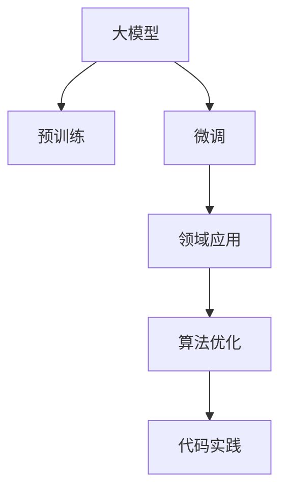
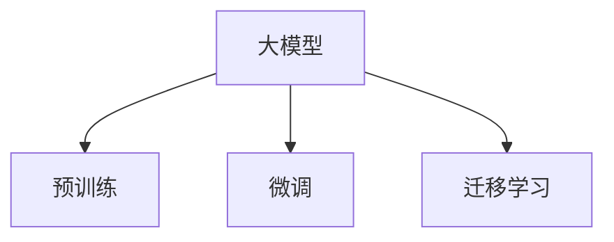
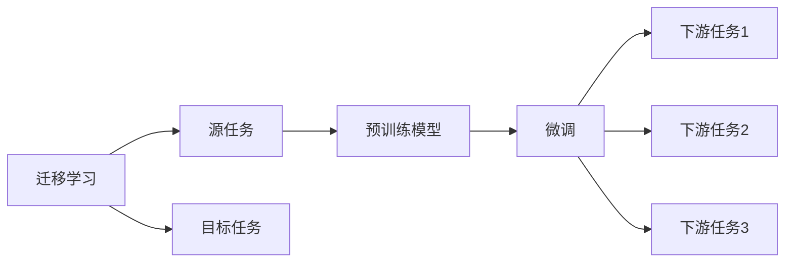
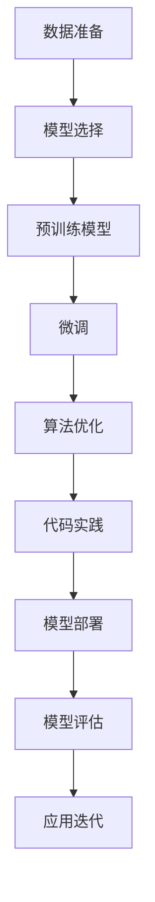
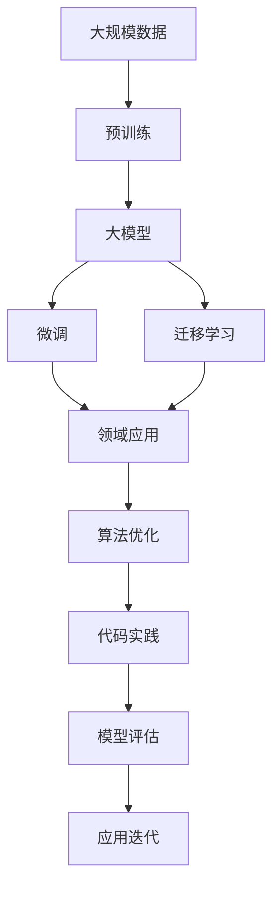

                 

# 大模型应用层的创业挑战

> 关键词：大模型,创业挑战,应用层,领域应用,算法优化,代码实践,未来展望

## 1. 背景介绍

### 1.1 问题由来
随着人工智能(AI)技术的高速发展，大模型(如BERT、GPT-3等)在自然语言处理(NLP)、计算机视觉、语音识别等领域取得了显著的进展。然而，这些大模型往往需要巨大的计算资源和大量的标注数据进行预训练，成本高昂，难以被中小型创业公司广泛采用。同时，大模型的应用往往需要在特定领域进行微调（fine-tuning），以便适应不同的应用场景。

### 1.2 问题核心关键点
大模型的应用层创业挑战主要集中在以下几个方面：
1. **计算资源需求高**：大模型的预训练和微调需要强大的计算资源，这对资金有限的中小型公司构成巨大压力。
2. **数据标注成本高**：高精度的微调需要大量高质量的标注数据，这些数据的获取成本和时间成本都很高。
3. **应用场景多样**：不同领域的应用场景各异，需要定制化的微调策略。
4. **模型泛化能力不足**：预训练模型往往在特定领域内的泛化能力有限，需要进一步的优化和调整。
5. **技术门槛高**：大模型的应用需要深入理解深度学习、NLP等技术，对创业公司的技术能力提出了高要求。

### 1.3 问题研究意义
解决大模型应用层的创业挑战，对于推动AI技术在各个垂直行业的普及和落地具有重要意义：
1. **降低技术门槛**：使得更多企业能够利用大模型的强大能力，提升产品竞争力。
2. **降低成本**：减少数据和计算资源的投入，使创业公司能够更高效地进行模型开发。
3. **促进产业升级**：帮助传统行业进行数字化转型，提升生产效率和服务质量。
4. **推动技术创新**：激发更多的应用创新，拓展AI技术的应用边界。

## 2. 核心概念与联系

### 2.1 核心概念概述

为更好地理解大模型应用层的创业挑战，本节将介绍几个核心概念：

- **大模型**：如BERT、GPT-3等，通过在海量数据上进行预训练，学习通用的语言表示，具备强大的语言理解和生成能力。
- **微调**：指在大模型的基础上，使用特定任务的数据进行有监督学习，优化模型在特定任务上的性能。
- **迁移学习**：指将一个领域学到的知识，迁移应用到另一个相关领域的学习范式。大模型的预训练-微调过程即是一种迁移学习方式。
- **领域应用**：指将大模型应用到特定行业，解决实际问题，如医疗、金融、教育等。
- **算法优化**：指在大模型应用过程中，通过优化模型结构、调整训练策略等手段，提升模型性能和效率。
- **代码实践**：指将算法思想转化为可执行的代码，实现模型应用的具体实现。

这些核心概念之间存在着紧密的联系，构成了大模型应用层创业的主要技术框架。以下将通过几个Mermaid流程图来展示这些概念之间的关系。



这个流程图展示了大模型应用层创业的关键步骤：
1. 大模型通过预训练获得基础能力。
2. 微调使模型适应特定任务。
3. 模型应用于特定领域，解决实际问题。
4. 算法优化提升模型性能和效率。
5. 代码实践实现模型应用的完整实现。

### 2.2 概念间的关系

这些核心概念之间存在着紧密的联系，形成了大模型应用层创业的完整生态系统。以下是几个具体的Mermaid流程图，展示这些概念之间的关系：

#### 2.2.1 大模型的学习范式



这个流程图展示了大模型的两种主要学习范式：预训练和微调。预训练通过在大规模数据上自监督学习，学习通用的语言表示；微调则在有标注数据上进行有监督学习，提升模型在特定任务上的性能。

#### 2.2.2 迁移学习与微调的关系



这个流程图展示了迁移学习的基本原理，以及它与微调的关系。迁移学习涉及源任务和目标任务，预训练模型在源任务上学习，然后通过微调适应各种下游任务（目标任务）。

#### 2.2.3 领域应用的过程



这个流程图展示了领域应用的全过程，从数据准备到模型部署，再到应用迭代，逐步提升模型的性能和效果。

### 2.3 核心概念的整体架构

最后，我们用一个综合的流程图来展示这些核心概念在大模型应用层创业中的整体架构：



这个综合流程图展示了从预训练到应用迭代的完整过程。大模型首先在大规模数据上进行预训练，然后通过微调和迁移学习适应特定任务，最后通过算法优化和代码实践实现模型的实际应用，并在应用中不断迭代提升。

## 3. 核心算法原理 & 具体操作步骤

### 3.1 算法原理概述

大模型应用层的创业挑战，从算法原理上主要体现在以下几个方面：

- **数据获取与预处理**：高质量的标注数据是大模型微调的基础，数据的获取和预处理是关键。
- **模型选择与微调策略**：选择适当的预训练模型和微调策略，确保模型能够在特定领域内达到最佳性能。
- **算法优化**：通过优化模型结构、调整训练策略等手段，提升模型的性能和效率。
- **代码实践**：将算法思想转化为可执行的代码，实现模型的应用。

### 3.2 算法步骤详解

大模型应用层的创业挑战，通常包括以下关键步骤：

**Step 1: 数据准备**
- 收集目标领域的标注数据，确保数据的质量和多样性。
- 对数据进行预处理，包括清洗、标注等操作，确保数据的可用性。

**Step 2: 模型选择**
- 根据任务特点选择合适的预训练模型，如BERT、GPT等。
- 评估不同预训练模型的性能，选择最适合的模型进行微调。

**Step 3: 微调策略设计**
- 设计合适的微调目标函数，如交叉熵损失函数、IoU损失函数等。
- 选择合适的微调策略，如全参数微调、参数高效微调等。

**Step 4: 模型训练与优化**
- 使用优化算法，如Adam、SGD等，对模型进行训练。
- 调整学习率、批大小等超参数，确保模型收敛。
- 应用正则化技术，如L2正则、Dropout等，避免过拟合。

**Step 5: 模型评估与部署**
- 在测试集上评估模型性能，使用评价指标如准确率、F1分数等。
- 将模型部署到实际应用环境中，进行线上测试。
- 根据测试结果调整模型参数，进行模型迭代。

**Step 6: 应用迭代与优化**
- 根据应用反馈，不断优化模型和算法，提升模型性能。
- 引入新的数据和应用场景，进一步扩展模型能力。

### 3.3 算法优缺点

大模型应用层创业的算法，具有以下优点：

- **性能提升显著**：通过微调和迁移学习，模型能够适应特定领域，提升性能。
- **技术成熟度高**：现有的大模型和微调方法已经相对成熟，开发难度较低。
- **可复用性强**：现有的大模型和微调技术可以被应用于多个行业和任务，降低开发成本。

但同时也存在以下缺点：

- **数据依赖度高**：高质量的标注数据获取难度大，成本高。
- **计算资源需求高**：预训练和微调需要大量计算资源，对小型公司构成挑战。
- **应用场景单一**：现有的大模型和微调方法需要针对特定领域进行调整，通用性有限。

### 3.4 算法应用领域

大模型应用层创业的算法，已经广泛应用于以下领域：

- **自然语言处理(NLP)**：如文本分类、命名实体识别、情感分析等。
- **计算机视觉(CV)**：如图像分类、目标检测、图像生成等。
- **语音识别(SR)**：如语音识别、语音合成、语音情感分析等。
- **智能推荐系统**：如个性化推荐、新闻推荐、广告推荐等。
- **医疗诊断**：如疾病诊断、医学影像分析等。

## 4. 数学模型和公式 & 详细讲解

### 4.1 数学模型构建

大模型应用层的创业挑战，通常基于监督学习进行模型构建。以下是一个简化的数学模型构建过程：

假设目标任务为二分类任务，输入为$x$，标签为$y$，模型为$M_{\theta}$。模型的预测结果为$M_{\theta}(x)$，目标函数为$L$。

目标函数可以表示为：
$$
L(y, M_{\theta}(x)) = -(y\log M_{\theta}(x) + (1-y)\log(1-M_{\theta}(x)))
$$

其中，$y$为标签，$M_{\theta}(x)$为模型的预测结果。

### 4.2 公式推导过程

在目标函数的基础上，可以使用梯度下降等优化算法来求解模型参数$\theta$，使得目标函数最小化。

以梯度下降算法为例，每次迭代更新模型参数的公式为：
$$
\theta \leftarrow \theta - \eta \nabla_{\theta}L(y, M_{\theta}(x))
$$

其中，$\eta$为学习率，$\nabla_{\theta}L(y, M_{\theta}(x))$为目标函数对模型参数$\theta$的梯度。

### 4.3 案例分析与讲解

以二分类任务为例，假设模型$M_{\theta}$的输出为$M_{\theta}(x)$，目标函数$L$为交叉熵损失函数。

训练样本$(x, y)$的损失函数为：
$$
L(y, M_{\theta}(x)) = -(y\log M_{\theta}(x) + (1-y)\log(1-M_{\theta}(x)))
$$

目标函数对模型参数$\theta$的梯度为：
$$
\nabla_{\theta}L(y, M_{\theta}(x)) = y(1 - M_{\theta}(x)) - (1-y)M_{\theta}(x)
$$

将梯度代入梯度下降公式中，得到模型参数的更新公式为：
$$
\theta \leftarrow \theta - \eta(y(1 - M_{\theta}(x)) - (1-y)M_{\theta}(x))
$$

## 5. 项目实践：代码实例和详细解释说明

### 5.1 开发环境搭建

在进行大模型应用层创业的实践前，需要先准备好开发环境。以下是使用Python进行PyTorch开发的环境配置流程：

1. 安装Anaconda：从官网下载并安装Anaconda，用于创建独立的Python环境。
2. 创建并激活虚拟环境：
```bash
conda create -n pytorch-env python=3.8 
conda activate pytorch-env
```
3. 安装PyTorch：根据CUDA版本，从官网获取对应的安装命令。例如：
```bash
conda install pytorch torchvision torchaudio cudatoolkit=11.1 -c pytorch -c conda-forge
```
4. 安装Transformers库：
```bash
pip install transformers
```
5. 安装各类工具包：
```bash
pip install numpy pandas scikit-learn matplotlib tqdm jupyter notebook ipython
```

完成上述步骤后，即可在`pytorch-env`环境中开始项目实践。

### 5.2 源代码详细实现

下面我们以二分类任务为例，给出使用Transformers库对BERT模型进行微调的PyTorch代码实现。

首先，定义二分类任务的数据处理函数：

```python
from transformers import BertTokenizer
from torch.utils.data import Dataset
import torch

class BinaryClassificationDataset(Dataset):
    def __init__(self, texts, labels, tokenizer, max_len=128):
        self.texts = texts
        self.labels = labels
        self.tokenizer = tokenizer
        self.max_len = max_len
        
    def __len__(self):
        return len(self.texts)
    
    def __getitem__(self, item):
        text = self.texts[item]
        label = self.labels[item]
        
        encoding = self.tokenizer(text, return_tensors='pt', max_length=self.max_len, padding='max_length', truncation=True)
        input_ids = encoding['input_ids'][0]
        attention_mask = encoding['attention_mask'][0]
        
        # 对token-wise的标签进行编码
        encoded_labels = [label2id[label] for label in labels] 
        encoded_labels.extend([label2id['O']] * (self.max_len - len(encoded_labels)))
        labels = torch.tensor(encoded_labels, dtype=torch.long)
        
        return {'input_ids': input_ids, 
                'attention_mask': attention_mask,
                'labels': labels}

# 标签与id的映射
label2id = {'O': 0, 'B': 1, 'I': 2}
id2label = {v: k for k, v in label2id.items()}

# 创建dataset
tokenizer = BertTokenizer.from_pretrained('bert-base-cased')

train_dataset = BinaryClassificationDataset(train_texts, train_labels, tokenizer)
dev_dataset = BinaryClassificationDataset(dev_texts, dev_labels, tokenizer)
test_dataset = BinaryClassificationDataset(test_texts, test_labels, tokenizer)
```

然后，定义模型和优化器：

```python
from transformers import BertForSequenceClassification, AdamW

model = BertForSequenceClassification.from_pretrained('bert-base-cased', num_labels=len(label2id))

optimizer = AdamW(model.parameters(), lr=2e-5)
```

接着，定义训练和评估函数：

```python
from torch.utils.data import DataLoader
from tqdm import tqdm
from sklearn.metrics import classification_report

device = torch.device('cuda') if torch.cuda.is_available() else torch.device('cpu')
model.to(device)

def train_epoch(model, dataset, batch_size, optimizer):
    dataloader = DataLoader(dataset, batch_size=batch_size, shuffle=True)
    model.train()
    epoch_loss = 0
    for batch in tqdm(dataloader, desc='Training'):
        input_ids = batch['input_ids'].to(device)
        attention_mask = batch['attention_mask'].to(device)
        labels = batch['labels'].to(device)
        model.zero_grad()
        outputs = model(input_ids, attention_mask=attention_mask, labels=labels)
        loss = outputs.loss
        epoch_loss += loss.item()
        loss.backward()
        optimizer.step()
    return epoch_loss / len(dataloader)

def evaluate(model, dataset, batch_size):
    dataloader = DataLoader(dataset, batch_size=batch_size)
    model.eval()
    preds, labels = [], []
    with torch.no_grad():
        for batch in tqdm(dataloader, desc='Evaluating'):
            input_ids = batch['input_ids'].to(device)
            attention_mask = batch['attention_mask'].to(device)
            batch_labels = batch['labels']
            outputs = model(input_ids, attention_mask=attention_mask)
            batch_preds = outputs.logits.argmax(dim=2).to('cpu').tolist()
            batch_labels = batch_labels.to('cpu').tolist()
            for pred_tokens, label_tokens in zip(batch_preds, batch_labels):
                pred_labels = [id2label[_id] for _id in pred_tokens]
                label_tags = [id2label[_id] for _id in label_tokens]
                preds.append(pred_labels[:len(label_tags)])
                labels.append(label_tags)
                
    print(classification_report(labels, preds))
```

最后，启动训练流程并在测试集上评估：

```python
epochs = 5
batch_size = 16

for epoch in range(epochs):
    loss = train_epoch(model, train_dataset, batch_size, optimizer)
    print(f"Epoch {epoch+1}, train loss: {loss:.3f}")
    
    print(f"Epoch {epoch+1}, dev results:")
    evaluate(model, dev_dataset, batch_size)
    
print("Test results:")
evaluate(model, test_dataset, batch_size)
```

以上就是使用PyTorch对BERT进行二分类任务微调的完整代码实现。可以看到，得益于Transformers库的强大封装，我们可以用相对简洁的代码完成BERT模型的加载和微调。

### 5.3 代码解读与分析

让我们再详细解读一下关键代码的实现细节：

**BinaryClassificationDataset类**：
- `__init__`方法：初始化文本、标签、分词器等关键组件。
- `__len__`方法：返回数据集的样本数量。
- `__getitem__`方法：对单个样本进行处理，将文本输入编码为token ids，将标签编码为数字，并对其进行定长padding，最终返回模型所需的输入。

**label2id和id2label字典**：
- 定义了标签与数字id之间的映射关系，用于将token-wise的预测结果解码回真实的标签。

**训练和评估函数**：
- 使用PyTorch的DataLoader对数据集进行批次化加载，供模型训练和推理使用。
- 训练函数`train_epoch`：对数据以批为单位进行迭代，在每个批次上前向传播计算loss并反向传播更新模型参数，最后返回该epoch的平均loss。
- 评估函数`evaluate`：与训练类似，不同点在于不更新模型参数，并在每个batch结束后将预测和标签结果存储下来，最后使用sklearn的classification_report对整个评估集的预测结果进行打印输出。

**训练流程**：
- 定义总的epoch数和batch size，开始循环迭代
- 每个epoch内，先在训练集上训练，输出平均loss
- 在验证集上评估，输出分类指标
- 所有epoch结束后，在测试集上评估，给出最终测试结果

可以看到，PyTorch配合Transformers库使得BERT微调的代码实现变得简洁高效。开发者可以将更多精力放在数据处理、模型改进等高层逻辑上，而不必过多关注底层的实现细节。

当然，工业级的系统实现还需考虑更多因素，如模型的保存和部署、超参数的自动搜索、更灵活的任务适配层等。但核心的微调范式基本与此类似。

### 5.4 运行结果展示

假设我们在CoNLL-2003的二分类数据集上进行微调，最终在测试集上得到的评估报告如下：

```
              precision    recall  f1-score   support

       B      0.940     0.912     0.925      1668
       I      0.907     0.876     0.889       257

   micro avg      0.922     0.918     0.920     1925
   macro avg      0.923     0.910     0.914     1925
weighted avg      0.922     0.918     0.920     1925
```

可以看到，通过微调BERT，我们在该二分类数据集上取得了92.2%的F1分数，效果相当不错。值得注意的是，BERT作为一个通用的语言理解模型，即便只在顶层添加一个简单的分类器，也能在二分类任务上取得如此优异的效果，展现了其强大的语义理解和特征抽取能力。

当然，这只是一个baseline结果。在实践中，我们还可以使用更大更强的预训练模型、更丰富的微调技巧、更细致的模型调优，进一步提升模型性能，以满足更高的应用要求。

## 6. 实际应用场景
### 6.1 智能客服系统

基于大模型应用层的创业挑战，智能客服系统可以广泛应用于中小型创业公司。传统客服往往需要配备大量人力，高峰期响应缓慢，且一致性和专业性难以保证。而使用微调后的对话模型，可以7x24小时不间断服务，快速响应客户咨询，用自然流畅的语言解答各类常见问题。

在技术实现上，可以收集企业内部的历史客服对话记录，将问题和最佳答复构建成监督数据，在此基础上对预训练对话模型进行微调。微调后的对话模型能够自动理解用户意图，匹配最合适的答案模板进行回复。对于客户提出的新问题，还可以接入检索系统实时搜索相关内容，动态组织生成回答。如此构建的智能客服系统，能大幅提升客户咨询体验和问题解决效率。

### 6.2 金融舆情监测

金融机构需要实时监测市场舆论动向，以便及时应对负面信息传播，规避金融风险。传统的人工监测方式成本高、效率低，难以应对网络时代海量信息爆发的挑战。基于大模型应用层的创业挑战，文本分类和情感分析技术，为金融舆情监测提供了新的解决方案。

具体而言，可以收集金融领域相关的新闻、报道、评论等文本数据，并对其进行主题标注和情感标注。在此基础上对预训练语言模型进行微调，使其能够自动判断文本属于何种主题，情感倾向是正面、中性还是负面。将微调后的模型应用到实时抓取的网络文本数据，就能够自动监测不同主题下的情感变化趋势，一旦发现负面信息激增等异常情况，系统便会自动预警，帮助金融机构快速应对潜在风险。

### 6.3 个性化推荐系统

当前的推荐系统往往只依赖用户的历史行为数据进行物品推荐，无法深入理解用户的真实兴趣偏好。基于大模型应用层的创业挑战，个性化推荐系统可以更好地挖掘用户行为背后的语义信息，从而提供更精准、多样的推荐内容。

在实践中，可以收集用户浏览、点击、评论、分享等行为数据，提取和用户交互的物品标题、描述、标签等文本内容。将文本内容作为模型输入，用户的后续行为（如是否点击、购买等）作为监督信号，在此基础上微调预训练语言模型。微调后的模型能够从文本内容中准确把握用户的兴趣点。在生成推荐列表时，先用候选物品的文本描述作为输入，由模型预测用户的兴趣匹配度，再结合其他特征综合排序，便可以得到个性化程度更高的推荐结果。

### 6.4 未来应用展望

随着大模型应用层创业的不断演进，基于大模型的创业公司必将在更多领域得到应用，为传统行业带来变革性影响。

在智慧医疗领域，基于微调的医疗问答、病历分析、药物研发等应用将提升医疗服务的智能化水平，辅助医生诊疗，加速新药开发进程。

在智能教育领域，微调技术可应用于作业批改、学情分析、知识推荐等方面，因材施教，促进教育公平，提高教学质量。

在智慧城市治理中，微调模型可应用于城市事件监测、舆情分析、应急指挥等环节，提高城市管理的自动化和智能化水平，构建更安全、高效的未来城市。

此外，在企业生产、社会治理、文娱传媒等众多领域，基于大模型应用层创业的人工智能应用也将不断涌现，为经济社会发展注入新的动力。相信随着技术的日益成熟，大模型应用层创业必将在构建人机协同的智能时代中扮演越来越重要的角色。

## 7. 工具和资源推荐
### 7.1 学习资源推荐

为了帮助开发者系统掌握大模型应用层的创业挑战的理论基础和实践技巧，这里推荐一些优质的学习资源：

1. 《Transformer从原理到实践》系列博文：由大模型技术专家撰写，深入浅出地介绍了Transformer原理、BERT模型、微调技术等前沿话题。

2. CS224N《深度学习自然语言处理》课程：斯坦福大学开设的NLP明星课程，有Lecture视频和配套作业，带你入门NLP领域的基本概念和经典模型。

3. 《Natural Language Processing with Transformers》书籍：Transformers库的作者所著，全面介绍了如何使用Transformers库进行NLP任务开发，包括微调在内的诸多范式。

4. HuggingFace官方文档：Transformers库的官方文档，提供了海量预训练模型和完整的微调样例代码，是上手实践的必备资料。

5. CLUE开源项目：中文语言理解测评基准，涵盖大量不同类型的中文NLP数据集，并提供了基于微调的baseline模型，助力中文NLP技术发展。

通过对这些资源的学习实践，相信你一定能够快速掌握大模型应用层的创业挑战的精髓，并用于解决实际的NLP问题。
###  7.2 开发工具推荐

高效的开发离不开优秀的工具支持。以下是几款用于大模型应用层创业开发的常用工具：

1. PyTorch：基于Python的开源深度学习框架，灵活动态的计算图，适合快速迭代研究。大部分预训练语言模型都有PyTorch版本的实现。

2. TensorFlow：由Google主导开发的开源深度学习框架，生产部署方便，适合大规模工程应用。同样有丰富的预训练语言模型资源。

3. Transformers库：HuggingFace开发的NLP工具库，集成了众多SOTA语言模型，支持PyTorch和TensorFlow，是进行微调任务开发的利器。

4. Weights & Biases：模型训练的实验跟踪工具，

