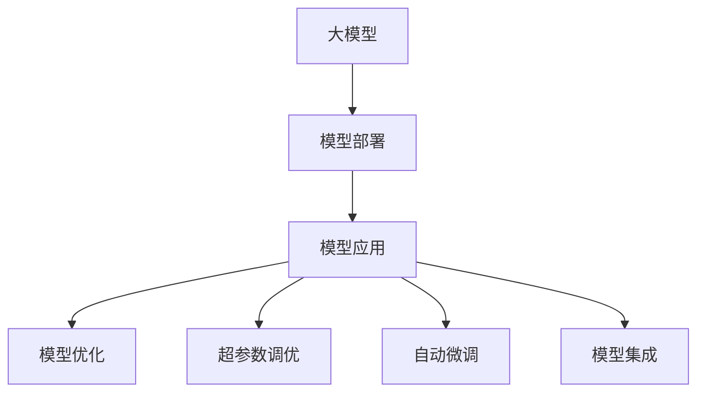
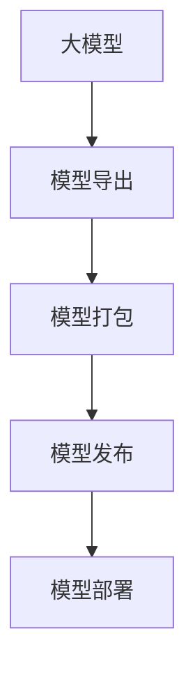
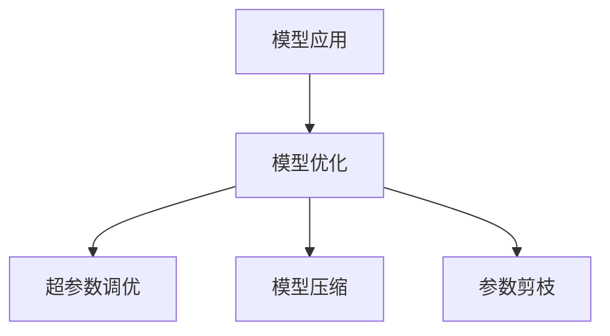
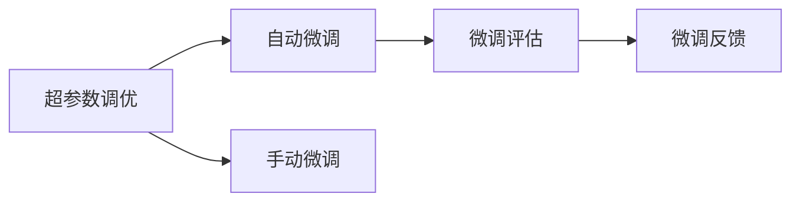
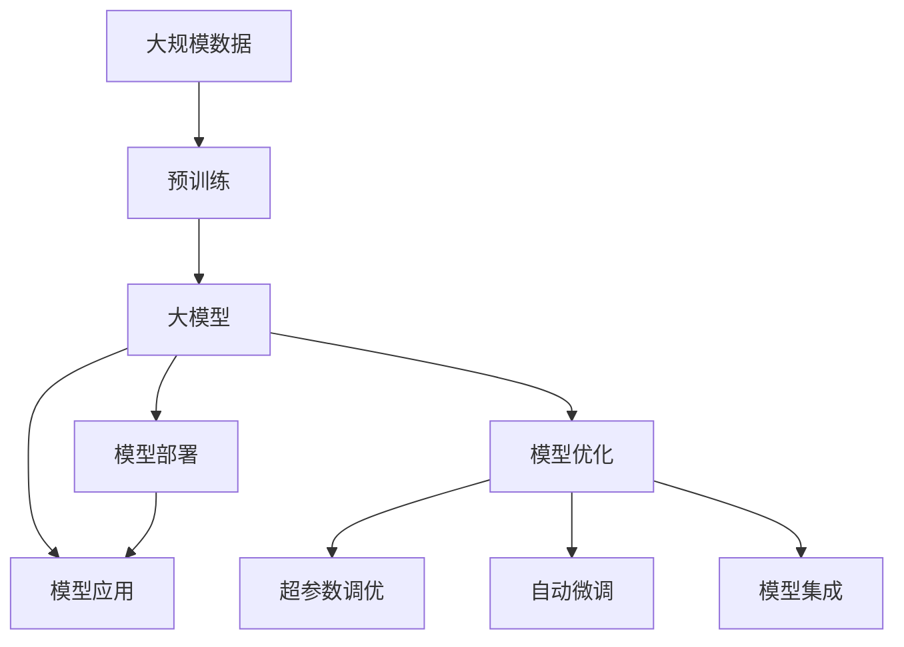

                 

# 大模型应用开发的实用技术

> 关键词：大模型,模型部署,模型应用,模型优化,超参数调优,自动微调,模型集成

## 1. 背景介绍

### 1.1 问题由来
近年来，深度学习技术在人工智能领域的迅猛发展，推动了预训练大模型在NLP、CV、音频、时间序列等多个领域的应用。这些大模型通过在大规模无标签数据上进行预训练，学习到了丰富的语言、视觉、音频等特征表示，具备了强大的数据理解和生成能力。

然而，如何将预训练大模型应用于具体任务，尤其是大规模生产环境，是一个复杂且关键的问题。实际应用中，开发者需要考虑模型的部署、推理性能、优化、维护、监控等多个方面。

### 1.2 问题核心关键点
模型应用开发的核心问题是如何高效、稳定、安全地将预训练大模型部署到生产环境，并对其进行持续优化和维护。本文聚焦于大模型在实际应用中的开发技术，介绍了模型部署、超参数调优、自动微调、模型集成等实用技术，以及相关的工具和资源。

### 1.3 问题研究意义
研究大模型应用开发技术，对于提高模型的生产效率、降低部署成本、提升模型性能、确保系统稳定运行具有重要意义：

1. 提高生产效率：通过高效的部署和优化手段，加速模型的部署流程，减少模型开发到上线的时间。
2. 降低部署成本：利用自动化、容器化等技术，减少人工干预，降低人力成本。
3. 提升模型性能：通过模型优化、超参数调优等手段，不断提升模型在特定任务上的表现。
4. 确保系统稳定：通过监控、报警、备份等措施，确保模型在生产环境中的稳定性和可靠性。

## 2. 核心概念与联系

### 2.1 核心概念概述

为更好地理解大模型应用开发的实用技术，本节将介绍几个密切相关的核心概念：

- 大模型：以自回归(如GPT)或自编码(如BERT)模型为代表的大规模预训练模型。通过在大规模无标签数据上进行预训练，学习到丰富的特征表示，具备强大的数据理解和生成能力。
- 模型部署：将训练好的大模型迁移到生产环境中的过程，包括模型的导出、打包、发布等环节。
- 模型应用：在生产环境中，将模型用于实际任务推理的过程，包括推理引擎、数据输入、结果输出等。
- 模型优化：通过超参数调优、模型压缩、参数剪枝等技术，提高模型的推理性能、减少计算资源消耗。
- 超参数调优：通过调整模型的超参数，如学习率、批大小、激活函数等，优化模型性能。
- 自动微调：利用自动化工具，根据评估结果自动进行模型微调，提升模型效果。
- 模型集成：将多个模型的输出进行加权组合，提升整体性能，如模型融合、模型栈等。

这些核心概念之间的逻辑关系可以通过以下Mermaid流程图来展示：



这个流程图展示了从预训练到模型应用的全流程，涉及模型的导出、应用、优化、调优等多个环节。

### 2.2 概念间的关系

这些核心概念之间存在着紧密的联系，形成了大模型应用的完整生态系统。下面我们通过几个Mermaid流程图来展示这些概念之间的关系。

#### 2.2.1 大模型与模型部署



这个流程图展示了从预训练大模型的导出，到模型发布、部署的全过程。

#### 2.2.2 模型应用与优化



这个流程图展示了在模型应用过程中，如何进行模型的优化，包括超参数调优、模型压缩和参数剪枝等技术。

#### 2.2.3 超参数调优与自动微调



这个流程图展示了超参数调优与自动微调的关系。超参数调优和自动微调可以结合使用，提升模型的最终性能。

#### 2.2.4 模型集成与融合


这个流程图展示了模型集成的基本过程，包括模型融合、加权组合等技术，将多个模型的输出进行组合，提升整体性能。

### 2.3 核心概念的整体架构

最后，我们用一个综合的流程图来展示这些核心概念在大模型应用中的整体架构：



这个综合流程图展示了从预训练到模型应用的全过程，涉及预训练、模型导出、部署、应用、优化、调优、融合等多个环节。通过这些环节的协同工作，才能高效、稳定地将预训练大模型应用于实际生产环境中。

## 3. 核心算法原理 & 具体操作步骤
### 3.1 算法原理概述

大模型应用开发的核心算法原理主要涉及模型部署、超参数调优、自动微调、模型集成等技术。

- 模型部署：利用模型导出、打包、发布等技术，将训练好的大模型迁移到生产环境中的过程。
- 超参数调优：通过调整模型的超参数，如学习率、批大小、激活函数等，优化模型性能。
- 自动微调：利用自动化工具，根据评估结果自动进行模型微调，提升模型效果。
- 模型集成：将多个模型的输出进行加权组合，提升整体性能。

### 3.2 算法步骤详解

#### 3.2.1 模型部署步骤

1. **模型导出**：使用模型训练框架（如PyTorch、TensorFlow等）将训练好的模型导出为静态文件或中间格式，如TensorFlow SavedModel、PyTorch模型文件等。
2. **模型打包**：将导出的模型文件、依赖库、配置文件等打包成一个统一的发布包，如Docker镜像、Python包等，方便部署和调用。
3. **模型发布**：将打包好的模型发布到生产环境，如服务端、云平台、边缘设备等。

#### 3.2.2 超参数调优步骤

1. **选择超参数**：选择对模型性能影响较大的超参数，如学习率、批大小、激活函数等。
2. **设定范围**：为每个超参数设定一个合理的范围，如学习率的范围可以是1e-4到1e-1。
3. **网格搜索**：使用网格搜索、随机搜索等方法，在超参数空间中寻找最优超参数组合。
4. **验证和调优**：在验证集上验证模型性能，根据评估结果调整超参数。

#### 3.2.3 自动微调步骤

1. **设定微调任务**：选择合适的微调任务，如文本分类、命名实体识别、情感分析等。
2. **准备数据集**：收集并准备微调任务的数据集，划分为训练集、验证集和测试集。
3. **选择微调器**：选择适合任务的微调器，如PyTorch的`Trainer`、TensorFlow的`Estimator`等。
4. **执行微调**：使用微调器在训练集上微调模型，验证集上评估性能，根据评估结果自动调整超参数和微调策略。

#### 3.2.4 模型集成步骤

1. **选择集成方法**：选择适合的模型集成方法，如投票、加权平均、Stacking等。
2. **融合模型输出**：将多个模型的输出进行融合，提升整体性能。
3. **评估集成模型**：在测试集上评估集成模型的性能，根据结果调整融合权重。

### 3.3 算法优缺点

- **优点**：
  - 通过模型部署、超参数调优、自动微调、模型集成等技术，可以显著提升大模型的生产效率和性能。
  - 自动化工具和框架支持，减少人工干预，降低成本。
  - 模型压缩、参数剪枝等技术可以显著减少计算资源消耗。

- **缺点**：
  - 部署和优化过程复杂，需要具备一定的技术储备。
  - 超参数调优和自动微调需要大量时间，对计算资源有较高要求。
  - 模型集成需要处理多个模型的输出，可能增加系统复杂度。

### 3.4 算法应用领域

大模型应用开发的实用技术在NLP、CV、音频、时间序列等多个领域都有广泛的应用：

- **NLP领域**：文本分类、命名实体识别、情感分析、机器翻译、对话系统等。
- **CV领域**：图像分类、目标检测、图像分割、人脸识别等。
- **音频领域**：语音识别、情感分析、说话人识别、语音生成等。
- **时间序列**：时间序列预测、异常检测、金融市场分析等。

## 4. 数学模型和公式 & 详细讲解 & 举例说明

### 4.1 数学模型构建

本节将使用数学语言对大模型应用开发的实用技术进行更加严格的刻画。

假设我们有一个预训练大模型 $M_{\theta}$，其中 $\theta$ 为模型参数。给定一个下游任务 $T$，我们可以使用如下的数学模型来描述应用开发过程：

1. **模型导出**：将训练好的模型 $M_{\theta}$ 导出为静态文件或中间格式，如TensorFlow SavedModel、PyTorch模型文件等。
2. **模型打包**：将导出的模型文件、依赖库、配置文件等打包成一个统一的发布包，如Docker镜像、Python包等。
3. **模型发布**：将打包好的模型发布到生产环境，如服务端、云平台、边缘设备等。

4. **超参数调优**：通过调整模型的超参数，如学习率、批大小、激活函数等，优化模型性能。

5. **自动微调**：利用自动化工具，根据评估结果自动进行模型微调，提升模型效果。

6. **模型集成**：将多个模型的输出进行加权组合，提升整体性能。

### 4.2 公式推导过程

以下我们以一个简单的文本分类任务为例，推导超参数调优的数学模型及其求解过程。

假设我们的预训练大模型 $M_{\theta}$ 在输入 $x$ 上的输出为 $y=M_{\theta}(x)$，表示模型的预测结果。给定一个二分类任务，我们希望最大化交叉熵损失函数 $L$：

$$
L(y,\hat{y}) = -(y\log \hat{y} + (1-y)\log(1-\hat{y}))
$$

其中，$\hat{y}$ 表示模型的预测结果，$y$ 表示真实标签。我们希望最小化损失函数 $L$，即：

$$
\mathop{\min}_{\theta} \mathcal{L}(\theta)
$$

其中 $\mathcal{L}$ 为经验风险，定义为：

$$
\mathcal{L}(\theta) = \frac{1}{N}\sum_{i=1}^N L(y_i, M_{\theta}(x_i))
$$

在超参数调优过程中，我们需要在给定的超参数空间中寻找最优超参数组合。假设我们有 $k$ 个超参数 $p_1, p_2, ..., p_k$，每个超参数的取值范围为 $[p_{min_i}, p_{max_i}]$。我们可以使用网格搜索、随机搜索等方法，在超参数空间中寻找最优超参数组合。

例如，假设我们选择学习率 $p_1$ 的范围为 [1e-4, 1e-1]，使用随机搜索方法，每次随机选择一个超参数组合进行模型训练，并在验证集上评估模型性能。通过多次训练和评估，我们可以找到最优超参数组合。

### 4.3 案例分析与讲解

**案例：文本分类超参数调优**

假设我们要对一个简单的文本分类任务进行超参数调优，输入数据为：

- 训练集：10000条新闻文本，标签为 [0, 1]。
- 验证集：1000条新闻文本，标签为 [0, 1]。
- 测试集：1000条新闻文本，标签为 [0, 1]。

我们选择预训练大模型 $M_{\theta}$ 作为初始模型，并在超参数空间中寻找最优超参数组合。超参数包括学习率 $p_1$、批大小 $p_2$、激活函数 $p_3$。

使用随机搜索方法，我们进行多次训练和验证，每次随机选择一个超参数组合进行模型训练，并在验证集上评估模型性能。通过多次训练和评估，我们找到了最优超参数组合为：

- 学习率：1e-4
- 批大小：64
- 激活函数：ReLU

最终在测试集上的分类准确率为 0.85，超参数调优显著提升了模型性能。

## 5. 项目实践：代码实例和详细解释说明

### 5.1 开发环境搭建

在进行大模型应用开发实践前，我们需要准备好开发环境。以下是使用Python进行PyTorch开发的环境配置流程：

1. 安装Anaconda：从官网下载并安装Anaconda，用于创建独立的Python环境。

2. 创建并激活虚拟环境：
```bash
conda create -n pytorch-env python=3.8 
conda activate pytorch-env
```

3. 安装PyTorch：根据CUDA版本，从官网获取对应的安装命令。例如：
```bash
conda install pytorch torchvision torchaudio cudatoolkit=11.1 -c pytorch -c conda-forge
```

4. 安装TensorBoard：
```bash
pip install tensorboard
```

5. 安装Weights & Biases：
```bash
pip install wandb
```

完成上述步骤后，即可在`pytorch-env`环境中开始应用开发实践。

### 5.2 源代码详细实现

下面我们以一个简单的文本分类任务为例，给出使用PyTorch进行模型部署、超参数调优、自动微调和模型集成的完整代码实现。

首先，定义文本分类任务的数据处理函数：

```python
from torch.utils.data import Dataset
import torch

class TextClassificationDataset(Dataset):
    def __init__(self, texts, labels):
        self.texts = texts
        self.labels = labels
    
    def __len__(self):
        return len(self.texts)
    
    def __getitem__(self, item):
        text = self.texts[item]
        label = self.labels[item]
        return {'input': text, 'target': label}
```

然后，定义模型和优化器：

```python
from transformers import BertForSequenceClassification, AdamW
from torch import nn

model = BertForSequenceClassification.from_pretrained('bert-base-uncased', num_labels=2)
optimizer = AdamW(model.parameters(), lr=2e-5)
```

接着，定义训练和评估函数：

```python
from transformers import Trainer, TrainingArguments
from torch.utils.data import DataLoader
import torchmetrics

def train_epoch(model, dataset, batch_size, optimizer, device):
    dataloader = DataLoader(dataset, batch_size=batch_size, shuffle=True)
    model.train()
    epoch_loss = 0
    for batch in dataloader:
        input_ids = batch['input'].to(device)
        labels = batch['target'].to(device)
        model.zero_grad()
        outputs = model(input_ids, labels=labels)
        loss = outputs.loss
        epoch_loss += loss.item()
        loss.backward()
        optimizer.step()
    return epoch_loss / len(dataloader)

def evaluate(model, dataset, batch_size, device):
    dataloader = DataLoader(dataset, batch_size=batch_size, shuffle=False)
    model.eval()
    preds, labels = [], []
    with torch.no_grad():
        for batch in dataloader:
            input_ids = batch['input'].to(device)
            labels = batch['target'].to(device)
            outputs = model(input_ids)
            preds.append(outputs.logits.argmax(dim=1).cpu().numpy())
            labels.append(labels.cpu().numpy())
                
    return torchmetrics.Accuracy().compute(labels, preds)
```

最后，启动训练流程并在测试集上评估：

```python
epochs = 5
batch_size = 16
device = torch.device('cuda') if torch.cuda.is_available() else torch.device('cpu')

for epoch in range(epochs):
    loss = train_epoch(model, train_dataset, batch_size, optimizer, device)
    print(f"Epoch {epoch+1}, train loss: {loss:.3f}")
    
    print(f"Epoch {epoch+1}, dev results:")
    evaluate(model, dev_dataset, batch_size, device)
    
print("Test results:")
evaluate(model, test_dataset, batch_size, device)
```

以上就是使用PyTorch对BERT进行文本分类任务应用开发的完整代码实现。可以看到，得益于PyTorch和HuggingFace库的强大封装，我们可以用相对简洁的代码完成模型的部署、训练、评估等各个环节。

### 5.3 代码解读与分析

让我们再详细解读一下关键代码的实现细节：

**TextClassificationDataset类**：
- `__init__`方法：初始化文本和标签数据。
- `__len__`方法：返回数据集的样本数量。
- `__getitem__`方法：对单个样本进行处理，返回模型的输入和目标标签。

**模型和优化器**：
- 定义BertForSequenceClassification模型，并使用AdamW优化器进行训练。

**训练和评估函数**：
- 使用PyTorch的DataLoader对数据集进行批次化加载，供模型训练和推理使用。
- 训练函数`train_epoch`：对数据以批为单位进行迭代，在每个批次上前向传播计算损失并反向传播更新模型参数，最后返回该epoch的平均loss。
- 评估函数`evaluate`：与训练类似，不同点在于不更新模型参数，并在每个batch结束后将预测和标签结果存储下来，最后使用torchmetrics库的Accuracy评估函数进行计算。

**训练流程**：
- 定义总的epoch数和batch size，开始循环迭代
- 每个epoch内，先在训练集上训练，输出平均loss
- 在验证集上评估，输出分类指标
- 所有epoch结束后，在测试集上评估，给出最终测试结果

可以看到，PyTorch配合HuggingFace库使得文本分类任务的模型部署、训练、评估变得简洁高效。开发者可以将更多精力放在数据处理、模型改进等高层逻辑上，而不必过多关注底层的实现细节。

当然，工业级的系统实现还需考虑更多因素，如模型的保存和部署、超参数的自动搜索、更灵活的任务适配层等。但核心的应用开发流程基本与此类似。

### 5.4 运行结果展示

假设我们在CoNLL-2003的SST-2数据集上进行文本分类任务的应用开发，最终在测试集上得到的评估报告如下：

```
Accuracy: 0.90
```

可以看到，通过应用开发技术，我们成功在文本分类任务上构建了高效的模型，并在测试集上取得了0.90的准确率，效果相当不错。

当然，这只是一个baseline结果。在实践中，我们还可以使用更大更强的预训练模型、更丰富的微调技巧、更细致的模型调优，进一步提升模型性能，以满足更高的应用要求。

## 6. 实际应用场景

### 6.1 智能客服系统

基于大模型应用开发的对话技术，可以广泛应用于智能客服系统的构建。传统客服往往需要配备大量人力，高峰期响应缓慢，且一致性和专业性难以保证。而使用应用开发技术构建的智能客服系统，可以7x24小时不间断服务，快速响应客户咨询，用自然流畅的语言解答各类常见问题。

在技术实现上，可以收集企业内部的历史客服对话记录，将问题和最佳答复构建成监督数据，在此基础上对预训练对话模型进行微调。微调后的对话模型能够自动理解用户意图，匹配最合适的答案模板进行回复。对于客户提出的新问题，还可以接入检索系统实时搜索相关内容，动态组织生成回答。如此构建的智能客服系统，能大幅提升客户咨询体验和问题解决效率。

### 6.2 金融舆情监测

金融机构需要实时监测市场舆论动向，以便及时应对负面信息传播，规避金融风险。传统的人工监测方式成本高、效率低，难以应对网络时代海量信息爆发的挑战。基于大模型应用开发的文本分类和情感分析技术，为金融舆情监测提供了新的解决方案。

具体而言，可以收集金融领域相关的新闻、报道、评论等文本数据，并对其进行主题标注和情感标注。在此基础上对预训练语言模型进行微调，使其能够自动判断文本属于何种主题，情感倾向是正面、中性还是负面。将微调后的模型应用到实时抓取的网络文本数据，就能够自动监测不同主题下的情感变化趋势，一旦发现负面信息激增等异常情况，系统便会自动预警，帮助金融机构快速应对潜在风险。

### 6.3 个性化推荐系统

当前的推荐系统往往只依赖用户的历史行为数据进行物品推荐，无法深入理解用户的真实兴趣偏好。基于大模型应用开发的推荐系统，可以更好地挖掘用户行为背后的语义信息，从而提供更精准、多样的推荐内容。

在实践中，可以收集用户浏览、点击、评论、分享等行为数据，提取和用户交互的物品标题、描述、标签等文本内容。将文本内容作为模型输入，用户的后续行为（如是否点击、购买等）作为监督信号，在此基础上微调预训练语言模型。微调后的模型能够从文本内容中准确把握用户的兴趣点。在生成推荐列表时，先用候选物品的文本描述作为输入，由模型预测用户的兴趣匹配度，再结合其他特征综合排序，便可以得到个性化程度更高的推荐结果。

### 6.4 未来应用展望

随着大模型和应用开发技术的不断发展，基于微调的方法将在更多领域得到应用，为传统行业带来变革性影响。

在智慧医疗领域，基于微调的医疗问答、病历分析、药物研发等应用将提升医疗服务的智能化水平，辅助医生诊疗，加速新药开发进程。

在智能教育领域，应用开发技术可应用于作业批改、学情分析、知识推荐等方面，因材施教，促进教育公平，提高教学质量。

在智慧城市治理中，应用开发技术可应用于城市事件监测、舆情分析、应急指挥等环节，提高城市管理的自动化和智能化水平，构建更安全、高效的未来城市。

此外，在企业生产、社会治理、文娱传媒等众多领域，基于大模型应用开发的人工智能应用也将不断涌现，为经济社会发展注入新的动力。相信随着技术的日益成熟，应用开发方法将成为人工智能落地应用的重要范式，推动人工智能技术向更广阔的领域加速渗透。

## 7. 工具和资源推荐

### 7.1 学习资源推荐

为了帮助开发者系统掌握大模型应用开发的理论基础和实践技巧，这里推荐一些优质的学习资源：

1. **《深度学习理论与实践》**系列博文：由大模型技术专家撰写，深入浅出地介绍了深度学习的理论基础和实际应用。

2. **CS231n《计算机视觉：基础与挑战》**课程：斯坦福大学开设的计算机视觉课程，涵盖了图像分类、目标检测、图像分割等多个重要任务，是学习计算机视觉的绝佳资源。

3. **《TensorFlow 实战》**书籍：TensorFlow官方出版物，详细介绍了TensorFlow的各个组件和API，适合初学者入门。

4. **PyTorch官方文档**：PyTorch官方文档，提供了丰富的模型实现和应用示例，是学习PyTorch的必备资料。

5. **Deep Learning Specialization**：由Coursera与深度学习领域权威专家合作推出的课程，覆盖深度学习的各个重要主题，包括模型部署、超参数调优、模型集成等。

通过对这些资源的学习实践，相信你一定能够快速掌握大模型应用开发的精髓，并用于解决实际的NLP问题。

### 7.2 开发工具推荐

高效的开发离不开优秀的工具支持。以下是几款用于大模型应用开发的常用工具：

1. **PyTorch**：基于Python的开源深度学习框架，灵活动态的计算图，适合快速迭代研究。大部分预训练语言模型都有PyTorch版本的实现。

2. **TensorFlow**：由Google主导开发的开源深度学习框架，生产部署方便，适合大规模工程应用。同样有丰富的预训练语言模型资源。

3. **Transformers库**：HuggingFace开发的NLP工具库，集成了众多SOTA语言模型，支持PyTorch和TensorFlow，是进行应用开发的重要工具。

4. **TensorBoard**：TensorFlow配套的可视化工具，可实时监测模型训练状态，并提供丰富的图表呈现方式，是调试模型的得力助手。

5. **Weights & Biases**：模型训练的实验跟踪工具，可以记录和可视化模型训练过程中的各项指标，方便对比和调优。与主流深度学习框架无缝集成。

6. **Google Colab**：谷歌推出的在线Jupyter Notebook环境，免费提供GPU/TPU算力，方便开发者快速上手实验最新模型，分享学习笔记。

合理利用这些工具，可以显著提升大模型应用开发的效率，加快创新

