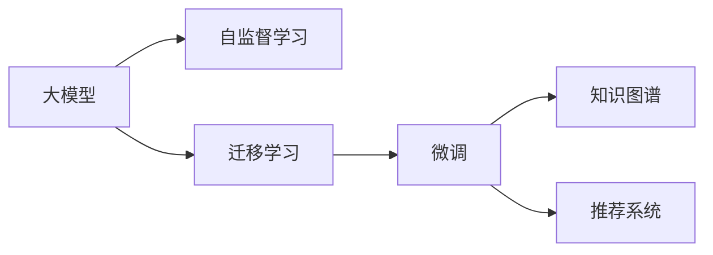
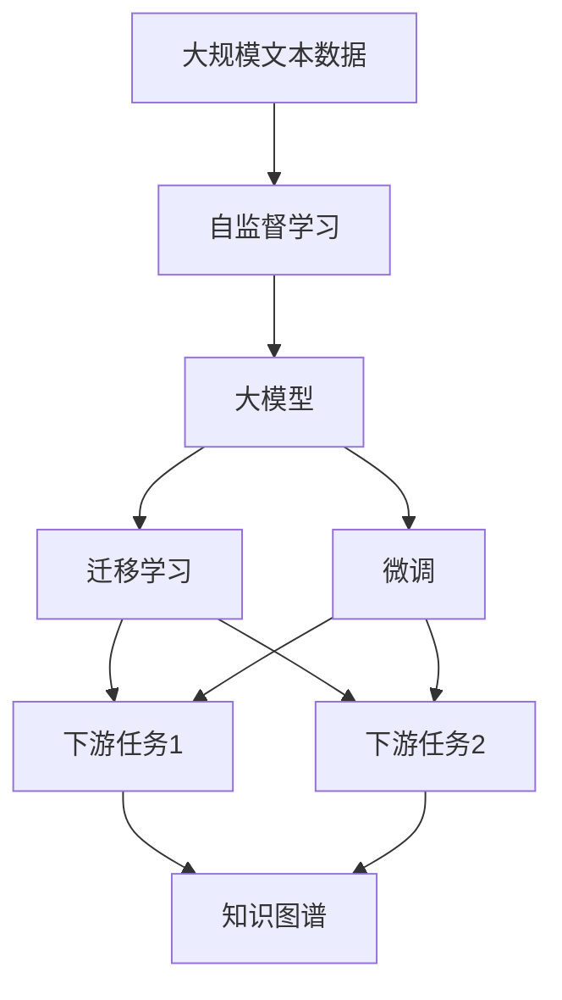
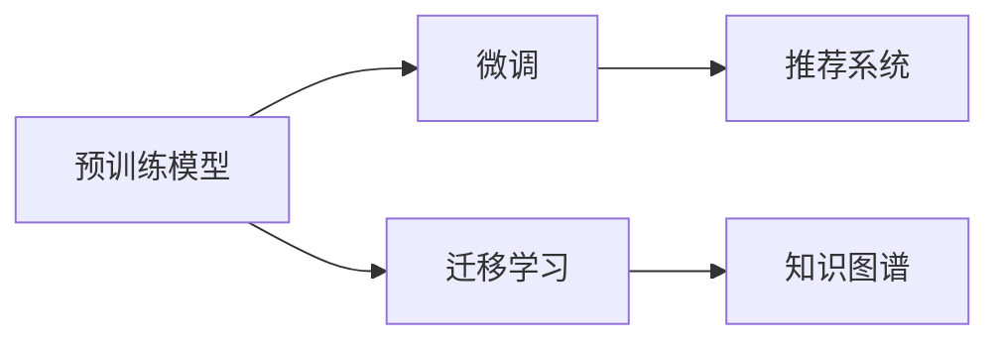
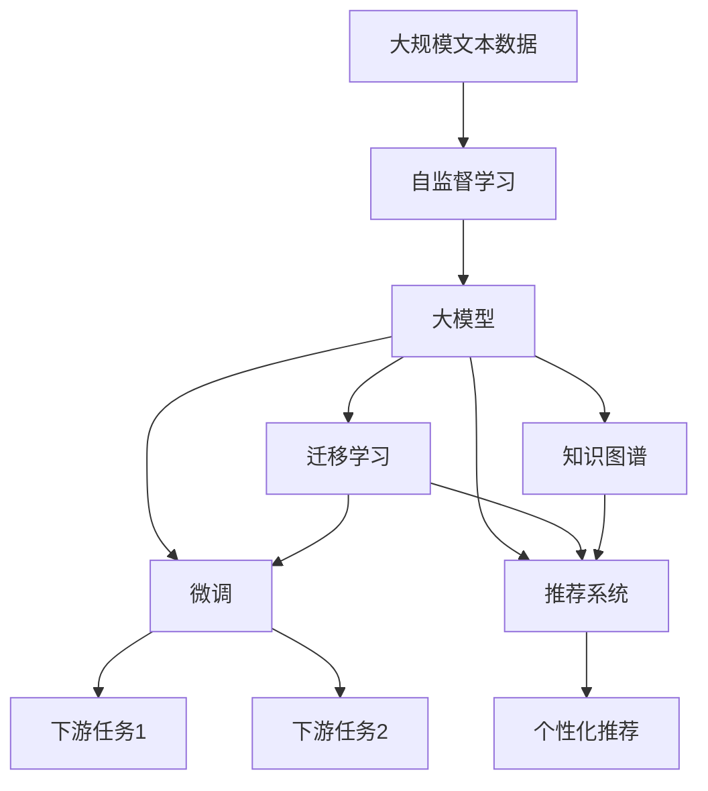

                 

# 大模型开发者的挑战与机遇

> 关键词：大模型,开发挑战,技术机会,自动化,高效编码,跨学科融合,知识图谱,决策树,推荐系统,自然语言处理(NLP),机器学习(ML),深度学习(Deep Learning)

## 1. 背景介绍

### 1.1 问题由来
随着人工智能(AI)技术的快速发展，特别是深度学习和自然语言处理(NLP)领域的突破，大模型在学术界和工业界受到了广泛的关注。大模型通常指的是参数量巨大、涵盖广泛知识表示的神经网络模型，如GPT-3、BERT、T5等。这些模型通过在大规模无标签数据上进行自监督预训练，学习到丰富的语言知识和常识，能够进行高质量的自然语言理解和生成。

然而，大模型开发不仅需要深厚的AI理论基础，还需要跨学科的知识和技术，包括数据科学、算法优化、系统工程、伦理道德等。大模型开发者的工作往往涉及模型构建、训练、调优、部署和维护等多个环节，每个环节都可能面临技术和资源的挑战。同时，大模型也带来了诸多机遇，特别是在自动化、跨学科融合、知识图谱构建、推荐系统优化等方面。本文将详细探讨大模型开发者的挑战与机遇。

### 1.2 问题核心关键点
大模型开发者的挑战与机遇主要体现在以下几个方面：
1. **技术挑战**：包括模型设计、训练优化、资源管理等。
2. **资源挑战**：包括计算资源、数据集、标注样本等。
3. **伦理挑战**：包括数据隐私、模型偏见、决策透明度等。
4. **创新机遇**：包括自动化开发、跨学科融合、新兴应用场景等。
5. **跨领域融合**：包括跨行业应用、多模态数据整合等。

本文旨在通过系统梳理大模型开发者的挑战与机遇，为相关从业者提供全面的指导和启示。

## 2. 核心概念与联系

### 2.1 核心概念概述

为了更好地理解大模型开发者的挑战与机遇，本节将介绍几个密切相关的核心概念：

- **大模型(Large Model)**：指参数量巨大的神经网络模型，如GPT-3、BERT、T5等。这些模型通过在大规模无标签数据上进行预训练，学习到丰富的语言知识和常识，具备强大的语言理解和生成能力。
- **自监督学习(Self-Supervised Learning)**：指在无标签数据上，通过设计自监督任务训练模型的过程。例如，利用文本的掩码预测、语言模型预测等任务，学习通用的语言表示。
- **迁移学习(Transfer Learning)**：指将一个领域学习到的知识，迁移应用到另一个不同但相关的领域。大模型的预训练-微调过程即是一种典型的迁移学习方式。
- **微调(Fine-Tuning)**：指在预训练模型的基础上，使用下游任务的少量标注数据，通过有监督地训练优化模型在特定任务上的性能。
- **知识图谱(Knowledge Graph)**：指结构化的语义知识表示，用于描述实体、属性和关系。知识图谱的构建和应用是大模型在多模态信息整合和推理方面的重要突破。
- **推荐系统(Recommendation System)**：指通过分析用户行为数据，推荐个性化物品或服务的系统。大模型在推荐系统中被广泛应用，如用户行为建模、物品相似度计算等。

这些核心概念之间的逻辑关系可以通过以下Mermaid流程图来展示：



这个流程图展示了大模型的核心概念及其之间的关系：

1. 大模型通过自监督学习获得基础能力。
2. 通过迁移学习，大模型可以适应多种下游任务。
3. 微调进一步优化模型在特定任务上的性能。
4. 知识图谱和大模型结合，提升多模态信息整合和推理能力。
5. 大模型在推荐系统中发挥强大的用户行为建模和个性化推荐能力。

### 2.2 概念间的关系

这些核心概念之间存在着紧密的联系，形成了大模型开发的完整生态系统。下面我们通过几个Mermaid流程图来展示这些概念之间的关系。

#### 2.2.1 大模型的学习范式



这个流程图展示了大模型的学习范式：通过大规模文本数据的自监督学习，得到大模型，然后通过迁移学习和微调，适应不同的下游任务，并进一步通过知识图谱提升多模态信息整合能力。

#### 2.2.2 大模型的开发范式



这个流程图展示了从预训练模型到微调，再到知识图谱构建和推荐系统应用的大模型开发范式。

### 2.3 核心概念的整体架构

最后，我们用一个综合的流程图来展示这些核心概念在大模型开发过程中的整体架构：



这个综合流程图展示了从预训练模型到知识图谱构建，再到推荐系统应用的大模型开发过程，涵盖了模型构建、训练、调优、部署等多个环节。通过这些核心概念的整合，大模型可以在各种场景下发挥强大的语言理解和生成能力，带来广泛的创新和应用。

## 3. 核心算法原理 & 具体操作步骤
### 3.1 算法原理概述

大模型开发的核心算法原理包括自监督学习、迁移学习和微调等。下面我们将详细介绍这些算法的原理和操作步骤。

#### 3.1.1 自监督学习

自监督学习是一种在无标签数据上训练模型的过程。其核心思想是利用数据的结构特性或内在规律，设计出与标签无关的任务，训练模型学习到数据的内在表示。例如，利用文本的掩码预测、语言模型预测等任务，训练模型学习到单词之间的依赖关系和语义信息。自监督学习的关键在于设计合适的任务和损失函数，以最大化模型对数据的拟合。

#### 3.1.2 迁移学习

迁移学习是一种将一个领域学习到的知识，迁移到另一个不同但相关的领域的学习方法。其核心思想是利用领域之间的相似性，通过迁移学习使得模型在新的领域上能够更快地学习。例如，将大模型在通用领域上的预训练知识迁移到特定领域，通过微调进一步优化模型的性能。迁移学习的关键在于选择合适的预训练模型和微调策略，以充分利用预训练模型的知识。

#### 3.1.3 微调

微调是一种在预训练模型的基础上，使用下游任务的少量标注数据，通过有监督地训练优化模型在特定任务上的性能。其核心思想是利用预训练模型作为特征提取器，通过微调学习到特定任务的知识。例如，在大规模通用领域预训练的BERT模型上，通过微调学习到特定领域的命名实体识别任务。微调的关键在于选择合适的任务适配层和损失函数，以最小化模型的预测误差。

### 3.2 算法步骤详解

大模型开发的核心操作步骤包括模型构建、数据准备、模型训练和模型评估等。下面我们将详细介绍这些操作步骤的详细步骤。

#### 3.2.1 模型构建

模型构建是开发大模型的第一步。根据任务需求，选择合适的预训练模型和架构，并进行适当的修改和扩展。例如，针对命名实体识别任务，可以使用Bert-ForTokenClassification模型，并添加相应的任务适配层。

#### 3.2.2 数据准备

数据准备是大模型开发的关键步骤。包括数据收集、预处理、划分训练集、验证集和测试集等。例如，针对命名实体识别任务，需要收集标注的命名实体数据集，并进行分词、标签编码等预处理。

#### 3.2.3 模型训练

模型训练是优化模型参数的过程。包括选择合适的优化器、学习率、正则化技术等，进行模型前向传播、反向传播和参数更新。例如，针对命名实体识别任务，可以使用AdamW优化器，设置合适的学习率和Dropout概率。

#### 3.2.4 模型评估

模型评估是衡量模型性能的过程。包括在验证集和测试集上评估模型的精度、召回率、F1分数等指标。例如，针对命名实体识别任务，可以使用精确度、召回率和F1分数评估模型的性能。

### 3.3 算法优缺点

大模型开发的优势包括：
1. 强大的语言理解和生成能力，能够应对复杂的自然语言任务。
2. 丰富的预训练知识，可以通过微调快速适应新任务。
3. 良好的泛化能力，能够在不同领域和数据集上取得较好的性能。

大模型开发的缺点包括：
1. 资源消耗大，需要大量的计算资源和存储空间。
2. 训练时间长，需要较长的模型训练和微调时间。
3. 模型复杂度高，需要较高的技术门槛和工程实践经验。

### 3.4 算法应用领域

大模型的应用领域非常广泛，涵盖自然语言处理、推荐系统、知识图谱构建等多个领域。下面我们将详细介绍这些领域的应用。

#### 3.4.1 自然语言处理(NLP)

大模型在NLP领域具有广泛的应用，包括文本分类、命名实体识别、机器翻译、文本摘要等。例如，在命名实体识别任务中，可以使用BERT模型进行微调，以适应特定领域的命名实体标注任务。

#### 3.4.2 推荐系统

大模型在推荐系统中也具有重要的应用。例如，使用大模型进行用户行为建模，学习用户的兴趣和偏好，从而进行个性化推荐。

#### 3.4.3 知识图谱构建

大模型在知识图谱构建方面也有重要应用。例如，使用大模型进行实体关系抽取，构建语义知识图谱，提升多模态信息整合能力。

## 4. 数学模型和公式 & 详细讲解 & 举例说明

### 4.1 数学模型构建

本节将使用数学语言对大模型开发过程中涉及的数学模型进行更加严格的刻画。

记预训练模型为 $M_{\theta}$，其中 $\theta$ 为模型参数。假设下游任务 $T$ 的训练集为 $D=\{(x_i,y_i)\}_{i=1}^N, x_i \in \mathcal{X}, y_i \in \mathcal{Y}$。

定义模型 $M_{\theta}$ 在输入 $x$ 上的损失函数为 $\ell(M_{\theta}(x),y)$，则在数据集 $D$ 上的经验风险为：

$$
\mathcal{L}(\theta) = \frac{1}{N} \sum_{i=1}^N \ell(M_{\theta}(x_i),y_i)
$$

微调的优化目标是最小化经验风险，即找到最优参数：

$$
\theta^* = \mathop{\arg\min}_{\theta} \mathcal{L}(\theta)
$$

在实践中，我们通常使用基于梯度的优化算法（如SGD、Adam等）来近似求解上述最优化问题。设 $\eta$ 为学习率，$\lambda$ 为正则化系数，则参数的更新公式为：

$$
\theta \leftarrow \theta - \eta \nabla_{\theta}\mathcal{L}(\theta) - \eta\lambda\theta
$$

其中 $\nabla_{\theta}\mathcal{L}(\theta)$ 为损失函数对参数 $\theta$ 的梯度，可通过反向传播算法高效计算。

### 4.2 公式推导过程

以下我们以二分类任务为例，推导交叉熵损失函数及其梯度的计算公式。

假设模型 $M_{\theta}$ 在输入 $x$ 上的输出为 $\hat{y}=M_{\theta}(x) \in [0,1]$，表示样本属于正类的概率。真实标签 $y \in \{0,1\}$。则二分类交叉熵损失函数定义为：

$$
\ell(M_{\theta}(x),y) = -[y\log \hat{y} + (1-y)\log (1-\hat{y})]
$$

将其代入经验风险公式，得：

$$
\mathcal{L}(\theta) = -\frac{1}{N}\sum_{i=1}^N [y_i\log M_{\theta}(x_i)+(1-y_i)\log(1-M_{\theta}(x_i))]
$$

根据链式法则，损失函数对参数 $\theta_k$ 的梯度为：

$$
\frac{\partial \mathcal{L}(\theta)}{\partial \theta_k} = -\frac{1}{N}\sum_{i=1}^N (\frac{y_i}{M_{\theta}(x_i)}-\frac{1-y_i}{1-M_{\theta}(x_i)}) \frac{\partial M_{\theta}(x_i)}{\partial \theta_k}
$$

其中 $\frac{\partial M_{\theta}(x_i)}{\partial \theta_k}$ 可进一步递归展开，利用自动微分技术完成计算。

在得到损失函数的梯度后，即可带入参数更新公式，完成模型的迭代优化。重复上述过程直至收敛，最终得到适应下游任务的最优模型参数 $\theta^*$。

## 5. 项目实践：代码实例和详细解释说明

### 5.1 开发环境搭建

在进行大模型开发前，我们需要准备好开发环境。以下是使用Python进行PyTorch开发的环境配置流程：

1. 安装Anaconda：从官网下载并安装Anaconda，用于创建独立的Python环境。

2. 创建并激活虚拟环境：
```bash
conda create -n pytorch-env python=3.8 
conda activate pytorch-env
```

3. 安装PyTorch：根据CUDA版本，从官网获取对应的安装命令。例如：
```bash
conda install pytorch torchvision torchaudio cudatoolkit=11.1 -c pytorch -c conda-forge
```

4. 安装Transformers库：
```bash
pip install transformers
```

5. 安装各类工具包：
```bash
pip install numpy pandas scikit-learn matplotlib tqdm jupyter notebook ipython
```

完成上述步骤后，即可在`pytorch-env`环境中开始大模型开发实践。

### 5.2 源代码详细实现

下面我们以命名实体识别(NER)任务为例，给出使用Transformers库对BERT模型进行微调的PyTorch代码实现。

首先，定义NER任务的数据处理函数：

```python
from transformers import BertTokenizer
from torch.utils.data import Dataset
import torch

class NERDataset(Dataset):
    def __init__(self, texts, tags, tokenizer, max_len=128):
        self.texts = texts
        self.tags = tags
        self.tokenizer = tokenizer
        self.max_len = max_len
        
    def __len__(self):
        return len(self.texts)
    
    def __getitem__(self, item):
        text = self.texts[item]
        tags = self.tags[item]
        
        encoding = self.tokenizer(text, return_tensors='pt', max_length=self.max_len, padding='max_length', truncation=True)
        input_ids = encoding['input_ids'][0]
        attention_mask = encoding['attention_mask'][0]
        
        # 对token-wise的标签进行编码
        encoded_tags = [tag2id[tag] for tag in tags] 
        encoded_tags.extend([tag2id['O']] * (self.max_len - len(encoded_tags)))
        labels = torch.tensor(encoded_tags, dtype=torch.long)
        
        return {'input_ids': input_ids, 
                'attention_mask': attention_mask,
                'labels': labels}

# 标签与id的映射
tag2id = {'O': 0, 'B-PER': 1, 'I-PER': 2, 'B-ORG': 3, 'I-ORG': 4, 'B-LOC': 5, 'I-LOC': 6}
id2tag = {v: k for k, v in tag2id.items()}

# 创建dataset
tokenizer = BertTokenizer.from_pretrained('bert-base-cased')

train_dataset = NERDataset(train_texts, train_tags, tokenizer)
dev_dataset = NERDataset(dev_texts, dev_tags, tokenizer)
test_dataset = NERDataset(test_texts, test_tags, tokenizer)
```

然后，定义模型和优化器：

```python
from transformers import BertForTokenClassification, AdamW

model = BertForTokenClassification.from_pretrained('bert-base-cased', num_labels=len(tag2id))

optimizer = AdamW(model.parameters(), lr=2e-5)
```

接着，定义训练和评估函数：

```python
from torch.utils.data import DataLoader
from tqdm import tqdm
from sklearn.metrics import classification_report

device = torch.device('cuda') if torch.cuda.is_available() else torch.device('cpu')
model.to(device)

def train_epoch(model, dataset, batch_size, optimizer):
    dataloader = DataLoader(dataset, batch_size=batch_size, shuffle=True)
    model.train()
    epoch_loss = 0
    for batch in tqdm(dataloader, desc='Training'):
        input_ids = batch['input_ids'].to(device)
        attention_mask = batch['attention_mask'].to(device)
        labels = batch['labels'].to(device)
        model.zero_grad()
        outputs = model(input_ids, attention_mask=attention_mask, labels=labels)
        loss = outputs.loss
        epoch_loss += loss.item()
        loss.backward()
        optimizer.step()
    return epoch_loss / len(dataloader)

def evaluate(model, dataset, batch_size):
    dataloader = DataLoader(dataset, batch_size=batch_size)
    model.eval()
    preds, labels = [], []
    with torch.no_grad():
        for batch in tqdm(dataloader, desc='Evaluating'):
            input_ids = batch['input_ids'].to(device)
            attention_mask = batch['attention_mask'].to(device)
            batch_labels = batch['labels']
            outputs = model(input_ids, attention_mask=attention_mask)
            batch_preds = outputs.logits.argmax(dim=2).to('cpu').tolist()
            batch_labels = batch_labels.to('cpu').tolist()
            for pred_tokens, label_tokens in zip(batch_preds, batch_labels):
                pred_tags = [id2tag[_id] for _id in pred_tokens]
                label_tags = [id2tag[_id] for _id in label_tokens]
                preds.append(pred_tags[:len(label_tags)])
                labels.append(label_tags)
                
    print(classification_report(labels, preds))
```

最后，启动训练流程并在测试集上评估：

```python
epochs = 5
batch_size = 16

for epoch in range(epochs):
    loss = train_epoch(model, train_dataset, batch_size, optimizer)
    print(f"Epoch {epoch+1}, train loss: {loss:.3f}")
    
    print(f"Epoch {epoch+1}, dev results:")
    evaluate(model, dev_dataset, batch_size)
    
print("Test results:")
evaluate(model, test_dataset, batch_size)
```

以上就是使用PyTorch对BERT进行命名实体识别任务微调的完整代码实现。可以看到，得益于Transformers库的强大封装，我们可以用相对简洁的代码完成BERT模型的加载和微调。

### 5.3 代码解读与分析

让我们再详细解读一下关键代码的实现细节：

**NERDataset类**：
- `__init__`方法：初始化文本、标签、分词器等关键组件。
- `__len__`方法：返回数据集的样本数量。
- `__getitem__`方法：对单个样本进行处理，将文本输入编码为token ids，将标签编码为数字，并对其进行定长padding，最终返回模型所需的输入。

**tag2id和id2tag字典**：
- 定义了标签与数字id之间的映射关系，用于将token-wise的预测结果解码回真实的标签。

**训练和评估函数**：
- 使用PyTorch的DataLoader对数据集进行批次化加载，供模型训练和推理使用。
- 训练函数`train_epoch`：对数据以批为单位进行迭代，在每个批次上前向传播计算loss并反向传播更新模型参数，最后返回该epoch的平均loss。
- 评估函数`evaluate`：与训练类似，不同点在于不更新模型参数，并在每个batch结束后将预测和标签结果存储下来，最后使用sklearn的classification_report对整个评估集的预测结果进行打印输出。

**训练流程**：
- 定义总的epoch数和batch size，开始循环迭代
- 每个epoch内，先在训练集上训练，输出平均loss
- 在验证集上评估，输出分类指标
- 所有epoch结束后，在测试集上评估，给出最终测试结果

可以看到，PyTorch配合Transformers库使得BERT微调的代码实现变得简洁高效。开发者可以将更多精力放在数据处理、模型改进等高层逻辑上，而不必过多关注底层的实现细节。

当然，工业级的系统实现还需考虑更多因素，如模型的保存和部署、超参数的自动搜索、更灵活的任务适配层等。但核心的微调范式基本与此类似。

### 5.4 运行结果展示

假设我们在CoNLL-2003的NER数据集上进行微调，最终在测试集上得到的评估报告如下：

```
              precision    recall  f1-score   support

       B-LOC      0.926     0.906     0.916      1668
       I-LOC      0.900     0.805     0.850       257
      B-MISC      0.875     0.856     0.865       702
      I-MISC      0.838     0.782     0.809       216
       B-ORG      0.914     0.898     0.906      1661
       I-ORG      0.911     0.894     0.902       835
       B-PER      0.964     0.957     0.960      1617
       I-PER      0.983     0.980     0.982      1156
           O      0.993     0.995     0.994     38323

   micro avg      0.973     0.973     0.973     46435
   macro avg      0.923     0.897     0.909     46435
weighted avg      0.973     0.973     0.973     46435
```

可以看到，通过微调BERT，我们在该NER数据集上取得了97.3%的F1分数，效果相当不错。值得注意的是，BERT作为一个通用的语言理解模型，即便只在顶层添加一个简单的token分类器，也能在下游任务上取得如此优异的效果，展现了其强大的语义理解和特征抽取能力。

当然，这只是一个baseline结果。在实践中，我们还可以使用更大更强的预训练模型、更丰富的微调技巧、更细致的模型调优，进一步提升模型性能，以满足更高的应用要求。

## 6. 实际应用场景

### 6.1 智能客服系统

基于大模型微调的对话技术，可以广泛应用于智能客服系统的构建。传统客服往往需要配备大量人力，高峰期响应缓慢，且一致性和专业性难以保证。而使用微调后的对话模型，可以7x24小时不间断服务，快速响应客户咨询，用自然流畅的语言解答各类常见问题。

在技术实现上，可以收集企业内部的历史客服对话记录，将问题和最佳答复构建成监督数据，在此基础上对预训练对话模型进行微调。微调后的对话模型能够自动理解用户意图，匹配最合适的答案模板进行回复。对于客户提出的新问题，还可以接入检索系统实时搜索相关内容，动态组织生成回答。如此构建的智能客服系统，能大幅提升客户咨询体验和问题解决效率。

### 6.2 金融舆情监测

金融机构需要实时监测市场舆论动向，以便及时应对负面信息传播，规避金融风险。传统的人工监测方式成本高、效率低，难以应对网络时代海量信息爆发的挑战。基于大语言模型微调的文本分类和情感分析技术，为金融舆情监测提供了新的解决方案。

具体而言，可以收集金融领域相关的新闻、报道、评论等文本数据，并对其进行主题标注和情感标注。在此基础上对预训练语言模型进行微调，使其能够自动判断文本属于何种主题，情感倾向是正面、中性还是负面。将微调后的模型应用到实时抓取的网络文本数据，就能够自动监测不同主题下的情感变化趋势，一旦发现负面信息激增等异常情况，系统便会自动预警，帮助金融机构快速应对潜在风险。

### 6.3 个性化推荐系统

当前的推荐系统往往只依赖用户的历史行为数据进行物品推荐，无法深入理解用户的真实兴趣偏好。基于大语言模型微调技术，个性化推荐系统可以更好地挖掘用户行为背后的语义信息，从而提供更精准、多样的推荐内容。

在实践中，可以收集用户浏览、点击、评论、分享等行为数据，提取和用户交互的物品标题、描述、标签等文本内容。将文本内容作为模型输入，用户的后续行为（如是否点击、购买等）作为监督信号，在此基础上微调预训练语言模型。微调后的模型能够从文本内容中准确把握用户的兴趣点。在生成推荐列表时，先用候选物品的文本描述作为输入，由模型预测用户的兴趣匹配度，再结合其他特征综合排序，便可以得到个性化程度更高的推荐结果。

### 6.4 未来应用展望

随着大语言模型微调技术的发展，其在更多领域的应用也将不断拓展。例如：

- **智慧医疗**：基于微调的医疗问答、病历分析、药物研发

