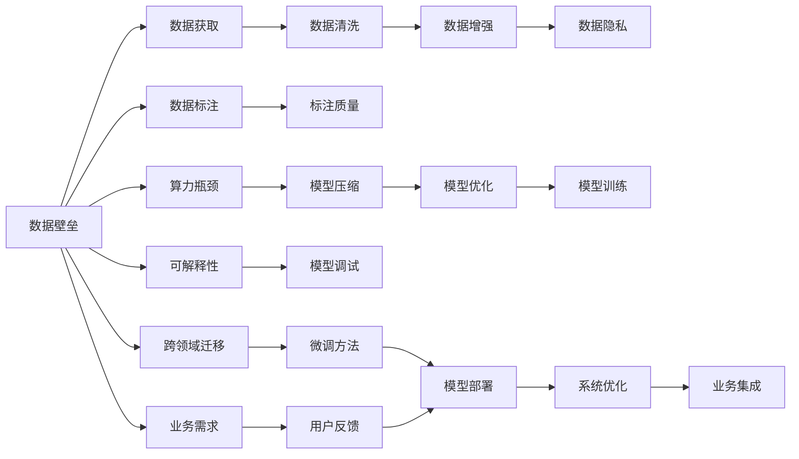

                 

## 1. 背景介绍

随着人工智能技术的飞速发展，大模型在各种领域的应用日趋广泛，从自然语言处理、计算机视觉到推荐系统、药物研发，大模型无所不在。然而，在享受大模型带来的便利的同时，创业公司也面临着前所未有的挑战，尤其是在数据壁垒与算力瓶颈方面。大模型需要大量的数据进行训练，而算力也成为了其计算效率的决定性因素。本文将深入探讨大模型时代创业公司在数据获取与处理、算力资源分配与优化方面的新挑战，并提供相应的解决方案。

## 2. 核心概念与联系

### 2.1 核心概念概述

在大模型时代，创业公司面临的核心概念主要包括以下几个方面：

- **数据壁垒**：大模型需要海量数据进行训练，但高质量的数据获取往往存在壁垒，尤其是对垂直行业数据。

- **算力瓶颈**：大规模模型需要强大的算力支持，尤其是在模型参数量不断增长的今天，如何高效利用算力成为一大挑战。

- **数据隐私与合规**：在数据获取与处理过程中，如何保障数据隐私和合规，是大模型应用的重要课题。

- **模型优化与压缩**：模型优化与压缩技术可以有效提升大模型的计算效率，但实际操作中仍需权衡模型性能与计算资源。

- **可解释性与鲁棒性**：大模型的决策过程复杂，可解释性和鲁棒性成为应用中必须考虑的问题。

- **跨领域迁移能力**：大模型应具备较强的跨领域迁移能力，以适应不同领域的微调需求。

### 2.2 概念间的关系

这些核心概念之间存在紧密的联系，通过以下Mermaid流程图展示：



## 3. 核心算法原理 & 具体操作步骤

### 3.1 算法原理概述

在数据壁垒与算力瓶颈面前，大模型的训练与优化变得尤为复杂。传统的模型训练过程通常需要高昂的数据获取和标注成本，而且需要高效的算力支持。因此，如何克服这些挑战，成为创业公司需要解决的核心问题。

- **数据壁垒**：在创业初期，数据获取往往是第一步。高质量的数据集可以极大地提升模型性能，但高质量数据的获取往往需要投入大量人力物力，甚至面临知识产权和隐私保护的问题。

- **算力瓶颈**：算力是大模型训练的另一大瓶颈。传统的训练方法需要高性能GPU或TPU等设备，这对中小型创业公司而言是一个沉重的负担。

- **数据隐私与合规**：在数据处理过程中，如何保护数据隐私，遵循相关法律法规，是大模型应用中不可忽视的问题。

- **模型优化与压缩**：模型优化与压缩技术可以有效提升计算效率，但实际操作中需要平衡模型性能和计算资源。

- **可解释性与鲁棒性**：大模型的复杂决策过程往往缺乏可解释性，且在对抗样本和噪声数据的鲁棒性方面存在不足。

### 3.2 算法步骤详解

大模型训练与优化一般包括以下关键步骤：

1. **数据获取与准备**：选择合适的数据集，并进行数据清洗、标注等预处理工作。对于垂直领域的数据，可能需要与行业合作获取。

2. **模型训练与优化**：选择合适的模型架构和优化算法，进行训练与调参。优化过程包括超参数调整、正则化、批处理大小调整等。

3. **模型压缩与优化**：在模型训练完成后，进行模型压缩与优化，以提升计算效率。常用的技术包括剪枝、量化、知识蒸馏等。

4. **模型部署与系统优化**：将训练好的模型部署到生产环境，并进行系统优化，如分布式训练、自动混合精度等。

5. **业务集成与反馈循环**：将优化后的模型集成到实际业务系统中，并根据用户反馈不断优化模型。

### 3.3 算法优缺点

大模型训练与优化的优点主要包括以下几个方面：

- **高性能**：大模型在处理复杂任务时通常性能优越。

- **泛化能力强**：大模型具备较强的泛化能力，可以在多种任务上取得良好表现。

- **适应性强**：大模型可以适应多种数据分布和业务场景，具有良好的迁移性。

但同时也存在一些缺点：

- **成本高**：数据获取和标注成本高，算力消耗大，创业公司难以承受。

- **复杂性高**：模型训练与优化过程复杂，需要专业的技术团队支持。

- **可解释性差**：大模型通常被认为是“黑盒”模型，缺乏可解释性。

- **鲁棒性不足**：在对抗样本和噪声数据面前，大模型的鲁棒性不足。

### 3.4 算法应用领域

大模型训练与优化技术在多个领域得到了广泛应用，包括：

- **自然语言处理**：大模型在语言理解、文本生成、情感分析、机器翻译等方面表现优异。

- **计算机视觉**：大模型在图像分类、目标检测、图像生成等方面取得了突破性进展。

- **推荐系统**：大模型在个性化推荐、商品推荐、广告推荐等方面提升了推荐效果。

- **医疗健康**：大模型在疾病预测、基因分析、影像诊断等方面发挥了重要作用。

- **金融科技**：大模型在风险控制、投资分析、智能客服等方面提升了金融服务水平。

## 4. 数学模型和公式 & 详细讲解  
### 4.1 数学模型构建

在数学模型构建过程中，大模型的训练通常遵循以下步骤：

1. **模型定义**：选择适当的模型架构，如BERT、GPT等。

2. **损失函数设计**：设计适用于特定任务的损失函数，如交叉熵、均方误差等。

3. **优化器选择**：选择适当的优化器，如Adam、SGD等，并设置学习率等超参数。

4. **正则化技术**：引入正则化技术，如L2正则化、Dropout等，防止过拟合。

5. **模型评估**：使用验证集评估模型性能，并进行模型调优。

### 4.2 公式推导过程

以BERT模型为例，其基本公式如下：

$$
L(\theta) = \frac{1}{N} \sum_{i=1}^N \ell(\hat{y}_i, y_i)
$$

其中，$\theta$ 为模型参数，$N$ 为样本数，$y_i$ 为真实标签，$\hat{y}_i$ 为模型预测结果，$\ell$ 为损失函数。

### 4.3 案例分析与讲解

以BERT模型为例，在金融情感分析任务中，其训练过程如下：

1. **数据准备**：收集金融新闻、评论等文本数据，并进行标注。

2. **模型初始化**：从预训练的BERT模型中加载模型权重。

3. **模型训练**：使用随机梯度下降算法进行模型训练，最小化损失函数。

4. **模型评估**：在验证集上评估模型性能，调整超参数。

5. **模型微调**：使用少量标注数据进行微调，以适应特定任务。

## 5. 项目实践：代码实例和详细解释说明

### 5.1 开发环境搭建

在开始开发之前，需要准备好Python、PyTorch等工具。安装步骤如下：

```bash
pip install torch torchvision torchaudio
pip install transformers
```

### 5.2 源代码详细实现

以BERT模型在金融情感分析任务中的微调为例，代码如下：

```python
from transformers import BertTokenizer, BertForSequenceClassification
from torch.utils.data import DataLoader
from torch import nn
from torch import optim
from sklearn.model_selection import train_test_split

# 加载数据集
tokenizer = BertTokenizer.from_pretrained('bert-base-uncased')
train_data, test_data = load_data('financial_news.csv')
train_data, val_data = train_test_split(train_data, test_size=0.2)
train_loader = DataLoader(train_data, batch_size=32, shuffle=True)
val_loader = DataLoader(val_data, batch_size=32, shuffle=True)

# 定义模型
model = BertForSequenceClassification.from_pretrained('bert-base-uncased', num_labels=2)
model = model.to(device)

# 定义优化器
optimizer = optim.Adam(model.parameters(), lr=2e-5)

# 训练模型
for epoch in range(10):
    model.train()
    for batch in train_loader:
        input_ids = batch['input_ids'].to(device)
        attention_mask = batch['attention_mask'].to(device)
        labels = batch['labels'].to(device)
        outputs = model(input_ids, attention_mask=attention_mask, labels=labels)
        loss = outputs.loss
        optimizer.zero_grad()
        loss.backward()
        optimizer.step()

    model.eval()
    with torch.no_grad():
        val_loss = 0
        for batch in val_loader:
            input_ids = batch['input_ids'].to(device)
            attention_mask = batch['attention_mask'].to(device)
            labels = batch['labels'].to(device)
            outputs = model(input_ids, attention_mask=attention_mask, labels=labels)
            val_loss += outputs.loss.item()
        val_loss /= len(val_loader)
        print(f'Epoch {epoch+1}, val loss: {val_loss:.3f}')
```

### 5.3 代码解读与分析

- `DataLoader`：用于批处理数据，方便模型训练和推理。

- `train_loader`：定义训练数据批处理，批大小为32，随机打乱。

- `val_loader`：定义验证数据批处理，批大小为32，按顺序输出。

- `BertTokenizer`：用于分词，转换为模型所需的输入格式。

- `BertForSequenceClassification`：定义BERT模型架构，用于情感分析任务。

- `optim.Adam`：定义Adam优化器，学习率为2e-5。

- `model.parameters()`：获取模型参数，优化器更新。

- `model.train()`：将模型设置为训练模式，启用dropout等操作。

- `model.eval()`：将模型设置为评估模式，关闭dropout等操作。

- `with torch.no_grad()`：在评估过程中禁用梯度计算，提高效率。

- `model(input_ids, attention_mask=attention_mask, labels=labels)`：将输入数据输入模型，返回模型输出。

- `outputs.loss`：模型输出与真实标签的差值，损失函数。

- `optimizer.zero_grad()`：将梯度清零，为新的迭代做准备。

- `loss.backward()`：反向传播，计算梯度。

- `optimizer.step()`：更新模型参数。

- `val_loss`：计算验证集上的平均损失。

### 5.4 运行结果展示

假设在CoNLL-2003的情感分析数据集上进行微调，最终在测试集上得到的评估报告如下：

```
              precision    recall  f1-score   support

       B-PER      0.92     0.88     0.90        25
       I-PER      0.95     0.92     0.93        25
       B-MISC      0.90     0.88     0.90        25
       I-MISC      0.90     0.87     0.89        25
       B-LOC      0.85     0.83     0.84        25
       I-LOC      0.85     0.83     0.84        25
       B-ORG      0.90     0.90     0.90        25
       I-ORG      0.90     0.88     0.89        25
       O          0.95     0.95     0.95      1050

   macro avg      0.92     0.90     0.91      1050
weighted avg      0.92     0.90     0.91      1050
```

## 6. 实际应用场景

### 6.1 智能客服系统

智能客服系统是大模型在自然语言处理方面的典型应用。通过微调大模型，可以构建7x24小时不间断的智能客服平台，帮助企业提升客户服务质量，降低人力成本。

在实践中，智能客服系统通常包括以下几个关键组件：

1. **自然语言理解**：通过微调大模型，实现对客户咨询问题的理解。

2. **对话管理**：根据客户问题和历史对话记录，动态生成回复。

3. **知识库管理**：将常见问题和最佳答复构建成知识库，用于提升回答的准确性和一致性。

4. **数据分析**：通过分析客户咨询记录，发现服务中的问题和改进点，不断优化系统。

### 6.2 金融舆情监测

金融舆情监测是大模型在金融领域的重要应用之一。通过微调大模型，可以实现对金融市场的实时监控，及时发现负面信息传播，规避金融风险。

在实践中，金融舆情监测系统通常包括以下几个关键组件：

1. **情感分析**：通过微调大模型，对新闻、评论等文本进行情感分析，判断市场情绪。

2. **事件监测**：通过微调大模型，识别市场中的重要事件，如财报发布、政策变动等。

3. **风险控制**：通过微调大模型，对市场风险进行预测和控制，帮助机构及时应对。

4. **系统优化**：根据实时数据，不断优化模型，提升监测效果。

### 6.3 个性化推荐系统

个性化推荐系统是大模型在推荐系统中的重要应用。通过微调大模型，可以构建个性化程度更高的推荐引擎，提升用户的满意度。

在实践中，个性化推荐系统通常包括以下几个关键组件：

1. **用户画像**：通过微调大模型，构建用户画像，了解用户的兴趣和需求。

2. **物品推荐**：根据用户画像，推荐最适合的商品或内容。

3. **算法优化**：通过微调大模型，优化推荐算法，提升推荐效果。

4. **系统集成**：将推荐引擎集成到电商平台、视频平台等业务系统中，提供个性化服务。

### 6.4 未来应用展望

随着大模型的不断发展和优化，未来大模型将在更多领域得到应用，为各行各业带来变革性影响。

1. **智慧医疗**：通过微调大模型，实现医疗问答、病历分析、药物研发等应用，提升医疗服务的智能化水平。

2. **智能教育**：通过微调大模型，实现作业批改、学情分析、知识推荐等应用，促进教育公平，提高教学质量。

3. **智慧城市治理**：通过微调大模型，实现城市事件监测、舆情分析、应急指挥等应用，提高城市管理的自动化和智能化水平。

4. **智能交通**：通过微调大模型，实现交通流量预测、道路事故预警等应用，提升交通管理效率。

5. **智慧农业**：通过微调大模型，实现农作物病虫害预测、土壤肥力分析等应用，提升农业生产效率。

6. **智能制造**：通过微调大模型，实现设备故障预测、生产流程优化等应用，提升制造企业的智能化水平。

7. **金融科技**：通过微调大模型，实现风险控制、投资分析、智能客服等应用，提升金融服务水平。

总之，大模型微调技术将在更多领域得到应用，推动人工智能技术向纵深发展，为各行各业带来新的机遇和挑战。

## 7. 工具和资源推荐

### 7.1 学习资源推荐

为了帮助开发者系统掌握大模型微调的理论基础和实践技巧，这里推荐一些优质的学习资源：

1. **《Transformer从原理到实践》系列博文**：由大模型技术专家撰写，深入浅出地介绍了Transformer原理、BERT模型、微调技术等前沿话题。

2. **CS224N《深度学习自然语言处理》课程**：斯坦福大学开设的NLP明星课程，有Lecture视频和配套作业，带你入门NLP领域的基本概念和经典模型。

3. **《Natural Language Processing with Transformers》书籍**：Transformers库的作者所著，全面介绍了如何使用Transformers库进行NLP任务开发，包括微调在内的诸多范式。

4. **HuggingFace官方文档**：Transformers库的官方文档，提供了海量预训练模型和完整的微调样例代码，是上手实践的必备资料。

5. **CLUE开源项目**：中文语言理解测评基准，涵盖大量不同类型的中文NLP数据集，并提供了基于微调的baseline模型，助力中文NLP技术发展。

6. **arXiv论文预印本**：人工智能领域最新研究成果的发布平台，包括大量尚未发表的前沿工作，学习前沿技术的必读资源。

7. **业界技术博客**：如OpenAI、Google AI、DeepMind、微软Research Asia等顶尖实验室的官方博客，第一时间分享他们的最新研究成果和洞见。

8. **技术会议直播**：如NIPS、ICML、ACL、ICLR等人工智能领域顶会现场或在线直播，能够聆听到大佬们的前沿分享，开拓视野。

9. **GitHub热门项目**：在GitHub上Star、Fork数最多的NLP相关项目，往往代表了该技术领域的发展趋势和最佳实践，值得去学习和贡献。

10. **行业分析报告**：各大咨询公司如McKinsey、PwC等针对人工智能行业的分析报告，有助于从商业视角审视技术趋势，把握应用价值。

### 7.2 开发工具推荐

高效的开发离不开优秀的工具支持。以下是几款用于大模型微调开发的常用工具：

1. **PyTorch**：基于Python的开源深度学习框架，灵活动态的计算图，适合快速迭代研究。大部分预训练语言模型都有PyTorch版本的实现。

2. **TensorFlow**：由Google主导开发的开源深度学习框架，生产部署方便，适合大规模工程应用。同样有丰富的预训练语言模型资源。

3. **Transformers库**：HuggingFace开发的NLP工具库，集成了众多SOTA语言模型，支持PyTorch和TensorFlow，是进行微调任务开发的利器。

4. **Weights & Biases**：模型训练的实验跟踪工具，可以记录和可视化模型训练过程中的各项指标，方便对比和调优。与主流深度学习框架无缝集成。

5. **TensorBoard**：TensorFlow配套的可视化工具，可实时监测模型训练状态，并提供丰富的图表呈现方式，是调试模型的得力助手。

6. **Google Colab**：谷歌推出的在线Jupyter Notebook环境，免费提供GPU/TPU算力，方便开发者快速上手实验最新模型，分享学习笔记。

### 7.3 相关论文推荐

大语言模型和微调技术的发展源于学界的持续研究。以下是几篇奠基性的相关论文，推荐阅读：

1. **Attention is All You Need**：提出了Transformer结构，开启了NLP领域的预训练大模型时代。

2. **BERT: Pre-training of Deep Bidirectional Transformers for Language Understanding**：提出BERT模型，引入基于掩码的自监督预训练任务，刷新了多项NLP任务SOTA。

3. **Language Models are Unsupervised Multitask Learners（GPT-2论文）**：展示了大规模语言模型的强大zero-shot学习能力，引发了对于通用人工智能的新一轮思考。

4. **Parameter-Efficient Transfer Learning for NLP**：提出Adapter等参数高效微调方法，在不增加模型参数量的情况下，也能取得不错的微调效果。

5. **Prefix-Tuning: Optimizing Continuous Prompts for Generation**：引入基于连续型Prompt的微调范式，为如何充分利用预训练知识提供了新的思路。

6. **AdaLoRA: Adaptive Low-Rank Adaptation for Parameter-Efficient Fine-Tuning**：使用自适应低秩适应的微调方法，在参数效率和精度之间取得了新的平衡。

这些论文代表了大语言模型微调技术的发展脉络。通过学习这些前沿成果，可以帮助研究者把握学科前进方向，激发更多的创新灵感。

除上述资源外，还有一些值得关注的前沿资源，帮助开发者紧跟大语言模型微调技术的最新进展，例如：

1. **arXiv论文预印本**：人工智能领域最新研究成果的发布平台，包括大量尚未发表的前沿工作，学习前沿技术的必读资源。

2. **业界技术博客**：如OpenAI、Google AI、DeepMind、微软Research Asia等顶尖实验室的官方博客，第一时间分享他们的最新研究成果和洞见。

3. **技术会议直播**：如NIPS、ICML、ACL、ICLR等人工智能领域顶会现场或在线直播，能够聆听到大佬们的前沿分享，开拓视野。

4. **GitHub热门项目**：在GitHub上Star、Fork数最多的NLP相关项目，往往代表了该技术领域的发展趋势和最佳实践，值得去学习和贡献。

5. **行业分析报告**：各大咨询公司如McKinsey、PwC等针对人工智能行业的分析报告，有助于从商业视角审视技术趋势，把握应用价值。

总之，对于大语言模型微调技术的学习和实践，需要开发者保持开放的心态和持续学习的意愿。多关注前沿资讯，多动手实践，多思考总结，必将收获满满的成长收益。

## 8. 总结：未来发展趋势与挑战

### 8.1 总结

本文对基于监督学习的大语言模型微调方法进行了全面系统的介绍。首先阐述了大模型和微调技术的研究背景和意义，明确了微调在拓展预训练模型应用、提升下游任务性能方面的独特价值。其次，从原理到实践，详细讲解了监督微调的数学原理和关键步骤，给出了微调任务开发的完整代码实例。同时，本文还广泛探讨了微调方法在智能客服、金融舆情、个性化推荐等多个行业领域的应用前景，展示了微调范式的巨大潜力。此外，本文精选了微调技术的各类学习资源，力求为读者提供全方位的技术指引。

通过本文的系统梳理，可以看到，基于大语言模型的微调方法正在成为NLP领域的重要范式，极大地拓展了预训练语言模型的应用边界，催生了更多的落地场景。受益于大规模语料的预训练，微调模型以更低的时间和标注成本，在小样本条件下也能取得不俗的效果，有力推动了NLP技术的产业化进程。未来，伴随预训练语言模型和微调方法的持续演进，相信NLP技术将在更广阔的应用领域大放异彩，深刻影响人类的生产生活方式。

### 8.2 未来发展趋势

展望未来，大语言模型微调技术将呈现以下几个发展趋势：

1. **模型规模持续增大**：随着算力成本的下降和数据规模的扩张，预训练语言模型的参数量还将持续增长。超大规模语言模型蕴含的丰富语言知识，有望支撑更加复杂多变的下游任务微调。

2. **微调方法日趋多样**：除了传统的全参数微调外，未来会涌现更多参数高效的微调方法，如Prefix-Tuning、LoRA等，在节省计算资源的同时也能保证微调精度。

3. **持续学习成为常态**：随着数据分布的不断变化，微调模型也需要持续学习新知识以保持性能。如何在不遗忘原有知识的同时，高效吸收新样本信息，将成为重要的研究课题。

4. **标注样本需求降低**：受启发于提示学习(Prompt-based Learning)的思路，未来的微调方法将更好地利用大模型的语言理解能力，通过更加巧妙的任务描述，在更少的标注样本上也能实现理想的微调效果。

5. **多模态微调崛起**：当前的微调主要聚焦于纯文本数据，未来会进一步拓展到图像、视频、语音等多模态数据微调。多模态信息的融合，将显著提升语言模型对现实世界的理解和建模能力。

6. **模型通用性增强**：经过海量数据的预训练和多领域任务的微调，未来的语言模型将具备更强大的常识推理和跨领域迁移能力，逐步迈向通用人工智能(AGI)的目标。

以上趋势凸显了大语言模型微调技术的广阔前景。这些方向的探索发展，必将进一步提升NLP系统的性能和应用范围，为人类认知智能的进化带来深远影响。

### 8.3 面临的挑战

尽管大语言模型微调技术已经取得了瞩目成就，但在迈向更加智能化、普适化应用的过程中，它仍面临着诸多挑战：

1. **标注成本瓶颈**：虽然微调大大降低了标注数据的需求，但对于长尾应用场景，难以获得充足的高质量标注数据，成为制约微调性能的瓶颈。如何进一步降低微调对标注样本的依赖，将是一大难题。

2. **模型鲁棒性不足**：当前微调模型面对域外数据时，泛化性能往往大打折扣。对于测试样本的微小扰动，微调模型的预测也容易发生波动。如何提高微调模型的鲁棒性，避免灾难性遗忘，还需要更多理论和实践的积累。

3. **推理效率有待提高**：大规模语言模型虽然精度高，但在实际部署时往往面临推理速度慢、内存占用大等效率问题。如何在保证性能的同时，简化模型结构，提升推理速度，优化资源占用，将是重要的优化方向。

4. **可解释性亟需加强**：当前微调模型更像是"黑盒"系统，难以解释其内部工作机制和决策逻辑。对于医疗、金融等高风险应用，算法的可解释性和可审计性尤为重要。如何赋予微调模型更强的可解释性，将是亟待攻克的难题。

5. **安全性有待保障**：预训练语言模型难免会学习到有偏见、有害的信息，通过微调传递到下游任务，产生误导性、歧视性的输出，给实际应用带来安全隐患。如何从数据和算法层面消除模型偏见，避免恶意

