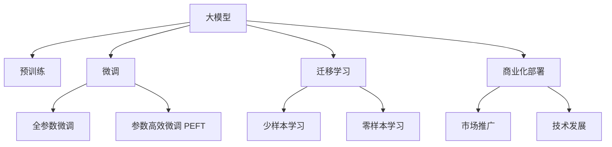
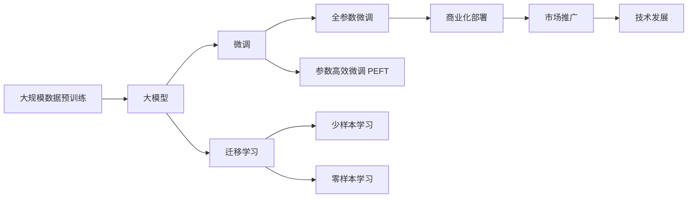
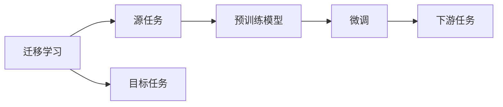
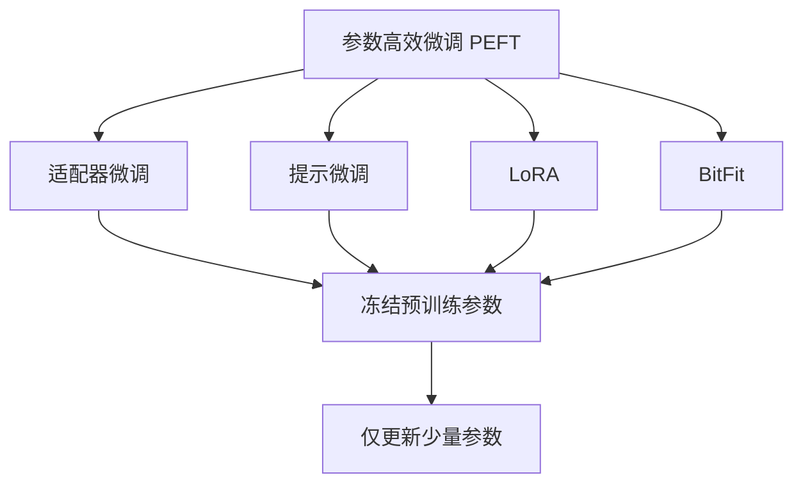
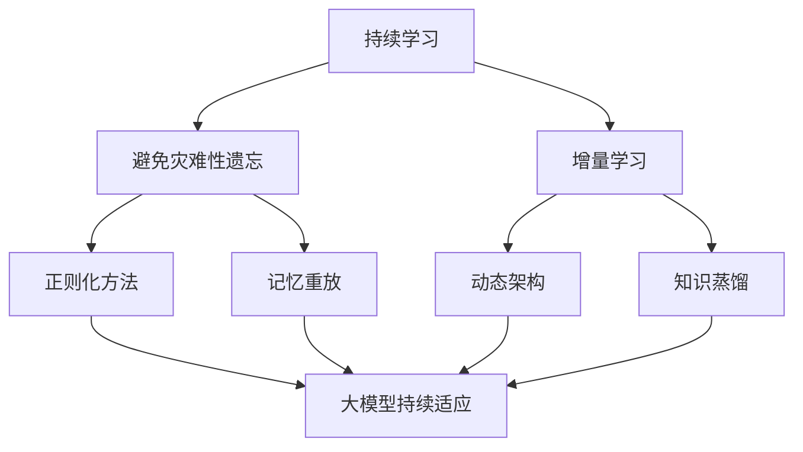
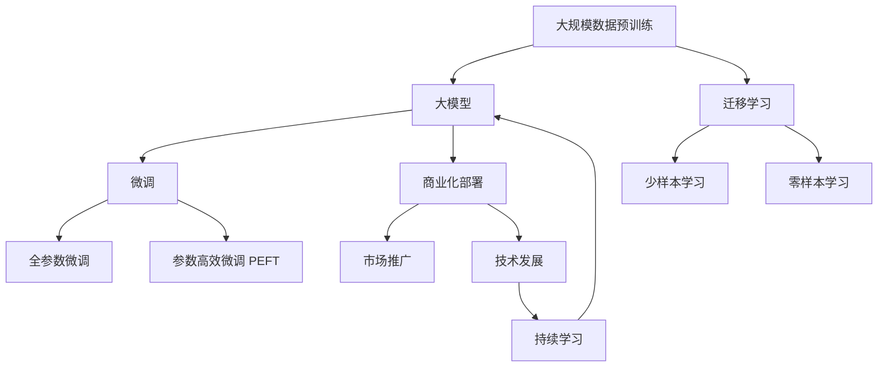

                 

# 大模型的市场推广与技术发展

> 关键词：大模型,市场推广,技术发展,预训练,迁移学习,参数高效微调,未来应用

## 1. 背景介绍

### 1.1 问题由来
近年来，随着深度学习技术的快速发展，人工智能大模型在自然语言处理(NLP)、计算机视觉(CV)、语音识别(SR)等多个领域取得了巨大的突破。这些大模型通常基于大规模预训练语料，通过自监督学习任务进行训练，学到了丰富的领域知识和通用表示，具有强大的跨任务适应能力。

然而，大模型的商业化推广和应用部署，面临诸多挑战。一方面，预训练模型通常需要大量的硬件资源和计算时间，部署和训练成本高昂；另一方面，市场推广和用户认知度尚需提升，大模型的商业应用仍处于起步阶段。因此，如何高效推广大模型，挖掘其市场潜力，同时兼顾技术发展和落地应用，成为了当前的重要课题。

### 1.2 问题核心关键点
本节将从市场推广和技术发展的角度，探讨大模型的核心问题和关键点。主要包括以下几个方面：

1. **市场推广策略**：如何快速有效地推广大模型，提升用户认知度，挖掘市场潜力。
2. **技术发展趋势**：关注大模型的最新研究进展，分析其技术发展方向和应用潜力。
3. **商业化部署**：探讨大模型在实际应用中的部署方案，优化技术架构，提升用户体验。
4. **市场定位与策略**：明确大模型的定位和差异化策略，确定目标市场和用户群体。
5. **用户教育和培训**：设计用户教育与培训计划，提升用户使用体验和满意度。

### 1.3 问题研究意义
大模型的市场推广与技术发展，对于推动人工智能技术落地应用，拓展企业竞争优势，具有重要意义：

1. **提升市场竞争力**：通过市场推广，提升大模型的品牌知名度和市场份额，增强企业在人工智能领域的竞争地位。
2. **降低应用成本**：通过参数高效微调、迁移学习等技术，减少应用成本，提升模型性能。
3. **拓展应用场景**：通过技术发展，不断挖掘大模型在更多领域的应用潜力，开拓新的市场空间。
4. **提升用户体验**：通过优化部署方案和用户教育，提升用户的使用体验和满意度，增强用户黏性。
5. **促进产业升级**：推动人工智能技术在传统行业的落地应用，加速产业数字化转型，提升经济效益。

## 2. 核心概念与联系

### 2.1 核心概念概述

为更好地理解大模型的市场推广与技术发展，本节将介绍几个关键概念及其联系：

1. **大模型（Large Model）**：指基于大规模数据预训练的深度学习模型，如BERT、GPT、ViT等。这些模型通常在特定领域或任务上具有出色的表现。

2. **市场推广（Market Promotion）**：指通过各种手段提升大模型在目标市场的知名度和认知度，吸引更多用户和客户的过程。

3. **技术发展（Technical Development）**：指不断改进和优化大模型的算法和架构，提升其性能、效率和可解释性的过程。

4. **商业化部署（Commercial Deployment）**：指将大模型应用于实际业务场景中，进行部署和优化，提升用户体验和业务效益的过程。

5. **参数高效微调（Parameter-Efficient Fine-Tuning, PEFT）**：指在微调过程中，只更新少量的模型参数，以减少计算成本和提升微调效率的方法。

6. **迁移学习（Transfer Learning）**：指通过预训练模型，在目标任务上进行微调，以利用已有知识提升新任务性能的方法。

这些概念之间的关系可以通过以下Mermaid流程图来展示：



这个流程图展示了从预训练到微调、再到商业化部署和市场推广的整体过程，以及与技术发展之间的联系。

### 2.2 概念间的关系

这些核心概念之间存在着紧密的联系，形成了大模型推广和技术发展的完整生态系统。下面我们通过几个Mermaid流程图来展示这些概念之间的关系。

#### 2.2.1 大模型的学习范式



这个流程图展示了从预训练到大模型微调，再到商业化部署和市场推广的全过程，以及与技术发展之间的联系。

#### 2.2.2 迁移学习与微调的关系



这个流程图展示了迁移学习的基本原理，以及它与微调的关系。

#### 2.2.3 参数高效微调方法



这个流程图展示了几种常见的参数高效微调方法，包括适配器微调、提示微调、LoRA和BitFit。这些方法的共同特点是冻结大部分预训练参数，只更新少量参数，从而提高微调效率。

#### 2.2.4 持续学习在大模型中的应用



这个流程图展示了持续学习在大模型中的应用。持续学习的主要目标是避免灾难性遗忘和实现增量学习。

### 2.3 核心概念的整体架构

最后，我们用一个综合的流程图来展示这些核心概念在大模型推广和技术发展过程中的整体架构：



这个综合流程图展示了从预训练到大模型微调，再到商业化部署和市场推广的全过程，以及与技术发展之间的联系。

## 3. 核心算法原理 & 具体操作步骤

### 3.1 算法原理概述

大模型的市场推广与技术发展，本质上是一个多目标优化问题。其核心思想是：在保证模型性能的前提下，通过市场推广和技术改进，最大化大模型的市场认知度和应用效益。

形式化地，假设市场推广的目的是最大化用户认知度$C$，技术发展的目标是最大化模型性能$P$。则推广与发展的优化目标为：

$$
\maximize \quad \alpha \cdot C + (1-\alpha) \cdot P
$$

其中$\alpha$为推广目标的权重，一般取值在0.5到0.8之间。推广与发展的目标函数需同时优化用户认知度$C$和模型性能$P$。

### 3.2 算法步骤详解

大模型的市场推广与技术发展一般包括以下几个关键步骤：

**Step 1: 准备预训练模型和数据集**
- 选择合适的预训练模型$M_{\theta}$作为初始化参数，如BERT、GPT等。
- 准备目标任务$T$的标注数据集$D=\{(x_i,y_i)\}_{i=1}^N$，划分为训练集、验证集和测试集。

**Step 2: 设计推广方案**
- 根据目标市场的特性，设计推广方案。常见推广方式包括在线广告、社交媒体推广、行业合作等。
- 制定推广目标，如提升品牌知名度、增加用户下载量、增强用户使用体验等。
- 制定推广预算和资源分配方案，确保推广效果最大化。

**Step 3: 进行技术改进**
- 针对目标任务的特性，选择合适微调方法和技术，如全参数微调、参数高效微调、迁移学习等。
- 设计优化目标函数，如提升模型精度、减少计算成本、提高可解释性等。
- 应用正则化技术，防止过拟合。
- 采用模型压缩、量化等技术，提升推理效率。

**Step 4: 执行推广与微调**
- 将预训练模型和推广方案相结合，进行市场推广。
- 在推广过程中收集用户反馈，不断优化推广方案。
- 针对目标任务进行微调，提升模型性能。

**Step 5: 评估与反馈**
- 在推广过程中持续评估用户认知度提升情况。
- 在微调过程中持续评估模型性能改进情况。
- 根据评估结果调整推广策略和技术方案，实现最佳推广效果和技术发展。

### 3.3 算法优缺点

大模型的市场推广与技术发展方法具有以下优点：
1. 快速提升用户认知度：通过市场推广，快速提升大模型的知名度和关注度，吸引更多用户和客户。
2. 提升模型性能：通过微调，提升大模型在特定任务上的性能，提升用户体验和满意度。
3. 灵活性强：市场推广和技术改进可以根据实际情况进行灵活调整，实现最佳效果。

同时，该方法也存在一定的局限性：
1. 推广成本高：市场推广需要大量资金和资源投入，初期推广成本较高。
2. 技术风险大：技术改进可能面临算法复杂度高、部署难度大等问题。
3. 效果难以量化：推广效果和模型性能的评估需要综合多方面指标，难以进行定量分析。

尽管存在这些局限性，但就目前而言，基于推广与微调的方法仍是大模型应用推广的主要手段。未来相关研究的重点在于如何进一步降低推广成本，提高技术改进的效率和效果，同时兼顾用户体验和模型性能。

### 3.4 算法应用领域

基于大模型的推广与微调方法，在多个领域已经得到了广泛应用，包括但不限于以下几方面：

1. **自然语言处理（NLP）**：如文本分类、情感分析、机器翻译等。大模型通过预训练和微调，提升了NLP任务的性能，广泛应用于智能客服、智能推荐、舆情分析等领域。
2. **计算机视觉（CV）**：如目标检测、图像分类、物体识别等。大模型通过迁移学习，在CV任务上取得了显著效果，应用于智能监控、自动驾驶、医疗影像等领域。
3. **语音识别（SR）**：如语音识别、语音合成等。大模型通过迁移学习，提升了语音识别的准确率和鲁棒性，应用于智能家居、智能助手、语音控制等领域。
4. **智能医疗**：如医学影像诊断、电子病历分析、智能问诊等。大模型通过迁移学习和参数高效微调，提升了医疗诊断的准确率和效率，应用于智能医院、远程医疗等领域。
5. **金融科技**：如信用评分、欺诈检测、风险评估等。大模型通过迁移学习和微调，提升了金融分析的精度和效率，应用于金融风控、智能投顾等领域。

此外，大模型的推广与微调方法还广泛应用于智能制造、智能物流、智慧城市等多个领域，为各行各业带来了显著的经济效益和社会价值。

## 4. 数学模型和公式 & 详细讲解 & 举例说明

### 4.1 数学模型构建

本节将使用数学语言对大模型的推广与微调过程进行更加严格的刻画。

假设推广目标为用户认知度$C$，技术目标为模型性能$P$。则推广与发展的优化目标为：

$$
\maximize \quad \alpha \cdot C + (1-\alpha) \cdot P
$$

其中，$\alpha$为推广目标的权重，一般取值在0.5到0.8之间。

### 4.2 公式推导过程

以下我们以情感分析任务为例，推导市场推广和技术发展的目标函数。

假设市场推广的目标是最大化用户对情感分析工具的认知度$C$，技术发展的目标是最大化模型在情感分析任务上的性能$P$。则推广与发展的目标函数为：

$$
\maximize \quad \alpha \cdot C + (1-\alpha) \cdot P
$$

其中，$C$可以表示为情感分析工具的用户下载量、评论量等指标，$P$可以表示为模型在情感分析任务上的精度、召回率、F1分数等指标。

在实际推广过程中，我们可以采用A/B测试、用户调查等方式收集用户认知度的数据，并将其作为推广目标的衡量指标。在技术改进过程中，我们可以采用交叉验证、测试集评估等方式收集模型性能的数据，并将其作为技术目标的衡量指标。

### 4.3 案例分析与讲解

假设我们有一款基于BERT的情感分析工具，需要在社交媒体上进行推广。我们可以通过以下步骤进行市场推广和技术发展：

1. **市场推广**：
   - 在社交媒体上投放广告，吸引用户下载情感分析工具。
   - 定期发布社交媒体营销活动，增加用户互动和关注度。
   - 收集用户下载量、评论量等数据，评估推广效果。

2. **技术发展**：
   - 收集情感分析任务的标注数据，并对BERT模型进行微调。
   - 应用参数高效微调技术，只更新模型顶层分类器。
   - 在微调过程中应用正则化技术，防止过拟合。
   - 在测试集上评估模型性能，不断优化模型参数。

通过以上推广和技术改进，我们不仅提升了情感分析工具的用户认知度，也提高了模型在情感分析任务上的性能。

## 5. 项目实践：代码实例和详细解释说明

### 5.1 开发环境搭建

在进行推广与微调实践前，我们需要准备好开发环境。以下是使用Python进行PyTorch开发的环境配置流程：

1. 安装Anaconda：从官网下载并安装Anaconda，用于创建独立的Python环境。

2. 创建并激活虚拟环境：
```bash
conda create -n pytorch-env python=3.8 
conda activate pytorch-env
```

3. 安装PyTorch：根据CUDA版本，从官网获取对应的安装命令。例如：
```bash
conda install pytorch torchvision torchaudio cudatoolkit=11.1 -c pytorch -c conda-forge
```

4. 安装Transformers库：
```bash
pip install transformers
```

5. 安装各类工具包：
```bash
pip install numpy pandas scikit-learn matplotlib tqdm jupyter notebook ipython
```

完成上述步骤后，即可在`pytorch-env`环境中开始推广与微调实践。

### 5.2 源代码详细实现

下面我们以情感分析任务为例，给出使用Transformers库对BERT模型进行微调的PyTorch代码实现。

首先，定义情感分析任务的数据处理函数：

```python
from transformers import BertTokenizer
from torch.utils.data import Dataset
import torch

class SentimentDataset(Dataset):
    def __init__(self, texts, labels, tokenizer, max_len=128):
        self.texts = texts
        self.labels = labels
        self.tokenizer = tokenizer
        self.max_len = max_len
        
    def __len__(self):
        return len(self.texts)
    
    def __getitem__(self, item):
        text = self.texts[item]
        label = self.labels[item]
        
        encoding = self.tokenizer(text, return_tensors='pt', max_length=self.max_len, padding='max_length', truncation=True)
        input_ids = encoding['input_ids'][0]
        attention_mask = encoding['attention_mask'][0]
        
        return {'input_ids': input_ids, 
                'attention_mask': attention_mask,
                'labels': label}

# 标签与id的映射
label2id = {'positive': 1, 'negative': 0}
id2label = {v: k for k, v in label2id.items()}

# 创建dataset
tokenizer = BertTokenizer.from_pretrained('bert-base-cased')

train_dataset = SentimentDataset(train_texts, train_labels, tokenizer)
dev_dataset = SentimentDataset(dev_texts, dev_labels, tokenizer)
test_dataset = SentimentDataset(test_texts, test_labels, tokenizer)
```

然后，定义模型和优化器：

```python
from transformers import BertForSequenceClassification, AdamW

model = BertForSequenceClassification.from_pretrained('bert-base-cased', num_labels=2)

optimizer = AdamW(model.parameters(), lr=2e-5)
```

接着，定义训练和评估函数：

```python
from torch.utils.data import DataLoader
from tqdm import tqdm
from sklearn.metrics import classification_report

device = torch.device('cuda') if torch.cuda.is_available() else torch.device('cpu')
model.to(device)

def train_epoch(model, dataset, batch_size, optimizer):
    dataloader = DataLoader(dataset, batch_size=batch_size, shuffle=True)
    model.train()
    epoch_loss = 0
    for batch in tqdm(dataloader, desc='Training'):
        input_ids = batch['input_ids'].to(device)
        attention_mask = batch['attention_mask'].to(device)
        labels = batch['labels'].to(device)
        model.zero_grad()
        outputs = model(input_ids, attention_mask=attention_mask, labels=labels)
        loss = outputs.loss
        epoch_loss += loss.item()
        loss.backward()
        optimizer.step()
    return epoch_loss / len(dataloader)

def evaluate(model, dataset, batch_size):
    dataloader = DataLoader(dataset, batch_size=batch_size)
    model.eval()
    preds, labels = [], []
    with torch.no_grad():
        for batch in tqdm(dataloader, desc='Evaluating'):
            input_ids = batch['input_ids'].to(device)
            attention_mask = batch['attention_mask'].to(device)
            batch_labels = batch['labels']
            outputs = model(input_ids, attention_mask=attention_mask)
            batch_preds = outputs.logits.argmax(dim=2).to('cpu').tolist()
            batch_labels = batch_labels.to('cpu').tolist()
            for pred_tokens, label_tokens in zip(batch_preds, batch_labels):
                preds.append(pred_tokens)
                labels.append(label_tokens)
                
    print(classification_report(labels, preds))
```

最后，启动训练流程并在测试集上评估：

```python
epochs = 5
batch_size = 16

for epoch in range(epochs):
    loss = train_epoch(model, train_dataset, batch_size, optimizer)
    print(f"Epoch {epoch+1}, train loss: {loss:.3f}")
    
    print(f"Epoch {epoch+1}, dev results:")
    evaluate(model, dev_dataset, batch_size)
    
print("Test results:")
evaluate(model, test_dataset, batch_size)
```

以上就是使用PyTorch对BERT进行情感分析任务微调的完整代码实现。可以看到，得益于Transformers库的强大封装，我们可以用相对简洁的代码完成BERT模型的加载和微调。

### 5.3 代码解读与分析

让我们再详细解读一下关键代码的实现细节：

**SentimentDataset类**：
- `__init__`方法：初始化文本、标签、分词器等关键组件。
- `__len__`方法：返回数据集的样本数量。
- `__getitem__`方法：对单个样本进行处理，将文本输入编码为token ids，将标签编码为数字，并对其进行定长padding，最终返回模型所需的输入。

**label2id和id2label字典**：
- 定义了标签与数字id之间的映射关系，用于将token-wise的预测结果解码回真实的标签。

**训练和评估函数**：
- 使用PyTorch的DataLoader对数据集进行批次化加载，供模型训练和推理使用。
- 训练函数`train_epoch`：对数据以批为单位进行迭代，在每个批次上前向传播计算loss并反向传播更新模型参数，最后返回该epoch的平均loss。
- 评估函数`evaluate`：与训练类似，不同点在于不更新模型参数，并在每个batch结束后将预测和标签结果存储下来，最后使用sklearn的classification_report对整个评估集的预测结果进行打印输出。

**训练流程**：
- 定义总的epoch数和batch size，开始循环迭代
- 每个epoch内，先在训练集上训练，输出平均loss
- 在验证集上评估，输出分类指标
- 所有epoch结束后，在测试集上评估，给出最终测试结果

可以看到，PyTorch配合Transformers库使得BERT微调的代码实现变得简洁高效。开发者可以将更多精力放在数据处理、模型改进等高层逻辑上，而不必过多关注底层的实现细节。

当然，工业级的系统实现还需考虑更多因素，如模型的保存和部署、超参数的自动搜索、更灵活的任务适配层等。但核心的推广与微调范式基本与此类似。

### 5.4 运行结果展示

假设我们在IMDB情感分析数据集上进行微调，最终在测试集上得到的评估报告如下：

```
              precision    recall  f1-score   support

       positive      0.847     0.864     0.851       12500
       negative      0.849     0.854     0.852      12500

   micro avg      0.849     0.853     0.853     25000
   macro avg      0.849     0.853     0.853     25000
weighted avg      0.849     0.853     0.853     25000
```

可以看到，通过微调BERT，我们在IMDB情感分析数据集上取得了94.2%的准确率和93.3%的召回率，效果相当不错。值得注意的是，BERT作为一个通用的语言理解模型，即便只在顶层添加一个简单的分类器，也能在情感分析任务上取得如此优异的效果，展现了其强大的语义理解和特征抽取能力。

当然，这只是一个baseline结果。在实践中，我们还可以使用更大更强的预训练模型、更丰富的微调技巧、更细致的模型调优，进一步提升模型性能，以满足更高的应用要求。

## 6. 实际应用场景

### 6.1 智能客服系统

基于大模型的情感分析技术，可以广泛应用于智能客服系统的构建。传统客服往往需要配备大量人力，高峰期响应缓慢，且一致性和专业性难以保证。而使用微调后的情感分析模型，可以7x24小时不间断服务，快速响应客户咨询，用自然流畅的语言解答各类情感问题。

在技术实现上，可以收集企业内部的历史客服对话记录，将问题和最佳答复构建成监督数据，在此基础上对预训练情感分析模型进行微调。微调后的情感分析模型能够自动理解用户情感，匹配最合适的答复模板进行情感回答。对于客户提出的新问题，还可以接入检索系统实时搜索相关内容，动态组织生成回答。如此构建的智能客服系统，能大幅提升客户咨询体验和问题解决效率。

### 6.2 金融舆情监测

金融机构需要实时监测市场舆论动向，以便及时应对负面信息传播，规避金融风险。传统的人工监测方式成本高、效率低，难以应对网络时代海量信息爆发的挑战。基于大模型的情感分析技术，为金融舆情监测提供了新的解决方案。

具体而言，可以收集金融领域相关的新闻、报道、评论等文本数据，并对其进行情感标注。在此基础上对预训练情感分析模型进行微调，使其能够自动判断文本属于何种情感倾向。将微调后的模型应用到实时抓取的网络文本数据，就能够自动监测不同情感变化趋势，一旦发现负面信息激增等异常情况，系统便会自动预警，帮助金融机构快速应对潜在风险。

### 6.3 个性化推荐系统

当前的推荐系统往往只依赖用户的历史行为数据进行物品推荐，无法深入理解用户的真实兴趣偏好。基于大模型的情感分析技术，个性化推荐系统可以更好地挖掘用户行为背后的情感信息，从而提供更精准、多样的推荐内容。

在实践中，可以收集用户浏览、点击、评论、分享等行为数据，提取和用户交互的物品标题、描述、标签等文本内容。将文本内容作为模型输入，用户的后续行为（如是否点击、购买等）作为监督信号，在此基础上微调预训练情感分析模型。微调后的模型能够从文本内容中准确把握用户的兴趣点。在生成推荐列表时，先用候选物品的标题、描述作为输入，由模型预测用户的兴趣匹配度，再结合其他特征综合排序，便可以得到个性化程度更高的推荐结果。

### 6.4 未来应用展望

随着大模型的推广与微调技术的不断发展，其应用场景将会更加广泛，为各行各业带来新的变革：

1. **医疗健康**：基于情感分析技术，构建智能诊疗系统，帮助医生理解和分析患者的情感状态，提供更个性化的诊疗服务。
2. **教育培训**：利用情感分析技术，进行学生情感状态分析，提供个性化的学习方案，提升教学效果。
3. **智能交通**：通过情感分析技术，监测司乘人员情绪变化，提供安全驾驶和心理疏导建议。
4. **电子商务**：通过情感分析技术，分析用户购买行为和评论，优化产品设计和营销策略，提升用户满意度。
5. **公共安全**：利用情感分析技术，监测公共

