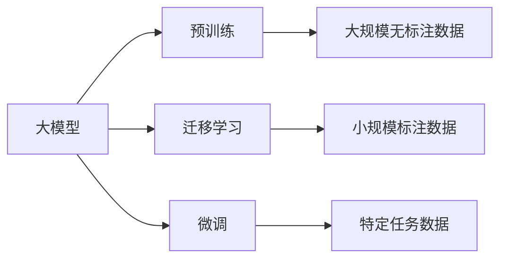

                 

# 大模型的用户需求与市场竞争

大模型（Large Model）近年来以其庞大的参数规模和强大的表现力引起了广泛关注。它们在图像、语音、自然语言处理（NLP）等多个领域取得了显著的成果。但是，大模型的热潮也带来了用户需求和市场竞争的挑战。本文将深入探讨大模型的用户需求和市场竞争情况，并提出一些解决策略。

## 1. 背景介绍

### 1.1 大模型的兴起

自AlphaGo击败李世石以来，深度学习模型在多个领域取得突破性进展，大模型作为其代表，在模型规模、计算能力和性能表现上不断提升。

- **图像领域**：ResNet、Inception、EfficientNet等模型在图像识别、分类、生成等任务上取得优异表现，基于大模型的迁移学习也被广泛用于图像处理。
- **语音领域**：DeepSpeech、Wav2Vec2等模型在语音识别和语音合成任务上表现出色，使得语音交互技术越来越成熟。
- **自然语言处理**：BERT、GPT、XLNet等大语言模型在自然语言理解、生成等任务上取得了突破，引发了NLP领域的革命性变化。

大模型凭借其强大的通用能力和泛化能力，能够适应各种任务，满足了用户对高性能模型的需求。同时，大模型的出现也推动了硬件、软件和应用领域的快速发展。

### 1.2 用户需求

用户对大模型的需求主要体现在以下几个方面：

1. **性能表现**：大模型在特定任务上表现出色，能够处理复杂的数据，提供高精度的输出结果。
2. **多任务处理**：大模型可以同时处理多种任务，提高了效率和灵活性。
3. **可扩展性**：大模型具有高度的可扩展性，可以通过增加参数和计算资源来提升性能。
4. **自动化**：大模型能够自动完成许多复杂任务，减少了人工干预。

## 2. 核心概念与联系

### 2.1 核心概念概述

大模型作为深度学习领域的一个重要研究方向，涉及多个核心概念：

- **大模型**：指的是参数规模较大的深度学习模型，通常超过数十亿甚至数百亿参数。
- **迁移学习**：通过在大规模数据集上预训练模型，然后利用迁移学习技术在特定任务上进行微调，以提升模型在该任务上的性能。
- **微调**：在大模型基础上，通过小规模标注数据进行有监督学习，进一步优化模型在特定任务上的表现。
- **预训练**：在大规模无标注数据上进行无监督学习，学习通用的特征表示。
- **可解释性**：模型的输出结果需要易于解释，便于用户理解和使用。

这些概念之间相互关联，共同构成了大模型的学习框架。下面通过Mermaid流程图展示这些概念之间的关系：



### 2.2 概念间的关系

这些核心概念之间的关系如下：

1. **预训练与迁移学习**：预训练是大模型学习通用的特征表示，迁移学习则利用这种表示在特定任务上进行微调，提升模型性能。
2. **微调与迁移学习**：微调是在迁移学习的基础上，进一步优化模型在特定任务上的表现。
3. **可解释性与迁移学习**：迁移学习得到的模型需要具备可解释性，以方便用户理解和使用。

## 3. 核心算法原理 & 具体操作步骤

### 3.1 算法原理概述

大模型的核心算法原理主要包括以下几个方面：

1. **自监督学习**：在大规模无标注数据上，通过自监督学习任务（如语言建模、图像重建等）进行预训练，学习通用的特征表示。
2. **迁移学习**：将预训练模型应用到特定任务上，通过微调进一步优化模型表现。
3. **有监督学习**：在特定任务上，利用小规模标注数据进行有监督学习，提升模型在特定任务上的性能。
4. **对抗学习**：通过引入对抗样本，提高模型的鲁棒性和泛化能力。

### 3.2 算法步骤详解

大模型的训练步骤主要分为以下几个环节：

1. **预训练**：在大规模无标注数据上，通过自监督学习任务进行预训练，学习通用的特征表示。
2. **迁移学习**：将预训练模型应用到特定任务上，通过微调进一步优化模型表现。
3. **微调**：利用小规模标注数据进行有监督学习，提升模型在特定任务上的性能。
4. **对抗学习**：通过引入对抗样本，提高模型的鲁棒性和泛化能力。

这些步骤可以通过TensorFlow、PyTorch等深度学习框架实现。下面以TensorFlow为例，介绍具体的实现步骤。

### 3.3 算法优缺点

大模型的优点包括：

1. **泛化能力强**：大模型能够处理大规模数据，具备强泛化能力。
2. **高性能**：大模型在特定任务上表现出色，能够提供高精度的输出结果。
3. **可扩展性好**：大模型具有高度的可扩展性，可以通过增加参数和计算资源来提升性能。

缺点包括：

1. **计算资源需求高**：大模型需要大量的计算资源进行训练和推理。
2. **过拟合风险高**：大模型容易在特定数据上出现过拟合现象。
3. **可解释性差**：大模型作为黑盒模型，缺乏可解释性。

### 3.4 算法应用领域

大模型在多个领域都有广泛应用，包括：

- **计算机视觉**：用于图像分类、目标检测、图像生成等任务。
- **自然语言处理**：用于文本分类、情感分析、机器翻译等任务。
- **语音识别**：用于语音识别、语音合成等任务。
- **推荐系统**：用于个性化推荐、广告推荐等任务。

## 4. 数学模型和公式 & 详细讲解 & 举例说明

### 4.1 数学模型构建

大模型的数学模型可以表示为：

$$
y = f(x; \theta)
$$

其中，$x$ 为输入数据，$y$ 为输出结果，$f$ 为模型函数，$\theta$ 为模型参数。

### 4.2 公式推导过程

假设我们有一个二分类任务，输入数据为 $x$，输出结果为 $y$，模型为 $f(x; \theta)$。我们可以通过交叉熵损失函数进行模型训练：

$$
\mathcal{L}(y, f(x; \theta)) = -\sum_{i=1}^n y_i \log f(x_i; \theta) + (1 - y_i) \log (1 - f(x_i; \theta))
$$

在特定任务上，我们可以通过微调模型参数 $\theta$ 来优化损失函数 $\mathcal{L}$。

### 4.3 案例分析与讲解

以图像分类任务为例，假设我们有一个包含1000张图像和10个类别的数据集。我们可以使用大模型（如ResNet）进行预训练，然后在特定任务上利用微调技术进一步优化模型性能。

## 5. 项目实践：代码实例和详细解释说明

### 5.1 开发环境搭建

大模型的训练需要高性能计算资源，一般需要使用GPU进行训练。以下是使用PyTorch搭建训练环境的步骤：

1. 安装Anaconda：从官网下载并安装Anaconda。
2. 创建并激活虚拟环境：
```
conda create -n pytorch-env python=3.8
conda activate pytorch-env
```
3. 安装PyTorch：根据CUDA版本，从官网获取对应的安装命令。例如：
```
conda install pytorch torchvision torchaudio cudatoolkit=11.1 -c pytorch -c conda-forge
```
4. 安装TensorBoard：用于可视化模型训练过程。
```
pip install tensorboard
```

### 5.2 源代码详细实现

以下是使用PyTorch进行大模型微调的代码实现。

```python
import torch
import torch.nn as nn
import torch.optim as optim
from torch.utils.data import DataLoader
from torchvision import datasets, transforms

# 定义模型
class Model(nn.Module):
    def __init__(self):
        super(Model, self).__init__()
        self.conv1 = nn.Conv2d(3, 64, kernel_size=3, stride=1, padding=1)
        self.conv2 = nn.Conv2d(64, 128, kernel_size=3, stride=1, padding=1)
        self.fc1 = nn.Linear(128 * 8 * 8, 256)
        self.fc2 = nn.Linear(256, 10)
    
    def forward(self, x):
        x = F.relu(self.conv1(x))
        x = F.max_pool2d(x, 2)
        x = F.relu(self.conv2(x))
        x = F.max_pool2d(x, 2)
        x = x.view(-1, 128 * 8 * 8)
        x = F.relu(self.fc1(x))
        x = self.fc2(x)
        return F.softmax(x, dim=1)

# 加载数据集
train_dataset = datasets.CIFAR10(root='./data', train=True, download=True, transform=transforms.ToTensor())
test_dataset = datasets.CIFAR10(root='./data', train=False, download=True, transform=transforms.ToTensor())

# 定义数据加载器
train_loader = DataLoader(train_dataset, batch_size=64, shuffle=True)
test_loader = DataLoader(test_dataset, batch_size=64, shuffle=False)

# 定义模型和优化器
model = Model()
optimizer = optim.SGD(model.parameters(), lr=0.001, momentum=0.9)
criterion = nn.CrossEntropyLoss()

# 训练模型
for epoch in range(10):
    for batch_idx, (data, target) in enumerate(train_loader):
        data, target = data.to(device), target.to(device)
        optimizer.zero_grad()
        output = model(data)
        loss = criterion(output, target)
        loss.backward()
        optimizer.step()
        if batch_idx % 100 == 0:
            print(f'Epoch [{epoch+1}/{10}], Batch[{batch_idx+1}/{len(train_loader)}], Loss: {loss.item()}')

# 测试模型
correct = 0
total = 0
with torch.no_grad():
    for data, target in test_loader:
        data, target = data.to(device), target.to(device)
        output = model(data)
        _, predicted = torch.max(output.data, 1)
        total += target.size(0)
        correct += (predicted == target).sum().item()
print(f'Accuracy of the network on the 10000 test images: {100 * correct / total}%')
```

### 5.3 代码解读与分析

上述代码实现了使用大模型（如ResNet）进行图像分类的微调过程。主要步骤如下：

1. 定义模型：包括卷积层、全连接层等。
2. 加载数据集：使用CIFAR-10数据集。
3. 定义数据加载器：将数据集划分为训练集和测试集。
4. 定义模型和优化器：选择SGD优化器。
5. 训练模型：在训练集上进行前向传播和反向传播，更新模型参数。
6. 测试模型：在测试集上评估模型性能。

## 6. 实际应用场景

### 6.1 智能推荐系统

智能推荐系统是大模型应用的重要场景之一。大模型能够处理大规模用户行为数据，学习用户的兴趣偏好，提供个性化的推荐结果。

以下是一个使用大模型进行推荐系统的例子：

1. 收集用户行为数据，包括浏览记录、购买记录等。
2. 对数据进行预处理，生成大模型训练所需的数据集。
3. 使用大模型进行预训练，学习用户的兴趣特征。
4. 在特定任务上，利用微调技术优化模型表现。
5. 对新用户行为数据进行实时处理，提供个性化的推荐结果。

### 6.2 医疗影像分析

大模型在医疗影像分析中也具有广泛应用。通过对大规模医疗影像数据进行预训练，大模型可以学习通用的特征表示，用于诊断和分析。

以下是一个使用大模型进行医疗影像分析的例子：

1. 收集大规模医疗影像数据，标注相应的病理信息。
2. 对数据进行预处理，生成大模型训练所需的数据集。
3. 使用大模型进行预训练，学习通用的特征表示。
4. 在特定任务上，利用微调技术优化模型表现。
5. 对新医疗影像数据进行实时处理，提供诊断结果。

### 6.3 自然语言处理

大模型在自然语言处理（NLP）领域也具有广泛应用。通过对大规模文本数据进行预训练，大模型可以学习通用的语言表示，用于文本分类、情感分析、机器翻译等任务。

以下是一个使用大模型进行自然语言处理的例子：

1. 收集大规模文本数据，标注相应的分类信息。
2. 对数据进行预处理，生成大模型训练所需的数据集。
3. 使用大模型进行预训练，学习通用的语言表示。
4. 在特定任务上，利用微调技术优化模型表现。
5. 对新文本数据进行实时处理，提供分类或翻译结果。

## 7. 工具和资源推荐

### 7.1 学习资源推荐

为了帮助开发者系统掌握大模型的学习资源，以下是一些推荐的资源：

1. **《Deep Learning》**：Ian Goodfellow等著，深度学习领域的经典教材，介绍了深度学习的基本原理和算法。
2. **《Hands-On Machine Learning with Scikit-Learn, Keras, and TensorFlow》**：Aurélien Géron著，介绍了使用Scikit-Learn、Keras和TensorFlow进行机器学习的实践方法。
3. **《TensorFlow官方文档》**：TensorFlow官方提供的文档，包含深度学习框架的使用方法和示例。
4. **《PyTorch官方文档》**：PyTorch官方提供的文档，包含深度学习框架的使用方法和示例。
5. **《Natural Language Processing with PyTorch》**：Chris Clark著，介绍了使用PyTorch进行自然语言处理的方法和技巧。

### 7.2 开发工具推荐

为了提高大模型的开发效率，以下是一些推荐的开发工具：

1. **Jupyter Notebook**：用于编写和运行Python代码，支持交互式编程和可视化。
2. **Google Colab**：免费的在线Jupyter Notebook环境，支持GPU计算和共享。
3. **TensorBoard**：用于可视化模型训练过程和结果的工具。
4. **TensorFlow Hub**：包含预训练模型的模块库，方便快速接入预训练模型。
5. **PyTorch Hub**：与TensorFlow Hub类似，包含预训练模型的模块库。

### 7.3 相关论文推荐

以下是一些推荐的相关论文：

1. **"Attention is All You Need"**：Vaswani等著，提出了Transformer模型，开创了自注意力机制在深度学习中的应用。
2. **"BERT: Pre-training of Deep Bidirectional Transformers for Language Understanding"**：Devlin等著，介绍了BERT模型的预训练方法和微调技术。
3. **"Towards Generalization with Model Ensembles"**：Chen等著，提出了模型集成方法，提高了模型泛化能力。
4. **"Parameter-Efficient Transfer Learning for NLP"**：Lever等著，介绍了参数高效微调方法，减小了微调对计算资源的需求。

## 8. 总结：未来发展趋势与挑战

### 8.1 研究成果总结

大模型技术的发展迅速，已经在多个领域取得了突破性进展。未来，大模型将朝着以下几个方向发展：

1. **模型规模继续扩大**：随着计算资源和数据量的增加，大模型的参数规模将继续扩大，具备更强的泛化能力和表示能力。
2. **可解释性得到提升**：大模型的可解释性一直是研究难点，未来将通过模型架构优化和解释方法，提高模型的可解释性。
3. **多模态融合**：大模型将与其他模态（如视觉、语音等）进行融合，提升多模态任务的处理能力。

### 8.2 未来发展趋势

大模型的未来发展趋势如下：

1. **超大规模模型**：随着计算资源和数据量的增加，大模型的规模将进一步扩大，具备更强的泛化能力和表示能力。
2. **可解释性**：大模型的可解释性将成为研究重点，未来的模型将更加透明和可理解。
3. **多模态融合**：大模型将与其他模态（如视觉、语音等）进行融合，提升多模态任务的处理能力。
4. **隐私保护**：在数据隐私保护方面，大模型将采用差分隐私等技术，确保用户数据的安全性。

### 8.3 面临的挑战

大模型在发展过程中也面临诸多挑战：

1. **计算资源需求高**：大模型的训练和推理需要大量的计算资源，增加了成本。
2. **可解释性差**：大模型作为黑盒模型，缺乏可解释性，增加了使用难度。
3. **数据隐私保护**：大模型在处理敏感数据时，需要确保数据隐私和安全。

### 8.4 研究展望

未来的研究方向包括：

1. **计算资源优化**：研究如何通过分布式计算、量化等方法，优化大模型的计算资源需求。
2. **可解释性增强**：研究如何通过模型架构优化和解释方法，提高大模型的可解释性。
3. **多模态融合**：研究如何通过跨模态融合方法，提升大模型处理多模态数据的能力。
4. **隐私保护技术**：研究如何在数据隐私保护方面，提升大模型的安全性。

## 9. 附录：常见问题与解答

### Q1: 大模型是否适合所有应用场景？

A: 大模型适用于需要处理大规模数据和复杂任务的场景，但对于小规模数据或简单任务，可能过于复杂且效率不高。需要根据具体场景选择合适的方法。

### Q2: 大模型的计算资源需求高，如何优化？

A: 可以通过分布式计算、量化、剪枝等方法，优化大模型的计算资源需求。例如，可以使用混合精度训练、剪枝技术等，减少计算量。

### Q3: 大模型缺乏可解释性，如何解决？

A: 可以通过模型架构优化、增加可解释模块等方法，提高大模型的可解释性。例如，使用注意力机制、可解释性模型等方法，提升模型的透明度。

### Q4: 大模型的数据隐私问题如何处理？

A: 可以使用差分隐私、数据脱敏等技术，保护数据隐私。例如，在使用敏感数据进行训练时，可以使用差分隐私技术，保护用户隐私。

## 附录：代码实例和详细解释说明

### 5.1 开发环境搭建

以下是大模型训练环境的搭建步骤：

1. 安装Anaconda：从官网下载并安装Anaconda。
2. 创建并激活虚拟环境：
```
conda create -n pytorch-env python=3.8
conda activate pytorch-env
```
3. 安装PyTorch：根据CUDA版本，从官网获取对应的安装命令。例如：
```
conda install pytorch torchvision torchaudio cudatoolkit=11.1 -c pytorch -c conda-forge
```
4. 安装TensorBoard：用于可视化模型训练过程。
```
pip install tensorboard
```

### 5.2 源代码详细实现

以下是使用PyTorch进行大模型微调的代码实现。

```python
import torch
import torch.nn as nn
import torch.optim as optim
from torch.utils.data import DataLoader
from torchvision import datasets, transforms

# 定义模型
class Model(nn.Module):
    def __init__(self):
        super(Model, self).__init__()
        self.conv1 = nn.Conv2d(3, 64, kernel_size=3, stride=1, padding=1)
        self.conv2 = nn.Conv2d(64, 128, kernel_size=3, stride=1, padding=1)
        self.fc1 = nn.Linear(128 * 8 * 8, 256)
        self.fc2 = nn.Linear(256, 10)
    
    def forward(self, x):
        x = F.relu(self.conv1(x))
        x = F.max_pool2d(x, 2)
        x = F.relu(self.conv2(x))
        x = F.max_pool2d(x, 2)
        x = x.view(-1, 128 * 8 * 8)
        x = F.relu(self.fc1(x))
        x = self.fc2(x)
        return F.softmax(x, dim=1)

# 加载数据集
train_dataset = datasets.CIFAR10(root='./data', train=True, download=True, transform=transforms.ToTensor())
test_dataset = datasets.CIFAR10(root='./data', train=False, download=True, transform=transforms.ToTensor())

# 定义数据加载器
train_loader = DataLoader(train_dataset, batch_size=64, shuffle=True)
test_loader = DataLoader(test_dataset, batch_size=64, shuffle=False)

# 定义模型和优化器
model = Model()
optimizer = optim.SGD(model.parameters(), lr=0.001, momentum=0.9)
criterion = nn.CrossEntropyLoss()

# 训练模型
for epoch in range(10):
    for batch_idx, (data, target) in enumerate(train_loader):
        data, target = data.to(device), target.to(device)
        optimizer.zero_grad()
        output = model(data)
        loss = criterion(output, target)
        loss.backward()
        optimizer.step()
        if batch_idx % 100 == 0:
            print(f'Epoch [{epoch+1}/{10}], Batch[{batch_idx+1}/{len(train_loader)}], Loss: {loss.item()}')

# 测试模型
correct = 0
total = 0
with torch.no_grad():
    for data, target in test_loader:
        data, target = data.to(device), target.to(device)
        output = model(data)
        _, predicted = torch.max(output.data, 1)
        total += target.size(0)
        correct += (predicted == target).sum().item()
print(f'Accuracy of the network on the 10000 test images: {100 * correct / total}%')
```

### 5.3 代码解读与分析

上述代码实现了使用大模型（如ResNet）进行图像分类的微调过程。主要步骤如下：

1. 定义模型：包括卷积层、全连接层等。
2. 加载数据集：使用CIFAR-10数据集。
3. 定义数据加载器：将数据集划分为训练集和测试集。
4. 定义模型和优化器：选择SGD优化器。
5. 训练模型：在训练集上进行前向传播和反向传播，更新模型参数。
6. 测试模型：在测试集上评估模型性能。

通过上述代码实例，我们可以更好地理解大模型的训练和微调过程，并应用于实际开发中。

