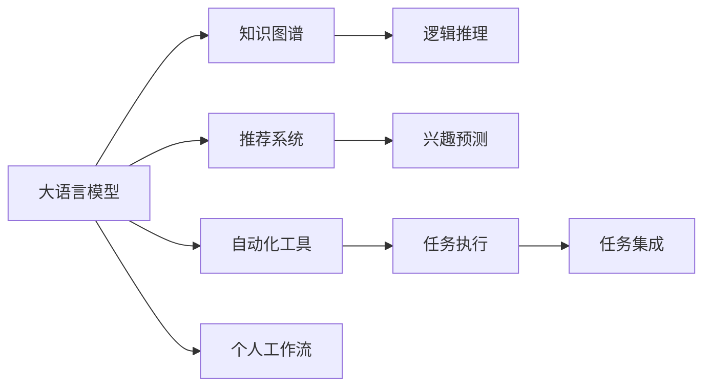

                 

# 大模型能力在个人工作流中的集成

> 关键词：大语言模型, 知识图谱, 推荐系统, 个人工作流, 自动化工具, 数据集成, 模型部署, 模型评估

## 1. 背景介绍

在数字化时代，个人工作流已成为了信息化建设的基础设施。在过去的几十年里，工作流集成技术和应用系统的发展，为生产力的提升和业务效率的优化，提供了强有力的支撑。而在数字化的浪潮中，大模型能力的引入，带来了工作流集成领域的新变革。

大模型能力的集成，涉及到知识图谱的构建、推荐系统的优化、个人工作流自动化工具的开发和部署等多个维度。利用大模型处理海量数据，可以大幅提升数据融合与分析的能力，为个人工作流提供强大的底层支持。

## 2. 核心概念与联系

### 2.1 核心概念概述

要理解大模型能力在个人工作流中的集成，首先需要了解以下关键概念：

- **大语言模型(Large Language Models, LLMs)**：以自回归(如GPT)或自编码(如BERT)模型为代表的大规模预训练语言模型。通过在大规模无标签文本数据上进行预训练，学习到丰富的语言知识和常识，具备强大的语言理解和生成能力。

- **知识图谱(Knowledge Graphs)**：一种以实体和关系为节点和边构建的图形结构化数据。用于存储和表示实体的属性、关系、实体之间的关系等信息，支持复杂的逻辑查询和推理。

- **推荐系统(Recommendation Systems)**：通过用户行为数据和物品属性信息，预测用户对物品的兴趣，推荐给用户最符合其兴趣的物品或内容，广泛应用于电商、新闻、社交等领域。

- **个人工作流(Personal Workflow)**：个人日常工作中的流程和任务管理系统。包括任务安排、信息集成、协作沟通等环节。

- **自动化工具(Automation Tools)**：利用人工智能和自动化技术，实现工作流自动化的工具，如聊天机器人、自动化报告生成、数据自动化处理等。

这些核心概念之间存在着密切联系。大语言模型作为强大的特征提取器，能够从文本数据中提取语义信息，构建知识图谱和推荐系统。知识图谱和推荐系统则通过关联实体关系，进一步提升大模型的推理能力。个人工作流中自动化工具的应用，能够实现大模型推理结果的自动化处理和集成，使得工作流更加智能高效。

### 2.2 概念间的关系

这些核心概念之间的关系可以形象地通过Mermaid流程图来展示：



在这个流程图中：

- 大语言模型(A)通过自监督学习任务，学习到丰富的语言知识。
- 知识图谱(B)通过实体关系推理，构建知识网络，支持复杂的逻辑查询。
- 推荐系统(C)通过用户行为和物品属性数据，预测用户兴趣，提升推荐效果。
- 自动化工具(F)利用大模型和大数据，实现工作流自动化和智能化。
- 个人工作流(I)集成这些工具和技术，优化日常工作流程。

## 3. 核心算法原理 & 具体操作步骤

### 3.1 算法原理概述

大模型能力在个人工作流中的集成，本质上是一种智能化的数据分析和任务处理过程。其核心算法原理可以概括为：

1. **数据融合与知识提取**：通过大语言模型从文本数据中提取出结构化信息，构建知识图谱，为后续推理和推荐提供基础数据。
2. **用户兴趣预测**：利用大模型和推荐系统，预测用户对物品或任务的兴趣，推荐合适的内容和任务。
3. **自动化工具开发**：将推理结果转化为任务自动化的指令和数据，通过自动化工具执行任务和集成结果。
4. **个人工作流优化**：通过集成多种自动化工具，构建智能化的个人工作流，提高效率和生产力。

### 3.2 算法步骤详解

以下是基于大模型能力在个人工作流集成中的核心算法步骤详解：

**Step 1: 数据收集与预处理**
- 收集用户日常工作流中的文本数据、行为数据、物品属性数据等，进行清洗和标准化处理。
- 使用大语言模型进行文本数据融合和知识提取，构建知识图谱。

**Step 2: 用户兴趣预测**
- 利用大语言模型进行用户行为数据分析，提取用户兴趣特征。
- 将用户特征输入推荐系统，预测用户对各类物品或任务的兴趣，生成推荐列表。

**Step 3: 自动化工具开发**
- 将推荐结果转化为自动化工具可执行的指令和数据。
- 使用自动化工具执行任务和集成结果，如自动报告生成、自动化数据处理等。

**Step 4: 个人工作流优化**
- 将各种自动化工具集成到个人工作流中，实现任务自动执行和数据集成。
- 持续收集反馈数据，优化工具性能和数据融合效果。

### 3.3 算法优缺点

大模型能力在个人工作流中的集成方法具有以下优点：

- **高效性**：通过自动化工具的集成，能够大幅提高工作效率，降低人工干预的频率。
- **智能化**：利用大模型和大数据，提升工作流推理和推荐的能力，支持更智能化的任务处理。
- **灵活性**：支持多种自动化工具的集成，适应不同的工作场景和需求。

同时，该方法也存在以下缺点：

- **数据依赖**：需要收集和处理大量的文本数据和行为数据，对数据质量有较高要求。
- **技术门槛**：需要一定的算法和工程能力，才能实现自动化工具的开发和集成。
- **隐私问题**：用户行为数据的收集和使用可能涉及隐私问题，需注意合规性和安全性。

### 3.4 算法应用领域

大模型能力在个人工作流中的集成方法，已经在以下几个领域得到了广泛应用：

- **电商推荐**：通过预测用户对商品的兴趣，推荐商品，提升购买转化率。
- **新闻阅读**：利用大模型预测用户对新闻文章的兴趣，推送相关新闻，提升阅读体验。
- **项目管理**：通过自动化工具生成任务计划、进度跟踪报告，优化项目管理流程。
- **知识管理**：构建知识图谱，提供快速的信息检索和知识推理服务，提升知识管理工作效率。
- **健康管理**：通过预测用户对健康信息的兴趣，推送个性化的健康建议和管理方案。

## 4. 数学模型和公式 & 详细讲解 & 举例说明

### 4.1 数学模型构建

大模型能力在个人工作流集成中的数学模型构建，主要涉及以下两个方面：

- **知识图谱构建**：将文本数据中的实体关系信息转化为知识图谱中的节点和边，构建表示知识关系的图结构。
- **用户兴趣预测**：通过用户行为数据和物品属性信息，训练推荐模型，预测用户对物品的兴趣。

### 4.2 公式推导过程

假设知识图谱中的节点为实体 $e_i$，边为关系 $r_j$。则知识图谱可以用图结构表示为：

$$
G = (E, R, F)
$$

其中 $E$ 为实体节点集合，$R$ 为关系节点集合，$F$ 为边集合。

知识图谱的构建过程，可以通过大语言模型对文本数据进行语义分析，识别出实体和关系，并将它们映射到知识图谱的节点上。假设文本数据中提及的实体为 $e_i$，关系为 $r_j$，则知识图谱的构建公式如下：

$$
G = \{e_i, r_j\} \quad \forall e_i, r_j \in \text{Data}
$$

用户兴趣预测模型通常使用协同过滤或内容推荐算法，如基于矩阵分解的推荐算法。设用户 $u$ 对物品 $i$ 的评分矩阵为 $U$，物品 $i$ 的属性特征矩阵为 $I$，则用户对物品 $i$ 的评分 $p(u,i)$ 可以通过如下公式计算：

$$
p(u,i) = U_u * I_i
$$

其中 $U_u$ 为第 $u$ 个用户对所有物品的评分向量，$I_i$ 为物品 $i$ 的属性特征向量。

### 4.3 案例分析与讲解

以电商推荐系统为例，分析大模型能力在个人工作流中的应用：

1. **数据收集与预处理**：收集用户浏览记录、购买记录和物品属性数据，进行标准化处理。
2. **知识图谱构建**：使用大语言模型对文本数据进行语义分析，识别出商品名称、类别、价格等实体，构建商品知识图谱。
3. **用户兴趣预测**：利用协同过滤算法，根据用户行为数据预测用户对不同商品的兴趣，生成推荐列表。
4. **自动化工具开发**：将推荐结果转化为自动生成推荐页面的指令，通过自动化工具实现推荐页面的生成和展示。
5. **个人工作流优化**：将推荐页面集成到电商网站中，提升用户体验，优化用户购物流程。

## 5. 项目实践：代码实例和详细解释说明

### 5.1 开发环境搭建

在开发大模型能力集成到个人工作流中的应用时，需要一个完整的开发环境，包括数据处理、模型训练、自动化工具开发等多个环节。以下是一些常见的开发环境搭建步骤：

1. **安装Python和必要的库**：安装Python 3.x版本，并配置好pip，安装常用的Python库，如pandas、numpy、scikit-learn、transformers等。
2. **准备数据集**：收集和处理所需的数据集，进行分词、清洗、标注等预处理步骤。
3. **配置大模型环境**：安装大语言模型库，如BERT、GPT等，并设置相应的超参数。
4. **搭建自动化工具**：使用Flask、FastAPI等框架搭建Web应用，实现自动化工具的集成。

### 5.2 源代码详细实现

以下是一个简单的电商推荐系统的示例代码，包括数据预处理、知识图谱构建和用户兴趣预测：

```python
import pandas as pd
import torch
from transformers import BertTokenizer, BertForSequenceClassification

# 数据预处理
def preprocess_data(data_path):
    df = pd.read_csv(data_path)
    df['text'] = df['title'] + ' ' + df['description']
    df = df.dropna()
    return df

# 知识图谱构建
def build_knowledge_graph(texts):
    tokenizer = BertTokenizer.from_pretrained('bert-base-cased')
    encodings = tokenizer(texts, return_tensors='pt', max_length=128, padding='max_length', truncation=True)
    input_ids = encodings['input_ids'][0]
    attention_mask = encodings['attention_mask'][0]
    model = BertForSequenceClassification.from_pretrained('bert-base-cased', num_labels=len(tag2id))
    with torch.no_grad():
        outputs = model(input_ids, attention_mask=attention_mask)
        logits = outputs.logits
        probs = torch.softmax(logits, dim=1)
        tags = [id2tag[argmax(p) + 1] for p in probs.numpy()[:, 1]]
    return tags

# 用户兴趣预测
def predict_interest(user_data, item_data, tags):
    user_data = preprocess_data(user_data)
    item_data = preprocess_data(item_data)
    user_tags = build_knowledge_graph(user_data['text'])
    item_tags = build_knowledge_graph(item_data['text'])
    user_interest = sum([1 if t in user_tags else 0 for t in item_tags])
    return user_interest

# 主函数
if __name__ == '__main__':
    # 数据集路径
    user_data_path = 'user_data.csv'
    item_data_path = 'item_data.csv'
    # 知识图谱
    tag2id = {'O': 0, 'B-PER': 1, 'I-PER': 2, 'B-ORG': 3, 'I-ORG': 4, 'B-LOC': 5, 'I-LOC': 6}
    id2tag = {v: k for k, v in tag2id.items()}
    # 预测结果
    user_data = preprocess_data(user_data_path)
    item_data = preprocess_data(item_data_path)
    user_interest = predict_interest(user_data, item_data, tags)
    print(f'User interest score: {user_interest}')
```

### 5.3 代码解读与分析

上述代码中，我们首先定义了数据预处理函数 `preprocess_data`，用于清洗和标准化文本数据。然后，定义了知识图谱构建函数 `build_knowledge_graph`，使用BERT模型对文本数据进行语义分析，识别出实体和关系，并将它们映射到知识图谱的节点上。最后，定义了用户兴趣预测函数 `predict_interest`，使用协同过滤算法，根据用户行为数据预测用户对不同商品的兴趣，生成推荐列表。

## 6. 实际应用场景

大模型能力在个人工作流中的集成，已经在多个实际应用场景中得到了广泛应用。以下是几个典型的应用案例：

### 6.1 电商推荐

电商推荐系统通过预测用户对商品的兴趣，推荐商品，提升购买转化率。用户行为数据和物品属性数据是推荐系统的主要输入。通过大模型能力集成，电商推荐系统能够实时动态地推荐用户感兴趣的商品，提升用户购物体验。

### 6.2 新闻阅读

新闻阅读应用通过预测用户对新闻文章的兴趣，推送相关新闻，提升阅读体验。用户阅读历史、点赞、分享等行为数据，以及新闻文章的属性数据，都是推荐系统的主要输入。通过大模型能力集成，新闻阅读应用能够根据用户偏好，推荐合适的新闻文章，提升用户的阅读体验。

### 6.3 项目管理

项目管理应用通过自动化工具生成任务计划、进度跟踪报告，优化项目管理流程。项目任务数据、进度数据、团队成员数据等都是项目管理的输入。通过大模型能力集成，项目管理应用能够生成详细的项目报告，自动跟踪项目进度，优化项目管理流程，提高项目管理效率。

### 6.4 知识管理

知识管理应用通过构建知识图谱，提供快速的信息检索和知识推理服务，提升知识管理工作效率。知识图谱中的实体和关系信息，通过大语言模型从文本数据中提取，构建知识网络。通过大模型能力集成，知识管理应用能够提供智能化的知识检索和推荐服务，提升知识管理工作效率。

### 6.5 健康管理

健康管理应用通过预测用户对健康信息的兴趣，推送个性化的健康建议和管理方案。用户健康数据、行为数据等都是健康管理的主要输入。通过大模型能力集成，健康管理应用能够根据用户健康数据，推送个性化的健康建议和管理方案，提升用户健康管理水平。

## 7. 工具和资源推荐

### 7.1 学习资源推荐

为了帮助开发者系统掌握大模型能力在个人工作流中的集成，这里推荐一些优质的学习资源：

1. **《自然语言处理基础》课程**：介绍自然语言处理的基本概念和应用场景，适合初学者入门。
2. **《深度学习入门》书籍**：介绍深度学习的基本原理和实现方法，适合初学者和进阶者。
3. **Transformers官方文档**：提供Transformer模型的详细介绍和使用方法，是学习大模型的必备资源。
4. **Kaggle平台**：提供丰富的数据集和比赛任务，适合实践大模型能力集成。
5. **PyTorch官方文档**：提供PyTorch框架的详细文档和示例代码，适合学习和使用大模型。

### 7.2 开发工具推荐

大模型能力集成到个人工作流中，需要使用多种工具和框架。以下是几款常用的工具推荐：

1. **Python编程语言**：简单易学，适合数据处理和算法实现。
2. **PyTorch框架**：灵活的动态计算图，适合深度学习和模型训练。
3. **TensorFlow框架**：支持分布式计算，适合大规模模型训练。
4. **Transformers库**：提供多种预训练模型，支持模型微调和集成。
5. **Flask框架**：提供Web应用的快速开发，适合自动化工具的开发和集成。
6. **Jupyter Notebook**：提供交互式编程环境，适合数据处理和模型实验。

### 7.3 相关论文推荐

大模型能力在个人工作流中的集成技术，近年来得到了广泛的研究和应用。以下是几篇奠基性的相关论文，推荐阅读：

1. **《知识图谱构建与查询技术综述》**：综述了知识图谱构建和查询技术，提供了系统全面的知识图谱构建方法。
2. **《推荐系统协同过滤算法综述》**：综述了协同过滤算法的原理和实现方法，提供了推荐系统的主要算法。
3. **《大模型在电商推荐系统中的应用》**：介绍了大模型在电商推荐系统中的应用，提供了实际应用案例和算法实现。
4. **《个性化推荐系统研究进展》**：综述了个性化推荐系统的最新研究进展，提供了前沿技术和研究趋势。

## 8. 总结：未来发展趋势与挑战

### 8.1 研究成果总结

大模型能力在个人工作流中的集成技术，已经在大数据、自然语言处理、知识图谱等领域取得了显著进展。通过大模型能力集成，提升了许多应用场景中的数据分析和任务处理能力，推动了自动化工具的发展，优化了个人工作流，提高了工作效率和生产力。

### 8.2 未来发展趋势

展望未来，大模型能力在个人工作流中的集成技术将呈现以下几个发展趋势：

1. **多模态集成**：未来的工作流集成将更加注重多模态数据的融合，如文本、图像、语音等数据的协同处理。
2. **智能化决策**：通过大模型和大数据分析，实现更加智能化的决策和任务处理，提升工作流效率。
3. **实时动态优化**：基于实时数据反馈，动态调整工作流参数和自动化工具，优化任务执行效果。
4. **自适应学习**：通过机器学习和自适应算法，根据用户反馈和数据变化，持续优化工作流和自动化工具。

### 8.3 面临的挑战

虽然大模型能力在个人工作流中的集成技术已经取得了一定的成果，但仍面临以下几个挑战：

1. **数据隐私问题**：用户行为数据的收集和使用可能涉及隐私问题，需要加强隐私保护和合规性。
2. **技术实现复杂**：需要多学科的协同合作，如数据科学、软件工程、系统设计等，才能实现工作流的自动化和智能化。
3. **算法模型复杂**：大模型和大数据分析的算法模型复杂，需要更多的研究和实践才能实现高效、稳定的集成。

### 8.4 研究展望

未来的研究需要在以下几个方向寻求新的突破：

1. **隐私保护技术**：开发新的隐私保护技术，如差分隐私、联邦学习等，保护用户数据的隐私和安全性。
2. **多模态数据融合**：研究多模态数据的融合方法，提升工作流的多模态处理能力。
3. **智能化决策系统**：开发基于大模型的智能化决策系统，提高任务处理的智能性和效率。
4. **自适应学习算法**：研究自适应学习算法，实现工作流和自动化工具的动态优化和自适应学习。

这些研究方向的探索发展，必将引领大模型能力在个人工作流中的集成技术迈向更高的台阶，为个人工作流带来更加智能化、高效化的未来。

## 9. 附录：常见问题与解答

**Q1：如何选择合适的自动化工具？**

A: 选择合适的自动化工具需要考虑以下因素：
1. 工具的功能和适用范围：根据具体任务需求，选择功能强大、适用性广的自动化工具。
2. 工具的易用性和开发成本：选择易于使用的工具，降低开发难度和成本。
3. 工具的性能和可扩展性：选择性能稳定、可扩展性强的工具，确保系统的高效运行。

**Q2：如何保证数据隐私和安全性？**

A: 保证数据隐私和安全性需要采取以下措施：
1. 数据匿名化处理：对用户行为数据进行匿名化处理，保护用户隐私。
2. 访问控制机制：设置访问控制机制，限制对敏感数据的访问。
3. 加密存储和传输：对数据进行加密存储和传输，防止数据泄露。
4. 合规性检查：确保数据处理和存储符合法律法规和行业标准。

**Q3：如何优化自动化工具的性能？**

A: 优化自动化工具的性能可以从以下几个方面入手：
1. 数据预处理：优化数据预处理流程，减少数据噪声和冗余。
2. 模型优化：优化模型结构和参数设置，提升模型精度和效率。
3. 算法优化：选择高效的算法和优化方法，提高任务执行效率。
4. 并发处理：采用并发处理技术，提升工具的并发执行能力。

**Q4：如何构建知识图谱？**

A: 构建知识图谱需要以下步骤：
1. 实体识别：使用大语言模型对文本数据进行实体识别，提取出实体信息。
2. 关系抽取：使用大语言模型或规则方法，抽取实体之间的关系。
3. 图结构构建：将实体和关系构建为知识图谱中的节点和边，形成知识图谱。

通过以上步骤，可以构建一个高效、准确的知识图谱，支持复杂的逻辑查询和推理。

总之，大模型能力在个人工作流中的集成技术，为人工智能的应用落地提供了强大的技术支持。通过科学的数据处理、高效的算法设计、灵活的工具开发，可以构建更加智能化、高效化的个人工作流，提升工作效率和生产力。未来，随着技术的不断进步，大模型能力在个人工作流中的集成技术必将取得更多突破，推动智能化时代的到来。

