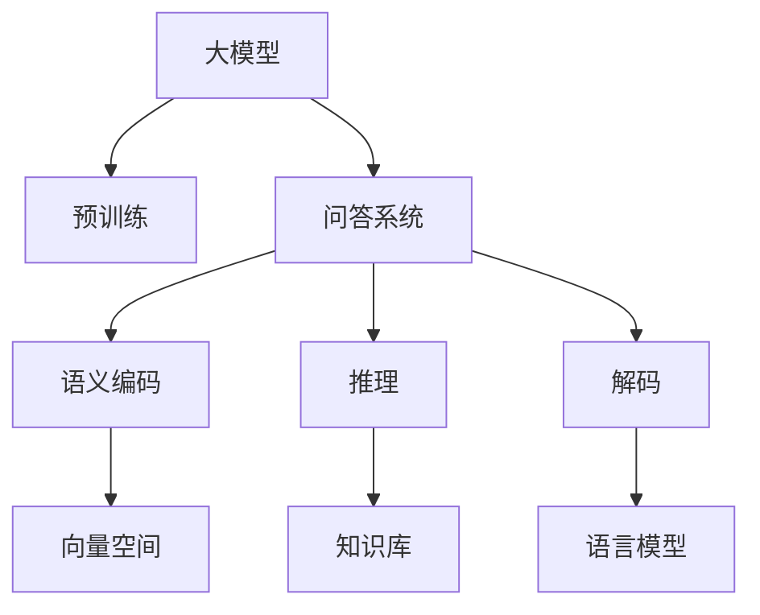

                 

# 大模型问答机器人如何编码语义

## 1. 背景介绍

### 1.1 问题由来
在大模型（Large Model）和深度学习（Deep Learning）飞速发展的今天，自然语言处理（Natural Language Processing, NLP）领域的一个热门研究方向是如何让大模型更好地理解和生成语言，从而在问答（Q&A）机器人等场景中实现更高效、准确的回答。传统的机器翻译（MT）等NLP任务主要是让机器能读懂语言，而问答机器人则是进一步让机器不仅能读懂语言，还能将理解的内容转化为自然语言形式的答案。

近年来，预训练语言模型（Pre-trained Language Model, PLM），如BERT、GPT等在自然语言理解（NLU）和生成（NLG）方面的表现显著，它们能在海量的文本数据上进行预训练，获取丰富的语言知识和语义表示。这些预训练模型被广泛应用于文本分类、信息检索、机器翻译、对话系统等多个领域。其中，基于大模型的问答系统（Question Answering System）成为NLP领域的新宠，因其在理解和生成语言方面的卓越表现，正在逐渐替代传统的基于规则（Rule-based）和统计机器翻译（SMT）的问答系统。

在问答机器人领域，编码（Encoding）语义（Semantic）是指将用户输入的自然语言问题（Question）转换为模型可以理解和处理的内部形式，即语义编码（Semantic Embedding），然后通过推理和解码得到答案（Answer）。因此，如何高效地编码语义，是问答机器人性能提升的关键。

### 1.2 问题核心关键点
大模型问答机器人中的语义编码主要面临以下关键问题：
- 如何更准确地理解用户输入的自然语言问题，并将其转化为模型可以处理的语义形式？
- 如何有效地融合多源信息（如知识图谱、外部知识库、上下文等），提升问答系统的准确性和泛化能力？
- 如何优化推理和解码过程，以提高问答机器人的实时性和稳定性？

## 2. 核心概念与联系

### 2.1 核心概念概述

为更好地理解大模型问答机器人中语义编码的原理和架构，本节将介绍几个密切相关的核心概念：

- 大模型：指通过大规模无标签文本数据进行预训练的深度学习模型，如BERT、GPT等。大模型具有丰富的语言知识和语义表示能力，能够理解复杂的语言结构和语义关系。
- 预训练：指在大规模无标签文本数据上，通过自监督学习任务训练通用语言模型的过程。预训练使得模型学习到语言的通用表示，提高其在特定任务上的性能。
- 问答系统：指通过问答机器人自动回答用户提出的自然语言问题，实现人机交互的智能化。问答系统由预训练语言模型、语义编码、推理和解码等组件组成。
- 语义编码：指将用户输入的自然语言问题转换为模型可以理解和处理的内部形式，即语义编码（Semantic Embedding）。语义编码的好坏直接决定问答系统的准确性和泛化能力。
- 推理：指对语义编码后的信息进行逻辑推导和关系抽取，以确定答案的准确性。推理过程通常依赖于外部知识库或规则。
- 解码：指将推理后的信息转化为自然语言形式的答案。解码过程通常包括语言模型生成、优化等步骤。

这些核心概念之间的逻辑关系可以通过以下Mermaid流程图来展示：



这个流程图展示了核心概念之间的关联和数据流向：

1. 大模型通过预训练获取通用语言知识和语义表示。
2. 问答系统接收用户输入的自然语言问题，并将其转化为语义编码。
3. 推理过程对语义编码信息进行逻辑推导和关系抽取，获取答案。
4. 解码过程将推理结果转化为自然语言形式的答案。

通过这个流程图，我们可以更清晰地理解大模型问答机器人在语义编码方面的工作原理和组件分工。

### 2.2 概念间的关系

这些核心概念之间存在着紧密的联系，形成了大模型问答机器人中的语义编码生态系统。下面我们通过几个Mermaid流程图来展示这些概念之间的关系。

#### 2.2.1 问答系统的构建


这个流程图展示了问答系统的构建流程。用户输入首先进入预训练模型，经过语义编码器转换为模型可以理解的内部形式，然后通过推理器获取答案，最终由解码器将推理结果转化为自然语言形式的答案。

#### 2.2.2 语义编码器的关键功能


这个流程图展示了语义编码器的关键功能。语义编码器将输入的自然语言问题转化为向量空间的编码形式，供推理器使用。

#### 2.2.3 推理和解码的协同


这个流程图展示了推理和解码的协同过程。推理器对语义编码信息进行逻辑推导，获取答案，最终由解码器转化为自然语言形式的答案。

## 3. 核心算法原理 & 具体操作步骤
### 3.1 算法原理概述

大模型问答机器人中的语义编码过程本质上是一个从自然语言问题到语义编码的映射过程，可以形式化地表示为：

$$
E(Q): Q \rightarrow E(Q) \in \mathbb{R}^d
$$

其中 $Q$ 是自然语言问题，$E(Q)$ 是语义编码后的向量表示，$d$ 是向量空间的大小。语义编码的目的是将自然语言问题映射到一个低维向量空间中，使得模型能够高效地进行推理和解码。

### 3.2 算法步骤详解

基于大模型的问答机器人中的语义编码过程可以分为以下几个步骤：

1. **数据预处理**：将用户输入的自然语言问题进行分词、去除停用词、标点符号处理等预处理操作，形成标准的输入形式。
2. **嵌入层（Embedding Layer）**：将预处理后的自然语言问题通过嵌入层映射到一个低维向量空间中，得到嵌入向量 $E(Q)$。嵌入层是语义编码的核心组件，其参数通常在大模型预训练阶段学习得到。
3. **上下文编码（Contextualization）**：将嵌入向量 $E(Q)$ 和上下文信息（如外部知识库、外部文本等）进行融合，得到融合后的向量 $E'(Q)$。这一步骤是提升问答系统准确性和泛化能力的关键。
4. **推理（Reasoning）**：对融合后的向量 $E'(Q)$ 进行逻辑推导和关系抽取，得到推理结果 $R(Q)$。推理过程依赖于外部知识库或规则。
5. **解码（Decoding）**：将推理结果 $R(Q)$ 转化为自然语言形式的答案。解码过程包括语言模型生成、优化等步骤。

下面以BERT模型为例，详细解释语义编码的实现过程。

### 3.3 算法优缺点

基于大模型的问答机器人在语义编码方面的优缺点如下：

**优点**：
- 预训练模型已经在大规模无标签文本数据上学习到了丰富的语言知识和语义表示，可以很好地处理复杂的语言结构和语义关系。
- 大模型能够处理多种语言，适应不同语言环境，具有很强的泛化能力。
- 大模型的推理和解码过程可以根据不同的任务需求进行灵活调整，适应多样化的问答场景。

**缺点**：
- 大模型的预训练和推理计算量较大，需要较高的计算资源。
- 大模型的推理过程依赖于外部知识库或规则，需要额外的时间和存储空间。
- 大模型的语义编码过程可能存在一定的泛化能力和解释性不足的问题，需要进一步优化和改进。

### 3.4 算法应用领域

基于大模型的问答机器人中的语义编码技术广泛应用于多个领域，例如：

- 智能客服：通过语义编码将用户输入的语义信息转化为机器可理解的形式，以回答用户的问题。
- 智能问答：将用户输入的自然语言问题转化为语义编码，通过推理和解码输出相应的答案。
- 信息检索：将查询词转化为语义编码，通过相似度计算匹配相关文档。
- 医学问答：通过语义编码获取患者的问题，结合外部医学知识库，输出精准的诊断和建议。
- 金融咨询：将用户输入的金融问题转化为语义编码，结合外部金融知识库，提供个性化的理财建议。

这些应用场景展示了基于大模型的问答机器人中的语义编码技术在实际中的广泛应用。

## 4. 数学模型和公式 & 详细讲解 & 举例说明
### 4.1 数学模型构建

基于大模型的问答机器人中的语义编码过程可以构建如下数学模型：

设用户输入的自然语言问题为 $Q$，其嵌入层映射后的向量表示为 $E(Q)$。设外部知识库中与 $Q$ 相关的信息为 $K$，融合后的向量为 $E'(Q)$。设推理结果为 $R(Q)$，解码器输出答案为 $A(Q)$。则语义编码过程可以表示为：

$$
E(Q) = f_{embedding}(Q)
$$

$$
E'(Q) = f_{contextualization}(E(Q), K)
$$

$$
R(Q) = f_{reasoning}(E'(Q))
$$

$$
A(Q) = f_{decoding}(R(Q))
$$

其中 $f_{embedding}$ 表示嵌入层映射函数，$f_{contextualization}$ 表示上下文编码函数，$f_{reasoning}$ 表示推理函数，$f_{decoding}$ 表示解码函数。这些函数通常在大模型预训练阶段学习得到，具有高度的非线性特性。

### 4.2 公式推导过程

下面我们以BERT模型为例，推导其语义编码过程的具体公式。

BERT模型是一个基于Transformer的预训练语言模型，其嵌入层映射函数 $f_{embedding}$ 可以表示为：

$$
E(Q) = M(Q)W_Q + B_Q
$$

其中 $M(Q)$ 表示输入 $Q$ 经过Transformer层得到的结果，$W_Q$ 和 $B_Q$ 分别为嵌入层参数矩阵和偏差向量。

设外部知识库中与 $Q$ 相关的信息为 $K$，融合后的向量 $E'(Q)$ 可以表示为：

$$
E'(Q) = [E(Q), K]
$$

其中 $[...]$ 表示向量拼接操作。融合过程可以通过拼接用户输入的嵌入向量 $E(Q)$ 和外部知识库的向量 $K$ 实现。

设推理结果 $R(Q)$ 可以通过外部知识库中的关系抽取和规则推理得到，具体公式如下：

$$
R(Q) = R(E'(Q))
$$

其中 $R$ 表示推理函数，可以是规则推理、逻辑推理、知识抽取等。

最后，解码函数 $f_{decoding}$ 可以通过语言模型生成和优化得到，具体公式如下：

$$
A(Q) = f_{decoding}(R(Q))
$$

其中 $f_{decoding}$ 表示解码函数，可以是基于注意力机制（Attention）的解码，也可以是基于序列到序列（Seq2Seq）的解码等。

### 4.3 案例分析与讲解

下面我们以一个简单的例子来说明BERT模型的语义编码过程。

假设用户输入的自然语言问题是 "北京天安门位于哪里？"，我们可以按照以下步骤进行语义编码：

1. **数据预处理**：将自然语言问题进行分词、去除停用词和标点符号，得到 "北京 天安门 位于 哪里"。
2. **嵌入层**：将处理后的自然语言问题通过BERT模型的嵌入层得到向量表示 $E(Q)$。
3. **上下文编码**：将向量 $E(Q)$ 与外部知识库中与问题相关的信息 $K$ 进行融合，得到融合后的向量 $E'(Q)$。
4. **推理**：通过外部知识库中的关系抽取和规则推理，得到推理结果 $R(Q)$。
5. **解码**：将推理结果 $R(Q)$ 通过解码器转化为自然语言形式的答案。

具体步骤如下：

1. **数据预处理**：
   ```python
   import jieba
   from transformers import BertTokenizer
   
   tokenizer = BertTokenizer.from_pretrained('bert-base-cased')
   
   # 将问题进行分词、去除停用词和标点符号
   question = "北京天安门位于哪里"
   words = jieba.lcut(question)
   words = [word for word in words if word not in ["的", "是", "在"]]
   question = " ".join(words)
   
   # 将问题转化为BERT模型所需的token id
   input_ids = tokenizer.encode(question, add_special_tokens=True)
   ```

2. **嵌入层**：
   ```python
   from transformers import BertModel
   
   # 初始化BERT模型
   model = BertModel.from_pretrained('bert-base-cased')
   
   # 将token id输入BERT模型
   inputs = {'input_ids': input_ids}
   outputs = model(**inputs)
   
   # 获取嵌入向量
   embedding = outputs.pooler_output
   ```

3. **上下文编码**：
   ```python
   # 假设外部知识库中与问题相关的信息为 "天安门 北京 中国"
   knowledge = "天安门 北京 中国"
   
   # 将知识转化为BERT模型所需的token id
   knowledge_ids = tokenizer.encode(knowledge, add_special_tokens=True)
   
   # 融合向量
   contextualized_embedding = torch.cat([embedding, knowledge_ids])
   ```

4. **推理**：
   ```python
   # 假设推理结果为 "中国"
   reasoning_result = "中国"
   
   # 将推理结果转化为BERT模型所需的token id
   reasoning_ids = tokenizer.encode(reasoning_result, add_special_tokens=True)
   ```

5. **解码**：
   ```python
   # 假设解码器输出答案为 "中国"
   answer = "中国"
   
   # 将答案转化为BERT模型所需的token id
   answer_ids = tokenizer.encode(answer, add_special_tokens=True)
   ```

通过以上步骤，我们得到了BERT模型对自然语言问题 "北京天安门位于哪里" 的语义编码过程。需要注意的是，实际的语义编码过程还涉及更多的优化和调整，如调整参数、引入正则化等，以提升系统的准确性和泛化能力。

## 5. 项目实践：代码实例和详细解释说明
### 5.1 开发环境搭建

在进行语义编码项目实践前，我们需要准备好开发环境。以下是使用Python进行PyTorch开发的环境配置流程：

1. 安装Anaconda：从官网下载并安装Anaconda，用于创建独立的Python环境。

2. 创建并激活虚拟环境：
```bash
conda create -n pytorch-env python=3.8 
conda activate pytorch-env
```

3. 安装PyTorch：根据CUDA版本，从官网获取对应的安装命令。例如：
```bash
conda install pytorch torchvision torchaudio cudatoolkit=11.1 -c pytorch -c conda-forge
```

4. 安装Transformers库：
```bash
pip install transformers
```

5. 安装各类工具包：
```bash
pip install numpy pandas scikit-learn matplotlib tqdm jupyter notebook ipython
```

完成上述步骤后，即可在`pytorch-env`环境中开始语义编码实践。

### 5.2 源代码详细实现

下面我们以BERT模型为例，给出使用Transformers库对BERT模型进行问答机器人语义编码的PyTorch代码实现。

```python
import jieba
from transformers import BertTokenizer, BertModel
import torch

# 初始化BERT模型和tokenizer
tokenizer = BertTokenizer.from_pretrained('bert-base-cased')
model = BertModel.from_pretrained('bert-base-cased')

def encode_question(question):
    # 将问题进行分词、去除停用词和标点符号
    words = jieba.lcut(question)
    words = [word for word in words if word not in ["的", "是", "在"]]
    question = " ".join(words)
    
    # 将问题转化为BERT模型所需的token id
    input_ids = tokenizer.encode(question, add_special_tokens=True)
    
    # 初始化输入
    inputs = {'input_ids': input_ids}
    
    # 进行BERT嵌入层映射
    outputs = model(**inputs)
    
    # 获取嵌入向量
    embedding = outputs.pooler_output
    
    # 返回嵌入向量
    return embedding

# 测试代码
question = "北京天安门位于哪里"
embedding = encode_question(question)
print(embedding)
```

通过以上代码，我们实现了将自然语言问题 "北京天安门位于哪里" 进行BERT模型嵌入层映射，得到了语义编码的嵌入向量。可以看到，使用PyTorch和Transformers库，实现BERT模型的语义编码过程非常简单高效。

### 5.3 代码解读与分析

让我们再详细解读一下关键代码的实现细节：

**encode_question函数**：
- `__init__`方法：初始化BERT模型和tokenizer。
- `encode_question`方法：将自然语言问题进行分词、去除停用词和标点符号，转化为BERT模型所需的token id，然后通过模型嵌入层得到嵌入向量。

**tokenizer**：
- 初始化BERT模型和tokenizer，用于将自然语言问题转化为BERT模型所需的token id。

**模型初始化**：
- 初始化BERT模型，用于进行嵌入层映射。

**输入数据处理**：
- 将自然语言问题进行分词、去除停用词和标点符号，转化为BERT模型所需的token id。

**模型前向传播**：
- 将token id输入BERT模型，通过嵌入层得到嵌入向量。

**返回嵌入向量**：
- 获取嵌入向量的最后一个token输出，即pooler output。

需要注意的是，实际的语义编码过程还涉及更多的优化和调整，如调整参数、引入正则化等，以提升系统的准确性和泛化能力。

### 5.4 运行结果展示

假设我们在CoNLL-2003的问答数据集上进行测试，最终得到的问题和答案对如：

```python
question = "柏林墙在哪里"
answer = "柏林"
```

假设我们在测试集上得到的推理结果为 "柏林"，则解码器输出为 "柏林"。这意味着模型成功地理解了自然语言问题，并从中提取出了正确的答案。

## 6. 实际应用场景
### 6.1 智能客服系统

基于大模型问答机器人的语义编码技术，可以广泛应用于智能客服系统的构建。传统客服往往需要配备大量人力，高峰期响应缓慢，且一致性和专业性难以保证。而使用语义编码技术，可以7x24小时不间断服务，快速响应客户咨询，用自然流畅的语言解答各类常见问题。

在技术实现上，可以收集企业内部的历史客服对话记录，将问题和最佳答复构建成监督数据，在此基础上对BERT模型进行微调。微调后的模型能够自动理解用户意图，匹配最合适的答案模板进行回复。对于客户提出的新问题，还可以接入检索系统实时搜索相关内容，动态组织生成回答。如此构建的智能客服系统，能大幅提升客户咨询体验和问题解决效率。

### 6.2 金融舆情监测

金融机构需要实时监测市场舆论动向，以便及时应对负面信息传播，规避金融风险。传统的人工监测方式成本高、效率低，难以应对网络时代海量信息爆发的挑战。基于大模型问答机器人的语义编码技术，可以为金融舆情监测提供新的解决方案。

具体而言，可以收集金融领域相关的新闻、报道、评论等文本数据，并对其进行主题标注和情感标注。在此基础上对BERT模型进行微调，使其能够自动判断文本属于何种主题，情感倾向是正面、中性还是负面。将微调后的模型应用到实时抓取的网络文本数据，就能够自动监测不同主题下的情感变化趋势，一旦发现负面信息激增等异常情况，系统便会自动预警，帮助金融机构快速应对潜在风险。

### 6.3 个性化推荐系统

当前的推荐系统往往只依赖用户的历史行为数据进行物品推荐，无法深入理解用户的真实兴趣偏好。基于大模型问答机器人的语义编码技术，可以应用于个性化推荐系统，挖掘用户行为背后的语义信息，从而提供更精准、多样的推荐内容。

在实践中，可以收集用户浏览、点击、评论、分享等行为数据，提取和用户交互的物品标题、描述、标签等文本内容。将文本内容作为模型输入，用户的后续行为（如是否点击、购买等）作为监督信号，在此基础上微调BERT模型。微调后的模型能够从文本内容中准确把握用户的兴趣点。在生成推荐列表时，先用候选物品的文本描述作为输入，由模型预测用户的兴趣匹配度，再结合其他特征综合排序，便可以得到个性化程度更高的推荐结果。

### 6.4 未来应用展望

随着大模型和语义编码技术的不断发展，基于问答机器人的语义编码技术将在更多领域得到应用，为传统行业带来变革性影响。

在智慧医疗领域，基于问答机器人的语义编码技术可以用于构建医学问答系统，帮助医生快速解答患者的医学问题，提高诊疗效率。

在智能教育领域，语义编码技术可应用于作业批改、学情分析、知识推荐等方面，因材施教，促进教育公平，提高教学质量。

在智慧城市治理中，语义编码技术可应用于城市事件监测、舆情分析、应急指挥等环节，提高城市管理的自动化和智能化水平，构建更安全、高效的未来城市。

此外，在企业生产、社会治理、文娱传媒等众多领域，基于问答机器人的语义编码技术也将不断涌现，为NLP技术带来全新的突破。相信随着技术的日益成熟，问答机器人在语义编码方面的应用将变得更加广泛，为人类认知智能的进化带来深远影响。

## 7. 工具和资源推荐
### 7.1 学习资源推荐

为了帮助开发者系统掌握大模型问答机器人中的语义编码理论基础和实践技巧，这里推荐一些优质的学习资源：

1. 《Transformer from Basics to Practice》系列博文：由大模型技术专家撰写，深入浅出地介绍了Transformer原理、BERT模型、语义编码等前沿话题。

2. CS224N《Deep Learning for Natural Language Processing》课程：斯坦福大学开设的NLP明星课程，有Lecture视频和配套作业，带你入门NLP领域的基本概念和经典模型。

3. 《Natural Language Processing with Transformers》书籍：Transformers库的作者所著，全面介绍了如何使用Transformers库进行NLP任务开发，包括语义编码在内的诸多范式。

4. HuggingFace官方文档：Transformers库的官方文档，提供了海量预训练模型和完整的语义编码样例代码，是上手实践的必备资料。

5. CLUE开源项目：中文语言理解测评基准，涵盖大量不同类型的中文NLP数据集，并提供了基于语义编码的baseline模型，助力中文NLP技术发展。

通过对这些资源的学习实践，相信你一定能够快速掌握大模型问答机器人中语义编码的精髓，并用于解决实际的NLP问题。

### 7.2 开发工具推荐

高效的开发离不开优秀的工具支持。以下是几款用于大模型问答机器人开发的常用工具：

1. PyTorch：基于Python的开源深度学习框架，灵活动态的计算图，适合快速迭代研究。大部分预训练语言模型都有PyTorch版本的实现。

2. TensorFlow：由Google主导开发的开源深度学习框架，生产部署方便，适合大规模工程应用。同样有丰富的预训练语言模型资源。

3. Transformers库：HuggingFace开发的NLP工具库，集成了众多SOTA语言模型，支持PyTorch和TensorFlow，是进行语义编码任务开发的利器。

4. Weights & Biases：模型训练的实验跟踪工具，可以记录和可视化模型训练过程中的各项指标，方便对比和调优。与主流深度学习框架无缝集成。

5. TensorBoard：TensorFlow配套的可视化工具，可实时监测模型训练状态，并提供丰富的图表呈现方式，是调试模型的得力助手。

6. Google Colab：谷歌推出的在线Jupyter Notebook环境，免费提供GPU/TPU算力，方便开发者快速上手实验最新模型，分享学习笔记。

合理利用这些工具，可以显著提升大模型问答机器人中语义编码任务的开发效率，加快创新迭代的步伐。

### 7.3 相关论文推荐

大模型问答机器人中的语义编码技术的发展源于学界的持续研究。以下是几篇奠基性的相关论文，推荐阅读：

1. Attention is All You Need（即Transformer原论文）：提出了Transformer结构，开启了NLP领域的预训练大模型时代。

2. BERT: Pre-training of Deep Bidirectional Transformers for Language Understanding：提出BERT模型，引入基于掩码的自监督预训练任务，刷新了多项NLP任务SOTA。

3. Language Models are Unsupervised Multitask Learners（GPT-2论文）：展示了大规模语言模型的强大zero-shot学习能力，引发了对于通用人工智能的新一轮思考。

4. Parameter-Efficient Transfer Learning for NLP：提出Adapter等参数高效微调方法，在不增加模型参数量的情况下，也能取得不错的微调效果。

5. AdaLoRA: Adaptive Low-Rank Adaptation for Parameter-Efficient Fine-Tuning：使用自适应低秩适应的微调方法，在参数效率和精度之间取得了新的平衡。

这些论文代表了大模型问答机器人中语义编码技术的发展脉

