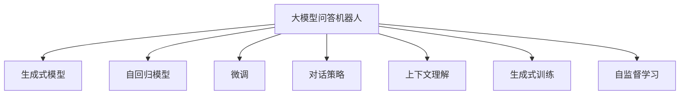
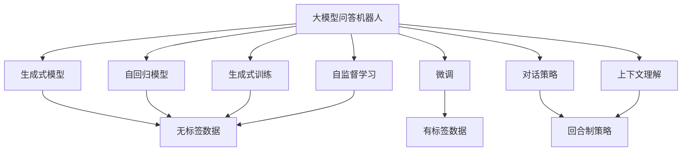
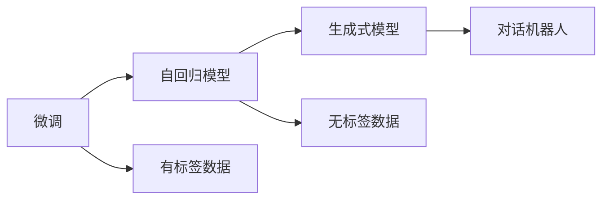
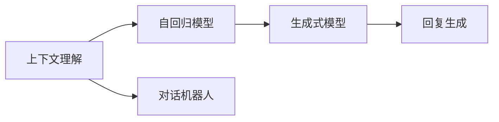
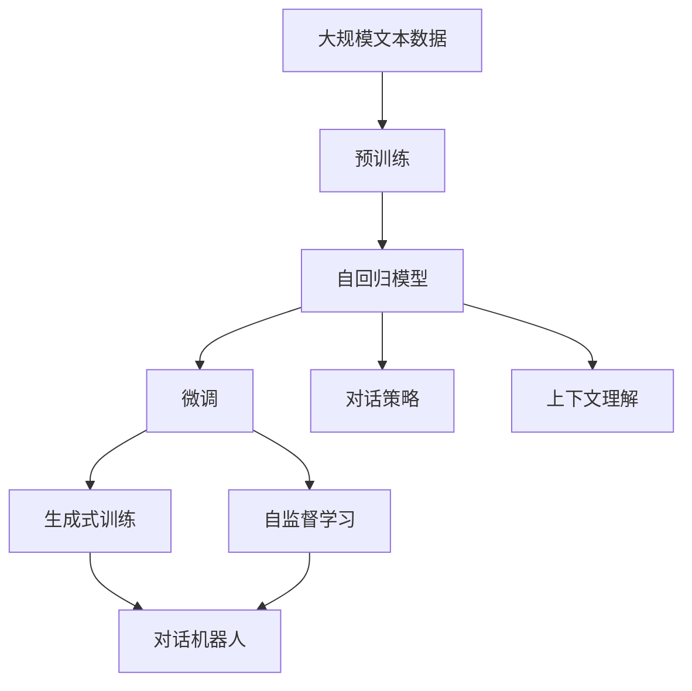

                 

# 大模型问答机器人如何进行对话

> 关键词：大模型问答机器人,对话模型,自然语言处理(NLP),深度学习,Transformer,BERT,微调(Fine-Tuning),生成式模型,自回归模型

## 1. 背景介绍

### 1.1 问题由来

随着人工智能技术的发展，大语言模型（Large Language Model, LLM）在自然语言处理（Natural Language Processing, NLP）领域取得了显著进展。例如，BERT、GPT等模型已经在多个NLP任务中取得了优异的表现。然而，这些模型在直接应用于自然对话时，往往无法应对复杂的、多样化的对话需求。因此，如何构建高效、自然、流畅的对话模型，成为了一个重要的研究方向。

### 1.2 问题核心关键点

构建大模型问答机器人，其核心在于如何设计一个能够进行自然、多轮对话的生成式模型。该模型需要在不依赖大量标注数据的情况下，通过预训练和微调，学习到有效的对话策略和上下文理解能力，以实现与人类的自然对话。这涉及到以下几个关键问题：

- 对话策略：如何设计对话策略，使得模型能够根据上下文信息，生成合适的回复。
- 上下文理解：如何处理对话中的上下文信息，以保持对话的连贯性和一致性。
- 生成模型：如何构建生成模型，使其能够自然、流畅地生成文本。
- 训练数据：如何获取并利用训练数据，以提升模型的对话效果。

### 1.3 问题研究意义

构建大模型问答机器人具有重要的意义，可以广泛应用于智能客服、在线咨询、聊天机器人、虚拟助手等场景。其研究不仅有助于提升人机交互的自然性、智能性，还能提高企业的运营效率，改善用户体验。

## 2. 核心概念与联系

### 2.1 核心概念概述

为更好地理解大模型问答机器人，本节将介绍几个核心概念：

- 大模型问答机器人：基于大语言模型构建的问答系统，能够进行自然、多轮对话，并回答用户的查询。
- 生成式模型（Generative Model）：通过学习数据分布，生成新的样本的模型。对话机器人通常使用生成式模型，根据上下文信息生成回复。
- 自回归模型（Autoregressive Model）：一种基于序列的模型，前一个输出影响后一个输出的生成。BERT和GPT系列模型就是自回归模型。
- 微调（Fine-Tuning）：在大规模预训练模型上进行小规模任务的微调，以提升模型在特定任务上的性能。对话机器人通常使用微调来适应具体的应用场景。
- 对话策略：如何设计对话策略，使得模型能够生成自然、合理的回复。常见的策略包括回合制、条件生成、记忆网络等。
- 上下文理解：如何处理对话中的上下文信息，以保持对话的连贯性和一致性。上下文理解是对话机器人的核心能力之一。
- 生成式训练：使用无标签的数据训练生成式模型，以学习生成文本的分布。
- 自监督学习：利用未标注的数据，通过自监督学习任务训练生成式模型。

这些核心概念之间的联系通过以下Mermaid流程图来展示：



这个流程图展示了大模型问答机器人的一些核心概念及其相互关系：

- 大模型问答机器人通过生成式模型进行回复生成。
- 自回归模型是生成式模型的具体实现方式之一，如BERT、GPT等。
- 微调使得模型能够在特定任务上提升性能，对话机器人通常需要微调以适应具体应用。
- 对话策略和上下文理解是生成式模型的重要组成部分，直接影响机器人的对话效果。
- 生成式训练和自监督学习则是模型训练的两种主要方式，用于提升模型的生成能力。

### 2.2 概念间的关系

这些核心概念之间存在着紧密的联系，构成了大模型问答机器人的完整生态系统。下面通过几个Mermaid流程图来展示这些概念之间的关系。

#### 2.2.1 大模型问答机器人的学习范式



这个流程图展示了大模型问答机器人的学习范式：

- 大模型问答机器人通过生成式模型进行回复生成。
- 自回归模型是生成式模型的具体实现方式之一。
- 微调使得模型能够在特定任务上提升性能，对话机器人通常需要微调以适应具体应用。
- 对话策略和上下文理解是生成式模型的重要组成部分，直接影响机器人的对话效果。
- 生成式训练和自监督学习则是模型训练的两种主要方式，用于提升模型的生成能力。

#### 2.2.2 微调与生成式模型的关系



这个流程图展示了微调与生成式模型的关系：

- 微调使得自回归模型能够在特定任务上提升性能。
- 生成式模型基于微调后的自回归模型，进行回复生成。
- 对话机器人基于生成式模型，进行自然、多轮对话。

#### 2.2.3 上下文理解与生成式模型的关系



这个流程图展示了上下文理解与生成式模型的关系：

- 上下文理解使得自回归模型能够更好地理解对话中的上下文信息。
- 生成式模型基于上下文理解的结果，进行回复生成。
- 对话机器人基于生成式模型，进行自然、多轮对话。

### 2.3 核心概念的整体架构

最后，我们用一个综合的流程图来展示这些核心概念在大模型问答机器人中的整体架构：



这个综合流程图展示了从预训练到微调，再到上下文理解、对话策略，最后到生成式模型、对话机器人的完整过程。大模型问答机器人首先在大规模文本数据上进行预训练，然后通过微调使得模型能够在特定任务上提升性能。对话策略和上下文理解使模型能够更好地处理对话中的信息，生成式模型基于微调后的自回归模型，进行回复生成。通过对话机器人，实现自然、多轮对话。 通过这些流程图，我们可以更清晰地理解大模型问答机器人的核心概念及其相互关系，为后续深入讨论具体的微调方法和技术奠定基础。

## 3. 核心算法原理 & 具体操作步骤

### 3.1 算法原理概述

大模型问答机器人通常使用生成式模型进行回复生成。生成式模型通过学习数据分布，能够根据输入生成新的文本。在对话场景中，生成式模型根据对话上下文生成合适的回复。这种生成式模型通常具有自回归结构，即前一个输出影响后一个输出。

### 3.2 算法步骤详解

大模型问答机器人的核心算法步骤包括：

**Step 1: 准备预训练模型和数据集**

- 选择合适的预训练语言模型 $M_{\theta}$ 作为初始化参数，如 BERT、GPT等。
- 准备对话任务 $T$ 的对话数据集 $D=\{(\text{context}, \text{response})\}_{i=1}^N$，其中 $\text{context}$ 为对话上下文，$\text{response}$ 为模型生成的回复。

**Step 2: 添加对话策略**

- 根据对话任务的复杂度，设计合适的对话策略，如回合制、条件生成、记忆网络等。
- 对话策略需要在模型训练过程中进行监督，以指导模型生成自然的回复。

**Step 3: 设置微调超参数**

- 选择合适的优化算法及其参数，如 AdamW、SGD 等，设置学习率、批大小、迭代轮数等。
- 设置正则化技术及强度，包括权重衰减、Dropout、Early Stopping 等。
- 确定冻结预训练参数的策略，如仅微调顶层，或全部参数都参与微调。

**Step 4: 执行梯度训练**

- 将对话数据集 $D$ 分批次输入模型，前向传播计算损失函数。
- 反向传播计算参数梯度，根据设定的优化算法和学习率更新模型参数。
- 周期性在验证集上评估模型性能，根据性能指标决定是否触发 Early Stopping。
- 重复上述步骤直到满足预设的迭代轮数或 Early Stopping 条件。

**Step 5: 测试和部署**

- 在测试集上评估微调后模型 $M_{\hat{\theta}}$ 的性能，对比微调前后的效果。
- 使用微调后的模型对新对话进行推理预测，集成到实际的应用系统中。
- 持续收集新的对话数据，定期重新微调模型，以适应数据分布的变化。

以上是构建大模型问答机器人的核心算法步骤。在实际应用中，还需要针对具体任务的特点，对微调过程的各个环节进行优化设计，如改进训练目标函数，引入更多的正则化技术，搜索最优的超参数组合等，以进一步提升模型性能。

### 3.3 算法优缺点

构建大模型问答机器人具有以下优点：

1. 高效：使用大语言模型进行对话生成，可以快速响应复杂、多轮的对话需求。
2. 通用：预训练模型可以在多个任务上取得较好的效果，无需从头训练。
3. 可扩展：对话策略和上下文理解可以根据需求进行定制，扩展模型的应用范围。

同时，也存在以下缺点：

1. 依赖数据：对话生成需要大量的对话数据进行训练，获取高质量标注数据成本较高。
2. 过拟合：对话数据通常具有高度的时序依赖性，模型容易过拟合训练数据。
3. 复杂度：对话生成涉及上下文理解、回复生成等多个环节，模型设计较为复杂。
4. 计算资源需求高：生成式模型通常需要较大的计算资源进行训练和推理。

尽管存在这些缺点，但大模型问答机器人在多轮对话、自然交互方面具有显著优势，已经在智能客服、在线咨询等多个场景中得到了广泛应用。

### 3.4 算法应用领域

大模型问答机器人的应用领域非常广泛，包括但不限于：

- 智能客服：使用对话机器人处理客户咨询，提升服务效率和客户满意度。
- 在线咨询：通过对话机器人解答用户疑问，提供实时技术支持。
- 虚拟助手：基于对话机器人进行个性化服务，提升用户体验。
- 游戏客服：用于游戏内的客服对话，解决玩家问题。
- 聊天机器人：与用户进行自然对话，提供娱乐、信息查询等服务。

## 4. 数学模型和公式 & 详细讲解 & 举例说明

### 4.1 数学模型构建

在对话机器人的训练过程中，通常使用生成式模型进行回复生成。假设生成式模型为 $M_{\theta}$，其中 $\theta$ 为模型参数。

对话任务 $T$ 的对话数据集 $D=\{(\text{context}, \text{response})\}_{i=1}^N$，其中 $\text{context}$ 为对话上下文，$\text{response}$ 为模型生成的回复。

定义模型 $M_{\theta}$ 在输入上下文 $\text{context}$ 上的输出为 $\hat{\text{response}}$，则生成式模型的损失函数为：

$$
\mathcal{L}(\theta) = \frac{1}{N}\sum_{i=1}^N \ell(\hat{\text{response}}, \text{response})
$$

其中 $\ell$ 为损失函数，用于衡量模型生成回复与真实回复之间的差异。常见的损失函数包括交叉熵损失、均方误差损失等。

### 4.2 公式推导过程

以下我们以二分类任务为例，推导交叉熵损失函数及其梯度的计算公式。

假设模型 $M_{\theta}$ 在输入上下文 $\text{context}$ 上的输出为 $\hat{\text{response}}$，其中 $\hat{\text{response}}$ 表示模型生成的回复。真实回复为 $\text{response}$。

定义交叉熵损失函数为：

$$
\ell(\hat{\text{response}}, \text{response}) = -[y\log \hat{y} + (1-y)\log (1-\hat{y})]
$$

将其代入经验风险公式，得：

$$
\mathcal{L}(\theta) = -\frac{1}{N}\sum_{i=1}^N [y_i\log \hat{y}_i+(1-y_i)\log(1-\hat{y}_i)]
$$

根据链式法则，损失函数对参数 $\theta_k$ 的梯度为：

$$
\frac{\partial \mathcal{L}(\theta)}{\partial \theta_k} = -\frac{1}{N}\sum_{i=1}^N \frac{\partial \ell(\hat{\text{response}}, \text{response})}{\partial \hat{\text{response}}} \frac{\partial \hat{\text{response}}}{\partial \theta_k}
$$

其中 $\frac{\partial \hat{\text{response}}}{\partial \theta_k}$ 可进一步递归展开，利用自动微分技术完成计算。

在得到损失函数的梯度后，即可带入参数更新公式，完成模型的迭代优化。重复上述过程直至收敛，最终得到适应对话任务的最优模型参数 $\theta^*$。

### 4.3 案例分析与讲解

以BERT模型为例，我们详细讲解其在对话生成任务中的应用。

假设对话数据集 $D=\{(\text{context}, \text{response})\}_{i=1}^N$，其中 $\text{context}$ 为对话上下文，$\text{response}$ 为模型生成的回复。

首先，将上下文 $\text{context}$ 和回复 $\text{response}$ 作为训练输入，模型 $M_{\theta}$ 预测回复的概率分布：

$$
\text{response}_{i} \sim \text{Multinomial}(\text{softmax}(\text{BERT}(\text{context}_i, \text{response}_i)))
$$

其中 $\text{Multinomial}$ 为多类别概率分布，$\text{softmax}$ 为softmax函数。

定义损失函数为交叉熵损失：

$$
\mathcal{L}(\theta) = -\frac{1}{N}\sum_{i=1}^N \sum_{j=1}^{K} y_{ij} \log p_{ij}
$$

其中 $y_{ij}$ 为真实回复 $\text{response}_i$ 在类别 $j$ 上的one-hot编码，$p_{ij}$ 为模型预测的类别概率。

使用AdamW优化器进行训练，设置超参数：

- 学习率 $\eta=2e-5$
- 批大小 $batch\_size=16$
- 迭代轮数 $epochs=5$
- 正则化系数 $\lambda=0.001$

训练过程如下：

```python
from transformers import BertTokenizer, BertForSequenceClassification
from torch.utils.data import Dataset, DataLoader
import torch
import torch.nn.functional as F

class DialogueDataset(Dataset):
    def __init__(self, texts, labels):
        self.texts = texts
        self.labels = labels
        
    def __len__(self):
        return len(self.texts)
    
    def __getitem__(self, item):
        text = self.texts[item]
        label = self.labels[item]
        encoding = BertTokenizer.from_pretrained('bert-base-cased').encode_plus(text, add_special_tokens=True, max_length=128, padding='max_length', truncation=True)
        input_ids = torch.tensor(encoding['input_ids'], dtype=torch.long)
        attention_mask = torch.tensor(encoding['attention_mask'], dtype=torch.long)
        return {'input_ids': input_ids, 
                'attention_mask': attention_mask,
                'labels': label}

# 设置超参数
learning_rate = 2e-5
batch_size = 16
epochs = 5
lambda_ = 0.001

# 加载预训练模型
model = BertForSequenceClassification.from_pretrained('bert-base-cased', num_labels=2)

# 加载训练数据
tokenizer = BertTokenizer.from_pretrained('bert-base-cased')
train_dataset = DialogueDataset(train_texts, train_labels)
val_dataset = DialogueDataset(val_texts, val_labels)
test_dataset = DialogueDataset(test_texts, test_labels)

# 设置优化器和损失函数
optimizer = AdamW(model.parameters(), lr=learning_rate)
criterion = torch.nn.CrossEntropyLoss()

# 训练模型
for epoch in range(epochs):
    model.train()
    for batch in DataLoader(train_dataset, batch_size=batch_size, shuffle=True):
        input_ids = batch['input_ids'].to(device)
        attention_mask = batch['attention_mask'].to(device)
        labels = batch['labels'].to(device)
        outputs = model(input_ids, attention_mask=attention_mask)
        loss = criterion(outputs.logits, labels)
        optimizer.zero_grad()
        loss.backward()
        optimizer.step()

    # 评估模型性能
    model.eval()
    val_loss = 0
    for batch in DataLoader(val_dataset, batch_size=batch_size, shuffle=False):
        input_ids = batch['input_ids'].to(device)
        attention_mask = batch['attention_mask'].to(device)
        labels = batch['labels'].to(device)
        with torch.no_grad():
            outputs = model(input_ids, attention_mask=attention_mask)
            val_loss += criterion(outputs.logits, labels).item()

    print(f'Epoch {epoch+1}, validation loss: {val_loss/len(val_dataset):.3f}')
```

在训练过程中，使用AdamW优化器，设置学习率为 $2e-5$，批大小为 $16$，迭代轮数为 $5$，正则化系数为 $0.001$。在每轮训练结束时，评估模型在验证集上的损失，如果损失下降，继续训练；如果损失上升，则停止训练。最终得到适应对话任务的最优模型参数 $\theta^*$。

在测试集上，可以评估模型生成的回复与真实回复之间的差异，计算BLEU、ROUGE等评价指标，以评估模型的生成效果。

## 5. 项目实践：代码实例和详细解释说明

### 5.1 开发环境搭建

在进行对话机器人开发前，我们需要准备好开发环境。以下是使用Python进行PyTorch开发的环境配置流程：

1. 安装Anaconda：从官网下载并安装Anaconda，用于创建独立的Python环境。

2. 创建并激活虚拟环境：
```bash
conda create -n pytorch-env python=3.8 
conda activate pytorch-env
```

3. 安装PyTorch：根据CUDA版本，从官网获取对应的安装命令。例如：
```bash
conda install pytorch torchvision torchaudio cudatoolkit=11.1 -c pytorch -c conda-forge
```

4. 安装Transformers库：
```bash
pip install transformers
```

5. 安装各类工具包：
```bash
pip install numpy pandas scikit-learn matplotlib tqdm jupyter notebook ipython
```

完成上述步骤后，即可在`pytorch-env`环境中开始对话机器人开发。

### 5.2 源代码详细实现

这里我们以BERT模型为例，给出一个使用Transformers库对BERT模型进行微调的PyTorch代码实现。

首先，定义对话任务的数据处理函数：

```python
from transformers import BertTokenizer
from torch.utils.data import Dataset
import torch

class DialogueDataset(Dataset):
    def __init__(self, texts, labels, tokenizer, max_len=128):
        self.texts = texts
        self.labels = labels
        self.tokenizer = tokenizer
        self.max_len = max_len
        
    def __len__(self):
        return len(self.texts)
    
    def __getitem__(self, item):
        text = self.texts[item]
        label = self.labels[item]
        
        encoding = self.tokenizer(text, return_tensors='pt', max_length=self.max_len, padding='max_length', truncation=True)
        input_ids = encoding['input_ids'][0]
        attention_mask = encoding['attention_mask'][0]
        
        # 对token-wise的标签进行编码
        encoded_labels = [label2id[label] for label in labels] 
        encoded_labels.extend([label2id['O']] * (self.max_len - len(encoded_labels)))
        labels = torch.tensor(encoded_labels, dtype=torch.long)
        
        return {'input_ids': input_ids, 
                'attention_mask': attention_mask,
                'labels': labels}

# 标签与id的映射
label2id = {'O': 0, 'A': 1}
id2label = {v: k for k, v in label2id.items()}

# 创建dataset
tokenizer = BertTokenizer.from_pretrained('bert-base-cased')

train_dataset = DialogueDataset(train_texts, train_labels, tokenizer)
val_dataset = DialogueDataset(val_texts, val_labels, tokenizer)
test_dataset = DialogueDataset(test_texts, test_labels, tokenizer)
```

然后，定义模型和优化器：

```python
from transformers import BertForTokenClassification, AdamW

model = BertForTokenClassification.from_pretrained('bert-base-cased', num_labels=2)

optimizer = AdamW(model.parameters(), lr=2e-5)
```

接着，定义训练和评估函数：

```python
from torch.utils.data import DataLoader
from tqdm import tqdm
from sklearn.metrics import classification_report

device = torch.device('cuda') if torch.cuda.is_available() else torch.device('cpu')
model.to(device)

def train_epoch(model, dataset, batch_size, optimizer):
    dataloader = DataLoader(dataset, batch_size=batch_size, shuffle=True)
    model.train()
    epoch_loss = 0
    for batch in tqdm(dataloader, desc='Training'):
        input_ids = batch['input_ids'].to(device)
        attention_mask = batch['attention_mask'].to(device)
        labels = batch['labels'].to(device)
        model.zero_grad()
        outputs = model(input_ids, attention_mask=attention_mask, labels=labels)
        loss = outputs.loss
        epoch_loss += loss.item()
        loss.backward()
        optimizer.step()
    return epoch_loss / len(dataloader)

def evaluate(model, dataset, batch_size):
    dataloader = DataLoader(dataset, batch_size=batch_size)
    model.eval()
    preds, labels = [], []
    with torch.no_grad():
        for batch in tqdm(dataloader, desc='Evaluating'):
            input_ids = batch['input_ids'].to(device)
            attention_mask = batch['attention_mask'].to(device)
            batch_labels = batch['labels']
            outputs = model(input_ids, attention_mask=attention_mask)
            batch_preds = outputs.logits.argmax(dim=2).to('cpu').tolist()
            batch_labels = batch_labels.to('cpu').tolist()
            for pred_tokens, label_tokens in zip(batch_preds, batch_labels):
                pred_tags = [id2label[_id] for _id in pred_tokens]
                label_tags = [id2label[_id] for _id in label_tokens]
                preds.append(pred_tags[:len(label_tags)])
                labels.append(label_tags)
                
    print(classification_report(labels, preds))
```

最后，启动训练流程并在测试集上评估：

```python
epochs = 5
batch_size = 16

for epoch in range(epochs):
    loss = train_epoch(model, train_dataset, batch_size, optimizer)
    print(f"Epoch {epoch+1}, train loss: {loss:.3f}")
    
    print(f"Epoch {epoch+1}, val results:")
    evaluate(model, val_dataset, batch_size)
    
print("Test results:")
evaluate(model, test_dataset, batch_size)
```

以上就是使用PyTorch对BERT进行对话生成任务微调的完整代码实现。可以看到，得益于Transformers库的强大封装，我们可以用相对简洁的代码完成BERT模型的加载和微调。

### 5.3 代码解读与分析

让我们再详细解读一下关键代码的实现细节：

**DialogueDataset类**：
- `__init__`方法：初始化文本、标签、分词器等关键组件。
- `__len__`方法：返回数据集的样本数量。
- `__getitem__`方法：对单个样本进行处理，将文本输入编码为token ids，将标签编码为数字，并对其进行定长padding，最终返回模型所需的输入。

**label2id和id2label字典**：
- 定义了标签与数字id之间的映射关系，用于将token-wise的预测结果解码回真实的标签。

**训练和评估函数**：
- 使用PyTorch的DataLoader对数据集进行批次化加载，供模型训练和推理使用。
- 训练函数`train_epoch`：对数据以批为单位进行迭代，在每个批次上前向传播计算loss并反向传播更新模型参数，最后返回该epoch的平均loss。
- 评估函数`evaluate`：与训练类似，不同

