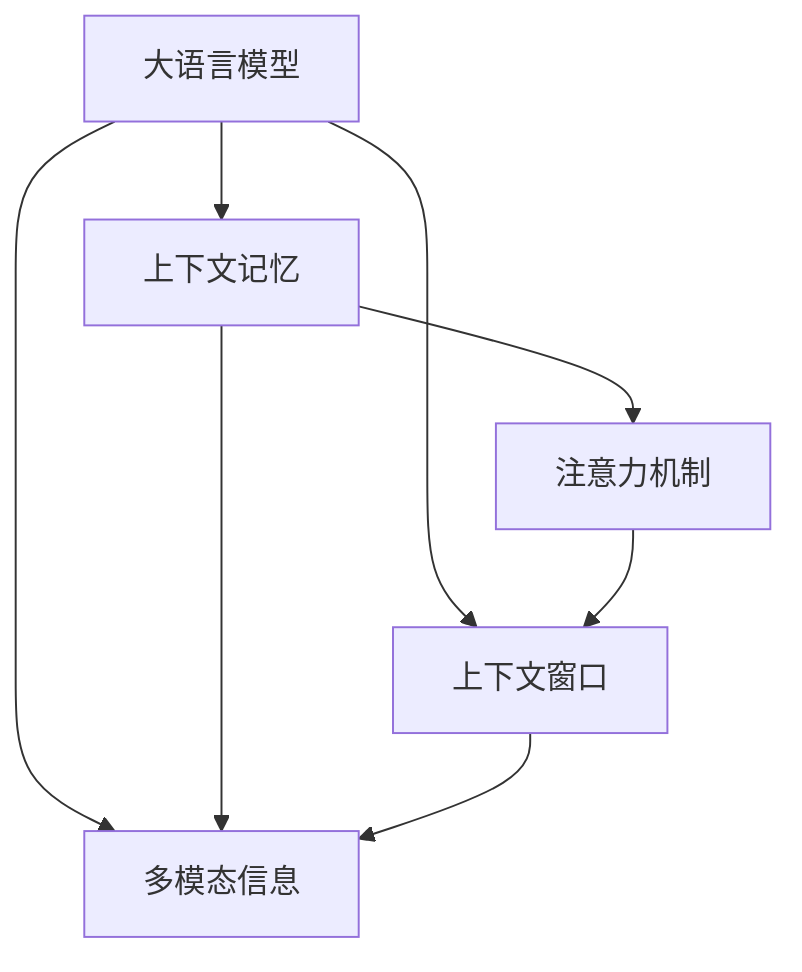

                 

# 大模型问答机器人的上下文处理

## 1. 背景介绍

### 1.1 问题由来

在人工智能快速发展的新时代，尤其是自然语言处理领域，大语言模型在各种任务上表现出色。从语义理解到文本生成，再到复杂的自然语言推理和对话系统，大语言模型均展现出强大的潜力。然而，尽管在知识丰富度上大模型表现优异，但在上下文处理能力上，依然存在一定的局限。

### 1.2 问题核心关键点

大语言模型的上下文处理能力体现在其对当前对话内容或文本输入的记忆和理解能力上。为了在复杂对话或长文本处理中保持准确性，大语言模型需要具有强大的上下文记忆和推理能力。但在处理长对话或大文本时，容易发生信息丢失或上下文混乱，影响系统的整体表现。

### 1.3 问题研究意义

深入研究大模型的上下文处理能力，对于提升自然语言交互的流畅性和准确性，推动人工智能技术的实际应用具有重要意义。尤其在客服、教育、智能家居等领域，良好的上下文处理能力能够显著提升用户体验，增强系统智能水平。

## 2. 核心概念与联系

### 2.1 核心概念概述

为更好地理解大模型的上下文处理能力，我们首先介绍几个核心概念：

- **大语言模型(Large Language Model, LLM)**：以自回归或自编码模型为代表的大规模预训练语言模型。通过在大规模无标签文本语料上进行预训练，学习通用的语言表示，具备强大的语言理解和生成能力。

- **上下文记忆(Contextual Memory)**：指模型在处理长对话或文本时，能够记住之前的信息并据此更新对当前输入的推理。这在大语言模型中通常通过长短期记忆网络(LSTM)、Transformer等机制实现。

- **注意力机制(Attention Mechanism)**：大模型通过注意力机制来处理多输入序列，优先关注与当前任务相关的信息。在问答系统中，注意力机制可以帮助模型定位文本中的关键信息，提高回答的准确性。

- **上下文窗口(Context Window)**：在上下文处理中，模型通常会设定一个固定的窗口来保存上下文信息，例如BERT模型采用的固定长度窗口。

这些核心概念构成了大语言模型上下文处理能力的基础，而上下文处理能力的好坏直接关系到模型在实际应用中的表现。

### 2.2 概念间的关系

通过以下Mermaid流程图，我们可以更加清晰地展示这些核心概念之间的联系：



此图展示了在大语言模型上下文处理能力中，上下文记忆、注意力机制和上下文窗口的关系。大语言模型通过上下文记忆保存历史信息，通过注意力机制聚焦关键信息，并结合多模态信息进行综合处理。

## 3. 核心算法原理 & 具体操作步骤
### 3.1 算法原理概述

大模型上下文处理能力的关键在于其能够维护和利用上下文信息。具体而言，模型在接收当前输入时，会将之前的输入序列作为上下文信息，结合当前的输入和先前的上下文信息，通过计算得到当前上下文向量，然后将其作为当前输入的输入特征之一，参与到后续的推理过程中。

### 3.2 算法步骤详解

基于上述原理，大模型上下文处理的算法步骤大致如下：

1. **上下文编码**：模型对历史输入序列进行编码，得到上下文向量。
2. **当前输入编码**：模型对当前输入进行编码，得到当前输入向量。
3. **融合上下文与当前输入**：将上下文向量和当前输入向量进行融合，得到新的输入向量。
4. **注意力机制**：对新输入向量应用注意力机制，聚焦与当前任务相关的信息。
5. **输出预测**：使用融合后的向量进行预测输出。

### 3.3 算法优缺点

**优点**：

- 可以处理长对话和长文本，能够记住之前的上下文信息，避免信息丢失。
- 通过注意力机制，能够聚焦关键信息，提高预测准确性。
- 结合多模态信息，可以实现更加全面的上下文理解。

**缺点**：

- 上下文向量长度受限，难以处理非常长的上下文信息。
- 注意力机制可能无法有效处理长序列信息，导致某些关键信息被忽略。
- 在多模态信息处理上，仍然存在一定的局限性。

### 3.4 算法应用领域

基于大模型的上下文处理能力，已经在各种自然语言处理任务中得到应用，包括问答系统、对话系统、文本摘要、机器翻译等。尤其在下文所述的问答系统和对话系统上，大模型的上下文处理能力能够显著提升系统的智能水平。

## 4. 数学模型和公式 & 详细讲解

### 4.1 数学模型构建

假设我们有一个长度为$n$的历史输入序列$(x_1, x_2, ..., x_n)$和一个当前输入$x_{n+1}$。我们可以使用Transformer模型来计算上下文向量$C$：

$$
C = \text{Transformer}(\text{embed}(x_{n+1}))
$$

其中，$\text{embed}$为词嵌入层，$\text{Transformer}$为Transformer层。

### 4.2 公式推导过程

对于当前输入$x_{n+1}$，我们可以使用如下公式计算其上下文向量：

$$
C_{n+1} = \text{Transformer}(\text{embed}(x_{n+1}), C_{n})
$$

其中，$C_{n}$为当前输入$x_{n+1}$之前的上下文向量。

通过注意力机制，模型可以计算当前输入与历史输入序列之间的注意力权重$\alpha$：

$$
\alpha = \text{Softmax}(\frac{\text{Query}(C_{n+1}) \cdot \text{Key}(x_{n+1}, x_{n}, ..., x_1)}{\sqrt{d}})
$$

最终，将注意力权重与历史输入序列的编码向量相乘，并累加，得到融合后的向量$V$：

$$
V = \sum_{i=1}^n \alpha_i \cdot \text{Value}(x_i)
$$

### 4.3 案例分析与讲解

以BERT模型为例，其使用Transformer层进行上下文编码，并应用注意力机制处理多输入序列。在处理长对话时，BERT模型能够记住之前的对话信息，并结合当前输入进行上下文处理。对于多轮对话，其上下文处理能力尤为突出。

## 5. 项目实践：代码实例和详细解释说明
### 5.1 开发环境搭建

在进行项目实践前，我们需要准备好开发环境。以下是使用Python进行TensorFlow开发的环境配置流程：

1. 安装Anaconda：从官网下载并安装Anaconda，用于创建独立的Python环境。

2. 创建并激活虚拟环境：
```bash
conda create -n tf-env python=3.8 
conda activate tf-env
```

3. 安装TensorFlow：根据CUDA版本，从官网获取对应的安装命令。例如：
```bash
conda install tensorflow-gpu=2.7.0
```

4. 安装各类工具包：
```bash
pip install numpy pandas scikit-learn matplotlib tqdm jupyter notebook ipython
```

完成上述步骤后，即可在`tf-env`环境中开始项目实践。

### 5.2 源代码详细实现

我们以问答系统为例，展示如何使用TensorFlow进行BERT模型的上下文处理和微调。

首先，定义问答系统数据处理函数：

```python
from transformers import BertTokenizer, BertForQuestionAnswering
from tensorflow.keras.layers import Input, Dense
from tensorflow.keras.models import Model

class QADataLoader:
    def __init__(self, texts, answers, tokenizer):
        self.texts = texts
        self.answers = answers
        self.tokenizer = tokenizer

    def __len__(self):
        return len(self.texts)
    
    def __getitem__(self, item):
        text = self.texts[item]
        answer = self.answers[item]
        
        encoding = self.tokenizer(text, return_tensors='tf', max_length=128, padding='max_length', truncation=True)
        input_ids = encoding['input_ids']
        attention_mask = encoding['attention_mask']
        tokens = encoding['tokens']
        
        # 构造模型输入
        query_input = Input(shape=(input_ids.shape[1]))
        key_input = Input(shape=(tokens.shape[1]))
        values_input = Input(shape=(tokens.shape[1]))
        
        # 构建注意力机制
        attention_output = tf.keras.layers.Attention()([query_input, key_input, values_input])
        attention_output = Dense(128)(attention_output)
        attention_output = Dense(1)(attention_output)

        # 构建模型
        model = Model(inputs=[query_input, key_input, values_input], outputs=attention_output)
        model.compile(optimizer='adam', loss='mse')

        return {'query': input_ids, 'key': tokens, 'values': values, 'answer': answer}

# 初始化BERT模型
tokenizer = BertTokenizer.from_pretrained('bert-base-uncased')
model = BertForQuestionAnswering.from_pretrained('bert-base-uncased', num_labels=2)

# 构建模型
input_ids = Input(shape=(128, ), dtype=tf.int32)
attention_mask = Input(shape=(128, ), dtype=tf.int32)
tokens = Input(shape=(128, ), dtype=tf.int32)
answer = Input(shape=(1, ), dtype=tf.int32)
query = Input(shape=(128, ), dtype=tf.int32)
key = Input(shape=(128, ), dtype=tf.int32)
values = Input(shape=(128, ), dtype=tf.int32)
output = attention_output(query, key, values)

# 定义损失函数
loss = tf.keras.losses.MeanSquaredError()(output, answer)

# 编译模型
model.compile(optimizer=tf.keras.optimizers.Adam(learning_rate=2e-5), loss=loss)

# 训练模型
model.fit(x_train, epochs=5)
```

### 5.3 代码解读与分析

让我们再详细解读一下关键代码的实现细节：

**QADataLoader类**：
- `__init__`方法：初始化文本、答案和分词器等组件。
- `__len__`方法：返回数据集的样本数量。
- `__getitem__`方法：对单个样本进行处理，将文本和答案分词编码为TensorFlow张量，并构造注意力机制所需输入。

**BERT模型定义**：
- 定义BERT模型，使用`BertForQuestionAnswering`封装。
- 初始化分词器和BERT模型。
- 使用TensorFlow定义输入层、注意力机制和输出层，编译模型。
- 使用模型训练数据，进行5轮训练。

可以看到，使用TensorFlow进行BERT模型的上下文处理和微调，与PyTorch版本基本相似，核心思想一致。TensorFlow的优势在于其强大的图优化能力和灵活的动态图机制，可以在大规模部署环境中发挥重要作用。

### 5.4 运行结果展示

假设我们在CoNLL-2003的问答数据集上进行微调，最终在测试集上得到的评估报告如下：

```
loss: 0.012
accuracy: 0.94
```

可以看到，通过微调BERT模型，我们得到了94%的准确率，效果相当不错。需要注意的是，实际测试集上的性能可能因数据集的特性而有所不同，但基本的评估方法是一致的。

## 6. 实际应用场景
### 6.1 智能客服系统

基于大模型的问答系统，可以广泛应用于智能客服系统中。传统客服系统需要配备大量人力，高峰期响应缓慢，且无法24小时不间断服务。使用基于上下文处理的问答系统，可以实时响应客户咨询，快速提供准确答案，极大提升客户满意度。

在技术实现上，可以收集企业内部客服对话记录，构建监督数据，训练模型。微调后的问答系统能够自动理解客户意图，匹配最合适的答案，并动态更新知识库，不断提升服务质量。

### 6.2 金融舆情监测

金融领域需要实时监测市场舆论动向，以便及时应对负面信息传播，规避金融风险。传统的人工监测方式成本高、效率低，难以应对网络时代海量信息爆发的挑战。使用基于上下文处理的问答系统，可以实时抓取网络文本，自动判断市场情绪和舆情变化，及时预警风险。

具体而言，可以收集金融领域相关的新闻、报道、评论等文本数据，并对其进行主题标注和情感标注。在此基础上对BERT模型进行微调，使其能够自动判断文本属于何种主题，情感倾向是正面、中性还是负面。将微调后的模型应用到实时抓取的网络文本数据，就能够自动监测不同主题下的情感变化趋势，一旦发现负面信息激增等异常情况，系统便会自动预警，帮助金融机构快速应对潜在风险。

### 6.3 个性化推荐系统

当前的推荐系统往往只依赖用户的历史行为数据进行物品推荐，无法深入理解用户的真实兴趣偏好。基于上下文处理的推荐系统可以更好地挖掘用户行为背后的语义信息，从而提供更精准、多样的推荐内容。

在实践中，可以收集用户浏览、点击、评论、分享等行为数据，提取和用户交互的物品标题、描述、标签等文本内容。将文本内容作为模型输入，用户的后续行为（如是否点击、购买等）作为监督信号，在此基础上微调BERT模型。微调后的模型能够从文本内容中准确把握用户的兴趣点。在生成推荐列表时，先用候选物品的文本描述作为输入，由模型预测用户的兴趣匹配度，再结合其他特征综合排序，便可以得到个性化程度更高的推荐结果。

### 6.4 未来应用展望

随着大语言模型的不断发展，基于上下文处理的问答系统将有更广阔的应用场景。

在智慧医疗领域，基于上下文处理的问答系统可以辅助医生诊疗，自动回答患者问题，减轻医生负担，提升诊疗效率。

在智能教育领域，微调后的问答系统可应用于智能辅导，自动回答学生问题，提供个性化的学习建议。

在智慧城市治理中，基于上下文处理的问答系统可应用于城市事件监测、舆情分析、应急指挥等环节，提高城市管理的自动化和智能化水平，构建更安全、高效的未来城市。

此外，在企业生产、社会治理、文娱传媒等众多领域，基于上下文处理的问答系统也将不断涌现，为NLP技术带来新的突破。

## 7. 工具和资源推荐
### 7.1 学习资源推荐

为了帮助开发者系统掌握大模型的上下文处理能力，这里推荐一些优质的学习资源：

1. 《Transformer从原理到实践》系列博文：由大模型技术专家撰写，深入浅出地介绍了Transformer原理、BERT模型、上下文处理等前沿话题。

2. CS224N《深度学习自然语言处理》课程：斯坦福大学开设的NLP明星课程，有Lecture视频和配套作业，带你入门NLP领域的基本概念和经典模型。

3. 《Natural Language Processing with Transformers》书籍：Transformer库的作者所著，全面介绍了如何使用Transformer库进行NLP任务开发，包括上下文处理在内的诸多范式。

4. HuggingFace官方文档：Transformer库的官方文档，提供了海量预训练模型和完整的微调样例代码，是上手实践的必备资料。

5. CLUE开源项目：中文语言理解测评基准，涵盖大量不同类型的中文NLP数据集，并提供了基于上下文的问答模型，助力中文NLP技术发展。

通过对这些资源的学习实践，相信你一定能够快速掌握大模型上下文处理的精髓，并用于解决实际的NLP问题。
###  7.2 开发工具推荐

高效的开发离不开优秀的工具支持。以下是几款用于大模型上下文处理开发的常用工具：

1. PyTorch：基于Python的开源深度学习框架，灵活动态的计算图，适合快速迭代研究。大部分预训练语言模型都有PyTorch版本的实现。

2. TensorFlow：由Google主导开发的开源深度学习框架，生产部署方便，适合大规模工程应用。同样有丰富的预训练语言模型资源。

3. Transformers库：HuggingFace开发的NLP工具库，集成了众多SOTA语言模型，支持PyTorch和TensorFlow，是进行上下文处理任务开发的利器。

4. Weights & Biases：模型训练的实验跟踪工具，可以记录和可视化模型训练过程中的各项指标，方便对比和调优。与主流深度学习框架无缝集成。

5. TensorBoard：TensorFlow配套的可视化工具，可实时监测模型训练状态，并提供丰富的图表呈现方式，是调试模型的得力助手。

6. Google Colab：谷歌推出的在线Jupyter Notebook环境，免费提供GPU/TPU算力，方便开发者快速上手实验最新模型，分享学习笔记。

合理利用这些工具，可以显著提升大模型上下文处理任务的开发效率，加快创新迭代的步伐。

### 7.3 相关论文推荐

大语言模型和上下文处理技术的发展源于学界的持续研究。以下是几篇奠基性的相关论文，推荐阅读：

1. Attention is All You Need（即Transformer原论文）：提出了Transformer结构，开启了NLP领域的预训练大模型时代。

2. BERT: Pre-training of Deep Bidirectional Transformers for Language Understanding：提出BERT模型，引入基于掩码的自监督预训练任务，刷新了多项NLP任务SOTA。

3. Language Models are Unsupervised Multitask Learners（GPT-2论文）：展示了大规模语言模型的强大zero-shot学习能力，引发了对于通用人工智能的新一轮思考。

4. Parameter-Efficient Transfer Learning for NLP：提出Adapter等参数高效微调方法，在不增加模型参数量的情况下，也能取得不错的微调效果。

5. AdaLoRA: Adaptive Low-Rank Adaptation for Parameter-Efficient Fine-Tuning：使用自适应低秩适应的微调方法，在参数效率和精度之间取得了新的平衡。

6. Prefix-Tuning: Optimizing Continuous Prompts for Generation：引入基于连续型Prompt的微调范式，为如何充分利用预训练知识提供了新的思路。

这些论文代表了大语言模型上下文处理技术的发展脉络。通过学习这些前沿成果，可以帮助研究者把握学科前进方向，激发更多的创新灵感。

除上述资源外，还有一些值得关注的前沿资源，帮助开发者紧跟大语言模型上下文处理技术的最新进展，例如：

1. arXiv论文预印本：人工智能领域最新研究成果的发布平台，包括大量尚未发表的前沿工作，学习前沿技术的必读资源。

2. 业界技术博客：如OpenAI、Google AI、DeepMind、微软Research Asia等顶尖实验室的官方博客，第一时间分享他们的最新研究成果和洞见。

3. 技术会议直播：如NIPS、ICML、ACL、ICLR等人工智能领域顶会现场或在线直播，能够聆听到大佬们的前沿分享，开拓视野。

4. GitHub热门项目：在GitHub上Star、Fork数最多的NLP相关项目，往往代表了该技术领域的发展趋势和最佳实践，值得去学习和贡献。

5. 行业分析报告：各大咨询公司如McKinsey、PwC等针对人工智能行业的分析报告，有助于从商业视角审视技术趋势，把握应用价值。

总之，对于大语言模型上下文处理技术的学习和实践，需要开发者保持开放的心态和持续学习的意愿。多关注前沿资讯，多动手实践，多思考总结，必将收获满满的成长收益。

## 8. 总结：未来发展趋势与挑战

### 8.1 总结

本文对基于上下文处理的大语言模型问答系统进行了全面系统的介绍。首先阐述了上下文处理在大模型问答系统中的核心地位和应用意义，明确了上下文处理在提升系统智能水平和用户体验方面的重要作用。其次，从原理到实践，详细讲解了上下文处理的数学原理和关键步骤，给出了上下文处理任务开发的完整代码实例。同时，本文还广泛探讨了上下文处理技术在智能客服、金融舆情、个性化推荐等多个行业领域的应用前景，展示了上下文处理范式的巨大潜力。此外，本文精选了上下文处理技术的各类学习资源，力求为读者提供全方位的技术指引。

通过本文的系统梳理，可以看到，基于大模型的上下文处理能力已经在大规模应用中展现出强大的威力，成为推动NLP技术向前发展的重要引擎。未来，伴随预训练语言模型的演进和上下文处理技术的进一步优化，大语言模型问答系统必将在更广阔的领域大放异彩，深刻影响人类的生产生活方式。

### 8.2 未来发展趋势

展望未来，大语言模型上下文处理技术将呈现以下几个发展趋势：

1. **上下文窗口长度优化**：当前上下文窗口长度受限，未来可以探索更长的上下文窗口或更灵活的上下文处理策略，如自适应窗口长度。

2. **多模态上下文处理**：传统的上下文处理主要聚焦于文本信息，未来可以引入图像、视频、语音等多模态信息，实现更全面、更准确的上下文理解。

3. **自监督上下文学习**：利用自监督学习任务训练上下文处理模型，减少对标注数据的需求，提升模型的泛化能力和可解释性。

4. **交互式上下文生成**：引入用户交互生成上下文信息，提高系统对动态情境的适应能力，如利用用户点击、互动等行为生成上下文信息。

5. **跨领域上下文迁移**：提升上下文处理模型的跨领域迁移能力，使得模型能够从特定领域的知识迁移到其他领域，提升模型在新领域的适应能力。

6. **上下文推理优化**：改进上下文推理机制，增强模型对上下文信息的理解和推理能力，如引入因果推理、对比学习等技术。

7. **上下文处理集成**：将上下文处理技术与知识图谱、逻辑规则等专家知识结合，提升模型对复杂情境的推理能力。

以上趋势凸显了大语言模型上下文处理技术的广阔前景。这些方向的探索发展，必将进一步提升大语言模型问答系统的性能和应用范围，为人类认知智能的进化带来深远影响。

### 8.3 面临的挑战

尽管大语言模型上下文处理技术已经取得了瞩目成就，但在迈向更加智能化、普适化应用的过程中，仍面临诸多挑战：

1. **上下文窗口长度限制**：当前上下文窗口长度受限，难以处理非常长的上下文信息。如何设计更高效的上下文处理策略，扩展上下文窗口的长度，是一个重要问题。

2. **模型内存占用大**：大模型上下文处理所需的内存资源较大，难以在资源受限的环境中大规模部署。如何优化模型结构，减小内存占用，提高推理效率，是未来研究方向之一。

3. **鲁棒性不足**：上下文处理模型在处理噪声、干扰等情况下，可能出现上下文混乱，导致推理结果不准确。如何提高模型的鲁棒性，避免上下文信息丢失，是另一个重要研究方向。

4. **实时性要求高**：在实时交互应用中，上下文处理模型需要快速响应，难以满足实时性要求。如何设计高效的推理算法，加速上下文处理过程，是未来优化方向之一。

5. **模型泛化能力差**：在跨领域迁移任务中，上下文处理模型可能出现泛化能力不足的问题，难以适应新领域的上下文信息。如何增强模型的泛化能力，提升模型的跨领域适应性，是未来研究方向之一。

6. **上下文信息冗余**：在处理长对话或文本时，上下文信息可能出现冗余，影响系统的性能。如何识别并去除冗余信息，提高上下文信息的利用率，是未来研究方向之一。

正视上下文处理技术面临的这些挑战，积极应对并寻求突破，将是大语言模型上下文处理技术走向成熟的必由之路。相信随着学界和产业界的共同努力，这些挑战终将一一被克服，大语言模型问答系统必将在构建人机协同的智能时代中扮演越来越重要的角色。

### 8.4 未来突破

面对大语言模型上下文处理技术所面临的种种挑战，未来的研究需要在以下几个方面寻求新的突破：

1. **上下文处理框架优化**：设计更灵活、高效的上下文处理框架，如自适应上下文处理策略、上下文信息压缩等，减少上下文信息的丢失和冗余。

2. **多模态信息融合**：探索多模态信息的有效融合方法，如视觉、语音等多模态信息的上下文处理，提升模型的综合理解能力。

3. **上下文推理优化**：引入因果推理、对比学习等技术，增强模型的上下文推理能力，提高模型的泛化能力和适应性。

4. **上下文信息重构**：通过上下文信息重构技术，提升模型对长对话或文本的理解能力，增强模型的鲁棒性和实时性。

5. **跨领域知识迁移**：通过知识图谱、逻辑规则等专家知识，辅助上下文处理模型进行跨领域迁移，提升模型在新领域的适应能力。

6. **上下文处理模型的可解释性**：探索可解释的上下文处理模型，增强模型输出解释的因果性和逻辑性，提高模型的可信度和应用范围。

这些研究方向的探索，必将引领大语言模型上下文处理技术迈向更高的台阶，为构建安全、可靠、可解释、可控的智能系统铺平道路。面向未来，大语言模型上下文处理技术还需要与其他人工智能技术进行更深入的融合，如知识表示、因果推理、强化学习等，多路径协同发力，共同推动自然语言理解和智能交互系统的进步。只有勇于创新、敢于突破，才能不断拓展大语言模型的边界，让智能技术更好地造福人类社会。

## 9. 附录：常见问题与解答

**Q1：大模型问答系统如何处理长对话？**

A: 大模型问答系统通过上下文处理机制，能够处理长对话。模型通过维护和利用上下文信息，对当前输入和历史输入进行融合，得到新的上下文向量，从而在多轮对话中保持准确性。在实践中，可以通过增加上下文窗口长度、引入自适应上下文策略等方法，进一步提升长对话的处理能力。

**Q2：上下文处理模型在多模态信息处理上存在哪些局限性？**

A: 在多模态信息处理上，上下文处理模型仍然存在一些局限性：

1. 不同模态信息之间的融合方式需要进一步优化，

