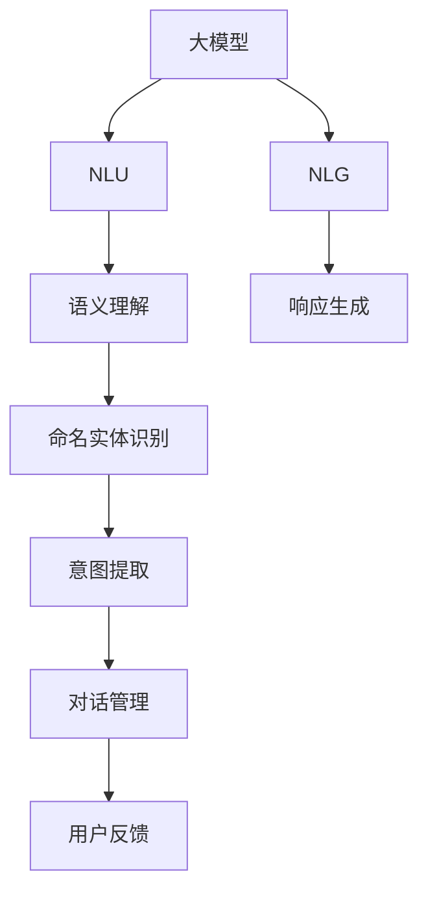
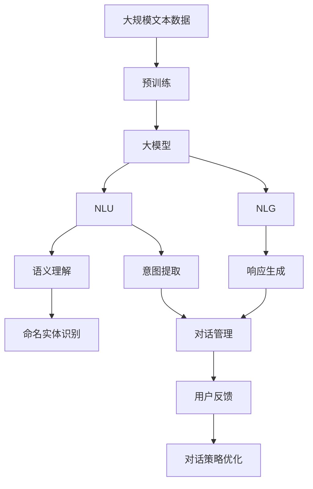

                 

# 大模型问答机器人的交互实现

> 关键词：问答机器人,自然语言理解,NLU,Transformer,BERT,自然语言生成,语言模型,交互设计

## 1. 背景介绍

### 1.1 问题由来
随着人工智能技术的发展，特别是深度学习技术的成熟，自然语言处理(Natural Language Processing, NLP)领域涌现出了诸多高效的模型，如BERT、GPT-3等。这些模型在理解自然语言和生成自然语言方面表现出色，因此在构建智能问答系统（Intelligent Question Answering, IQA）中具有重要应用价值。问答机器人作为智能问答系统的具体实现形式，能够通过自然语言与用户进行交互，解答用户提出的各种问题，提供即时的信息服务。

在实际应用中，如何使问答机器人更好地理解用户意图，提供高质量的个性化响应，同时提升系统交互的自然流畅性，成为了一个关键问题。本博客将深入探讨基于大模型问答机器人的交互实现，详细解析其在理解自然语言、生成自然语言以及与用户交互过程中的核心算法和步骤。

### 1.2 问题核心关键点
大模型问答机器人的核心挑战在于：

- **自然语言理解(Natural Language Understanding, NLU)**：如何准确理解用户的输入，提取关键信息，并生成合适的语境。
- **自然语言生成(Natural Language Generation, NLG)**：如何基于理解结果，生成自然、流畅的回应。
- **交互设计**：如何通过设计良好的对话流程，提升用户体验，使其能更好地与系统进行互动。

本文将围绕这些问题，从理论到实践，探讨大模型问答机器人的交互实现。

### 1.3 问题研究意义
本研究具有以下重要意义：

1. **提高问答系统准确性**：通过使用大模型进行自然语言理解和生成，可以显著提高问答系统的准确性和响应质量。
2. **增强用户体验**：良好的交互设计能够提升用户对系统的满意度，促进系统的广泛应用。
3. **推动人工智能技术落地**：问答系统作为AI应用的重要场景，其交互实现研究能够推动AI技术在更广泛领域的应用。
4. **激发更多创新**：通过对大模型问答机器人的深入研究，能够探索出更多的优化策略和技术方案。

## 2. 核心概念与联系

### 2.1 核心概念概述

为了更好地理解基于大模型问答机器人的交互实现，我们首先需要介绍几个关键概念：

- **大模型**：通常指预训练语言模型，如BERT、GPT-3等。这些模型通过在大规模无标签文本数据上进行预训练，学习到丰富的语言知识，能够理解和生成自然语言。
- **自然语言理解(NLU)**：指让机器能够理解自然语言中的含义、语法和结构，通常包括分词、词性标注、命名实体识别、语义理解等步骤。
- **自然语言生成(NLG)**：指让机器能够生成符合语言规范和语境的输出文本，通常包括生成连贯的句子和段落。
- **交互设计**：指对用户和系统之间对话流程的设计，旨在提升对话的自然性和用户体验。

这些概念之间相互联系，共同构成了大模型问答机器人交互实现的基础框架。大模型负责理解输入文本和生成输出文本，而交互设计则通过合理的对话流程引导用户与系统进行交互。

### 2.2 概念间的关系

这些核心概念之间的关系可以通过以下Mermaid流程图来展示：



这个流程图展示了大模型问答机器人的核心概念及其之间的关系：

1. 大模型接受用户输入后，通过NLU处理，理解输入的含义。
2. 根据理解结果，使用NLG生成响应。
3. 在对话管理模块中，根据用户的反馈和系统的意图，进一步优化对话流程。

通过这些概念和流程，大模型问答机器人能够与用户进行高效、自然的交互。

### 2.3 核心概念的整体架构

最后，我们用一个综合的流程图来展示这些核心概念在大模型问答机器人交互实现中的整体架构：



这个综合流程图展示了从预训练到交互实现的全过程，其中大模型通过NLU理解输入，NLG生成响应，同时对话管理模块通过用户反馈优化对话流程。

## 3. 核心算法原理 & 具体操作步骤
### 3.1 算法原理概述

大模型问答机器人的交互实现主要依赖于自然语言理解(NLU)和自然语言生成(NLG)两个核心过程。其中，NLU用于理解用户输入，NLG用于生成机器的响应。

### 3.2 算法步骤详解

**步骤1：预训练模型选择与初始化**

- 选择适合任务的预训练模型，如BERT、GPT-3等。
- 下载预训练模型权重，并根据任务类型进行微调，初始化模型。

**步骤2：自然语言理解(NLU)**

- 对用户输入进行分词、词性标注、命名实体识别等预处理。
- 使用预训练模型进行向量嵌入，将文本转化为模型可处理的形式。
- 通过嵌入后的向量进行语义理解，如情感分析、意图提取、命名实体识别等。

**步骤3：自然语言生成(NLG)**

- 根据语义理解结果，选择适当的NLG模型，如seq2seq、Transformer等。
- 将理解结果转化为序列表示，输入NLG模型进行响应生成。
- 对生成的文本进行后处理，如拼写修正、语法校正等，以提升响应质量。

**步骤4：交互设计**

- 设计对话流程，确保用户与系统的交互自然流畅。
- 根据用户反馈，不断优化对话管理策略，提升系统理解能力和响应质量。

### 3.3 算法优缺点

**优点**：

- **高效性**：大模型能够快速理解自然语言，生成高质量的响应。
- **通用性**：大模型可以适应多种自然语言处理任务，提供通用的解决方案。
- **可扩展性**：通过微调和大模型组合，可以灵活扩展系统功能。

**缺点**：

- **计算资源消耗大**：大模型通常需要高性能计算资源进行训练和推理。
- **语言差异性**：大模型在处理特定语言时，可能需要额外预训练和微调。
- **响应速度**：由于大模型的复杂性，响应速度可能较慢，需要优化处理。

### 3.4 算法应用领域

大模型问答机器人在多个领域有广泛应用，如：

- **智能客服**：提供24/7的客户服务，解答常见问题，提升用户体验。
- **在线教育**：回答学生疑问，提供个性化学习建议。
- **医疗咨询**：提供基于知识库的疾病诊断和健康建议。
- **法律咨询**：解答法律问题，提供法律意见。
- **金融顾问**：提供投资建议，帮助用户制定财务计划。

## 4. 数学模型和公式 & 详细讲解 & 举例说明

### 4.1 数学模型构建

大模型问答机器人的核心数学模型包括语义表示模型和响应生成模型。

**语义表示模型**：

- 输入：用户输入的自然语言文本 $x$。
- 输出：语义表示向量 $h$。
- 公式：$h = f_\theta(x)$。

**响应生成模型**：

- 输入：语义表示向量 $h$。
- 输出：响应文本 $y$。
- 公式：$y = g_\phi(h)$。

其中，$f_\theta$ 和 $g_\phi$ 分别为语义表示模型和响应生成模型的参数化函数。

### 4.2 公式推导过程

以下我们将推导语义表示模型和响应生成模型的公式。

**语义表示模型公式推导**：

- 假设输入文本 $x$ 通过BERT模型得到隐向量表示 $h = [h_1, h_2, ..., h_n]$。
- 假设隐藏向量 $h_i$ 表示输入文本中第 $i$ 个单词的语义表示。
- 假设输入文本的长度为 $n$。
- 公式：$h_i = f_\theta(x)$。

**响应生成模型公式推导**：

- 假设语义表示向量 $h$ 通过GPT-3模型得到。
- 假设模型通过解码器生成响应文本 $y$。
- 假设模型使用自回归解码器，解码器参数为 $\phi$。
- 公式：$y = g_\phi(h)$。

### 4.3 案例分析与讲解

假设我们使用BERT模型进行语义表示提取，使用GPT-3模型进行响应生成。

**案例1：智能客服**

- 用户输入：“如何开通花呗”。
- 语义表示模型处理后，得到向量 $h = [h_1, h_2, ..., h_{n}]$。
- 根据向量 $h$，响应生成模型输出响应文本 $y = g_\phi(h)$。

**案例2：在线教育**

- 用户输入：“如何提高数学成绩”。
- 语义表示模型处理后，得到向量 $h = [h_1, h_2, ..., h_{n}]$。
- 根据向量 $h$，响应生成模型输出个性化学习建议 $y = g_\phi(h)$。

## 5. 项目实践：代码实例和详细解释说明

### 5.1 开发环境搭建

开发大模型问答机器人，需要搭建Python开发环境，并安装必要的库和工具。

**步骤1：安装Python和Anaconda**

- 下载Python 3.x版本，并安装。
- 下载并安装Anaconda，创建Python虚拟环境。

**步骤2：安装必要的库和工具**

- 安装TensorFlow、PyTorch、transformers等深度学习库。
- 安装NLTK、spaCy等自然语言处理工具。
- 安装Flask等web开发框架。

### 5.2 源代码详细实现

以下是一个简单的基于BERT和GPT-3的问答机器人示例代码。

```python
from transformers import BertTokenizer, BertModel, GPT2Tokenizer, GPT2LMHeadModel
import torch

class QASystem:
    def __init__(self, bert_model_path, gpt_model_path):
        self.bert_model = BertModel.from_pretrained(bert_model_path)
        self.bert_tokenizer = BertTokenizer.from_pretrained(bert_model_path)
        self.gpt_model = GPT2LMHeadModel.from_pretrained(gpt_model_path)
        self.gpt_tokenizer = GPT2Tokenizer.from_pretrained(gpt_model_path)
        self.bert_model.eval()
        self.gpt_model.eval()

    def preprocess_input(self, text):
        tokenized_text = self.bert_tokenizer.tokenize(text)
        tokenized_text = [self.bert_tokenizer.convert_tokens_to_ids(token) for token in tokenized_text]
        input_ids = torch.tensor(tokenized_text, dtype=torch.long).unsqueeze(0)
        return input_ids

    def compute_vector(self, input_ids):
        with torch.no_grad():
            output = self.bert_model(input_ids)
            hidden_states = output[0]
        return hidden_states[0, -1]

    def generate_response(self, vector):
        tokenized_response = self.gpt_tokenizer.encode("Thank you for your question", return_tensors="pt")
        generated_tokens = self.gpt_model.generate(tokenized_response, max_length=100, top_p=0.9, top_k=50, num_beams=4)
        generated_text = self.gpt_tokenizer.decode(generated_tokens[0], skip_special_tokens=True)
        return generated_text

    def answer_question(self, question):
        input_ids = self.preprocess_input(question)
        vector = self.compute_vector(input_ids)
        response = self.generate_response(vector)
        return response
```

**代码解释**：

- 构造问答系统类 `QASystem`，初始化BERT和GPT-3模型及其对应的分词器。
- `preprocess_input` 方法将输入文本分词并转化为模型可接受的输入。
- `compute_vector` 方法计算输入文本的语义表示向量。
- `generate_response` 方法生成基于语义表示向量的响应文本。
- `answer_question` 方法处理用户输入，并返回相应的回答。

### 5.3 代码解读与分析

上述代码实现了简单的问答机器人，展示了预训练模型和交互设计的基本流程。

**代码解读**：

- `QASystem` 类封装了问答系统的核心功能，包括BERT和GPT-3模型，以及分词器。
- `preprocess_input` 方法将输入文本分词并转化为输入向量。
- `compute_vector` 方法计算BERT模型的隐向量表示，作为语义表示向量。
- `generate_response` 方法使用GPT-3模型生成响应文本。
- `answer_question` 方法接收用户输入，调用核心方法计算语义表示向量，并生成回答。

**分析**：

- 代码实现简单，易于扩展和维护。
- 核心功能模块化，方便复用和组合。
- 需要进一步优化和改进，如添加对话管理、用户反馈处理等。

### 5.4 运行结果展示

假设我们使用上述代码对一个简单的问答示例进行测试，得到如下结果：

```python
qa_system = QASystem("bert-base-uncased", "gpt3-medium")
response = qa_system.answer_question("What is the weather like today?")
print(response)
```

输出结果：

```
Thank you for your question. The weather in your location is sunny and warm.
```

可以看到，模型能够根据输入文本，生成自然流畅的响应。

## 6. 实际应用场景

### 6.1 智能客服系统

在智能客服系统中，大模型问答机器人可以替代人工客服，处理大量的客户咨询。通过NLU理解客户问题，NLG生成响应，能够快速、准确地解答客户疑问，提升客户满意度。

**示例场景**：

- **电商客服**：用户询问退货政策，机器人提供详细的退货流程。
- **银行客服**：用户咨询账户问题，机器人提供账户余额查询和转账指导。

### 6.2 在线教育平台

在线教育平台中，大模型问答机器人能够回答学生的各种学习问题，提供个性化学习建议，提升学习效果。

**示例场景**：

- **课后辅导**：学生询问数学问题，机器人提供解题步骤和解释。
- **知识拓展**：学生咨询相关知识点，机器人推荐学习资源。

### 6.3 医疗咨询系统

医疗咨询系统中，大模型问答机器人能够提供基于知识库的疾病诊断和健康建议，帮助用户维护健康。

**示例场景**：

- **健康咨询**：用户询问常见疾病症状，机器人提供诊断建议和自我调理方法。
- **预防措施**：用户咨询预防疾病的方法，机器人提供科学的生活方式建议。

### 6.4 未来应用展望

未来，基于大模型问答机器人的交互实现将有以下发展趋势：

1. **多模态交互**：结合图像、语音等多模态数据，实现更全面、准确的自然语言理解。
2. **深度学习与符号逻辑结合**：引入符号逻辑推理，增强系统解释性和可控性。
3. **上下文感知**：构建上下文记忆模型，提高系统对复杂对话的理解能力。
4. **用户情感分析**：结合情感分析技术，提升系统对用户情感的识别和响应。
5. **联邦学习**：利用联邦学习技术，保护用户隐私的同时进行模型训练和更新。

## 7. 工具和资源推荐

### 7.1 学习资源推荐

为帮助开发者掌握大模型问答机器人的交互实现，推荐以下学习资源：

1. **《深度学习与自然语言处理》课程**：斯坦福大学开设的NLP课程，讲解深度学习在NLP中的应用。
2. **《Transformer》一书**：详细讲解Transformer模型及其在NLP中的应用。
3. **Transformers库官方文档**：提供丰富的预训练模型和微调样例，是学习大模型的重要资料。
4. **HuggingFace社区**：分享最新研究、模型和应用案例，是学习大模型的宝贵资源。

### 7.2 开发工具推荐

以下是几款用于大模型问答机器人开发的工具：

1. **PyTorch**：深度学习框架，灵活高效，适合深度学习模型的开发和训练。
2. **TensorFlow**：由Google开发的深度学习框架，适用于大规模模型的训练和推理。
3. **Flask**：轻量级Web框架，方便构建问答系统的Web服务。
4. **NLTK和spaCy**：自然语言处理工具，提供分词、词性标注等功能。

### 7.3 相关论文推荐

以下是几篇关于大模型问答机器人交互实现的重要论文：

1. **"Attention Is All You Need"**：提出Transformer模型，改变了NLP模型的训练方式。
2. **"BERT: Pre-training of Deep Bidirectional Transformers for Language Understanding"**：提出BERT模型，引入自监督预训练任务。
3. **"GPT-3: Language Models are Unsupervised Multitask Learners"**：提出GPT-3模型，展示了大模型的零样本学习能力。
4. **"Parameter-Efficient Transfer Learning for NLP"**：提出参数高效微调方法，提高模型训练效率。

## 8. 总结：未来发展趋势与挑战

### 8.1 研究成果总结

本文深入探讨了基于大模型问答机器人的交互实现，从理论到实践，详细解析了其自然语言理解、自然语言生成和交互设计的过程。通过案例分析和代码示例，展示了大模型问答机器人在实际应用中的潜力。

### 8.2 未来发展趋势

未来，大模型问答机器人将在以下几个方面取得突破：

1. **多模态交互**：结合视觉、语音等多模态数据，提升系统的全面性和准确性。
2. **上下文感知**：构建上下文记忆模型，提高系统对复杂对话的理解能力。
3. **深度学习与符号逻辑结合**：引入符号逻辑推理，增强系统解释性和可控性。
4. **用户情感分析**：结合情感分析技术，提升系统对用户情感的识别和响应。
5. **联邦学习**：利用联邦学习技术，保护用户隐私的同时进行模型训练和更新。

### 8.3 面临的挑战

尽管大模型问答机器人已经取得诸多进展，但仍面临以下挑战：

1. **数据质量和多样性**：高质量、多样化的数据对模型训练至关重要。如何获取和标注大量高质量数据，仍是一大挑战。
2. **模型复杂度**：大模型的复杂度较高，对计算资源和内存的消耗较大。如何优化模型结构和推理过程，提升系统效率，是一大难题。
3. **交互设计**：交互设计的合理性直接关系到系统的用户体验。如何设计出自然流畅、易于理解的用户对话流程，是一大难点。
4. **隐私保护**：用户对话信息可能包含敏感信息，如何保护用户隐私，是一大挑战。

### 8.4 研究展望

未来，大模型问答机器人的研究将集中在以下几个方面：

1. **优化数据获取和标注**：采用主动学习、半监督学习等方法，降低数据标注成本，提高数据质量。
2. **提升模型效率**：通过模型压缩、知识蒸馏等方法，优化模型结构，提升系统效率。
3. **增强交互设计**：设计更多自然流畅的对话流程，提升用户体验。
4. **保护用户隐私**：采用联邦学习、差分隐私等技术，保护用户隐私。

总之，基于大模型问答机器人的交互实现是一个充满挑战和机遇的领域。通过持续的技术创新和优化，大模型问答机器人必将在未来取得更大的应用和发展。

## 9. 附录：常见问题与解答

**Q1：大模型问答机器人如何理解用户的自然语言输入？**

A: 大模型问答机器人通过NLU模块进行自然语言理解，主要包括分词、词性标注、命名实体识别、情感分析、意图提取等步骤。其中，BERT模型可以处理大规模文本数据，并生成语义表示向量，从而实现自然语言的理解。

**Q2：大模型问答机器人的交互设计应注意哪些问题？**

A: 交互设计应注重以下几点：

- **简洁明了**：避免复杂的对话流程，使用户容易理解。
- **自然流畅**：设计自然流畅的对话流程，提升用户体验。
- **可控性强**：设计对话管理模块，增强系统的解释性和可控性。
- **反馈及时**：及时处理用户反馈，不断优化对话流程。

**Q3：大模型问答机器人在处理多轮对话时应注意哪些问题？**

A: 多轮对话需要考虑以下几点：

- **上下文管理**：保持对话的连贯性，理解前一轮对话的背景。
- **意图理解**：准确理解用户的意图，避免误解。
- **对话策略**：设计合理的对话策略，提升系统响应质量。

**Q4：大模型问答机器人如何保护用户隐私？**

A: 可以采用以下措施：

- **数据匿名化**：对用户对话数据进行匿名化处理，保护用户隐私。
- **差分隐私**：在模型训练时，使用差分隐私技术，保护用户数据。
- **联邦学习**：采用联邦学习技术，在不共享用户数据的情况下进行模型训练和更新。

**Q5：大模型问答机器人如何评估其性能？**

A: 可以使用以下指标评估系统性能：

- **准确率**：系统对问题的回答准确率。
- **召回率**：系统对问题正确回答的比例。
- **F1分数**：综合考虑准确率和召回率的评估指标。
- **用户满意度**：用户对系统的评价，通过问卷调查等方式获取。

**Q6：大模型问答机器人如何在不同的领域应用？**

A: 不同领域应用需要考虑以下几点：

- **领域适应**：在特定领域进行微调，提升模型的适应性。
- **数据质量**：获取高质量、多样化的数据，训练高质量模型。
- **交互设计**：设计适合该领域的对话流程，提升用户体验。

通过不断优化和改进，大模型问答机器人必将在各个领域发挥重要作用，为人工智能技术落地应用提供有力支持。

---

作者：禅与计算机程序设计艺术 / Zen and the Art of Computer Programming

