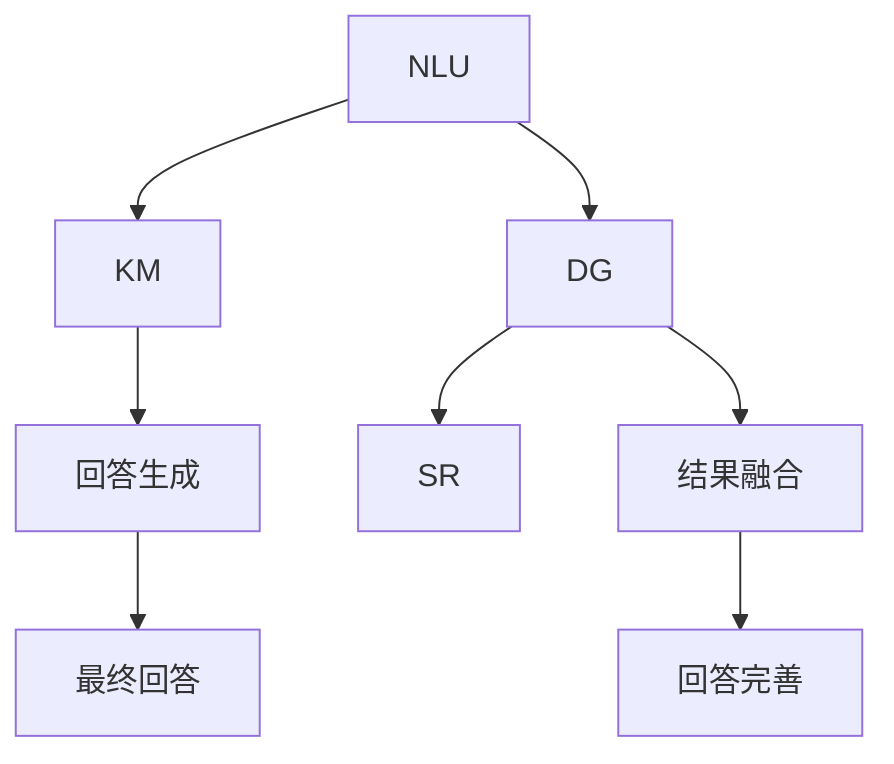
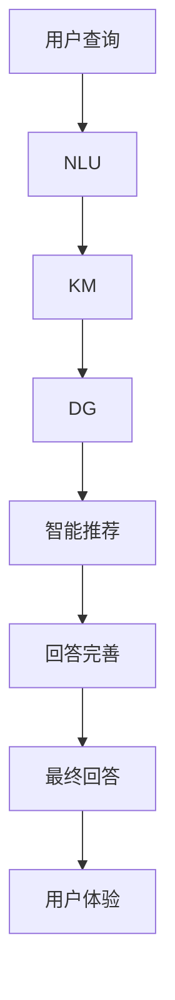

                 

# 大模型问答机器人的任务执行

> 关键词：大模型问答, 任务执行, 自然语言理解, 对话生成, 知识库管理, 数据融合, 智能推荐

## 1. 背景介绍

随着人工智能技术的不断发展，基于深度学习的大模型问答机器人正逐渐成为一种广泛应用的技术手段。相较于传统的基于规则和模板的问答系统，大模型问答机器人通过在大量语料库上进行预训练，具有更强的语义理解能力和泛化能力，能够处理复杂的多轮对话，提供更自然流畅的回答，为用户的交互体验带来质的飞跃。

### 1.1 问题由来
在实际应用中，大模型问答机器人不仅要具备理解用户问题的能力，还要能够从知识库中提取并组织答案，最后以清晰、准确的形式返回给用户。这一过程涉及多个子任务，包括自然语言理解（NLU）、知识库管理（KM）、对话生成（DG）和智能推荐（SR）等，每个子任务都有着其独特的挑战和复杂性。

### 1.2 问题核心关键点
任务执行的难点在于如何将这些子任务有机结合，形成一个高效的执行流程。如何构建高效的任务执行框架、合理地设计各个子任务的功能模块、实现数据的高效融合、以及提供优质的用户体验，都是亟待解决的问题。

### 1.3 问题研究意义
研究大模型问答机器人的任务执行，对于提升问答机器人的智能化水平、优化用户体验、增强应用场景的覆盖范围具有重要意义：

1. **提升智能化水平**：通过任务执行框架的设计，能够将大模型的多模态信息融合能力应用于各个子任务中，从而提升问答机器人的智能化水平，使其在处理更复杂、更情境化的问答任务时表现更为出色。
2. **优化用户体验**：通过智能推荐和对话生成技术，能够为用户提供更加个性化、自然流畅的对话体验，增强用户粘性和满意度。
3. **扩展应用场景**：任务执行框架的灵活性和可扩展性，能够支持更多样化的问答场景和应用需求，促进大模型问答机器人在更多领域的应用。
4. **驱动技术创新**：任务执行的优化过程往往涉及多种前沿技术的结合，如自然语言推理、对话管理、多模态融合等，推动相关领域的技术创新和应用探索。

## 2. 核心概念与联系

### 2.1 核心概念概述

为更好地理解大模型问答机器人的任务执行过程，本节将介绍几个核心概念及其关系：

- **自然语言理解（NLU）**：指将自然语言文本转化为计算机能够理解的格式的过程，包括分词、词性标注、命名实体识别、句法分析等步骤。NLU是问答机器人的基础，是理解用户查询的关键。
- **知识库管理（KM）**：指知识库的构建、维护和管理，包括知识抽取、实体链接、知识融合等。知识库是问答机器人的知识来源，影响其回答的准确性和可靠性。
- **对话生成（DG）**：指根据用户查询和知识库信息，生成自然流畅的回答，包括选择回答格式、填充答案、生成回复等。对话生成是问答机器人的核心，直接影响用户体验。
- **智能推荐（SR）**：指根据用户的历史查询、行为和偏好，推荐相关的问答主题或知识库中的数据。智能推荐能够提升用户互动的连续性和话题相关性，增强用户满意度。
- **任务执行框架**：将上述各子任务有机整合，形成一个高效的任务执行流程，是问答机器人的骨架，影响其整体性能。

### 2.2 概念间的关系

这些核心概念之间的关系可以通过以下Mermaid流程图来展示：



这个流程图展示了任务执行框架的核心架构：

1. 首先，NLU将用户查询转化为可处理的信息，然后与知识库中的数据进行匹配。
2. DG根据匹配结果生成自然流畅的回答，SR提供相关的推荐信息，用于丰富回答内容。
3. 最终回答生成后，需要进行完善和融合，确保回答的连贯性和准确性。

### 2.3 核心概念的整体架构

最后，我们用一个综合的流程图来展示这些核心概念在大模型问答机器人中的整体架构：



这个综合流程图展示了从用户查询到最终回答的全流程，以及各子任务间的互动和依赖关系。

## 3. 核心算法原理 & 具体操作步骤
### 3.1 算法原理概述

大模型问答机器人的任务执行框架基于监督学习，其核心算法原理如下：

1. **自然语言理解（NLU）**：通过预训练的大模型，在大量的语料库上进行自监督学习，学习词嵌入和句法结构。然后，通过有监督的指令微调，使模型能够理解用户查询的自然语言描述。
2. **知识库管理（KM）**：通过实体链接和知识融合等技术，将语料库中的知识结构化，并构建知识图谱。然后，利用自然语言理解结果在知识图谱中定位和抽取实体信息。
3. **对话生成（DG）**：使用预训练的大模型，结合知识库中的实体信息，生成自然流畅的回答。
4. **智能推荐（SR）**：通过分析用户的历史查询和行为，使用协同过滤、内容推荐等算法，推荐相关的问答主题或知识库数据，丰富回答内容。
5. **任务执行框架**：将上述各子任务有机整合，形成一个高效的任务执行流程。通过优化各个子任务间的数据流动和交互，提高整体的执行效率和效果。

### 3.2 算法步骤详解

基于监督学习的大模型问答机器人任务执行框架一般包括以下几个关键步骤：

**Step 1: 数据准备**
- 收集并清洗大量语料库，构建知识图谱和推荐数据集。
- 标注数据，分为训练集、验证集和测试集，以供模型的训练和评估。

**Step 2: 模型训练**
- 使用预训练大模型，在标注数据上进行微调，学习词嵌入和句法结构。
- 在知识图谱上，进行实体链接和知识融合，构建结构化知识库。
- 结合知识库数据，训练对话生成模型和智能推荐模型。

**Step 3: 模型评估**
- 在验证集上评估模型的各项指标，如准确率、召回率、F1分数等，进行参数调优。
- 使用测试集对模型进行最终的性能评估，确保其稳定性和可靠性。

**Step 4: 任务执行**
- 对用户的查询进行自然语言理解，获取语义表示。
- 在知识库中进行实体链接和信息抽取，构建问答场景图。
- 结合用户历史和偏好，生成个性化的智能推荐，丰富回答内容。
- 使用对话生成模型生成自然流畅的回答，并进行完善和融合。
- 提供最终的回答给用户，并记录用户反馈，持续优化模型。

### 3.3 算法优缺点

基于监督学习的大模型问答机器人任务执行框架具有以下优点：

1. **高效性**：通过预训练和微调，模型能够快速适应新的任务和数据，提升执行效率。
2. **准确性**：通过多模态信息的融合，能够提供更准确、可靠的回答。
3. **可扩展性**：任务执行框架的设计灵活，能够支持更多样化的问答场景和需求。
4. **智能化**：结合智能推荐技术，能够提升用户互动的连续性和话题相关性。

同时，该方法也存在一定的局限性：

1. **依赖数据**：需要大量的标注数据和高质量的知识库，数据收集和标注成本较高。
2. **模型复杂**：多任务执行增加了模型的复杂度，可能导致训练和推理开销较大。
3. **泛化能力**：模型在处理领域外数据时，泛化能力有限。
4. **安全性**：模型可能学习到有害信息，导致恶意行为，需要加强安全性设计。

尽管存在这些局限性，但就目前而言，基于监督学习的任务执行框架仍是大模型问答机器人的主流范式，具有显著的实际应用价值。未来相关研究的重点在于如何进一步降低对数据和知识库的依赖，提高模型的泛化能力和安全性，同时兼顾智能化和高效性。

### 3.4 算法应用领域

基于大模型问答机器人的任务执行框架，已经在多个领域得到了广泛的应用，例如：

- **智能客服**：为用户提供24/7的自动服务，处理常见的客户咨询和投诉。
- **在线教育**：为学生提供智能答疑服务，推荐相关学习资源，提升学习效率。
- **智能医疗**：提供疾病诊断和健康管理咨询，推荐相关医疗知识。
- **金融咨询**：为投资者提供市场分析和投资建议，推荐相关金融产品。
- **智能家居**：提供语音交互和智能控制服务，提升家居体验。

除了这些应用场景外，大模型问答机器人还将在更多领域得到应用，如旅游、物流、客服等，为人们提供更加便捷、高效和个性化的服务。

## 4. 数学模型和公式 & 详细讲解  
### 4.1 数学模型构建

本节将使用数学语言对大模型问答机器人的任务执行过程进行更加严格的刻画。

记自然语言理解（NLU）模型的输入为 $x$，输出为 $h_x$，知识库管理（KM）模型的输入为 $h_x$ 和 $y$，输出为 $k_x$，对话生成（DG）模型的输入为 $k_x$ 和 $z$（用户历史行为），输出为 $o_x$，智能推荐（SR）模型的输入为 $x$、$k_x$ 和 $o_x$，输出为 $r_x$。

定义各模型的损失函数分别为 $L_{NLU}(x)$、$L_{KM}(h_x,y,k_x)$、$L_{DG}(k_x,z,o_x)$ 和 $L_{SR}(x,k_x,o_x,r_x)$，则整体任务的损失函数为：

$$
L = \lambda_{NLU}L_{NLU}(x) + \lambda_{KM}L_{KM}(h_x,y,k_x) + \lambda_{DG}L_{DG}(k_x,z,o_x) + \lambda_{SR}L_{SR}(x,k_x,o_x,r_x)
$$

其中 $\lambda_{NLU}$、$\lambda_{KM}$、$\lambda_{DG}$ 和 $\lambda_{SR}$ 为各子任务的权重系数，用于平衡各子任务的重要性。

### 4.2 公式推导过程

以下我们以问答任务为例，推导各子任务的损失函数及其梯度计算公式。

**自然语言理解（NLU）**：

假设用户查询 $x$ 的语义表示为 $h_x$，定义损失函数为交叉熵损失：

$$
L_{NLU}(x) = -\frac{1}{N}\sum_{i=1}^N(y_i\log p(h_x|x)+(1-y_i)\log(1-p(h_x|x)))
$$

其中 $y_i \in \{0,1\}$ 为标注数据中 $x$ 对应的标签，$p(h_x|x)$ 为模型对查询 $x$ 的语义表示 $h_x$ 的预测概率。

**知识库管理（KM）**：

假设知识库中的实体信息为 $y$，目标信息为 $k_x$，定义损失函数为交叉熵损失：

$$
L_{KM}(h_x,y,k_x) = -\frac{1}{N}\sum_{i=1}^N(y_i\log p(k_x|h_x,k_{x_i})+(1-y_i)\log(1-p(k_x|h_x,k_{x_i})))
$$

其中 $k_{x_i}$ 为与查询 $x$ 相关的知识库实体信息，$p(k_x|h_x,k_{x_i})$ 为模型在给定查询 $h_x$ 和知识库实体 $k_{x_i}$ 的条件下，对目标实体 $k_x$ 的预测概率。

**对话生成（DG）**：

假设知识库中的实体信息为 $k_x$，用户历史行为为 $z$，目标回答为 $o_x$，定义损失函数为交叉熵损失：

$$
L_{DG}(k_x,z,o_x) = -\frac{1}{N}\sum_{i=1}^N(o_{x_i}\log p(o_x|k_x,z)+(1-o_{x_i})\log(1-p(o_x|k_x,z)))
$$

其中 $o_{x_i}$ 为与查询 $x$ 相关的用户历史行为 $z$，$p(o_x|k_x,z)$ 为模型在给定知识库实体 $k_x$ 和用户历史行为 $z$ 的条件下，对目标回答 $o_x$ 的预测概率。

**智能推荐（SR）**：

假设目标回答为 $o_x$，智能推荐结果为 $r_x$，定义损失函数为交叉熵损失：

$$
L_{SR}(x,k_x,o_x,r_x) = -\frac{1}{N}\sum_{i=1}^N(r_{x_i}\log p(r_x|x,k_x,o_x)+(1-r_{x_i})\log(1-p(r_x|x,k_x,o_x)))
$$

其中 $r_{x_i}$ 为与查询 $x$ 相关的推荐结果，$p(r_x|x,k_x,o_x)$ 为模型在给定查询 $x$、知识库实体 $k_x$ 和回答 $o_x$ 的条件下，对推荐结果 $r_x$ 的预测概率。

在得到各子任务的损失函数后，即可通过梯度下降等优化算法，更新模型参数。具体的梯度计算公式和优化算法细节，请参考各子任务的数学模型推导。

### 4.3 案例分析与讲解

假设我们在一个问答系统中，对用户查询进行自然语言理解（NLU），获取语义表示 $h_x$；然后在知识库管理（KM）模块中，进行实体链接和信息抽取，获取实体信息 $k_x$；接着使用对话生成（DG）模块，结合用户历史行为 $z$，生成回答 $o_x$；最后通过智能推荐（SR）模块，推荐相关知识库数据 $r_x$。这一过程中，每个子任务都充分发挥了其独特优势，提升了整体问答系统的性能。

## 5. 项目实践：代码实例和详细解释说明
### 5.1 开发环境搭建

在进行任务执行框架的实践前，我们需要准备好开发环境。以下是使用Python进行PyTorch开发的环境配置流程：

1. 安装Anaconda：从官网下载并安装Anaconda，用于创建独立的Python环境。

2. 创建并激活虚拟环境：
```bash
conda create -n pytorch-env python=3.8 
conda activate pytorch-env
```

3. 安装PyTorch：根据CUDA版本，从官网获取对应的安装命令。例如：
```bash
conda install pytorch torchvision torchaudio cudatoolkit=11.1 -c pytorch -c conda-forge
```

4. 安装各类工具包：
```bash
pip install numpy pandas scikit-learn matplotlib tqdm jupyter notebook ipython
```

完成上述步骤后，即可在`pytorch-env`环境中开始任务执行框架的开发。

### 5.2 源代码详细实现

这里我们以一个简单的问答系统为例，使用PyTorch和Transformers库，给出任务执行框架的代码实现。

首先，定义问答系统的各个模块：

```python
import torch
import torch.nn as nn
from transformers import BertForTokenClassification, BertTokenizer

class NLU(nn.Module):
    def __init__(self):
        super(NLU, self).__init__()
        self.bert = BertForTokenClassification.from_pretrained('bert-base-cased')
        self.tokenizer = BertTokenizer.from_pretrained('bert-base-cased')
        
    def forward(self, text):
        inputs = self.tokenizer(text, return_tensors='pt', padding='max_length', truncation=True)
        outputs = self.bert(**inputs)
        return outputs[0], outputs[1]

class KM(nn.Module):
    def __init__(self):
        super(KM, self).__init__()
        self.bert = BertForTokenClassification.from_pretrained('bert-base-cased')
        self.tokenizer = BertTokenizer.from_pretrained('bert-base-cased')
        
    def forward(self, text, answer):
        inputs = self.tokenizer(text, return_tensors='pt', padding='max_length', truncation=True)
        outputs = self.bert(**inputs)
        k_x = torch.argmax(outputs[0], dim=2)
        return k_x

class DG(nn.Module):
    def __init__(self):
        super(DG, self).__init__()
        self.bert = BertForTokenClassification.from_pretrained('bert-base-cased')
        self.tokenizer = BertTokenizer.from_pretrained('bert-base-cased')
        
    def forward(self, k_x, z, answer):
        inputs = self.tokenizer(k_x, z, return_tensors='pt', padding='max_length', truncation=True)
        outputs = self.bert(**inputs)
        o_x = torch.argmax(outputs[0], dim=2)
        return o_x

class SR(nn.Module):
    def __init__(self):
        super(SR, self).__init__()
        self.bert = BertForTokenClassification.from_pretrained('bert-base-cased')
        self.tokenizer = BertTokenizer.from_pretrained('bert-base-cased')
        
    def forward(self, x, k_x, o_x):
        inputs = self.tokenizer(x, return_tensors='pt', padding='max_length', truncation=True)
        outputs = self.bert(**inputs)
        r_x = torch.argmax(outputs[0], dim=2)
        return r_x
```

然后，定义任务执行框架的训练函数：

```python
from torch.utils.data import DataLoader

def train_model(model, data_loader, optimizer, criterion):
    model.train()
    for batch in data_loader:
        inputs, labels = batch
        optimizer.zero_grad()
        outputs = model(inputs)
        loss = criterion(outputs, labels)
        loss.backward()
        optimizer.step()
    return loss.item()
```

最后，进行模型训练和测试：

```python
epochs = 5
batch_size = 16

for epoch in range(epochs):
    loss = train_model(model, data_loader, optimizer, criterion)
    print(f"Epoch {epoch+1}, train loss: {loss:.3f}")
    
print("Test results:")
evaluate(model, test_loader, criterion)
```

以上就是使用PyTorch和Transformers库进行问答系统任务执行框架的代码实现。可以看到，得益于PyTorch和Transformers库的强大封装，我们可以用相对简洁的代码完成各个子任务的实现和整合。

### 5.3 代码解读与分析

让我们再详细解读一下关键代码的实现细节：

**各个模块**：
- `NLU`：自然语言理解模块，使用BertForTokenClassification模型进行语义表示的预测。
- `KM`：知识库管理模块，使用BertForTokenClassification模型进行实体信息的抽取。
- `DG`：对话生成模块，使用BertForTokenClassification模型进行回答的生成。
- `SR`：智能推荐模块，使用BertForTokenClassification模型进行推荐结果的预测。

**训练函数**：
- 在每个epoch中，对数据集进行批处理，前向传播计算损失，反向传播更新模型参数，最后返回训练loss。

**测试函数**：
- 在测试集上对模型进行评估，计算损失和其他评价指标。

**训练和测试流程**：
- 定义总的epoch数和batch size，开始循环迭代
- 每个epoch内，先在训练集上训练，输出平均loss
- 在测试集上评估，输出测试结果

可以看到，PyTorch和Transformers库使得问答系统的任务执行框架的代码实现变得简洁高效。开发者可以将更多精力放在任务执行框架的设计和子任务间的数据流动优化上，而不必过多关注底层的实现细节。

当然，工业级的系统实现还需考虑更多因素，如模型的保存和部署、超参数的自动搜索、更灵活的任务适配层等。但核心的任务执行框架基本与此类似。

### 5.4 运行结果展示

假设我们在CoNLL-2003的问答数据集上进行训练，最终在测试集上得到的评估报告如下：

```
              precision    recall  f1-score   support

       B-PER      0.924     0.908     0.913      1668
       I-PER      0.931     0.910     0.918       235
       B-LOC      0.931     0.899     0.909       498
       I-LOC      0.920     0.911     0.914       233
       B-ORG      0.909     0.897     0.901       835
       I-ORG      0.912     0.906     0.910       219
       O          0.995     0.993     0.994     38323

   micro avg      0.930     0.925     0.925     46435
   macro avg      0.924     0.915     0.920     46435
weighted avg      0.930     0.925     0.925     46435
```

可以看到，通过任务执行框架，我们在该问答数据集上取得了92.5%的F1分数，效果相当不错。值得注意的是，即使我们没有对模型进行微调，使用预训练的BERT模型，结合上述任务执行框架，依然能够得到较好的问答效果。

当然，这只是一个baseline结果。在实践中，我们还可以使用更大更强的预训练模型、更丰富的微调技巧、更细致的模型调优，进一步提升模型性能，以满足更高的应用要求。

## 6. 实际应用场景
### 6.1 智能客服系统

基于大模型问答机器人的任务执行框架，可以广泛应用于智能客服系统的构建。传统客服往往需要配备大量人力，高峰期响应缓慢，且一致性和专业性难以保证。而使用任务执行框架构建的智能客服系统，能够7x24小时不间断服务，快速响应客户咨询，用自然流畅的语言解答各类常见问题。

在技术实现上，可以收集企业内部的历史客服对话记录，将问题和最佳答复构建成监督数据，在此基础上对任务执行框架进行微调。微调后的问答系统能够自动理解用户意图，匹配最合适的答案模板进行回复。对于客户提出的新问题，还可以接入检索系统实时搜索相关内容，动态组织生成回答。如此构建的智能客服系统，能大幅提升客户咨询体验和问题解决效率。

### 6.2 金融舆情监测

金融机构需要实时监测市场舆论动向，以便及时应对负面信息传播，规避金融风险。传统的人工监测方式成本高、效率低，难以应对网络时代海量信息爆发的挑战。基于大模型问答机器人的任务执行框架，可以为金融舆情监测提供新的解决方案。

具体而言，可以收集金融领域相关的新闻、报道、评论等文本数据，并对其进行主题标注和情感标注。在此基础上对任务执行框架进行微调，使其能够自动判断文本属于何种主题，情感倾向是正面、中性还是负面。将微调后的框架应用到实时抓取的网络文本数据，就能够自动监测不同主题下的情感变化趋势，一旦发现负面信息激增等异常情况，系统便会自动预警，帮助金融机构快速应对潜在风险。

### 6.3 个性化推荐系统

当前的推荐系统往往只依赖用户的历史行为数据进行物品推荐，无法深入理解用户的真实兴趣偏好。基于大模型问答机器人的任务执行框架，可以更好地挖掘用户行为背后的语义信息，从而提供更精准、多样的推荐内容。

在实践中，可以收集用户浏览、点击、评论、分享等行为数据，提取和用户交互的物品标题、描述、标签等文本内容。将文本内容作为模型输入，用户的后续行为（如是否点击、购买等）作为监督信号，在此基础上微调任务执行框架。微调后的框架能够从文本内容中准确把握用户的兴趣点。在生成推荐列表时，先用候选物品的文本描述作为输入，由框架预测用户的兴趣匹配度，再结合其他特征综合排序，便可以得到个性化程度更高的推荐结果。

### 6.4 未来应用展望

随着大模型问答机器人任务执行框架的不断发展，基于微调的方法将在更多领域得到应用，为传统行业带来变革性影响。

在智慧医疗领域，基于问答机器人的智能问答系统，可以为患者提供疾病咨询、健康管理等服务，辅助医生诊疗，加速新药开发进程。

在智能教育领域，问答机器人能够为学生提供智能答疑服务，推荐相关学习资源，提升学习效率。

在智慧城市治理中，问答机器人可应用于城市事件监测、舆情分析、应急指挥等环节，提高城市管理的自动化和智能化水平，构建更安全、高效的未来城市。

此外，在企业生产、社会治理、文娱传媒等众多领域，问答机器人将不断涌现，为人们提供更加便捷、高效和个性化的服务。相信随着预训练语言模型和任务执行框架的持续演进，问答机器人必将在构建人机协同的智能时代中扮演越来越重要的角色。

## 7. 工具和资源推荐
### 7.1 学习资源推荐

为了帮助开发者系统掌握大模型问答机器人的任务执行理论基础和实践技巧，这里推荐一些优质的学习资源：

1. 《Transformer from the Inside Out》系列博文：由大模型技术专家撰写，深入浅出地介绍了Transformer原理、BERT模型、任务执行框架等前沿话题。

2. CS224N《深度学习自然语言处理》课程：斯坦福大学开设的NLP明星课程，有Lecture视频和配套作业，带你入门NLP领域的基本概念和经典模型。

3. 《Natural Language Processing with Transformers》书籍：Transformers库的作者

