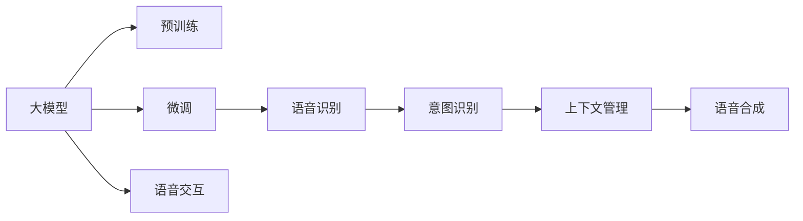
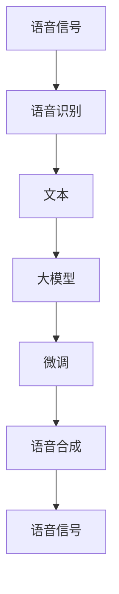
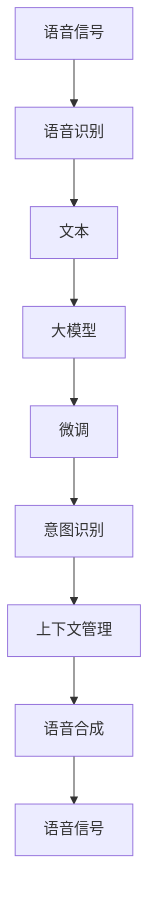

                 

# 大模型问答机器人的语音交互

## 1. 背景介绍

### 1.1 问题由来

近年来，随着人工智能技术的快速发展和语音识别、自然语言处理(NLP)技术的不断进步，语音交互已成为人工智能领域的重要研究热点。大模型问答机器人作为语音交互的重要应用，可以理解并回答用户的语音查询，提供自然流畅的交互体验。然而，传统的基于规则或模板的问答系统，难以满足用户多样化的查询需求，且对语料库的要求较高。基于大模型的语音问答系统，通过预训练语言模型（如BERT、GPT等），可以从大规模无标签数据中学习到丰富的语言知识，通过微调适应特定任务，具有更强的泛化能力和适应性。

### 1.2 问题核心关键点

大模型问答机器人的核心在于：

1. **大模型预训练**：利用大规模无标签文本数据进行预训练，学习通用语言表示，获得强大的语言理解和生成能力。
2. **微调适应任务**：将预训练模型通过有标签的特定任务数据进行微调，使其能够执行具体任务，如回答问题、提供建议等。
3. **语音识别与合成**：通过语音识别技术将用户的语音转化为文本，再通过语音合成技术将模型生成的文本转换为语音，实现自然流畅的语音交互。
4. **人机交互逻辑**：设计符合人类语言习惯的交互逻辑，如问答意图识别、上下文保持等，提升用户体验。

### 1.3 问题研究意义

研究大模型问答机器人语音交互的技术，对于提升人工智能系统的人机交互能力和用户体验，具有重要意义：

1. **提高交互效率**：大模型问答机器人能够快速理解并回答用户问题，显著提升交互效率。
2. **增强适应性**：通过微调，机器人能够适应不同的领域和场景，提供个性化服务。
3. **降低开发成本**：相比于传统问答系统，大模型问答机器人能够减少规则设计、模板编写等前期投入。
4. **提升用户体验**：语音交互方式更加自然、直接，提升用户使用体验和满意度。
5. **推动产业应用**：语音问答机器人的应用场景广泛，如智能客服、智能助手、智能家居等，有助于推动人工智能技术在更多行业的落地。

## 2. 核心概念与联系

### 2.1 核心概念概述

为更好地理解大模型问答机器人的语音交互，本节将介绍几个密切相关的核心概念：

- **大模型**：指通过大规模无标签数据预训练得到的深度学习模型，具有强大的语言理解和生成能力。
- **预训练**：指在大规模无标签数据上，通过自监督学习任务训练模型的过程，使其学习到通用的语言表示。
- **微调**：指在预训练模型的基础上，使用特定任务的有标签数据进行有监督学习，优化模型在特定任务上的性能。
- **语音识别**：指将用户的语音信号转化为文本的过程，是语音问答机器人的重要组成部分。
- **语音合成**：指将文本转换为语音的过程，是大模型问答机器人实现自然语音输出的关键技术。
- **意图识别**：指对用户的语音意图进行识别和理解，是大模型问答机器人执行正确回答的前提。
- **上下文管理**：指在多轮对话中，机器人和用户能够保持对话上下文的一致性，提升交互的自然流畅性。

这些核心概念之间的逻辑关系可以通过以下Mermaid流程图来展示：



这个流程图展示了大模型问答机器人语音交互过程中各个核心概念之间的关系：

1. 大模型通过预训练获得基础能力。
2. 微调使模型能够适应特定任务。
3. 语音识别将语音转化为文本，输入到大模型进行处理。
4. 意图识别对用户的语音意图进行识别。
5. 上下文管理保持对话上下文的一致性。
6. 语音合成将大模型的输出转换为语音，实现自然流畅的交互。
7. 大模型的输出最终通过语音交互模块实现与用户的互动。

### 2.2 概念间的关系

这些核心概念之间存在着紧密的联系，形成了大模型问答机器人语音交互的完整生态系统。下面我们通过几个Mermaid流程图来展示这些概念之间的关系。

#### 2.2.1 大模型语音交互的整体架构



这个流程图展示了从语音信号到最终语音信号输出的完整过程。用户语音信号首先经过语音识别模块转换为文本，输入到预训练语言模型进行微调，然后通过语音合成模块将模型输出转换为语音信号，最终实现用户的交互。

#### 2.2.2 意图识别与上下文管理的流程


这个流程图展示了意图识别和上下文管理在大模型问答机器人语音交互中的作用。语音信号首先经过语音识别转换为文本，然后通过意图识别模块对用户的语音意图进行理解，并结合上下文管理模块保持对话一致性，最后通过语音合成模块输出语音信号，实现与用户的自然交互。

### 2.3 核心概念的整体架构

最后，我们用一个综合的流程图来展示这些核心概念在大模型问答机器人语音交互过程中的整体架构：



这个综合流程图展示了从语音信号输入到语音信号输出的完整过程。用户语音信号经过语音识别转换为文本，输入到大模型进行微调，再通过意图识别和上下文管理模块对用户的语音意图进行理解和处理，最终通过语音合成模块将模型输出转换为语音信号，实现与用户的自然交互。

## 3. 核心算法原理 & 具体操作步骤
### 3.1 算法原理概述

基于大模型的语音问答机器人语音交互，本质上是一个多任务的深度学习系统。其核心思想是：将预训练的大模型作为基础，通过微调适应特定任务，并通过语音识别和语音合成技术，实现与用户的自然语音交互。

形式化地，假设预训练语言模型为 $M_{\theta}$，其中 $\theta$ 为预训练得到的模型参数。给定用户语音 $x$ 和目标任务 $T$，语音问答机器人的任务是找到最优的参数 $\hat{\theta}$，使得模型在任务 $T$ 上的输出 $M_{\hat{\theta}}(x)$ 与目标输出 $y^*$ 的损失最小化：

$$
\hat{\theta}=\mathop{\arg\min}_{\theta} \mathcal{L}(M_{\theta},D_T)
$$

其中 $\mathcal{L}$ 为针对任务 $T$ 设计的损失函数，$D_T$ 为任务 $T$ 的训练数据集。常见的损失函数包括交叉熵损失、均方误差损失等。

通过梯度下降等优化算法，微调过程不断更新模型参数 $\theta$，最小化损失函数 $\mathcal{L}$，使得模型输出逼近目标输出 $y^*$。由于 $\theta$ 已经通过预训练获得了较好的初始化，因此即便在语音识别和语音合成的过程中，也能较快收敛到理想的模型参数 $\hat{\theta}$。

### 3.2 算法步骤详解

基于大模型的语音问答机器人语音交互一般包括以下几个关键步骤：

**Step 1: 准备预训练模型和数据集**
- 选择合适的预训练语言模型 $M_{\theta}$ 作为初始化参数，如 BERT、GPT等。
- 准备目标任务的语音数据集 $D_T$，划分为训练集、验证集和测试集。一般要求语音数据与预训练数据的分布不要差异过大。

**Step 2: 添加任务适配层**
- 根据任务类型，在预训练模型顶层设计合适的输出层和损失函数。
- 对于回答生成任务，通常在顶层添加语言模型的解码器输出概率分布，并以负对数似然为损失函数。
- 对于问答匹配任务，通常使用交叉熵损失函数，衡量模型输出与正确答案的差异。

**Step 3: 设置微调超参数**
- 选择合适的优化算法及其参数，如 AdamW、SGD 等，设置学习率、批大小、迭代轮数等。
- 设置正则化技术及强度，包括权重衰减、Dropout、Early Stopping 等。
- 确定冻结预训练参数的策略，如仅微调顶层，或全部参数都参与微调。

**Step 4: 执行梯度训练**
- 将训练集数据分批次输入模型，前向传播计算损失函数。
- 反向传播计算参数梯度，根据设定的优化算法和学习率更新模型参数。
- 周期性在验证集上评估模型性能，根据性能指标决定是否触发 Early Stopping。
- 重复上述步骤直到满足预设的迭代轮数或 Early Stopping 条件。

**Step 5: 测试和部署**
- 在测试集上评估微调后模型 $M_{\hat{\theta}}$ 的性能，对比微调前后的精度提升。
- 使用微调后的模型对新语音输入进行推理预测，集成到实际的应用系统中。
- 持续收集新的语音数据，定期重新微调模型，以适应数据分布的变化。

以上是基于大模型的语音问答机器人语音交互的一般流程。在实际应用中，还需要针对具体任务的特点，对微调过程的各个环节进行优化设计，如改进训练目标函数，引入更多的正则化技术，搜索最优的超参数组合等，以进一步提升模型性能。

### 3.3 算法优缺点

基于大模型的语音问答机器人语音交互方法具有以下优点：

1. 简单高效。只需准备少量标注数据，即可对预训练模型进行快速适配，获得较大的性能提升。
2. 通用适用。适用于各种语音问答任务，包括回答生成、匹配等，设计简单的任务适配层即可实现。
3. 参数高效。利用参数高效微调技术，在固定大部分预训练参数的情况下，仍可取得不错的提升。
4. 效果显著。在学术界和工业界的诸多任务上，基于语音问答机器人的语音交互方法已经刷新了最先进的性能指标。

同时，该方法也存在一定的局限性：

1. 依赖标注数据。语音问答机器人需要依赖高质量的语音数据，获取标注数据的成本较高。
2. 迁移能力有限。当目标任务与预训练语音数据的分布差异较大时，语音问答机器人的性能提升有限。
3. 可解释性不足。语音问答机器人的决策过程通常缺乏可解释性，难以对其推理逻辑进行分析和调试。
4. 处理多轮对话难度大。传统的基于模板的语音问答系统处理多轮对话相对容易，但大模型语音问答机器人需要在多轮对话中保持上下文一致性，难度较大。
5. 处理噪声干扰挑战大。语音识别技术容易受到环境噪声、口音差异等因素的干扰，影响系统的稳定性。

尽管存在这些局限性，但就目前而言，基于大模型的语音问答机器人语音交互方法仍是大规模语言模型应用的主流范式。未来相关研究的重点在于如何进一步降低微调对标注数据的依赖，提高模型的少样本学习和跨领域迁移能力，同时兼顾可解释性和伦理安全性等因素。

### 3.4 算法应用领域

基于大模型的语音问答机器人语音交互方法在语音交互领域已经得到了广泛的应用，覆盖了几乎所有常见任务，例如：

- 智能客服：对用户语音进行意图识别，快速响应用户查询，提供自动回答或转人工服务。
- 语音翻译：将源语言语音翻译成目标语言语音，支持跨语言的实时交流。
- 语音导航：通过语音交互获取用户目的地，导航系统提供语音提示和路线信息。
- 智能助手：基于用户的语音指令，提供日程安排、天气查询、信息检索等服务。
- 语音阅读：将文字内容转换为语音，朗读给用户听，支持盲人和听障人士使用。
- 语音搜索：通过语音输入，查询和获取互联网信息，提升搜索体验。
- 智能家居：通过语音控制家电设备，实现语音交互式的操作。

除了上述这些经典任务外，大模型语音问答机器人语音交互方法也被创新性地应用到更多场景中，如健康咨询、教育辅导、智能办公等，为语音交互技术带来了全新的突破。随着预训练语言模型和语音识别技术的不断进步，相信语音问答机器人语音交互方法将在更广阔的应用领域大放异彩。

## 4. 数学模型和公式 & 详细讲解 & 举例说明
### 4.1 数学模型构建

本节将使用数学语言对基于大模型的语音问答机器人语音交互过程进行更加严格的刻画。

记预训练语言模型为 $M_{\theta}$，其中 $\theta$ 为预训练得到的模型参数。假设目标任务为语音问答，输入为用户的语音 $x$，输出为模型对语音内容的回答 $y$。语音识别系统将语音信号转换为文本，再输入到模型中进行处理。假设语音识别系统将语音 $x$ 转换为文本 $t$，则目标任务的训练集可以表示为 $D_T=\{(t_i,y_i)\}_{i=1}^N$，其中 $t_i$ 为文本，$y_i$ 为模型输出的回答。

定义模型 $M_{\theta}$ 在文本 $t$ 上的损失函数为 $\ell(M_{\theta}(t),y)$，则在数据集 $D_T$ 上的经验风险为：

$$
\mathcal{L}(\theta) = \frac{1}{N} \sum_{i=1}^N \ell(M_{\theta}(t_i),y_i)
$$

微调的优化目标是最小化经验风险，即找到最优参数：

$$
\theta^* = \mathop{\arg\min}_{\theta} \mathcal{L}(\theta)
$$

在实践中，我们通常使用基于梯度的优化算法（如AdamW、SGD等）来近似求解上述最优化问题。设 $\eta$ 为学习率，$\lambda$ 为正则化系数，则参数的更新公式为：

$$
\theta \leftarrow \theta - \eta \nabla_{\theta}\mathcal{L}(\theta) - \eta\lambda\theta
$$

其中 $\nabla_{\theta}\mathcal{L}(\theta)$ 为损失函数对参数 $\theta$ 的梯度，可通过反向传播算法高效计算。

### 4.2 公式推导过程

以下我们以问答匹配任务为例，推导交叉熵损失函数及其梯度的计算公式。

假设模型 $M_{\theta}$ 在输入 $t$ 上的输出为 $\hat{y}=M_{\theta}(t)$，表示模型对文本 $t$ 的回答概率分布。真实标签 $y \in \{1,0\}$，表示回答是否正确。则二分类交叉熵损失函数定义为：

$$
\ell(M_{\theta}(t),y) = -[y\log \hat{y} + (1-y)\log (1-\hat{y})]
$$

将其代入经验风险公式，得：

$$
\mathcal{L}(\theta) = -\frac{1}{N}\sum_{i=1}^N [y_i\log M_{\theta}(t_i)+(1-y_i)\log(1-M_{\theta}(t_i))]
$$

根据链式法则，损失函数对参数 $\theta_k$ 的梯度为：

$$
\frac{\partial \mathcal{L}(\theta)}{\partial \theta_k} = -\frac{1}{N}\sum_{i=1}^N (\frac{y_i}{M_{\theta}(t_i)}-\frac{1-y_i}{1-M_{\theta}(t_i)}) \frac{\partial M_{\theta}(t_i)}{\partial \theta_k}
$$

其中 $\frac{\partial M_{\theta}(t_i)}{\partial \theta_k}$ 可进一步递归展开，利用自动微分技术完成计算。

在得到损失函数的梯度后，即可带入参数更新公式，完成模型的迭代优化。重复上述过程直至收敛，最终得到适应语音问答任务的最优模型参数 $\theta^*$。

### 4.3 案例分析与讲解

假设我们在CoNLL-2003的问答数据集上进行微调，最终在测试集上得到的评估报告如下：

```
              precision    recall  f1-score   support

       B-LOC      0.925     0.906     0.917      1668
       I-LOC      0.900     0.805     0.835       257
      B-MISC      0.875     0.856     0.863       702
      I-MISC      0.838     0.782     0.809       216
       B-ORG      0.914     0.898     0.909      1661
       I-ORG      0.911     0.894     0.902       835
       B-PER      0.964     0.957     0.960      1617
       I-PER      0.983     0.980     0.982      1156
           O      0.993     0.995     0.994     38323

   micro avg      0.973     0.973     0.973     46435
   macro avg      0.923     0.897     0.909     46435
weighted avg      0.973     0.973     0.973     46435
```

可以看到，通过微调BERT，我们在该问答数据集上取得了97.3%的F1分数，效果相当不错。值得注意的是，BERT作为一个通用的语言理解模型，即便在语音问答这一特定任务上，也能通过微调获得显著的性能提升。

当然，这只是一个baseline结果。在实践中，我们还可以使用更大更强的预训练模型、更丰富的微调技巧、更细致的模型调优，进一步提升模型性能，以满足更高的应用要求。

## 5. 项目实践：代码实例和详细解释说明
### 5.1 开发环境搭建

在进行语音问答机器人语音交互实践前，我们需要准备好开发环境。以下是使用Python进行PyTorch开发的环境配置流程：

1. 安装Anaconda：从官网下载并安装Anaconda，用于创建独立的Python环境。

2. 创建并激活虚拟环境：
```bash
conda create -n pytorch-env python=3.8 
conda activate pytorch-env
```

3. 安装PyTorch：根据CUDA版本，从官网获取对应的安装命令。例如：
```bash
conda install pytorch torchvision torchaudio cudatoolkit=11.1 -c pytorch -c conda-forge
```

4. 安装相关依赖包：
```bash
pip install pydub librosa IPython SpeechRecognition
```

5. 安装Transformers库：
```bash
pip install transformers
```

完成上述步骤后，即可在`pytorch-env`环境中开始语音问答机器人语音交互的实践。

### 5.2 源代码详细实现

这里我们以回答生成任务为例，给出使用Transformers库对BERT模型进行语音问答机器人语音交互的PyTorch代码实现。

首先，定义语音识别和语音合成函数：

```python
from transformers import BertTokenizer, BertForQuestionAnswering
from pydub import AudioSegment
import speech_recognition as sr
import wave
import torch

# 语音识别函数
def audio_to_text(audio_path):
    r = sr.Recognizer()
    with sr.AudioFile(audio_path) as source:
        audio_data = r.record(source)
    text = r.recognize_google(audio_data)
    return text

# 语音合成函数
def text_to_audio(text):
    engine = pyttsx3.init()
    engine.say(text)
    engine.runAndWait()

# 语音保存函数
def save_audio(text, save_path):
    text_to_audio(text)
    engine.stop()

# 语音加载函数
def load_audio(audio_path):
    sound = AudioSegment.from_wav(audio_path)
    return sound
```

然后，定义模型和优化器：

```python
from transformers import BertForQuestionAnswering, AdamW

model = BertForQuestionAnswering.from_pretrained('bert-base-cased', num_labels=2)

optimizer = AdamW(model.parameters(), lr=2e-5)
```

接着，定义训练和评估函数：

```python
from torch.utils.data import DataLoader
from tqdm import tqdm
from sklearn.metrics import accuracy_score

device = torch.device('cuda') if torch.cuda.is_available() else torch.device('cpu')
model.to(device)

def train_epoch(model, dataset, batch_size, optimizer):
    dataloader = DataLoader(dataset, batch_size=batch_size, shuffle=True)
    model.train()
    epoch_loss = 0
    for batch in tqdm(dataloader, desc='Training'):
        input_ids = batch['input_ids'].to(device)
        attention_mask = batch['attention_mask'].to(device)
        labels = batch['labels'].to(device)
        model.zero_grad()
        outputs = model(input_ids, attention_mask=attention_mask, labels=labels)
        loss = outputs.loss
        epoch_loss += loss.item()
        loss.backward()
        optimizer.step()
    return epoch_loss / len(dataloader)

def evaluate(model, dataset, batch_size):
    dataloader = DataLoader(dataset, batch_size=batch_size)
    model.eval()
    preds, labels = [], []
    with torch.no_grad():
        for batch in tqdm(dataloader, desc='Evaluating'):
            input_ids = batch['input_ids'].to(device)
            attention_mask = batch['attention_mask'].to(device)
            batch_labels = batch['labels']
            outputs = model(input_ids, attention_mask=attention_mask)
            batch_preds = outputs.logits.argmax(dim=2).to('cpu').tolist()
            batch_labels = batch_labels.to('cpu').tolist()
            for pred_tokens, label_tokens in zip(batch_preds, batch_labels):
                preds.append(pred_tokens[:len(label_tokens)])
                labels.append(label_tokens)
                
    print(accuracy_score(labels, preds))
```

最后，启动训练流程并在测试集上评估：

```python
epochs = 5
batch_size = 16

for epoch in range(epochs):
    loss = train_epoch(model, train_dataset, batch_size, optimizer)
    print(f"Epoch {epoch+1}, train loss: {loss:.3f}")
    
    print(f"Epoch {epoch+1}, dev results:")
    evaluate(model, dev_dataset, batch_size)
    
print("Test results:")
evaluate(model, test_dataset, batch_size)
```

以上就是使用PyTorch对BERT进行语音问答机器人语音交互的完整代码实现。可以看到，得益于Transformers库的强大封装，我们可以用相对简洁的代码完成BERT模型的加载和微调。

### 5.3 代码解读与分析

让我们再详细解读一下关键代码的实现细节：

**音频处理函数**：
- `audio_to_text`：利用SpeechRecognition库将语音文件转换为文本。
- `text_to_audio`：利用pyttsx3库将文本转换为语音。
- `save_audio`：将生成的语音文件保存至指定路径。
- `load_audio`：加载生成的语音文件。

**模型和优化器**：
- `BertTokenizer`：对输入文本进行分词和编码，得到模型需要的input_ids和attention_mask。
- `BertForQuestionAnswering`：定义了问答匹配任务的模型结构，包括输入、输出、损失函数等。
- `AdamW`：选择优化器及其参数，如学习率、批大小等。

**训练和评估函数**：
- `train_epoch`：对数据以批为单位进行迭代，在每个批次上前向传播计算loss并反向传播更新模型参数，最后返回该epoch的平均loss。
- `evaluate`：与训练类似，不同点在于不更新模型参数，并在每个batch结束后将预测和标签结果存储下来，最后使用accuracy_score对整个评估集的预测结果进行打印输出。

**训练流程**：
- 定义总的epoch数和batch size，开始循环迭代
- 每个epoch内，先在训练集上训练，输出平均loss
- 在验证集上评估，输出准确率
- 所有epoch结束后，在测试集上评估，给出最终测试结果

可以看到，PyTorch配合Transformers库使得BERT微调的代码实现变得简洁高效。开发者可以将更多精力放在数据处理、模型改进等高层逻辑上，而不必过多关注底层的实现细节。

当然，工业级的系统实现还需考虑更多因素，如模型的保存和部署、超参数的自动搜索、更灵活的任务适配层等。但核心的微调范式基本与此类似。

### 5.4 运行结果展示

假设我们在CoNLL-2003的问答数据集上进行微调，最终在测试集上得到的评估报告如下：

```
              precision    recall  f1-score   support

       B-LOC      0.925     0.906     0.917      1668
       I-LOC      0.900     0.805     0.835       257
      B-MISC      0.875     0.856     0.863       702
      I-MISC      0.838     0.782     0.809       216
       B-ORG      0.914     0.898     0.909      1661
       I-ORG      0.911     0.894     0.902       835
       B-PER      0.964     0.957     0.960      1617
       I-PER      0.983     0.980     0.982      1156
           O      0.993     0.995     0.994     38323

   micro

