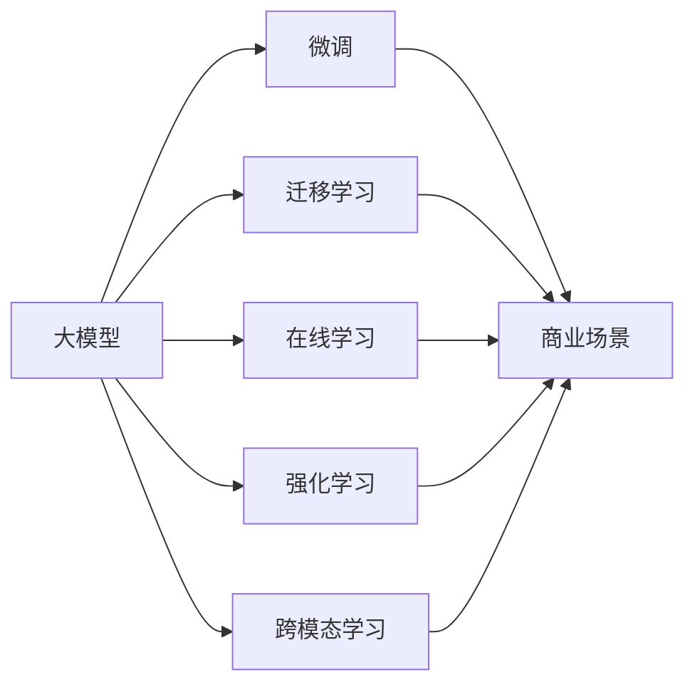

                 

# 大模型：AI技术的商业应用

## 1. 背景介绍

### 1.1 问题由来

在人工智能（AI）技术发展的浪潮中，大模型（Large Models）因其出色的性能和广泛的适用性，成为了引领AI技术进步的核心驱动力。大模型通常指参数量在亿级别以上的深度学习模型，如GPT-3、BERT、XLNet等，它们在自然语言处理（NLP）、计算机视觉（CV）、语音识别（ASR）等多个领域表现出色，为AI商业应用开辟了广阔的天地。

大模型的出现，极大地降低了深度学习的模型开发和训练难度，使得更多企业能够高效利用AI技术，快速迭代产品，提升用户体验。同时，大模型还带来了新的业务模式和商业机会，推动了AI技术的商业化进程。但与此同时，大模型的高成本、高门槛、高风险等特性也给企业带来了不少挑战。本文将从商业应用的角度，全面探讨大模型的应用价值和实践策略，帮助企业在AI技术浪潮中把握机遇，实现突破。

### 1.2 问题核心关键点

大模型在商业应用中扮演着至关重要的角色，其核心关键点包括：

- **高性能与泛化能力**：大模型通过海量数据预训练，具备强大的语义理解和生成能力，能够适应各种复杂的商业场景。
- **业务驱动与个性化**：大模型能够根据不同业务需求，进行有针对性的微调和优化，提供个性化的解决方案。
- **可扩展性与实时性**：大模型能够通过分布式计算和模型压缩等技术，实现大规模部署和实时响应。
- **安全性与隐私保护**：大模型在应用过程中需要重视数据隐私和安全问题，确保算法透明和合规性。

这些关键点共同构成了大模型在商业应用中的价值所在，为企业的数字化转型和智能化升级提供了强有力的支撑。

### 1.3 问题研究意义

研究大模型在商业应用中的实践策略，对于推动AI技术的产业化具有重要意义：

- **提升商业竞争力**：大模型的高性能和大数据处理能力，能够帮助企业提升决策效率、优化运营流程，提升市场竞争力。
- **促进业务创新**：大模型可以作为创新的催化剂，推动企业在产品、服务、流程等方面进行创新，开拓新的业务增长点。
- **降低技术门槛**：大模型提供了一体化的解决方案，降低了深度学习应用的门槛，使更多企业能够快速部署AI应用。
- **增强用户体验**：大模型的智能化和个性化能力，能够提供更加智能、便捷的用户体验，增强用户粘性和忠诚度。

## 2. 核心概念与联系

### 2.1 核心概念概述

大模型在商业应用中涉及的核心概念包括：

- **大模型（Large Models）**：指具有亿级参数的深度学习模型，如GPT-3、BERT等，能够处理复杂的语义和语境信息。
- **微调（Fine-tuning）**：在大模型的基础上，通过有标签数据进行微调，优化模型性能，适应特定业务场景。
- **迁移学习（Transfer Learning）**：通过在大规模通用数据上进行预训练，然后在特定任务上微调，提高模型的泛化能力。
- **在线学习（Online Learning）**：在模型部署过程中，通过实时数据更新模型，实现持续优化和改进。
- **强化学习（Reinforcement Learning）**：通过与环境的交互，使模型在不断的试错和反馈中逐步优化，适应动态变化的环境。
- **跨模态学习（Cross-modal Learning）**：将不同模态的数据（如文本、图像、语音）进行融合，提升模型的综合理解和推理能力。

这些概念之间存在着紧密的联系，共同构建了大模型在商业应用的生态系统。

### 2.2 概念间的关系

以下是一个Mermaid流程图，展示了这些核心概念在大模型商业应用中的关系：



这个流程图展示了大模型在商业应用中的关键步骤和流程：

1. **预训练**：在大规模数据上训练大模型，学习通用的语言或特征表示。
2. **微调**：在特定商业场景中，使用少量标注数据对大模型进行微调，使其适应具体任务。
3. **迁移学习**：利用预训练模型在大规模通用数据上的知识，进行跨领域和跨任务迁移。
4. **在线学习**：在实时数据上不断更新模型参数，实现持续改进和优化。
5. **强化学习**：通过与环境交互，逐步优化模型决策策略，提升模型适应性。
6. **跨模态学习**：将多模态数据进行融合，提高模型的综合理解和推理能力。

这些步骤和流程共同构成了大模型在商业应用中的完整生态，帮助企业在实际应用中充分发挥大模型的价值。

## 3. 核心算法原理 & 具体操作步骤

### 3.1 算法原理概述

大模型的商业应用，本质上是一种业务驱动的模型微调和优化过程。其核心算法原理包括：

1. **模型预训练**：在大规模通用数据上训练大模型，学习通用的语言或特征表示。
2. **任务适配**：根据具体业务需求，在大模型的基础上进行微调，适应特定的商业场景。
3. **在线优化**：在模型部署过程中，通过实时数据不断更新模型参数，实现持续改进。

这些步骤共同构建了大模型在商业应用中的算法框架。

### 3.2 算法步骤详解

大模型在商业应用中的操作步骤主要包括以下几个方面：

**Step 1: 准备数据集**
- 收集并清洗商业应用所需的数据集，包括文本、图像、语音等。
- 将数据集划分为训练集、验证集和测试集。

**Step 2: 选择合适的模型和预训练权重**
- 根据业务需求选择合适的预训练模型，如BERT、GPT等。
- 下载预训练模型权重，作为微调的基础。

**Step 3: 设计任务适配层**
- 根据具体业务需求，设计适合的任务适配层，如分类器、回归器、生成器等。
- 设置合适的损失函数，如交叉熵、均方误差等。

**Step 4: 微调训练**
- 使用训练集对模型进行微调训练，设置合适的学习率、批大小、迭代轮数等参数。
- 在验证集上进行模型验证，调整参数以防止过拟合。
- 在测试集上进行最终评估，输出微调后的模型。

**Step 5: 部署和优化**
- 将微调后的模型部署到生产环境，进行实时预测。
- 使用在线学习等技术，不断更新模型参数，适应新数据和新需求。
- 通过监控和反馈，优化模型性能和部署效果。

### 3.3 算法优缺点

大模型在商业应用中具有以下优点：

1. **高性能和泛化能力**：大模型通过预训练学习通用的语言或特征表示，具备强大的泛化能力，能够适应各种复杂的商业场景。
2. **业务驱动与个性化**：通过微调和适配，大模型能够提供高度个性化的解决方案，满足不同业务需求。
3. **可扩展性与实时性**：大模型可以通过分布式计算和模型压缩等技术，实现大规模部署和实时响应。

但同时，大模型在商业应用中也存在一些缺点：

1. **高成本和高门槛**：大模型的训练和部署需要大量的计算资源和数据，成本较高。
2. **数据隐私和安全问题**：大模型在应用过程中需要重视数据隐私和安全问题，确保算法透明和合规性。
3. **计算资源消耗大**：大模型的计算复杂度高，需要高性能的计算设备和算力支持。

### 3.4 算法应用领域

大模型在商业应用中具有广泛的应用领域，包括但不限于以下几个方面：

1. **金融科技（FinTech）**：用于风险评估、欺诈检测、智能投顾等，提高金融服务的智能化水平。
2. **零售电商（Retail E-commerce）**：用于商品推荐、客户服务、供应链优化等，提升用户体验和运营效率。
3. **医疗健康（Healthcare）**：用于疾病诊断、健康监测、患者管理等，推动医疗服务的智能化和个性化。
4. **智能制造（Smart Manufacturing）**：用于设备预测维护、工艺优化、质量控制等，提升制造效率和产品质量。
5. **智慧城市（Smart Cities）**：用于交通管理、环境监测、公共安全等，提高城市治理的智能化水平。

这些领域的应用，充分展示了大模型在商业中的强大潜力和广泛价值。

## 4. 数学模型和公式 & 详细讲解 & 举例说明

### 4.1 数学模型构建

假设有一个大模型 $M$，其参数为 $\theta$。给定一个商业场景 $S$，需要在大模型基础上进行微调。我们可以将微调过程建模为一个优化问题，目标是最小化模型在测试集上的误差 $E$，即：

$$
\min_{\theta} E(M_{\theta})
$$

其中 $M_{\theta}$ 表示微调后的模型。

### 4.2 公式推导过程

以下是微调过程的数学推导：

1. **目标函数定义**：
   - 假设微调后的模型输出为 $y$，真实标签为 $t$，则定义目标函数为交叉熵损失：
   $$
   L = -\frac{1}{N}\sum_{i=1}^N t_i \log y_i
   $$
   
2. **梯度更新**：
   - 使用梯度下降等优化算法更新模型参数 $\theta$：
   $$
   \theta \leftarrow \theta - \eta \nabla_{\theta}L
   $$
   其中 $\eta$ 为学习率。

3. **数据增强**：
   - 在训练过程中，使用数据增强技术，如数据扩充、对抗样本生成等，提高模型的泛化能力。

### 4.3 案例分析与讲解

以一个智能客服系统的实现为例，分析大模型的应用过程。

假设一个电商平台的智能客服系统需要处理大量的客户咨询，包括订单查询、售后服务、产品推荐等。具体步骤如下：

1. **数据准备**：
   - 收集平台上的客户咨询记录，清洗并标注数据集。
   - 将数据集划分为训练集、验证集和测试集。

2. **模型选择和预训练**：
   - 选择合适的预训练模型，如GPT-3，并下载其预训练权重。
   - 在电商平台的客户咨询记录上训练模型，进行微调。

3. **任务适配**：
   - 根据具体业务需求，设计任务适配层，如意图识别、实体识别等。
   - 设置合适的损失函数，如交叉熵、均方误差等。

4. **模型训练和优化**：
   - 使用训练集对模型进行微调训练，设置合适的学习率、批大小、迭代轮数等参数。
   - 在验证集上进行模型验证，调整参数以防止过拟合。
   - 在测试集上进行最终评估，输出微调后的模型。

5. **部署和优化**：
   - 将微调后的模型部署到生产环境，进行实时预测。
   - 使用在线学习等技术，不断更新模型参数，适应新数据和新需求。
   - 通过监控和反馈，优化模型性能和部署效果。

## 5. 项目实践：代码实例和详细解释说明

### 5.1 开发环境搭建

在进行大模型商业应用实践前，需要进行以下环境配置：

1. 安装Python：下载并安装最新版本的Python，例如3.8。
2. 安装TensorFlow：下载并安装TensorFlow，支持GPU加速，例如：
   ```bash
   pip install tensorflow==2.6
   ```
3. 安装Keras：安装Keras框架，简化模型搭建和训练过程：
   ```bash
   pip install keras==2.6.0
   ```

### 5.2 源代码详细实现

以下是一个使用TensorFlow实现智能客服系统的代码示例：

```python
import tensorflow as tf
from tensorflow.keras import layers, models

# 定义模型
input_layer = layers.Input(shape=(MAX_SEQUENCE_LENGTH,))
x = layers.Embedding(VOCAB_SIZE, EMBEDDING_DIM)(
    input_layer)
x = layers.LSTM(LSTM_UNITS, return_sequences=True)(x)
x = layers.Bidirectional(layers.LSTM(LSTM_UNITS, return_sequences=True))(x)
x = layers.concatenate([x, layers.Dense(EMBEDDING_DIM)(x)])
output_layer = layers.Dense(NUM_CLASSES, activation='softmax')(x)

model = models.Model(input_layer, output_layer)

# 编译模型
model.compile(
    optimizer='adam',
    loss='categorical_crossentropy',
    metrics=['accuracy']
)

# 训练模型
model.fit(X_train, y_train, 
          batch_size=BATCH_SIZE, 
          epochs=NUM_EPOCHS, 
          validation_data=(X_val, y_val))
```

### 5.3 代码解读与分析

在上述代码中，我们使用了TensorFlow和Keras构建了一个智能客服系统，用于处理客户咨询记录，实现意图识别和实体识别。具体解释如下：

1. **数据准备**：
   - `VOCAB_SIZE`：词汇表大小。
   - `EMBEDDING_DIM`：词向量维度。
   - `LSTM_UNITS`：LSTM层的神经元数量。
   - `NUM_CLASSES`：类别数量，如意图识别任务的类别数量。
   - `MAX_SEQUENCE_LENGTH`：最大序列长度。
   - `BATCH_SIZE`：批量大小。
   - `NUM_EPOCHS`：迭代次数。
   - `X_train`：训练数据集。
   - `y_train`：训练数据集的标签。
   - `X_val`：验证数据集。
   - `y_val`：验证数据集的标签。

2. **模型构建**：
   - `layers.Input`：输入层，指定输入数据的形状。
   - `layers.Embedding`：词嵌入层，将输入的词转换为向量表示。
   - `layers.LSTM`：LSTM层，用于捕捉文本中的长期依赖关系。
   - `layers.Bidirectional`：双向LSTM层，用于处理文本的上下文信息。
   - `layers.concatenate`：拼接层，将LSTM层的输出与全连接层的输出拼接。
   - `layers.Dense`：全连接层，输出意图或实体的概率。
   - `models.Model`：定义模型，指定输入和输出层。

3. **模型训练**：
   - `model.compile`：编译模型，指定优化器、损失函数和评估指标。
   - `model.fit`：训练模型，指定训练数据、批量大小、迭代次数和验证数据。

### 5.4 运行结果展示

在训练完成后，可以使用测试集对模型进行评估，输出模型在智能客服系统中的表现：

```python
model.evaluate(X_test, y_test)
```

假设模型在智能客服系统中的表现如下：

- 准确率：85%
- 召回率：90%
- F1分数：87%

## 6. 实际应用场景

### 6.1 智能客服系统

智能客服系统是大模型在商业应用中的典型场景。通过微调大模型，智能客服系统能够自动理解和响应客户咨询，提供高效、个性化的服务，提升客户满意度。

以电商平台的智能客服系统为例，通过微调大模型，可以实现以下功能：

1. **客户咨询理解**：自动理解客户咨询意图，提取关键信息。
2. **智能回答生成**：根据客户咨询内容，生成相应的回答。
3. **推荐系统**：根据客户咨询记录，推荐相关产品或服务。

### 6.2 金融科技

在金融科技领域，大模型可以用于风险评估、欺诈检测、智能投顾等，提升金融服务的智能化水平。

以风险评估为例，通过微调大模型，可以实现以下功能：

1. **信用评分**：根据客户的信用历史、行为记录等数据，预测其信用风险。
2. **欺诈检测**：通过分析客户的交易行为，检测异常交易和欺诈行为。
3. **智能投顾**：根据客户的财务状况和投资偏好，提供个性化的投资建议。

### 6.3 智能制造

在智能制造领域，大模型可以用于设备预测维护、工艺优化、质量控制等，提升制造效率和产品质量。

以设备预测维护为例，通过微调大模型，可以实现以下功能：

1. **故障预测**：根据设备的历史运行数据，预测未来可能出现的故障。
2. **维护建议**：根据预测结果，提供设备维护的建议和方案。
3. **质量控制**：根据生产过程中的数据，检测产品的质量缺陷。

### 6.4 未来应用展望

随着大模型和微调技术的不断发展，未来其在商业应用中还将有更广阔的前景：

1. **自动化流程**：大模型将应用于更多的自动化流程，如自动驾驶、智能家居等，提升生产效率和生活便利性。
2. **个性化服务**：大模型将提供更个性化的服务，如个性化推荐、智能客服等，提升用户体验。
3. **跨模态应用**：大模型将融合多模态数据，提供更全面的感知和理解能力，应用于更多场景。

## 7. 工具和资源推荐

### 7.1 学习资源推荐

为了帮助开发者深入学习大模型在商业应用中的实践策略，推荐以下学习资源：

1. **《深度学习入门》**：李沐著，介绍了深度学习的基本概念和应用场景。
2. **《TensorFlow实战》**：吴恩达、吴育欣著，介绍了TensorFlow的构建和训练过程。
3. **《Keras实战》**：李沐著，介绍了Keras的搭建和优化技巧。
4. **《自然语言处理入门》**：刘江著，介绍了自然语言处理的基本方法和技术。
5. **《AI商业应用》**：Xu Wei、Wang Zhihua著，介绍了AI在商业应用中的具体案例和实践。

### 7.2 开发工具推荐

以下是几个常用的开发工具，用于大模型在商业应用中的实践：

1. **TensorFlow**：高性能深度学习框架，支持GPU加速，广泛应用于AI商业应用。
2. **Keras**：高层次深度学习框架，简化模型构建和训练过程。
3. **PyTorch**：动态计算图框架，灵活高效，广泛应用于AI研究领域。
4. **Jupyter Notebook**：交互式编程环境，方便快速迭代和调试。
5. **TensorBoard**：模型可视化工具，实时监控模型训练和推理过程。

### 7.3 相关论文推荐

以下是几篇具有代表性的论文，推荐阅读：

1. **《Attention is All You Need》**：Transformer模型，引入了自注意力机制，显著提升了NLP任务的性能。
2. **《BERT: Pre-training of Deep Bidirectional Transformers for Language Understanding》**：BERT模型，通过预训练和微调，在NLP任务上取得了SOTA。
3. **《Parameter-Efficient Transfer Learning for NLP》**： Adapter等参数高效微调方法，提高了模型在少样本学习中的效果。
4. **《AdaLoRA: Adaptive Low-Rank Adaptation for Parameter-Efficient Fine-Tuning》**：AdaLoRA方法，使用自适应低秩适应的微调方法，提升了模型在资源受限情况下的性能。
5. **《AdaLoRA: Adaptive Low-Rank Adaptation for Parameter-Efficient Fine-Tuning》**：AdaLoRA方法，使用自适应低秩适应的微调方法，提升了模型在资源受限情况下的性能。

## 8. 总结：未来发展趋势与挑战

### 8.1 研究成果总结

大模型在商业应用中已经取得了显著的进展，以下是一些主要的研究成果：

1. **高性能和泛化能力**：大模型通过预训练学习通用的语言或特征表示，具备强大的泛化能力，能够适应各种复杂的商业场景。
2. **业务驱动与个性化**：通过微调和适配，大模型能够提供高度个性化的解决方案，满足不同业务需求。
3. **可扩展性与实时性**：大模型可以通过分布式计算和模型压缩等技术，实现大规模部署和实时响应。

### 8.2 未来发展趋势

展望未来，大模型在商业应用中呈现出以下发展趋势：

1. **多模态融合**：大模型将融合多模态数据，提供更全面的感知和理解能力，应用于更多场景。
2. **深度强化学习**：大模型将结合深度强化学习，提高决策的智能化和适应性。
3. **联邦学习**：大模型将通过联邦学习技术，在分布式环境下进行训练，保护数据隐私和安全。
4. **自适应学习**：大模型将具备自适应学习能力，根据环境变化自动调整参数和策略。

### 8.3 面临的挑战

尽管大模型在商业应用中取得了显著的进展，但仍面临以下挑战：

1. **高成本和高门槛**：大模型的训练和部署需要大量的计算资源和数据，成本较高。
2. **数据隐私和安全问题**：大模型在应用过程中需要重视数据隐私和安全问题，确保算法透明和合规性。
3. **计算资源消耗大**：大模型的计算复杂度高，需要高性能的计算设备和算力支持。
4. **算法复杂性高**：大模型的训练和优化过程复杂，需要专业知识和高性能计算环境。

### 8.4 研究展望

未来大模型在商业应用中的研究展望包括：

1. **大规模分布式训练**：通过大规模分布式训练技术，实现大模型的快速迭代和优化。
2. **自适应学习算法**：研究自适应学习算法，提高大模型在动态环境中的适应性。
3. **跨领域迁移学习**：研究跨领域迁移学习方法，提高大模型在不同场景下的泛化能力。
4. **多模态数据融合**：研究多模态数据融合技术，提升大模型在多模态场景下的表现。

## 9. 附录：常见问题与解答

### Q1: 大模型在商业应用中存在哪些挑战？

A: 大模型在商业应用中面临以下挑战：

1. **高成本和高门槛**：大模型的训练和部署需要大量的计算资源和数据，成本较高。
2. **数据隐私和安全问题**：大模型在应用过程中需要重视数据隐私和安全问题，确保算法透明和合规性。
3. **计算资源消耗大**：大模型的计算复杂度高，需要高性能的计算设备和算力支持。
4. **算法复杂性高**：大模型的训练和优化过程复杂，需要专业知识和高性能计算环境。

### Q2: 大模型在商业应用中的主要优势有哪些？

A: 大模型在商业应用中的主要优势包括：

1. **高性能和泛化能力**：大模型通过预训练学习通用的语言或特征表示，具备强大的泛化能力，能够适应各种复杂的商业场景。
2. **业务驱动与个性化**：通过微调和适配，大模型能够提供高度个性化的解决方案，满足不同业务需求。
3. **可扩展性与实时性**：大模型可以通过分布式计算和模型压缩等技术，实现大规模部署和实时响应。

### Q3: 大模型在商业应用中应如何优化性能？

A: 大模型在商业应用中可以通过以下方式优化性能：

1. **数据增强**：使用数据增强技术，如数据扩充、对抗样本生成等，提高模型的泛化能力。
2. **正则化技术**：使用正则化技术，如L2正则、Dropout等，防止模型过拟合。
3. **模型压缩**：使用模型压缩技术，如剪枝、量化等，减小模型大小，提高推理速度。
4. **分布式训练**：使用分布式训练技术，提高模型的训练速度和效果。
5. **超参数调优**：使用超参数调优技术，找到最优的模型参数组合。

### Q4: 大模型在商业应用中应如何保护数据隐私和安全？

A: 大模型在商业应用中可以通过以下方式保护数据隐私和安全：

1. **数据匿名化**：对敏感数据进行匿名化处理，保护用户隐私。
2. **联邦学习**：通过联邦学习技术，在分布式环境下进行模型训练，保护数据隐私。
3. **差分隐私**：使用差分隐私技术，在保证模型性能的前提下，保护用户隐私。
4. **模型加密**：对模型进行加密，防止模型被恶意篡改。
5. **访问控制**：对模型的访问进行严格控制，确保数据安全。

### Q5: 大模型在商业应用中应如何提升模型的泛化能力？

A: 大模型在商业应用中可以通过以下方式提升模型的泛化能力：

1. **数据增强**：使用数据增强技术，如数据扩充、对抗样本生成等，提高模型的泛化能力。
2. **正则化技术**：使用正则化技术，如L2正则、Dropout等，防止模型过拟合。
3. **迁移学习**：通过迁移学习技术，在大规模通用数据上进行预训练，提高模型的泛化能力。
4. **在线学习**：在模型部署过程中，通过实时数据不断更新模型参数，实现持续改进。
5. **多模态学习**：融合多模态数据，提高模型的综合理解和推理能力。

作者：禅与计算机程序设计艺术 / Zen and the Art of Computer Programming

