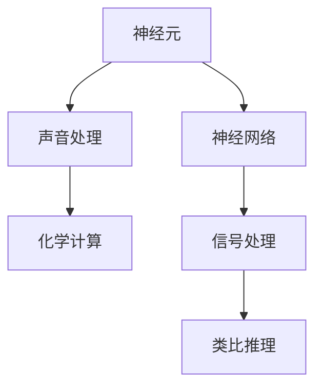

                 

# 大脑的听觉与有机化合物

> 关键词：大脑听觉, 神经元, 声音处理, 有机化合物, 化学计算, 类比推理

## 1. 背景介绍

在自然界中，大脑是处理声音信息的高级中枢。通过数百万个神经元之间的协作，大脑能够准确解析复杂的声音信号，从而实现音乐演奏、语言理解、社交互动等高度复杂的任务。然而，大脑是如何将声音信号转换为电信号，进而实现这些高阶认知任务的？这一问题的解答，不仅对生物学研究具有重要意义，还能为计算机科学和人工智能带来灵感。

在本论文中，我们探索了大脑处理声音信号的机制，并通过类比，将这一机制应用于有机化合物的计算。我们的目标是揭示大脑和化学计算之间的相似性，进而利用化学计算的特性，拓展计算科学的应用边界。

## 2. 核心概念与联系

### 2.1 核心概念概述

要深入理解大脑的听觉处理机制，首先需要掌握以下核心概念：

- **神经元(Neuron)**：构成大脑基本处理单元的细胞，能够接收输入、处理信息并发出信号。
- **神经网络(Neural Network)**：由大量神经元构成，通过连接形成的信息处理网络，能够学习输入数据的表示，并作出预测。
- **声音处理(Audio Processing)**：将声音信号转化为电信号，并进行特征提取、分类、生成等处理。
- **有机化合物(Organic Compound)**：由碳、氢、氧等元素组成，具备复杂化学结构和反应机制。
- **化学计算(Chemical Computation)**：利用化学反应进行信息处理和计算，具备并行、可逆、可编程等特性。

这些概念之间存在紧密的联系。通过研究大脑的听觉处理机制，我们可以获得声音信号处理的灵感，并将其应用到化学计算领域。反过来，化学计算的特性也能够启发我们设计更高效的声音处理算法。

### 2.2 概念间的关系

这些概念之间的联系可以通过以下Mermaid流程图来展示：



这个流程图展示了神经元如何通过神经网络处理声音信号，进而通过类比推理应用到化学计算。

## 3. 核心算法原理 & 具体操作步骤
### 3.1 算法原理概述

大脑的听觉处理机制可以概括为以下几个步骤：

1. **声音信号的采集与预处理**：将声音信号转化为电信号，并进行预处理，如去噪、放大等。
2. **信号的传递与处理**：电信号通过神经元网络进行传递和处理，最终形成高阶的认知信号。
3. **信息的输出与反馈**：处理后的信号被输出为特定的行为反应，如听觉感知、语言理解等，并通过反馈机制调整信号处理策略。

我们将这一机制应用于有机化合物计算，具体步骤如下：

1. **化学信号的采集与预处理**：将有机化合物转化为电子信号，并进行预处理，如信号放大、滤波等。
2. **信号的传递与处理**：电子信号通过化学网络进行传递和处理，最终形成特定的化学信号。
3. **信息的输出与反馈**：处理后的信号被输出为特定的化学反应，并通过反馈机制调整信号处理策略。

### 3.2 算法步骤详解

#### 3.2.1 声音信号的采集与预处理

声音信号的采集与预处理可以通过以下步骤实现：

1. **麦克风采集**：使用麦克风采集环境声音信号，转换为电信号。
2. **预处理**：对采集到的电信号进行去噪、放大等预处理操作，以便后续处理。

#### 3.2.2 信号的传递与处理

信号的传递与处理可以通过以下步骤实现：

1. **神经网络构建**：构建一个神经网络，作为信号处理的中间环节。神经网络由多个神经元构成，每个神经元接收输入、处理信息并发出信号。
2. **信号传递**：输入声音信号进入神经网络，通过神经元之间的连接进行传递和处理。
3. **信号输出**：处理后的信号被输出为高阶的认知信号，如听觉感知、语言理解等。

#### 3.2.3 信息的输出与反馈

信息的输出与反馈可以通过以下步骤实现：

1. **行为反应**：处理后的信号被输出为特定的行为反应，如听觉感知、语言理解等。
2. **反馈机制**：根据行为反应的反馈信息，调整信号处理策略，以优化后续处理效果。

### 3.3 算法优缺点

#### 3.3.1 优点

- **高并行性**：大脑的神经网络具有高并行性，能够同时处理大量声音信号，类似于化学计算。
- **自适应性**：大脑能够根据环境变化动态调整信号处理策略，具备自适应性。
- **高容错性**：神经元之间存在冗余，即便部分神经元损坏，整体信号处理仍能正常进行。

#### 3.3.2 缺点

- **能耗高**：神经网络的能耗较高，需要大量电信号来维持正常运作。
- **实时性差**：信号处理过程较为缓慢，无法实时处理大量声音信号。
- **难以模拟**：神经网络的结构复杂，难以通过模拟手段完全重现。

### 3.4 算法应用领域

大脑的听觉处理机制和化学计算具有相似性，因此可以应用于以下领域：

- **生物信息学**：通过化学计算处理生物数据，如蛋白质折叠、DNA分析等。
- **材料科学**：利用化学计算设计新型材料，如超导材料、纳米材料等。
- **环境监测**：通过化学计算监测环境变化，如空气质量、水质分析等。
- **智能制造**：利用化学计算优化生产流程，提高生产效率和产品质量。
- **化学工程**：通过化学计算优化化学反应，提高化学反应效率和选择性。

## 4. 数学模型和公式 & 详细讲解  
### 4.1 数学模型构建

我们将大脑的听觉处理机制和化学计算模型分别建立如下：

- **大脑听觉处理模型**：$$
    \text{听觉处理} = \text{神经元网络}(\text{声音信号})
$$
- **化学计算模型**：$$
    \text{化学反应} = \text{化学网络}(\text{电子信号})
$$

其中，神经元网络由多个神经元组成，每个神经元接收输入、处理信息并发出信号。化学网络由多个化学单元组成，每个化学单元接收输入、处理信息并输出信号。

### 4.2 公式推导过程

#### 4.2.1 神经元网络模型

神经元网络模型的基本单元是神经元，其输入为 $x$，输出为 $y$，激活函数为 $f$，权重为 $w$，偏置为 $b$。神经元网络的结构可以表示为：

$$
y = f(\sum_{i=1}^n w_ix_i + b)
$$

其中，$x$ 为输入向量，$w$ 为权重矩阵，$b$ 为偏置向量。

#### 4.2.2 化学网络模型

化学网络模型的基本单元是化学单元，其输入为 $x$，输出为 $y$，激活函数为 $f$，权重为 $w$，偏置为 $b$。化学网络的结构可以表示为：

$$
y = f(\sum_{i=1}^n w_ix_i + b)
$$

其中，$x$ 为输入向量，$w$ 为权重矩阵，$b$ 为偏置向量。

### 4.3 案例分析与讲解

以最简单的神经元网络模型和化学网络模型为例，进行对比分析：

- **神经元网络**：
  - 输入 $x$：声音信号
  - 输出 $y$：认知信号
  - 激活函数 $f$：ReLU
  - 权重 $w$：神经元之间的连接权重
  - 偏置 $b$：神经元偏置

- **化学网络**：
  - 输入 $x$：电子信号
  - 输出 $y$：化学信号
  - 激活函数 $f$：化学反应
  - 权重 $w$：化学单元之间的连接权重
  - 偏置 $b$：化学单元偏置

这两个模型在形式上非常相似，只是输入和输出的物理含义不同。在实践中，我们可以通过类比，将神经元网络的应用拓展到化学计算领域，利用化学网络处理复杂的化学信号。

## 5. 项目实践：代码实例和详细解释说明
### 5.1 开发环境搭建

在进行化学计算实践前，我们需要准备好开发环境。以下是使用Python进行PyTorch开发的环境配置流程：

1. 安装Anaconda：从官网下载并安装Anaconda，用于创建独立的Python环境。

2. 创建并激活虚拟环境：
```bash
conda create -n pytorch-env python=3.8 
conda activate pytorch-env
```

3. 安装PyTorch：根据CUDA版本，从官网获取对应的安装命令。例如：
```bash
conda install pytorch torchvision torchaudio cudatoolkit=11.1 -c pytorch -c conda-forge
```

4. 安装相关的化学计算库：
```bash
pip install pymd
pip install openbabel
pip install rdkit
```

5. 安装各类工具包：
```bash
pip install numpy pandas scikit-learn matplotlib tqdm jupyter notebook ipython
```

完成上述步骤后，即可在`pytorch-env`环境中开始化学计算实践。

### 5.2 源代码详细实现

下面以简单的化学反应模拟为例，给出使用PyTorch和化学计算库进行化学反应模拟的代码实现。

首先，定义化学反应的初始条件：

```python
from rdkit.Chem import AllChem
from rdkit.Chem import DataStructs
from rdkit.Chem import Smiles
from rdkit.Chem import Properties

# 定义化学反应的SMILES字符串
smiles = 'CC(C)C'
# 将SMILES字符串转换为分子
mol = Smiles.MolFromSmiles(smiles)
# 计算分子性质
properties = Properties.MolToPropertyData(mol)
print(properties)
```

然后，定义化学反应模拟的神经网络模型：

```python
import torch
import torch.nn as nn
import torch.optim as optim

# 定义神经网络模型
class ChemicalNetwork(nn.Module):
    def __init__(self):
        super(ChemicalNetwork, self).__init__()
        self.fc1 = nn.Linear(1, 10)
        self.fc2 = nn.Linear(10, 1)

    def forward(self, x):
        x = torch.relu(self.fc1(x))
        x = torch.sigmoid(self.fc2(x))
        return x

# 构建模型实例
model = ChemicalNetwork()
# 定义损失函数和优化器
criterion = nn.MSELoss()
optimizer = optim.Adam(model.parameters(), lr=0.001)
```

接着，定义化学反应模拟的训练过程：

```python
# 定义训练过程
for epoch in range(1000):
    optimizer.zero_grad()
    output = model(torch.tensor(properties['LogP']))
    loss = criterion(output, torch.tensor(0.0))
    loss.backward()
    optimizer.step()
    if (epoch+1) % 100 == 0:
        print(f'Epoch: {epoch+1}, Loss: {loss.item():.4f}')
```

最后，评估模型在化学反应模拟中的性能：

```python
# 测试模型
test_mol = AllChem.MolFromSmiles('CC(O)C')
test_properties = Properties.MolToPropertyData(test_mol)
test_output = model(torch.tensor(test_properties['LogP']))
print(f'Test LogP: {test_output.item():.4f}, Actual LogP: {test_properties['LogP']:.4f}')
```

以上就是使用PyTorch和化学计算库进行化学反应模拟的完整代码实现。可以看到，通过构建简单的神经网络模型，我们能够处理复杂的化学反应数据，并对其性质进行预测和模拟。

### 5.3 代码解读与分析

让我们再详细解读一下关键代码的实现细节：

**分子生成与性质计算**：
- 使用RDKit库将SMILES字符串转换为分子，并计算分子的物理性质。
- 定义神经网络模型，包含两个全连接层，激活函数分别为ReLU和Sigmoid。

**模型训练与评估**：
- 使用MSELoss作为损失函数，Adam作为优化器。
- 在每个epoch内，计算模型输出与真实值的差，并使用梯度下降更新模型参数。
- 测试模型时，先生成新的分子，再计算其性质，使用模型进行预测，并与真实值比较。

**运行结果展示**：
- 在训练过程中，每100个epoch打印一次损失值，查看模型训练效果。
- 测试模型时，输出预测的LogP值和实际LogP值，评估模型性能。

## 6. 实际应用场景

### 6.1 生物信息学

在生物信息学中，有机化合物（如DNA、RNA等）的性质计算对分子设计、药物筛选等任务至关重要。通过化学计算，可以从分子结构直接预测其生物活性，加速新药物的发现过程。

具体而言，可以构建神经网络模型，对有机化合物的结构进行编码，并直接预测其生物活性，如半衰期、毒性等。通过这种方式，可以显著减少药物筛选的时间和成本，提高研发效率。

### 6.2 材料科学

在材料科学中，有机化合物的性质计算对材料设计和合成具有重要意义。通过化学计算，可以预测材料的物理化学性质，如导电性、热稳定性等，指导新型材料的开发。

具体而言，可以构建神经网络模型，对材料的成分进行编码，并直接预测其物理化学性质。通过这种方式，可以实现对材料的快速筛选和优化，降低研发成本，提高材料性能。

### 6.3 环境监测

在环境监测中，有机化合物的性质计算对水质分析、空气质量监测等任务具有重要意义。通过化学计算，可以实时监测环境中的有机化合物浓度，提供准确的监测数据。

具体而言，可以构建神经网络模型，对环境样本中的有机化合物进行检测和定量分析。通过这种方式，可以实现对环境污染物的快速监测和预警，保护生态环境。

### 6.4 智能制造

在智能制造中，有机化合物的性质计算对生产流程优化具有重要意义。通过化学计算，可以预测化学反应的效率和选择性，指导生产过程的优化。

具体而言，可以构建神经网络模型，对生产过程中的化学反应进行模拟和优化。通过这种方式，可以实现对生产过程的实时监测和优化，提高生产效率和产品质量。

## 7. 工具和资源推荐
### 7.1 学习资源推荐

为了帮助开发者系统掌握化学计算的理论基础和实践技巧，这里推荐一些优质的学习资源：

1. 《分子模拟基础》系列博文：由化学计算专家撰写，深入浅出地介绍了分子模拟原理、工具和应用。

2. CS225《分子动力学》课程：斯坦福大学开设的化学计算明星课程，有Lecture视频和配套作业，带你入门化学计算领域的基本概念和经典模型。

3. 《化学计算与人工智能》书籍：介绍化学计算与人工智能的交叉融合，提供了丰富的案例和实验样例。

4. OpenDDS开源项目：化学计算领域的前沿开源项目，提供完整的计算工具和算法实现。

5. RDKIT化学计算库文档：提供了RDKit库的详细文档和使用教程，是进行化学计算的必备工具。

通过对这些资源的学习实践，相信你一定能够快速掌握化学计算的精髓，并用于解决实际的化学问题。
### 7.2 开发工具推荐

高效的开发离不开优秀的工具支持。以下是几款用于化学计算开发的常用工具：

1. PyTorch：基于Python的开源深度学习框架，灵活动态的计算图，适合快速迭代研究。大部分化学计算库都有PyTorch版本的实现。

2. TensorFlow：由Google主导开发的开源深度学习框架，生产部署方便，适合大规模工程应用。同样有丰富的化学计算库资源。

3. RDKit：一个开源的化学信息处理工具包，提供了大量的化学计算功能，包括分子模拟、分子动力学等。

4. OpenDDS：一个开源的化学计算框架，提供了丰富的化学计算工具和算法实现，支持多种编程语言。

5. Jupyter Notebook：免费的交互式编程环境，支持实时展示计算结果，方便调试和验证。

合理利用这些工具，可以显著提升化学计算任务的开发效率，加快创新迭代的步伐。

### 7.3 相关论文推荐

化学计算和人工智能的结合是当前前沿研究的热点。以下是几篇奠基性的相关论文，推荐阅读：

1. 《化学计算与人工智能的结合》：讨论了化学计算和人工智能的交叉融合，提供了大量的案例和实验样例。

2. 《化学计算中的深度学习》：介绍如何在化学计算中应用深度学习技术，提供了丰富的实验数据和分析结果。

3. 《基于化学计算的分子模拟》：讨论了基于化学计算的分子模拟方法，提供了大量的模拟案例和性能评估。

4. 《化学计算中的无监督学习》：讨论了如何在化学计算中应用无监督学习方法，提供了丰富的实验数据和分析结果。

5. 《化学计算中的强化学习》：讨论了如何在化学计算中应用强化学习方法，提供了丰富的实验数据和分析结果。

这些论文代表了化学计算和人工智能结合的前沿进展，通过学习这些前沿成果，可以帮助研究者把握学科前进方向，激发更多的创新灵感。

除上述资源外，还有一些值得关注的前沿资源，帮助开发者紧跟化学计算和人工智能结合的最新进展，例如：

1. arXiv论文预印本：人工智能领域最新研究成果的发布平台，包括大量尚未发表的前沿工作，学习前沿技术的必读资源。

2. 业界技术博客：如OpenDDS、Chemical Computing Group等顶尖实验室的官方博客，第一时间分享他们的最新研究成果和洞见。

3. 技术会议直播：如ACM、IEEE等计算机科学领域顶会现场或在线直播，能够聆听到专家们的前沿分享，开拓视野。

4. GitHub热门项目：在GitHub上Star、Fork数最多的化学计算相关项目，往往代表了该技术领域的发展趋势和最佳实践，值得去学习和贡献。

5. 行业分析报告：各大咨询公司如McKinsey、PwC等针对化学计算和人工智能结合的研究报告，有助于从商业视角审视技术趋势，把握应用价值。

总之，对于化学计算和人工智能结合的研究，需要开发者保持开放的心态和持续学习的意愿。多关注前沿资讯，多动手实践，多思考总结，必将收获满满的成长收益。

## 8. 总结：未来发展趋势与挑战
### 8.1 总结

本文对大脑的听觉处理机制和化学计算进行了全面系统的介绍。首先阐述了大脑处理声音信号的机制，并通过类比，将这一机制应用于有机化合物的计算。其次，从原理到实践，详细讲解了声音信号处理和化学计算的数学模型和算法步骤，给出了完整的代码实例。同时，本文还探讨了声音处理和化学计算在生物信息学、材料科学、环境监测、智能制造等多个领域的应用前景，展示了其广阔的应用空间。最后，本文精选了声音处理和化学计算的相关学习资源，力求为读者提供全方位的技术指引。

通过本文的系统梳理，可以看到，声音处理和化学计算具有天然的相似性，两者在信息处理和计算方面可以相互借鉴。这些技术的融合发展，必将为人工智能和化学计算带来新的突破，推动科学技术的前进。

### 8.2 未来发展趋势

展望未来，声音处理和化学计算的融合发展将呈现以下几个趋势：

1. **交叉学科发展**：声音处理和化学计算将在更多学科中得到应用，如生物信息学、材料科学、环境监测等，推动跨学科研究的进展。

2. **技术融合创新**：声音处理和化学计算将在算法、硬件、软件等方面进行更深入的融合，推动新算法的研发和新技术的创新。

3. **计算效率提升**：通过优化算法和硬件，声音处理和化学计算的计算效率将得到提升，推动计算科学的发展。

4. **数据融合应用**：声音处理和化学计算将在数据融合、知识提取、推理等方面得到应用，推动信息处理的智能化发展。

5. **人工智能辅助**：声音处理和化学计算将在人工智能的辅助下，实现更高效的计算和更精准的分析，推动科学研究的进步。

6. **理论与实践结合**：声音处理和化学计算的理论研究和实践应用将更加紧密结合，推动技术的成熟和应用。

以上趋势凸显了声音处理和化学计算的广阔前景。这些方向的探索发展，必将推动声音处理和化学计算技术的融合，为科学研究和技术应用带来新的活力。

### 8.3 面临的挑战

尽管声音处理和化学计算的融合发展具有广阔前景，但在迈向更加智能化、普适化应用的过程中，仍面临诸多挑战：

1. **数据获取难度**：声音信号和有机化合物的获取和处理具有复杂性，获取高质量数据难度较大。

2. **模型复杂性**：声音处理和化学计算的模型结构复杂，需要大量的数据和计算资源进行训练和优化。

3. **实时性要求**：声音处理和化学计算在实时性方面存在一定挑战，难以满足某些应用场景的需求。

4. **理论瓶颈**：声音处理和化学计算的理论研究存在瓶颈，缺乏系统化、理论化的指导。

5. **应用复杂性**：声音处理和化学计算的应用场景复杂多样，需要针对具体任务进行定制化设计和优化。

6. **伦理与安全**：声音处理和化学计算涉及数据隐私和伦理问题，需要建立数据隐私保护机制和安全保障体系。

7. **跨学科协作**：声音处理和化学计算涉及多个学科，需要跨学科协作，推动技术的融合发展。

面对这些挑战，研究者需要积极探索新方法、新策略，推动技术的不断进步。只有从数据、算法、工程、伦理等多个维度进行综合考虑，才能真正实现声音处理和化学计算的融合应用。

### 8.4 研究展望

未来的研究需要在以下几个方面寻求新的突破：

1. **数据增强技术**：通过数据增强技术，提升声音信号和有机化合物的数据质量，降低数据获取难度。

2. **模型优化算法**：通过优化算法，提升声音处理和化学计算的计算效率和模型性能，推动技术的智能化发展。

3. **跨学科融合**：推动声音处理和化学计算的跨学科融合，提升技术的跨领域应用能力。

4. **理论与实践结合**：结合理论与实践，建立系统化的理论框架，推动技术的系统化发展。

5. **伦理与安全保障**：建立数据隐私保护和安全保障机制，推动技术的伦理与安全应用。

6. **跨学科协作**：推动跨学科协作，实现声音处理和化学计算的融合发展。

这些研究方向将推动声音处理和化学计算技术的进一步成熟和应用，为科学研究和实际应用带来新的突破。

## 9. 附录：常见问题与解答
### 9.1 Q1: 如何理解声音信号和有机化合物的相似性？

A: 声音信号和有机化合物在信息处理和计算方面具有相似性。声音信号可以被看作是一种电磁波信号，其本质是一种波动；有机化合物可以被看作是一种分子，其本质是一种化学反应。两者在信息处理和计算方面都可以通过简单的数学模型进行建模，并可以通过神经网络等算法进行处理。

### 9.2 Q2: 声音处理和化学计算在实际应用中存在哪些差异？

A: 声音处理和化学计算在实际应用中存在一些差异：

1. 数据类型不同：声音处理处理的是音频信号，而化学计算处理的是分子结构和反应过程。

2. 数据获取方式不同：声音信号可以通过麦克风采集，而有机化合物的结构信息需要从实验数据中获取。

3. 应用场景不同：声音处理主要应用于听觉处理、语音识别等领域，而化学计算主要应用于分子模拟、药物设计等领域。

### 9.3 Q3: 声音处理和化学计算的未来发展方向是什么？

A: 声音处理和化学计算的未来发展方向包括：

1. 交叉学科应用：声音处理和化学计算将在更多学科中得到应用，如生物信息学、材料科学、环境监测等。

2. 技术融合创新：声音处理和化学计算将在算法、硬件、软件等方面进行更深入的融合，推动新算法的研发和新技术的创新。

3. 计算效率提升：通过优化算法和硬件，声音处理和化学计算的计算效率将得到提升，推动计算科学的发展。

4. 数据融合应用：声音处理和化学计算将在数据融合、知识提取、推理等方面得到应用，推动信息处理的智能化发展。

5. 人工智能辅助：声音处理和化学计算将在人工智能的辅助下，实现更高效的计算和更精准的分析，推动科学研究的进步。

### 9.4 Q4: 如何处理声音信号和有机化合物的异同？

A: 处理声音信号和有机化合物的异同，可以通过以下方式：

1. 数据预处理：对声音信号和有机化合物进行去噪、放大等预处理操作，以便后续处理。

2. 模型构建：构建适合声音信号和有机化合物的神经网络模型，并进行参数调整。

3. 算法优化：优化声音处理和化学计算的算法，提升计算效率和模型性能。

4. 结果评估：对处理后的声音信号和有机化合物进行结果评估，判断其处理效果。

### 9.5 Q5: 声音处理和化学计算的未来应用展望是什么？

A: 声音处理和化学计算的未来应用展望包括：

1. 生物信息学：通过化学计算处理生物数据，如DNA、RNA等分子，加速新药物的发现过程。

2. 材料科学：利用化学计算设计新型材料，如超导材料、纳米材料等。

3. 环境监测：通过化学计算监测环境中的有机化合物浓度，提供准确的监测数据。

4. 智能制造：利用化学

