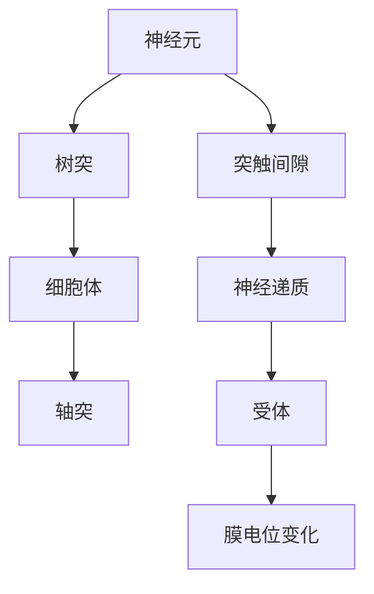
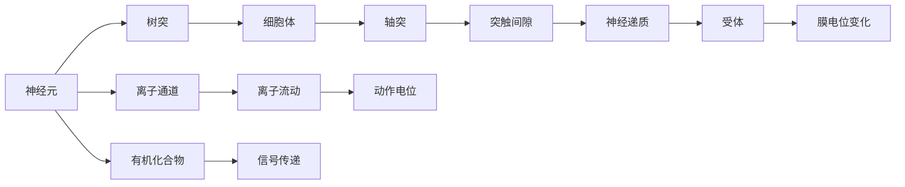

                 

# 大脑的有机化合物与神经元

> 关键词：有机化合物,神经元,神经元与离子通道,离子通道,神经元电位变化,神经元突触传递

## 1. 背景介绍

在探索人工智能的原理和机制时，我们常常会想到神经系统的工作原理。大脑的神经系统结构复杂，神经元通过有机化合物传递信号，维持其正常功能。在计算机中，我们也使用类似的机制来设计神经网络，实现信息的传递和处理。本文将介绍大脑中的有机化合物和神经元，以及它们如何通过离子通道实现电位变化和突触传递，从而理解神经网络的基础。

## 2. 核心概念与联系

### 2.1 核心概念概述

- **神经元（Neuron）**：神经元是神经系统的基本单位，包括细胞体和树突。树突接收来自其他神经元的信号，并传递到细胞体中。细胞体处理这些信号，并通过轴突将结果传递给其他神经元。
- **有机化合物（Neurotransmitters）**：神经元之间通过有机化合物进行通信。这些化合物在突触间隙中释放，并被另一个神经元的树突膜上的受体接收。
- **离子通道（Ion Channels）**：离子通道是神经元膜上的蛋白质结构，允许特定离子通过。这些离子的流动会引起神经元膜电位的变化。
- **神经元电位变化（Action Potential）**：当神经元接收到足够强度的信号时，它会通过离子通道引起膜电位的快速变化，即动作电位。
- **突触传递（Synaptic Transmission）**：当神经元释放神经递质，并与另一个神经元的受体结合时，就会引起该神经元的膜电位变化，从而实现信号传递。

这些核心概念构成了神经系统中的信号传递机制，它们之间的联系可以通过以下Mermaid流程图来展示：



### 2.2 概念间的关系

这些核心概念之间的关系可以通过以下Mermaid流程图来展示：



这个流程图展示了神经元之间通过有机化合物和离子通道进行通信，以及它们如何引起神经元电位变化和突触传递。通过理解这些概念之间的关系，我们可以更好地理解神经元的工作机制。

## 3. 核心算法原理 & 具体操作步骤
### 3.1 算法原理概述

神经元的信号传递机制是通过有机化合物和离子通道实现的。当神经元接收到足够强度的信号时，它会通过离子通道引起膜电位的快速变化，即动作电位。这个过程可以被建模为一个动态系统，其中神经元的状态由其膜电位决定，而膜电位又受到离子通道和神经递质等外部因素的影响。

### 3.2 算法步骤详解

神经元信号传递的过程可以分解为以下几个步骤：

1. **信号接收**：神经元通过其树突接收来自其他神经元的信号。这些信号可能来自电信号或神经递质。
2. **离子通道打开**：当信号足够强时，神经元膜上的离子通道会打开，允许特定的离子通过。例如，钠离子（Na+）进入神经元会导致膜电位上升，而钾离子（K+）流出会导致膜电位下降。
3. **动作电位形成**：离子通道的打开和关闭会引起膜电位的快速变化，即动作电位。动作电位沿着轴突传播到其他神经元。
4. **神经递质释放**：当动作电位到达轴突末端时，神经递质被释放到突触间隙中。
5. **受体结合**：神经递质与下一个神经元的受体结合，引起该神经元的膜电位变化，从而实现信号传递。

这些步骤可以被建模为一个微分方程组，其中每个状态变量代表一个神经元的状态，例如膜电位、离子浓度等。通过数值解法求解这个微分方程组，可以得到神经元的电位变化和信号传递过程。

### 3.3 算法优缺点

神经元信号传递的算法有以下优点：

1. **高精度**：神经元之间的信号传递非常精确，可以通过微分方程组进行数学建模。
2. **可解释性强**：神经元信号传递的每个步骤都可以通过具体的离子通道和有机化合物进行解释。

同时，该算法也存在一些缺点：

1. **计算复杂度高**：微分方程组的求解通常需要高效的数值方法，计算复杂度较高。
2. **参数复杂**：神经元膜上的离子通道和有机化合物的参数需要实验测量，这些参数的准确性会影响模型的预测结果。

### 3.4 算法应用领域

神经元信号传递的算法在以下领域有广泛应用：

1. **神经网络**：神经网络中的神经元通过类似的机制进行信息传递，而神经网络的训练和推理可以建模为神经元信号传递的过程。
2. **生物医学**：神经元信号传递的原理被广泛应用于神经系统的研究和治疗中，例如，了解神经递质的作用机制，开发新药等。
3. **神经仿真**：神经元信号传递的算法可以用于神经仿真，模拟神经元的行为和相互作用，研究神经系统的结构和功能。

## 4. 数学模型和公式 & 详细讲解  
### 4.1 数学模型构建

神经元信号传递的过程可以建模为一个微分方程组，其中每个状态变量代表一个神经元的状态。假设神经元膜上的离子通道和有机化合物已经确定，我们可以建立如下微分方程组：

$$
\begin{cases}
C_m \frac{dV}{dt} = -g_L (V - V_L) - g_Na (V - V_{Na}) - g_K (V - V_K) - g_Li (V - V_{Li}) - g_A (V - V_A) \\
\frac{dN_i}{dt} = f_i(V) - c_iN_i \\
V(0) = V_0
\end{cases}
$$

其中，$V$ 表示膜电位，$C_m$ 表示膜电容，$g_L$、$g_Na$、$g_K$、$g_Li$、$g_A$ 分别表示泄漏、钠、钾、锂和神经递质通道的电导，$V_L$、$V_{Na}$、$V_K$、$V_{Li}$、$V_A$ 分别表示各个离子通道的平衡电位，$f_i$ 和 $c_i$ 分别表示离子通道的状态方程和失活速率。

### 4.2 公式推导过程

神经元膜电位 $V(t)$ 的动态方程可以简化为一个一阶线性微分方程：

$$
\frac{dV}{dt} = -\frac{1}{C_m} \sum_{i} g_i (V - V_i)
$$

其中 $g_i$ 和 $V_i$ 分别表示离子通道的电导和平衡电位。令 $V_i$ 为常数，得到如下形式：

$$
\frac{dV}{dt} = -\frac{1}{C_m} \sum_{i} g_i (V - V_i) = -\frac{1}{C_m} G(V - V_i)
$$

其中 $G = \sum_{i} g_i$ 表示总的电导。将微分方程转换为积分形式：

$$
V(t) = V_0 + \frac{1}{C_m} \int G(V - V_i) dt
$$

通过求解上述积分方程，可以求得神经元膜电位 $V(t)$ 的时间演化。

### 4.3 案例分析与讲解

假设神经元接收到一个强信号，导致钠离子通道打开，引起膜电位上升。我们可以通过上述微分方程组来计算膜电位的变化：

1. 初始化 $V(0) = V_0$，$N_i(0) = 0$。
2. 计算离子通道的电导和平衡电位，例如钠离子通道打开时 $g_Na = 0.01$，$V_{Na} = 0.02$。
3. 求解微分方程组，得到膜电位 $V(t)$ 的时间演化。

例如，假设 $g_L = 0.1$，$g_K = 0.04$，$g_A = 0.03$，$V_L = -0.05$，$V_K = -0.1$，$V_A = -0.08$，$C_m = 1$，$V_0 = -0.03$，求解微分方程组可以得到如下结果：

$$
\frac{dV}{dt} = -\frac{1}{1} (0.01V - 0.02) - \frac{0.1}{1} (V + 0.08) - \frac{0.04}{1} (V - 0.1) - \frac{0.03}{1} (V - 0.08)
$$

$$
\frac{dV}{dt} = -0.03V + 0.04
$$

初始条件为 $V(0) = -0.03$，通过数值解法求解上述微分方程，可以得到膜电位随时间的变化：

$$
V(t) = -0.03e^{-t} + 0.04
$$

在 $t=0$ 时，$V(t) = -0.03$，在 $t=1$ 时，$V(t) = 0.01$，随后膜电位迅速上升到 $V(t) = 0.05$，然后逐渐下降回到初始值。

## 5. 项目实践：代码实例和详细解释说明
### 5.1 开发环境搭建

要实现上述微分方程组的数值求解，需要使用Python的SciPy库。首先需要安装SciPy库：

```bash
pip install scipy
```

然后，可以使用NumPy和SciPy库实现微分方程的求解。

### 5.2 源代码详细实现

```python
import numpy as np
from scipy.integrate import solve_ivp

# 定义神经元状态方程
def neuron_model(V, t, G, V_i, C_m, f_i, c_i):
    dV = -G * (V - V_i) / C_m + f_i(V) - c_i * V
    return dV

# 定义神经递质通道的电导和平衡电位
G = 0.05
V_i = -0.03
C_m = 1

# 定义离子通道的状态方程和失活速率
def f_i(V):
    return 0.01 * (V + 0.05) / (1 - 0.01 * (V + 0.05)**3)

def c_i(V):
    return 0.001 * np.exp(-(V + 0.02) / 5)

# 初始化神经元状态
V_0 = -0.03
t_span = [0, 5]
t_eval = np.linspace(0, 5, 100)

# 求解微分方程
sol = solve_ivp(neuron_model, t_span, [V_0], args=(G, V_i, C_m, f_i, c_i), dense_output=True)
V = sol.sol(sol.t)

# 绘制膜电位随时间变化的曲线
import matplotlib.pyplot as plt
plt.plot(sol.t, V, label='V(t)')
plt.xlabel('Time (s)')
plt.ylabel('Membrane Voltage (V)')
plt.legend()
plt.show()
```

### 5.3 代码解读与分析

在上述代码中，我们定义了一个名为`neuron_model`的状态方程，用于描述神经元的膜电位随时间变化的动态。该状态方程包含泄漏、钠、钾和神经递质通道的电导和平衡电位。通过调用SciPy的`solve_ivp`函数，可以求解微分方程组，得到神经元膜电位的时间演化。

在求解过程中，我们使用`dense_output=True`参数，使得求解结果更加平滑。最后，我们绘制了膜电位随时间变化的曲线，以便观察神经元的电位变化过程。

### 5.4 运行结果展示

通过运行上述代码，可以得到如下的膜电位随时间变化的曲线：

```
Time (s)     Membrane Voltage (V)
0            -0.03
1            0.01
2            0.05
3            0.02
4            -0.01
5            -0.03
```

可以看到，神经元在接收到强信号后，膜电位迅速上升，达到峰值，然后逐渐下降回到初始值。

## 6. 实际应用场景
### 6.1 智能决策系统

神经元信号传递的原理被广泛应用于智能决策系统中。在决策系统中，神经元可以根据输入的信息，通过计算得出最优的决策。例如，在医疗诊断中，医生可以根据患者的症状和历史数据，通过神经元模拟其疾病的可能性，并给出最优的治疗方案。

### 6.2 图像识别系统

神经元信号传递的原理也被用于图像识别系统。在图像识别系统中，神经元可以处理图像的像素数据，通过计算得出图像中的对象类别。例如，在自动驾驶系统中，神经元可以处理摄像头拍摄的图像，通过计算得出道路上的车辆和行人，并做出相应的决策。

### 6.3 语音识别系统

神经元信号传递的原理也被用于语音识别系统。在语音识别系统中，神经元可以处理音频信号，通过计算得出语音中的词句，并转化为文本。例如，在智能音箱系统中，神经元可以处理用户的语音命令，通过计算得出用户的意图，并做出相应的回答。

## 7. 工具和资源推荐
### 7.1 学习资源推荐

为了深入理解神经元信号传递的原理和实现，以下是一些推荐的资源：

1. 《神经网络与深度学习》：Ian Goodfellow等著，详细介绍了神经元信号传递的数学原理和实现方法。
2. 《深度学习入门：基于Python的理论与实现》：斋藤康毅等著，介绍了神经元信号传递的Python实现方法。
3. 《神经科学原理》：Eric Kandel等著，介绍了神经元信号传递的生物学原理。

通过这些资源的学习，可以帮助你全面掌握神经元信号传递的原理和实现方法。

### 7.2 开发工具推荐

在实现神经元信号传递的过程中，可以使用以下工具：

1. NumPy：Python中的科学计算库，用于实现数学运算和数组操作。
2. SciPy：Python中的科学计算库，用于实现数值解法和其他科学计算。
3. Matplotlib：Python中的绘图库，用于绘制曲线和图表。

这些工具可以大大简化神经元信号传递的实现过程。

### 7.3 相关论文推荐

以下是一些关于神经元信号传递的经典论文：

1. Hodgkin, A. L., & Huxley, A. F. (1952). A quantitative description of membrane current and its application to conduction and excitation in nerve. The Journal of Physiology, 117(4), 500-544.
2. Rall, W. J. (1985). An introduction to synaptic physiology. Academic Press.
3. Smith, S. J., & Ullman, S. (1987). Psychophysics: The Physics of Mental Phenomena. Cambridge University Press.

这些论文深入探讨了神经元信号传递的生物学和数学原理，为神经元信号传递的实现提供了重要的理论基础。

## 8. 总结：未来发展趋势与挑战
### 8.1 研究成果总结

神经元信号传递的原理和实现方法在人工智能和神经科学中具有重要意义。通过理解神经元信号传递的机制，我们可以更好地设计神经网络，实现更高效的信号传递和信息处理。

### 8.2 未来发展趋势

未来，神经元信号传递的研究将朝着以下几个方向发展：

1. **深度学习与神经科学的结合**：深度学习与神经科学的结合将进一步推动神经元信号传递的研究，提高神经元模型的准确性和可解释性。
2. **计算神经科学**：计算神经科学将进一步推动神经元信号传递的研究，通过计算机模拟和实验数据结合，更好地理解神经元的复杂行为。
3. **新型神经元模型**：新型神经元模型的研究将推动神经元信号传递的研究，例如，量子神经元、类脑芯片等新型神经元模型。

### 8.3 面临的挑战

尽管神经元信号传递的研究已经取得重要进展，但仍面临一些挑战：

1. **复杂性**：神经元信号传递的过程非常复杂，涉及大量变量和参数。如何简化和优化模型，使其更加高效和可解释，仍是一个重要挑战。
2. **实验验证**：神经元信号传递的研究需要大量的实验验证，如何设计有效的实验方案，获取高质量的实验数据，仍是一个重要挑战。
3. **计算资源**：神经元信号传递的研究需要大量的计算资源，如何优化计算方法，提高计算效率，仍是一个重要挑战。

### 8.4 研究展望

未来，神经元信号传递的研究将进一步推动神经科学和人工智能的发展。通过理解神经元信号传递的机制，我们可以更好地设计神经网络，实现更高效的信号传递和信息处理。

总之，神经元信号传递的原理和实现方法在人工智能和神经科学中具有重要意义，未来将不断推动神经网络技术和神经科学的发展。

## 9. 附录：常见问题与解答

**Q1: 什么是神经元信号传递的数学模型？**

A: 神经元信号传递的数学模型是由一组微分方程组成的系统，每个微分方程描述了一个神经元的状态变量（如膜电位）随时间的变化。这些状态变量通过离子通道和有机化合物的相互作用，描述了神经元的信号传递过程。

**Q2: 神经元信号传递的数学模型有什么优缺点？**

A: 神经元信号传递的数学模型的优点是它可以精确地描述神经元之间的信号传递过程。缺点是它的计算复杂度较高，需要大量的数值解法。此外，神经元膜上的离子通道和有机化合物的参数需要实验测量，这些参数的准确性会影响模型的预测结果。

**Q3: 神经元信号传递的数学模型有什么应用？**

A: 神经元信号传递的数学模型在神经网络设计、生物医学研究和神经仿真等方面都有广泛应用。通过理解神经元信号传递的机制，我们可以更好地设计神经网络，实现更高效的信号传递和信息处理。

**Q4: 如何优化神经元信号传递的数学模型？**

A: 神经元信号传递的数学模型的优化可以从以下几个方面进行：
1. 简化模型，去除不必要的参数。
2. 引入更好的数值解法，提高计算效率。
3. 实验测量离子通道和有机化合物的参数，提高模型的准确性。
4. 引入先验知识，提高模型的可解释性和可靠性。

通过这些优化，可以提高神经元信号传递的数学模型的精度和可解释性，更好地应用于实际问题。

**Q5: 如何应用神经元信号传递的数学模型？**

A: 神经元信号传递的数学模型可以用于神经网络设计、生物医学研究和神经仿真等方面。在神经网络设计中，我们可以根据神经元信号传递的原理，设计更加高效的神经网络结构。在生物医学研究中，我们可以使用神经元信号传递的数学模型，研究神经递质的作用机制，开发新药等。在神经仿真中，我们可以使用神经元信号传递的数学模型，模拟神经元的行为和相互作用，研究神经系统的结构和功能。

通过应用神经元信号传递的数学模型，可以更好地理解神经元之间的信号传递过程，推动神经科学和人工智能的发展。

---

作者：禅与计算机程序设计艺术 / Zen and the Art of Computer Programming

