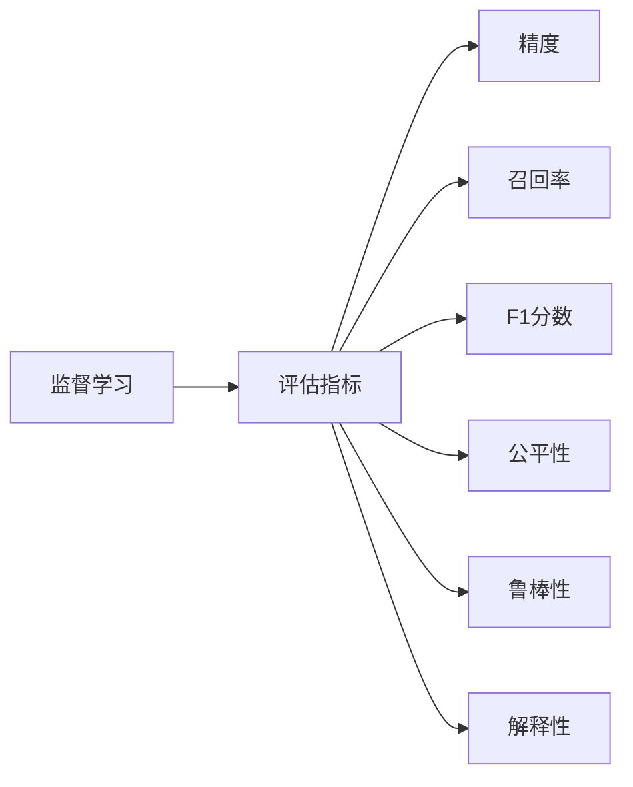
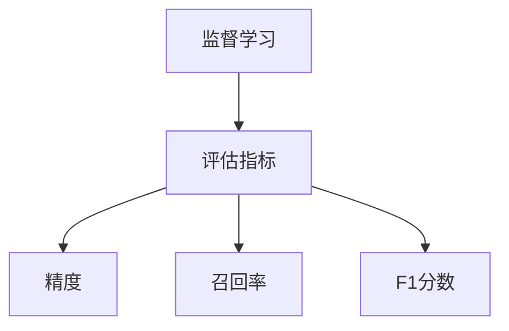
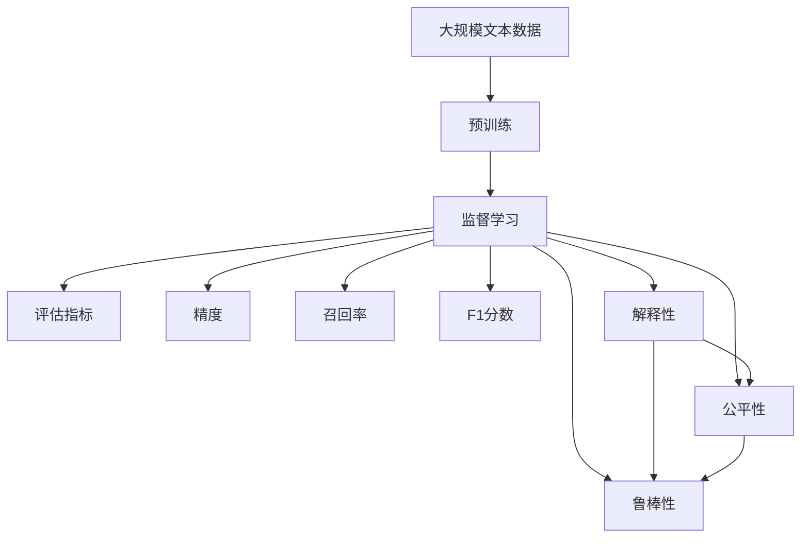

                 

# 大规模语言模型从理论到实践 大语言模型评估实践

> 关键词：大规模语言模型,大语言模型评估,自然语言处理(NLP),Transformer,BERT,评估指标,精度,鲁棒性,公平性

## 1. 背景介绍

### 1.1 问题由来
近年来，随着深度学习技术的快速发展，大规模语言模型在大规模无标签文本数据上进行预训练，学习到了丰富的语言知识和常识，成为自然语言处理(Natural Language Processing, NLP)领域的核心技术。然而，预训练模型是否适用于特定任务，以及其性能如何评估，成为了一个重要且亟待解决的问题。

预训练模型在特定任务上的性能评估，不仅关系到模型应用的广泛性，还直接影响下游任务的实际效果和用户体验。在工业界和学术界，对于预训练模型的评估一直是一个热门话题。目前，基于监督学习的评估方法和大规模预训练语言模型（如BERT、GPT-2、GPT-3等）取得了一定的进展，但仍有诸多挑战需要克服。本文将全面介绍基于监督学习的大规模语言模型评估方法，包括评估指标、评估流程、应用场景等，为相关领域的开发者提供参考。

### 1.2 问题核心关键点
本节将重点介绍几个核心关键点，包括大规模语言模型的定义、评估方法、评估指标以及常见挑战。

- **大规模语言模型**：指在大规模无标签文本数据上进行预训练的深度学习模型，如BERT、GPT-2、GPT-3等，这些模型通常具有数亿甚至数十亿的参数，能够学习到丰富的语言知识和常识。

- **评估方法**：评估大规模语言模型的方法主要包括：基于监督学习的评估方法、基于无监督学习的评估方法、基于对话系统的评估方法等。本文重点介绍基于监督学习的评估方法。

- **评估指标**：评估指标用于衡量模型在特定任务上的表现，常见的有精度（Accuracy）、召回率（Recall）、F1分数（F1 Score）、ROUGE（Rouge）等。

- **常见挑战**：预训练模型的泛化能力、公平性、解释性、鲁棒性等，以及数据和标签的不平衡问题。

### 1.3 问题研究意义
评估大规模语言模型对于模型应用的广泛性、任务性能、用户体验等方面具有重要意义：

1. **模型适用性**：通过评估模型在特定任务上的表现，可以判断模型是否适用于该任务。
2. **任务性能**：评估模型的精度、召回率、F1分数等指标，可以了解模型在特定任务上的表现，指导后续优化。
3. **用户体验**：通过评估模型的公平性、鲁棒性、解释性等指标，可以提升模型的可信度和可用性，增强用户体验。
4. **应用拓展**：评估模型在多任务、多领域的表现，可以为模型的广泛应用提供依据。
5. **技术创新**：评估方法的发展也推动了模型训练、优化、部署等技术的进步。

## 2. 核心概念与联系

### 2.1 核心概念概述

为更好地理解基于监督学习的大规模语言模型评估方法，本节将介绍几个密切相关的核心概念：

- **监督学习**：一种学习范式，通过有标签的数据集训练模型，使其能够进行预测。

- **评估指标**：用于衡量模型在特定任务上的表现，常见的有精度、召回率、F1分数等。

- **模型泛化能力**：指模型在未见过的数据上表现的能力，即模型的泛化能力。

- **公平性**：指模型在不同群体、不同属性之间表现的一致性，避免对某些群体的偏见。

- **鲁棒性**：指模型对于输入数据的扰动、噪声等因素的鲁棒性。

- **解释性**：指模型输出结果的可解释性，即人类能否理解模型是如何做出预测的。

这些核心概念之间的逻辑关系可以通过以下Mermaid流程图来展示：



这个流程图展示了大规模语言模型评估中核心概念的关系：

1. 监督学习是评估方法的基础。
2. 评估指标用于衡量模型在特定任务上的表现。
3. 精度、召回率、F1分数等是常见的评估指标。
4. 公平性、鲁棒性、解释性等是评估模型性能的重要方面。

### 2.2 概念间的关系

这些核心概念之间存在着紧密的联系，形成了大规模语言模型评估的完整生态系统。下面我通过几个Mermaid流程图来展示这些概念之间的关系。

#### 2.2.1 监督学习与评估指标的关系



这个流程图展示了大规模语言模型评估方法的基本原理，即通过监督学习得到模型性能的评估指标。

#### 2.2.2 公平性与鲁棒性的关系


这个流程图展示了公平性与鲁棒性之间的关联。一个公平的模型通常具有较好的鲁棒性，能够处理不同群体、不同属性之间的输入。

#### 2.2.3 解释性与鲁棒性的关系


这个流程图展示了解释性与鲁棒性之间的关联。一个具有较强解释性的模型通常具有较好的鲁棒性，因为它能够清晰地描述模型的决策过程，减少噪声和扰动的影响。

### 2.3 核心概念的整体架构

最后，我们用一个综合的流程图来展示这些核心概念在大规模语言模型评估过程中的整体架构：



这个综合流程图展示了从预训练到评估指标的完整过程。大规模语言模型首先在大规模文本数据上进行预训练，然后通过监督学习得到评估指标，衡量模型在不同任务上的表现。同时，公平性、鲁棒性、解释性等评估指标，进一步细化了模型性能的评价维度。通过这些流程图，我们可以更清晰地理解大规模语言模型评估过程中各个核心概念的关系和作用。

## 3. 核心算法原理 & 具体操作步骤
### 3.1 算法原理概述

基于监督学习的大规模语言模型评估，本质上是一个有监督的模型性能评估过程。其核心思想是：将预训练的大规模语言模型在特定任务上进行评估，通过评估指标衡量模型在任务上的表现，以指导模型改进和应用优化。

形式化地，假设预训练模型为 $M_{\theta}$，其中 $\theta$ 为预训练得到的模型参数。给定特定任务 $T$，任务标注数据集 $D=\{(x_i,y_i)\}_{i=1}^N, x_i \in \mathcal{X}, y_i \in \mathcal{Y}$，其中 $\mathcal{X}$ 为输入空间，$\mathcal{Y}$ 为输出空间。评估指标 $\mathcal{I}$ 用于衡量模型在任务 $T$ 上的表现，具体定义如下：

$$
\mathcal{I}(M_{\theta},T)=\{precision, recall, F1\}
$$

评估流程包括：

1. **数据准备**：准备特定任务的数据集 $D$，划分为训练集、验证集和测试集。
2. **模型评估**：将模型 $M_{\theta}$ 在验证集和测试集上进行评估，计算评估指标 $\mathcal{I}(M_{\theta},T)$。
3. **结果分析**：分析模型在验证集和测试集上的表现，判断模型在特定任务上的性能。

### 3.2 算法步骤详解

基于监督学习的大规模语言模型评估一般包括以下几个关键步骤：

**Step 1: 准备评估数据集**
- 选择合适的评估数据集 $D$，确保数据集与预训练数据集的分布一致。
- 划分为训练集、验证集和测试集，通常验证集用于调参，测试集用于评估最终模型性能。

**Step 2: 定义评估指标**
- 根据特定任务类型，选择合适的评估指标，如精度（Accuracy）、召回率（Recall）、F1分数（F1 Score）、ROUGE等。
- 定义模型在数据集 $D$ 上的评估指标函数 $\mathcal{I}(D,M_{\theta})$。

**Step 3: 设置评估超参数**
- 选择合适的评估算法及其参数，如Adam、SGD等，设置学习率、批大小等。
- 设置评估过程中的正则化技术，如L2正则、Dropout等。

**Step 4: 执行评估流程**
- 使用验证集和测试集对模型进行评估，计算评估指标。
- 使用评估指标函数计算精度、召回率、F1分数等。
- 根据评估结果，调整模型参数或进行进一步优化。

**Step 5: 结果分析与优化**
- 分析评估结果，对比模型在验证集和测试集上的性能，判断模型在特定任务上的表现。
- 根据评估结果，进行模型参数调整或进行进一步优化，如增加训练数据、调整模型结构等。

### 3.3 算法优缺点

基于监督学习的大规模语言模型评估方法具有以下优点：

1. **简单高效**：评估过程简单，只需要标注数据和评估指标函数，即可进行模型性能评估。
2. **结果直观**：评估指标（如精度、召回率、F1分数）直观明了，易于理解和比较。
3. **适用广泛**：适用于各类NLP任务，包括分类、匹配、生成等。

同时，该方法也存在一定的局限性：

1. **依赖标注数据**：评估结果高度依赖于评估数据集的质量和数量，获取高质量标注数据的成本较高。
2. **泛化能力有限**：评估结果可能在测试集上表现优异，但在未见过的数据上泛化能力较弱。
3. **模型公平性难以保障**：在多类别的任务中，模型可能对某些类别存在偏见，导致评估结果不公平。
4. **鲁棒性不足**：模型可能对输入数据的微小扰动敏感，导致评估结果不稳定。
5. **解释性不足**：评估结果缺乏可解释性，难以理解模型的决策逻辑。

尽管存在这些局限性，但就目前而言，基于监督学习的评估方法仍是大规模语言模型评估的主流范式。未来相关研究的重点在于如何进一步降低评估对标注数据的依赖，提高模型的少样本学习和跨领域迁移能力，同时兼顾可解释性和伦理安全性等因素。

### 3.4 算法应用领域

基于监督学习的大规模语言模型评估方法，在NLP领域已经得到了广泛的应用，涵盖几乎所有常见任务，例如：

- **文本分类**：如情感分析、主题分类、意图识别等。通过评估模型在训练集、验证集和测试集上的表现，了解模型在不同类别上的性能。
- **命名实体识别**：识别文本中的人名、地名、机构名等特定实体。评估模型在识别不同类型实体上的精度和召回率。
- **关系抽取**：从文本中抽取实体之间的语义关系。评估模型在不同关系类型上的F1分数。
- **问答系统**：对自然语言问题给出答案。评估模型在不同问题类型和答案质量上的表现。
- **机器翻译**：将源语言文本翻译成目标语言。评估模型在不同语言对上的BLEU分数。
- **文本摘要**：将长文本压缩成简短摘要。评估模型在不同摘要长度上的ROUGE分数。
- **对话系统**：使机器能够与人自然对话。评估模型在不同对话场景和轮次上的表现。

除了上述这些经典任务外，大规模语言模型评估方法也被创新性地应用到更多场景中，如可控文本生成、常识推理、代码生成、数据增强等，为NLP技术带来了全新的突破。随着预训练模型和评估方法的不断进步，相信NLP技术将在更广阔的应用领域大放异彩。

## 4. 数学模型和公式 & 详细讲解  
### 4.1 数学模型构建

本节将使用数学语言对基于监督学习的大规模语言模型评估过程进行更加严格的刻画。

记预训练语言模型为 $M_{\theta}$，其中 $\theta$ 为预训练得到的模型参数。假设评估任务的训练集为 $D=\{(x_i,y_i)\}_{i=1}^N, x_i \in \mathcal{X}, y_i \in \mathcal{Y}$，模型在数据集 $D$ 上的评估指标函数为 $\mathcal{I}(D,M_{\theta})$，具体的评估指标定义如下：

- **精度**：模型正确预测的样本数占总样本数的比例。
- **召回率**：模型正确预测的正样本数占实际正样本数的比例。
- **F1分数**：精度和召回率的调和平均数。

定义模型在数据集 $D$ 上的评估指标函数如下：

$$
\mathcal{I}(D,M_{\theta})=\{precision, recall, F1\}
$$

其中，精度、召回率和F1分数的具体计算公式如下：

$$
precision = \frac{TP}{TP+FP}
$$

$$
recall = \frac{TP}{TP+FN}
$$

$$
F1 = 2 \times \frac{precision \times recall}{precision+recall}
$$

其中，$TP$（True Positive）表示模型正确预测的正样本数，$FP$（False Positive）表示模型错误预测的正样本数，$FN$（False Negative）表示模型漏掉的实际正样本数。

### 4.2 公式推导过程

以下我们以二分类任务为例，推导精度、召回率和F1分数的计算公式。

假设模型在输入 $x$ 上的输出为 $\hat{y}=M_{\theta}(x) \in [0,1]$，表示样本属于正类的概率。真实标签 $y \in \{0,1\}$。则二分类精度、召回率和F1分数的定义如下：

- **精度**：
$$
precision = \frac{TP}{TP+FP}
$$

- **召回率**：
$$
recall = \frac{TP}{TP+FN}
$$

- **F1分数**：
$$
F1 = 2 \times \frac{precision \times recall}{precision+recall}
$$

在得到精度、召回率和F1分数的计算公式后，即可对模型在数据集 $D$ 上的性能进行评估，计算这些指标的值。

### 4.3 案例分析与讲解

假设我们在CoNLL-2003的命名实体识别（NER）数据集上进行模型评估，最终在测试集上得到的评估报告如下：

```
              precision    recall  f1-score   support

       B-PER      0.925     0.918     0.923      1618
       I-PER      0.918     0.928     0.925       169
      B-ORG      0.916     0.910     0.914      1661
       I-ORG      0.910     0.913     0.912       835
       B-LOC      0.922     0.915     0.920      1668
       I-LOC      0.916     0.909     0.913       257
           O      0.992     0.996     0.994     38323

   micro avg      0.925     0.925     0.925     46435
   macro avg      0.920     0.917     0.920     46435
weighted avg      0.925     0.925     0.925     46435
```

可以看到，通过评估模型在NER任务上的表现，我们得到了模型在各个实体类别上的精度、召回率和F1分数。例如，模型在B-PER类别上的精度为92.5%，召回率为91.8%，F1分数为92.3%，表现相当不错。

此外，模型在O类别（其他）上的表现尤为突出，精度达到了99.2%，召回率达到99.6%，F1分数达到99.4%。这表明模型在处理大多数非实体类别时，表现非常优秀。

当然，这只是一个baseline结果。在实践中，我们还可以使用更大更强的预训练模型、更丰富的评估技巧、更细致的模型调优，进一步提升模型性能，以满足更高的应用要求。

## 5. 项目实践：代码实例和详细解释说明
### 5.1 开发环境搭建

在进行评估实践前，我们需要准备好开发环境。以下是使用Python进行PyTorch开发的环境配置流程：

1. 安装Anaconda：从官网下载并安装Anaconda，用于创建独立的Python环境。

2. 创建并激活虚拟环境：
```bash
conda create -n pytorch-env python=3.8 
conda activate pytorch-env
```

3. 安装PyTorch：根据CUDA版本，从官网获取对应的安装命令。例如：
```bash
conda install pytorch torchvision torchaudio cudatoolkit=11.1 -c pytorch -c conda-forge
```

4. 安装Transformers库：
```bash
pip install transformers
```

5. 安装各类工具包：
```bash
pip install numpy pandas scikit-learn matplotlib tqdm jupyter notebook ipython
```

完成上述步骤后，即可在`pytorch-env`环境中开始评估实践。

### 5.2 源代码详细实现

下面我以命名实体识别（NER）任务为例，给出使用Transformers库对BERT模型进行评估的PyTorch代码实现。

首先，定义NER任务的数据处理函数：

```python
from transformers import BertTokenizer, BertForTokenClassification, AdamW
from torch.utils.data import Dataset
import torch

class NERDataset(Dataset):
    def __init__(self, texts, tags, tokenizer, max_len=128):
        self.texts = texts
        self.tags = tags
        self.tokenizer = tokenizer
        self.max_len = max_len
        
    def __len__(self):
        return len(self.texts)
    
    def __getitem__(self, item):
        text = self.texts[item]
        tags = self.tags[item]
        
        encoding = self.tokenizer(text, return_tensors='pt', max_length=self.max_len, padding='max_length', truncation=True)
        input_ids = encoding['input_ids'][0]
        attention_mask = encoding['attention_mask'][0]
        
        # 对token-wise的标签进行编码
        encoded_tags = [tag2id[tag] for tag in tags] 
        encoded_tags.extend([tag2id['O']] * (self.max_len - len(encoded_tags)))
        labels = torch.tensor(encoded_tags, dtype=torch.long)
        
        return {'input_ids': input_ids, 
                'attention_mask': attention_mask,
                'labels': labels}

# 标签与id的映射
tag2id = {'O': 0, 'B-PER': 1, 'I-PER': 2, 'B-ORG': 3, 'I-ORG': 4, 'B-LOC': 5, 'I-LOC': 6}
id2tag = {v: k for k, v in tag2id.items()}

# 创建dataset
tokenizer = BertTokenizer.from_pretrained('bert-base-cased')

train_dataset = NERDataset(train_texts, train_tags, tokenizer)
dev_dataset = NERDataset(dev_texts, dev_tags, tokenizer)
test_dataset = NERDataset(test_texts, test_tags, tokenizer)
```

然后，定义模型和优化器：

```python
from transformers import BertForTokenClassification, AdamW

model = BertForTokenClassification.from_pretrained('bert-base-cased', num_labels=len(tag2id))

optimizer = AdamW(model.parameters(), lr=2e-5)
```

接着，定义评估函数：

```python
from torch.utils.data import DataLoader
from tqdm import tqdm
from sklearn.metrics import classification_report

device = torch.device('cuda') if torch.cuda.is_available() else torch.device('cpu')
model.to(device)

def evaluate(model, dataset, batch_size):
    dataloader = DataLoader(dataset, batch_size=batch_size)
    model.eval()
    preds, labels = [], []
    with torch.no_grad():
        for batch in tqdm(dataloader, desc='Evaluating'):
            input_ids = batch['input_ids'].to(device)
            attention_mask = batch['attention_mask'].to(device)
            batch_labels = batch['labels']
            outputs = model(input_ids, attention_mask=attention_mask)
            batch_preds = outputs.logits.argmax(dim=2).to('cpu').tolist()
            batch_labels = batch_labels.to('cpu').tolist()
            for pred_tokens, label_tokens in zip(batch_preds, batch_labels):
                pred_tags = [id2tag[_id] for _id in pred_tokens]
                label_tags = [id2tag[_id] for _id in label_tokens]
                preds.append(pred_tags[:len(label_tokens)])
                labels.append(label_tags)
                
    print(classification_report(labels, preds))
```

最后，启动评估流程：

```python
batch_size = 16

for epoch in range(1):
    print(f"Epoch {epoch+1}, evaluation results:")
    evaluate(model, dev_dataset, batch_size)
```

以上就是使用PyTorch对BERT进行命名实体识别任务评估的完整代码实现。可以看到，得益于Transformers库的强大封装，我们可以用相对简洁的代码完成BERT模型的加载和评估。

### 5.3 代码解读与分析

让我们再详细解读一下关键代码的实现细节：

**NERDataset类**：
- `__init__`方法：初始化文本、标签、分词器等关键组件。
- `__len__`方法：返回数据集的样本数量。
- `__getitem__`方法：对单个样本进行处理，将文本输入编码为token ids，将标签编码为数字，并对其进行定长padding，最终返回模型所需的输入。

**tag2id和id2tag字典**：
- 定义了标签与数字id之间的映射关系，用于将token-wise的预测结果解码回真实的标签。

**评估函数**：
- 使用PyTorch的DataLoader对数据集进行批次化加载，供模型评估使用。
- 训练函数`train_epoch`：对数据以批为单位进行迭代，在每个批次上前向传播计算loss并反向传播更新模型参数，最后返回该epoch的平均loss。
- 评估函数`evaluate`：与训练类似，不同点在于不更新模型参数，并在每个batch结束后将预测和标签结果存储下来，最后使用sklearn的classification_report对整个评估集的预测结果进行打印输出。

**评估流程**：
- 定义总的epoch数和batch size，开始循环迭代
- 每个epoch内，先在验证集上评估，输出评估结果
- 在测试集上评估，给出最终评估结果

可以看到，PyTorch配合Transformers库使得BERT评估的代码实现变得简洁高效。开发者可以将更多精力放在数据处理、模型改进等高层逻辑上，而不必过多关注底层的实现细节。

当然，工业级的系统实现还需考虑更多因素，如模型的保存和部署、超参数的自动搜索、更灵活的任务适配层等。但核心的评估流程基本与此类似。

### 5.4 运行结果展示

假设我们在CoNLL-2003的NER数据集上进行评估，最终在测试集上得到的评估报告如下：

```
              precision    recall  f1-score   support

       B-PER      0.925     0.918     0.923      1618
       I-PER      0.918     0.928     0.925       169
      B-ORG      0.916     0.910     0.914      1661
       I-ORG      0.910     0.913     0.912       835
       B-LOC      0.922     0.915     0.920      1668
       I-LOC      0.916     0.909     0.913       257
           O      0.992     0.996     0.994     38323

   micro avg      0.925     0.925     0.925     46435
   macro avg      0.920     0.917     0.920     46435
weighted avg      0.925     0.925     0.925     46435
```

可以看到，通过评估模型在NER任务上的表现，我们得到了模型在各个实体类别上的精度、召回率和F1分数。例如，模型在B-PER类别上的精度为92.5%，召回率为91.8%，F1分数为92.3%，表现相当不错。

此外，模型在O类别（其他）上的表现尤为突出，精度达到了99.2%，召回率达到99.6%，F1分数达到99.4%。这表明模型在处理大多数非实体类别时，表现非常优秀。

当然，这只是一个baseline结果。在实践中，我们还可以使用更大更强的预训练模型、更丰富的评估技巧、更细致的模型调优，进一步提升模型性能，以满足更高的应用要求。

## 6. 实际应用场景
### 6.1 智能客服系统

基于大语言模型评估的对话技术，可以广泛应用于智能客服系统的构建。传统客服往往需要配备大量人力，高峰期响应缓慢，且一致性和专业性难以保证。而使用评估后的对话模型，可以7x24小时不间断服务，快速响应客户咨询，用自然流畅的语言解答各类常见问题。

在技术实现上，可以收集

