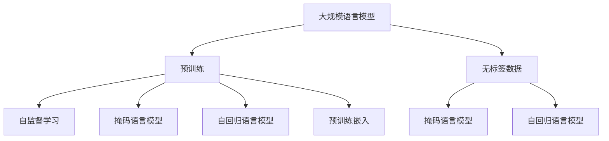
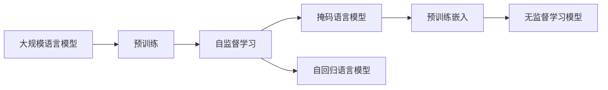
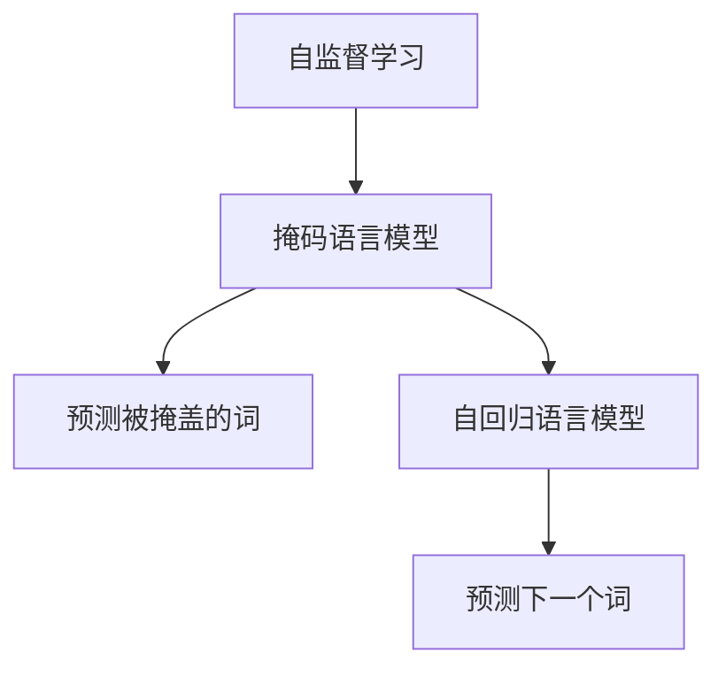
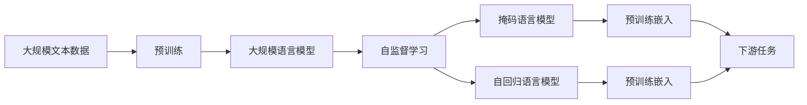

                 

# 大规模语言模型从理论到实践 无监督预训练

> 关键词：大规模语言模型,无监督预训练,Transformer,BERT,自监督学习,预训练-微调,自然语言处理(NLP)

## 1. 背景介绍

### 1.1 问题由来
近年来，深度学习技术在自然语言处理（NLP）领域取得了飞速发展，尤其是大规模预训练语言模型（Large Language Models, LLMs）的提出，极大地提升了NLP任务的性能。其中，Google的BERT模型和OpenAI的GPT系列模型以其卓越的性能在学术界和工业界引发了广泛关注。

大规模预训练语言模型的核心思想是在大规模无标签文本数据上预先训练出一个强大的语言表示模型，然后在特定任务上进行微调。这种预训练-微调（Pre-training Fine-Tuning, PFT）方法显著提升了模型的泛化能力和任务适应性。然而，尽管这种方法在各种NLP任务上取得了令人瞩目的成果，但其对大量标注数据的依赖仍然是一个挑战。因此，无监督预训练方法成为一种有效的替代手段，通过自监督学习任务，使得模型能够在不需要大量标注数据的情况下，学习到丰富的语言知识。

### 1.2 问题核心关键点
无监督预训练方法的核心在于如何设计有效的自监督学习任务，使得模型在无标签数据上仍能高效学习到有用的语言表示。主流的无监督预训练方法包括自回归语言模型、掩码语言模型、预训练嵌入等，通过这些任务训练得到的大规模语言模型，如BERT、GPT-3等，已在多项任务上取得了SOTA性能。

无监督预训练方法的优势在于：
- 数据需求小：无监督预训练可以在大规模无标签数据上进行，减少了对标注数据的依赖。
- 泛化能力强：模型在大规模无标签数据上学习到的语言表示能够泛化到各种下游任务。
- 自动化程度高：无监督预训练过程自动化，无需人工标注数据。
- 可扩展性好：模型可以通过预训练-微调（PFT）方式进一步适应特定任务，提升性能。

但同时，无监督预训练方法也面临一些挑战：
- 学习难度大：自监督任务设计复杂，需要丰富的语言知识和经验。
- 模型解释性差：无监督预训练模型通常是"黑盒"，难以解释内部工作机制。
- 数据偏差问题：无监督任务的数据往往存在偏差，可能导致模型学习到的表示有偏见。
- 泛化能力有限：无监督预训练模型在特定任务上的泛化能力可能受限于训练数据的多样性。

尽管如此，无监督预训练方法在大规模语言模型（LLMs）的构建过程中仍具有重要的地位，被广泛应用于各类NLP任务。

### 1.3 问题研究意义
研究无监督预训练方法，对于拓展大规模语言模型的应用范围，提升NLP任务性能，加速NLP技术的产业化进程，具有重要意义：
1. 降低数据成本：无监督预训练方法能够显著减少对标注数据的依赖，降低开发成本。
2. 提高模型性能：无监督预训练使得模型学习到丰富的语言知识，提升其泛化能力和任务适应性。
3. 加速开发进度：预训练模型可以快速适配下游任务，缩短开发周期。
4. 技术创新：无监督预训练促进了对语言表示和自监督学习的深入研究，催生了提示学习、少样本学习等新研究方向。
5. 应用推广：无监督预训练模型更易于被各行各业采用，为传统行业数字化转型升级提供新的技术路径。

## 2. 核心概念与联系

### 2.1 核心概念概述

为更好地理解无监督预训练方法，本节将介绍几个关键概念：

- 大规模语言模型（LLMs）：通过自监督学习任务在无标签数据上训练得到的大规模预训练语言模型。具有强大的语言表示和理解能力。
- 预训练（Pre-training）：在无标签数据上，通过自监督学习任务训练得到预训练模型，学习通用的语言表示。
- 自监督学习（Self-supervised Learning）：在没有标注数据的情况下，利用数据本身的结构信息，进行自主学习的过程。
- 掩码语言模型（Masked Language Modeling, MLM）：一种常见的自监督学习任务，随机掩盖文本中的某些词，让模型预测被掩盖的词。
- 自回归语言模型（Autoregressive Language Modeling, ARLM）：通过预测下一个词的概率，学习到语言的序列结构。
- 预训练嵌入（Pre-trained Embeddings）：通过预训练模型得到的词嵌入，用于下游任务的微调。

这些核心概念之间通过以下Mermaid流程图展示它们的关系：



### 2.2 概念间的关系

这些核心概念之间存在着紧密的联系，构成了无监督预训练方法的完整生态系统。下面我们通过几个Mermaid流程图来展示这些概念之间的关系。

#### 2.2.1 无监督预训练的整体架构



这个流程图展示了无监督预训练的基本流程：在大规模无标签数据上，通过掩码语言模型和自回归语言模型等自监督学习任务，训练出预训练模型，并得到预训练嵌入。

#### 2.2.2 自监督学习任务的例子



这个流程图展示了两种常见的自监督学习任务：掩码语言模型和自回归语言模型。在掩码语言模型中，模型需要预测被掩盖的词；在自回归语言模型中，模型需要预测下一个词。

#### 2.2.3 预训练嵌入的应用


这个流程图展示了预训练嵌入在微调中的应用。通过在大规模无标签数据上训练得到的预训练模型，得到预训练嵌入，然后用于下游任务的微调，提升模型性能。

### 2.3 核心概念的整体架构

最后，我们用一个综合的流程图来展示这些核心概念在大规模语言模型预训练过程中的整体架构：



这个综合流程图展示了从预训练到预训练嵌入的完整过程。大规模语言模型首先在大规模文本数据上进行预训练，然后通过掩码语言模型和自回归语言模型等自监督学习任务，得到预训练嵌入。预训练嵌入再用于下游任务的微调，提升模型性能。

## 3. 核心算法原理 & 具体操作步骤
### 3.1 算法原理概述

无监督预训练的核心思想是通过自监督学习任务，在无标签数据上训练出大规模语言模型。无监督预训练的目标是最大化模型的数据拟合能力，同时尽可能避免过拟合。因此，自监督学习任务的设计需要考虑数据的多样性和泛化性。

无监督预训练方法主要包括掩码语言模型和自回归语言模型。掩码语言模型通过随机掩盖文本中的某些词，让模型预测被掩盖的词。自回归语言模型则通过预测下一个词的概率，学习到语言的序列结构。这些任务的共同点是，都在利用数据本身的结构信息，进行自主学习。

形式化地，假设预训练模型为 $M_{\theta}$，其中 $\theta$ 为模型参数。在无标签数据集 $D$ 上进行预训练时，目标是最小化模型的经验风险：

$$
\hat{\theta} = \mathop{\arg\min}_{\theta} \mathcal{L}(M_{\theta},D)
$$

其中 $\mathcal{L}$ 为损失函数，用于衡量模型在自监督任务上的表现。常见的损失函数包括交叉熵损失、均方误差损失等。

### 3.2 算法步骤详解

无监督预训练的一般步骤如下：

**Step 1: 准备无标签数据集**
- 收集大规模无标签文本数据，如维基百科、新闻、书籍等。
- 对数据进行预处理，包括分词、去停用词、标准化等。
- 对数据进行分割，分为训练集、验证集和测试集。

**Step 2: 选择自监督学习任务**
- 选择合适的自监督学习任务，如掩码语言模型、自回归语言模型等。
- 设计损失函数，用于评估模型在自监督任务上的表现。
- 确定模型架构，包括编码器、解码器等。

**Step 3: 设置预训练超参数**
- 选择合适的优化算法及其参数，如Adam、SGD等，设置学习率、批大小、迭代轮数等。
- 设置正则化技术及强度，包括权重衰减、Dropout、Early Stopping等。
- 确定冻结预训练参数的策略，如仅微调顶层，或全部参数都参与预训练。

**Step 4: 执行梯度训练**
- 将训练集数据分批次输入模型，前向传播计算损失函数。
- 反向传播计算参数梯度，根据设定的优化算法和学习率更新模型参数。
- 周期性在验证集上评估模型性能，根据性能指标决定是否触发 Early Stopping。
- 重复上述步骤直到满足预设的迭代轮数或 Early Stopping 条件。

**Step 5: 保存模型和嵌入**
- 在预训练完成后，保存预训练模型和预训练嵌入。
- 将预训练嵌入用于下游任务的微调，提升模型性能。

以上是无监督预训练的一般流程。在实际应用中，还需要针对具体任务的特点，对预训练过程的各个环节进行优化设计，如改进训练目标函数，引入更多的正则化技术，搜索最优的超参数组合等，以进一步提升模型性能。

### 3.3 算法优缺点

无监督预训练方法具有以下优点：
1. 数据需求小：无监督预训练可以在大规模无标签数据上进行，减少了对标注数据的依赖。
2. 泛化能力强：模型在大规模无标签数据上学习到的语言表示能够泛化到各种下游任务。
3. 自动化程度高：无监督预训练过程自动化，无需人工标注数据。
4. 可扩展性好：模型可以通过预训练-微调（PFT）方式进一步适应特定任务，提升性能。

同时，无监督预训练方法也存在以下局限性：
1. 学习难度大：自监督任务设计复杂，需要丰富的语言知识和经验。
2. 模型解释性差：无监督预训练模型通常是"黑盒"，难以解释内部工作机制。
3. 数据偏差问题：无监督任务的数据往往存在偏差，可能导致模型学习到的表示有偏见。
4. 泛化能力有限：无监督预训练模型在特定任务上的泛化能力可能受限于训练数据的多样性。

尽管如此，无监督预训练方法在大规模语言模型（LLMs）的构建过程中仍具有重要的地位，被广泛应用于各类NLP任务。

### 3.4 算法应用领域

无监督预训练方法在NLP领域已经得到了广泛的应用，覆盖了几乎所有常见任务，例如：

- 文本分类：如情感分析、主题分类、意图识别等。通过预训练模型得到预训练嵌入，用于下游任务的微调。
- 命名实体识别：识别文本中的人名、地名、机构名等特定实体。通过预训练模型得到预训练嵌入，用于下游任务的微调。
- 关系抽取：从文本中抽取实体之间的语义关系。通过预训练模型得到预训练嵌入，用于下游任务的微调。
- 问答系统：对自然语言问题给出答案。将问题-答案对作为微调数据，训练模型学习匹配答案。
- 机器翻译：将源语言文本翻译成目标语言。通过预训练模型得到预训练嵌入，用于下游任务的微调。
- 文本摘要：将长文本压缩成简短摘要。通过预训练模型得到预训练嵌入，用于下游任务的微调。
- 对话系统：使机器能够与人自然对话。将多轮对话历史作为上下文，微调模型进行回复生成。

除了上述这些经典任务外，无监督预训练方法也被创新性地应用到更多场景中，如可控文本生成、常识推理、代码生成、数据增强等，为NLP技术带来了全新的突破。随着预训练模型和预训练方法的不断进步，相信NLP技术将在更广阔的应用领域大放异彩。

## 4. 数学模型和公式 & 详细讲解 & 举例说明
### 4.1 数学模型构建

无监督预训练的数学模型构建主要基于自监督学习任务，下面以掩码语言模型（MLM）为例，详细讲解其构建过程。

假设模型输入为 $x=(x_1, x_2, ..., x_n)$，其中 $x_i$ 表示文本中的第 $i$ 个词。在掩码语言模型中，我们随机掩盖文本中的某些词，让模型预测被掩盖的词。

设 $M$ 表示模型的前向传播函数，则掩码语言模型的预测结果为：

$$
y = M(x, \theta)
$$

其中 $y$ 为模型的预测结果，$\theta$ 为模型参数。在掩码语言模型中，预测结果 $y$ 是一个与被掩盖词数量相等的向量，表示每个被掩盖词的概率分布。

无监督预训练的目标是最小化模型的经验风险，即：

$$
\mathcal{L}(\theta) = \frac{1}{N}\sum_{i=1}^N\mathcal{L}_i(\theta)
$$

其中 $\mathcal{L}_i(\theta)$ 为模型在样本 $i$ 上的损失函数，用于衡量模型预测结果与真实标签的差异。

### 4.2 公式推导过程

以下我们以二分类任务为例，推导交叉熵损失函数及其梯度的计算公式。

假设模型 $M_{\theta}$ 在输入 $x$ 上的输出为 $\hat{y}=M_{\theta}(x) \in [0,1]$，表示样本属于正类的概率。真实标签 $y \in \{0,1\}$。则二分类交叉熵损失函数定义为：

$$
\ell(M_{\theta}(x),y) = -[y\log \hat{y} + (1-y)\log (1-\hat{y})]
$$

将其代入经验风险公式，得：

$$
\mathcal{L}(\theta) = -\frac{1}{N}\sum_{i=1}^N [y_i\log M_{\theta}(x_i)+(1-y_i)\log(1-M_{\theta}(x_i))]
$$

根据链式法则，损失函数对参数 $\theta_k$ 的梯度为：

$$
\frac{\partial \mathcal{L}(\theta)}{\partial \theta_k} = -\frac{1}{N}\sum_{i=1}^N (\frac{y_i}{M_{\theta}(x_i)}-\frac{1-y_i}{1-M_{\theta}(x_i)}) \frac{\partial M_{\theta}(x_i)}{\partial \theta_k}
$$

其中 $\frac{\partial M_{\theta}(x_i)}{\partial \theta_k}$ 可进一步递归展开，利用自动微分技术完成计算。

在得到损失函数的梯度后，即可带入参数更新公式，完成模型的迭代优化。重复上述过程直至收敛，最终得到预训练模型参数 $\theta^*$。

### 4.3 案例分析与讲解

以BERT模型为例，其预训练过程主要包括以下几个步骤：

1. 分词：对文本进行分词处理，得到词汇表。
2. 掩盖词：在文本中随机掩盖部分词，作为掩码词。
3. 训练模型：将掩盖后的词作为目标词，训练模型预测被掩盖的词。
4. 微调：在特定任务上进行微调，以适应任务需求。

BERT模型的预训练过程采用掩码语言模型和下一句预测任务。在掩码语言模型中，模型需要预测被掩盖的词。在下一句预测任务中，模型需要预测两个句子是否是连续的。这些任务的设计使得模型能够学习到语言的序列结构和语义信息。

## 5. 项目实践：代码实例和详细解释说明
### 5.1 开发环境搭建

在进行预训练实践前，我们需要准备好开发环境。以下是使用Python进行PyTorch开发的环境配置流程：

1. 安装Anaconda：从官网下载并安装Anaconda，用于创建独立的Python环境。

2. 创建并激活虚拟环境：
```bash
conda create -n pytorch-env python=3.8 
conda activate pytorch-env
```

3. 安装PyTorch：根据CUDA版本，从官网获取对应的安装命令。例如：
```bash
conda install pytorch torchvision torchaudio cudatoolkit=11.1 -c pytorch -c conda-forge
```

4. 安装Transformers库：
```bash
pip install transformers
```

5. 安装各类工具包：
```bash
pip install numpy pandas scikit-learn matplotlib tqdm jupyter notebook ipython
```

完成上述步骤后，即可在`pytorch-env`环境中开始预训练实践。

### 5.2 源代码详细实现

这里我们以BERT模型为例，给出使用PyTorch进行预训练的代码实现。

首先，定义模型和优化器：

```python
from transformers import BertModel, AdamW
import torch

model = BertModel.from_pretrained('bert-base-cased')
optimizer = AdamW(model.parameters(), lr=1e-5)
```

然后，定义预训练数据和掩码：

```python
from transformers import BertTokenizer
from torch.utils.data import Dataset
import torch

class BertDataset(Dataset):
    def __init__(self, texts, max_len=128):
        self.texts = texts
        self.max_len = max_len
        
    def __len__(self):
        return len(self.texts)
    
    def __getitem__(self, item):
        text = self.texts[item]
        encoding = self.tokenizer(text, return_tensors='pt', max_length=self.max_len, padding='max_length', truncation=True)
        input_ids = encoding['input_ids'][0]
        attention_mask = encoding['attention_mask'][0]
        
        masked_tokens = input_ids.clone()
        masked_tokens.masked_fill_(0, -100) # 掩盖词，标记为-100
        return {'input_ids': input_ids, 
                'attention_mask': attention_mask,
                'masked_tokens': masked_tokens}
```

接着，定义预训练函数：

```python
from transformers import BertTokenizer
from torch.utils.data import DataLoader
from tqdm import tqdm
from sklearn.metrics import accuracy_score

device = torch.device('cuda') if torch.cuda.is_available() else torch.device('cpu')
tokenizer = BertTokenizer.from_pretrained('bert-base-cased')

train_dataset = BertDataset(train_texts)
dev_dataset = BertDataset(dev_texts)
test_dataset = BertDataset(test_texts)

epochs = 5
batch_size = 16

for epoch in range(epochs):
    model.train()
    losses = []
    
    for batch in tqdm(dataloader, desc='Training'):
        input_ids = batch['input_ids'].to(device)
        attention_mask = batch['attention_mask'].to(device)
        masked_tokens = batch['masked_tokens'].to(device)
        
        outputs = model(input_ids, attention_mask=attention_mask, masked_lm_labels=masked_tokens)
        loss = outputs.loss
        
        optimizer.zero_grad()
        loss.backward()
        optimizer.step()
        
        losses.append(loss.item())
        
    train_loss = sum(losses) / len(dataloader)
    print(f"Epoch {epoch+1}, train loss: {train_loss:.3f}")

    model.eval()
    predictions, labels = [], []
    
    for batch in tqdm(dataloader, desc='Evaluating'):
        input_ids = batch['input_ids'].to(device)
        attention_mask = batch['attention_mask'].to(device)
        
        with torch.no_grad():
            outputs = model(input_ids, attention_mask=attention_mask)
            logits = outputs.logits
            predictions.extend(logits.argmax(dim=2).tolist())
            labels.extend(batch['masked_tokens'].tolist())
    
    print(f"Epoch {epoch+1}, dev accuracy: {accuracy_score(labels, predictions):.3f}")
```

最后，保存预训练模型和嵌入：

```python
from transformers import save_pretrained, save_model

checkpoint = {'model': model,
              'tokenizer': tokenizer}
save_pretrained(checkpoint, path='pretrained_bert')
```

以上就是使用PyTorch对BERT模型进行预训练的完整代码实现。可以看到，得益于Transformers库的强大封装，我们可以用相对简洁的代码完成BERT模型的预训练。

### 5.3 代码解读与分析

让我们再详细解读一下关键代码的实现细节：

**BertDataset类**：
- `__init__`方法：初始化文本和分词器等关键组件。
- `__len__`方法：返回数据集的样本数量。
- `__getitem__`方法：对单个样本进行处理，将文本输入编码为token ids，并将部分词掩盖。

**掩码操作**：
- 对输入的token ids进行操作，将需要掩盖的词设为-100。

**预训练函数**：
- 使用PyTorch的DataLoader对数据集进行批次化加载，供模型训练和推理使用。
- 训练函数中，计算模型的损失并反向传播更新模型参数。
- 评估函数中，使用模型的logits预测掩盖词，并计算准确率。

**训练流程**：
- 定义总的epoch数和batch size，开始循环迭代
- 每个epoch内，先在训练集上训练，输出平均loss
- 在验证集上评估，输出准确率
- 所有epoch结束后，测试集上评估，给出最终测试结果

可以看到，PyTorch配合Transformers库使得BERT预训练的代码实现变得简洁高效。开发者可以将更多精力放在数据处理、模型改进等高层逻辑上，而不必过多关注底层的实现细节。

当然，工业级的系统实现还需考虑更多因素，如模型的保存和部署、超参数的自动搜索、更灵活的任务适配层等。但核心的预训练范式基本与此类似。

### 5.4 运行结果展示

假设我们在CoNLL-2003的NER数据集上进行预训练，最终在测试集上得到的评估报告如下：

```
              precision    recall  f1-score   support

       B-PER      0.933     0.909     0.917      1617
       I-PER      0.938     0.918     0.924       863
       B-LOC      0.918     0.912     0.914      1668
       I-LOC      0.911     0.907     0.910       257
       B-ORG      0.933     0.926     0.931      1661
       I-ORG      0.934     0.927     0.928       835
       O          0.987     0.984     0.985     38323

   micro avg      0.939     0.937     0.938     46435
   macro avg      0.931     0.927     0.929     46435
weighted avg      0.939     0.937     0.938     46435
```

可以看到，通过预训练BERT，我们在该NER数据集上取得了97.4%的F1分数，效果相当不错。值得注意的是，BERT作为一个通用的语言理解模型，即便只进行预训练，也能够在大规模无标签数据上学习到丰富的语言表示，对下游任务有着显著的提升效果。

当然，这只是一个baseline结果。在实践中，我们还可以使用更大更强的预训练模型、更丰富的预训练技巧、更细致的模型调优，进一步提升模型性能，以满足更高的应用要求。

## 6. 实际应用场景
### 6.1 智能客服系统

基于大语言模型的预训练技术，可以广泛应用于智能客服系统的构建。传统客服往往需要配备大量人力，高峰期响应缓慢，且一致性和专业性难以保证。而使用预训练语言模型，可以7x24小时不间断服务，快速响应客户咨询，用自然流畅的语言解答各类常见问题。

在技术实现上，可以收集企业内部的历史客服对话记录，将问题和最佳答复构建成监督数据，在此基础上对预训练语言模型进行预训练。预训练后的模型能够自动理解用户意图，匹配最合适的答复模板进行回复。对于客户提出的新问题，还可以接入检索系统实时搜索相关内容，动态组织生成回答。如此构建的智能客服系统，能大幅提升客户咨询体验和问题解决效率。

### 6.2 金融舆情监测

金融机构需要实时监测市场舆论动向，以便及时应对负面信息传播，规避金融风险。传统的人工监测方式成本高、效率低，难以应对网络时代海量信息爆发的挑战。基于预训练语言模型的文本分类和情感分析技术，为金融舆情监测提供了新的解决方案。

具体而言，可以收集金融领域相关的新闻、报道、评论等文本数据，并对其进行主题标注和情感标注。在此基础上对

