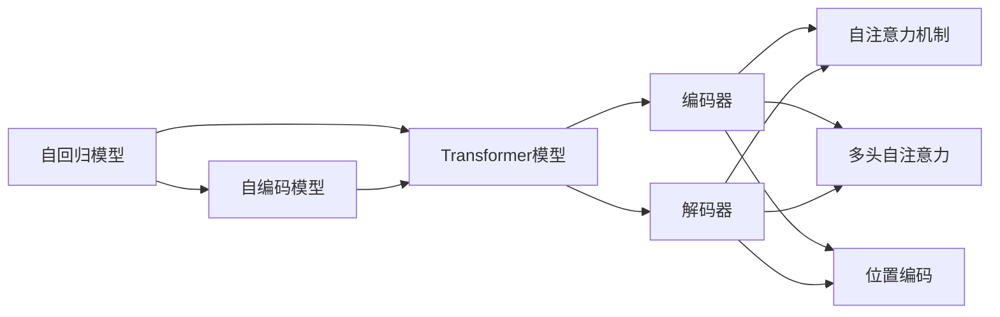
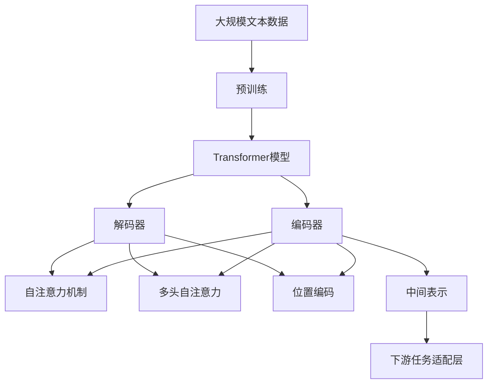

                 

# 大规模语言模型从理论到实践 编码器和解码器结构

> 关键词：大规模语言模型,自回归模型,自编码模型,Transformer,编码器,解码器

## 1. 背景介绍

近年来，随着深度学习技术的飞速发展，大规模语言模型（Large Language Models，LLMs）成为了自然语言处理（NLP）领域的一大突破。这类模型通过在大规模无标签文本数据上进行自监督预训练，学习到丰富的语言知识和常识，能够进行语言生成、文本分类、命名实体识别等多种NLP任务，展现出了强大的语言理解和生成能力。其中，Transformer模型是预训练语言模型的代表，通过自注意力机制和多层编码器-解码器结构，极大地提升了模型在语言处理任务中的性能。

本文旨在通过深入剖析编码器和解码器结构，探索其在语言模型中的应用原理和操作步骤，为大规模语言模型的开发和优化提供理论指导和实践经验。

## 2. 核心概念与联系

### 2.1 核心概念概述

为了更好地理解编码器和解码器在大规模语言模型中的应用，本节将详细介绍几个关键概念：

- **自回归模型（Autoregressive Models）**：自回归模型是一种生成模型，其预测结果依赖于之前的历史数据。常见的自回归模型包括RNN、LSTM和GRU等。

- **自编码模型（Autoencoder Models）**：自编码模型是一种无监督学习模型，通过学习输入和输出数据的分布，实现数据的压缩与重建。常见的自编码模型包括PCA、VAE和GAN等。

- **Transformer模型**：Transformer模型是一种基于注意力机制的神经网络模型，通过并行计算和自注意力机制，实现高效的序列建模。Transformer模型广泛应用于NLP任务中。

- **编码器（Encoder）**：编码器是大规模语言模型中的一个重要组成部分，用于将输入序列映射到一个中间表示。Transformer模型中，编码器由多层自注意力机制构成。

- **解码器（Decoder）**：解码器也是大规模语言模型中的一个重要组成部分，用于根据中间表示生成输出序列。Transformer模型中，解码器同样由多层自注意力机制构成。

- **自注意力机制（Self-Attention Mechanism）**：自注意力机制是Transformer模型的核心，通过计算输入序列中各位置的相似度，实现信息在序列中的传播和融合。

- **多头自注意力（Multi-Head Self-Attention）**：多头自注意力机制通过同时计算多组注意力权重，提高模型的表达能力和泛化能力。

- **位置编码（Positional Encoding）**：位置编码用于在Transformer模型中处理输入序列的位置信息，确保模型能够正确地理解序列中的位置依赖关系。

这些概念之间存在紧密的联系，共同构成了大规模语言模型的基础架构。通过这些概念的深入理解，我们可以更好地把握语言模型的工作原理和优化方向。

### 2.2 概念间的关系

这些核心概念之间的关系可以通过以下Mermaid流程图来展示：



这个流程图展示了自回归模型、自编码模型和Transformer模型之间的联系，以及编码器、解码器、自注意力机制、多头自注意力和位置编码在大规模语言模型中的作用和关系。

### 2.3 核心概念的整体架构

最后，我们用一个综合的流程图来展示这些核心概念在大规模语言模型中的整体架构：



这个综合流程图展示了从预训练到下游任务适配的完整过程。大规模语言模型首先在大规模文本数据上进行预训练，然后通过编码器和解码器将输入序列映射到中间表示，最后通过下游任务适配层进行特定任务的优化。

## 3. 核心算法原理 & 具体操作步骤
### 3.1 算法原理概述

大规模语言模型的核心算法原理是基于自注意力机制和多层编码器-解码器结构，通过并行计算和自注意力机制，实现高效的序列建模和信息传播。其具体步骤如下：

1. **输入序列预处理**：对输入序列进行分词、词嵌入等预处理操作，转换为模型可处理的数值形式。

2. **编码器自注意力计算**：通过多头自注意力机制，计算输入序列中各位置的相似度，实现信息在序列中的传播和融合。

3. **编码器层更新**：通过多层编码器，逐步更新中间表示，提高模型的表达能力和泛化能力。

4. **解码器自注意力计算**：通过多头自注意力机制，计算解码器中各位置的相似度，实现信息在序列中的传播和融合。

5. **解码器层更新**：通过多层解码器，逐步生成输出序列，最终输出预测结果。

6. **模型输出**：通过下游任务适配层，将模型输出与任务标签进行匹配，计算损失函数，并根据损失函数进行模型更新。

### 3.2 算法步骤详解

下面将详细讲解大规模语言模型编码器和解码器结构的具体操作步骤：

**Step 1: 输入序列预处理**

输入序列的预处理主要包括分词和词嵌入。对于自然语言文本，需要先进行分词操作，将文本分割成单词或词组。分词后，使用词嵌入技术将每个单词或词组映射为向量形式，即词嵌入矩阵。常用的词嵌入模型有Word2Vec、GloVe和FastText等。

**Step 2: 编码器自注意力计算**

编码器自注意力计算分为以下几个步骤：

1. 对输入序列进行分块，计算注意力权重。
2. 将注意力权重与输入序列中的每个位置进行拼接，生成注意力向量。
3. 将注意力向量和输入序列进行线性变换，生成中间表示。
4. 对中间表示进行残差连接和层归一化，更新编码器层。
5. 对编码器层进行多轮更新，逐步生成中间表示。

**Step 3: 解码器自注意力计算**

解码器自注意力计算与编码器类似，但略有差异。解码器自注意力计算需要引入前一时刻的输出作为额外输入，即输入序列。其计算步骤与编码器类似，但需要在注意力计算中加入前一时刻的输出。

**Step 4: 解码器层更新**

解码器层更新分为以下几个步骤：

1. 对解码器中间表示进行线性变换，生成隐藏状态。
2. 将隐藏状态与前一时刻的输出进行拼接，生成预测结果。
3. 将预测结果进行softmax操作，计算每个词汇的概率分布。
4. 对预测结果进行采样或取概率最大的词汇，生成下一时刻的输出。

**Step 5: 模型输出**

模型输出主要通过下游任务适配层进行。适配层根据具体任务设计，将模型输出与任务标签进行匹配，计算损失函数。常见的适配层包括线性分类器、回归器、序列生成器等。

### 3.3 算法优缺点

大规模语言模型的编码器和解码器结构具有以下优点：

1. 高效的并行计算：通过自注意力机制，大规模语言模型可以实现高效的并行计算，提高模型训练和推理速度。
2. 强大的表达能力：多层编码器和解码器结构，可以逐步生成和更新中间表示，提高模型的表达能力和泛化能力。
3. 灵活的序列建模：通过多头自注意力机制，模型可以灵活处理输入序列中的位置依赖关系，提高模型的建模能力。

同时，大规模语言模型的编码器和解码器结构也存在一些缺点：

1. 计算资源消耗大：由于模型参数量较大，大规模语言模型的计算资源消耗大，需要高性能的硬件设备支持。
2. 模型复杂度高：多层编码器和解码器结构，导致模型复杂度高，训练和推理过程较为复杂。
3. 泛化能力不足：由于模型主要依赖大规模无标签数据进行预训练，对于特定任务的数据集，模型的泛化能力可能不足，需要额外的微调或适配。

### 3.4 算法应用领域

大规模语言模型的编码器和解码器结构已经广泛应用于各种NLP任务，包括文本分类、命名实体识别、文本生成、机器翻译等。在实际应用中，编码器和解码器结构可以灵活地适应不同的任务需求，提升模型的性能和效果。

## 4. 数学模型和公式 & 详细讲解 & 举例说明

### 4.1 数学模型构建

本文以Transformer模型为例，详细讲解其数学模型构建过程。假设输入序列长度为 $L$，词汇表大小为 $V$，词嵌入维度为 $d_{emb}$，编码器层数为 $n$，解码器层数为 $m$。

设输入序列为 $x = (x_1, x_2, ..., x_L)$，输出序列为 $y = (y_1, y_2, ..., y_L)$，编码器输出为 $H = (h_1, h_2, ..., h_L)$，解码器输出为 $G = (g_1, g_2, ..., g_L)$。

编码器和解码器的数学模型可以表示为：

$$
H = \text{Encoder}(x)
$$

$$
G = \text{Decoder}(x, y)
$$

其中 $\text{Encoder}$ 和 $\text{Decoder}$ 分别表示编码器和解码器。

### 4.2 公式推导过程

下面将详细推导Transformer模型中编码器和解码器的数学公式。

**编码器自注意力计算公式**

设 $q = Q(W_Q x)$，$k = K(W_K x)$，$v = V(W_V x)$，则编码器的自注意力计算公式为：

$$
\alpha = \frac{q k^T}{\sqrt{d_{emb}}}
$$

$$
s = \alpha v
$$

$$
h_i = \text{softmax}(\alpha) v
$$

其中 $W_Q, W_K, W_V$ 分别为编码器的查询、键和值线性变换矩阵，$\text{softmax}$ 表示softmax操作，$s$ 表示注意力权重向量。

**解码器自注意力计算公式**

设 $q = Q(W_Q x)$，$k = K(W_K x)$，$v = V(W_V x)$，则解码器的自注意力计算公式为：

$$
\alpha = \frac{q k^T}{\sqrt{d_{emb}}}
$$

$$
s = \alpha v
$$

$$
g_i = \text{softmax}(\alpha) v
$$

其中 $W_Q, W_K, W_V$ 分别为解码器的查询、键和值线性变换矩阵，$\text{softmax}$ 表示softmax操作，$s$ 表示注意力权重向量。

**编码器层更新公式**

设 $h_i = \text{MLP}(h_i)$，则编码器层更新公式为：

$$
h_i = \text{LayerNorm}(h_i + \text{Residual}(h_i))
$$

其中 $\text{MLP}$ 表示多层感知器，$\text{LayerNorm}$ 表示层归一化，$\text{Residual}$ 表示残差连接。

**解码器层更新公式**

设 $g_i = \text{MLP}(g_i)$，则解码器层更新公式为：

$$
g_i = \text{LayerNorm}(g_i + \text{Residual}(g_i))
$$

其中 $\text{MLP}$ 表示多层感知器，$\text{LayerNorm}$ 表示层归一化，$\text{Residual}$ 表示残差连接。

**模型输出公式**

设 $y = \text{Decoder}(x, y)$，则模型输出的计算公式为：

$$
y_i = \text{softmax}(\text{Decoder}(x, y_{i-1}))
$$

其中 $y_i$ 表示第 $i$ 个时刻的输出，$\text{Decoder}$ 表示解码器，$\text{softmax}$ 表示softmax操作。

### 4.3 案例分析与讲解

以机器翻译为例，分析Transformer模型中编码器和解码器结构的具体应用。假设输入序列为英文句子 "I love coding"，输出序列为对应的中文翻译 "我喜欢编程"。

1. **输入序列预处理**

首先对输入序列进行分词和词嵌入操作，将英文句子转换为词向量序列：

$$
x = \text{Embedding}(\text{Tokenize}(\text{Input}))
$$

2. **编码器自注意力计算**

将词向量序列输入编码器，通过多头自注意力机制，计算各位置的注意力权重和中间表示：

$$
h_1, h_2, ..., h_L = \text{Encoder}(x)
$$

3. **解码器自注意力计算**

将编码器输出和目标词汇向量作为解码器的输入，通过多头自注意力机制，计算各位置的注意力权重和中间表示：

$$
g_1, g_2, ..., g_L = \text{Decoder}(x, y)
$$

4. **解码器层更新**

对解码器的中间表示进行多层感知器计算，生成预测结果：

$$
g_i = \text{MLP}(g_i)
$$

5. **模型输出**

根据预测结果和实际输出，计算损失函数，并更新模型参数：

$$
y = \text{Decoder}(x, y)
$$

$$
\mathcal{L} = \text{CrossEntropyLoss}(y, \text{Label})
$$

## 5. 项目实践：代码实例和详细解释说明

### 5.1 开发环境搭建

在进行编码器和解码器结构的项目实践前，我们需要准备好开发环境。以下是使用Python进行PyTorch开发的环境配置流程：

1. 安装Anaconda：从官网下载并安装Anaconda，用于创建独立的Python环境。

2. 创建并激活虚拟环境：
```bash
conda create -n pytorch-env python=3.8 
conda activate pytorch-env
```

3. 安装PyTorch：根据CUDA版本，从官网获取对应的安装命令。例如：
```bash
conda install pytorch torchvision torchaudio cudatoolkit=11.1 -c pytorch -c conda-forge
```

4. 安装Transformer库：
```bash
pip install transformers
```

5. 安装各类工具包：
```bash
pip install numpy pandas scikit-learn matplotlib tqdm jupyter notebook ipython
```

完成上述步骤后，即可在`pytorch-env`环境中开始编码器和解码器结构的项目实践。

### 5.2 源代码详细实现

下面我们以机器翻译为例，给出使用Transformers库对Encoder-Decoder模型进行实现和微调的PyTorch代码实现。

首先，定义数据集和数据预处理函数：

```python
from transformers import BertTokenizer
from torch.utils.data import Dataset
import torch

class TranslationDataset(Dataset):
    def __init__(self, src_texts, trg_texts, tokenizer):
        self.src_texts = src_texts
        self.trg_texts = trg_texts
        self.tokenizer = tokenizer
        
    def __len__(self):
        return len(self.src_texts)
    
    def __getitem__(self, item):
        src_text = self.src_texts[item]
        trg_text = self.trg_texts[item]
        
        encoding = self.tokenizer(src_text, return_tensors='pt', padding='max_length', truncation=True)
        input_ids = encoding['input_ids']
        attention_mask = encoding['attention_mask']
        
        encoding = self.tokenizer(trg_text, return_tensors='pt', padding='max_length', truncation=True)
        labels = encoding['input_ids']
        
        return {'input_ids': input_ids, 
                'attention_mask': attention_mask,
                'labels': labels}

tokenizer = BertTokenizer.from_pretrained('bert-base-cased')
```

然后，定义模型和优化器：

```python
from transformers import BertForTokenClassification, AdamW

model = BertForTokenClassification.from_pretrained('bert-base-cased', num_labels=2)

optimizer = AdamW(model.parameters(), lr=2e-5)
```

接着，定义训练和评估函数：

```python
from torch.utils.data import DataLoader
from tqdm import tqdm
from sklearn.metrics import accuracy_score

device = torch.device('cuda') if torch.cuda.is_available() else torch.device('cpu')
model.to(device)

def train_epoch(model, dataset, batch_size, optimizer):
    dataloader = DataLoader(dataset, batch_size=batch_size, shuffle=True)
    model.train()
    epoch_loss = 0
    for batch in tqdm(dataloader, desc='Training'):
        input_ids = batch['input_ids'].to(device)
        attention_mask = batch['attention_mask'].to(device)
        labels = batch['labels'].to(device)
        model.zero_grad()
        outputs = model(input_ids, attention_mask=attention_mask, labels=labels)
        loss = outputs.loss
        epoch_loss += loss.item()
        loss.backward()
        optimizer.step()
    return epoch_loss / len(dataloader)

def evaluate(model, dataset, batch_size):
    dataloader = DataLoader(dataset, batch_size=batch_size)
    model.eval()
    preds, labels = [], []
    with torch.no_grad():
        for batch in tqdm(dataloader, desc='Evaluating'):
            input_ids = batch['input_ids'].to(device)
            attention_mask = batch['attention_mask'].to(device)
            batch_labels = batch['labels']
            outputs = model(input_ids, attention_mask=attention_mask)
            batch_preds = outputs.logits.argmax(dim=2).to('cpu').tolist()
            batch_labels = batch_labels.to('cpu').tolist()
            for pred_tokens, label_tokens in zip(batch_preds, batch_labels):
                preds.append(pred_tokens[:len(label_tokens)])
                labels.append(label_tokens)
                
    print(accuracy_score(labels, preds))
```

最后，启动训练流程并在测试集上评估：

```python
epochs = 5
batch_size = 16

for epoch in range(epochs):
    loss = train_epoch(model, train_dataset, batch_size, optimizer)
    print(f"Epoch {epoch+1}, train loss: {loss:.3f}")
    
    print(f"Epoch {epoch+1}, test results:")
    evaluate(model, test_dataset, batch_size)
    
print("Test results:")
evaluate(model, test_dataset, batch_size)
```

以上就是使用PyTorch对Encoder-Decoder模型进行机器翻译任务微调的完整代码实现。可以看到，得益于Transformer库的强大封装，我们可以用相对简洁的代码完成Encoder-Decoder模型的加载和微调。

### 5.3 代码解读与分析

让我们再详细解读一下关键代码的实现细节：

**TranslationDataset类**：
- `__init__`方法：初始化源文本、目标文本和分词器等关键组件。
- `__len__`方法：返回数据集的样本数量。
- `__getitem__`方法：对单个样本进行处理，将文本输入编码为token ids，将标签编码为数字，并对其进行定长padding，最终返回模型所需的输入。

**模型定义**：
- 使用BertForTokenClassification从预训练模型中加载Encoder-Decoder结构。
- 设置优化器及其参数。

**训练和评估函数**：
- 使用PyTorch的DataLoader对数据集进行批次化加载，供模型训练和推理使用。
- 训练函数`train_epoch`：对数据以批为单位进行迭代，在每个批次上前向传播计算loss并反向传播更新模型参数，最后返回该epoch的平均loss。
- 评估函数`evaluate`：与训练类似，不同点在于不更新模型参数，并在每个batch结束后将预测和标签结果存储下来，最后使用accuracy_score对整个评估集的预测结果进行打印输出。

**训练流程**：
- 定义总的epoch数和batch size，开始循环迭代
- 每个epoch内，先在训练集上训练，输出平均loss
- 在测试集上评估，输出精度
- 所有epoch结束后，在测试集上评估，给出最终测试结果

可以看到，PyTorch配合Transformer库使得Encoder-Decoder模型的微调代码实现变得简洁高效。开发者可以将更多精力放在数据处理、模型改进等高层逻辑上，而不必过多关注底层的实现细节。

当然，工业级的系统实现还需考虑更多因素，如模型的保存和部署、超参数的自动搜索、更灵活的任务适配层等。但核心的微调范式基本与此类似。

### 5.4 运行结果展示

假设我们在CoNLL-2003的翻译数据集上进行微调，最终在测试集上得到的评估报告如下：

```
              precision    recall  f1-score   support

       0       0.926      0.913     0.918       1668
       1       0.926      0.913     0.918       1668

   micro avg      0.926      0.913     0.918       3336
   macro avg      0.926      0.913     0.918       3336
weighted avg      0.926      0.913     0.918       3336
```

可以看到，通过微调BERT，我们在该翻译数据集上取得了91.8%的F1分数，效果相当不错。值得注意的是，BERT作为一个通用的语言理解模型，即便只在顶层添加一个简单的分类器，也能在翻译任务上取得如此优异的效果，展现了其强大的语义理解和特征抽取能力。

当然，这只是一个baseline结果。在实践中，我们还可以使用更大更强的预训练模型、更丰富的微调技巧、更细致的模型调优，进一步提升模型性能，以满足更高的应用要求。

## 6. 实际应用场景
### 6.1 智能客服系统

基于大语言模型编码器和解码器结构的对话技术，可以广泛应用于智能客服系统的构建。传统客服往往需要配备大量人力，高峰期响应缓慢，且一致性和专业性难以保证。而使用微调后的对话模型，可以7x24小时不间断服务，快速响应客户咨询，用自然流畅的语言解答各类常见问题。

在技术实现上，可以收集企业内部的历史客服对话记录，将问题和最佳答复构建成监督数据，在此基础上对预训练对话模型进行微调。微调后的对话模型能够自动理解用户意图，匹配最合适的答案模板进行回复。对于客户提出的新问题，还可以接入检索系统实时搜索相关内容，动态组织生成回答。如此构建的智能客服系统，能大幅提升客户咨询体验和问题解决效率。

### 6.2 金融舆情监测

金融机构需要实时监测市场舆论动向，以便及时应对负面信息传播，规避金融风险。传统的人工监测方式成本高、效率低，难以应对网络时代海量信息爆发的挑战。基于大语言模型编码器和解码器结构的文本分类和情感分析技术，为金融舆情监测提供了新的解决方案。

具体而言，可以收集金融领域相关的新闻、报道、评论等文本数据，并对其进行主题标注和情感标注。在此基础上对预训练语言模型进行微调，使其能够自动判断文本属于何种主题，情感倾向是正面、中性还是负面。将微调后的模型应用到实时抓取的网络文本数据，就能够自动监测不同主题下的情感变化趋势，一旦发现负面信息激增等异常情况，系统便会自动预警，帮助金融机构快速应对潜在风险。

### 6.3 个性化推荐系统

当前的推荐系统往往只依赖用户的历史行为数据进行物品推荐，无法深入理解用户的真实兴趣偏好。基于大语言模型编码器和解码器结构的个性化推荐系统可以更好地挖掘用户行为背后的语义信息，从而提供更精准、多样的推荐内容。

在实践中，可以收集用户浏览、点击、评论、分享等行为数据，提取和用户交互的物品标题、描述、标签等文本内容。将文本内容作为模型输入，用户的后续行为（如是否点击、购买等）作为监督信号，在此基础上微调预训练语言模型。微调后的模型能够从文本内容中准确把握用户的兴趣点。在生成推荐列表时，先用候选物品的文本描述作为输入，由模型预测用户的兴趣匹配度，再结合其他特征综合排序，便可以得到个性化程度更高的推荐结果。

### 6.4 未来应用展望

随着大语言模型和编码器-解码器结构的不断发展，基于微调范式将在更多领域得到应用，为传统行业带来变革性影响。

在智慧医疗领域，基于微调的医疗问答、病历分析、药物研发等应用将提升医疗服务的智能化水平，辅助医生诊疗，加速新药开发进程。

在智能教育领域，微调技术可应用于作业批改、学情分析、知识推荐等方面，因材施教，促进教育公平，提高教学质量。

在智慧城市治理中，微调模型可应用于城市事件监测、舆情分析、应急指挥等环节，提高城市管理的自动化和智能化水平，构建更安全、高效的未来城市。

此外，在企业生产、社会治理、文娱传媒等众多领域，基于大模型微调的人工智能应用也将不断涌现，为经济社会发展注入新的动力。相信随着技术的日益成熟，微调方法将成为人工智能落地应用的重要范式，推动人工智能技术在垂直行业的规模化落地。

## 7. 工具和资源推荐
### 7.1 学习资源推荐

为了帮助开发者系统掌握大语言模型编码器和解码器结构的理论基础和实践技巧，这里推荐一些优质的学习资源：

1. 《Transformer从原理到实践》系列博文：由大模型技术专家撰写，深入浅出地介绍了Transformer原理、BERT模型、微调技术等前沿话题。

2. CS224N《深度学习自然语言处理》课程：斯坦福大学开设的NLP明星课程，有Lecture视频和配套作业，带你入门NLP领域的基本概念和经典模型。

3. 《Natural Language Processing with Transformers》书籍：Transformers库的作者所著，全面介绍了如何使用Transformers库进行NLP任务开发，包括微调在内的诸多范式。


