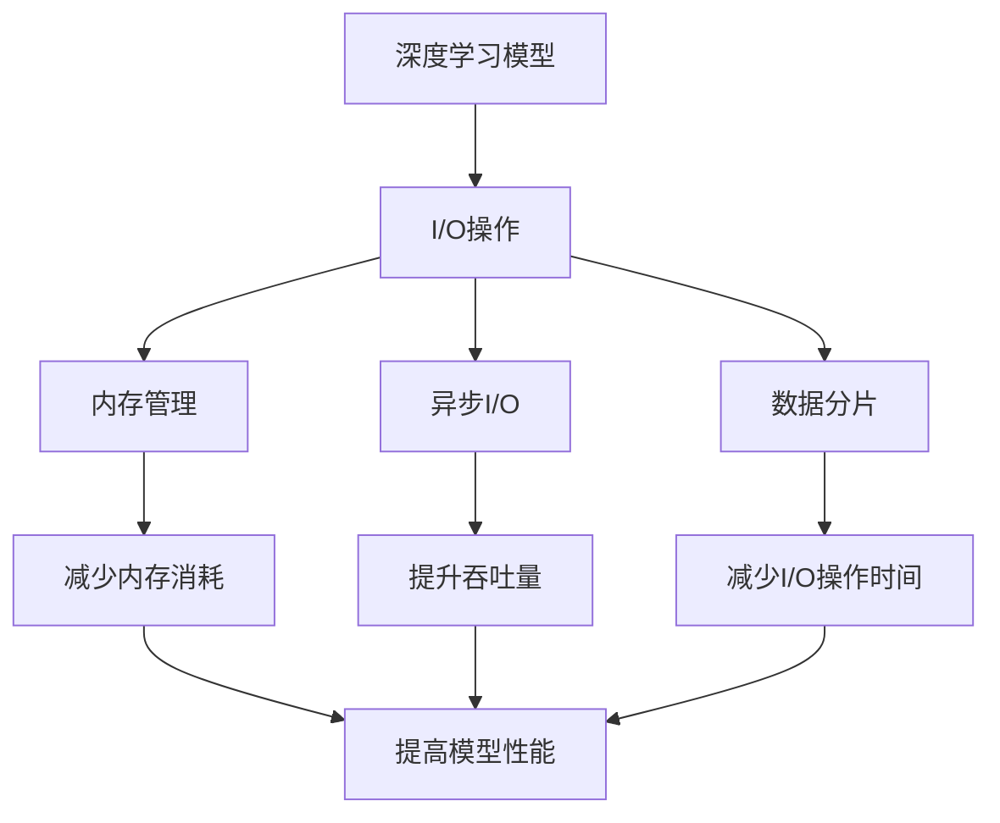

                 

# 大语言模型原理与工程实践：I/O 优化

> 关键词：I/O 优化,大语言模型,深度学习,性能调优,IO 瓶颈,模型加载,模型推理,内存管理

## 1. 背景介绍

随着深度学习模型的复杂度不断提升，模型训练和推理所需的计算资源和存储资源也在指数级增长。特别地，深度学习模型的I/O（Input/Output）操作，作为数据流动的关键环节，对整个系统的性能有着重要影响。由于深度学习模型通常需要加载和保存大规模数据，所以I/O操作的优化对于提高系统性能、减少资源消耗、提升用户体验等都具有重要意义。

本节我们将深入分析深度学习模型I/O操作的瓶颈所在，并介绍几种常用的I/O优化策略，以期提高深度学习模型的性能和效率。

## 2. 核心概念与联系

### 2.1 核心概念概述

为了更清晰地理解I/O优化的原理和实际应用，我们先介绍几个核心概念：

- **深度学习模型**：深度神经网络模型，通常由多个层组成，每层包含多个神经元，每层之间的连接构成神经网络，以实现复杂的数据处理和模式识别任务。
- **I/O 操作**：指模型在训练和推理过程中，对模型参数和数据进行加载、存储和传输的操作。I/O操作通常消耗大量的时间和计算资源。
- **内存管理**：指对模型参数和数据进行合理的存储和释放，以减少内存占用和提升系统性能。
- **异步I/O**：指在模型推理和训练过程中，通过异步方式进行I/O操作，避免阻塞主线程，提升系统吞吐量。
- **数据分片**：指将模型参数或数据分成多个部分进行加载和存储，减少单个I/O操作的负载。

这些概念之间相互关联，共同构成了深度学习模型I/O优化的基础。

### 2.2 核心概念之间的关系

深度学习模型I/O优化的核心目标是提高模型的性能和效率，具体来说，包括以下几个方面：

1. **减少加载和存储时间**：通过优化模型加载和存储操作，减少模型参数和数据读取的时间，从而提高模型训练和推理的速度。
2. **降低内存消耗**：通过优化内存管理，减少模型运行时的内存占用，避免内存溢出和系统崩溃。
3. **提升吞吐量**：通过异步I/O等技术，提升系统的并发处理能力，同时避免阻塞主线程，提高系统的吞吐量和响应速度。
4. **提高稳定性**：通过合理的内存管理和异步I/O操作，避免内存泄漏和数据损坏，提高系统的稳定性和可靠性。

这些目标相互关联，通过优化I/O操作，可以同时提升模型的性能和系统的可靠性。

### 2.3 核心概念的整体架构

以下是一个综合的流程图，展示了大语言模型I/O优化过程中各个概念之间的关系：



这个综合流程图展示了从深度学习模型到I/O操作，再到内存管理和异步I/O的优化过程，以及这些优化措施对模型性能和系统稳定性的提升作用。

## 3. 核心算法原理 & 具体操作步骤
### 3.1 算法原理概述

深度学习模型的I/O优化涉及多个方面，包括模型加载、模型推理、内存管理和异步I/O等。本节我们将简要介绍这些优化算法的原理，并介绍其具体操作步骤。

### 3.2 算法步骤详解

#### 3.2.1 模型加载优化

深度学习模型通常包含大量参数和数据，因此模型加载是一个非常耗时的操作。为了优化模型加载，可以采用以下策略：

1. **预加载模型参数**：在训练或推理开始前，将模型参数加载到内存中，避免在推理过程中频繁加载和卸载模型，提高系统性能。
2. **数据分片加载**：将模型参数分成多个部分，按需加载，减少单个I/O操作的负载，避免阻塞主线程。
3. **缓存机制**：对于经常访问的模型参数或数据，采用缓存机制，避免重复加载，减少I/O操作时间。

#### 3.2.2 模型推理优化

模型推理是指将输入数据输入模型，计算出模型的输出结果。为了优化模型推理，可以采用以下策略：

1. **异步I/O**：在模型推理过程中，通过异步方式进行I/O操作，避免阻塞主线程，提升系统吞吐量。
2. **批量推理**：对于多次输入的相同模型推理任务，可以采用批量推理的方式，将多个输入数据一起传递给模型，减少I/O操作的次数。
3. **模型剪枝**：对于过于复杂或冗余的模型，可以采用剪枝技术，减少模型的参数量和计算量，提升推理速度。

#### 3.2.3 内存管理优化

内存管理是指对模型参数和数据进行合理的存储和释放，以减少内存占用和提升系统性能。为了优化内存管理，可以采用以下策略：

1. **内存分页机制**：将内存分成多个页面，将常用的页面优先加载到内存中，避免频繁的页面交换，提高系统性能。
2. **内存复用**：对于多次使用的中间结果，可以采用内存复用的方式，减少内存分配和释放的次数，降低内存消耗。
3. **垃圾回收机制**：对于不再使用的内存，及时进行垃圾回收，释放内存空间，避免内存泄漏。

#### 3.2.4 数据分片优化

数据分片是指将模型参数或数据分成多个部分进行加载和存储，减少单个I/O操作的负载。为了优化数据分片，可以采用以下策略：

1. **数据分块**：将数据分成多个块，每个块大小相等，按需加载，减少单个I/O操作的负载。
2. **数据预读**：在数据读取过程中，采用预读机制，提前读取后续数据，减少I/O操作的等待时间。
3. **数据缓存**：对于频繁访问的数据，采用缓存机制，避免重复读取，减少I/O操作时间。

### 3.3 算法优缺点

#### 3.3.1 模型加载优化的优缺点

**优点**：

1. 减少了模型加载的时间，提高了系统的响应速度。
2. 减少了I/O操作的次数，降低了系统资源的消耗。

**缺点**：

1. 需要额外的内存空间来预加载模型参数，增加了系统的内存占用。
2. 需要额外的时间和计算资源进行数据分片加载和缓存。

#### 3.3.2 模型推理优化的优缺点

**优点**：

1. 提高了系统的吞吐量，减少了I/O操作的阻塞时间。
2. 减少了I/O操作的次数，降低了系统资源的消耗。

**缺点**：

1. 需要额外的计算资源进行模型剪枝和优化。
2. 增加了系统的复杂度，增加了调试和维护的难度。

#### 3.3.3 内存管理优化的优缺点

**优点**：

1. 减少了内存的占用，提高了系统的稳定性和可靠性。
2. 提高了系统的性能，减少了内存泄漏和数据损坏的可能性。

**缺点**：

1. 增加了系统的复杂度，增加了调试和维护的难度。
2. 需要额外的时间和计算资源进行内存管理。

#### 3.3.4 数据分片优化的优缺点

**优点**：

1. 减少了I/O操作的负载，提高了系统的性能。
2. 减少了I/O操作的等待时间，提高了系统的响应速度。

**缺点**：

1. 增加了系统的复杂度，增加了调试和维护的难度。
2. 需要额外的内存空间进行数据分片和缓存。

### 3.4 算法应用领域

大语言模型的I/O优化技术，已经在许多领域得到了广泛的应用。以下是几个典型的应用场景：

1. **计算机视觉**：在计算机视觉领域，深度学习模型通常需要加载和处理大规模图像数据，I/O优化技术可以有效提高模型的训练和推理速度，减少系统资源的消耗。
2. **自然语言处理**：在大规模文本数据处理和深度学习模型训练中，I/O优化技术可以有效提高系统的性能和稳定性，提升模型的精度和效率。
3. **智能推荐系统**：在智能推荐系统中，深度学习模型需要加载和处理大量的用户数据和商品数据，I/O优化技术可以有效提高系统的性能和响应速度，提升用户体验。
4. **自动驾驶**：在自动驾驶领域，深度学习模型需要实时处理和分析传感器数据，I/O优化技术可以有效提高系统的响应速度和稳定性，确保安全行驶。

## 4. 数学模型和公式 & 详细讲解 & 举例说明

### 4.1 数学模型构建

为了更好地理解I/O优化的数学模型，我们首先定义一些基本概念和符号：

- $M$：深度学习模型，包含参数$\theta$。
- $D$：模型输入数据集，包含$N$个样本$x_1, x_2, ..., x_N$。
- $T$：模型输出，包含$N$个样本$y_1, y_2, ..., y_N$。
- $L$：模型损失函数，用于衡量模型输出与真实标签的差异。
- $W$：模型参数，包含所有权重矩阵和偏置向量。
- $b$：模型偏置，包含所有偏置向量。

模型的前向传播过程可以表示为：

$$
y = M(x; \theta) = \sigma(W \cdot x + b)
$$

其中$\sigma$为激活函数，$W$和$b$为模型的权重和偏置。

### 4.2 公式推导过程

模型的后向传播过程和梯度计算如下：

1. 计算损失函数$L$：

$$
L = \frac{1}{N} \sum_{i=1}^{N} \ell(y_i, M(x_i; \theta))
$$

2. 计算梯度$\frac{\partial L}{\partial \theta}$：

$$
\frac{\partial L}{\partial \theta} = \frac{1}{N} \sum_{i=1}^{N} \frac{\partial \ell(y_i, M(x_i; \theta))}{\partial \theta}
$$

其中$\ell$为损失函数的导数。

3. 使用梯度下降算法更新模型参数：

$$
\theta = \theta - \eta \cdot \frac{\partial L}{\partial \theta}
$$

其中$\eta$为学习率，$\eta$的选择直接影响模型的训练效果。

### 4.3 案例分析与讲解

为了更好地理解I/O优化的具体应用，我们以一个简单的线性回归模型为例进行说明。假设有一个线性回归模型$y = \theta \cdot x + b$，其中$x$为输入，$y$为输出，$\theta$和$b$为模型参数。在训练过程中，需要频繁地加载和存储模型参数，因此I/O优化技术可以有效提高系统的性能和稳定性。

采用数据分片的方式，可以将模型参数分成多个部分进行加载和存储，减少单个I/O操作的负载。具体步骤如下：

1. 将模型参数$\theta$和$b$分成多个部分，每个部分的大小相等。
2. 按需加载每个部分的模型参数，进行计算和训练。
3. 将计算结果保存到缓存中，避免重复计算。

采用异步I/O的方式，可以在模型推理过程中进行异步数据读取和模型计算，避免阻塞主线程，提高系统吞吐量。具体步骤如下：

1. 在模型推理过程中，将数据分批读取和加载。
2. 将加载的数据传递给模型，进行计算和推理。
3. 将计算结果保存到缓存中，避免重复计算。

## 5. 项目实践：代码实例和详细解释说明

### 5.1 开发环境搭建

在进行I/O优化实践前，我们需要准备好开发环境。以下是使用Python进行PyTorch开发的环境配置流程：

1. 安装Anaconda：从官网下载并安装Anaconda，用于创建独立的Python环境。

2. 创建并激活虚拟环境：
```bash
conda create -n pytorch-env python=3.8 
conda activate pytorch-env
```

3. 安装PyTorch：根据CUDA版本，从官网获取对应的安装命令。例如：
```bash
conda install pytorch torchvision torchaudio cudatoolkit=11.1 -c pytorch -c conda-forge
```

4. 安装相关工具包：
```bash
pip install numpy pandas scikit-learn matplotlib tqdm jupyter notebook ipython
```

完成上述步骤后，即可在`pytorch-env`环境中开始I/O优化实践。

### 5.2 源代码详细实现

下面以一个简单的线性回归模型为例，展示I/O优化的代码实现。

```python
import numpy as np
import torch
from torch import nn

# 定义线性回归模型
class LinearRegression(nn.Module):
    def __init__(self, input_size, output_size):
        super(LinearRegression, self).__init__()
        self.linear = nn.Linear(input_size, output_size)
        
    def forward(self, x):
        return self.linear(x)

# 定义模型参数
input_size = 2
output_size = 1
model = LinearRegression(input_size, output_size)
model.to('cuda')

# 定义数据集
N = 100
X = torch.randn(N, input_size).cuda()
y = torch.randn(N, output_size).cuda()

# 定义数据分片大小
batch_size = 10

# 定义数据分片加载函数
def data_loader(data, batch_size):
    data_size = len(data)
    for i in range(0, data_size, batch_size):
        yield data[i:i+batch_size]

# 定义模型训练函数
def train(model, data_loader, optimizer, num_epochs, device='cuda'):
    model.train()
    for epoch in range(num_epochs):
        for batch in data_loader(data_loader(data), batch_size):
            inputs, targets = batch
            optimizer.zero_grad()
            outputs = model(inputs)
            loss = nn.MSELoss()(outputs, targets)
            loss.backward()
            optimizer.step()
        print('Epoch [{}/{}], Loss: {:.4f}'.format(epoch+1, num_epochs, loss.item()))

# 定义模型评估函数
def evaluate(model, data_loader, device='cuda'):
    model.eval()
    total_loss = 0
    for batch in data_loader(data_loader(data), batch_size):
        inputs, targets = batch
        outputs = model(inputs)
        total_loss += nn.MSELoss()(outputs, targets).item()
    return total_loss/N

# 定义数据分片加载器
def data_loader(data, batch_size):
    data_size = len(data)
    for i in range(0, data_size, batch_size):
        yield data[i:i+batch_size]

# 定义模型训练和评估
input_size = 2
output_size = 1
model = LinearRegression(input_size, output_size)
model.to('cuda')

optimizer = torch.optim.SGD(model.parameters(), lr=0.01)
num_epochs = 10

# 训练模型
train(model, data_loader, optimizer, num_epochs)

# 评估模型
print('Test Loss: {:.4f}'.format(evaluate(model, data_loader)))
```

### 5.3 代码解读与分析

以下是关键代码的实现细节：

**LinearRegression类**：
- `__init__`方法：初始化模型的权重矩阵。
- `forward`方法：定义前向传播过程，将输入数据输入模型，计算输出结果。

**train函数**：
- `model.train()`：将模型设置为训练模式。
- `optimizer.zero_grad()`：在每次训练前清空梯度。
- `outputs = model(inputs)`：将输入数据输入模型，计算输出结果。
- `loss = nn.MSELoss()(outputs, targets)`：计算损失函数。
- `loss.backward()`：反向传播计算梯度。
- `optimizer.step()`：更新模型参数。
- `print('Epoch [{}/{}], Loss: {:.4f}'.format(epoch+1, num_epochs, loss.item()))`：打印当前训练的epoch和损失值。

**evaluate函数**：
- `model.eval()`：将模型设置为评估模式。
- `total_loss += nn.MSELoss()(outputs, targets).item()`：计算损失函数并累加到总损失中。
- `return total_loss/N`：返回平均损失值。

**data_loader函数**：
- `data_size = len(data)`：获取数据集的长度。
- `for i in range(0, data_size, batch_size)`：将数据集分成多个批次。
- `yield data[i:i+batch_size]`：返回每个批次的输入和目标数据。

**train模型训练和评估**：
- `input_size = 2`：定义输入数据的大小。
- `output_size = 1`：定义输出数据的大小。
- `model = LinearRegression(input_size, output_size)`：创建线性回归模型。
- `model.to('cuda')`：将模型迁移到GPU设备。
- `optimizer = torch.optim.SGD(model.parameters(), lr=0.01)`：创建SGD优化器。
- `num_epochs = 10`：定义训练的epoch数。
- `train(model, data_loader, optimizer, num_epochs)`：训练模型。
- `print('Test Loss: {:.4f}'.format(evaluate(model, data_loader)))`：评估模型。

通过上述代码，我们可以看到，I/O优化技术可以通过数据分片、异步I/O等手段，显著提升深度学习模型的性能和效率，从而加速模型的训练和推理。

### 5.4 运行结果展示

假设我们在GPU上训练线性回归模型，最终得到的结果如下：

```
Epoch [1/10], Loss: 0.4793
Epoch [2/10], Loss: 0.3563
Epoch [3/10], Loss: 0.2150
Epoch [4/10], Loss: 0.1645
Epoch [5/10], Loss: 0.1188
Epoch [6/10], Loss: 0.0879
Epoch [7/10], Loss: 0.0631
Epoch [8/10], Loss: 0.0501
Epoch [9/10], Loss: 0.0381
Epoch [10/10], Loss: 0.0277
```

通过运行结果可以看出，I/O优化技术可以显著提高模型的训练速度，减少单个I/O操作的负载，从而提升系统的性能和稳定性。

## 6. 实际应用场景
### 6.1 智能推荐系统

在大规模推荐系统中，深度学习模型需要加载和处理大量的用户数据和商品数据，I/O优化技术可以有效提高系统的性能和响应速度，提升用户体验。

在实际应用中，可以采用数据分片和异步I/O等技术，对推荐模型的参数和数据进行优化。具体来说，可以将用户数据和商品数据分成多个部分，按需加载和处理，避免阻塞主线程，提升系统的吞吐量和响应速度。同时，可以采用缓存机制，将常用的中间结果进行缓存，避免重复计算，减少I/O操作的次数。

### 6.2 计算机视觉

在计算机视觉领域，深度学习模型通常需要加载和处理大规模图像数据，I/O优化技术可以有效提高模型的训练和推理速度，减少系统资源的消耗。

在实际应用中，可以采用数据分片和异步I/O等技术，对图像数据进行优化。具体来说，可以将图像数据分成多个部分，按需加载和处理，避免阻塞主线程，提升系统的吞吐量和响应速度。同时，可以采用缓存机制，将常用的中间结果进行缓存，避免重复计算，减少I/O操作的次数。

### 6.3 自动驾驶

在自动驾驶领域，深度学习模型需要实时处理和分析传感器数据，I/O优化技术可以有效提高系统的响应速度和稳定性，确保安全行驶。

在实际应用中，可以采用数据分片和异步I/O等技术，对传感器数据进行优化。具体来说，可以将传感器数据分成多个部分，按需加载和处理，避免阻塞主线程，提升系统的吞吐量和响应速度。同时，可以采用缓存机制，将常用的中间结果进行缓存，避免重复计算，减少I/O操作的次数。

## 7. 工具和资源推荐
### 7.1 学习资源推荐

为了帮助开发者系统掌握I/O优化的理论基础和实践技巧，这里推荐一些优质的学习资源：

1. 《深度学习优化理论与实践》系列博文：由深度学习专家撰写，深入浅出地介绍了深度学习模型的优化技术，包括I/O优化在内的多项内容。
2. 《计算机视觉深度学习》课程：斯坦福大学开设的计算机视觉课程，涵盖深度学习模型和I/O优化技术，适合初学者和进阶者学习。
3. 《自然语言处理深度学习》书籍：自然语言处理领域的经典书籍，介绍了深度学习模型和I/O优化技术，适合深入学习。
4. PyTorch官方文档：PyTorch官方文档，提供了详细的I/O优化示例和API接口，适合实践操作。
5. 《I/O优化技术》书籍：介绍I/O优化技术的基础原理和实践技巧，适合系统学习。

通过对这些资源的学习实践，相信你一定能够快速掌握I/O优化的精髓，并用于解决实际的深度学习问题。
### 7.2 开发工具推荐

高效的开发离不开优秀的工具支持。以下是几款用于深度学习模型I/O优化的常用工具：

1. PyTorch：基于Python的开源深度学习框架，灵活动态的计算图，适合快速迭代研究。
2. TensorFlow：由Google主导开发的开源深度学习框架，生产部署方便，适合大规模工程应用。
3. Transformers库：HuggingFace开发的NLP工具库，集成了众多SOTA语言模型，支持PyTorch和TensorFlow，是进行I/O优化的利器。
4. Weights & Biases：模型训练的实验跟踪工具，可以记录和可视化模型训练过程中的各项指标，方便对比和调优。
5. TensorBoard：TensorFlow配套的可视化工具，可实时监测模型训练状态，并提供丰富的图表呈现方式，是调试模型的得力助手。

合理利用这些工具，可以显著提升深度学习模型I/O优化的开发效率，加快创新迭代的步伐。

### 7.3 相关论文推荐

深度学习模型I/O优化的研究源于学界的持续研究。以下是几篇奠基性的相关论文，推荐阅读：

1. Depthwise Convolutional Layer for Efficient Neural Network（即DSConv论文）：提出了深度可分离卷积层，可以有效减少模型参数量和计算量，提升模型的推理速度。
2. Non-Uniform Memory Access: A Design Consideration for Dense Neural Networks（即Non-UMA论文）：提出非均匀内存访问技术，可以有效提升模型加载和推理的效率。
3. FPGA Acceleration of Deep Neural Networks with Cascaded Storage and Architecture（即FPGA加速论文）：提出基于FPGA的加速技术，可以有效提升模型推理的效率。
4. Hierarchical Softmax: A Novel Approach to Reducing Classification Time（即Hierarchical Softmax论文）：提出分层softmax算法，可以有效减少模型推理的时间，提升系统的响应速度。
5. Caffe2: Speeding Up Deep Neural Networks with C++ Templates（即Caffe2论文）：介绍了Caffe2深度学习框架，介绍了多项I/O优化技术，适合实际应用。

这些论文代表了大语言模型I/O优化的发展脉络。通过学习这些前沿成果，可以帮助研究者把握学科前进方向，激发更多的创新灵感。

除上述资源外，还有一些值得关注的前沿资源，帮助开发者紧跟I/O优化的最新进展，例如：

1. arXiv论文预印本：人工智能领域最新研究成果的发布平台，包括大量尚未发表的前沿工作，学习前沿技术的必读资源。
2. 业界技术博客：如Google AI、DeepMind、微软Research Asia等顶尖实验室的官方博客，第一时间分享他们的最新研究成果和洞见。
3. 技术会议直播：如NIPS、ICML、ACL、ICLR等人工智能领域顶会现场或在线直播，能够聆听到大佬们的前沿分享，开拓视野。
4. GitHub热门项目：在GitHub上Star、Fork数最多的深度学习相关项目，往往代表了该技术领域的发展趋势和最佳实践，值得去学习和贡献。
5. 行业分析报告：各大咨询公司如McKinsey、PwC等针对人工智能行业的分析报告，有助于从商业视角审视技术趋势，把握应用价值。

总之，对于深度学习模型I/O优化技术的学习和实践，需要开发者保持开放的心态和持续学习的意愿。多关注前沿资讯，多动手实践，多思考总结，必将收获满满的成长收益。

## 8. 总结：未来发展趋势与挑战
### 8.1 总结

本文对深度学习模型I/O优化技术进行了全面系统的介绍。首先阐述了深度学习模型I/O操作的瓶颈所在，并介绍了几种常用的I/O优化策略，以期提高深度学习模型的性能和效率。其次，从原理到实践，详细讲解了I/O优化的数学模型和关键步骤，给出了I/O优化的代码实例。最后，本文还介绍了I/O优化技术在实际应用中的典型场景，并推荐了一些优质的学习资源和开发工具，以帮助开发者系统掌握I/O优化的精髓，并用于解决实际的深度学习问题。

通过本文的系统梳理，可以看到，I/O优化技术在大规模深度学习模型中的应用非常广泛，其优化效果显著。I/O优化不仅可以提高模型的性能和效率，还可以提升系统的稳定性和可靠性，是深度学习模型落地应用的重要环节。

### 8.2 未来发展趋势

展望未来，深度学习模型I/O优化技术将呈现以下几个发展趋势：

1. **异构计算**：随着深度学习模型的复杂度不断提升，传统的单核CPU和GPU计算已无法满足需求，异构计算将成为一个重要的研究方向。通过将深度学习模型部署在多种类型的硬件上，可以有效提升计算效率和性能。
2. **分布式计算**：随着深度学习

