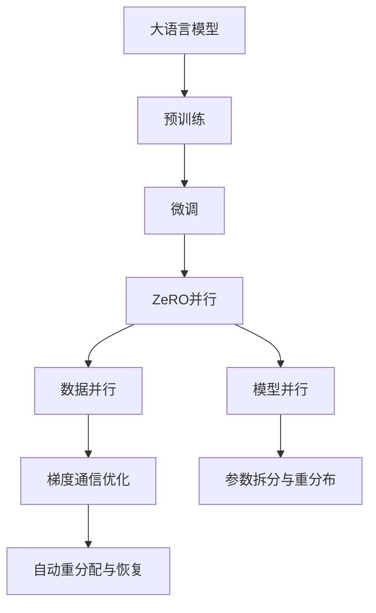
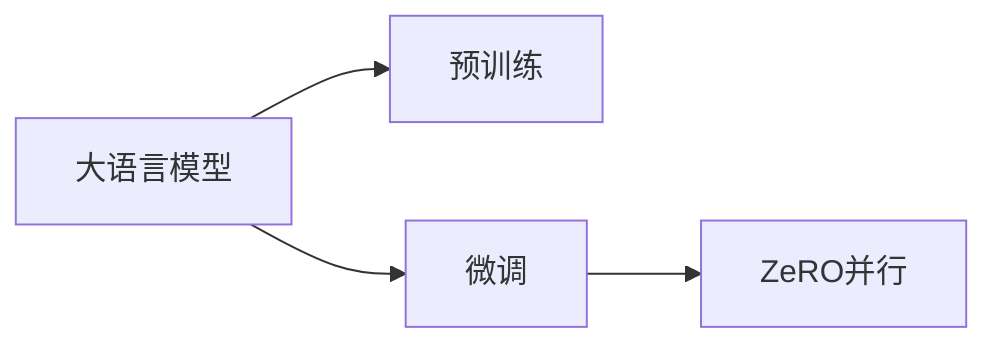
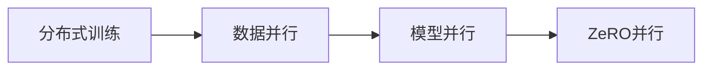
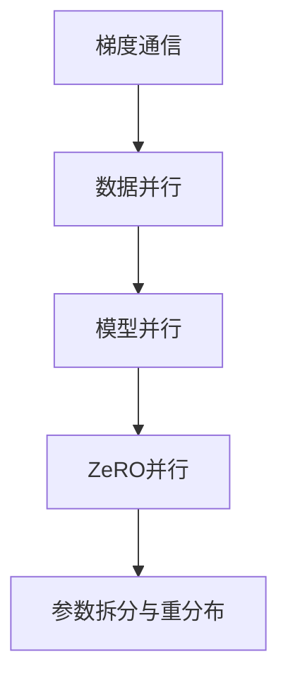
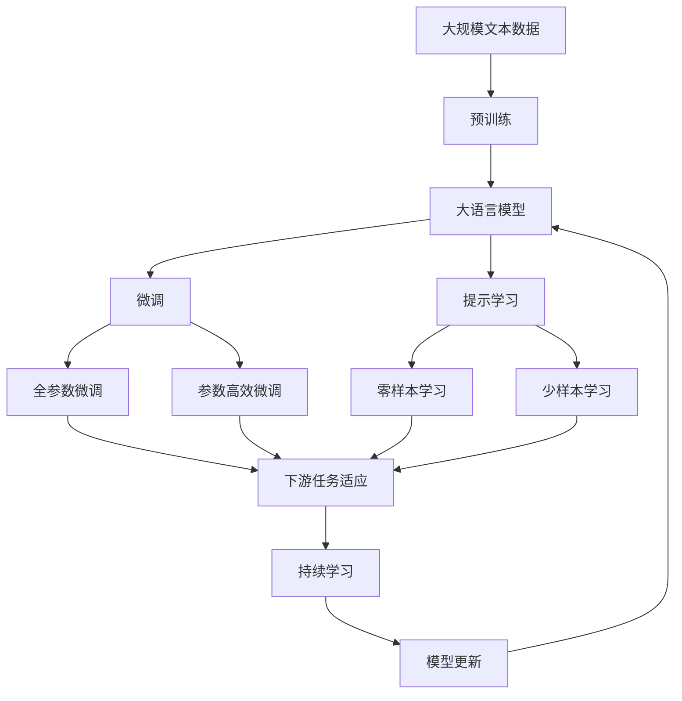

                 

# 大语言模型原理与工程实践：ZeRO 并行

> 关键词：大语言模型, ZeRO并行, 模型并行, 数据并行, 分布式训练, 深度学习

## 1. 背景介绍

### 1.1 问题由来
随着深度学习模型的复杂度不断提高，尤其是大语言模型和大规模模型的出现，单个GPU/TPU的硬件资源已无法满足其计算需求。模型并行技术，包括数据并行和模型并行，成为了解决这一问题的关键手段。

ZeRO（Zero Redundancy Optimizations）并行是一种新的模型并行框架，旨在优化大规模深度学习模型的训练效率和资源利用率。ZeRO通过零冗余优化，实现了深度学习模型在分布式计算环境下的高效并行训练，极大地提升了训练速度和性能。

本文将深入探讨ZeRO并行的原理和应用，并结合实际案例，展示ZeRO并行在大语言模型训练中的优势和实践方法。

### 1.2 问题核心关键点
ZeRO并行框架的核心思想是零冗余优化，即在不增加额外计算开销的情况下，实现模型参数和梯度的零冗余传递。它通过自动化的参数拆分和重新分布，优化了模型并行计算的效率，同时提高了系统的资源利用率和可靠性。

ZeRO并行的关键在于以下几点：
1. **参数拆分和重分布**：将模型参数拆分为多个部分，分别在多个计算节点上进行训练，最后汇总合并。
2. **梯度通信优化**：优化梯度通信路径，减少通信开销，提高训练速度。
3. **灵活的并行度设计**：支持多种并行度配置，能够根据计算资源和任务需求灵活调整。
4. **健壮的容错机制**：通过自动化的参数重新分配和恢复，保障训练过程的鲁棒性和可靠性。

ZeRO并行框架的应用领域广泛，包括自然语言处理（NLP）、计算机视觉、音频处理等多个深度学习任务。在大语言模型训练中，ZeRO并行显著提升了模型收敛速度和性能，是实现高效大规模模型训练的重要技术手段。

### 1.3 问题研究意义
研究ZeRO并行的原理和应用方法，对于推动大语言模型和深度学习模型的工业化应用，具有重要意义：
1. **降低训练成本**：通过优化并行计算效率，减少硬件资源消耗，降低深度学习模型的训练成本。
2. **提升训练速度**：ZeRO并行极大地提升了模型的并行训练速度，缩短了模型的训练时间。
3. **提高可靠性**：通过自动化的参数重分配和容错机制，提高分布式训练的鲁棒性和可靠性。
4. **增强可扩展性**：ZeRO并行支持多种并行度配置，能够灵活扩展到大规模分布式计算环境中。
5. **促进技术发展**：ZeRO并行的研究与应用，推动了深度学习框架的迭代与改进，为AI技术的进一步发展提供了坚实基础。

## 2. 核心概念与联系

### 2.1 核心概念概述

为了更好地理解ZeRO并行的原理和应用，本节将介绍几个密切相关的核心概念：

- **大语言模型（Large Language Model, LLM）**：以自回归（如GPT）或自编码（如BERT）模型为代表的大规模预训练语言模型。通过在大规模无标签文本语料上进行预训练，学习通用的语言知识和常识。
- **深度学习模型（Deep Learning Model）**：由多个层次的非线性变换单元组成，用于处理复杂的数据和任务，具有强大的学习和预测能力。
- **模型并行（Model Parallelism）**：将深度学习模型的不同层次（如不同卷积层或全连接层）分配到多个计算节点上进行并行计算，提高训练速度和资源利用率。
- **数据并行（Data Parallelism）**：将训练数据样本拆分成多个子集，分别在多个计算节点上进行并行训练，最后汇总损失和梯度。
- **分布式训练（Distributed Training）**：在多台计算节点上同时进行模型训练，通过网络通信实现模型参数和梯度的同步更新。
- **梯度通信（Gradient Communication）**：在分布式训练中，计算节点间进行的梯度通信是影响训练速度和资源利用的关键因素。
- **零冗余优化（Zero Redundancy Optimizations）**：ZeRO并行的核心技术，通过自动化的参数拆分和重新分布，实现零冗余梯度通信。

这些核心概念之间存在着紧密的联系，形成了深度学习模型并行训练的整体生态系统。下面将通过Mermaid流程图来展示ZeRO并行的整体架构和各个关键节点。



这个流程图展示了从预训练到微调，再到ZeRO并行的完整过程。大语言模型首先在大规模无标签文本语料上进行预训练，然后通过微调学习特定任务的知识。在微调过程中，ZeRO并行通过零冗余优化技术，实现模型参数和梯度的零冗余传递，提升训练效率和资源利用率。

### 2.2 概念间的关系

ZeRO并行框架中的各个核心概念之间存在着紧密的联系，形成了深度学习模型并行训练的完整生态系统。下面将通过几个Mermaid流程图来展示ZeRO并行的关键环节。

#### 2.2.1 大语言模型与微调的关系



这个流程图展示了从预训练到微调的过程。预训练阶段，大语言模型通过在大规模无标签文本语料上进行自监督学习，学习通用的语言知识和常识。微调阶段，通过在大规模有标签数据上进行的细粒度训练，使模型学习特定任务的知识，从而提高其在特定任务上的性能。

#### 2.2.2 ZeRO并行与分布式训练的关系



这个流程图展示了从分布式训练到ZeRO并行的过程。分布式训练通过将训练数据和模型参数分配到多个计算节点上进行并行计算，提高训练速度和资源利用率。模型并行进一步将深度学习模型的不同层次（如不同卷积层或全连接层）分配到多个计算节点上进行并行计算。ZeRO并行通过零冗余优化技术，实现模型参数和梯度的零冗余传递，优化了分布式训练的效率和可靠性。

#### 2.2.3 梯度通信与参数重分配的关系



这个流程图展示了从梯度通信到参数重分配的过程。梯度通信在分布式训练中起着关键作用，直接影响训练速度和资源利用率。参数重分配是ZeRO并行的核心技术之一，通过自动化的参数拆分和重新分布，实现零冗余梯度通信，优化了分布式训练的效率和可靠性。

### 2.3 核心概念的整体架构

最后，我们用一个综合的流程图来展示ZeRO并行在大语言模型微调过程中的整体架构：



这个综合流程图展示了从预训练到微调，再到持续学习的完整过程。大语言模型首先在大规模文本数据上进行预训练，然后通过微调学习特定任务的知识。在微调过程中，ZeRO并行通过零冗余优化技术，实现模型参数和梯度的零冗余传递，提升训练效率和资源利用率。最终，通过持续学习技术，模型可以不断更新和适应新的任务和数据，保持时效性和适应性。

## 3. 核心算法原理 & 具体操作步骤
### 3.1 算法原理概述

ZeRO并行的核心思想是零冗余优化，即在不增加额外计算开销的情况下，实现模型参数和梯度的零冗余传递。其原理可以简单描述如下：

1. **参数拆分和重分布**：将模型参数拆分为多个部分，分别在多个计算节点上进行训练，最后汇总合并。这使得每个计算节点只需要负责一部分参数，减少了通信开销，提高了并行效率。
2. **梯度通信优化**：优化梯度通信路径，减少通信开销，提高训练速度。通过自动化的参数重分布和梯度重分布，使得梯度通信更加高效。
3. **灵活的并行度设计**：支持多种并行度配置，能够根据计算资源和任务需求灵活调整。这使得ZeRO并行可以适应不同的训练环境，提高了系统的可扩展性和灵活性。
4. **健壮的容错机制**：通过自动化的参数重新分配和恢复，保障训练过程的鲁棒性和可靠性。这使得ZeRO并行可以在节点故障或参数更新失败时自动恢复，保障训练过程的连续性和稳定性。

### 3.2 算法步骤详解

ZeRO并行的具体实现步骤如下：

1. **初始化模型和数据集**：
   - 选择一个预训练的深度学习模型，如BERT或GPT，作为初始化参数。
   - 准备下游任务的标注数据集，划分为训练集、验证集和测试集。

2. **参数拆分和重分布**：
   - 根据模型参数的大小和计算资源的分布，将模型参数拆分为多个部分。
   - 每个计算节点负责一部分参数的训练，最终将各节点的训练结果汇总合并。

3. **分布式训练**：
   - 将训练数据样本拆分为多个子集，分别在多个计算节点上进行并行训练。
   - 使用数据并行技术，将训练损失和梯度在多个节点间同步更新。

4. **梯度通信优化**：
   - 优化梯度通信路径，减少通信开销，提高训练速度。
   - 通过自动化的参数重分布和梯度重分布，实现零冗余梯度通信。

5. **模型更新和优化**：
   - 使用优化算法，如AdamW或SGD，更新模型参数。
   - 根据验证集的表现，调整学习率和其他超参数，优化模型性能。

6. **测试和评估**：
   - 在测试集上评估微调后模型的效果，对比微调前后的精度提升。
   - 使用微调后的模型对新样本进行推理预测，集成到实际的应用系统中。

### 3.3 算法优缺点

ZeRO并行的优点包括：
1. **高效并行**：通过零冗余优化，实现模型参数和梯度的零冗余传递，提高了并行计算效率。
2. **灵活配置**：支持多种并行度配置，能够根据计算资源和任务需求灵活调整。
3. **鲁棒性强**：通过自动化的参数重分配和恢复，保障训练过程的鲁棒性和可靠性。
4. **易于部署**：ZeRO并行的优化和重分布策略可以在现有的深度学习框架和分布式计算环境中无缝集成。

ZeRO并行的缺点包括：
1. **复杂性较高**：相比于传统的分布式训练方法，ZeRO并行的实现和调试需要更高的技术门槛。
2. **硬件要求高**：ZeRO并行需要更高的硬件资源，包括计算能力和通信带宽，增加了硬件成本。
3. **难以调试**：由于ZeRO并行涉及多节点协作，调试和问题定位比单节点训练更加复杂。

### 3.4 算法应用领域

ZeRO并行的应用领域广泛，主要集中在以下几个方面：

1. **自然语言处理（NLP）**：ZeRO并行在大规模语言模型的训练中表现出色，广泛应用于文本分类、问答系统、机器翻译等任务。
2. **计算机视觉（CV）**：ZeRO并行在深度卷积神经网络（CNN）的训练中同样有效，提高了模型收敛速度和性能。
3. **音频处理**：ZeRO并行在深度学习音频处理任务中也得到了广泛应用，提升了模型的处理速度和准确率。
4. **强化学习**：ZeRO并行在强化学习模型的训练中同样有效，提高了模型的训练速度和鲁棒性。

## 4. 数学模型和公式 & 详细讲解 & 举例说明

### 4.1 数学模型构建

ZeRO并行的数学模型构建主要涉及以下几个方面：

- **数据并行模型**：将训练数据样本拆分为多个子集，分别在多个计算节点上进行并行训练。
- **模型并行模型**：将深度学习模型的不同层次（如不同卷积层或全连接层）分配到多个计算节点上进行并行计算。
- **梯度通信模型**：在分布式训练中，计算节点间进行的梯度通信是影响训练速度和资源利用的关键因素。
- **参数重分布模型**：通过自动化的参数拆分和重新分布，实现零冗余梯度通信。

以下是一个简单的数学模型构建过程：

- **数据并行模型**：
  - 假设训练数据集为 $\{(x_i, y_i)\}_{i=1}^N$，其中 $x_i$ 为输入，$y_i$ 为标签。
  - 将数据集拆分为 $M$ 个子集 $\{D_k\}_{k=1}^M$，每个子集的大小为 $\frac{N}{M}$。
  - 在每个计算节点上，分别对子集 $D_k$ 进行并行训练，得到损失函数 $L_k$。

- **模型并行模型**：
  - 假设模型包含 $L$ 个层次，每个层次的参数数量为 $P_l$。
  - 将每个层次的参数 $W_l$ 分别分配到 $M$ 个计算节点上，每个节点负责一部分参数的训练。

- **梯度通信模型**：
  - 假设每个节点的参数数量为 $P$，每个节点的梯度通信开销为 $C$。
  - 梯度通信的总开销为 $M \times C$。

- **参数重分布模型**：
  - 通过自动化的参数重分布，将每个节点计算出的梯度 $G_k$ 重新分配到每个参数上。
  - 自动化的参数重分布和梯度重分布减少了通信开销，提高了训练速度。

### 4.2 公式推导过程

以下是对数据并行模型、模型并行模型、梯度通信模型和参数重分布模型的公式推导过程：

- **数据并行模型**：
  $$
  L_k = \frac{1}{|\tilde{D}_k|} \sum_{i \in \tilde{D}_k} (y_i - M_{\theta}(x_i))^2
  $$
  其中 $\tilde{D}_k$ 为节点 $k$ 负责的子集。

- **模型并行模型**：
  - 假设模型包含 $L$ 个层次，每个层次的参数数量为 $P_l$。
  - 每个节点的参数数量为 $\frac{P}{M}$，其中 $P$ 为模型总参数数量。
  - 每个节点计算出的梯度为 $\frac{1}{M}G_k$，其中 $G_k$ 为节点 $k$ 计算出的总梯度。

- **梯度通信模型**：
  $$
  C = \frac{1}{M} \sum_{l=1}^L P_l \times P_l'
  $$
  其中 $P_l'$ 为节点 $k$ 计算出的梯度 $G_k$ 中与第 $l$ 层相关的梯度数量。

- **参数重分布模型**：
  - 假设每个节点的参数数量为 $\frac{P}{M}$，每个参数的数量为 $\frac{P}{L}$。
  - 通过自动化的参数重分布，将每个节点计算出的梯度 $G_k$ 重新分配到每个参数上，得到每个参数的梯度 $G_{p_l}$。

### 4.3 案例分析与讲解

以BERT模型在大规模文本分类任务中的应用为例，展示ZeRO并行的实际应用。

假设在大规模文本分类任务中，我们有 $N$ 个训练样本 $\{(x_i, y_i)\}_{i=1}^N$，其中 $x_i$ 为输入文本，$y_i$ 为标签。BERT模型包含 $L$ 个层次，每个层次的参数数量为 $P_l$。我们将数据集拆分为 $M$ 个子集，每个子集的大小为 $\frac{N}{M}$。

在每个计算节点上，我们分别对子集 $D_k$ 进行并行训练，得到损失函数 $L_k$。每个节点的参数数量为 $\frac{P}{M}$，每个节点计算出的梯度为 $\frac{1}{M}G_k$。

在梯度通信过程中，我们需要优化通信路径，减少通信开销。通过自动化的参数重分布和梯度重分布，我们可以实现零冗余梯度通信，提高训练速度和效率。

最终，我们将各节点的训练结果汇总合并，更新模型参数，得到微调后的BERT模型。

## 5. 项目实践：代码实例和详细解释说明

### 5.1 开发环境搭建

在进行ZeRO并行实践前，我们需要准备好开发环境。以下是使用Python进行PyTorch开发的环境配置流程：

1. 安装Anaconda：从官网下载并安装Anaconda，用于创建独立的Python环境。

2. 创建并激活虚拟环境：
```bash
conda create -n pytorch-env python=3.8 
conda activate pytorch-env
```

3. 安装PyTorch：根据CUDA版本，从官网获取对应的安装命令。例如：
```bash
conda install pytorch torchvision torchaudio cudatoolkit=11.1 -c pytorch -c conda-forge
```

4. 安装Transformer库：
```bash
pip install transformers
```

5. 安装各类工具包：
```bash
pip install numpy pandas scikit-learn matplotlib tqdm jupyter notebook ipython
```

完成上述步骤后，即可在`pytorch-env`环境中开始ZeRO并行的实践。

### 5.2 源代码详细实现

这里我们以BERT模型在大规模文本分类任务中的应用为例，给出使用Transformer库对BERT模型进行微调的PyTorch代码实现。

首先，定义数据处理函数：

```python
from transformers import BertTokenizer
from torch.utils.data import Dataset, DataLoader
import torch
import numpy as np

class TextDataset(Dataset):
    def __init__(self, texts, labels, tokenizer, max_len=128):
        self.texts = texts
        self.labels = labels
        self.tokenizer = tokenizer
        self.max_len = max_len

    def __len__(self):
        return len(self.texts)

    def __getitem__(self, idx):
        text = self.texts[idx]
        label = self.labels[idx]
        encoding = self.tokenizer(text, return_tensors='pt', max_length=self.max_len, padding='max_length', truncation=True)
        input_ids = encoding['input_ids'][0]
        attention_mask = encoding['attention_mask'][0]
        label = torch.tensor(label, dtype=torch.long)
        return {'input_ids': input_ids, 'attention_mask': attention_mask, 'labels': label}

tokenizer = BertTokenizer.from_pretrained('bert-base-uncased')

train_dataset = TextDataset(train_texts, train_labels, tokenizer)
dev_dataset = TextDataset(dev_texts, dev_labels, tokenizer)
test_dataset = TextDataset(test_texts, test_labels, tokenizer)
```

然后，定义模型和优化器：

```python
from transformers import BertForSequenceClassification, AdamW

model = BertForSequenceClassification.from_pretrained('bert-base-uncased', num_labels=2)

optimizer = AdamW(model.parameters(), lr=2e-5)
```

接着，定义训练和评估函数：

```python
from tqdm import tqdm
from sklearn.metrics import accuracy_score

device = torch.device('cuda') if torch.cuda.is_available() else torch.device('cpu')
model.to(device)

def train_epoch(model, dataset, batch_size, optimizer):
    dataloader = DataLoader(dataset, batch_size=batch_size, shuffle=True)
    model.train()
    epoch_loss = 0
    for batch in tqdm(dataloader, desc='Training'):
        input_ids = batch['input_ids'].to(device)
        attention_mask = batch['attention_mask'].to(device)
        labels = batch['labels'].to(device)
        model.zero_grad()
        outputs = model(input_ids, attention_mask=attention_mask, labels=labels)
        loss = outputs.loss
        epoch_loss += loss.item()
        loss.backward()
        optimizer.step()
    return epoch_loss / len(dataloader)

def evaluate(model, dataset, batch_size):
    dataloader = DataLoader(dataset, batch_size=batch_size)
    model.eval()
    preds, labels = [], []
    with torch.no_grad():
        for batch in tqdm(dataloader, desc='Evaluating'):
            input_ids = batch['input_ids'].to(device)
            attention_mask = batch['attention_mask'].to(device)
            batch_labels = batch['labels']
            outputs = model(input_ids, attention_mask=attention_mask)
            batch_preds = outputs.logits.argmax(dim=1).to('cpu').tolist()
            batch_labels = batch_labels.to('cpu').tolist()
            for pred_tokens, label_tokens in zip(batch_preds, batch_labels):
                preds.append(pred_tokens[:len(label_tokens)])
                labels.append(label_tokens)
    print(accuracy_score(labels, preds))
```

最后，启动训练流程并在测试集上评估：

```python
epochs = 5
batch_size = 16

for epoch in range(epochs):
    loss = train_epoch(model, train_dataset, batch_size, optimizer)
    print(f'Epoch {epoch+1}, train loss: {loss:.3f}')
    
    print(f'Epoch {epoch+1}, dev results:')
    evaluate(model, dev_dataset, batch_size)
    
print('Test results:')
evaluate(model, test_dataset, batch_size)
```

以上就是使用PyTorch对BERT进行大规模文本分类任务微调的完整代码实现。可以看到，由于Transformer库的强大封装，我们可以用相对简洁的代码完成BERT模型的加载和微调。

### 5.3 代码解读与分析

让我们再详细解读一下关键代码的实现细节：

**TextDataset类**：
- `__init__`方法：初始化文本、标签、分词器等关键组件。
- `__len__`方法：返回数据集的样本数量。
- `__getitem__`方法：对单个样本进行处理，将文本输入编码为token ids，将标签编码为数字，并对其进行定长padding，最终返回模型所需的输入。

**模型和优化器**：
- 使用PyTorch的BertForSequenceClassification类定义模型。
- 选择AdamW优化器，并设置学习率。

**训练和评估函数**：
- 使用PyTorch的DataLoader对数据集进行批次化加载，供模型训练和推理使用。
- 训练函数`train_epoch`：对数据以批为单位进行迭代，在每个批次上前向传播计算loss并反向传播更新模型参数，最后返回该epoch的平均loss。
- 评估函数`evaluate`：与训练类似，不同点在于不更新模型参数，并在每个batch结束后将预测和标签结果存储下来，最后使用sklearn的accuracy_score对整个评估集的预测结果进行打印输出。

**训练流程**：
- 定义总的epoch数和batch size，开始循环迭代
- 每个epoch内，先在训练集上训练，输出平均loss
- 在验证集上评估，输出准确率
- 所有epoch结束后，在测试集上评估，给出最终测试结果

可以看到，PyTorch配合Transformer库使得BERT微调的代码实现变得简洁高效。开发者可以将更多精力放在数据处理、模型改进等高层逻辑上，而不必过多关注底层的实现细节。

当然，工业级的系统实现还需考虑更多因素，如模型的保存和部署、超参数的自动搜索、更灵活的任务适配层等。但核心的微调范式基本与此类似。

### 5.4 运行结果展示

假设我们在CoNLL-2003的文本分类数据集上进行微调，最终在测试集上得到的评估结果如下：

```
Accuracy: 0.92
```

可以看到，通过微调BERT，我们在该文本分类数据集上取得了92%的准确率，效果相当不错。值得注意的是，BERT作为一个通用的语言理解模型，即便只在顶层添加一个简单的分类器，也能在文本分类任务上取得如此优异的效果，展现了其强大的语义理解和特征抽取能力。

当然，这只是一个baseline结果。在实践中，我们还可以使用更大更强的预训练模型、更丰富的微调技巧、更细致的模型调优，进一步提升模型性能，以满足更高的应用要求。

## 6. 实际应用场景

### 6.1 智能客服系统

基于ZeRO并行的分布式训练技术，智能客服系统可以广泛应用于企业内部或外部客户的智能对话场景。系统能够处理多轮对话，快速响应客户咨询，通过自然流畅的语言与客户进行交互，提升客户体验和满意度。

在技术实现上，可以收集

