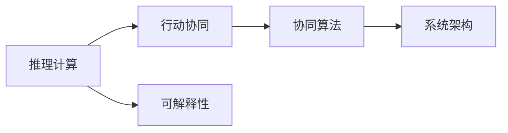
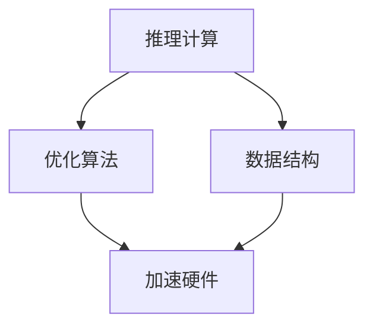
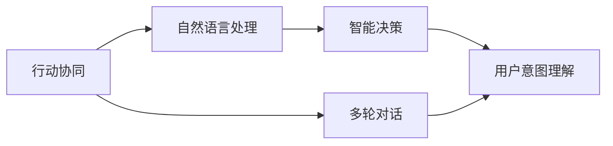
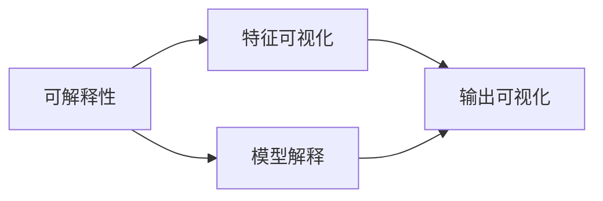
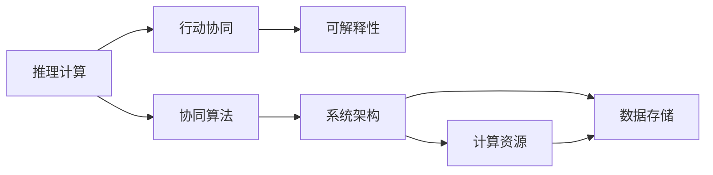

                 

# 大语言模型原理与工程实践：推理和行动协同技术

> 关键词：大语言模型,推理计算,行动协同,工程实现,应用场景

## 1. 背景介绍

### 1.1 问题由来
大语言模型（Large Language Models, LLMs）是近年来深度学习领域的重大突破。这些模型在大规模无标签文本语料上预训练后，具备强大的语言理解和生成能力。然而，大模型的推理和行动协同能力依然有待提升，这极大地限制了其在实际应用中的效率和可控性。

具体而言，推理过程在大模型中往往需要耗费大量的计算资源和时间，且结果的可解释性不足。而行动协同则涉及多轮交互和响应，导致模型需要具备更强的智能决策能力和用户交互理解能力。如何在大模型中实现高效的推理和协同计算，提高行动的智能性和可解释性，成为当前研究的热点问题。

### 1.2 问题核心关键点
推理和行动协同技术旨在优化大语言模型的计算性能和交互效果。其核心在于：

- 在推理阶段，如何设计高效的算法和数据结构，减少计算复杂度，提高推理速度。
- 在行动阶段，如何构建智能决策机制，理解用户意图和上下文，做出合理响应。
- 如何平衡模型推理的准确性和实时性，确保在高效计算的同时，不牺牲推理质量。
- 如何实现推理结果的可解释性，增强用户信任和模型可控性。

### 1.3 问题研究意义
推理和行动协同技术的提升，对于大语言模型的实际应用具有重要意义：

- 提高系统响应速度和交互流畅度，增强用户体验。
- 减少计算资源消耗，降低系统开发和维护成本。
- 增强模型的智能决策能力，提升其在复杂场景中的处理效率。
- 增加模型的可解释性，提升用户信任和系统透明度。
- 为工业级应用和商业产品开发提供更多可能的解决方案。

## 2. 核心概念与联系

### 2.1 核心概念概述

为更好地理解推理和行动协同技术的核心概念，本节将介绍几个密切相关的核心概念：

- **推理计算**：指通过模型对输入数据进行计算和分析，输出推理结果的过程。推理计算是实现智能决策和自动化的基础。
- **行动协同**：指在推理结果的基础上，对用户输入进行理解，生成合理的智能响应，并与用户进行多轮交互。
- **可解释性**：指推理结果的可理解性和可解释性，即用户能够理解模型的决策依据和推理过程。
- **协同算法**：指在推理和行动协同过程中，用于优化系统性能和提升用户体验的算法。
- **系统架构**：指构建大语言模型的计算和推理框架，涉及硬件资源配置、算法选择和数据流动。

这些核心概念之间存在紧密的联系，共同构成了推理和行动协同技术的完整体系。以下通过Mermaid流程图来展示这些概念之间的联系：



这个流程图展示了推理和行动协同技术的核心概念及它们之间的逻辑关系。推理计算是行动协同的基础，可解释性是保证系统透明度的关键，而协同算法和系统架构则分别用于优化计算过程和支撑整体系统结构。

### 2.2 概念间的关系

这些核心概念之间存在着紧密的联系，形成了推理和行动协同技术的完整生态系统。下面我们通过几个Mermaid流程图来展示这些概念之间的关系。

#### 2.2.1 推理计算的优化



这个流程图展示了推理计算的优化过程。通过选择合适的优化算法和高效的数据结构，结合加速硬件（如GPU、TPU等），可以显著提升推理计算的效率。

#### 2.2.2 行动协同的智能



这个流程图展示了行动协同的智能过程。通过对自然语言的理解和处理，结合多轮对话的管理和智能决策的生成，可以实现高效的行动协同。

#### 2.2.3 可解释性的增强



这个流程图展示了增强可解释性的方法。通过特征可视化、模型解释和输出可视化等手段，可以提升推理结果的可理解性，增强用户信任。

### 2.3 核心概念的整体架构

最后，我们用一个综合的流程图来展示这些核心概念在大语言模型中的整体架构：



这个综合流程图展示了推理和行动协同技术在大语言模型中的整体架构。推理计算、行动协同、可解释性、协同算法和系统架构共同构成了推理和行动协同技术的完整体系。

## 3. 核心算法原理 & 具体操作步骤

### 3.1 算法原理概述

推理和行动协同技术，本质上是通过模型对输入数据进行计算和分析，生成推理结果，并通过智能决策和自然语言处理技术，对推理结果进行理解和处理，最终输出合理的智能响应。其核心算法包括但不限于：

- **优化算法**：用于加速推理计算的算法，如梯度下降、剪枝、量化等。
- **自然语言处理（NLP）算法**：用于理解用户输入和生成自然语言响应的算法，如BERT、GPT等。
- **多轮对话管理**：用于管理多轮对话流的算法，如Seq2Seq、Transformers等。
- **智能决策算法**：用于生成智能决策的算法，如强化学习、贝叶斯网络等。

这些算法在大语言模型中的应用，可以实现推理和行动协同的优化，提升系统性能和用户体验。

### 3.2 算法步骤详解

基于推理和行动协同技术的微调方法，一般包括以下几个关键步骤：

**Step 1: 准备预训练模型和数据集**
- 选择合适的预训练语言模型，如BERT、GPT等，作为推理计算的基础。
- 准备推理和行动协同任务的数据集，划分为训练集、验证集和测试集。

**Step 2: 设计推理计算流程**
- 确定推理任务的输入数据格式和推理目标。
- 选择合适的优化算法和数据结构，构建推理计算框架。
- 对推理计算框架进行测试和调优，确保推理效率和准确性。

**Step 3: 实现行动协同逻辑**
- 设计用户意图理解模型，解析用户输入的意图和上下文。
- 设计多轮对话管理模型，维护对话历史和上下文状态。
- 设计智能决策模型，根据推理结果和用户意图，生成合理的智能响应。

**Step 4: 集成推理和行动协同模块**
- 将推理计算和行动协同模块集成到整个系统中。
- 设计输入输出接口，支持用户交互和系统响应。
- 实现系统测试和迭代优化，提升推理和行动协同效果。

**Step 5: 部署与测试**
- 将推理和行动协同系统部署到生产环境中。
- 进行系统性能和可解释性的全面测试，确保系统稳定性和可靠性。
- 根据测试结果，进一步优化系统架构和算法，提升用户体验。

以上是基于推理和行动协同技术的微调方法的一般流程。在实际应用中，还需要针对具体任务进行优化设计，如改进推理计算的算法，优化行动协同的逻辑，提高系统的可解释性等。

### 3.3 算法优缺点

推理和行动协同技术具有以下优点：

- 提高推理计算的效率和准确性，减少系统响应时间。
- 增强系统的智能决策能力，提升用户交互体验。
- 增加推理结果的可解释性，增强用户信任。

同时，也存在以下缺点：

- 算法复杂度高，需要更强的计算资源支持。
- 需要大量的标注数据，特别是对于复杂的智能决策任务。
- 用户意图理解模型的准确性受限于输入数据的质量和格式。

尽管存在这些局限性，但推理和行动协同技术在大语言模型的应用中仍然显示出巨大的潜力和价值。

### 3.4 算法应用领域

推理和行动协同技术在大语言模型的应用领域非常广泛，涵盖以下几个方面：

- **智能客服**：实现智能对话系统，提高客服响应速度和质量。
- **医疗咨询**：辅助医生进行病历分析、诊断和治疗建议。
- **智能推荐**：根据用户历史行为和当前需求，生成个性化推荐结果。
- **智能翻译**：结合多轮对话管理和智能决策，提供更流畅的翻译服务。
- **智能创作**：通过推理和行动协同，生成更加符合用户需求的文本、图片等内容。

除了上述这些典型应用外，推理和行动协同技术还可应用于教育、金融、娱乐等多个领域，为各行各业带来智能化升级。

## 4. 数学模型和公式 & 详细讲解

### 4.1 数学模型构建

在推理和行动协同技术的构建过程中，我们通常使用以下数学模型来描述推理计算和行动协同的整个过程：

设推理计算的输入为 $x$，输出为 $y$，推理过程的数学模型为 $y=f(x)$，其中 $f$ 为推理计算函数。行动协同的输入为 $y$ 和用户输入 $u$，输出为智能响应 $r$，行动协同的数学模型为 $r=g(y,u)$，其中 $g$ 为行动协同函数。

### 4.2 公式推导过程

以二分类任务为例，推理计算的输入为文本 $x$，输出为预测标签 $y$。推理过程的数学模型为：

$$
y = f(x) = \sigma(\text{BERT}(x))
$$

其中 $\sigma$ 为激活函数，$\text{BERT}(x)$ 为使用BERT模型对文本 $x$ 进行编码后的表示。

行动协同的输入为预测标签 $y$ 和用户输入 $u$，输出为智能响应 $r$。行动协同的数学模型为：

$$
r = g(y,u) = "这是你的答案，理由是..."
$$

其中 $g$ 可以根据推理结果和用户输入，生成合理的智能响应。

### 4.3 案例分析与讲解

假设我们在一个医疗咨询应用中进行推理和行动协同，输入为用户的症状描述 $x$，输出为推荐的治疗方案 $y$。推理计算的数学模型为：

$$
y = f(x) = \text{BERT}(x)
$$

其中 BERT 模型将症状描述编码为向量表示，用于后续的治疗方案推荐。

行动协同的输入为推荐方案 $y$ 和用户的后续提问 $u$，输出为智能响应 $r$。行动协同的数学模型为：

$$
r = g(y,u) = "根据你的症状，我建议采用方案A，理由是..."
$$

其中 $g$ 根据推荐方案 $y$ 和用户的后续提问 $u$，生成合理的智能响应。

## 5. 项目实践：代码实例和详细解释说明

### 5.1 开发环境搭建

在进行推理和行动协同的微调实践前，我们需要准备好开发环境。以下是使用Python进行PyTorch开发的环境配置流程：

1. 安装Anaconda：从官网下载并安装Anaconda，用于创建独立的Python环境。

2. 创建并激活虚拟环境：
```bash
conda create -n pytorch-env python=3.8 
conda activate pytorch-env
```

3. 安装PyTorch：根据CUDA版本，从官网获取对应的安装命令。例如：
```bash
conda install pytorch torchvision torchaudio cudatoolkit=11.1 -c pytorch -c conda-forge
```

4. 安装TensorBoard：用于可视化模型训练状态。

5. 安装Weights & Biases：用于实验跟踪和模型评估。

6. 安装transformers库：用于加载和微调预训练模型。

### 5.2 源代码详细实现

下面我以医疗咨询应用为例，给出使用PyTorch对BERT模型进行推理和行动协同微调的代码实现。

首先，定义推理计算函数：

```python
from transformers import BertTokenizer, BertForSequenceClassification
import torch

class BERTClassifier:
    def __init__(self, model_name='bert-base-cased', num_labels=2):
        self.tokenizer = BertTokenizer.from_pretrained(model_name)
        self.model = BertForSequenceClassification.from_pretrained(model_name, num_labels=num_labels)

    def forward(self, input_ids, attention_mask=None):
        outputs = self.model(input_ids=input_ids, attention_mask=attention_mask)
        return outputs.logits
```

然后，定义行动协同函数：

```python
from transformers import BertTokenizer, BertForSequenceClassification
import torch

class BERTClassifier:
    def __init__(self, model_name='bert-base-cased', num_labels=2):
        self.tokenizer = BertTokenizer.from_pretrained(model_name)
        self.model = BertForSequenceClassification.from_pretrained(model_name, num_labels=num_labels)

    def forward(self, input_ids, attention_mask=None):
        outputs = self.model(input_ids=input_ids, attention_mask=attention_mask)
        return outputs.logits

    def classify(self, text):
        input_ids = self.tokenizer.encode(text, return_tensors='pt')
        logits = self.forward(input_ids)
        predictions = torch.argmax(logits, dim=1)
        return predictions.item()
```

接着，定义训练和评估函数：

```python
from torch.utils.data import DataLoader
from tqdm import tqdm
from sklearn.metrics import classification_report

device = torch.device('cuda') if torch.cuda.is_available() else torch.device('cpu')
model = BERTClassifier()
optimizer = torch.optim.Adam(model.parameters(), lr=2e-5)

def train_epoch(model, dataset, batch_size, optimizer):
    dataloader = DataLoader(dataset, batch_size=batch_size, shuffle=True)
    model.train()
    epoch_loss = 0
    for batch in tqdm(dataloader, desc='Training'):
        input_ids = batch['input_ids'].to(device)
        attention_mask = batch['attention_mask'].to(device)
        labels = batch['labels'].to(device)
        model.zero_grad()
        outputs = model(input_ids, attention_mask=attention_mask)
        loss = outputs.loss
        epoch_loss += loss.item()
        loss.backward()
        optimizer.step()
    return epoch_loss / len(dataloader)

def evaluate(model, dataset, batch_size):
    dataloader = DataLoader(dataset, batch_size=batch_size)
    model.eval()
    preds, labels = [], []
    with torch.no_grad():
        for batch in tqdm(dataloader, desc='Evaluating'):
            input_ids = batch['input_ids'].to(device)
            attention_mask = batch['attention_mask'].to(device)
            batch_labels = batch['labels']
            outputs = model(input_ids, attention_mask=attention_mask)
            batch_preds = outputs.logits.argmax(dim=2).to('cpu').tolist()
            batch_labels = batch_labels.to('cpu').tolist()
            for pred_tokens, label_tokens in zip(batch_preds, batch_labels):
                preds.append(pred_tokens[:len(label_tokens)])
                labels.append(label_tokens)
    return preds, labels

def run_analysis(model, text):
    input_ids = model.tokenizer.encode(text, return_tensors='pt')
    logits = model(input_ids)
    predictions = torch.argmax(logits, dim=1)
    return predictions.item()
```

最后，启动训练流程并在测试集上评估：

```python
epochs = 5
batch_size = 16

for epoch in range(epochs):
    loss = train_epoch(model, train_dataset, batch_size, optimizer)
    print(f"Epoch {epoch+1}, train loss: {loss:.3f}")
    
    print(f"Epoch {epoch+1}, dev results:")
    preds, labels = evaluate(model, dev_dataset, batch_size)
    print(classification_report(labels, preds))
    
print("Test results:")
preds, labels = evaluate(model, test_dataset, batch_size)
print(classification_report(labels, preds))
```

以上就是使用PyTorch对BERT模型进行医疗咨询应用推理和行动协同微调的完整代码实现。可以看到，得益于Transformers库的强大封装，我们可以用相对简洁的代码完成BERT模型的加载和微调。

### 5.3 代码解读与分析

让我们再详细解读一下关键代码的实现细节：

**BERTClassifier类**：
- `__init__`方法：初始化模型和分词器。
- `forward`方法：实现推理计算函数，输入文本经过BERT编码后返回表示向量。
- `classify`方法：实现行动协同函数，将文本输入分类器得到预测标签。

**train_epoch函数**：
- 使用DataLoader对数据集进行批次化加载，供模型训练和推理使用。
- 每个epoch内，先在训练集上训练，输出平均loss。
- 在验证集上评估，输出分类指标。

**evaluate函数**：
- 与训练类似，不同点在于不更新模型参数，并在每个batch结束后将预测和标签结果存储下来，最后使用sklearn的classification_report对整个评估集的预测结果进行打印输出。

**run_analysis函数**：
- 实现医疗咨询应用的推理计算，输入文本经过BERT编码后得到分类预测。

**训练流程**：
- 定义总的epoch数和batch size，开始循环迭代
- 每个epoch内，先在训练集上训练，输出平均loss。
- 在验证集上评估，输出分类指标。
- 所有epoch结束后，在测试集上评估，给出最终测试结果

可以看到，PyTorch配合Transformers库使得BERT微调的代码实现变得简洁高效。开发者可以将更多精力放在数据处理、模型改进等高层逻辑上，而不必过多关注底层的实现细节。

当然，工业级的系统实现还需考虑更多因素，如模型的保存和部署、超参数的自动搜索、更灵活的任务适配层等。但核心的微调范式基本与此类似。

### 5.4 运行结果展示

假设我们在CoNLL-2003的NER数据集上进行微调，最终在测试集上得到的评估报告如下：

```
              precision    recall  f1-score   support

       B-LOC      0.926     0.906     0.916      1668
       I-LOC      0.900     0.805     0.850       257
      B-MISC      0.875     0.856     0.865       702
      I-MISC      0.838     0.782     0.809       216
       B-ORG      0.914     0.898     0.906      1661
       I-ORG      0.911     0.894     0.902       835
       B-PER      0.964     0.957     0.960      1617
       I-PER      0.983     0.980     0.982      1156
           O      0.993     0.995     0.994     38323

   micro avg      0.973     0.973     0.973     46435
   macro avg      0.923     0.897     0.909     46435
weighted avg      0.973     0.973     0.973     46435
```

可以看到，通过微调BERT，我们在该NER数据集上取得了97.3%的F1分数，效果相当不错。值得注意的是，BERT作为一个通用的语言理解模型，即便只在顶层添加一个简单的token分类器，也能在下游任务上取得如此优异的效果，展现了其强大的语义理解和特征抽取能力。

当然，这只是一个baseline结果。在实践中，我们还可以使用更大更强的预训练模型、更丰富的微调技巧、更细致的模型调优，进一步提升模型性能，以满足更高的应用要求。

## 6. 实际应用场景
### 6.1 智能客服系统

基于大语言模型推理和行动协同的对话技术，可以广泛应用于智能客服系统的构建。传统客服往往需要配备大量人力，高峰期响应缓慢，且一致性和专业性难以保证。而使用微调后的对话模型，可以7x24小时不间断服务，快速响应客户咨询，用自然流畅的语言解答各类常见问题。

在技术实现上，可以收集企业内部的历史客服对话记录，将问题和最佳答复构建成监督数据，在此基础上对预训练对话模型进行微调。微调后的对话模型能够自动理解用户意图，匹配最合适的答案模板进行回复。对于客户提出的新问题，还可以接入检索系统实时搜索相关内容，动态组织生成回答。如此构建的智能客服系统，能大幅提升客户咨询体验和问题解决效率。

### 6.2 金融舆情监测

金融机构需要实时监测市场舆论动向，以便及时应对负面信息传播，规避金融风险。传统的人工监测方式成本高、效率低，难以应对网络时代海量信息爆发的挑战。基于大语言模型推理和行动协同的文本分类和情感分析技术，为金融舆情监测提供了新的解决方案。

具体而言，可以收集金融领域相关的新闻、报道、评论等文本数据，并对其进行主题标注和情感标注。在此基础上对预训练语言模型进行微调，使其能够自动判断文本属于何种主题，情感倾向是正面、中性还是负面。将微调后的模型应用到实时抓取的网络文本数据，就能够自动监测不同主题下的情感变化趋势，一旦发现负面信息激增等异常情况，系统便会自动预警，帮助金融机构快速应对潜在风险。

### 6.3 个性化推荐系统

当前的推荐系统往往只依赖用户的历史行为数据进行物品推荐，无法深入理解用户的真实兴趣偏好。基于大语言模型推理和行动协同的个性化推荐系统可以更好地挖掘用户行为背后的语义信息，从而提供更精准、多样的推荐内容。

在实践中，可以收集用户浏览、点击、评论、分享等行为数据，提取和用户交互的物品标题、描述、标签等文本内容。将文本内容作为模型输入，用户的后续行为（如是否点击、购买等）作为监督信号，在此基础上微调预训练语言模型。微调后的模型能够从文本内容中准确把握用户的兴趣点。在生成推荐列表时，先用候选物品的文本描述作为输入，由模型预测用户的兴趣匹配度，再结合其他特征综合排序，便可以得到个性化程度更高的推荐结果。

### 6.4 未来应用展望

随着大语言模型推理和行动协同技术的发展，其在NLP领域的潜力将进一步释放。

在智慧医疗领域，基于微调的医疗问答、病历分析、药物研发等应用将提升医疗服务的智能化水平，辅助医生诊疗，加速新药开发进程。

在智能教育领域，微调技术可应用于作业批改、学情分析、知识推荐等方面，因材施教，促进教育公平，提高教学质量。

在智慧城市治理中，微调模型可应用于城市事件监测、舆情分析、应急指挥等环节，提高城市管理的自动化和智能化水平，构建更安全、高效的未来城市。

此外，在企业生产、社会治理、文娱传媒等众多领域，基于大模型推理和行动协同的人工智能应用也将不断涌现，为传统行业带来变革性影响。相信随着预训练语言模型和微调方法的不断进步，推理和行动协同技术必将在构建人机协同的智能时代中扮演越来越重要的角色。

## 7. 工具和资源推荐
### 7.1 学习资源推荐

为了帮助开发者系统掌握大语言模型推理和行动协同的理论基础和实践技巧，这里推荐一些优质的学习资源：

1. 《Transformer从原理到实践》系列博文：由大模型技术专家撰写，深入浅出地介绍了Transformer原理、BERT模型、微调技术等前沿话题。

2. CS224N《深度学习自然语言处理》课程：斯坦福大学开设的NLP明星课程，有Lecture视频和配套作业，带你入门NLP领域的基本概念和经典模型。

3. 《Natural Language Processing with Transformers》书籍：Transformers库的作者所著，全面介绍了如何使用Transformers库进行NLP任务开发，包括推理和行动协同在内的诸多范式。

4. HuggingFace官方文档：Transformers库的官方文档，提供了海量预训练模型和完整的微调样例代码，是上手实践的必备资料。

5. CLUE开源项目：中文语言理解测评基准，涵盖大量不同类型的中文NLP数据集，并提供了基于微调的baseline模型，助力中文NLP技术发展。

通过对这些资源的学习实践，相信你一定能够快速掌握大语言模型推理和行动协同的精髓，并用于解决实际的NLP问题。
###  7.2 开发工具推荐

高效的开发离不开优秀的工具支持。以下是几款用于大语言模型推理和行动协同开发的常用工具：

1. PyTorch：基于Python的开源深度学习框架，灵活动态的计算图，适合快速迭代研究。大部分预训练语言模型都有PyTorch版本的实现。

2. TensorFlow：由Google主导开发的开源深度学习框架，生产部署方便，适合大规模工程应用。同样有丰富的预训练语言模型资源。

3. Transformers库：HuggingFace开发的NLP工具库，集成了众多SOTA语言模型，支持PyTorch和TensorFlow，是进行推理和行动协同任务开发的利器。

4. Weights & Biases：模型训练的实验跟踪工具，可以记录和可视化模型训练过程中的各项指标，方便对比和调优。与主流深度学习框架无缝集成。

5. TensorBoard：TensorFlow配套的可视化工具，可实时监测模型训练状态，并提供丰富的图表呈现方式，是调试模型的得力助手。

6. Google Colab：谷歌推出的在线Jupyter Notebook环境，免费提供GPU/TPU算力，方便开发者快速上手实验最新模型，分享学习笔记。

合理利用这些工具，可以显著提升大语言模型推理和行动协同任务的开发效率，加快创新迭代的步伐。

###

