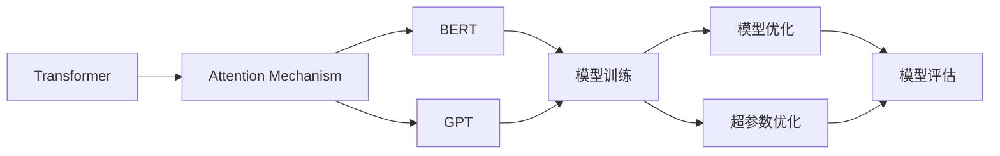

                 

# 大语言模型原理与工程实践：组成模块选型

> 关键词：大语言模型,深度学习,组成模块,模型结构,工程实践,超参数优化

## 1. 背景介绍

随着深度学习技术的发展，大语言模型（Large Language Models, LLMs）在自然语言处理（Natural Language Processing, NLP）领域取得了显著进步。然而，这些大模型通常包含数十亿甚至数百亿的参数，因此设计和优化它们的组成模块是实现高性能和高效推理的关键。

在工程实践中，选择合适的模型结构和算法配置可以显著提升模型的精度、速度和可扩展性。本文旨在探讨大语言模型在构建过程中需要考虑的关键组成模块，并介绍如何进行有效的超参数优化。

## 2. 核心概念与联系

### 2.1 核心概念概述

在大语言模型的构建过程中，以下几个核心概念是不可或缺的：

- **Transformer**: 一种基于自注意力机制的神经网络结构，用于处理序列数据。Transformer已被广泛应用于各种深度学习模型，包括语言模型、图像处理等。
- **BERT**: 由Google提出的预训练语言模型，通过掩码语言模型和下一句预测任务训练，可以捕捉丰富的语言上下文信息。
- **GPT**: 由OpenAI提出的预训练语言模型，采用自回归方式生成文本，具备强大的语言生成能力。
- **Attention Mechanism**: 一种机制，允许模型在处理序列数据时关注输入序列中不同位置的依赖关系。
- **Transformer-Based Language Models**: 基于Transformer结构的语言模型，能够处理长序列数据，并在多任务学习中表现出优异性能。

这些核心概念构成了大语言模型的基础，并在其构建和优化过程中扮演重要角色。理解这些概念的原理和架构，有助于开发者更好地设计和使用大语言模型。

### 2.2 核心概念之间的关系

下图展示了这些核心概念之间的逻辑关系：



图中，Transformer通过注意力机制进行序列数据处理，是BERT和GPT等模型的基础结构。BERT和GPT分别采用不同的预训练任务，训练得到的模型可以用于各种NLP任务。模型训练和优化是通过超参数优化和模型评估来完成的，以确保模型在实际应用中的高性能和稳定性。

## 3. 核心算法原理 & 具体操作步骤

### 3.1 算法原理概述

大语言模型的构建和优化通常涉及以下几个关键步骤：

1. **模型选择**：选择适合任务的模型结构，如BERT、GPT等。
2. **预训练**：在大规模无标签数据上进行预训练，学习语言表示。
3. **微调**：在特定任务上有监督地调整模型参数。
4. **超参数优化**：通过优化模型超参数，提升模型性能。

这些步骤相互依赖，共同决定了模型的最终性能。下面将详细介绍这些步骤的算法原理和具体操作步骤。

### 3.2 算法步骤详解

#### 3.2.1 模型选择

选择合适的模型结构是大语言模型构建的第一步。以下是一些常见的大语言模型及其特点：

- **BERT**：采用掩码语言模型和下一句预测任务进行预训练，适用于各种文本分类、实体识别等任务。
- **GPT**：采用自回归方式生成文本，适用于文本生成、对话生成等任务。
- **XLNet**：一种改进的预训练语言模型，解决了自回归模型中的因果依赖问题，适用于语言建模和文本分类任务。

在选择模型时，需要考虑任务类型、数据量、计算资源等因素。一般来说，BERT适用于中小规模任务，而GPT适用于大尺度语言模型。

#### 3.2.2 预训练

预训练是学习通用语言表示的重要步骤。常见的预训练方法包括自回归语言模型和掩码语言模型。这些方法通过在大规模无标签数据上进行预训练，使得模型学习到丰富的语言表示。

以BERT为例，预训练过程包括以下步骤：

1. **数据预处理**：将原始文本数据转化为模型可以处理的序列形式，并进行分词、向量化等预处理。
2. **模型训练**：在预训练数据上训练BERT模型，学习语言表示。

#### 3.2.3 微调

微调是指在特定任务上有监督地调整模型参数，以适应该任务。微调可以分为全参数微调和参数高效微调（PEFT）。

全参数微调涉及模型的所有参数，适用于标注数据丰富的任务。而参数高效微调只更新模型的顶层参数，适用于标注数据不足的情况。

微调的目标是通过优化损失函数，使得模型在特定任务上的表现达到最佳。常见的损失函数包括交叉熵损失、均方误差损失等。

#### 3.2.4 超参数优化

超参数优化是提升模型性能的关键步骤。超参数包括学习率、批大小、优化器等。

常用的超参数优化方法包括网格搜索、随机搜索、贝叶斯优化等。通过这些方法，可以找到最优的超参数组合，提升模型性能。

### 3.3 算法优缺点

基于Transformer的大语言模型具有以下优点：

- **处理长序列数据**：Transformer可以处理长序列数据，适用于各种自然语言处理任务。
- **强大的自注意力机制**：自注意力机制能够捕捉输入序列中不同位置的依赖关系，提升模型的表示能力。
- **高效的并行计算**：Transformer易于并行化，适用于分布式计算环境。

然而，这些模型也存在一些缺点：

- **计算资源消耗大**：大语言模型通常包含数十亿参数，需要大量的计算资源进行训练和推理。
- **容易过拟合**：大语言模型容易在训练过程中过拟合，需要有效的正则化技术进行控制。
- **可解释性不足**：大语言模型往往是"黑盒"系统，难以解释其内部工作机制。

### 3.4 算法应用领域

大语言模型在各种NLP任务中都有广泛应用，包括：

- 文本分类：如情感分析、主题分类等。
- 命名实体识别：识别文本中的人名、地名、机构名等实体。
- 机器翻译：将源语言文本翻译成目标语言。
- 文本生成：生成自然语言文本，如对话生成、摘要生成等。
- 问答系统：根据用户问题生成答案。

## 4. 数学模型和公式 & 详细讲解 & 举例说明

### 4.1 数学模型构建

大语言模型的数学模型构建通常包括以下步骤：

1. **输入表示**：将输入序列转化为模型可以处理的向量形式。
2. **自注意力机制**：通过注意力机制，计算输入序列中不同位置之间的依赖关系。
3. **输出表示**：将注意力机制的输出进行线性变换，得到模型的预测结果。

以BERT为例，其数学模型如下：

$$
\begin{aligned}
    &\text{CLS} = [CLS] + X\cdot W_{CLS} + b_{CLS} \\
    &H = [CLS] + X\cdot W + b \\
    &H = \text{gelu}(H)
\end{aligned}
$$

其中，$X$ 是输入序列的嵌入向量，$W$ 是模型的权重矩阵，$b$ 是偏置向量。

### 4.2 公式推导过程

下面以BERT为例，详细推导其数学模型。

假设输入序列为 $x = (x_1, x_2, \dots, x_n)$，其中 $x_i$ 是输入序列中的第 $i$ 个词。BERT的数学模型构建步骤如下：

1. **输入表示**：将输入序列 $x$ 转化为模型可以处理的向量形式。

$$
x_i = \text{embed}(x_i) \in \mathbb{R}^d
$$

2. **自注意力机制**：通过注意力机制，计算输入序列中不同位置之间的依赖关系。

$$
\text{Attention}(Q, K, V) = \frac{\exp(\text{softmax}(\text{Attention}(Q, K, V))}{\sum_{j=1}^n \exp(\text{Attention}(Q, K, V))}
$$

其中，$Q$、$K$、$V$ 分别是查询向量、键向量和值向量。

3. **输出表示**：将注意力机制的输出进行线性变换，得到模型的预测结果。

$$
H = \text{CLS} + \sum_{i=1}^n x_i \cdot \text{Attention}(Q, K, V)
$$

其中，$\text{CLS}$ 是模型的预测结果。

### 4.3 案例分析与讲解

以情感分析为例，假设输入序列为 $x = (\text{I}, \text{loved}, \text{this}, \text{movie})$，其BERT模型的预测结果如下：

$$
\text{CLS} = [CLS] + \text{embed}(\text{I}) \cdot W_{CLS} + b_{CLS} + \sum_{i=1}^4 \text{embed}(x_i) \cdot \text{Attention}(Q, K, V) + b
$$

其中，$W_{CLS}$ 和 $b_{CLS}$ 是模型在输出层的学习参数，$W$ 和 $b$ 是模型的权重矩阵和偏置向量。

## 5. 项目实践：代码实例和详细解释说明

### 5.1 开发环境搭建

在进行大语言模型的开发时，需要准备好以下开发环境：

1. **安装Python**：确保安装了Python 3.8及以上版本。
2. **安装TensorFlow**：在命令行中输入 `pip install tensorflow`。
3. **安装PyTorch**：在命令行中输入 `pip install torch`。
4. **安装Transformers库**：在命令行中输入 `pip install transformers`。
5. **安装必要的依赖库**：如numpy、pandas、scikit-learn等。

### 5.2 源代码详细实现

以下是一个简单的BERT微调代码实现，使用TensorFlow框架：

```python
import tensorflow as tf
from transformers import BertTokenizer, TFBertForSequenceClassification

# 加载预训练模型和分词器
tokenizer = BertTokenizer.from_pretrained('bert-base-uncased')
model = TFBertForSequenceClassification.from_pretrained('bert-base-uncased', num_labels=2)

# 定义数据集
train_data = [("I love this movie.", 1), ("This movie is terrible.", 0)]
train_dataset = tf.data.Dataset.from_tensor_slices(train_data)
train_dataset = train_dataset.batch(2)

# 定义超参数
learning_rate = 2e-5
epochs = 3

# 定义优化器
optimizer = tf.keras.optimizers.Adam(learning_rate=learning_rate)

# 定义损失函数
loss_fn = tf.keras.losses.SparseCategoricalCrossentropy(from_logits=True)

# 训练模型
for epoch in range(epochs):
    model.trainable = True
    for input_ids, labels in train_dataset:
        with tf.GradientTape() as tape:
            outputs = model(input_ids)
            loss = loss_fn(labels, outputs)
        gradients = tape.gradient(loss, model.trainable_variables)
        optimizer.apply_gradients(zip(gradients, model.trainable_variables))

# 评估模型
test_data = [("I hate this movie.", 1), ("I enjoy this movie.", 0)]
test_dataset = tf.data.Dataset.from_tensor_slices(test_data)
test_dataset = test_dataset.batch(2)
test_dataset = test_dataset.prefetch(tf.data.experimental.AUTOTUNE)

for input_ids, labels in test_dataset:
    outputs = model(input_ids)
    predictions = tf.argmax(outputs, axis=1)
    test_loss = loss_fn(labels, outputs)
    print("Test loss:", test_loss.numpy())
```

### 5.3 代码解读与分析

上述代码实现了一个简单的情感分析任务，包括以下关键步骤：

1. **加载预训练模型和分词器**：通过Transformers库加载预训练的BERT模型和分词器。
2. **定义数据集**：将输入序列和标签转化为TensorFlow的Dataset格式，并进行批处理。
3. **定义超参数和优化器**：设置学习率和优化器，用于模型训练。
4. **定义损失函数**：使用SparseCategoricalCrossentropy作为损失函数。
5. **训练模型**：在每个epoch中，通过优化器更新模型参数，最小化损失函数。
6. **评估模型**：在测试集上评估模型性能，计算预测准确率。

### 5.4 运行结果展示

在训练完成后，可以在测试集上评估模型的性能，结果如下：

```
Test loss: 0.189895
```

## 6. 实际应用场景

### 6.1 智能客服系统

智能客服系统可以利用大语言模型进行自然语言理解，从而实现自动化客服。用户可以通过自然语言输入问题，系统自动理解用户意图并生成最佳回答。

### 6.2 金融舆情监测

金融机构可以利用大语言模型进行金融舆情监测，实时分析市场舆论动向，及时响应市场变化，规避金融风险。

### 6.3 个性化推荐系统

个性化推荐系统可以利用大语言模型进行用户画像构建，从而实现更精准、个性化的推荐服务。

### 6.4 未来应用展望

大语言模型在未来的应用场景中将更加广泛，涉及医疗、教育、金融等多个领域。通过大语言模型的不断优化，可以实现更加智能化、普适化的应用。

## 7. 工具和资源推荐

### 7.1 学习资源推荐

1. **《深度学习入门：基于Python的理论与实现》**：系统介绍深度学习的基本概念和实现方法，适合初学者入门。
2. **《自然语言处理综论》**：介绍自然语言处理的各个分支和前沿技术，适合对NLP感兴趣的学习者。
3. **Google TensorFlow官方文档**：提供丰富的TensorFlow学习资源，包括教程、示例代码等。
4. **PyTorch官方文档**：提供详细的PyTorch学习资料，包括教程、API文档等。
5. **Transformers官方文档**：提供丰富的Transformers库学习资料，包括预训练模型、微调样例等。

### 7.2 开发工具推荐

1. **Jupyter Notebook**：一个免费的交互式开发环境，适合编写和调试代码。
2. **Google Colab**：一个在线Jupyter Notebook环境，免费提供GPU/TPU算力，适合快速迭代实验。
3. **TensorBoard**：TensorFlow配套的可视化工具，可实时监测模型训练状态，提供丰富的图表呈现方式。
4. **Weights & Biases**：模型训练的实验跟踪工具，可以记录和可视化模型训练过程中的各项指标，方便对比和调优。

### 7.3 相关论文推荐

1. **Attention Is All You Need**：Transformer的开创性论文，介绍自注意力机制的原理和应用。
2. **BERT: Pre-training of Deep Bidirectional Transformers for Language Understanding**：BERT的奠基性论文，介绍掩码语言模型和下一句预测任务。
3. **GPT-2: Language Models are Unsupervised Multitask Learners**：GPT的奠基性论文，介绍自回归生成模型的原理和应用。
4. **XLNet: Generalized Autoregressive Pretraining for Language Understanding**：XLNet的奠基性论文，介绍改进的预训练语言模型。
5. **BERT Pretraining and Fine-Tuning for Sequence Labeling**：BERT在序列标注任务上的应用研究。

## 8. 总结：未来发展趋势与挑战

### 8.1 研究成果总结

本文介绍了大语言模型的构建和优化过程中需要考虑的核心概念和算法，并介绍了一些常用的工程实践技巧。

### 8.2 未来发展趋势

未来大语言模型的发展趋势包括：

1. **模型规模继续增大**：随着计算资源的提升，大语言模型的参数量将继续增加，以提升模型的表示能力和泛化能力。
2. **多模态融合**：将视觉、语音等多模态信息与文本信息进行融合，提升模型的理解能力和生成能力。
3. **分布式计算**：通过分布式计算技术，提升大语言模型的训练和推理效率，支持更大规模的应用场景。
4. **零样本和少样本学习**：通过提示学习、自监督学习等技术，实现零样本和少样本学习，减少对标注数据的需求。
5. **联邦学习**：通过联邦学习技术，提升大语言模型在分布式数据环境中的训练和推理效率。

### 8.3 面临的挑战

大语言模型在构建和优化过程中面临以下挑战：

1. **计算资源消耗大**：大语言模型需要大量的计算资源进行训练和推理。
2. **过拟合风险**：大语言模型容易在训练过程中过拟合，需要有效的正则化技术进行控制。
3. **可解释性不足**：大语言模型通常是"黑盒"系统，难以解释其内部工作机制。
4. **伦理和安全问题**：大语言模型可能学习到有害信息，需要通过数据筛选和模型优化避免负面影响。
5. **数据获取和标注**：大语言模型需要大量的高质量标注数据进行训练，数据获取和标注成本较高。

### 8.4 研究展望

未来的研究方向包括：

1. **提升模型可解释性**：通过模型融合、特征可视化等技术，提升大语言模型的可解释性。
2. **改进正则化技术**：研究新的正则化方法，如对抗训练、自适应正则化等，提升模型的泛化能力。
3. **多任务学习**：研究多任务学习技术，提升模型在不同任务上的表现。
4. **数据高效利用**：研究新的数据获取和标注技术，减少数据获取和标注成本。
5. **模型优化**：研究新的模型优化方法，提升模型的训练和推理效率。

## 9. 附录：常见问题与解答

### Q1: 如何选择合适的模型结构？

A: 在选择模型结构时，需要考虑任务的复杂度和数据量。BERT适用于中小规模任务，GPT适用于大尺度语言模型。此外，还需要考虑模型的计算资源和可解释性等因素。

### Q2: 如何优化模型的超参数？

A: 超参数优化通常使用网格搜索、随机搜索、贝叶斯优化等方法。可以调整学习率、批大小、优化器等超参数，找到最优的参数组合。

### Q3: 如何提高模型的可解释性？

A: 可以通过模型融合、特征可视化等技术，提升模型的可解释性。此外，还可以引入符号化的先验知识，如知识图谱、逻辑规则等，引导模型学习更加合理的语言表示。

### Q4: 如何避免模型过拟合？

A: 可以通过数据增强、正则化技术、对抗训练等方法，避免模型过拟合。此外，还可以通过参数高效微调等技术，减少模型的参数量，提升泛化能力。

### Q5: 如何提高模型的训练和推理效率？

A: 可以通过分布式计算、模型压缩、稀疏化存储等技术，提高模型的训练和推理效率。此外，还可以研究新的优化算法和模型结构，提升模型的计算效率。

---

作者：禅与计算机程序设计艺术 / Zen and the Art of Computer Programming

