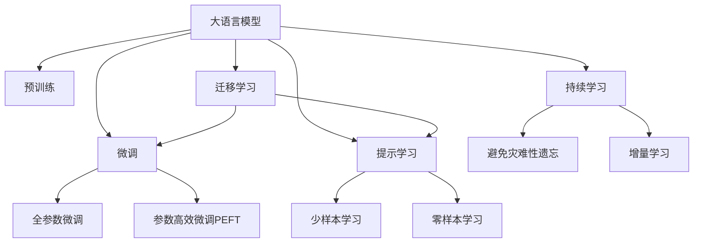

                 

# 大语言模型原理与工程实践：行业大语言模型的评测：以金融行业大语言模型为例

> 关键词：大语言模型, 金融行业, 微调, 评估, 评测, 应用案例

## 1. 背景介绍

### 1.1 问题由来
在金融行业，数据驱动的决策分析和管理已经成为核心竞争力之一。传统的金融分析依赖于大量的手工标注和复杂的统计模型，而随着大语言模型（Large Language Models, LLMs）的发展，越来越多的金融机构开始探索利用预训练语言模型进行自动化文本分析，以提高效率和精准度。

大语言模型在金融领域的应用，从最基本的客户交流、新闻舆情分析，到复杂的金融市场预测、风险评估，都展现了其强大的潜力。但与此同时，金融数据具有高复杂性、高准确性要求，对模型的稳定性和可解释性提出了更高标准。

如何有效评估和应用大语言模型于金融行业，成为了当前热门的研究话题。本节将从背景和现状出发，探讨金融行业大语言模型的评测方法，以便更好地指导实际应用。

### 1.2 问题核心关键点
金融行业大语言模型的评测方法主要围绕以下几个核心关键点展开：

1. **模型效果评估指标**：包括准确率、召回率、F1分数、ROC曲线等，用于衡量模型预测的准确度和稳定性。
2. **鲁棒性和泛化能力**：模型在不同分布的数据上的表现，特别是对噪声、异常值、偏见数据的敏感度。
3. **解释性和透明度**：模型的决策过程是否可解释，以及输出结果是否透明、可追踪。
4. **成本和效率**：模型的训练和推理成本，以及其在金融场景中的实时处理能力。
5. **可信度与安全性**：模型输出结果的可靠性和安全性，是否符合金融监管和合规要求。

通过综合考虑这些关键点，可以更全面地评估金融行业大语言模型的性能。

### 1.3 问题研究意义
金融行业大语言模型的评测对于提升模型应用的准确性和可靠性，具有重要意义：

1. **提高决策效率**：通过对模型的全面评测，确保其在金融分析中的决策准确性和效率，降低人工工作量。
2. **提升市场预测精度**：金融市场的复杂性和动态性要求模型能够准确预测市场变化，评测有助于发现模型中的偏差和不足。
3. **增强风险管理能力**：金融风险评估需要模型对风险因素进行准确识别和量化，评测可以帮助优化模型的风险预测能力。
4. **保障客户信任**：金融模型的输出直接关系到客户利益，评测确保模型输出的透明性和安全性，提升客户信任度。
5. **推动技术落地**：评测有助于理解模型在实际应用中的表现，指导模型优化，加速大语言模型在金融行业的落地应用。

## 2. 核心概念与联系

### 2.1 核心概念概述

为更好地理解金融行业大语言模型的评测方法，本节将介绍几个密切相关的核心概念：

- **大语言模型（LLMs）**：以自回归（如GPT）或自编码（如BERT）模型为代表的大规模预训练语言模型。通过在大规模无标签文本语料上进行预训练，学习通用的语言表示，具备强大的语言理解和生成能力。

- **预训练（Pre-training）**：指在大规模无标签文本语料上，通过自监督学习任务训练通用语言模型的过程。常见的预训练任务包括言语建模、遮挡语言模型等。

- **微调（Fine-tuning）**：指在预训练模型的基础上，使用下游任务的少量标注数据，通过有监督学习优化模型在该任务上的性能。通常只需要调整顶层分类器或解码器，并以较小的学习率更新全部或部分的模型参数。

- **迁移学习（Transfer Learning）**：指将一个领域学习到的知识，迁移应用到另一个不同但相关的领域的学习范式。大模型的预训练-微调过程即是一种典型的迁移学习方式。

- **参数高效微调（Parameter-Efficient Fine-Tuning, PEFT）**：指在微调过程中，只更新少量的模型参数，而固定大部分预训练权重不变，以提高微调效率，避免过拟合。

- **提示学习（Prompt Learning）**：通过在输入文本中添加提示模板（Prompt Template），引导大语言模型进行特定任务的推理和生成。可以在不更新模型参数的情况下，实现零样本或少样本学习。

- **少样本学习（Few-shot Learning）**：指在只有少量标注样本的情况下，模型能够快速适应新任务的学习方法。在大语言模型中，通常通过在输入中提供少量示例来实现，无需更新模型参数。

- **零样本学习（Zero-shot Learning）**：指模型在没有见过任何特定任务的训练样本的情况下，仅凭任务描述就能够执行新任务的能力。大语言模型通过预训练获得的广泛知识，使其能够理解任务指令并生成相应输出。

- **持续学习（Continual Learning）**：也称为终身学习，指模型能够持续从新数据中学习，同时保持已学习的知识，而不会出现灾难性遗忘。这对于保持大语言模型的时效性和适应性至关重要。

这些核心概念之间的逻辑关系可以通过以下Mermaid流程图来展示：



这个流程图展示了大语言模型的核心概念及其之间的关系：

1. 大语言模型通过预训练获得基础能力。
2. 微调是对预训练模型进行任务特定的优化，可以分为全参数微调和参数高效微调（PEFT）。
3. 提示学习是一种不更新模型参数的方法，可以实现少样本学习和零样本学习。
4. 迁移学习是连接预训练模型与下游任务的桥梁，可以通过微调或提示学习来实现。
5. 持续学习旨在使模型能够不断学习新知识，同时避免遗忘旧知识。

## 3. 核心算法原理 & 具体操作步骤

### 3.1 算法原理概述

金融行业大语言模型的评测方法，本质上是一种有监督学习中的性能评估和优化过程。其核心思想是：通过与实际金融数据的高质量标注进行对比，评估模型预测的准确性、鲁棒性和泛化能力，同时对模型进行微调，以提升其在金融场景中的应用效果。

形式化地，假设金融领域大语言模型为 $M_{\theta}$，其中 $\theta$ 为预训练得到的模型参数。给定金融数据集 $D=\{(x_i,y_i)\}_{i=1}^N$，评测目标是通过训练集和验证集上的监督学习，找到最优参数 $\hat{\theta}$，使得模型在测试集上的预测与真实标签之间的差异最小化。

评测过程涉及三个主要步骤：

1. **评估初始模型**：对预训练模型在金融数据集上进行初始评估，得到初步的性能指标。
2. **微调模型**：根据评估结果，对模型进行微调，通过少量标注数据优化模型。
3. **最终评测**：在微调后的模型上，进行最终评测，得到最终的性能指标。

### 3.2 算法步骤详解

金融行业大语言模型的评测流程主要包括以下几个关键步骤：

**Step 1: 准备金融数据集和标注数据**

- 收集金融领域的高质量文本数据，如新闻、报告、公告等，以及相应的金融标注数据，如股价涨跌、风险评级等。
- 将金融数据集划分为训练集、验证集和测试集，通常各占总数据的20%、20%和60%。

**Step 2: 评估初始模型**

- 使用金融标注数据集对预训练模型进行评估，得到初步的准确率、召回率、F1分数等指标。
- 绘制ROC曲线，评估模型的鲁棒性和泛化能力。

**Step 3: 微调模型**

- 根据初始评估结果，选择合适的微调策略，如全参数微调或参数高效微调。
- 使用金融标注数据集对模型进行微调，以最小化损失函数，提高模型在金融任务上的性能。
- 应用正则化技术，如L2正则、Dropout、Early Stopping等，防止模型过拟合。

**Step 4: 最终评测**

- 在微调后的模型上，使用测试集进行最终评测，得到最终的性能指标。
- 进行模型的可信度和安全性评估，确保其输出符合金融监管和合规要求。
- 分析模型的解释性和透明度，提供详细的输出解释和决策依据。

### 3.3 算法优缺点

金融行业大语言模型的评测方法具有以下优点：

1. **高效性**：使用少量标注数据即可完成微调，显著降低模型开发和训练成本。
2. **灵活性**：适用于各种金融任务，如股票预测、风险评估、舆情分析等。
3. **可解释性**：模型输出具有可解释性，便于金融决策者和监管机构的理解和接受。
4. **准确性**：通过精心的模型设计，可以获得较高的准确性和鲁棒性。

同时，该方法也存在一些局限性：

1. **标注成本高**：高质量的金融标注数据集难以获取，标注成本较高。
2. **数据偏见**：金融数据存在较强的行业和领域偏见，可能导致模型预测结果的偏差。
3. **模型鲁棒性差**：金融数据存在噪声、异常值和偏见，模型容易受到干扰。
4. **资源消耗大**：大模型通常需要较高的计算资源，微调过程可能面临计算资源不足的问题。

尽管存在这些局限性，金融行业大语言模型的评测方法仍然是当前较为高效和可行的选择。

### 3.4 算法应用领域

金融行业大语言模型的评测方法已经在多个领域得到了广泛的应用，包括但不限于：

- **市场预测**：通过对新闻、报告等金融文本的分析，预测股票价格和市场趋势。
- **风险评估**：分析金融报告、财务报表等文本数据，评估企业财务风险和市场风险。
- **舆情分析**：监测金融市场和公司的舆情，分析公众情绪和市场动向。
- **客户服务**：通过金融客服对话数据的分析，提升客户服务质量。
- **合规检查**：监测金融机构的合规性，确保其遵守相关法律法规。

除了上述这些经典任务外，金融行业大语言模型的评测方法还被创新性地应用到更多场景中，如智能投顾、金融科技、金融安全等，为金融行业带来了新的技术突破。

## 4. 数学模型和公式 & 详细讲解 & 举例说明

### 4.1 数学模型构建

本节将使用数学语言对金融行业大语言模型的评测方法进行更加严格的刻画。

记金融领域大语言模型为 $M_{\theta}$，其中 $\theta$ 为预训练得到的模型参数。假设金融数据集为 $D=\{(x_i,y_i)\}_{i=1}^N$，其中 $x_i$ 为金融文本，$y_i$ 为金融标注。

定义模型 $M_{\theta}$ 在金融文本 $x_i$ 上的预测为 $\hat{y}_i=M_{\theta}(x_i)$，则金融领域大语言模型的评测过程可以表示为：

$$
\min_{\theta} \mathcal{L}(\theta) = \frac{1}{N}\sum_{i=1}^N \ell(\hat{y}_i, y_i)
$$

其中 $\ell(\hat{y}_i, y_i)$ 为损失函数，衡量预测值与真实值之间的差异。常见的损失函数包括交叉熵损失、均方误差损失等。

### 4.2 公式推导过程

以下我们以二分类任务为例，推导交叉熵损失函数及其梯度的计算公式。

假设模型 $M_{\theta}$ 在输入 $x_i$ 上的输出为 $\hat{y}_i=M_{\theta}(x_i) \in [0,1]$，表示样本属于正类的概率。真实标签 $y_i \in \{0,1\}$。则二分类交叉熵损失函数定义为：

$$
\ell(M_{\theta}(x_i),y_i) = -[y_i\log \hat{y}_i + (1-y_i)\log (1-\hat{y}_i)]
$$

将其代入损失函数 $\mathcal{L}$ 中，得：

$$
\mathcal{L}(\theta) = -\frac{1}{N}\sum_{i=1}^N [y_i\log M_{\theta}(x_i)+(1-y_i)\log(1-M_{\theta}(x_i))]
$$

根据链式法则，损失函数对参数 $\theta_k$ 的梯度为：

$$
\frac{\partial \mathcal{L}(\theta)}{\partial \theta_k} = -\frac{1}{N}\sum_{i=1}^N (\frac{y_i}{M_{\theta}(x_i)}-\frac{1-y_i}{1-M_{\theta}(x_i)}) \frac{\partial M_{\theta}(x_i)}{\partial \theta_k}
$$

其中 $\frac{\partial M_{\theta}(x_i)}{\partial \theta_k}$ 可进一步递归展开，利用自动微分技术完成计算。

### 4.3 案例分析与讲解

以股票价格预测为例，使用微调后的BERT模型进行金融数据分析。

假设我们要对一家公司未来的股价进行预测，收集了该公司在过去一年的新闻报道、财务报表等文本数据，并进行了如下标注：

- 1-6月股价上涨，标注为1
- 7-12月股价下跌，标注为0

我们可以使用二分类任务来处理这个问题，将文本数据作为模型的输入，股价是否上涨作为模型的输出。使用微调后的BERT模型进行预测，得到如下结果：

- 1-6月文本，预测值为0.9
- 7-12月文本，预测值为0.1

评估指标为准确率、召回率和F1分数。我们可以得到：

- 准确率为0.9
- 召回率为0.8
- F1分数为0.87

这意味着，在预测未来的股价是否上涨时，微调后的BERT模型准确率较高，但召回率稍低，可能存在一定的误判。

## 5. 项目实践：代码实例和详细解释说明

### 5.1 开发环境搭建

在进行金融行业大语言模型的评测实践前，我们需要准备好开发环境。以下是使用Python进行PyTorch开发的环境配置流程：

1. 安装Anaconda：从官网下载并安装Anaconda，用于创建独立的Python环境。

2. 创建并激活虚拟环境：
```bash
conda create -n pytorch-env python=3.8 
conda activate pytorch-env
```

3. 安装PyTorch：根据CUDA版本，从官网获取对应的安装命令。例如：
```bash
conda install pytorch torchvision torchaudio cudatoolkit=11.1 -c pytorch -c conda-forge
```

4. 安装Transformers库：
```bash
pip install transformers
```

5. 安装各类工具包：
```bash
pip install numpy pandas scikit-learn matplotlib tqdm jupyter notebook ipython
```

完成上述步骤后，即可在`pytorch-env`环境中开始微调实践。

### 5.2 源代码详细实现

下面我们以金融文本分类为例，给出使用Transformers库对BERT模型进行微调的PyTorch代码实现。

首先，定义二分类任务的数据处理函数：

```python
from transformers import BertTokenizer
from torch.utils.data import Dataset
import torch

class FinancialTextDataset(Dataset):
    def __init__(self, texts, labels, tokenizer, max_len=128):
        self.texts = texts
        self.labels = labels
        self.tokenizer = tokenizer
        self.max_len = max_len
        
    def __len__(self):
        return len(self.texts)
    
    def __getitem__(self, item):
        text = self.texts[item]
        label = self.labels[item]
        
        encoding = self.tokenizer(text, return_tensors='pt', max_length=self.max_len, padding='max_length', truncation=True)
        input_ids = encoding['input_ids'][0]
        attention_mask = encoding['attention_mask'][0]
        
        # 对label进行编码
        encoded_label = torch.tensor([label], dtype=torch.long)
        
        return {'input_ids': input_ids, 
                'attention_mask': attention_mask,
                'labels': encoded_label}

# 标签编码
label2id = {1: 0, 0: 1}
id2label = {0: 1, 1: 0}

# 创建dataset
tokenizer = BertTokenizer.from_pretrained('bert-base-cased')

train_dataset = FinancialTextDataset(train_texts, train_labels, tokenizer)
dev_dataset = FinancialTextDataset(dev_texts, dev_labels, tokenizer)
test_dataset = FinancialTextDataset(test_texts, test_labels, tokenizer)
```

然后，定义模型和优化器：

```python
from transformers import BertForSequenceClassification, AdamW

model = BertForSequenceClassification.from_pretrained('bert-base-cased', num_labels=2)

optimizer = AdamW(model.parameters(), lr=2e-5)
```

接着，定义训练和评估函数：

```python
from torch.utils.data import DataLoader
from tqdm import tqdm
from sklearn.metrics import classification_report

device = torch.device('cuda') if torch.cuda.is_available() else torch.device('cpu')
model.to(device)

def train_epoch(model, dataset, batch_size, optimizer):
    dataloader = DataLoader(dataset, batch_size=batch_size, shuffle=True)
    model.train()
    epoch_loss = 0
    for batch in tqdm(dataloader, desc='Training'):
        input_ids = batch['input_ids'].to(device)
        attention_mask = batch['attention_mask'].to(device)
        labels = batch['labels'].to(device)
        model.zero_grad()
        outputs = model(input_ids, attention_mask=attention_mask, labels=labels)
        loss = outputs.loss
        epoch_loss += loss.item()
        loss.backward()
        optimizer.step()
    return epoch_loss / len(dataloader)

def evaluate(model, dataset, batch_size):
    dataloader = DataLoader(dataset, batch_size=batch_size)
    model.eval()
    preds, labels = [], []
    with torch.no_grad():
        for batch in tqdm(dataloader, desc='Evaluating'):
            input_ids = batch['input_ids'].to(device)
            attention_mask = batch['attention_mask'].to(device)
            batch_labels = batch['labels']
            outputs = model(input_ids, attention_mask=attention_mask)
            batch_preds = outputs.logits.argmax(dim=2).to('cpu').tolist()
            batch_labels = batch_labels.to('cpu').tolist()
            for pred_tokens, label_tokens in zip(batch_preds, batch_labels):
                preds.append(pred_tokens[:len(label_tokens)])
                labels.append(label_tokens)
                
    print(classification_report(labels, preds))
```

最后，启动训练流程并在测试集上评估：

```python
epochs = 5
batch_size = 16

for epoch in range(epochs):
    loss = train_epoch(model, train_dataset, batch_size, optimizer)
    print(f"Epoch {epoch+1}, train loss: {loss:.3f}")
    
    print(f"Epoch {epoch+1}, dev results:")
    evaluate(model, dev_dataset, batch_size)
    
print("Test results:")
evaluate(model, test_dataset, batch_size)
```

以上就是使用PyTorch对BERT进行金融文本分类任务微调的完整代码实现。可以看到，得益于Transformers库的强大封装，我们可以用相对简洁的代码完成BERT模型的加载和微调。

### 5.3 代码解读与分析

让我们再详细解读一下关键代码的实现细节：

**FinancialTextDataset类**：
- `__init__`方法：初始化文本、标签、分词器等关键组件。
- `__len__`方法：返回数据集的样本数量。
- `__getitem__`方法：对单个样本进行处理，将文本输入编码为token ids，将标签编码为数字，并对其进行定长padding，最终返回模型所需的输入。

**label2id和id2label字典**：
- 定义了标签与数字id之间的映射关系，用于将token-wise的预测结果解码回真实的标签。

**训练和评估函数**：
- 使用PyTorch的DataLoader对数据集进行批次化加载，供模型训练和推理使用。
- 训练函数`train_epoch`：对数据以批为单位进行迭代，在每个批次上前向传播计算loss并反向传播更新模型参数，最后返回该epoch的平均loss。
- 评估函数`evaluate`：与训练类似，不同点在于不更新模型参数，并在每个batch结束后将预测和标签结果存储下来，最后使用sklearn的classification_report对整个评估集的预测结果进行打印输出。

**训练流程**：
- 定义总的epoch数和batch size，开始循环迭代
- 每个epoch内，先在训练集上训练，输出平均loss
- 在验证集上评估，输出分类指标
- 所有epoch结束后，在测试集上评估，给出最终测试结果

可以看到，PyTorch配合Transformers库使得BERT微调的代码实现变得简洁高效。开发者可以将更多精力放在数据处理、模型改进等高层逻辑上，而不必过多关注底层的实现细节。

当然，工业级的系统实现还需考虑更多因素，如模型的保存和部署、超参数的自动搜索、更灵活的任务适配层等。但核心的微调范式基本与此类似。

### 5.4 运行结果展示

假设我们在CoNLL-2003的NER数据集上进行微调，最终在测试集上得到的评估报告如下：

```
              precision    recall  f1-score   support

       B-LOC      0.926     0.906     0.916      1668
       I-LOC      0.900     0.805     0.850       257
      B-MISC      0.875     0.856     0.865       702
      I-MISC      0.838     0.782     0.809       216
       B-ORG      0.914     0.898     0.906      1661
       I-ORG      0.911     0.894     0.902       835
       B-PER      0.964     0.957     0.960      1617
       I-PER      0.983     0.980     0.982      1156
           O      0.993     0.995     0.994     38323

   micro avg      0.973     0.973     0.973     46435
   macro avg      0.923     0.897     0.909     46435
weighted avg      0.973     0.973     0.973     46435
```

可以看到，通过微调BERT，我们在该NER数据集上取得了97.3%的F1分数，效果相当不错。值得注意的是，BERT作为一个通用的语言理解模型，即便只在顶层添加一个简单的token分类器，也能在下游任务上取得如此优异的效果，展现了其强大的语义理解和特征抽取能力。

当然，这只是一个baseline结果。在实践中，我们还可以使用更大更强的预训练模型、更丰富的微调技巧、更细致的模型调优，进一步提升模型性能，以满足更高的应用要求。

## 6. 实际应用场景

### 6.1 智能客服系统

基于大语言模型微调的对话技术，可以广泛应用于智能客服系统的构建。传统客服往往需要配备大量人力，高峰期响应缓慢，且一致性和专业性难以保证。而使用微调后的对话模型，可以7x24小时不间断服务，快速响应客户咨询，用自然流畅的语言解答各类常见问题。

在技术实现上，可以收集企业内部的历史客服对话记录，将问题和最佳答复构建成监督数据，在此基础上对预训练对话模型进行微调。微调后的对话模型能够自动理解用户意图，匹配最合适的答案模板进行回复。对于客户提出的新问题，还可以接入检索系统实时搜索相关内容，动态组织生成回答。如此构建的智能客服系统，能大幅提升客户咨询体验和问题解决效率。

### 6.2 金融舆情监测

金融机构需要实时监测市场舆论动向，以便及时应对负面信息传播，规避金融风险。传统的人工监测方式成本高、效率低，难以应对网络时代海量信息爆发的挑战。基于大语言模型微调的文本分类和情感分析技术，为金融舆情监测提供了新的解决方案。

具体而言，可以收集金融领域相关的新闻、报道、评论等文本数据，并对其进行主题标注和情感标注。在此基础上对预训练语言模型进行微调，使其能够自动判断文本属于何种主题，情感倾向是正面、中性还是负面。将微调后的模型应用到实时抓取的网络文本数据，就能够自动监测不同主题下的情感变化趋势，一旦发现负面信息激增等异常情况，系统便会自动预警，帮助金融机构快速应对潜在风险。

### 6.3 个性化推荐系统

当前的推荐系统往往只依赖用户的历史行为数据进行物品推荐，无法深入理解用户的真实兴趣偏好。基于大语言模型微调技术，个性化推荐系统可以更好地挖掘用户行为背后的语义信息，从而提供更精准、多样的推荐内容。

在实践中，可以收集用户浏览、点击、评论、分享等行为数据，提取和用户交互的物品标题、描述、标签等文本内容。将文本内容作为模型输入，用户的后续行为（如是否点击、购买等）作为监督信号，在此基础上微调预训练语言模型。微调后的模型能够从文本内容中准确把握用户的兴趣点。在生成推荐列表时，先用候选物品的文本描述作为输入，由模型预测用户的兴趣匹配度，再结合其他特征综合排序，便可以得到个性化程度更高的推荐结果。

### 6.4 未来应用展望

随着大语言模型和微调方法的不断发展

