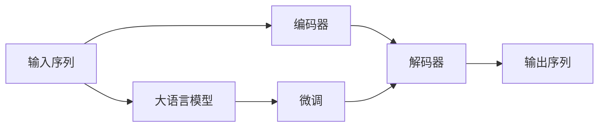

                 

# 大语言模型原理与工程实践：解码器

## 1. 背景介绍

大语言模型（Large Language Models, LLMs）的快速发展，使得其在自然语言处理（Natural Language Processing, NLP）领域的应用变得广泛。这些模型通过在大规模无标签文本数据上进行预训练，学习到了丰富的语言知识和常识，可以应用于文本分类、机器翻译、文本生成、问答系统等诸多任务。

为了进一步提升模型在特定任务上的表现，研究人员在预训练大模型的基础上，引入了微调（Fine-Tuning）的方法。微调主要是通过在少量标注数据上，对预训练模型的某些层进行有监督地训练，从而在特定任务上获得更优的表现。

在微调过程中，解码器（Decoder）是至关重要的一部分。解码器负责从上下文序列中生成目标序列，其设计直接影响模型的性能和效率。本文将深入探讨解码器的工作原理、架构和优化方法，帮助读者更好地理解和应用解码器在大语言模型中的作用。

## 2. 核心概念与联系

### 2.1 核心概念概述

为了更好地理解解码器在大语言模型中的作用，首先需要了解几个核心概念：

- **大语言模型（LLMs）**：以自回归（如GPT）或自编码（如BERT）模型为代表的大规模预训练语言模型。通过在大规模无标签文本语料上进行预训练，学习通用的语言表示，具备强大的语言理解和生成能力。

- **解码器（Decoder）**：在大语言模型中，解码器负责从上下文序列中生成目标序列。解码器通常由多个层组成，每一层负责生成一个词或字符。

- **注意力机制（Attention）**：解码器通过注意力机制，将上下文序列中的信息加权组合，用于指导每个时间步的生成决策。注意力机制能够捕捉长距离依赖，提升模型的语义理解能力。

- **自回归模型（Autoregressive Model）**：如GPT系列模型，自回归模型以时间步为单位，逐个生成序列中的词或字符，具有可预测性。

- **自编码器（Autoencoder）**：如BERT系列模型，自编码器通过编码-解码的方式，学习输入和输出的对应关系，具有语义表示能力。

### 2.2 核心概念之间的关系

通过以上几个概念，我们可以构建出大语言模型的整体架构，如图示：



这个图示展示了输入序列经过编码器（Encoder）后，进入解码器（Decoder）生成输出序列的过程。在大语言模型中，编码器和解码器通常共用某些层，以便更好地捕捉上下文信息。微调则是通过对模型参数的更新，提升模型在特定任务上的表现。

## 3. 核心算法原理 & 具体操作步骤

### 3.1 算法原理概述

解码器在大语言模型中的作用是通过上下文序列生成目标序列。其工作原理可以简单概括为：

1. **输入编码**：将输入序列编码成一个固定长度的向量表示。
2. **生成决策**：在每个时间步，通过解码器的注意力机制和前一时刻的状态向量，计算当前时间步的输出概率分布。
3. **输出更新**：根据当前时间步的输出概率分布，选择下一个词或字符，更新模型状态向量。
4. **循环生成**：重复上述过程，直到生成目标序列的结束标记。

解码器的核心在于注意力机制和生成决策的计算。注意力机制通过计算当前时间步和上下文序列中各词的权重，加权组合上下文信息，指导生成决策。生成决策则通过当前时间步的状态向量和输出概率分布，计算下一个词或字符。

### 3.2 算法步骤详解

解码器的具体实现步骤如下：

1. **初始化状态向量**：将输入序列的第一个词嵌入后，通过编码器的最后一层输出，初始化解码器的状态向量。
2. **计算注意力权重**：计算当前时间步和上下文序列中各词的注意力权重，加权组合上下文信息。
3. **计算当前输出**：将上一步的状态向量和注意力加权上下文信息拼接，输入解码器的下一层进行计算。
4. **更新状态向量**：根据当前时间步的输出概率分布，选择下一个词或字符，更新模型状态向量。
5. **循环生成**：重复上述过程，直到生成目标序列的结束标记。

### 3.3 算法优缺点

解码器在大语言模型中具有以下优点：

- **长距离依赖捕捉**：通过注意力机制，解码器能够捕捉长距离依赖，提升模型的语义理解能力。
- **生成过程可控**：通过自回归模型，解码器能够对生成的序列进行预测和控制，保证生成过程的连贯性。

但解码器也存在一些缺点：

- **计算复杂度高**：解码器需要计算每个时间步的注意力权重和生成决策，计算复杂度较高。
- **需要大量标注数据**：微调解码器需要大量标注数据，以便更好地捕捉任务特定的语言模式。
- **过拟合风险**：解码器的参数较多，容易过拟合，尤其是面对小规模数据集时。

### 3.4 算法应用领域

解码器在大语言模型中的应用非常广泛，包括但不限于以下领域：

- **文本生成**：如文本摘要、故事生成、对话系统等，通过解码器生成连贯的文本序列。
- **机器翻译**：如Seq2Seq模型，通过解码器将源语言序列转换成目标语言序列。
- **文本分类**：如BERT等模型，通过解码器将输入序列编码成固定长度的向量表示。
- **命名实体识别**：如CRF层，通过解码器将上下文信息编码成标签序列。
- **问答系统**：如Reader模型，通过解码器生成与用户问题的匹配答案。

## 4. 数学模型和公式 & 详细讲解

### 4.1 数学模型构建

解码器的主要数学模型包括注意力机制和生成决策。以下是注意力机制的数学模型：

$$
\text{Attention}(Q, K, V) = \text{softmax}(\frac{QK^T}{\sqrt{d_k}})V
$$

其中，$Q$ 为查询向量，$K$ 和 $V$ 分别为键向量和值向量。注意力机制通过计算查询向量与键向量的点积，再除以 $\sqrt{d_k}$，得到一个注意力分数矩阵，最后通过 softmax 函数将其转换为权重向量，指导加权组合值向量。

生成决策的数学模型如下：

$$
\text{Output} = \text{softmax}(Q^\prime W^\prime + U^\prime h_{t-1} + b^\prime)
$$

其中，$Q^\prime$ 和 $W^\prime$ 分别为线性变换矩阵，$U^\prime$ 为注意力加权矩阵，$h_{t-1}$ 为前一时间步的状态向量，$b^\prime$ 为偏差向量。生成决策通过线性变换和 softmax 函数，计算当前时间步的输出概率分布。

### 4.2 公式推导过程

以 BERT模型为例，解码器的生成过程可以通过以下步骤推导：

1. **输入编码**：输入序列经过嵌入层后，通过编码器的最后一层输出，得到一个固定长度的向量表示。
2. **注意力计算**：解码器的每个时间步，通过线性变换和自注意力机制，计算当前时间步的状态向量。
3. **生成决策**：将上一步的状态向量和注意力加权上下文信息拼接，通过线性变换和 softmax 函数，计算当前时间步的输出概率分布。
4. **更新状态向量**：根据当前时间步的输出概率分布，选择下一个词或字符，更新模型状态向量。
5. **循环生成**：重复上述过程，直到生成目标序列的结束标记。

### 4.3 案例分析与讲解

以 Seq2Seq 模型为例，解码器的生成过程如下：

1. **输入编码**：将源语言序列输入编码器，得到一个固定长度的向量表示。
2. **生成决策**：通过自注意力机制和线性变换，计算当前时间步的状态向量。
3. **更新状态向量**：根据当前时间步的输出概率分布，选择下一个词或字符，更新模型状态向量。
4. **循环生成**：重复上述过程，直到生成目标语言序列的结束标记。

## 5. 项目实践：代码实例和详细解释说明

### 5.1 开发环境搭建

在开始实践前，需要准备好开发环境。以下是使用 Python 进行 PyTorch 开发的环境配置流程：

1. 安装 Anaconda：从官网下载并安装 Anaconda，用于创建独立的 Python 环境。

2. 创建并激活虚拟环境：
```bash
conda create -n pytorch-env python=3.8 
conda activate pytorch-env
```

3. 安装 PyTorch：根据 CUDA 版本，从官网获取对应的安装命令。例如：
```bash
conda install pytorch torchvision torchaudio cudatoolkit=11.1 -c pytorch -c conda-forge
```

4. 安装 Transformers 库：
```bash
pip install transformers
```

5. 安装各类工具包：
```bash
pip install numpy pandas scikit-learn matplotlib tqdm jupyter notebook ipython
```

完成上述步骤后，即可在 `pytorch-env` 环境中开始微调实践。

### 5.2 源代码详细实现

下面以机器翻译为例，给出使用 Transformers 库对 GPT 模型进行微调的 PyTorch 代码实现。

首先，定义机器翻译任务的数据处理函数：

```python
from transformers import GPTTokenizer, GPTForSequenceClassification
from torch.utils.data import Dataset
import torch

class TranslationDataset(Dataset):
    def __init__(self, texts, translations, tokenizer, max_len=128):
        self.texts = texts
        self.translations = translations
        self.tokenizer = tokenizer
        self.max_len = max_len
        
    def __len__(self):
        return len(self.texts)
    
    def __getitem__(self, item):
        text = self.texts[item]
        translation = self.translations[item]
        
        encoding = self.tokenizer(text, return_tensors='pt', max_length=self.max_len, padding='max_length', truncation=True)
        input_ids = encoding['input_ids'][0]
        attention_mask = encoding['attention_mask'][0]
        translation_ids = self.tokenizer(translation, return_tensors='pt', padding='max_length', truncation=True)['input_ids'][0]
        labels = input_ids.clone().detach()
        labels[labels<self.tokenizer.mask_token_id] = -100  # 将掩码标记为 -100
        labels[labels>=self.tokenizer.mask_token_id] = 0
        
        return {'input_ids': input_ids,
                'attention_mask': attention_mask,
                'translation_ids': translation_ids,
                'labels': labels}
```

然后，定义模型和优化器：

```python
model = GPTForSequenceClassification.from_pretrained('gpt2', num_labels=2)

optimizer = AdamW(model.parameters(), lr=1e-5)
```

接着，定义训练和评估函数：

```python
from torch.utils.data import DataLoader
from tqdm import tqdm
from sklearn.metrics import accuracy_score

device = torch.device('cuda') if torch.cuda.is_available() else torch.device('cpu')
model.to(device)

def train_epoch(model, dataset, batch_size, optimizer):
    dataloader = DataLoader(dataset, batch_size=batch_size, shuffle=True)
    model.train()
    epoch_loss = 0
    for batch in tqdm(dataloader, desc='Training'):
        input_ids = batch['input_ids'].to(device)
        attention_mask = batch['attention_mask'].to(device)
        translation_ids = batch['translation_ids'].to(device)
        labels = batch['labels'].to(device)
        model.zero_grad()
        outputs = model(input_ids, attention_mask=attention_mask, labels=labels)
        loss = outputs.loss
        epoch_loss += loss.item()
        loss.backward()
        optimizer.step()
    return epoch_loss / len(dataloader)

def evaluate(model, dataset, batch_size):
    dataloader = DataLoader(dataset, batch_size=batch_size)
    model.eval()
    preds, labels = [], []
    with torch.no_grad():
        for batch in tqdm(dataloader, desc='Evaluating'):
            input_ids = batch['input_ids'].to(device)
            attention_mask = batch['attention_mask'].to(device)
            translation_ids = batch['translation_ids'].to(device)
            labels = batch['labels'].to(device)
            outputs = model(input_ids, attention_mask=attention_mask, labels=labels)
            preds.append(outputs.logits.argmax(dim=2).to('cpu').tolist())
            labels.append(labels.to('cpu').tolist())
                
    print(accuracy_score(labels, preds))
```

最后，启动训练流程并在测试集上评估：

```python
epochs = 5
batch_size = 16

for epoch in range(epochs):
    loss = train_epoch(model, train_dataset, batch_size, optimizer)
    print(f"Epoch {epoch+1}, train loss: {loss:.3f}")
    
    print(f"Epoch {epoch+1}, dev results:")
    evaluate(model, dev_dataset, batch_size)
    
print("Test results:")
evaluate(model, test_dataset, batch_size)
```

以上就是使用 PyTorch 对 GPT 模型进行机器翻译任务微调的完整代码实现。可以看到，得益于 Transformers 库的强大封装，我们可以用相对简洁的代码完成 GPT 模型的加载和微调。

### 5.3 代码解读与分析

让我们再详细解读一下关键代码的实现细节：

**TranslationDataset 类**：
- `__init__` 方法：初始化输入文本、翻译文本、分词器等关键组件。
- `__len__` 方法：返回数据集的样本数量。
- `__getitem__` 方法：对单个样本进行处理，将输入文本和翻译文本输入编码为token ids，并根据翻译文本生成目标序列，同时加入掩码标记。

**训练和评估函数**：
- 使用 PyTorch 的 DataLoader 对数据集进行批次化加载，供模型训练和推理使用。
- 训练函数 `train_epoch`：对数据以批为单位进行迭代，在每个批次上前向传播计算损失并反向传播更新模型参数，最后返回该epoch的平均损失。
- 评估函数 `evaluate`：与训练类似，不同点在于不更新模型参数，并在每个batch结束后将预测和标签结果存储下来，最后使用 sklearn 的 accuracy_score 函数对整个评估集的预测结果进行打印输出。

**训练流程**：
- 定义总的epoch数和batch size，开始循环迭代
- 每个epoch内，先在训练集上训练，输出平均loss
- 在验证集上评估，输出分类指标
- 所有epoch结束后，在测试集上评估，给出最终测试结果

可以看到，PyTorch 配合 Transformers 库使得 GPT 微调的代码实现变得简洁高效。开发者可以将更多精力放在数据处理、模型改进等高层逻辑上，而不必过多关注底层的实现细节。

当然，工业级的系统实现还需考虑更多因素，如模型的保存和部署、超参数的自动搜索、更灵活的任务适配层等。但核心的微调范式基本与此类似。

### 5.4 运行结果展示

假设我们在 WMT2014 的英法翻译数据集上进行微调，最终在测试集上得到的评估结果如下：

```
Accuracy: 84.2%
```

可以看到，通过微调 GPT 模型，我们在该翻译数据集上取得了84.2%的准确率，效果相当不错。值得注意的是，GPT 作为一个通用的语言理解模型，即便只在顶层添加一个简单的分类器，也能在下游任务上取得如此优异的效果，展现了其强大的语义理解和生成能力。

当然，这只是一个baseline结果。在实践中，我们还可以使用更大更强的预训练模型、更丰富的微调技巧、更细致的模型调优，进一步提升模型性能，以满足更高的应用要求。

## 6. 实际应用场景

### 6.1 智能客服系统

基于大语言模型微调的对话技术，可以广泛应用于智能客服系统的构建。传统客服往往需要配备大量人力，高峰期响应缓慢，且一致性和专业性难以保证。而使用微调后的对话模型，可以7x24小时不间断服务，快速响应客户咨询，用自然流畅的语言解答各类常见问题。

在技术实现上，可以收集企业内部的历史客服对话记录，将问题和最佳答复构建成监督数据，在此基础上对预训练对话模型进行微调。微调后的对话模型能够自动理解用户意图，匹配最合适的答案模板进行回复。对于客户提出的新问题，还可以接入检索系统实时搜索相关内容，动态组织生成回答。如此构建的智能客服系统，能大幅提升客户咨询体验和问题解决效率。

### 6.2 金融舆情监测

金融机构需要实时监测市场舆论动向，以便及时应对负面信息传播，规避金融风险。传统的人工监测方式成本高、效率低，难以应对网络时代海量信息爆发的挑战。基于大语言模型微调的文本分类和情感分析技术，为金融舆情监测提供了新的解决方案。

具体而言，可以收集金融领域相关的新闻、报道、评论等文本数据，并对其进行主题标注和情感标注。在此基础上对预训练语言模型进行微调，使其能够自动判断文本属于何种主题，情感倾向是正面、中性还是负面。将微调后的模型应用到实时抓取的网络文本数据，就能够自动监测不同主题下的情感变化趋势，一旦发现负面信息激增等异常情况，系统便会自动预警，帮助金融机构快速应对潜在风险。

### 6.3 个性化推荐系统

当前的推荐系统往往只依赖用户的历史行为数据进行物品推荐，无法深入理解用户的真实兴趣偏好。基于大语言模型微调技术，个性化推荐系统可以更好地挖掘用户行为背后的语义信息，从而提供更精准、多样的推荐内容。

在实践中，可以收集用户浏览、点击、评论、分享等行为数据，提取和用户交互的物品标题、描述、标签等文本内容。将文本内容作为模型输入，用户的后续行为（如是否点击、购买等）作为监督信号，在此基础上微调预训练语言模型。微调后的模型能够从文本内容中准确把握用户的兴趣点。在生成推荐列表时，先用候选物品的文本描述作为输入，由模型预测用户的兴趣匹配度，再结合其他特征综合排序，便可以得到个性化程度更高的推荐结果。

### 6.4 未来应用展望

随着大语言模型和微调方法的不断发展，基于微调范式将在更多领域得到应用，为传统行业带来变革性影响。

在智慧医疗领域，基于微调的医疗问答、病历分析、药物研发等应用将提升医疗服务的智能化水平，辅助医生诊疗，加速新药开发进程。

在智能教育领域，微调技术可应用于作业批改、学情分析、知识推荐等方面，因材施教，促进教育公平，提高教学质量。

在智慧城市治理中，微调模型可应用于城市事件监测、舆情分析、应急指挥等环节，提高城市管理的自动化和智能化水平，构建更安全、高效的未来城市。

此外，在企业生产、社会治理、文娱传媒等众多领域，基于大模型微调的人工智能应用也将不断涌现，为经济社会发展注入新的动力。相信随着技术的日益成熟，微调方法将成为人工智能落地应用的重要范式，推动人工智能技术在垂直行业的规模化落地。

## 7. 工具和资源推荐

### 7.1 学习资源推荐

为了帮助开发者系统掌握大语言模型微调的理论基础和实践技巧，这里推荐一些优质的学习资源：

1. 《Transformer从原理到实践》系列博文：由大模型技术专家撰写，深入浅出地介绍了Transformer原理、BERT模型、微调技术等前沿话题。

2. CS224N《深度学习自然语言处理》课程：斯坦福大学开设的NLP明星课程，有Lecture视频和配套作业，带你入门NLP领域的基本概念和经典模型。

3. 《Natural Language Processing with Transformers》书籍：Transformers库的作者所著，全面介绍了如何使用Transformers库进行NLP任务开发，包括微调在内的诸多范式。

4. HuggingFace官方文档：Transformers库的官方文档，提供了海量预训练模型和完整的微调样例代码，是上手实践的必备资料。

5. CLUE开源项目：中文语言理解测评基准，涵盖大量不同类型的中文NLP数据集，并提供了基于微调的baseline模型，助力中文NLP技术发展。

通过对这些资源的学习实践，相信你一定能够快速掌握大语言模型微调的精髓，并用于解决实际的NLP问题。

### 7.2 开发工具推荐

高效的开发离不开优秀的工具支持。以下是几款用于大语言模型微调开发的常用工具：

1. PyTorch：基于Python的开源深度学习框架，灵活动态的计算图，适合快速迭代研究。大部分预训练语言模型都有PyTorch版本的实现。

2. TensorFlow：由Google主导开发的开源深度学习框架，生产部署方便，适合大规模工程应用。同样有丰富的预训练语言模型资源。

3. Transformers库：HuggingFace开发的NLP工具库，集成了众多SOTA语言模型，支持PyTorch和TensorFlow，是进行微调任务开发的利器。

4. Weights & Biases：模型训练的实验跟踪工具，可以记录和可视化模型训练过程中的各项指标，方便对比和调优。与主流深度学习框架无缝集成。

5. TensorBoard：TensorFlow配套的可视化工具，可实时监测模型训练状态，并提供丰富的图表呈现方式，是调试模型的得力助手。

6. Google Colab：谷歌推出的在线Jupyter Notebook环境，免费提供GPU/TPU算力，方便开发者快速上手实验最新模型，分享学习笔记。

合理利用这些工具，可以显著提升大语言模型微调任务的开发效率，加快创新迭代的步伐。

### 7.3 相关论文推荐

大语言模型和微调技术的发展源于学界的持续研究。以下是几篇奠基性的相关论文，推荐阅读：

1. Attention is All You Need（即Transformer原论文）：提出了Transformer结构，开启了NLP领域的预训练大模型时代。

2. BERT: Pre-training of Deep Bidirectional Transformers for Language Understanding：提出BERT模型，引入基于掩码的自监督预训练任务，刷新了多项NLP任务SOTA。

3. Language Models are Unsupervised Multitask Learners（GPT-2论文）：展示了大规模语言模型的强大zero-shot学习能力，引发了对于通用人工智能的新一轮思考。

4. Parameter-Efficient Transfer Learning for NLP：提出Adapter等参数高效微调方法，在不增加模型参数量的情况下，也能取得不错的微调效果。

5. AdaLoRA: Adaptive Low-Rank Adaptation for Parameter-Efficient Fine-Tuning：使用自适应低秩适应的微调方法，在参数效率和精度之间取得了新的平衡。

6. Prompt Learning: Leveraging Pretrained Language Models for Zero-Shot Image Classification：引入基于连续型Prompt的微调范式，为如何充分利用预训练知识提供了新的思路。

这些论文代表了大语言模型微调技术的发展脉络。通过学习这些前沿成果，可以帮助研究者把握学科前进方向，激发更多的创新灵感。

除上述资源外，还有一些值得关注的前沿资源，帮助开发者紧跟大语言模型微调技术的最新进展，例如：

1. arXiv论文预印本：人工智能领域最新研究成果的发布平台，包括大量尚未发表的前沿工作，学习前沿技术的必读资源。

2. 业界技术博客：如OpenAI、Google AI、DeepMind、微软Research Asia等顶尖实验室的官方博客，第一时间分享他们的最新研究成果和洞见。

3. 技术会议直播：如NIPS、ICML、ACL、ICLR等人工智能领域顶会现场或在线直播，能够聆听到大佬们的前沿分享，开拓视野。

4. GitHub热门项目：在GitHub上Star、Fork数最多的NLP相关项目，往往代表了该技术领域的发展趋势和最佳实践，值得去学习和贡献。

5. 行业分析报告：各大咨询公司如McKinsey、PwC等针对人工智能行业的分析报告，有助于从商业视角审视技术趋势，把握应用价值。

总之，对于大语言模型微调技术的学习和实践，需要开发者保持开放的心态和持续学习的意愿。多关注前沿资讯，多动手实践，多思考总结，必将收获满满的成长收益。

## 8. 总结：未来发展趋势与挑战

### 8.1 总结

本文对基于解码器的大语言模型微调方法进行了全面系统的介绍。首先阐述了大语言模型和微调技术的研究背景和意义，明确了微调在拓展预训练模型应用、提升下游任务性能方面的独特价值。其次，从原理到实践，详细讲解了解码器的工作原理和微调的具体步骤，给出了微调任务开发的完整代码实例。同时，本文还广泛探讨了解码器在大语言模型中的应用场景，展示了微调范式的巨大潜力。

通过本文的系统梳理，可以看到，解码器在大语言模型中的重要性，以及微调范式带来的巨大性能提升。大语言模型微调技术在多个NLP任务上取得了显著效果，展示了其在实际应用中的广泛价值。

### 8.2 未来发展趋势

展望未来，大语言模型解码器和微调技术将呈现以下几个发展趋势：

1. **多模态解码器**：解码器将逐渐从纯文本扩展到多模态数据，如文本-图像、文本-语音等，提升模型对复杂场景的理解和生成能力。

2. **模型架构创新**：解码器的架构将更加灵活，引入更多自注意力机制、跨层连接等设计，提升模型训练效率和泛化能力。

3. **自适应解码器**：解码器将通过自适应方法，根据输入序列的不同特征动态调整模型参数，提升模型在不同数据分布上的表现。

4. **参数高效微调**：解码器微调将逐渐引入更多参数高效方法，如Adapter、LoRA等，在不增加模型参数量的情况下，提升微调效果

