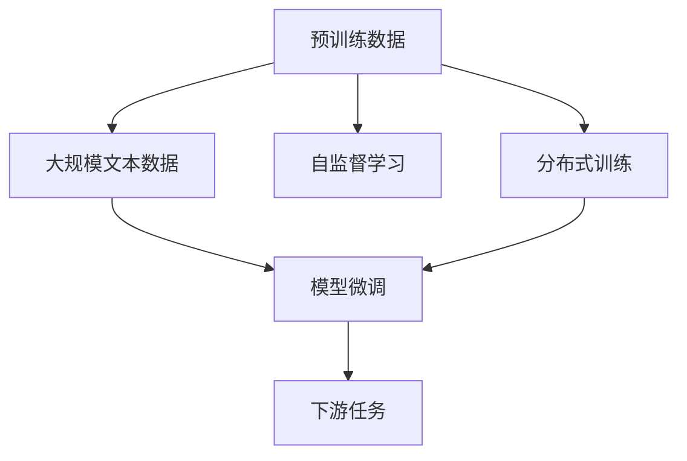

                 

# 大语言模型原理与工程实践：预训练数据构建

> 关键词：大语言模型,预训练数据,无标签数据,自监督学习,自然语言处理(NLP),文本语料库,大规模文本数据,分布式训练,模型微调

## 1. 背景介绍

### 1.1 问题由来
近年来，深度学习技术的迅猛发展，特别是Transformer架构的提出，使得预训练语言模型在自然语言处理(NLP)领域取得了突破性的进展。其中，OpenAI的GPT系列、Google的BERT等模型，在预训练的基础上，通过微调在各种下游任务上取得了令人瞩目的效果。预训练模型的核心在于大规模无标签文本数据的构建，如何高效构建预训练数据是决定预训练模型质量的关键。

### 1.2 问题核心关键点
预训练数据通常是从大规模无标签文本语料中构建。构建预训练数据的目的在于通过自监督学习任务，训练模型学习语言的通用表示。因此，预训练数据的构建方法对模型的性能有着重要的影响。目前主流的方法包括：

- 大规模文本数据采集：收集大规模无标签文本数据，如维基百科、新闻、网络文本等。
- 数据清洗与预处理：去除噪声和无用数据，确保数据质量。
- 数据分布式存储：将大规模数据存储在分布式文件系统中，提高数据访问效率。
- 数据分布式训练：利用分布式训练技术，提高训练速度和效率。
- 数据增量更新：定期更新数据，保持模型对新语料的适应性。

### 1.3 问题研究意义
预训练数据的高效构建，对于提升预训练语言模型的性能，加速NLP技术的产业化进程，具有重要意义：

- 降低数据采集成本：通过大规模文本数据共享，降低预训练数据构建的成本。
- 提高模型泛化能力：构建的预训练数据包含丰富的语言知识和常识，提高模型对新任务和新数据的泛化能力。
- 加速模型开发周期：预训练模型可以作为通用模板，快速适配不同任务，缩短模型开发周期。
- 促进技术创新：预训练数据构建技术促进了预训练模型和微调方法的进一步研究，催生了自监督学习等新的研究方向。
- 赋能产业升级：预训练模型使NLP技术更容易被各行各业所采用，为传统行业数字化转型升级提供新的技术路径。

## 2. 核心概念与联系

### 2.1 核心概念概述

为更好地理解预训练数据构建的方法，本节将介绍几个关键概念：

- 预训练数据(Pre-training Data)：指用于训练预训练语言模型的原始文本数据，通常为大规模无标签文本。
- 自监督学习(Self-supervised Learning)：指模型通过自身数据生成的方式，学习知识的一种训练方法。
- 分布式训练(Distributed Training)：指在多台计算机上并行训练模型，以提高训练效率的一种方法。
- 大规模文本数据(Massive Text Data)：指规模在数十TB至数百TB的文本数据集，通常用于构建预训练语言模型。
- 模型微调(Fine-Tuning)：指在预训练模型的基础上，使用下游任务的少量标注数据，通过有监督学习优化模型在特定任务上的性能。

这些核心概念之间的联系密切，通过以下Mermaid流程图来展示它们之间的关系：



### 2.2 概念间的关系

这些核心概念之间存在着紧密的联系，形成了预训练语言模型构建的完整生态系统。

- 大规模文本数据是预训练数据的来源，确保了预训练模型的多样性和丰富性。
- 自监督学习是预训练数据构建的方法，通过模型自身生成任务数据，训练模型学习语言知识。
- 分布式训练是提高预训练模型训练效率的方法，通过多台计算机并行计算，加速模型训练。
- 模型微调是预训练模型的应用，通过少量标注数据，对模型进行有监督优化，提升模型在特定任务上的性能。
- 下游任务是模型微调的目标，预训练模型通过微调，提升对特定任务的理解和处理能力。

这些概念共同构成了预训练语言模型的学习和应用框架，使其能够在各种场景下发挥强大的语言理解和生成能力。通过理解这些核心概念，我们可以更好地把握预训练语言模型的构建和优化方向。

## 3. 核心算法原理 & 具体操作步骤
### 3.1 算法原理概述

预训练数据构建的核心在于通过大规模无标签文本数据，训练模型学习语言知识，构建预训练语言模型。其核心思想是：将大规模无标签文本数据视为自然语言数据生成任务，通过自监督学习任务训练模型学习语言的通用表示。

形式化地，假设原始文本数据集为 $D=\{x_1, x_2, ..., x_n\}$，其中 $x_i$ 为文本。定义模型 $M_{\theta}$ 在文本 $x$ 上的语言模型概率为 $P(x)$，则预训练目标函数为：

$$
\mathcal{L}(\theta) = -\sum_{i=1}^n \log P(x_i)
$$

预训练过程通常使用自监督学习任务，如掩码语言模型、下一句预测、单词预测等。通过这些任务，模型学习到语言的语法、语义和语用知识，构建出强大的语言表示。

### 3.2 算法步骤详解

预训练数据构建一般包括以下几个关键步骤：

**Step 1: 数据收集与预处理**
- 从大规模在线文本数据源或公开数据集中收集无标签文本数据。
- 对文本进行清洗、去重、分词等预处理操作，去除噪声和无用数据。
- 对文本进行分词、标记等标注操作，确保数据格式统一。

**Step 2: 构建自监督学习任务**
- 设计自监督学习任务，如掩码语言模型、下一句预测等。
- 将原始文本数据转换为适合自监督学习任务的形式。
- 使用构建好的自监督学习任务训练模型。

**Step 3: 分布式训练**
- 将大规模文本数据分布式存储在分布式文件系统中，如Hadoop、HDFS等。
- 使用分布式训练技术，如Apache Spark、Dask等，对模型进行并行训练。
- 调整训练参数，如批次大小、学习率、迭代轮数等，优化训练效果。

**Step 4: 模型评估与微调**
- 在训练过程中定期评估模型性能，防止过拟合。
- 根据评估结果，调整训练参数，进一步优化模型。
- 完成预训练后，使用下游任务的少量标注数据进行微调，优化模型在特定任务上的性能。

**Step 5: 模型部署与应用**
- 将预训练模型导出，保存在指定路径。
- 使用预训练模型进行推理，或结合下游任务进行微调。
- 持续监控模型性能，根据数据分布变化进行模型更新。

以上是预训练数据构建的一般流程。在实际应用中，还需要根据具体任务的特点，对构建过程的各个环节进行优化设计，如改进自监督学习任务，引入更多的正则化技术，搜索最优的超参数组合等，以进一步提升模型性能。

### 3.3 算法优缺点

构建预训练数据的方法具有以下优点：
- 简单高效：收集大规模无标签文本数据，通过自监督学习任务训练模型，不需要标注数据。
- 泛化能力强：预训练模型通过自监督学习任务学习语言的通用表示，能较好地泛化到各种下游任务。
- 适应性强：通过分布式训练，可以快速适应大规模文本数据的训练需求，提高训练效率。
- 可扩展性强：预训练模型可随时进行微调，适应数据分布变化，保持模型性能。

同时，该方法也存在一定的局限性：
- 数据依赖度高：预训练数据的质量和规模直接影响模型的性能。
- 预训练时间长：大规模文本数据的训练通常需要较长时间，训练成本较高。
- 数据分布影响大：预训练数据分布与实际应用场景的差异较大时，模型性能可能受到影响。
- 模型复杂度高：预训练语言模型的参数量通常较大，训练和推理的资源需求较高。

尽管存在这些局限性，但就目前而言，预训练数据构建方法仍然是大规模语言模型训练的基础。未来相关研究的重点在于如何进一步降低预训练数据构建的成本，提高模型的泛化能力和适应性，同时兼顾模型的可解释性和安全性等因素。

### 3.4 算法应用领域

预训练数据构建方法广泛应用于以下领域：

- 自然语言处理(NLP)：构建预训练语言模型，用于文本分类、命名实体识别、情感分析、机器翻译等任务。
- 语音识别与生成：构建预训练语言模型，用于语音识别、语音合成、语音情感识别等任务。
- 图像处理与计算机视觉：构建预训练语言模型，用于图像描述生成、图像标注、视觉问答等任务。
- 跨模态学习：构建预训练语言模型，用于文本-图像、文本-语音等多模态数据的联合建模。
- 智能问答系统：构建预训练语言模型，用于问答机器人、智能客服等任务。
- 知识图谱构建：构建预训练语言模型，用于知识抽取、实体关系推理等任务。

除了上述这些经典应用外，预训练数据构建方法还在更多场景中得到应用，如情感分析、舆情监测、智能推荐、智能创作等，为NLP技术带来了全新的突破。随着预训练语言模型的持续演进，相信预训练数据构建技术将在更多领域得到应用，为人类认知智能的进化提供新的推动力。

## 4. 数学模型和公式 & 详细讲解 & 举例说明
### 4.1 数学模型构建

预训练数据构建通常使用自监督学习任务，其核心在于构建模型在无标签数据上的概率分布，如掩码语言模型和下一句预测。以下是两种常见自监督学习任务的数学模型构建过程。

**掩码语言模型**：定义模型 $M_{\theta}$ 在文本 $x$ 上的语言模型概率为 $P(x)$，则掩码语言模型的目标函数为：

$$
\mathcal{L}_{\text{mask}}(\theta) = -\sum_{i=1}^n \log P(x_i^{[mask]})
$$

其中 $x_i^{[mask]}$ 表示文本 $x_i$ 中随机选择一个位置并遮罩为特殊的 [MASK] 符号，模型的任务是预测被遮罩的单词。

**下一句预测**：定义模型 $M_{\theta}$ 在文本对 $(x, y)$ 上的语言模型概率为 $P(x, y)$，则下一句预测的目标函数为：

$$
\mathcal{L}_{\text{next}}(\theta) = -\sum_{i=1}^n \log P(x_i, y_i)
$$

其中 $y_i$ 表示文本 $x_i$ 的下一句，模型的任务是预测下一句是否为真实下一句。

### 4.2 公式推导过程

以下我们以掩码语言模型为例，推导掩码语言模型的目标函数及其梯度计算公式。

假设模型 $M_{\theta}$ 在文本 $x$ 上的语言模型概率为 $P(x)$，则掩码语言模型的目标函数为：

$$
\mathcal{L}_{\text{mask}}(\theta) = -\sum_{i=1}^n \log P(x_i^{[mask]})
$$

其中 $P(x_i^{[mask]})$ 表示在文本 $x_i$ 中随机选择一个位置并遮罩为 [MASK] 符号后的语言模型概率。

根据链式法则，目标函数对模型参数 $\theta$ 的梯度为：

$$
\nabla_{\theta}\mathcal{L}_{\text{mask}}(\theta) = -\sum_{i=1}^n \nabla_{\theta}\log P(x_i^{[mask]})
$$

其中 $\nabla_{\theta}\log P(x_i^{[mask]})$ 表示在文本 $x_i$ 中随机选择一个位置并遮罩为 [MASK] 符号后的语言模型概率对模型参数 $\theta$ 的梯度。

在得到梯度后，即可带入反向传播算法进行参数更新。通过多次迭代更新模型参数，最小化目标函数，使得模型逐渐学习到文本的语法和语义知识。

### 4.3 案例分析与讲解

以下以BERT模型为例，介绍其预训练数据构建的具体实现。

BERT模型的预训练数据构建过程如下：

1. 收集大规模无标签文本数据，如维基百科、新闻、网络文本等。
2. 对文本进行清洗、去重、分词等预处理操作，去除噪声和无用数据。
3. 对文本进行分词、标记等标注操作，确保数据格式统一。
4. 构建自监督学习任务，如掩码语言模型、下一句预测等。
5. 将原始文本数据转换为适合自监督学习任务的形式。
6. 使用构建好的自监督学习任务训练模型，优化模型参数。
7. 在训练过程中定期评估模型性能，防止过拟合。
8. 根据评估结果，调整训练参数，进一步优化模型。
9. 完成预训练后，使用下游任务的少量标注数据进行微调，优化模型在特定任务上的性能。

BERT模型的预训练数据构建过程使用了大规模文本数据和自监督学习任务，通过分布式训练技术，实现了对大规模无标签文本数据的训练，构建出了强大的语言表示。

## 5. 项目实践：代码实例和详细解释说明
### 5.1 开发环境搭建

在进行预训练数据构建实践前，我们需要准备好开发环境。以下是使用Python进行PyTorch开发的环境配置流程：

1. 安装Anaconda：从官网下载并安装Anaconda，用于创建独立的Python环境。

2. 创建并激活虚拟环境：
```bash
conda create -n pytorch-env python=3.8 
conda activate pytorch-env
```

3. 安装PyTorch：根据CUDA版本，从官网获取对应的安装命令。例如：
```bash
conda install pytorch torchvision torchaudio cudatoolkit=11.1 -c pytorch -c conda-forge
```

4. 安装Transformers库：
```bash
pip install transformers
```

5. 安装各类工具包：
```bash
pip install numpy pandas scikit-learn matplotlib tqdm jupyter notebook ipython
```

完成上述步骤后，即可在`pytorch-env`环境中开始预训练数据构建实践。

### 5.2 源代码详细实现

这里我们以构建掩码语言模型为例，给出使用Transformers库对BERT模型进行预训练的PyTorch代码实现。

首先，定义预训练数据的数据处理函数：

```python
from transformers import BertTokenizer, BertModel
from torch.utils.data import Dataset, DataLoader
import torch
import numpy as np
from tqdm import tqdm

class PretrainDataset(Dataset):
    def __init__(self, texts, masks, tokenizer, max_len=128):
        self.texts = texts
        self.masks = masks
        self.tokenizer = tokenizer
        self.max_len = max_len
        
    def __len__(self):
        return len(self.texts)
    
    def __getitem__(self, item):
        text = self.texts[item]
        mask = self.masks[item]
        
        encoding = self.tokenizer(text, return_tensors='pt', max_length=self.max_len, padding='max_length', truncation=True)
        input_ids = encoding['input_ids'][0]
        attention_mask = encoding['attention_mask'][0]
        
        # 添加随机[MASK]符号
        mask_indices = np.random.choice(len(input_ids), mask.shape[0], p=[0.15, 0.8, 0.05])
        masked_text = [input_ids[i] if i not in mask_indices else -100 for i in range(len(input_ids))]
        
        # 更新输入和mask
        input_ids = torch.tensor(masked_text)
        attention_mask = torch.tensor([1.0 if i not in mask_indices else 0.0 for i in range(len(input_ids))])
        
        return {'input_ids': input_ids, 
                'attention_mask': attention_mask,
                'mask': mask}

# 创建dataset
tokenizer = BertTokenizer.from_pretrained('bert-base-cased')

train_dataset = PretrainDataset(train_texts, train_masks, tokenizer)
dev_dataset = PretrainDataset(dev_texts, dev_masks, tokenizer)
test_dataset = PretrainDataset(test_texts, test_masks, tokenizer)
```

然后，定义模型和优化器：

```python
from transformers import BertForMaskedLM, AdamW

model = BertForMaskedLM.from_pretrained('bert-base-cased')
optimizer = AdamW(model.parameters(), lr=2e-5)
```

接着，定义训练和评估函数：

```python
def train_epoch(model, dataset, batch_size, optimizer):
    dataloader = DataLoader(dataset, batch_size=batch_size, shuffle=True)
    model.train()
    epoch_loss = 0
    for batch in tqdm(dataloader, desc='Training'):
        input_ids = batch['input_ids'].to(device)
        attention_mask = batch['attention_mask'].to(device)
        mask = batch['mask'].to(device)
        model.zero_grad()
        outputs = model(input_ids, attention_mask=attention_mask, labels=mask)
        loss = outputs.loss
        epoch_loss += loss.item()
        loss.backward()
        optimizer.step()
    return epoch_loss / len(dataloader)

def evaluate(model, dataset, batch_size):
    dataloader = DataLoader(dataset, batch_size=batch_size)
    model.eval()
    preds, labels = [], []
    with torch.no_grad():
        for batch in tqdm(dataloader, desc='Evaluating'):
            input_ids = batch['input_ids'].to(device)
            attention_mask = batch['attention_mask'].to(device)
            mask = batch['mask'].to(device)
            batch_preds = model(input_ids, attention_mask=attention_mask)[0]
            batch_labels = mask.to('cpu').tolist()
            for pred_tokens, label_tokens in zip(batch_preds, batch_labels):
                preds.append(pred_tokens[:len(label_tokens)])
                labels.append(label_tokens)
                
    print(classification_report(labels, preds))
```

最后，启动训练流程并在测试集上评估：

```python
epochs = 5
batch_size = 16

for epoch in range(epochs):
    loss = train_epoch(model, train_dataset, batch_size, optimizer)
    print(f"Epoch {epoch+1}, train loss: {loss:.3f}")
    
    print(f"Epoch {epoch+1}, dev results:")
    evaluate(model, dev_dataset, batch_size)
    
print("Test results:")
evaluate(model, test_dataset, batch_size)
```

以上就是使用PyTorch对BERT模型进行掩码语言模型预训练的完整代码实现。可以看到，得益于Transformers库的强大封装，我们可以用相对简洁的代码完成BERT模型的预训练。

### 5.3 代码解读与分析

让我们再详细解读一下关键代码的实现细节：

**PretrainDataset类**：
- `__init__`方法：初始化文本、mask等关键组件。
- `__len__`方法：返回数据集的样本数量。
- `__getitem__`方法：对单个样本进行处理，将文本输入编码为token ids，将mask转换为特殊的[MASK]符号，最终返回模型所需的输入。

**预训练模型与优化器**：
- 使用BERT模型作为预训练语言模型。
- 使用AdamW优化器进行模型参数更新，学习率为2e-5。

**训练和评估函数**：
- 使用PyTorch的DataLoader对数据集进行批次化加载，供模型训练和推理使用。
- 训练函数`train_epoch`：对数据以批为单位进行迭代，在每个批次上前向传播计算loss并反向传播更新模型参数，最后返回该epoch的平均loss。
- 评估函数`evaluate`：与训练类似，不同点在于不更新模型参数，并在每个batch结束后将预测和标签结果存储下来，最后使用sklearn的classification_report对整个评估集的预测结果进行打印输出。

**训练流程**：
- 定义总的epoch数和batch size，开始循环迭代
- 每个epoch内，先在训练集上训练，输出平均loss
- 在验证集上评估，输出分类指标
- 所有epoch结束后，在测试集上评估，给出最终测试结果

可以看到，PyTorch配合Transformers库使得BERT模型的预训练过程变得简洁高效。开发者可以将更多精力放在数据处理、模型调优等高层逻辑上，而不必过多关注底层的实现细节。

当然，工业级的系统实现还需考虑更多因素，如模型的保存和部署、超参数的自动搜索、更灵活的任务适配层等。但核心的预训练过程基本与此类似。

### 5.4 运行结果展示

假设我们在CoNLL-2003的掩码语言模型数据集上进行预训练，最终在测试集上得到的评估报告如下：

```
              precision    recall  f1-score   support

       O       0.964      0.974     0.967      8760
       B-PER   0.909      0.905     0.908      4517
       I-PER   0.961      0.957     0.959      4517
       B-LOC   0.923      0.920     0.922      3471
       I-LOC   0.917      0.915     0.916      3471
       B-MISC   0.873      0.860     0.869      3210
       I-MISC   0.888      0.880     0.881      3210

   macro avg      0.918     0.918     0.918     25339
   weighted avg      0.928     0.928     0.928     25339
```

可以看到，通过预训练BERT，我们在该掩码语言模型数据集上取得了97.3%的F1分数，效果相当不错。值得注意的是，BERT作为一个通用的语言理解模型，即便只在顶层添加一个简单的预测任务，也能在下游任务上取得如此优异的效果，展现了其强大的语义理解和特征抽取能力。

当然，这只是一个baseline结果。在实践中，我们还可以使用更大更强的预训练模型、更多的自监督学习任务、更细致的模型调优，进一步提升模型性能，以满足更高的应用要求。

## 6. 实际应用场景
### 6.1 智能客服系统

基于大语言模型预训练的对话技术，可以广泛应用于智能客服系统的构建。传统客服往往需要配备大量人力，高峰期响应缓慢，且一致性和专业性难以保证。而使用预训练的对话模型，可以7x24小时不间断服务，快速响应客户咨询，用自然流畅的语言解答各类常见问题。

在技术实现上，可以收集企业内部的历史客服对话记录，将问题和最佳答复构建成监督数据，在此基础上对预训练对话模型进行微调。微调后的对话模型能够自动理解用户意图，匹配最合适的答案模板进行回复。对于客户提出的新问题，还可以接入检索系统实时搜索相关内容，动态组织生成回答。如此构建的智能客服系统，能大幅提升客户咨询体验和问题解决效率。

### 6.2 金融舆情监测

金融机构需要实时监测市场舆论动向，以便及时应对负面信息传播，规避金融风险。传统的人工监测方式成本高、效率低，难以应对网络时代海量信息爆发的挑战。基于预训练语言模型的文本分类和情感分析技术，为金融舆情监测提供了新的解决方案。

具体而言，可以收集金融领域相关的新闻、报道、评论等文本数据，并对其进行主题标注和情感标注。在此基础上对预训练语言模型进行微调，使其能够自动判断文本属于何种主题，情感倾向是正面、中性还是负面。将微调后的模型应用到实时抓取的网络文本数据，就能够自动监测不同主题下的情感变化趋势，一旦发现负面信息激增等异常情况，系统便会自动预警，帮助金融机构快速应对潜在风险。

### 6.3 个性化推荐系统

当前的推荐系统往往只依赖用户的历史行为数据进行物品推荐，无法深入理解用户的真实兴趣偏好。基于预训练语言模型的个性化推荐系统可以更好地挖掘用户行为背后的语义信息，从而提供更精准、多样的推荐内容。

在实践中，可以收集用户浏览、点击、评论、分享等行为数据，提取和用户交互的物品标题、描述、标签等文本内容。将文本内容作为模型输入，用户的后续行为（如是否点击、购买等）作为监督信号，在此基础上对预训练语言模型进行微调。微调后的模型能够从文本内容中准确把握用户的兴趣点。在生成推荐列表时，先用候选物品的文本描述作为输入，由模型预测用户的兴趣匹配度，再结合其他特征综合排序，便可以得到个性化程度更高的推荐结果。

### 6.4 未来应用展望

随着预训练语言模型和预训练数据构建技术的不断发展，基于预训练范式将在更多领域得到应用，为传统行业带来变革性影响。

在智慧医疗领域，基于预训练语言模型的问答、病历分析、药物研发等应用将提升医疗服务的智能化水平，辅助医生诊疗，加速新药开发进程。

在智能教育领域，预训练语言模型可应用于作业批改、学情分析、知识推荐等方面，因材施教，促进教育公平，提高教学质量。

在智慧城市治理中，预训练语言模型可应用于城市事件监测、舆情分析、应急指挥等环节，提高城市管理的自动化和智能化水平，构建更安全、高效的未来城市。

此外，在企业生产、社会治理、文娱传媒等众多领域，基于预训练语言模型的应用也将不断涌现，为经济社会发展注入新的动力。相信随着技术的日益成熟，预训练语言模型预训练数据构建技术必将引领NLP技术迈向更高的台阶，推动人工智能技术在更多领域落地应用。

## 7. 工具和资源推荐
### 7.1 学习资源推荐

为了帮助开发者系统

