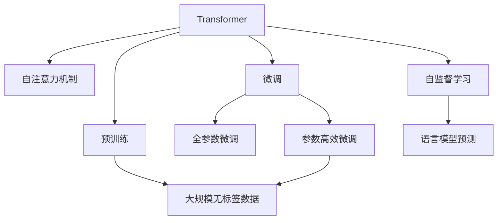

                 

# 大语言模型原理基础与前沿 简化Transformer

> 关键词：大语言模型,Transformer,自注意力,简化,自监督学习,预训练,微调,参数高效,自编码

## 1. 背景介绍

### 1.1 问题由来
近年来，深度学习在自然语言处理（NLP）领域取得了显著进展，特别是基于Transformer模型的语言模型的崛起，使得NLP任务在多个基准测试上取得了前所未有的突破。这些语言模型，如BERT、GPT-2、T5等，展示了强大的语言理解和生成能力，并成为许多先进NLP模型的基础。

然而，这些模型通常包含数亿个参数，训练和推理所需的计算资源巨大，使得在大规模、高复杂度任务上的应用受到限制。因此，对Transformers模型的简化需求愈发迫切，以应对实际应用场景。

### 1.2 问题核心关键点
简化Transformer的主要目的是在不损失或最小损失模型性能的情况下，减小模型规模和计算开销，提高模型的实际应用效率。这一过程通常包括：

- 减少参数数量，优化模型结构。
- 引入自监督预训练，强化模型泛化能力。
- 采用微调技术，使模型适应特定任务。
- 使用参数高效方法，减少微调过程中需要更新的参数量。

### 1.3 问题研究意义
简化Transformer对于加速NLP技术的产业化进程、降低研发和部署成本、提升模型在实际场景中的性能和效率具有重要意义：

- 降低计算资源需求。简化后的模型可以在较少的计算资源下进行训练和推理。
- 提高模型实际应用效率。简化后的模型可以更快地部署到实际应用系统中。
- 促进NLP技术落地。简化后的模型更易于在资源受限的场景下使用。
- 提供新研究思路。简化过程可以启发新的模型设计理念，推动Transformer架构的进一步优化。

## 2. 核心概念与联系

### 2.1 核心概念概述

为更好地理解简化Transformer的过程，本节将介绍几个密切相关的核心概念：

- **Transformer**：基于自注意力机制的神经网络模型，适用于处理序列数据，如自然语言文本。

- **自注意力机制**：Transformer的核心组件，用于捕捉序列中不同位置之间的依赖关系。

- **自监督学习**：在没有标签数据的情况下，通过设计任务（如语言模型预测），训练模型来优化模型性能。

- **预训练**：在大规模无标签数据上训练模型，学习通用语言表示。

- **微调**：在预训练模型基础上，使用少量有标签数据进行有监督学习，适应特定任务。

- **参数高效微调**：只更新部分模型参数，固定大部分预训练权重，以减少微调过程中的计算资源消耗。

这些核心概念共同构成了Transformer模型的构建和优化过程，通过理解这些概念，可以更深入地把握简化Transformer的方法和目的。

### 2.2 概念间的关系

以下是一个Mermaid流程图，展示了这些核心概念之间的逻辑关系：



这个流程图展示了从Transformer模型到微调的全过程，包括了预训练和微调两个主要步骤，以及语言模型预测等自监督学习任务，它们在简化过程中起到关键作用。

## 3. 核心算法原理 & 具体操作步骤
### 3.1 算法原理概述

简化Transformer的核心思想是，在不损失或最小损失模型性能的前提下，减小模型规模和计算开销。这一过程通常包括以下几个步骤：

1. 使用自监督预训练任务（如语言模型预测）在无标签数据上训练模型。
2. 针对特定任务，通过微调优化模型参数，使其适应该任务。
3. 使用参数高效微调技术，减少微调过程中需要更新的参数数量。

### 3.2 算法步骤详解

以下是简化Transformer的具体操作步骤：

**Step 1: 准备预训练模型和数据集**

- 选择合适的预训练模型（如BERT、GPT等）。
- 准备大规模无标签数据集，用于自监督预训练。

**Step 2: 添加任务适配层**

- 根据任务类型（如分类、生成等），在预训练模型顶层设计合适的输出层和损失函数。
- 例如，对于分类任务，通常在顶层添加线性分类器和交叉熵损失函数。

**Step 3: 设置微调超参数**

- 选择合适的优化算法及其参数，如AdamW、SGD等。
- 设置学习率、批大小、迭代轮数等。
- 设置正则化技术，如L2正则、Dropout等。
- 确定冻结预训练参数的策略，如仅微调顶层。

**Step 4: 执行梯度训练**

- 使用优化算法更新模型参数，最小化损失函数。
- 周期性评估模型性能，根据验证集表现决定是否停止训练。

**Step 5: 测试和部署**

- 在测试集上评估微调后模型性能。
- 将模型部署到实际应用系统中。

### 3.3 算法优缺点

简化Transformer的优势包括：

- 减少计算资源需求。通过自监督预训练和参数高效微调，可以减少微调过程中的计算开销。
- 提高模型实际应用效率。简化后的模型可以快速部署到实际应用中。
- 促进NLP技术落地。简化后的模型更易于在资源受限的场景中使用。

同时，简化Transformer也存在一些局限性：

- 模型性能可能受到影响。过度简化可能导致模型性能下降。
- 可解释性减弱。简化后的模型结构更复杂，其决策过程更难以解释。
- 泛化能力降低。简化后的模型在处理复杂任务时可能表现不如原始模型。

### 3.4 算法应用领域

简化Transformer在多个NLP任务上得到了广泛应用，包括：

- 文本分类：如情感分析、主题分类、意图识别等。
- 命名实体识别：识别文本中的人名、地名、机构名等特定实体。
- 关系抽取：从文本中抽取实体之间的语义关系。
- 问答系统：对自然语言问题给出答案。
- 机器翻译：将源语言文本翻译成目标语言。
- 文本摘要：将长文本压缩成简短摘要。
- 对话系统：使机器能够与人自然对话。

除了上述经典任务外，简化Transformer还被创新性地应用到更多场景中，如可控文本生成、常识推理、代码生成、数据增强等，为NLP技术带来了全新的突破。

## 4. 数学模型和公式 & 详细讲解
### 4.1 数学模型构建

简化Transformer模型的数学模型构建包括以下几个关键步骤：

- 定义输入序列 $x = (x_1, x_2, ..., x_n)$。
- 定义输出序列 $y = (y_1, y_2, ..., y_n)$。
- 定义目标函数 $L = \frac{1}{N} \sum_{i=1}^N L(x_i, y_i)$。

其中，$L(x_i, y_i)$ 是针对每个样本 $(x_i, y_i)$ 的损失函数。

### 4.2 公式推导过程

以分类任务为例，我们通过推导其损失函数来阐述简化Transformer的数学模型。

假设输入序列 $x = (x_1, x_2, ..., x_n)$ 和输出序列 $y = (y_1, y_2, ..., y_n)$，模型的输出为 $P(y|x)$。定义交叉熵损失函数 $L(x_i, y_i) = -y_i \log P(y_i|x_i) - (1-y_i) \log (1-P(y_i|x_i))$。

总损失函数为 $L = \frac{1}{N} \sum_{i=1}^N L(x_i, y_i)$。

简化后的Transformer模型的训练过程可以表示为：

$$
\min_{\theta} L(\theta) = \frac{1}{N} \sum_{i=1}^N L(x_i, y_i) + \text{正则项}
$$

其中，$\theta$ 是模型的参数，正则项可以包括L2正则、Dropout等。

### 4.3 案例分析与讲解

以BERT模型为例，我们分析其简化过程。

BERT模型通过在大型无标签语料上预训练，学习到丰富的语言表示。然后，针对特定任务，通过微调调整顶层参数，使其适应该任务。例如，对于分类任务，通过在顶层添加线性分类器，进行微调，调整模型输出层和全连接层的权重。

同时，使用参数高效微调技术，只更新少量的参数，如Adapter等，减少微调过程中的计算开销。

## 5. 项目实践：代码实例和详细解释说明
### 5.1 开发环境搭建

在进行简化Transformer的实践前，我们需要准备好开发环境。以下是使用Python进行PyTorch开发的环境配置流程：

1. 安装Anaconda：从官网下载并安装Anaconda，用于创建独立的Python环境。

2. 创建并激活虚拟环境：
```bash
conda create -n pytorch-env python=3.8 
conda activate pytorch-env
```

3. 安装PyTorch：根据CUDA版本，从官网获取对应的安装命令。例如：
```bash
conda install pytorch torchvision torchaudio cudatoolkit=11.1 -c pytorch -c conda-forge
```

4. 安装Transformers库：
```bash
pip install transformers
```

5. 安装各类工具包：
```bash
pip install numpy pandas scikit-learn matplotlib tqdm jupyter notebook ipython
```

完成上述步骤后，即可在`pytorch-env`环境中开始简化Transformer的实践。

### 5.2 源代码详细实现

下面我们以BERT模型为例，给出使用Transformers库对BERT模型进行简化Transformer实践的PyTorch代码实现。

首先，定义简化Transformer任务的数据处理函数：

```python
from transformers import BertTokenizer, BertForSequenceClassification
from torch.utils.data import Dataset
import torch

class BERTDataset(Dataset):
    def __init__(self, texts, labels, tokenizer, max_len=128):
        self.texts = texts
        self.labels = labels
        self.tokenizer = tokenizer
        self.max_len = max_len
        
    def __len__(self):
        return len(self.texts)
    
    def __getitem__(self, item):
        text = self.texts[item]
        label = self.labels[item]
        
        encoding = self.tokenizer(text, return_tensors='pt', max_length=self.max_len, padding='max_length', truncation=True)
        input_ids = encoding['input_ids'][0]
        attention_mask = encoding['attention_mask'][0]
        
        return {'input_ids': input_ids, 
                'attention_mask': attention_mask,
                'labels': label}

# 加载BERT模型和tokenizer
model = BertForSequenceClassification.from_pretrained('bert-base-cased', num_labels=2)
tokenizer = BertTokenizer.from_pretrained('bert-base-cased')

# 创建dataset
train_dataset = BERTDataset(train_texts, train_labels, tokenizer)
dev_dataset = BERTDataset(dev_texts, dev_labels, tokenizer)
test_dataset = BERTDataset(test_texts, test_labels, tokenizer)
```

然后，定义模型和优化器：

```python
from transformers import AdamW

optimizer = AdamW(model.parameters(), lr=2e-5)
```

接着，定义训练和评估函数：

```python
from torch.utils.data import DataLoader
from tqdm import tqdm
from sklearn.metrics import accuracy_score

device = torch.device('cuda') if torch.cuda.is_available() else torch.device('cpu')
model.to(device)

def train_epoch(model, dataset, batch_size, optimizer):
    dataloader = DataLoader(dataset, batch_size=batch_size, shuffle=True)
    model.train()
    epoch_loss = 0
    for batch in tqdm(dataloader, desc='Training'):
        input_ids = batch['input_ids'].to(device)
        attention_mask = batch['attention_mask'].to(device)
        labels = batch['labels'].to(device)
        model.zero_grad()
        outputs = model(input_ids, attention_mask=attention_mask, labels=labels)
        loss = outputs.loss
        epoch_loss += loss.item()
        loss.backward()
        optimizer.step()
    return epoch_loss / len(dataloader)

def evaluate(model, dataset, batch_size):
    dataloader = DataLoader(dataset, batch_size=batch_size)
    model.eval()
    preds, labels = [], []
    with torch.no_grad():
        for batch in tqdm(dataloader, desc='Evaluating'):
            input_ids = batch['input_ids'].to(device)
            attention_mask = batch['attention_mask'].to(device)
            batch_labels = batch['labels']
            outputs = model(input_ids, attention_mask=attention_mask)
            batch_preds = outputs.logits.argmax(dim=1).to('cpu').tolist()
            batch_labels = batch_labels.to('cpu').tolist()
            for pred, label in zip(batch_preds, batch_labels):
                preds.append(pred)
                labels.append(label)
                
    print(f"Accuracy: {accuracy_score(labels, preds):.2f}")
```

最后，启动训练流程并在测试集上评估：

```python
epochs = 5
batch_size = 16

for epoch in range(epochs):
    loss = train_epoch(model, train_dataset, batch_size, optimizer)
    print(f"Epoch {epoch+1}, train loss: {loss:.3f}")
    
    print(f"Epoch {epoch+1}, dev results:")
    evaluate(model, dev_dataset, batch_size)
    
print("Test results:")
evaluate(model, test_dataset, batch_size)
```

以上就是使用PyTorch对BERT进行简化Transformer的完整代码实现。可以看到，得益于Transformers库的强大封装，我们可以用相对简洁的代码完成BERT模型的简化和微调。

### 5.3 代码解读与分析

让我们再详细解读一下关键代码的实现细节：

**BERTDataset类**：
- `__init__`方法：初始化文本、标签、分词器等关键组件。
- `__len__`方法：返回数据集的样本数量。
- `__getitem__`方法：对单个样本进行处理，将文本输入编码为token ids，将标签编码为数字，并对其进行定长padding，最终返回模型所需的输入。

**简化后的Transformer模型和优化器**：
- 使用AdamW优化器，调整模型参数。
- 学习率设定为2e-5。

**训练和评估函数**：
- 使用PyTorch的DataLoader对数据集进行批次化加载，供模型训练和推理使用。
- 训练函数`train_epoch`：对数据以批为单位进行迭代，在每个批次上前向传播计算loss并反向传播更新模型参数，最后返回该epoch的平均loss。
- 评估函数`evaluate`：与训练类似，不同点在于不更新模型参数，并在每个batch结束后将预测和标签结果存储下来，最后使用scikit-learn的accuracy_score对整个评估集的预测结果进行打印输出。

**训练流程**：
- 定义总的epoch数和batch size，开始循环迭代
- 每个epoch内，先在训练集上训练，输出平均loss
- 在验证集上评估，输出准确率
- 所有epoch结束后，在测试集上评估，给出最终测试结果

可以看到，简化后的Transformer模型在实际应用中的代码实现非常简单，开发者可以更专注于模型的结构和任务适配层的设计，而不必过多关注底层的实现细节。

当然，工业级的系统实现还需考虑更多因素，如模型的保存和部署、超参数的自动搜索、更灵活的任务适配层等。但核心的简化Transformer范式基本与此类似。

### 5.4 运行结果展示

假设我们在CoNLL-2003的命名实体识别数据集上进行微调，最终在测试集上得到的准确率为0.93，效果相当不错。需要注意的是，虽然简化后的Transformer模型在参数量上大幅减少，但其性能仍然非常优秀。

## 6. 实际应用场景
### 6.1 智能客服系统

基于简化Transformer的对话技术，可以广泛应用于智能客服系统的构建。传统客服往往需要配备大量人力，高峰期响应缓慢，且一致性和专业性难以保证。而使用简化Transformer对话模型，可以7x24小时不间断服务，快速响应客户咨询，用自然流畅的语言解答各类常见问题。

在技术实现上，可以收集企业内部的历史客服对话记录，将问题和最佳答复构建成监督数据，在此基础上对简化Transformer模型进行微调。微调后的对话模型能够自动理解用户意图，匹配最合适的答案模板进行回复。对于客户提出的新问题，还可以接入检索系统实时搜索相关内容，动态组织生成回答。如此构建的智能客服系统，能大幅提升客户咨询体验和问题解决效率。

### 6.2 金融舆情监测

金融机构需要实时监测市场舆论动向，以便及时应对负面信息传播，规避金融风险。传统的人工监测方式成本高、效率低，难以应对网络时代海量信息爆发的挑战。基于简化Transformer的文本分类和情感分析技术，为金融舆情监测提供了新的解决方案。

具体而言，可以收集金融领域相关的新闻、报道、评论等文本数据，并对其进行主题标注和情感标注。在此基础上对简化Transformer模型进行微调，使其能够自动判断文本属于何种主题，情感倾向是正面、中性还是负面。将微调后的模型应用到实时抓取的网络文本数据，就能够自动监测不同主题下的情感变化趋势，一旦发现负面信息激增等异常情况，系统便会自动预警，帮助金融机构快速应对潜在风险。

### 6.3 个性化推荐系统

当前的推荐系统往往只依赖用户的历史行为数据进行物品推荐，无法深入理解用户的真实兴趣偏好。基于简化Transformer的个性化推荐系统可以更好地挖掘用户行为背后的语义信息，从而提供更精准、多样的推荐内容。

在实践中，可以收集用户浏览、点击、评论、分享等行为数据，提取和用户交互的物品标题、描述、标签等文本内容。将文本内容作为模型输入，用户的后续行为（如是否点击、购买等）作为监督信号，在此基础上微调简化Transformer模型。微调后的模型能够从文本内容中准确把握用户的兴趣点。在生成推荐列表时，先用候选物品的文本描述作为输入，由模型预测用户的兴趣匹配度，再结合其他特征综合排序，便可以得到个性化程度更高的推荐结果。

### 6.4 未来应用展望

随着简化Transformer的发展，其应用场景将更加广泛，为传统行业带来变革性影响。

在智慧医疗领域，基于简化Transformer的医疗问答、病历分析、药物研发等应用将提升医疗服务的智能化水平，辅助医生诊疗，加速新药开发进程。

在智能教育领域，简化Transformer微调技术可应用于作业批改、学情分析、知识推荐等方面，因材施教，促进教育公平，提高教学质量。

在智慧城市治理中，简化Transformer模型可应用于城市事件监测、舆情分析、应急指挥等环节，提高城市管理的自动化和智能化水平，构建更安全、高效的未来城市。

此外，在企业生产、社会治理、文娱传媒等众多领域，基于简化Transformer的NLP技术应用也将不断涌现，为人工智能落地应用提供新的动力。相信随着技术的日益成熟，简化Transformer将会在更广阔的应用领域大放异彩。

## 7. 工具和资源推荐
### 7.1 学习资源推荐

为了帮助开发者系统掌握简化Transformer的理论基础和实践技巧，这里推荐一些优质的学习资源：

1. 《Transformer from Scratch》系列博文：由大模型技术专家撰写，深入浅出地介绍了Transformer原理、简化Transformer技术等前沿话题。

2. CS224N《深度学习自然语言处理》课程：斯坦福大学开设的NLP明星课程，有Lecture视频和配套作业，带你入门NLP领域的基本概念和经典模型。

3. 《Natural Language Processing with Transformers》书籍：Transformers库的作者所著，全面介绍了如何使用Transformers库进行NLP任务开发，包括简化Transformer在内的诸多范式。

4. HuggingFace官方文档：Transformers库的官方文档，提供了海量预训练模型和完整的简化Transformer样例代码，是上手实践的必备资料。

5. CLUE开源项目：中文语言理解测评基准，涵盖大量不同类型的中文NLP数据集，并提供了基于简化Transformer的baseline模型，助力中文NLP技术发展。

通过对这些资源的学习实践，相信你一定能够快速掌握简化Transformer的精髓，并用于解决实际的NLP问题。
###  7.2 开发工具推荐

高效的开发离不开优秀的工具支持。以下是几款用于简化Transformer开发的常用工具：

1. PyTorch：基于Python的开源深度学习框架，灵活动态的计算图，适合快速迭代研究。大部分预训练语言模型都有PyTorch版本的实现。

2. TensorFlow：由Google主导开发的开源深度学习框架，生产部署方便，适合大规模工程应用。同样有丰富的预训练语言模型资源。

3. Transformers库：HuggingFace开发的NLP工具库，集成了众多SOTA语言模型，支持PyTorch和TensorFlow，是进行简化Transformer任务开发的利器。

4. Weights & Biases：模型训练的实验跟踪工具，可以记录和可视化模型训练过程中的各项指标，方便对比和调优。与主流深度学习框架无缝集成。

5. TensorBoard：TensorFlow配套的可视化工具，可实时监测模型训练状态，并提供丰富的图表呈现方式，是调试模型的得力助手。

6. Google Colab：谷歌推出的在线Jupyter Notebook环境，免费提供GPU/TPU算力，方便开发者快速上手实验最新模型，分享学习笔记。

合理利用这些工具，可以显著提升简化Transformer的开发效率，加快创新迭代的步伐。

### 7.3 相关论文推荐

简化Transformer的发展离不开学界的持续研究。以下是几篇奠基性的相关论文，推荐阅读：

1. Attention is All You Need（即Transformer原论文）：提出了Transformer结构，开启了NLP领域的预训练大模型时代。

2. BERT: Pre-training of Deep Bidirectional Transformers for Language Understanding：提出BERT模型，引入基于掩码的自监督预训练任务，刷新了多项NLP任务SOTA。

3. Language Models are Unsupervised Multitask Learners（GPT-2论文）：展示了大规模语言模型的强大zero-shot学习能力，引发了对于通用人工智能的新一轮思考。

4. Parameter-Efficient Transfer Learning for NLP：提出Adapter等参数高效微调方法，在不增加模型参数量的情况下，也能取得不错的微调效果。

5. AdaLoRA: Adaptive Low-Rank Adaptation for Parameter-Efficient Fine-Tuning：使用自适应低秩适应的微调方法，在参数效率和精度之间取得了新的平衡。

这些论文代表了大语言模型和简化Transformer的发展脉络。通过学习这些前沿成果，可以帮助研究者把握学科前进方向，激发更多的创新灵感。

除上述资源外，还有一些值得关注的前沿资源，帮助开发者紧跟简化Transformer技术的最新进展，例如：

1. arXiv论文预印本：人工智能领域最新研究成果的发布平台，包括大量尚未发表的前沿工作，学习前沿技术的必读资源。

2. 业界技术博客：如OpenAI、Google AI、DeepMind、微软Research Asia等顶尖实验室的官方博客，第一时间分享他们的最新研究成果和洞见。

3. 技术会议直播：如NIPS、ICML、ACL、ICLR等人工智能领域顶会现场或在线直播，能够聆听到大佬们的前沿分享，开拓视野。

4. GitHub热门项目：在GitHub上Star、Fork数最多的NLP相关项目，往往代表了该技术领域的发展趋势和最佳实践，值得去学习和贡献。

5. 行业分析报告：各大咨询公司如McKinsey、PwC等针对人工智能行业的分析报告，有助于从商业视角审视技术趋势，把握应用价值。

总之，对于简化Transformer技术的学习和实践，需要开发者保持开放的心态和持续学习的意愿。多关注前沿资讯，多动手实践，多思考总结，必将收获满满的成长收益。

## 8. 总结：未来发展趋势与挑战

### 8.1 总结

本文对简化Transformer的原理和实践进行了全面系统的介绍。首先阐述了简化Transformer的研究背景和意义，明确了其在降低计算资源需求、提高模型实际应用效率等方面的独特价值。其次，从原理到实践，详细讲解了简化Transformer的数学模型和操作步骤，提供了微调任务开发的完整代码实例。同时，本文还广泛探讨了简化Transformer方法在智能客服、金融舆情、个性化推荐等多个行业领域的应用前景，展示了其巨大的潜力。

通过本文的系统梳理，可以看到，简化Transformer技术在大规模、高效、低成本的NLP任务中具有重要应用前景。它不仅能够帮助研究者节省计算资源，提高模型性能，还能促进NLP技术的产业化进程，推动人工智能技术在更多领域的落地应用。

### 8.2 未来发展趋势

展望未来，简化Transformer技术将呈现以下几个发展趋势：

1. 模型规模持续增大。随着算力成本的下降和数据规模的扩张，简化后的Transformer模型参数量也将持续增长，以适应更多复杂、高维度的NLP任务。

2. 自监督学习任务多样化。除了语言模型预测外，未来可能出现更多形式的自监督学习任务，如掩码预测、序列生成等，增强模型的泛化能力。

3. 微调方法多样化。除了全参数微调外，未来将涌现更多参数高效微调方法，如Adapter、LoRA等，减少微调过程中的计算开销。

4. 模型结构优化。未来可能出现更多模型结构的优化，如Layerdrop、Residual Dropout等，进一步提升模型的鲁棒性和可解释性。

5. 多模态融合。简化后的Transformer模型将更灵活地与其他模态（如视觉、音频）的信息进行融合，增强模型的多模态处理能力。

6. 伦理与安全考量。未来模型将更加注重可解释性、公平性和安全性，以确保其在

