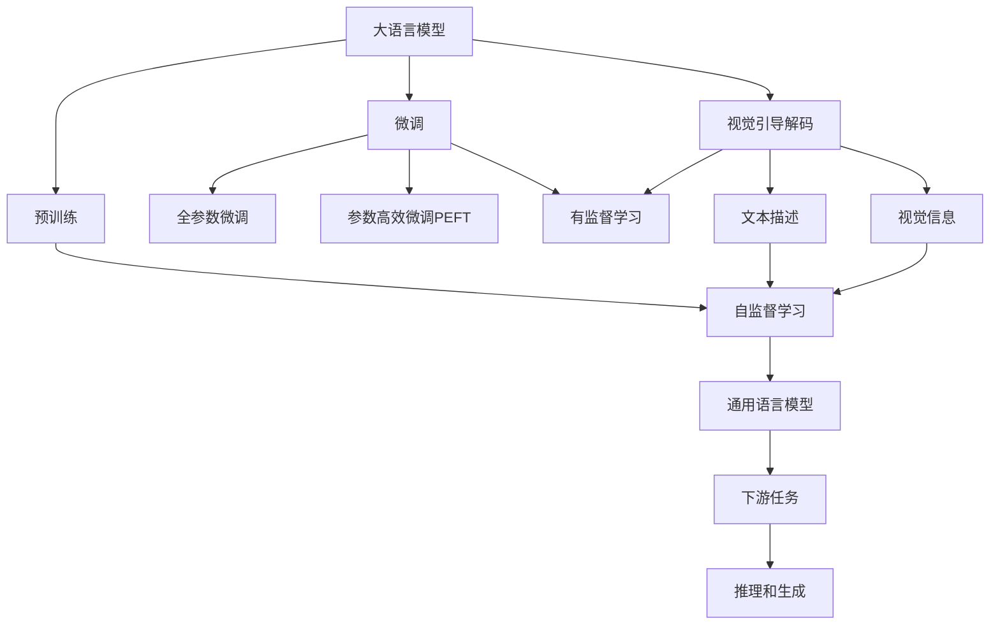
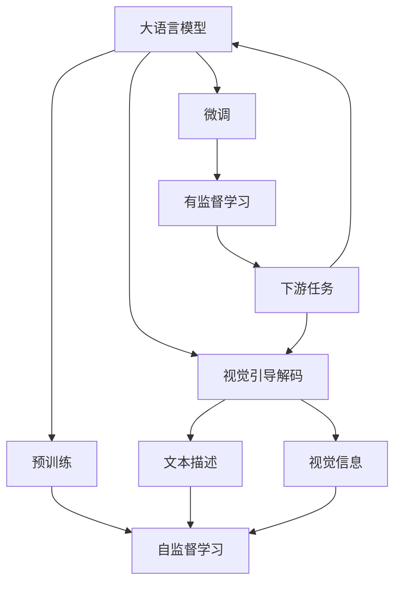
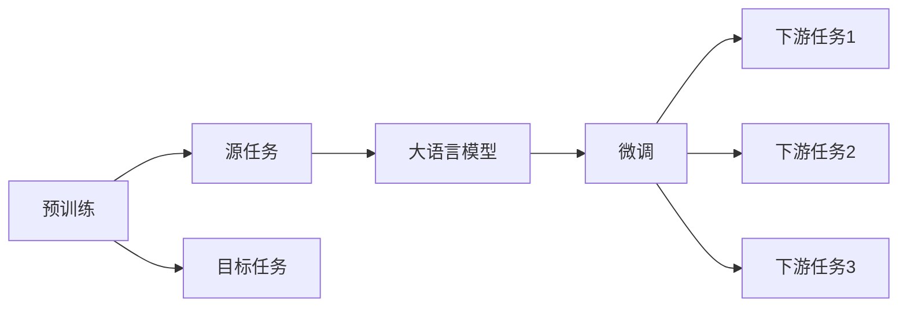
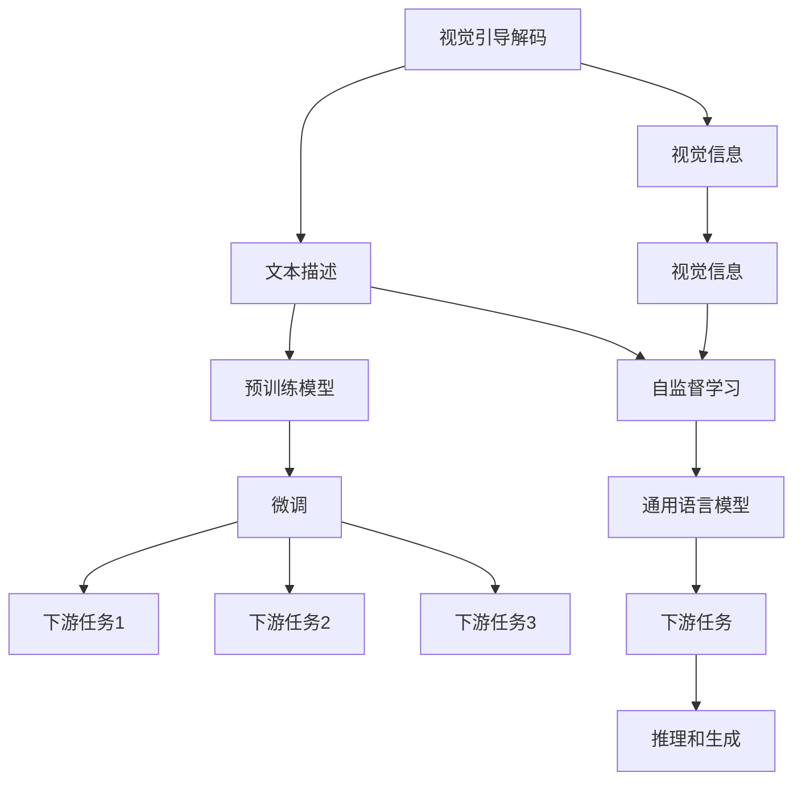
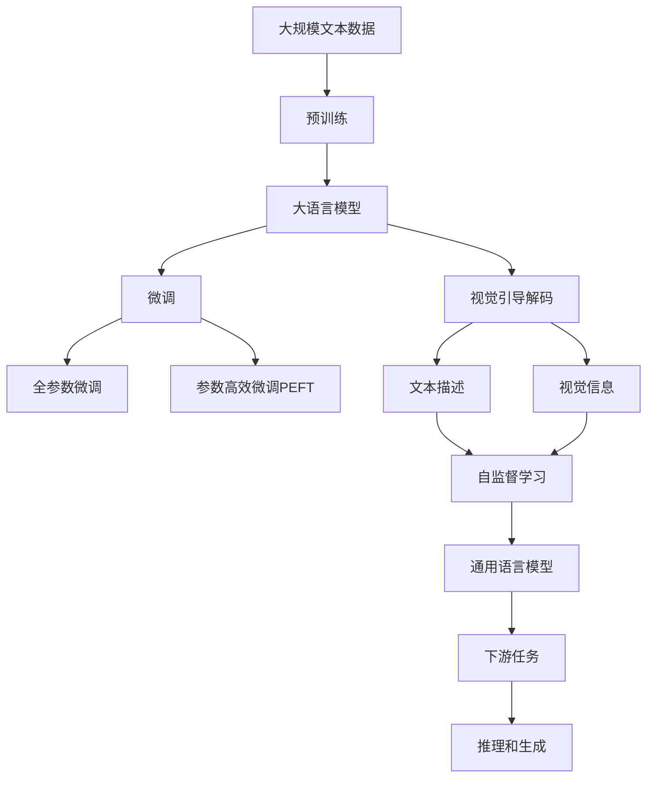

                 

# 大语言模型原理基础与前沿 视觉引导解码策略

> 关键词：大语言模型,视觉引导解码,Transformer,BERT,预训练,下游任务,参数高效微调,自然语言处理(NLP)

## 1. 背景介绍

### 1.1 问题由来
随着深度学习技术的发展，大规模语言模型（Large Language Models, LLMs）在自然语言处理（Natural Language Processing, NLP）领域取得了显著的进展。这些模型如OpenAI的GPT系列模型、Google的BERT等，通过在大规模无标签文本数据上进行预训练，学习到丰富的语言知识和常识，并在特定任务上进行微调（Fine-Tuning），取得了优异的性能。

然而，由于预训练数据集通常不含视觉信息，这些模型在处理视觉引导的NLP任务时表现不佳。例如，当模型需要理解文本描述中的物品、场景、人物等信息时，由于缺乏视觉输入，模型难以充分理解上下文关系，导致推理和生成能力受限。因此，如何在预训练大语言模型中融入视觉信息，提升其在视觉引导NLP任务中的表现，成为了一个重要研究方向。

### 1.2 问题核心关键点
在视觉引导的NLP任务中，大语言模型通常需要同时理解文本描述和与之相关的视觉信息。为了解决这一问题，研究人员提出了一种基于Transformer的视觉引导解码策略。该策略通过在预训练和微调过程中加入视觉信息，使得模型能够更全面地理解任务语义，从而提升其在视觉引导NLP任务中的性能。

该策略的核心思想是：在预训练和微调过程中，通过视觉特征的引入，使模型能够同时学习文本和视觉数据的表示，从而在处理视觉引导的NLP任务时，能够更好地利用文本和视觉信息，进行推理和生成。

## 2. 核心概念与联系

### 2.1 核心概念概述

为更好地理解视觉引导解码策略，本节将介绍几个密切相关的核心概念：

- **大语言模型（Large Language Model, LLM）**：以自回归（如GPT）或自编码（如BERT）模型为代表的大规模预训练语言模型。通过在大规模无标签文本数据上进行预训练，学习通用的语言表示，具备强大的语言理解和生成能力。

- **视觉引导解码（Visual Guided Decoding）**：在视觉引导的NLP任务中，利用视觉特征引导模型理解文本描述，进行推理和生成。视觉引导解码通常涉及将文本描述和视觉信息结合，提升模型对上下文关系的理解能力。

- **Transformer模型**：一种基于自注意力机制的神经网络架构，广泛用于自然语言处理和大规模语言模型的构建。Transformer模型能够高效地处理序列数据，具有并行计算的优势。

- **BERT模型**：由Google提出的一种预训练语言模型，通过在大规模语料库上进行自监督学习，学习文本中的上下文关系，能够提升模型的语言理解能力。

- **预训练（Pre-training）**：指在大规模无标签文本数据上，通过自监督学习任务训练通用语言模型的过程。常见的预训练任务包括言语建模、遮挡语言模型等。

- **微调（Fine-Tuning）**：指在预训练模型的基础上，使用下游任务的少量标注数据，通过有监督学习优化模型在特定任务上的性能。

- **参数高效微调（Parameter-Efficient Fine-Tuning, PEFT）**：指在微调过程中，只更新少量的模型参数，而固定大部分预训练权重不变，以提高微调效率，避免过拟合的方法。

- **自然语言处理（Natural Language Processing, NLP）**：涉及使用计算机处理和理解人类语言的技术和算法，包括文本分类、命名实体识别、机器翻译等任务。

这些核心概念之间的逻辑关系可以通过以下Mermaid流程图来展示：



这个流程图展示了大语言模型、视觉引导解码、预训练和微调之间的关系：

1. 大语言模型通过预训练获得基础能力。
2. 微调是在预训练模型的基础上，使用下游任务的少量标注数据，通过有监督学习优化模型在特定任务上的性能。
3. 视觉引导解码是一种不更新模型参数的方法，可以在不更新模型参数的情况下，实现零样本或少样本学习。
4. 预训练和微调是大语言模型学习过程的核心环节。
5. 视觉引导解码结合文本描述和视觉信息，提升模型对上下文关系的理解能力。
6. 下游任务是模型的应用场景，包括文本分类、命名实体识别、机器翻译等任务。

这些概念共同构成了视觉引导解码策略的理论基础，使得模型能够在视觉引导的NLP任务中，更好地理解和处理文本描述中的视觉信息，提升模型的推理和生成能力。

### 2.2 概念间的关系

这些核心概念之间存在着紧密的联系，形成了视觉引导解码策略的完整生态系统。下面我通过几个Mermaid流程图来展示这些概念之间的关系。

#### 2.2.1 大语言模型的学习范式



这个流程图展示了大语言模型的三种主要学习范式：预训练、微调和视觉引导解码。预训练主要采用自监督学习方法，而微调则是有监督学习的过程。视觉引导解码可以实现零样本和少样本学习。微调又可以分为全参数微调和参数高效微调两种方式。

#### 2.2.2 预训练与微调的关系



这个流程图展示了预训练和大语言模型微调的基本原理，以及它们与下游任务的关系。预训练主要学习文本中的上下文关系，而微调则是在预训练的基础上，针对特定下游任务进行优化，使模型在该任务上表现更好。

#### 2.2.3 视觉引导解码方法



这个流程图展示了视觉引导解码的过程。首先，通过预训练模型学习文本和视觉信息的表示，然后通过微调使模型在特定下游任务上表现更好。在微调过程中，视觉信息被整合到模型中，使其能够更好地理解和处理文本描述中的视觉信息。

### 2.3 核心概念的整体架构

最后，我们用一个综合的流程图来展示这些核心概念在大语言模型视觉引导解码策略中的整体架构：



这个综合流程图展示了从预训练到微调，再到视觉引导解码的完整过程。大语言模型首先在大规模文本数据上进行预训练，然后通过微调（包括全参数微调和参数高效微调）或视觉引导解码（包括零样本和少样本学习）来适应下游任务。在微调过程中，模型能够同时学习文本和视觉数据的表示，从而在处理视觉引导的NLP任务时，能够更好地利用文本和视觉信息，进行推理和生成。

## 3. 核心算法原理 & 具体操作步骤

### 3.1 算法原理概述

视觉引导解码策略的核心在于：在预训练和微调过程中，通过视觉特征的引入，使模型能够同时学习文本和视觉数据的表示，从而在处理视觉引导的NLP任务时，能够更好地利用文本和视觉信息，进行推理和生成。

具体而言，该策略将文本描述和视觉信息同时作为输入，通过Transformer模型进行编码。在编码过程中，模型会同时学习文本和视觉数据的表示，并将这些表示进行融合。然后，根据下游任务的要求，模型输出相应的推理或生成结果。

### 3.2 算法步骤详解

视觉引导解码策略的具体步骤如下：

**Step 1: 准备预训练模型和数据集**
- 选择合适的预训练语言模型 $M_{\theta}$ 作为初始化参数，如 BERT、GPT 等。
- 准备下游任务 $T$ 的标注数据集 $D=\{(x_i, y_i)\}_{i=1}^N$，划分为训练集、验证集和测试集。一般要求标注数据与预训练数据的分布不要差异过大。

**Step 2: 设计任务适配层**
- 根据任务类型，在预训练模型顶层设计合适的输出层和损失函数。
- 对于分类任务，通常在顶层添加线性分类器和交叉熵损失函数。
- 对于生成任务，通常使用语言模型的解码器输出概率分布，并以负对数似然为损失函数。

**Step 3: 设置微调超参数**
- 选择合适的优化算法及其参数，如 AdamW、SGD 等，设置学习率、批大小、迭代轮数等。
- 设置正则化技术及强度，包括权重衰减、Dropout、Early Stopping 等。
- 确定冻结预训练参数的策略，如仅微调顶层，或全部参数都参与微调。

**Step 4: 执行梯度训练**
- 将训练集数据分批次输入模型，前向传播计算损失函数。
- 反向传播计算参数梯度，根据设定的优化算法和学习率更新模型参数。
- 周期性在验证集上评估模型性能，根据性能指标决定是否触发 Early Stopping。
- 重复上述步骤直到满足预设的迭代轮数或 Early Stopping 条件。

**Step 5: 测试和部署**
- 在测试集上评估微调后模型 $M_{\hat{\theta}}$ 的性能，对比微调前后的精度提升。
- 使用微调后的模型对新样本进行推理预测，集成到实际的应用系统中。
- 持续收集新的数据，定期重新微调模型，以适应数据分布的变化。

以上是视觉引导解码策略的一般流程。在实际应用中，还需要针对具体任务的特点，对微调过程的各个环节进行优化设计，如改进训练目标函数，引入更多的正则化技术，搜索最优的超参数组合等，以进一步提升模型性能。

### 3.3 算法优缺点

视觉引导解码策略具有以下优点：
1. 能够同时利用文本和视觉信息，提升模型的推理和生成能力。
2. 适用于各种视觉引导的NLP任务，包括文本描述生成、视觉信息分类、视觉问答等，设计简单的任务适配层即可实现微调。
3. 参数高效微调技术可以避免预训练权重的大规模更新，减少计算成本，提高微调效率。
4. 零样本和少样本学习技术可以在没有标注样本的情况下，利用模型预训练的知识进行推理和生成。

同时，该策略也存在一定的局限性：
1. 对标注数据的质量和数量要求较高。标注数据不足或标注错误会导致模型性能下降。
2. 数据增强和对抗训练等技术需要手动设计，增加了模型的复杂性。
3. 模型推理速度较慢，特别是在处理复杂视觉信息时，计算量较大。
4. 模型对不同视觉信息格式的支持度有限，需要针对具体应用场景进行调整。

尽管存在这些局限性，但视觉引导解码策略在大规模语言模型微调中的应用已经取得了显著的成果，成为NLP技术发展的重要方向之一。

### 3.4 算法应用领域

视觉引导解码策略已经在多个视觉引导的NLP任务上得到了应用，例如：

- 视觉问答（Visual Question Answering, VQA）：给定一张图片和与之相关的文本描述，回答关于图片的问题。
- 文本描述生成（Textual Description Generation）：根据一张图片或一段视频，生成对图片或视频的描述。
- 视觉信息分类（Visual Information Classification）：将文本描述中的视觉信息进行分类，如识别图片中的物品、场景等。
- 图像字幕生成（Image Captioning）：根据一张图片，生成对应的字幕描述。

此外，视觉引导解码策略还被创新性地应用于更多场景中，如可控文本生成、常识推理、代码生成、数据增强等，为NLP技术带来了全新的突破。随着预训练模型和微调方法的不断进步，相信视觉引导解码策略将在更广泛的领域中得到应用，推动NLP技术的进步和发展。

## 4. 数学模型和公式 & 详细讲解 & 举例说明

### 4.1 数学模型构建

本节将使用数学语言对视觉引导解码策略的微调过程进行更加严格的刻画。

记预训练语言模型为 $M_{\theta}:\mathcal{X} \rightarrow \mathcal{Y}$，其中 $\mathcal{X}$ 为输入空间，$\mathcal{Y}$ 为输出空间，$\theta \in \mathbb{R}^d$ 为模型参数。假设微调任务的训练集为 $D=\{(x_i, y_i)\}_{i=1}^N, x_i \in \mathcal{X}, y_i \in \mathcal{Y}$。

定义模型 $M_{\theta}$ 在输入 $x$ 上的损失函数为 $\ell(M_{\theta}(x),y)$，则在数据集 $D$ 上的经验风险为：

$$
\mathcal{L}(\theta) = \frac{1}{N} \sum_{i=1}^N \ell(M_{\theta}(x_i),y_i)
$$

在视觉引导解码策略中，模型需要同时处理文本描述和视觉信息。假设文本描述 $x$ 由 $(x_t, x_v)$ 组成，其中 $x_t$ 为文本部分，$x_v$ 为视觉部分。模型输入 $(x_t, x_v)$ 后，通过Transformer模型进行编码，生成文本和视觉表示 $h_t$ 和 $h_v$。然后，模型根据下游任务的要求，输出相应的推理或生成结果。

### 4.2 公式推导过程

以下我们以文本描述生成任务为例，推导视觉引导解码策略的损失函数及其梯度的计算公式。

假设模型 $M_{\theta}$ 在输入 $(x_t, x_v)$ 上的输出为 $\hat{y}=M_{\theta}(x_t, x_v) \in [0,1]$，表示样本属于正类的概率。真实标签 $y \in \{0,1\}$。则二分类交叉熵损失函数定义为：

$$
\ell(M_{\theta}(x_t, x_v),y) = -[y\log \hat{y} + (1-y)\log (1-\hat{y})]
$$

将其代入经验风险公式，得：

$$
\mathcal{L}(\theta) = -\frac{1}{N}\sum_{i=1}^N [y_i\log M_{\theta}(x_{t,i}, x_{v,i})+(1-y_i)\log(1-M_{\theta}(x_{t,i}, x_{v,i}))]
$$

在视觉引导解码策略中，模型输入 $(x_t, x_v)$ 后，通过Transformer模型进行编码，生成文本和视觉表示 $h_t$ 和 $h_v$。假设文本和视觉表示的长度为 $L_t$ 和 $L_v$。则模型在文本和视觉输入上的编码过程可以表示为：

$$
h_t = \text{Encoder}(M_{\theta}(x_t))
$$
$$
h_v = \text{Encoder}(M_{\theta}(x_v))
$$

其中，$\text{Encoder}$ 表示Transformer模型中的编码器部分。

然后，模型将文本和视觉表示进行融合，得到最终的文本表示 $h$。具体融合方式可以采用加权平均、拼接、多头注意力等方法。假设融合方式为加权平均，则有：

$$
h = \lambda h_t + (1-\lambda) h_v
$$

其中 $\lambda$ 为文本和视觉表示的权重。在训练过程中，权重 $\lambda$ 可以通过交叉验证等方法进行优化。

最后，模型根据下游任务的要求，输出相应的推理或生成结果。假设下游任务为文本描述生成，则模型的输出为生成的文本描述 $\hat{y}$。模型在文本描述生成任务上的损失函数为：

$$
\ell(M_{\theta}(x_t, x_v),y) = -[y\log \hat{y} + (1-y)\log (1-\hat{y})]
$$

在视觉引导解码策略中，模型的训练过程可以分成两个阶段：预训练和微调。

在预训练阶段，模型仅利用文本部分 $x_t$ 进行训练，忽略视觉部分 $x_v$。预训练的目的是使模型学习到文本的通用表示能力。假设预训练的损失函数为 $\mathcal{L}_{pre}$，则预训练的优化目标是最小化预训练损失：

$$
\theta^* = \mathop{\arg\min}_{\theta} \mathcal{L}_{pre}(\theta)
$$

在微调阶段，模型利用文本和视觉输入 $(x_t, x_v)$ 进行训练，学习视觉引导的文本描述生成能力。微调的目的是使模型在特定下游任务上表现更好。假设微调的损失函数为 $\mathcal{L}_{fin}$，则微调的优化目标是最小化微调损失：

$$
\theta^* = \mathop{\arg\min}_{\theta} \mathcal{L}_{fin}(\theta)
$$

在微调过程中，模型的权重 $\lambda$ 也需要进行优化。假设优化后的权重为 $\hat{\lambda}$，则微调的优化目标可以表示为：

$$
\hat{\lambda} = \mathop{\arg\min}_{\lambda} \mathcal{L}_{fin}(\lambda)
$$

综上，视觉引导解码策略的微调过程可以表示为：

$$
\theta = \mathop{\arg\min}_{\theta} \mathcal{L}_{fin}(\theta) + \mathcal{L}_{pre}(\theta)
$$

其中 $\mathcal{L}_{fin}$ 为微调损失，$\mathcal{L}_{pre}$ 为预训练损失，$\lambda$ 为文本和视觉表示的权重。

在实际应用中，可以使用AdamW等优化算法进行优化，具体优化参数需要根据任务特点进行调整。

### 4.3 案例分析与讲解

以视觉问答（VQA）任务为例，展示视觉引导解码策略的应用。

在VQA任务中，模型需要根据文本描述和图片，回答问题。假设文本描述为 $x_t$，图片为 $x_v$，问题为 $y$。模型的输入为 $(x_t, x_v)$，输出为问题答案 $\hat{y}$。假设模型的损失函数为交叉熵损失，则有：

$$
\ell(M_{\theta}(x_t, x_v),y) = -[y\log \hat{y} + (1-y)\log (1-\hat{y})]
$$

模型的编码过程可以表示为：

$$
h_t = \text{Encoder}(M_{\theta}(x_t))
$$
$$
h_v = \text{Encoder}(M_{\theta}(x_v))
$$

然后将文本和视觉表示进行融合，得到最终的文本表示 $h$。假设融合方式为加权平均，则有：

$$
h = \lambda h_t + (1-\lambda) h_v
$$

最后，模型根据VQA任务的要求，输出相应的推理结果。假设模型的推理过程为softmax解码，则有：

$$
\hat{y} = \text{Softmax}(\text{DotProduct}(h, Q))
$$

其中 $Q$ 为问题向量的查询表示，可以通过预训练模型或微调过程中学习得到。

在微调过程中，模型的权重 $\lambda$ 也需要进行优化。假设优化后的权重为 $\hat{\lambda}$，则微调的优化目标可以表示为：

$$
\hat{\lambda} = \mathop{\arg\min}_{\lambda} \mathcal{L}_{fin}(\lambda)
$$

其中 $\mathcal{L}_{fin}$ 为VQA任务的损失函数。在实际应用中，可以使用AdamW等优化算法进行优化，具体优化参数需要根据任务特点进行调整。

## 5. 项目实践：代码实例和详细解释说明

### 5.1 开发环境搭建

在进行视觉引导解码策略的微调实践前，我们需要准备好开发环境。以下是使用Python进行PyTorch开发的环境配置流程：

1. 安装Anaconda：从官网下载并安装Anaconda，用于创建独立的Python环境。

2. 创建并激活虚拟环境：
```bash
conda create -n pytorch-env python=3.8 
conda activate pytorch-env
```

3. 安装PyTorch：根据CUDA版本，从官网获取对应的安装命令。例如：
```bash
conda install pytorch torchvision torchaudio cudatoolkit=11.1 -c pytorch -c conda-forge
```

4. 安装Transformers库：
```bash
pip install transformers
```

5. 安装各类工具包：
```bash
pip install numpy pandas scikit-learn matplotlib tqdm jupyter notebook ipython
```

完成上述步骤后，即可在`pytorch-env`环境中开始微调实践。

### 5.2 源代码详细实现

这里我们以视觉问答（VQA）任务为例，给出使用Transformers库对BERT模型进行微调的PyTorch代码实现。

首先，定义VQA任务的数据处理函数：

```python
from transformers import BertTokenizer
from torch.utils.data import Dataset
import torch

class VqaDataset(Dataset):
    def __init__(self, texts, images, captions, question, tokenizer, max_len=128):
        self.texts = texts
        self.images = images
        self.captions = captions
        self.question = question
        self.tokenizer = tokenizer
        self.max_len = max_len
        
    def __len__(self):
        return len(self.texts)
    
    def __getitem__(self, item):
        text = self.texts[item]
        image = self.images[item]
        caption = self.captions[item]
        question = self.question[item]
        
        encoding = self.tokenizer(text, return_tensors='pt', max_length=self.max_len, padding='max_length', truncation=True)
        input_ids = encoding['input_ids'][0]
        attention_mask = encoding['attention_mask'][0]
        
        # 对token-wise的标签进行编码
        encoded_tags = [tag2id[tag] for tag in question] 
        encoded_tags.extend([tag2id['O']] * (self.max_len - len(encoded_tags)))
        labels = torch.tensor(encoded_tags, dtype=torch.long)
        
        return {'input_ids': input_ids, 
                'attention_mask': attention_mask,
                'labels': labels,
                'image': image,
                'caption': caption}

# 标签与id的映射
tag2id = {'O': 0, 'B-ANSWER': 1, 'I-ANSWER': 2, 'B-PER': 3, 'I-PER': 4, 'B-LOC': 5, 'I-LOC': 6}
id2tag = {v: k for k, v in tag2id.items()}

# 创建dataset
tokenizer = BertTokenizer.from_pretrained('bert-base-cased')

train_dataset = VqaDataset(train_texts, train_images, train_captions, train_question, tokenizer)
dev_dataset = VqaDataset(dev_texts, dev_images, dev_captions, dev_question, tokenizer)
test_dataset = VqaDataset(test_texts, test_images, test_captions, test_question, tokenizer)
```

然后，定义模型和优化器：

```python
from transformers import BertForTokenClassification, AdamW

model = BertForTokenClassification.from_pretrained('bert-base-cased', num_labels=len(tag2id))

optimizer = AdamW(model.parameters(), lr=2e-5)
```

接着，定义训练和评估函数：

```python
from torch.utils.data import DataLoader
from tqdm import tqdm
from sklearn.metrics import classification_report

device = torch.device('cuda') if torch.cuda.is_available() else torch.device('cpu')
model.to(device)

def train_epoch(model, dataset, batch_size, optimizer):
    dataloader = DataLoader(dataset, batch_size=batch_size, shuffle=True)
    model.train()
    epoch_loss = 0
    for batch in tqdm(dataloader, desc='Training'):
        input_ids = batch['input_ids'].to(device)
        attention_mask = batch['attention_mask'].to(device

