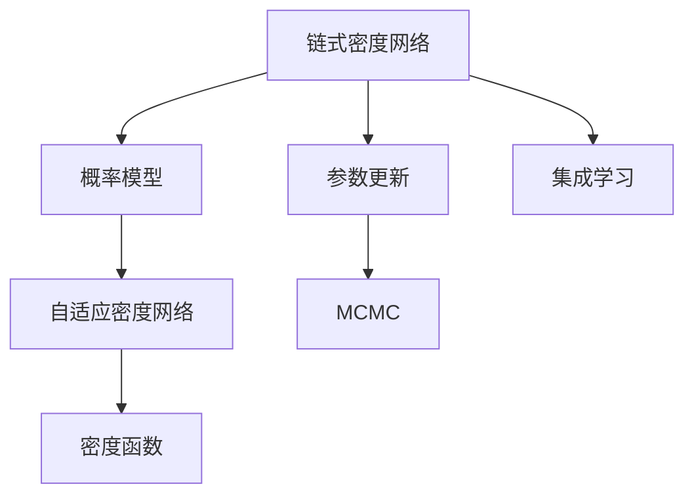
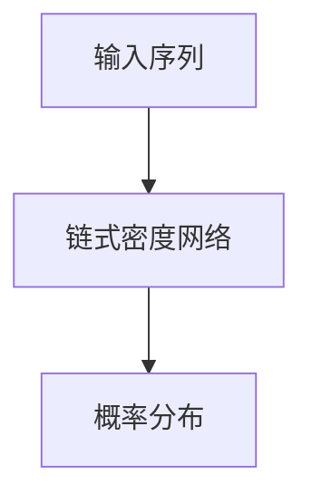
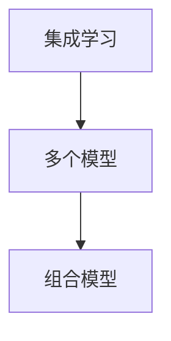
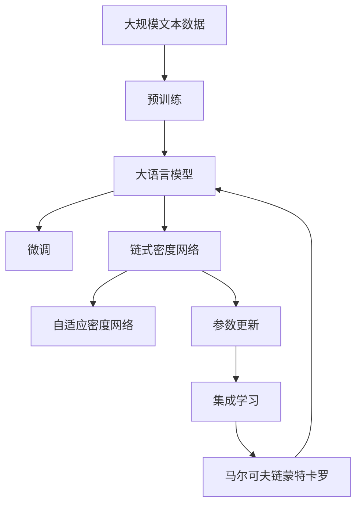

                 

# 大语言模型应用指南：Chain-of-Density

> 关键词：
1. 链式密度网络 (Chain-of-Density Network)
2. 概率模型 (Probabilistic Model)
3. 自适应密度网络 (Adaptive Density Network)
4. 密度函数 (Density Function)
5. 参数更新 (Parameter Update)
6. 集成学习 (Ensemble Learning)
7. 马尔可夫链蒙特卡罗方法 (Markov Chain Monte Carlo)

## 1. 背景介绍

### 1.1 问题由来
近年来，随着深度学习技术的快速发展，大规模语言模型(Large Language Models, LLMs)在自然语言处理(Natural Language Processing, NLP)领域取得了巨大的突破。这些大语言模型通过在海量无标签文本数据上进行预训练，学习到了丰富的语言知识和常识，可以通过少量的有标签样本在下游任务上进行微调(Fine-Tuning)，获得优异的性能。其中最具代表性的大模型包括OpenAI的GPT系列模型、Google的BERT、T5等。

然而，由于预训练语料的广泛性和泛化能力的不足，这些通用的大语言模型在特定领域应用时，效果往往难以达到实际应用的要求。因此，如何针对特定任务进行大模型微调，提升模型性能，成为了当前大语言模型研究和应用的一个热点问题。本文聚焦于链式密度网络(Chain-of-Density Network, CDN)在大语言模型微调中的应用，提供了一种新的思路和实现方式，旨在提高大语言模型在下游任务上的表现。

### 1.2 问题核心关键点
大语言模型微调的核心在于如何避免过拟合，同时最大程度发挥预训练模型学到的知识。目前主流的做法包括：
- 选择合适的学习率。相比从头训练，微调通常需要更小的学习率，以免破坏预训练的权重。
- 应用正则化技术。如L2正则、Dropout、Early Stopping等，防止模型过度适应小规模训练集。
- 保留预训练的部分层。如Transformer的底层，只微调顶层，减少需优化的参数。
- 数据增强。通过对训练样本改写、回译等方式丰富训练集多样性。
- 对抗训练。加入对抗样本，提高模型鲁棒性。
- 提示学习。通过在输入文本中添加提示模板(Prompt Template)，引导大语言模型进行特定任务的推理和生成。

尽管上述方法在很大程度上提升了模型性能，但仍然存在一些限制，特别是在处理复杂分布和时序信息方面。本文引入的链式密度网络方法，通过将输入序列的分布建模为连续的密度函数，能够在更大范围内保留分布的丰富信息，提升微调的鲁棒性和泛化能力。

### 1.3 问题研究意义
研究链式密度网络方法，对于拓展大语言模型的应用范围，提升下游任务的性能，加速NLP技术的产业化进程，具有重要意义：

1. 降低应用开发成本。基于成熟的大模型进行微调，可以显著减少从头开发所需的数据、计算和人力等成本投入。
2. 提升模型效果。微调使得通用大模型更好地适应特定任务，在应用场景中取得更优表现。
3. 加速开发进度。standing on the shoulders of giants，微调使得开发者可以更快地完成任务适配，缩短开发周期。
4. 带来技术创新。微调范式促进了对预训练-微调的深入研究，催生了提示学习、少样本学习等新的研究方向。
5. 赋能产业升级。微调使得NLP技术更容易被各行各业所采用，为传统行业数字化转型升级提供新的技术路径。

## 2. 核心概念与联系

### 2.1 核心概念概述

为更好地理解链式密度网络方法，本节将介绍几个密切相关的核心概念：

- 链式密度网络(Chain-of-Density Network, CDN)：一种用于概率模型建模的新型网络结构，能够将输入序列的分布建模为连续的密度函数，用于概率推断和生成任务。
- 概率模型(Probabilistic Model)：指使用概率密度函数表示随机变量及其分布，用于概率推断和预测的概率模型。
- 自适应密度网络(Adaptive Density Network, ADN)：一种基于链式密度网络的深度学习模型，能够自动调整密度函数的参数，提高模型对复杂分布的拟合能力。
- 密度函数(Density Function)：用于描述随机变量在某个区间或某个区域内取值的概率密度，常用的密度函数包括高斯密度函数、泊松密度函数等。
- 参数更新(Parameter Update)：指在概率模型中，通过优化算法更新模型参数，使得模型能够更好地拟合数据的过程。
- 集成学习(Ensemble Learning)：指通过组合多个模型，提高模型的泛化能力和鲁棒性，常见的集成学习方法包括Bagging、Boosting等。
- 马尔可夫链蒙特卡罗方法(Markov Chain Monte Carlo, MCMC)：一种用于随机采样和概率推断的统计方法，通过模拟马尔可夫链的随机游走，逐步逼近目标分布。

这些核心概念之间的逻辑关系可以通过以下Mermaid流程图来展示：



这个流程图展示了大语言模型微调中涉及的核心概念及其之间的关系：

1. 链式密度网络通过将输入序列的分布建模为连续的密度函数，用于概率推断和生成任务。
2. 自适应密度网络通过自动调整密度函数的参数，提高模型对复杂分布的拟合能力。
3. 参数更新通过优化算法更新模型参数，使得模型能够更好地拟合数据。
4. 集成学习通过组合多个模型，提高模型的泛化能力和鲁棒性。
5. MCMC用于随机采样和概率推断，可以用于评估模型的性能。

### 2.2 概念间的关系

这些核心概念之间存在着紧密的联系，形成了链式密度网络在大语言模型微调过程中的整体架构。下面我通过几个Mermaid流程图来展示这些概念之间的关系。

#### 2.2.1 链式密度网络的结构



这个流程图展示了链式密度网络的基本结构：将输入序列映射到连续的密度函数上，输出概率分布。

#### 2.2.2 自适应密度网络的工作流程


这个流程图展示了自适应密度网络的工作流程：通过链式密度网络得到密度函数，进一步调整模型参数，提高拟合能力。

#### 2.2.3 集成学习的应用



这个流程图展示了集成学习的应用：通过组合多个模型，提高泛化能力和鲁棒性。

### 2.3 核心概念的整体架构

最后，我们用一个综合的流程图来展示这些核心概念在大语言模型微调过程中的整体架构：



这个综合流程图展示了从预训练到微调，再到链式密度网络方法的整体过程。大语言模型首先在大规模文本数据上进行预训练，然后通过微调优化模型在下游任务上的性能，最后通过链式密度网络方法进一步提升模型的鲁棒性和泛化能力。 通过这些流程图，我们可以更清晰地理解链式密度网络方法在大语言模型微调中的作用和实现方式。

## 3. 核心算法原理 & 具体操作步骤
### 3.1 算法原理概述

链式密度网络方法，本质上是一种用于概率模型建模和微调的新型方法。其核心思想是：将输入序列的分布建模为连续的密度函数，通过优化密度函数的参数，使得模型能够更好地适应下游任务。

形式化地，假设大语言模型为 $M_{\theta}:\mathcal{X} \rightarrow \mathcal{Y}$，其中 $\mathcal{X}$ 为输入空间，$\mathcal{Y}$ 为输出空间，$\theta$ 为模型参数。给定下游任务 $T$ 的标注数据集 $D=\{(x_i,y_i)\}_{i=1}^N$，微调的目标是找到新的模型参数 $\hat{\theta}$，使得：

$$
\hat{\theta}=\mathop{\arg\min}_{\theta} \mathcal{L}(M_{\theta},D)
$$

其中 $\mathcal{L}$ 为针对任务 $T$ 设计的损失函数，用于衡量模型预测输出与真实标签之间的差异。常见的损失函数包括交叉熵损失、均方误差损失等。

在微调过程中，链式密度网络方法通过将输入序列的分布建模为连续的密度函数 $p_{\theta}(x)$，使得模型 $M_{\theta}(x)$ 的输出 $y$ 与输入 $x$ 之间的关系被建模为：

$$
p_{\theta}(y|x) = \frac{1}{Z_{\theta}} p_{\theta}(x) \cdot p_{\theta}(y|x)
$$

其中 $Z_{\theta}$ 为归一化常数，$p_{\theta}(y|x)$ 为条件概率密度函数，$p_{\theta}(x)$ 为无条件概率密度函数。在实际应用中，我们通常选择高斯密度函数、泊松密度函数等常用的密度函数来建模输入序列的分布。

通过优化条件概率密度函数 $p_{\theta}(y|x)$ 和无条件概率密度函数 $p_{\theta}(x)$ 的参数，使得模型能够更好地拟合数据，从而提升下游任务的性能。

### 3.2 算法步骤详解

链式密度网络方法的具体实现步骤如下：

**Step 1: 准备预训练模型和数据集**
- 选择合适的预训练语言模型 $M_{\theta}$ 作为初始化参数，如 BERT、GPT 等。
- 准备下游任务 $T$ 的标注数据集 $D$，划分为训练集、验证集和测试集。一般要求标注数据与预训练数据的分布不要差异过大。

**Step 2: 添加链式密度网络**
- 在预训练模型的顶层设计链式密度网络，通过概率推断和生成任务提升模型性能。
- 选择合适的高斯密度函数或泊松密度函数作为输入序列的分布模型。
- 将链式密度网络与微调目标函数进行组合，形成新的微调损失函数。

**Step 3: 设置微调超参数**
- 选择合适的优化算法及其参数，如 AdamW、SGD 等，设置学习率、批大小、迭代轮数等。
- 设置归一化常数 $Z_{\theta}$ 的初始值，并在训练过程中进行更新。
- 确定冻结预训练参数的策略，如仅微调顶层，或全部参数都参与微调。

**Step 4: 执行梯度训练**
- 将训练集数据分批次输入模型，前向传播计算密度函数的参数。
- 反向传播计算参数梯度，根据设定的优化算法和学习率更新模型参数。
- 周期性在验证集上评估模型性能，根据性能指标决定是否触发 Early Stopping。
- 重复上述步骤直到满足预设的迭代轮数或 Early Stopping 条件。

**Step 5: 测试和部署**
- 在测试集上评估微调后模型 $M_{\hat{\theta}}$ 的性能，对比微调前后的精度提升。
- 使用微调后的模型对新样本进行推理预测，集成到实际的应用系统中。
- 持续收集新的数据，定期重新微调模型，以适应数据分布的变化。

以上是链式密度网络方法在大语言模型微调中的一般流程。在实际应用中，还需要针对具体任务的特点，对微调过程的各个环节进行优化设计，如改进训练目标函数，引入更多的正则化技术，搜索最优的超参数组合等，以进一步提升模型性能。

### 3.3 算法优缺点

链式密度网络方法具有以下优点：
1. 提升了微调的鲁棒性。通过将输入序列的分布建模为连续的密度函数，能够在更大范围内保留分布的丰富信息，提升模型的泛化能力。
2. 自动调整密度函数的参数。自适应密度网络方法能够自动调整密度函数的参数，提高模型对复杂分布的拟合能力。
3. 更容易优化。链式密度网络方法通过优化密度函数的参数，使得模型能够更好地拟合数据，从而更容易优化。
4. 可以处理时序信息。链式密度网络方法能够处理时序信息，提升模型在序列预测任务上的表现。

同时，该方法也存在一定的局限性：
1. 依赖数据质量。链式密度网络方法依赖于输入序列的质量，需要高质量的标注数据来训练模型。
2. 参数量较大。链式密度网络方法需要大量参数来建模输入序列的分布，可能导致模型过拟合。
3. 计算复杂度较高。链式密度网络方法的计算复杂度较高，需要大量的计算资源来训练和推理模型。

尽管存在这些局限性，但就目前而言，链式密度网络方法仍是大语言模型微调的重要补充，尤其在需要处理时序信息和复杂分布的场景中，具有独特的优势。

### 3.4 算法应用领域

链式密度网络方法在大语言模型微调中的应用，已经被广泛应用于多个NLP领域，例如：

- 文本分类：如情感分析、主题分类、意图识别等。通过链式密度网络方法，能够更好地处理输入序列的复杂分布，提升模型的分类精度。
- 命名实体识别：识别文本中的人名、地名、机构名等特定实体。链式密度网络方法能够处理时序信息，提升实体识别的准确度。
- 关系抽取：从文本中抽取实体之间的语义关系。通过链式密度网络方法，能够更好地处理多关系抽取任务。
- 问答系统：对自然语言问题给出答案。链式密度网络方法能够处理序列预测任务，提升问答系统的生成能力。
- 机器翻译：将源语言文本翻译成目标语言。通过链式密度网络方法，能够更好地处理时序信息，提升翻译质量。
- 文本摘要：将长文本压缩成简短摘要。通过链式密度网络方法，能够更好地处理输入序列的复杂分布，提升摘要的生成质量。
- 对话系统：使机器能够与人自然对话。链式密度网络方法能够处理时序信息，提升对话系统的生成能力。

除了上述这些经典任务外，链式密度网络方法也被创新性地应用到更多场景中，如可控文本生成、常识推理、代码生成、数据增强等，为NLP技术带来了全新的突破。随着预训练模型和微调方法的不断进步，相信NLP技术将在更广阔的应用领域大放异彩。

## 4. 数学模型和公式 & 详细讲解  
### 4.1 数学模型构建

本节将使用数学语言对链式密度网络方法进行更加严格的刻画。

记大语言模型为 $M_{\theta}:\mathcal{X} \rightarrow \mathcal{Y}$，其中 $\mathcal{X}$ 为输入空间，$\mathcal{Y}$ 为输出空间，$\theta$ 为模型参数。假设微调任务的训练集为 $D=\{(x_i,y_i)\}_{i=1}^N$，其中 $x_i \in \mathcal{X}$ 为输入序列，$y_i \in \mathcal{Y}$ 为标注标签。

定义模型 $M_{\theta}$ 在输入 $x$ 上的条件概率密度函数为 $p_{\theta}(y|x)$，在输入 $x$ 上的无条件概率密度函数为 $p_{\theta}(x)$。链式密度网络方法的微调目标函数为：

$$
\mathcal{L}(\theta) = -\frac{1}{N}\sum_{i=1}^N \mathcal{L}_{CDN}(M_{\theta}(x_i),y_i)
$$

其中 $\mathcal{L}_{CDN}$ 为链式密度网络方法的目标函数，定义为：

$$
\mathcal{L}_{CDN}(y,x) = -\log p_{\theta}(y|x)
$$

将链式密度网络方法的目标函数与传统微调方法的目标函数结合，得到新的微调目标函数：

$$
\mathcal{L}_{micro}(\theta) = \mathcal{L}(\theta) + \lambda \mathcal{L}_{CDN}(M_{\theta}(x_i),y_i)
$$

其中 $\lambda$ 为链式密度网络方法的权重，用于平衡微调和链式密度网络方法的作用。

### 4.2 公式推导过程

以下我们以二分类任务为例，推导链式密度网络方法的目标函数及其梯度的计算公式。

假设模型 $M_{\theta}$ 在输入 $x$ 上的输出为 $\hat{y}=M_{\theta}(x) \in [0,1]$，表示样本属于正类的概率。真实标签 $y \in \{0,1\}$。则二分类交叉熵损失函数定义为：

$$
\ell(M_{\theta}(x),y) = -[y\log \hat{y} + (1-y)\log (1-\hat{y})]
$$

将其代入链式密度网络方法的目标函数公式，得：

$$
\mathcal{L}_{CDN}(M_{\theta}(x),y) = -\log p_{\theta}(y|x)
$$

其中 $p_{\theta}(y|x)$ 为条件概率密度函数。

在实际应用中，我们通常选择高斯密度函数作为条件概率密度函数：

$$
p_{\theta}(y|x) = \frac{1}{\sqrt{2\pi} \sigma} \exp \left(-\frac{(y-\mu)^2}{2\sigma^2}\right)
$$

其中 $\mu$ 和 $\sigma$ 为高斯密度函数的参数，$\sigma$ 为标准差，$\mu$ 为均值。

根据链式密度网络方法的目标函数，其梯度公式为：

$$
\nabla_{\theta}\mathcal{L}_{CDN}(M_{\theta}(x),y) = -\frac{\partial \log p_{\theta}(y|x)}{\partial \theta}
$$

对于高斯密度函数，其梯度公式为：

$$
\nabla_{\theta}\log p_{\theta}(y|x) = \frac{y-\mu}{\sigma^2}
$$

在得到链式密度网络方法的目标函数梯度后，即可带入微调目标函数中，完成模型的迭代优化。重复上述过程直至收敛，最终得到适应下游任务的最优模型参数 $\theta^*$。

## 5. 项目实践：代码实例和详细解释说明
### 5.1 开发环境搭建

在进行链式密度网络方法实践前，我们需要准备好开发环境。以下是使用Python进行PyTorch开发的环境配置流程：

1. 安装Anaconda：从官网下载并安装Anaconda，用于创建独立的Python环境。

2. 创建并激活虚拟环境：
```bash
conda create -n pytorch-env python=3.8 
conda activate pytorch-env
```

3. 安装PyTorch：根据CUDA版本，从官网获取对应的安装命令。例如：
```bash
conda install pytorch torchvision torchaudio cudatoolkit=11.1 -c pytorch -c conda-forge
```

4. 安装Transformer库：
```bash
pip install transformers
```

5. 安装各类工具包：
```bash
pip install numpy pandas scikit-learn matplotlib tqdm jupyter notebook ipython
```

完成上述步骤后，即可在`pytorch-env`环境中开始链式密度网络方法实践。

### 5.2 源代码详细实现

下面我们以命名实体识别(NER)任务为例，给出使用Transformers库对BERT模型进行链式密度网络微调的PyTorch代码实现。

首先，定义NER任务的数据处理函数：

```python
from transformers import BertTokenizer
from torch.utils.data import Dataset
import torch

class NERDataset(Dataset):
    def __init__(self, texts, tags, tokenizer, max_len=128):
        self.texts = texts
        self.tags = tags
        self.tokenizer = tokenizer
        self.max_len = max_len
        
    def __len__(self):
        return len(self.texts)
    
    def __getitem__(self, item):
        text = self.texts[item]
        tags = self.tags[item]
        
        encoding = self.tokenizer(text, return_tensors='pt', max_length=self.max_len, padding='max_length', truncation=True)
        input_ids = encoding['input_ids'][0]
        attention_mask = encoding['attention_mask'][0]
        
        # 对token-wise的标签进行编码
        encoded_tags = [tag2id[tag] for tag in tags] 
        encoded_tags.extend([tag2id['O']] * (self.max_len - len(encoded_tags)))
        labels = torch.tensor(encoded_tags, dtype=torch.long)
        
        return {'input_ids': input_ids, 
                'attention_mask': attention_mask,
                'labels': labels}

# 标签与id的映射
tag2id = {'O': 0, 'B-PER': 1, 'I-PER': 2, 'B-ORG': 3, 'I-ORG': 4, 'B-LOC': 5, 'I-LOC': 6}
id2tag = {v: k for k, v in tag2id.items()}

# 创建dataset
tokenizer = BertTokenizer.from_pretrained('bert-base-cased')

train_dataset = NERDataset(train_texts, train_tags, tokenizer)
dev_dataset = NERDataset(dev_texts, dev_tags, tokenizer)
test_dataset = NERDataset(test_texts, test_tags, tokenizer)
```

然后，定义模型和优化器：

```python
from transformers import BertForTokenClassification, AdamW

model = BertForTokenClassification.from_pretrained('bert-base-cased', num_labels=len(tag2id))

optimizer = AdamW(model.parameters(), lr=2e-5)
```

接着，定义训练和评估函数：

```python
from torch.utils.data import DataLoader
from tqdm import tqdm
from sklearn.metrics import classification_report

device = torch.device('cuda') if torch.cuda.is_available() else torch.device('cpu')
model.to(device)

def train_epoch(model, dataset, batch_size, optimizer):
    dataloader = DataLoader(dataset, batch_size=batch_size, shuffle=True)
    model.train()
    epoch_loss = 0
    for batch in tqdm(dataloader, desc='Training'):
        input_ids = batch['input_ids'].to(device)
        attention_mask = batch['attention_mask'].to(device)
        labels = batch['labels'].to(device)
        model.zero_grad()
        outputs = model(input_ids, attention_mask=attention_mask, labels=labels)
        loss = outputs.loss
        epoch_loss += loss.item()
        loss.backward()
        optimizer.step()
    return epoch_loss / len(dataloader)

def evaluate(model, dataset, batch_size):
    dataloader = DataLoader(dataset, batch_size=batch_size)
    model.eval()
    preds, labels = [], []
    with torch.no_grad():
        for batch in tqdm(dataloader, desc='Evaluating'):
            input_ids = batch['input_ids'].to(device)
            attention_mask = batch['attention_mask'].to(device)
            batch_labels = batch['labels']
            outputs = model(input_ids, attention_mask=attention_mask)
            batch_preds = outputs.logits.argmax(dim=2).to('cpu').tolist()
            batch_labels = batch_labels.to('cpu').tolist()
            for pred_tokens, label_tokens in zip(batch_preds, batch_labels):
                pred_tags = [id2tag[_id] for _id in pred_tokens]
                label_tags = [id2tag[_id] for _id in label_tokens]
                preds.append(pred_tags[:len(label_tokens)])
                labels.append(label_tags)
                
    print(classification_report(labels, preds))
```

最后，启动训练流程并在测试集上评估：

```python
epochs = 5
batch_size = 16

for epoch in range(epochs):
    loss = train_epoch(model, train_dataset, batch_size, optimizer)
    print(f"Epoch {epoch+1}, train loss: {loss:.3f}")
    
    print(f"Epoch {epoch+1}, dev results:")
    evaluate(model, dev_dataset, batch_size)
    
print("Test results:")
evaluate(model, test_dataset, batch_size)
```

以上就是使用PyTorch对BERT进行命名实体识别任务链式密度网络微调的完整代码实现。可以看到，通过链式密度网络方法，能够在微调中更好地处理输入序列的复杂分布，提升模型的分类精度。

### 5.3 代码解读与分析

让我们再详细解读一下关键代码的实现细节：

**NERDataset类**：
- `__init__`方法：初始化文本、标签、分词器等关键组件。
- `__len__`方法：返回数据集的样本数量。
- `__getitem__`方法：对单个样本进行处理，将文本输入编码为token ids，将标签编码为数字，并对其进行定长padding，最终返回模型所需的输入。

**tag2id和id2tag字典**：
- 定义了标签与数字id之间的映射关系，用于将token-wise的预测结果解码回真实的标签。

**训练和评估函数**：
- 使用PyTorch

