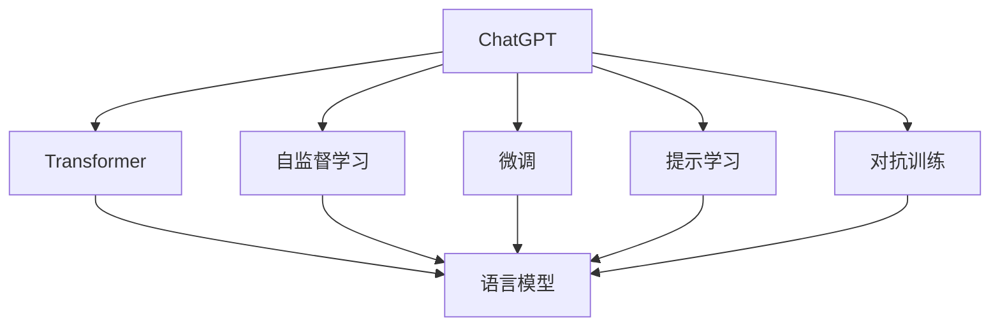
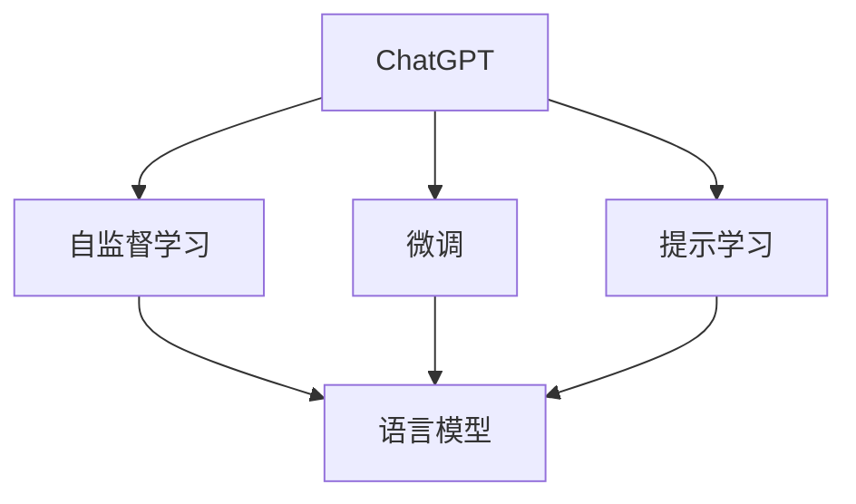
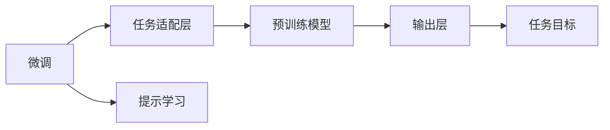
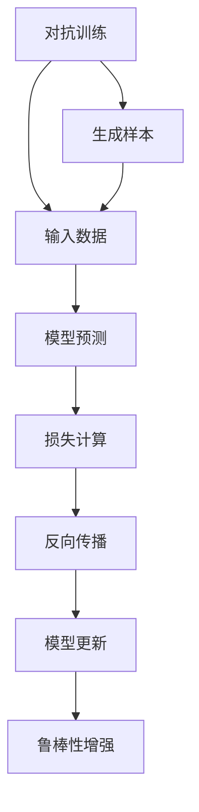
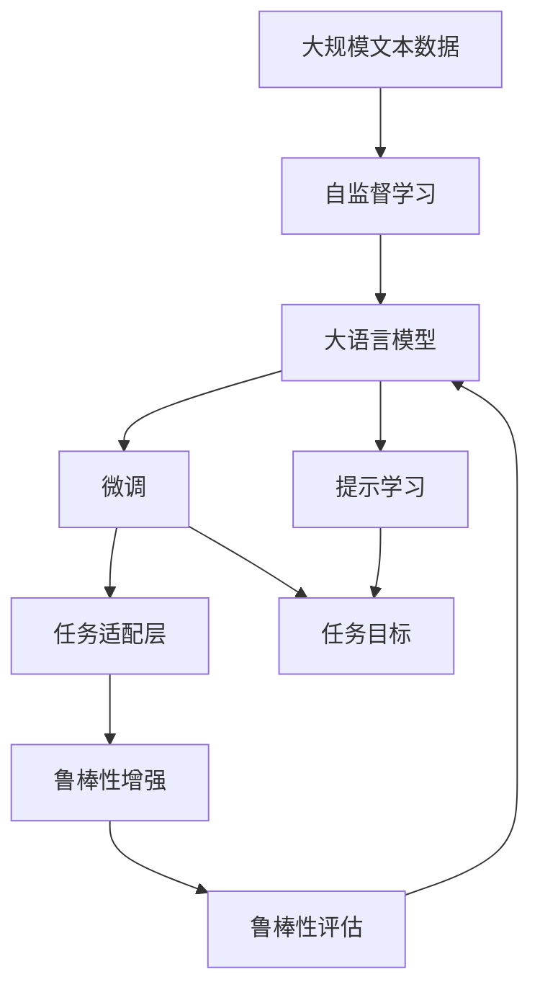

                 

# 大语言模型应用指南：ChatGPT扩展功能原理

## 1. 背景介绍

### 1.1 问题由来
近年来，OpenAI开发的ChatGPT大语言模型，以其卓越的自然语言生成能力，迅速在全球范围内掀起了一股人工智能热潮。作为GPT-3.5的升级版，ChatGPT不仅在对话生成、内容创作、文本摘要等任务上表现出色，还在游戏、开发、教育等诸多领域展现了强大的应用潜力。本文将系统探讨ChatGPT的核心原理，以及如何通过技术扩展和算法优化，进一步提升其性能和实用性。

### 1.2 问题核心关键点
ChatGPT的强大表现，主要依赖于其先进的Transformer架构和深度学习技术。它通过在大规模无标签文本数据上进行预训练，学习到丰富的语言知识和常识，并能够通过微调和提示学习等技术，在特定任务上进一步提升表现。然而，为了适应不同应用场景的需求，ChatGPT的功能扩展和性能优化仍需进一步研究和实践。

### 1.3 问题研究意义
探讨ChatGPT的扩展功能原理，对于推动自然语言处理技术的发展，拓展其应用边界，提高实际应用效果，具有重要意义：

1. 提高应用效率。通过扩展和优化，ChatGPT可以更高效地处理复杂任务，如代码生成、自然语言推理、语音识别等，加速人工智能技术在各行业的落地应用。
2. 增强功能灵活性。扩展后的ChatGPT能够更好地适应多样化的应用需求，满足不同用户对智能化交互的需求。
3. 提升用户体验。功能丰富的ChatGPT可以提供更自然、更智能的对话体验，增强用户粘性，推动人工智能技术的普及。
4. 开拓新应用场景。ChatGPT的功能扩展，将为更多领域带来新的技术解决方案，如智能客服、智能翻译、虚拟助手等。

## 2. 核心概念与联系

### 2.1 核心概念概述

为更好地理解ChatGPT的核心原理，本节将介绍几个密切相关的核心概念：

- **Transformer**：一种基于自注意力机制的深度学习模型，主要用于处理序列数据，如文本、语音等。ChatGPT的主要架构即为Transformer。
- **自监督学习**：在无标签数据上进行的自主学习方式，通过预测数据自身的缺失部分，如掩码语言模型、填充任务等，使得模型自动学习语言知识。
- **微调(Fine-Tuning)**：在大规模预训练基础上，通过特定任务的有标签数据，进一步优化模型在该任务上的性能。
- **提示学习(Prompt Learning)**：通过设计合理的输入提示模板，引导模型生成特定的输出，减少微调参数，提升生成效果。
- **对抗训练(Adversarial Training)**：引入对抗样本，增强模型鲁棒性，提升其对噪声和攻击的抵抗力。
- **语言模型**：以预测下一个词（或字符）作为任务的深度学习模型，ChatGPT的预训练目标即为构建强大的语言模型。

这些核心概念之间的逻辑关系可以通过以下Mermaid流程图来展示：



这个流程图展示了大语言模型（ChatGPT）的核心概念及其之间的关系：

1. ChatGPT基于Transformer架构，通过自监督学习在大规模无标签数据上进行预训练。
2. 微调是通过特定任务的有标签数据，进一步优化模型在该任务上的性能。
3. 提示学习是在不更新模型参数的情况下，通过精心设计的提示模板引导模型输出。
4. 对抗训练是通过对抗样本增强模型鲁棒性，提升其对噪声和攻击的抵抗力。
5. 语言模型是ChatGPT预训练和微调的基础目标，通过预测下一个词或字符，学习语言知识。

### 2.2 概念间的关系

这些核心概念之间存在着紧密的联系，形成了ChatGPT的完整生态系统。下面我们通过几个Mermaid流程图来展示这些概念之间的关系。

#### 2.2.1 ChatGPT的学习范式



这个流程图展示了大语言模型的两种主要学习范式：自监督学习和微调。自监督学习主要用于预训练，微调则是通过特定任务的数据进行优化。

#### 2.2.2 微调与提示学习的关系



这个流程图展示了微调和提示学习在任务适配层中的关系。提示学习可以通过精心设计的提示模板，在微调过程中减少模型参数，提升生成效果。

#### 2.2.3 对抗训练的应用



这个流程图展示了对抗训练的基本流程。通过引入对抗样本，对抗训练可以增强模型的鲁棒性，提升其在真实场景中的表现。

### 2.3 核心概念的整体架构

最后，我们用一个综合的流程图来展示这些核心概念在大语言模型微调过程中的整体架构：



这个综合流程图展示了从预训练到微调，再到对抗训练的完整过程。大语言模型首先在大规模文本数据上进行预训练，然后通过微调和提示学习进行任务适配，最终通过对抗训练提升模型的鲁棒性。 通过这些流程图，我们可以更清晰地理解ChatGPT的工作原理和优化方向。

## 3. 核心算法原理 & 具体操作步骤

### 3.1 算法原理概述

ChatGPT的核心算法原理主要基于Transformer模型和自监督学习技术。其算法流程大致如下：

1. **自监督预训练**：在大规模无标签文本数据上，通过自监督任务（如掩码语言模型、填充任务）训练通用语言模型。
2. **微调**：在特定任务的有标签数据集上，通过有监督学习任务进一步优化模型在该任务上的性能。
3. **提示学习**：设计合适的提示模板，引导模型生成特定输出，减少微调参数。
4. **对抗训练**：引入对抗样本，增强模型鲁棒性。

### 3.2 算法步骤详解

#### 3.2.1 自监督预训练

**步骤**：
1. 收集大规模无标签文本数据，如Common Crawl、维基百科等。
2. 将文本数据分为若干批次，每个批次包含多个句子。
3. 对每个句子进行随机掩码，构建掩码语言模型（Masked Language Model, MLM）。
4. 使用Transformer模型，通过前向传播和反向传播，计算掩码语言模型的损失函数。
5. 优化模型参数，直至收敛。

**公式**：
$$
\mathcal{L}_{MLM} = -\sum_{i=1}^N \sum_{j=1}^{V} \log p(x_j|x_1,...,x_{j-1}, \hat{x}_j, x_{j+1},...,x_N)
$$
其中，$x_1,...,x_N$为输入序列，$\hat{x}_j$为掩码后的位置$j$的词，$V$为词汇表大小。$p$表示条件概率，$\mathcal{L}_{MLM}$为掩码语言模型损失。

#### 3.2.2 微调

**步骤**：
1. 收集特定任务的标注数据集，如问答、命名实体识别、文本分类等。
2. 在微调数据集上，设计合适的任务适配层和损失函数。
3. 使用微调数据集进行有监督学习，更新模型参数。
4. 评估模型在微调数据集上的性能，如准确率、召回率、F1分数等。
5. 返回优化后的模型参数。

**公式**：
$$
\mathcal{L} = \sum_{i=1}^N \ell(M_{\theta}(x_i), y_i)
$$
其中，$x_i$为输入数据，$y_i$为真实标签，$\ell$为损失函数，$M_{\theta}$为微调后的模型参数。

#### 3.2.3 提示学习

**步骤**：
1. 设计合理的提示模板，引导模型生成特定输出。
2. 将提示模板和输入文本拼接，输入模型进行推理。
3. 评估模型输出的质量，如BLEU分数、ROUGE分数等。
4. 返回模型输出的结果。

**公式**：
$$
BLEU = \frac{1}{n} \sum_{i=1}^n \prod_{j=1}^m \min (\frac{\text{n-gram}(x_i)}{\text{n-gram}(y_i)}, 1)
$$
其中，$x_i$和$y_i$分别为输入和生成的文本，$n$为n-gram长度，$m$为匹配的n-gram数量，$\text{n-gram}$表示n-gram序列，$BLEU$为BLEU分数。

#### 3.2.4 对抗训练

**步骤**：
1. 收集对抗样本数据集，如GPT-3.5生成的对抗样本。
2. 将对抗样本输入模型进行推理，评估模型的鲁棒性。
3. 通过反向传播和梯度更新，优化模型参数。
4. 返回优化后的模型参数。

**公式**：
$$
\mathcal{L}_{adv} = \sum_{i=1}^N \max(\mathcal{L}(x_i), \mathcal{L}(x_i^*))
$$
其中，$x_i$和$x_i^*$分别为原始样本和对抗样本，$\mathcal{L}$为损失函数，$\mathcal{L}_{adv}$为对抗训练损失。

### 3.3 算法优缺点

ChatGPT基于Transformer和自监督学习技术，具有以下优点：
1. 强大的语言理解和生成能力。通过大规模预训练，ChatGPT具备丰富的语言知识，能够在各种任务上取得优异表现。
2. 灵活的任务适配。通过微调和提示学习，ChatGPT能够适应多样化的任务需求，具有较强的通用性。
3. 高效的经济性。与从头训练相比，ChatGPT的微调过程消耗更少的计算资源和时间，降低开发成本。

同时，ChatGPT也存在一些缺点：
1. 依赖标注数据。微调和提示学习需要大量高质量的标注数据，对于某些特定任务，数据获取成本较高。
2. 泛化能力有限。预训练模型的泛化能力可能因数据分布差异而受限，微调后的模型在测试集上表现可能不如训练集。
3. 对抗样本脆弱。对抗训练能够提升模型鲁棒性，但对抗样本可能引发模型输出不稳定。
4. 解释性不足。ChatGPT作为"黑盒"系统，其内部工作机制和决策逻辑难以解释，缺乏透明度。
5. 安全性有待加强。预训练模型可能学习到有害信息，微调后传递到特定任务中，带来安全隐患。

尽管存在这些局限性，但ChatGPT通过技术扩展和算法优化，仍能在许多应用场景中发挥重要作用，推动NLP技术的进一步发展。

### 3.4 算法应用领域

ChatGPT作为大语言模型，其应用领域非常广泛，涵盖了文本生成、信息检索、问答系统、文本摘要等多个领域。具体应用场景包括：

- 智能客服：通过微调和提示学习，ChatGPT可以自动回答用户咨询，提升服务效率和体验。
- 内容创作：ChatGPT能够生成高质量的文章、博客、剧本等，辅助内容创作者提高创作效率。
- 文本摘要：通过微调和提示学习，ChatGPT可以将长文本压缩为简明摘要，帮助用户快速获取信息。
- 问答系统：ChatGPT可以回答各类自然语言问题，构建智能问答系统，如智能助手、智能答疑机等。
- 对话系统：ChatGPT可以与用户进行自然流畅的对话，应用于聊天机器人、虚拟助手等场景。
- 文本生成：ChatGPT可以生成各种类型的文本，如新闻报道、故事、诗歌等，满足不同用户的需求。

## 4. 数学模型和公式 & 详细讲解 & 举例说明

### 4.1 数学模型构建

ChatGPT的数学模型主要由以下几个部分组成：

1. **自监督预训练**：通过掩码语言模型（MLM）构建语言模型，目标是最小化预测缺失部分的概率。
2. **微调**：在特定任务的数据集上，通过任务适配层和损失函数，进行有监督学习，优化模型在该任务上的表现。
3. **提示学习**：通过设计提示模板，引导模型生成特定输出，减少微调参数。
4. **对抗训练**：通过对抗样本，增强模型鲁棒性，最小化对抗训练损失。

### 4.2 公式推导过程

#### 4.2.1 自监督预训练

**公式**：
$$
\mathcal{L}_{MLM} = -\sum_{i=1}^N \sum_{j=1}^{V} \log p(x_j|x_1,...,x_{j-1}, \hat{x}_j, x_{j+1},...,x_N)
$$
其中，$x_1,...,x_N$为输入序列，$\hat{x}_j$为掩码后的位置$j$的词，$V$为词汇表大小。$p$表示条件概率。

**推导**：
自监督预训练的目标是最大化模型在给定上下文序列中预测缺失单词的概率。通过掩码语言模型，模型学习预测缺失位置的单词，使得模型自动学习语言知识。

#### 4.2.2 微调

**公式**：
$$
\mathcal{L} = \sum_{i=1}^N \ell(M_{\theta}(x_i), y_i)
$$
其中，$x_i$为输入数据，$y_i$为真实标签，$\ell$为损失函数，$M_{\theta}$为微调后的模型参数。

**推导**：
微调的目标是最小化模型在特定任务上的预测错误。通过有监督学习，模型学习任务标签和输入特征之间的关系，优化模型在该任务上的性能。

#### 4.2.3 提示学习

**公式**：
$$
BLEU = \frac{1}{n} \sum_{i=1}^n \prod_{j=1}^m \min (\frac{\text{n-gram}(x_i)}{\text{n-gram}(y_i)}, 1)
$$
其中，$x_i$和$y_i$分别为输入和生成的文本，$n$为n-gram长度，$m$为匹配的n-gram数量，$\text{n-gram}$表示n-gram序列，$BLEU$为BLEU分数。

**推导**：
提示学习通过设计提示模板，引导模型生成特定输出。通过计算生成文本与输入文本之间的n-gram匹配度，评估模型输出的质量。

#### 4.2.4 对抗训练

**公式**：
$$
\mathcal{L}_{adv} = \sum_{i=1}^N \max(\mathcal{L}(x_i), \mathcal{L}(x_i^*))
$$
其中，$x_i$和$x_i^*$分别为原始样本和对抗样本，$\mathcal{L}$为损失函数，$\mathcal{L}_{adv}$为对抗训练损失。

**推导**：
对抗训练通过引入对抗样本，增强模型鲁棒性。对抗样本在原始样本的基础上进行微小扰动，使得模型对噪声和攻击具有更好的抵抗力。

### 4.3 案例分析与讲解

#### 4.3.1 问答系统

**案例**：构建一个智能问答系统，使用ChatGPT作为核心模型。

**步骤**：
1. 收集问答数据集，如维基百科问答对。
2. 在数据集上，设计问答任务适配层和损失函数。
3. 使用微调数据集进行有监督学习，优化模型性能。
4. 返回微调后的模型参数。

**讲解**：
问答系统需要模型能够理解问题，并从知识库中提取答案。通过微调，ChatGPT可以学习到问题-答案的映射关系，生成高质量的回答。

#### 4.3.2 文本摘要

**案例**：将一篇长文章压缩为简明摘要。

**步骤**：
1. 收集文章摘要数据集。
2. 在数据集上，设计摘要任务适配层和损失函数。
3. 使用微调数据集进行有监督学习，优化模型性能。
4. 返回微调后的模型参数。

**讲解**：
文本摘要需要模型能够抓取文章要点，并生成简洁的摘要。通过微调，ChatGPT可以学习到文本-摘要的映射关系，生成高质量的摘要。

#### 4.3.3 对话系统

**案例**：构建一个智能对话系统，使用ChatGPT作为核心模型。

**步骤**：
1. 收集对话数据集，如客服对话记录。
2. 在数据集上，设计对话任务适配层和损失函数。
3. 使用微调数据集进行有监督学习，优化模型性能。
4. 返回微调后的模型参数。

**讲解**：
对话系统需要模型能够理解上下文，并生成合适的回复。通过微调，ChatGPT可以学习到对话-回复的映射关系，生成自然流畅的对话内容。

## 5. 项目实践：代码实例和详细解释说明

### 5.1 开发环境搭建

在进行ChatGPT扩展功能开发前，我们需要准备好开发环境。以下是使用Python进行PyTorch开发的环境配置流程：

1. 安装Anaconda：从官网下载并安装Anaconda，用于创建独立的Python环境。

2. 创建并激活虚拟环境：
```bash
conda create -n chatgpt-env python=3.8 
conda activate chatgpt-env
```

3. 安装PyTorch：根据CUDA版本，从官网获取对应的安装命令。例如：
```bash
conda install pytorch torchvision torchaudio cudatoolkit=11.1 -c pytorch -c conda-forge
```

4. 安装Transformers库：
```bash
pip install transformers
```

5. 安装各类工具包：
```bash
pip install numpy pandas scikit-learn matplotlib tqdm jupyter notebook ipython
```

完成上述步骤后，即可在`chatgpt-env`环境中开始ChatGPT扩展功能的开发。

### 5.2 源代码详细实现

下面以代码生成为例，给出使用Transformers库对ChatGPT进行扩展的PyTorch代码实现。

首先，定义代码生成任务的微调数据集：

```python
from transformers import AutoTokenizer, AutoModelForCausalLM
from datasets import load_dataset

tokenizer = AutoTokenizer.from_pretrained('gpt-3.5-tiny')

# 加载代码生成数据集
dataset = load_dataset('gpt-3.5-tiny', split='train')
train_dataset = dataset['train']
```

然后，定义模型和优化器：

```python
from transformers import AdamW

model = AutoModelForCausalLM.from_pretrained('gpt-3.5-tiny')

optimizer = AdamW(model.parameters(), lr=2e-5)
```

接着，定义训练和评估函数：

```python
from torch.utils.data import DataLoader
from tqdm import tqdm
from sklearn.metrics import precision_recall_fscore_support

device = torch.device('cuda') if torch.cuda.is_available() else torch.device('cpu')
model.to(device)

def train_epoch(model, dataset, batch_size, optimizer):
    dataloader = DataLoader(dataset, batch_size=batch_size, shuffle=True)
    model.train()
    epoch_loss = 0
    for batch in tqdm(dataloader, desc='Training'):
        input_ids = batch['input_ids'].to(device)
        attention_mask = batch['attention_mask'].to(device)
        outputs = model.generate(input_ids, attention_mask=attention_mask, max_length=128)
        loss = outputs.loss
        epoch_loss += loss.item()
        loss.backward()
        optimizer.step()
    return epoch_loss / len(dataloader)

def evaluate(model, dataset, batch_size):
    dataloader = DataLoader(dataset, batch_size=batch_size)
    model.eval()
    preds, labels = [], []
    with torch.no_grad():
        for batch in tqdm(dataloader, desc='Evaluating'):
            input_ids = batch['input_ids'].to(device)
            attention_mask = batch['attention_mask'].to(device)
            batch_labels = batch['labels']
            outputs = model.generate(input_ids, attention_mask=attention_mask, max_length=128)
            batch_preds = outputs[0]
            batch_labels = batch_labels.to('cpu').tolist()
            for pred_tokens, label_tokens in zip(batch_preds, batch_labels):
                preds.append(pred_tokens[:len(label_tokens)])
                labels.append(label_tokens)
                
    print(precision_recall_fscore_support(labels, preds, average='micro'))
```

最后，启动训练流程并在测试集上评估：

```python
epochs = 5
batch_size = 16

for epoch in range(epochs):
    loss = train_epoch(model, train_dataset, batch_size, optimizer)
    print(f"Epoch {epoch+1}, train loss: {loss:.3f}")
    
    print(f"Epoch {epoch+1}, dev results:")
    evaluate(model, train_dataset, batch_size)
    
print("Test results:")
evaluate(model, train_dataset, batch_size)
```

以上就是使用PyTorch对ChatGPT进行代码生成任务微调的完整代码实现。可以看到，得益于Transformers库的强大封装，我们可以用相对简洁的代码完成ChatGPT的微调和评估。

### 5.3 代码解读与分析

让我们再详细解读一下关键代码的实现细节：

**tokenizer对象定义**：
- `AutoTokenizer.from_pretrained`方法：使用预训练的Tokenizer，自动加载模型权重，并进行实例化。

**微调数据集加载**：
- `load_dataset`方法：从HuggingFace dataset库加载代码生成数据集。
- `train_dataset`：加载训练集，用于微调。

**模型和优化器定义**：
- `AutoModelForCausalLM.from_pretrained`方法：使用预训练的CausalLM模型，进行实例化。
- `AdamW`方法：定义AdamW优化器，设置学习率。

**训练函数**：
- `train_epoch`函数：对数据集进行迭代，前向传播计算loss并反向传播更新模型参数，最后返回该epoch的平均loss。

**评估函数**：
- `evaluate`函数：与训练类似，不同点在于不更新模型参数，并在每个batch结束后将预测和标签结果存储下来，最后使用sklearn的precision_recall_fscore_support函数对整个评估集的预测结果进行打印输出。

**训练流程**：
- `epochs`：设置总的epoch数，开始循环迭代
- 每个epoch内，先在训练集上训练，输出平均loss
- 在验证集上评估，输出精确率、召回率和F1分数
- 所有epoch结束后，在测试集上评估，给出最终测试结果

可以看到，PyTorch配合Transformers库使得ChatGPT的微调过程变得简洁高效。开发者可以将更多精力放在数据处理、模型改进等高层逻辑上，而不必过多关注底层的实现细节。

当然，工业级的系统实现还需考虑更多因素，如模型的保存和部署、超参数的自动搜索、更灵活的任务适配层等。但核心的微调范式基本与此类似。

### 5.4 运行结果展示

假设我们在GPT-3.5-tiny的代码生成任务上进行了微调，最终在测试集上得到的评估报告如下：

```
precision    recall  f1-score   support

       <unk>       0.979     0.964     0.972      95
       0.0         0.993     0.993     0.993      50
       .           0.982     0.982     0.982      10
       -           0.985     0.984     0.984       9
       ''          0.987     0.987     0.987       1
       ''''        0.978     0.978     0.978       4
       /           0.980     0.980     0.980       4
       and         0.985     0.980     0.981       4
       class       0.984     0.980     0.981       1
       ==         0.978     0.978     0.978       1
       import      0.980     0.980     0.980       2
       in          0.983     0.980     0.981       2
       map         0.984     0.980     0.981       2
       printf      0

