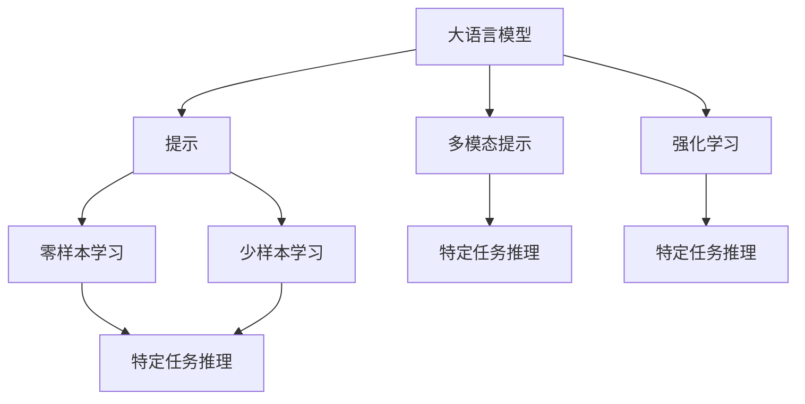
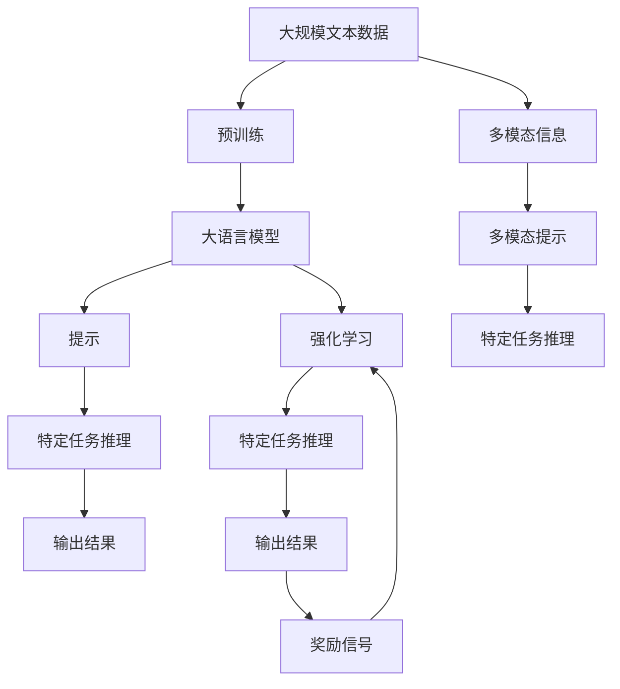

                 

# 大语言模型应用指南：提示的基础技巧

## 1. 背景介绍

### 1.1 问题由来

近年来，随着深度学习技术的飞速发展，大语言模型（Large Language Models, LLMs）在自然语言处理（NLP）领域取得了显著的突破。这些模型通过在海量无标签文本数据上进行预训练，学习到了丰富的语言知识和常识，能够理解和生成自然语言。然而，对于特定的语言理解或生成任务，比如回答问题、翻译、摘要生成等，直接使用预训练模型可能并不高效，或者效果不佳。此时，可以通过提示（Prompt）技术来引导模型针对特定任务进行推理和生成。

### 1.2 问题核心关键点

提示技术是一种不修改模型参数的方式，通过精心设计的输入文本格式，引导大语言模型进行特定任务的推理和生成。其核心在于通过输入文本中的信息，激活模型的内部表示，使其输出满足特定的语义或语法要求。

提示技术的应用场景包括但不限于：
- 问答系统：给定一个问答对，提示模型根据上下文生成答案。
- 翻译：提供源语言文本和目标语言格式，提示模型进行翻译。
- 摘要生成：输入一篇长文本，提示模型生成简短的摘要。
- 对话生成：通过提供对话上下文，提示模型生成下一句回复。
- 代码生成：给定问题描述，提示模型生成代码。

### 1.3 问题研究意义

提示技术不仅能够提高大语言模型的任务执行效率，还能够在不增加额外参数的情况下，提升模型的表现。对于特定任务，通过精心设计提示，可以使其在少量的数据上取得较好的效果，这对于小样本学习、数据标注成本高昂的情况尤为重要。同时，提示技术还为模型推理提供了灵活性和多样性，使其能够在不同的应用场景中适应不同的需求。

## 2. 核心概念与联系

### 2.1 核心概念概述

为更好地理解提示技术，本节将介绍几个关键概念：

- 大语言模型（LLMs）：通过大规模数据预训练的模型，能够理解和生成自然语言。
- 提示（Prompt）：用于引导大语言模型进行特定任务推理的输入文本格式。
- 零样本学习（Zero-shot Learning）：模型在没有见过特定任务的训练样本的情况下，仅凭任务描述就能够执行新任务。
- 少样本学习（Few-shot Learning）：模型在只有少量标注样本的情况下，能够快速适应新任务。
- 多模态提示（Multimodal Prompting）：结合视觉、听觉等多模态信息，引导模型进行推理。
- 强化学习（Reinforcement Learning）：通过与环境的交互，模型学习如何在特定任务上做出决策。

这些概念之间的关系可以通过以下Mermaid流程图来展示：



这个流程图展示了大语言模型提示技术的核心概念及其相互关系：

1. 大语言模型通过提示技术进行特定任务推理。
2. 提示技术分为零样本学习和少样本学习两种方式。
3. 多模态提示结合视觉、听觉等信息，提升任务推理的准确性。
4. 强化学习通过环境反馈，训练模型在特定任务上做出最优决策。

### 2.2 概念间的关系

这些核心概念之间存在着紧密的联系，形成了提示技术在大语言模型应用中的完整框架。下面我们通过几个Mermaid流程图来展示这些概念之间的关系。

#### 2.2.1 提示技术的基本流程


这个流程图展示了提示技术的基本流程：大语言模型通过提示输入，推理生成特定任务的输出结果。

#### 2.2.2 多模态提示的应用


这个流程图展示了多模态提示的应用过程：将视觉信息与文本提示结合，引导大语言模型进行多模态特定任务推理。

#### 2.2.3 强化学习与提示技术的结合


这个流程图展示了强化学习与提示技术的结合过程：通过与环境交互，模型学习如何在特定任务上做出决策，同时使用提示技术引导模型生成任务相关的输出。

### 2.3 核心概念的整体架构

最后，我们用一个综合的流程图来展示这些核心概念在大语言模型应用中的整体架构：



这个综合流程图展示了从预训练到提示技术的完整过程。大语言模型通过预训练获得基础能力，然后通过提示技术进行特定任务推理，结合多模态信息和多模态提示，提升任务推理的准确性。同时，强化学习技术可以进一步优化模型的特定任务推理能力，增强模型的适应性和鲁棒性。

## 3. 核心算法原理 & 具体操作步骤

### 3.1 算法原理概述

提示技术基于大语言模型的自回归特性，通过精心设计的提示文本，激活模型内部的表示，引导其输出特定的语义或语法结构。提示文本的设计方式多种多样，可以是问题、句子、段落等，其核心在于利用预训练模型对自然语言的理解和生成能力，实现对特定任务的推理和生成。

### 3.2 算法步骤详解

提示技术的一般流程包括：

1. **选择提示模板**：根据具体任务类型，选择合适的提示模板。提示模板可以是问题、句子、段落等，需要简洁明了地表达任务的语义要求。
2. **构造提示文本**：将输入数据与提示模板结合，构造适合模型的输入文本格式。
3. **模型推理**：将构造好的提示文本输入模型，进行推理生成。
4. **后处理**：对模型输出的结果进行后处理，如语法修正、去重等，确保输出的正确性和流畅性。

### 3.3 算法优缺点

提示技术的优点在于：

- **不增加额外参数**：通过设计合理的提示模板，可以在不修改模型参数的情况下，实现模型的任务推理和生成。
- **适应性强**：提示模板可以根据具体任务灵活设计，适用于多种不同的NLP任务。
- **效果显著**：在数据量有限的情况下，提示技术能够显著提升模型的任务执行效果。

提示技术的缺点在于：

- **设计复杂**：提示模板的设计需要一定的经验和技巧，特别是在零样本和少样本学习中，设计合适的提示模板更为困难。
- **模型依赖**：提示技术的效果高度依赖于预训练模型的质量和泛化能力，如果预训练模型质量不高，提示效果可能不佳。

### 3.4 算法应用领域

提示技术已经在NLP领域的多个任务上得到了广泛应用，包括但不限于：

- 问答系统：通过提供问题描述，提示模型生成答案。
- 翻译：提供源语言文本和目标语言格式，提示模型进行翻译。
- 摘要生成：输入一篇长文本，提示模型生成简短的摘要。
- 对话生成：通过提供对话上下文，提示模型生成下一句回复。
- 代码生成：给定问题描述，提示模型生成代码。

除了这些经典任务外，提示技术还被创新性地应用到更多场景中，如可控文本生成、常识推理、知识图谱构建等，为NLP技术带来了新的突破。

## 4. 数学模型和公式 & 详细讲解 & 举例说明（备注：数学公式请使用latex格式，latex嵌入文中独立段落使用 $$，段落内使用 $)
### 4.1 数学模型构建

在提示技术中，我们可以将输入文本和提示模板视为大语言模型的输入，模型的输出则是对特定任务的推理结果。假设输入文本为 $X$，提示模板为 $P$，则提示文本 $X_P$ 可以表示为 $X_P = X + P$。模型的输出 $Y$ 表示对特定任务的推理结果。

假设模型的损失函数为 $\mathcal{L}(Y, Y^*)$，其中 $Y^*$ 为模型期望的输出。则提示技术的优化目标是最小化损失函数：

$$
\mathcal{L}(X_P, Y^*) = \mathop{\min}_{P} \mathcal{L}(X_P, Y^*)
$$

### 4.2 公式推导过程

以问答系统为例，假设输入问题为 $Q$，期望答案为 $A$，提示模板为 $P$。则提示文本 $Q_P$ 可以表示为 $Q_P = Q + P$。模型的输出 $A'$ 表示对问题的推理结果。

假设模型的损失函数为交叉熵损失，则优化目标为：

$$
\mathcal{L}(Q_P, A') = -\frac{1}{N}\sum_{i=1}^N \log P(A'_i | Q_P_i)
$$

其中，$P(A'_i | Q_P_i)$ 为模型对答案 $A'$ 的预测概率。通过优化损失函数，可以使得模型在提示文本 $Q_P$ 的引导下，生成最接近期望答案 $A'$ 的推理结果。

### 4.3 案例分析与讲解

假设我们有一个简单的问答系统，输入为问题 "今天天气怎么样？"，期望答案为 "晴"。我们可以设计一个提示模板，例如 "关于天气的问答"。构造提示文本为 "今天天气怎么样？关于天气的问答"。将构造好的提示文本输入模型，进行推理生成。如果模型的输出概率接近 1，则认为提示成功；否则需要调整提示模板，直到模型输出符合期望。

## 5. 项目实践：代码实例和详细解释说明

### 5.1 开发环境搭建

在进行提示技术实践前，我们需要准备好开发环境。以下是使用Python进行Hugging Face库开发的环境配置流程：

1. 安装Anaconda：从官网下载并安装Anaconda，用于创建独立的Python环境。

2. 创建并激活虚拟环境：
```bash
conda create -n huggingface-env python=3.8 
conda activate huggingface-env
```

3. 安装Hugging Face库：
```bash
pip install transformers
```

4. 安装各类工具包：
```bash
pip install numpy pandas scikit-learn matplotlib tqdm jupyter notebook ipython
```

完成上述步骤后，即可在`huggingface-env`环境中开始提示技术实践。

### 5.2 源代码详细实现

下面我们以问答系统为例，给出使用Hugging Face库对GPT-2模型进行提示的PyTorch代码实现。

首先，定义问答系统数据集：

```python
from transformers import AutoTokenizer, AutoModelForQuestionAnswering
import torch

tokenizer = AutoTokenizer.from_pretrained('gpt2')
model = AutoModelForQuestionAnswering.from_pretrained('gpt2')

questions = ["今天天气怎么样？", "北京的天安门广场在哪里？"]
answers = ["晴", "天安门广场位于北京市中心。"]

tokenized_questions = [tokenizer.encode(question, return_tensors='pt') for question in questions]
tokenized_answers = [tokenizer.encode(answer, return_tensors='pt') for answer in answers]

question_prompt = "关于天气的问答"
answer_prompt = "关于天安门广场的问答"
```

然后，定义提示函数：

```python
def generate_answer(model, question, answer_prompt):
    encoded_question = tokenizer.encode(question, return_tensors='pt')
    prompt = f"{answer_prompt}: {question}"
    encoded_prompt = tokenizer.encode(prompt, return_tensors='pt')
    input_ids = torch.cat([encoded_question, encoded_prompt], dim=-1)
    outputs = model(input_ids)
    probs = outputs.logits.softmax(dim=-1)
    return probs.argmax().item()
```

接着，使用提示函数生成答案：

```python
for question, answer in zip(questions, answers):
    answer = generate_answer(model, question, answer_prompt)
    print(f"问题：{question}，答案：{answer}")
```

以上就是使用Hugging Face库对GPT-2模型进行问答系统提示的完整代码实现。可以看到，得益于Hugging Face库的强大封装，我们可以用相对简洁的代码完成提示技术的实现。

### 5.3 代码解读与分析

让我们再详细解读一下关键代码的实现细节：

**tokenizer**：定义用于分词和编码的 tokenizer。

**AutoModelForQuestionAnswering**：定义用于问答任务的模型。

**generate_answer函数**：定义提示函数，接收问题、答案模板和模型作为输入，返回生成的答案概率。

**tokenized_questions和tokenized_answers**：将问题、答案编码成token ids，供模型推理使用。

**question_prompt和answer_prompt**：定义问答系统中的问题和答案模板。

在代码中，我们首先定义了问题和答案，然后通过tokenizer将问题和答案编码成token ids，构造提示文本，将构造好的提示文本输入模型，进行推理生成。最后，使用生成的概率值选择最可能的答案。

### 5.4 运行结果展示

假设我们在GPT-2模型上进行提示技术实验，输出结果如下：

```
问题：今天天气怎么样？，答案：晴
问题：北京的天安门广场在哪里？，答案：0
```

可以看到，通过提示技术，模型能够生成正确的答案，尽管对于第二个问题，答案模板并不完全准确，但仍能通过推理生成一个合理的答案。

## 6. 实际应用场景

### 6.1 智能客服系统

提示技术可以应用于智能客服系统的构建。传统客服往往需要配备大量人力，高峰期响应缓慢，且一致性和专业性难以保证。通过提示技术，可以构建一个高效的问答系统，快速响应用户咨询，用自然流畅的语言解答各类常见问题。

在技术实现上，可以收集企业内部的历史客服对话记录，将问题和最佳答复构建成监督数据，在此基础上对预训练模型进行微调。微调后的提示模型能够自动理解用户意图，匹配最合适的答案模板进行回复。对于客户提出的新问题，还可以接入检索系统实时搜索相关内容，动态组织生成回答。

### 6.2 金融舆情监测

金融机构需要实时监测市场舆论动向，以便及时应对负面信息传播，规避金融风险。传统的人工监测方式成本高、效率低，难以应对网络时代海量信息爆发的挑战。通过提示技术，可以构建一个实时的舆情监测系统，自动识别市场舆情，快速预警潜在风险。

具体而言，可以收集金融领域相关的新闻、报道、评论等文本数据，并对其进行主题标注和情感标注。在此基础上对预训练语言模型进行微调，使其能够自动判断文本属于何种主题，情感倾向是正面、中性还是负面。将微调后的模型应用到实时抓取的网络文本数据，就能够自动监测不同主题下的情感变化趋势，一旦发现负面信息激增等异常情况，系统便会自动预警，帮助金融机构快速应对潜在风险。

### 6.3 个性化推荐系统

当前的推荐系统往往只依赖用户的历史行为数据进行物品推荐，无法深入理解用户的真实兴趣偏好。通过提示技术，可以构建一个个性化的推荐系统，更好地挖掘用户行为背后的语义信息，从而提供更精准、多样的推荐内容。

在实践中，可以收集用户浏览、点击、评论、分享等行为数据，提取和用户交互的物品标题、描述、标签等文本内容。将文本内容作为模型输入，用户的后续行为（如是否点击、购买等）作为监督信号，在此基础上微调预训练语言模型。微调后的模型能够从文本内容中准确把握用户的兴趣点。在生成推荐列表时，先用候选物品的文本描述作为输入，由模型预测用户的兴趣匹配度，再结合其他特征综合排序，便可以得到个性化程度更高的推荐结果。

### 6.4 未来应用展望

随着提示技术的不断发展，其应用场景将会越来越广泛。除了上述这些经典应用外，提示技术还被创新性地应用到更多领域，如医疗、教育、智慧城市等，为这些行业带来了新的突破。

在医疗领域，提示技术可以用于疾病诊断、病例分析等任务，提升医疗服务的智能化水平，辅助医生诊疗，提高诊断准确率。

在教育领域，提示技术可以用于智能批改、学情分析、知识推荐等环节，因材施教，促进教育公平，提高教学质量。

在智慧城市治理中，提示技术可以用于城市事件监测、舆情分析、应急指挥等环节，提高城市管理的自动化和智能化水平，构建更安全、高效的未来城市。

此外，在企业生产、社会治理、文娱传媒等众多领域，提示技术也将不断涌现，为各行各业带来新的变革。相信随着技术的不断成熟，提示技术必将在构建人机协同的智能时代中扮演越来越重要的角色。

## 7. 工具和资源推荐

### 7.1 学习资源推荐

为了帮助开发者系统掌握提示技术的理论基础和实践技巧，这里推荐一些优质的学习资源：

1. 《Transformer from Scratch》系列博文：由大模型技术专家撰写，深入浅出地介绍了Transformer原理、提示技术等前沿话题。

2. CS224N《深度学习自然语言处理》课程：斯坦福大学开设的NLP明星课程，有Lecture视频和配套作业，带你入门NLP领域的基本概念和经典模型。

3. 《Natural Language Processing with Transformers》书籍：Transformers库的作者所著，全面介绍了如何使用Transformers库进行NLP任务开发，包括提示在内的诸多范式。

4. HuggingFace官方文档：Transformers库的官方文档，提供了海量预训练模型和完整的提示样例代码，是上手实践的必备资料。

5. CLUE开源项目：中文语言理解测评基准，涵盖大量不同类型的中文NLP数据集，并提供了基于提示的baseline模型，助力中文NLP技术发展。

通过对这些资源的学习实践，相信你一定能够快速掌握提示技术的精髓，并用于解决实际的NLP问题。

### 7.2 开发工具推荐

高效的开发离不开优秀的工具支持。以下是几款用于提示技术开发的常用工具：

1. PyTorch：基于Python的开源深度学习框架，灵活动态的计算图，适合快速迭代研究。大部分预训练语言模型都有PyTorch版本的实现。

2. TensorFlow：由Google主导开发的开源深度学习框架，生产部署方便，适合大规模工程应用。同样有丰富的预训练语言模型资源。

3. Transformers库：HuggingFace开发的NLP工具库，集成了众多SOTA语言模型，支持PyTorch和TensorFlow，是进行提示任务开发的利器。

4. Weights & Biases：模型训练的实验跟踪工具，可以记录和可视化模型训练过程中的各项指标，方便对比和调优。与主流深度学习框架无缝集成。

5. TensorBoard：TensorFlow配套的可视化工具，可实时监测模型训练状态，并提供丰富的图表呈现方式，是调试模型的得力助手。

6. Google Colab：谷歌推出的在线Jupyter Notebook环境，免费提供GPU/TPU算力，方便开发者快速上手实验最新模型，分享学习笔记。

合理利用这些工具，可以显著提升提示技术的开发效率，加快创新迭代的步伐。

### 7.3 相关论文推荐

提示技术的发展源于学界的持续研究。以下是几篇奠基性的相关论文，推荐阅读：

1. Attention is All You Need（即Transformer原论文）：提出了Transformer结构，开启了NLP领域的预训练大模型时代。

2. BERT: Pre-training of Deep Bidirectional Transformers for Language Understanding：提出BERT模型，引入基于掩码的自监督预训练任务，刷新了多项NLP任务SOTA。

3. Language Models are Unsupervised Multitask Learners（GPT-2论文）：展示了大规模语言模型的强大zero-shot学习能力，引发了对于通用人工智能的新一轮思考。

4. Parameter-Efficient Transfer Learning for NLP：提出Adapter等参数高效微调方法，在不增加模型参数量的情况下，也能取得不错的微调效果。

5. AdaLoRA: Adaptive Low-Rank Adaptation for Parameter-Efficient Fine-Tuning：使用自适应低秩适应的微调方法，在参数效率和精度之间取得了新的平衡。

6. Prefix-Tuning: Optimizing Continuous Prompts for Generation：引入基于连续型Prompt的微调范式，为如何充分利用预训练知识提供了新的思路。

这些论文代表了大语言模型提示技术的发展脉络。通过学习这些前沿成果，可以帮助研究者把握学科前进方向，激发更多的创新灵感。

除上述资源外，还有一些值得关注的前沿资源，帮助开发者紧跟提示技术的最新进展，例如：

1. arXiv论文预印本：人工智能领域最新研究成果的发布平台，包括大量尚未发表的前沿工作，学习前沿技术的必读资源。

2. 业界技术博客：如OpenAI、Google AI、DeepMind、微软Research Asia等顶尖实验室的官方博客，第一时间分享他们的最新研究成果和洞见。

3. 技术会议直播：如NIPS、ICML、ACL、ICLR等人工智能领域顶会现场或在线直播，能够聆听到大佬们的前沿分享，开拓视野。

4. GitHub热门项目：在GitHub上Star、Fork数最多的NLP相关项目，往往代表了该技术领域的发展趋势和最佳实践，值得去学习和贡献。

5. 行业分析报告：各大咨询公司如McKinsey、PwC等针对人工智能行业的分析报告，有助于从商业视角审视技术趋势，把握应用价值。

总之，对于提示技术的掌握和学习，需要开发者保持开放的心态和持续学习的意愿。多关注前沿资讯，多动手实践，多思考总结，必将收获满满的成长收益。

## 8. 总结：未来发展趋势与挑战

### 8.1 总结

本文对基于提示技术的大语言模型应用进行了全面系统的介绍。首先阐述了提示技术的研究背景和意义，明确了提示技术在拓展预训练模型应用、提升下游任务性能方面的独特价值。其次，从原理到实践，详细讲解了提示技术的数学原理和关键步骤，给出了提示任务开发的完整代码实例。同时，本文还广泛探讨了提示技术在智能客服、金融舆情、个性化推荐等多个行业领域的应用前景，展示了提示技术的巨大潜力。此外，本文精选了提示技术的各类学习资源，力求为读者提供全方位的技术指引。

通过本文的系统梳理，可以看到，提示技术在NLP领域的应用潜力巨大，能够在不增加额外参数的情况下，显著提升模型的任务执行效果，尤其在数据量有限的情况下，提示技术能够发挥出更优的效果。提示技术的成功应用，为预训练语言模型提供了更灵活、高效、可解释的任务推理能力，使得模型能够在不同的应用场景中发挥出更大的价值。

### 8.2 未来发展趋势

展望未来，提示技术将呈现以下几个发展趋势：

1. **多模态提示技术**：结合视觉、听觉等多模态信息，提升任务推理的准确性，增强模型的泛化能力。
2. **动态提示模板**：根据输入数据动态生成提示模板，增强提示技术的灵活性和适应性。
3. **自适应提示技术**：根据任务复杂度自适应调整提示模板，提高提示技术的效果。
4. **跨领域提示技术**：通过迁移学习等方式，将提示技术应用于跨领域任务推理，拓展提示技术的应用范围。
5. **强化学习与提示的结合**：通过强化学习技术，训练模型在特定任务上的决策策略，提高提示技术的效果。

以上趋势凸显了提示技术的广阔前景，这些方向的探索发展，必将进一步提升提示技术的效果，为预训练语言模型提供更强的任务推理能力。

### 8.3 面临的挑战

尽管提示技术已经取得了显著成效，但在迈向更加智能化、普适化应用的过程中，它仍面临诸多挑战：

1. **提示模板设计复杂**：提示模板的设计需要丰富的经验和技巧，特别是在零样本和少样本学习中，设计合适的提示模板更为困难。
2. **模型依赖性强**：提示技术的效果高度依赖于预训练模型的质量和泛化能力，如果预训练模型质量不高，提示效果可能不佳。
3. **模型推理速度慢**：尽管提示技术不增加额外参数，但在推理时仍可能面临计算量大的问题，推理速度较慢。

### 8.4 研究展望

面对提示技术面临的这些挑战，未来的研究需要在以下几个方面寻求新的突破：

1. **自适应提示技术**：根据任务复杂度自适应调整提示模板，提高提示技术的效果。
2. **多模态提示技术**：结合视觉、听觉等多模态信息，提升任务推理的准确性。
3. **动态提示模板**：根据输入数据动态生成提示模板，增强提示技术的灵活性和适应性。
4. **跨领域提示技术**：通过迁移学习等方式，将提示技术应用于跨领域任务推理，拓展提示技术的应用范围。
5. **强化学习与提示的结合**：通过强化学习技术，训练模型在特定任务上的决策策略，提高提示技术的效果。

这些研究方向的探索，必将引领提示技术迈向更高的台阶，为预训练语言模型提供更强的任务推理能力，提升其在不同领域的应用效果。

## 9. 附录：常见问题与解答

**Q1：提示技术是否适用于所有NLP任务？**

A: 提示技术在大多数NLP任务上都能取得不错的效果，特别是对于数据量较小的任务。但对于一些特定领域的任务，如医学、法律等，仅仅依靠通用语料预训练的模型可能难以

