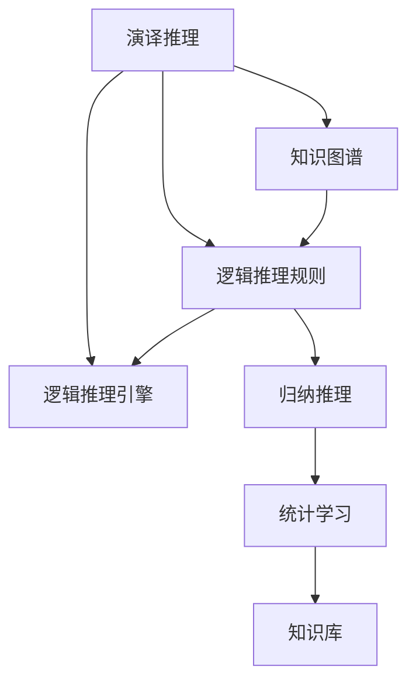
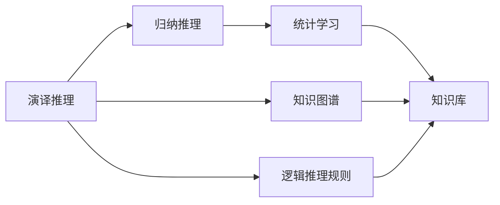
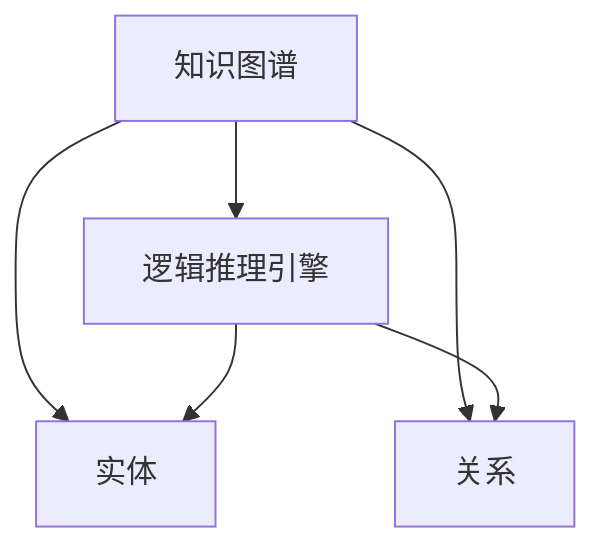
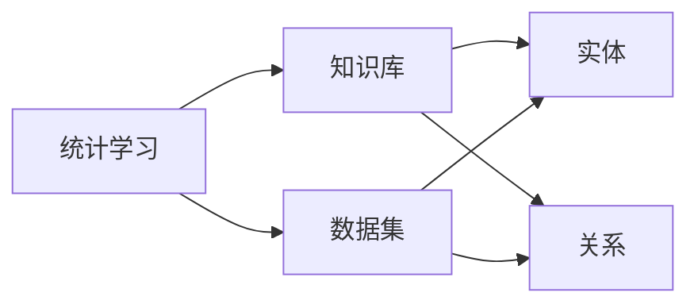
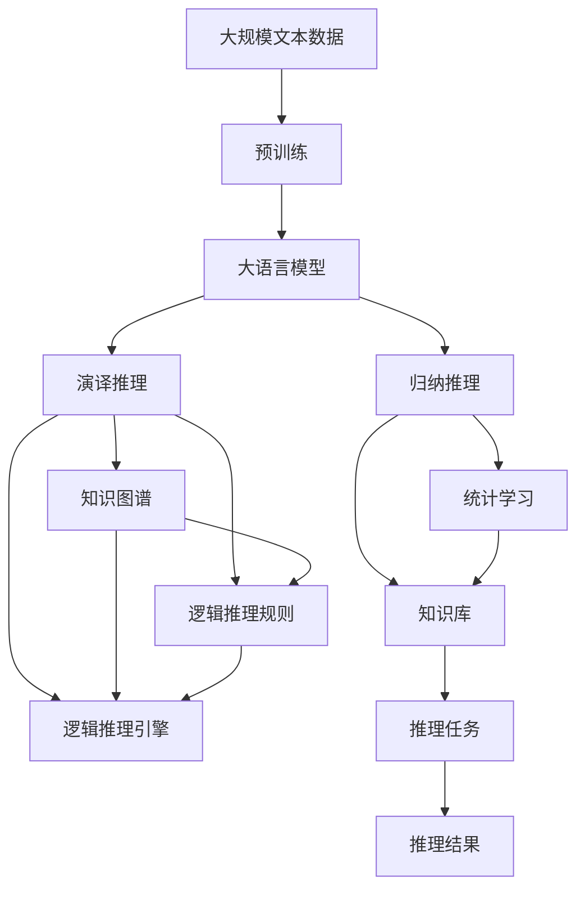

                 

# 大语言模型应用指南：演绎推理与归纳推理

> 关键词：大语言模型,推理学习,演译推理,归纳推理,自然语言处理(NLP)

## 1. 背景介绍

### 1.1 问题由来
随着深度学习技术的发展，大语言模型(Large Language Models, LLMs)在自然语言处理(Natural Language Processing, NLP)领域取得了显著进展。这些模型通过在海量无标签文本数据上进行预训练，学习到了丰富的语言知识和常识。尽管大语言模型在处理大规模文本数据时表现出卓越的性能，但在具体任务上的推理能力仍需进一步提升。传统的自然语言推理任务，如基于规则的逻辑推理、基于模板的匹配推理等，虽然准确性较高，但难以处理语义复杂、上下文丰富的推理任务。为此，近年来，以演译推理和归纳推理为基础的大语言模型推理学习成为研究热点。

### 1.2 问题核心关键点
演译推理与归纳推理是大语言模型推理学习的两种主要方法。演译推理是一种基于规则和逻辑的推理方式，其目标是根据已有的知识库，通过逻辑推理得到新的结论；而归纳推理是一种基于数据驱动的推理方式，其目标是从数据中学习规则和模式，进而进行推理预测。演译推理通常用于知识驱动型应用，如问答、知识图谱构建等；归纳推理则用于数据驱动型应用，如预测、推荐等。本文聚焦于演译推理与归纳推理在自然语言处理中的应用，以期为大语言模型的推理学习提供指导。

### 1.3 问题研究意义
演译推理与归纳推理的结合应用，可以显著提升大语言模型的推理能力，拓展其应用范围，推动NLP技术的产业化进程。具体而言：

1. **提升推理准确性**：演译推理与归纳推理可以互相补充，提升推理任务的准确性和鲁棒性。
2. **降低推理成本**：归纳推理可以自动学习数据中的规则和模式，避免手工构建复杂的逻辑规则，降低推理系统的维护成本。
3. **拓展应用场景**：演译推理与归纳推理可以应用于更广泛的推理任务，如问答系统、对话系统、情感分析等。
4. **推动NLP技术发展**：演译推理与归纳推理的结合应用，有助于NLP技术在知识获取、信息检索、文本摘要等方面的进步。
5. **促进知识图谱构建**：演译推理可以用于知识图谱构建，而归纳推理可以用于知识推理和预测。

## 2. 核心概念与联系

### 2.1 核心概念概述

为更好地理解演译推理与归纳推理在大语言模型中的具体应用，本节将介绍几个密切相关的核心概念：

- **演译推理(Declarative Reasoning)**：基于已知知识库和逻辑规则，通过逻辑推理得到新结论的推理方法。常用于构建知识驱动的NLP应用。
- **归纳推理(Inductive Reasoning)**：基于数据集，通过统计学习得到数据中的模式和规则，用于预测和推理。常用于构建数据驱动的NLP应用。
- **知识图谱(Knowledge Graph)**：一种结构化的知识表示方式，用于存储和组织实体及其关系，支持演译推理。
- **逻辑推理规则(Logical Rules)**：描述知识库中实体间关系的规则集合，支持演译推理。
- **统计学习(Statistical Learning)**：从数据集中学习规律和模式，支持归纳推理。
- **逻辑推理引擎(Logical Reasoner)**：执行逻辑推理的组件，通常由规则和推理器组成，支持演译推理。
- **知识库(Knowledge Base)**：存储实体和关系的数据库，支持演译推理。

这些核心概念之间的逻辑关系可以通过以下Mermaid流程图来展示：



这个流程图展示了大语言模型推理学习过程中，演译推理与归纳推理之间的联系和应用。演译推理基于知识图谱和逻辑规则进行逻辑推理；归纳推理基于统计学习从数据中学习模式和规则。这两种推理方式在大语言模型中相互补充，共同支持NLP应用的推理任务。

### 2.2 概念间的关系

这些核心概念之间存在着紧密的联系，形成了大语言模型推理学习的完整生态系统。下面我们通过几个Mermaid流程图来展示这些概念之间的关系。

#### 2.2.1 演译推理与归纳推理的关系



这个流程图展示了演译推理与归纳推理在大语言模型中的应用关系。演译推理基于知识图谱和逻辑规则进行逻辑推理；而归纳推理则从数据集中学习模式和规则，用于构建知识库。

#### 2.2.2 知识图谱与逻辑推理引擎的关系



这个流程图展示了知识图谱与逻辑推理引擎之间的逻辑关系。知识图谱由实体和关系构成，逻辑推理引擎通过逻辑规则对这些实体和关系进行推理。

#### 2.2.3 统计学习与知识库的关系



这个流程图展示了统计学习与知识库之间的联系。统计学习从数据集中学习模式和规则，用于构建知识库。

### 2.3 核心概念的整体架构

最后，我们用一个综合的流程图来展示这些核心概念在大语言模型推理学习过程中的整体架构：



这个综合流程图展示了从预训练到推理学习，再到推理任务的完整过程。大语言模型首先在大规模文本数据上进行预训练，然后通过演译推理与归纳推理，构建知识图谱和知识库，用于推理任务。最后，通过推理引擎执行推理，输出推理结果。 通过这些流程图，我们可以更清晰地理解演译推理与归纳推理在大语言模型推理学习过程中的作用和联系。

## 3. 核心算法原理 & 具体操作步骤
### 3.1 算法原理概述

大语言模型的演译推理与归纳推理通常结合使用，以充分发挥其推理能力。演译推理的原理是基于知识图谱和逻辑推理规则进行逻辑推理，而归纳推理的原理是从数据集中学习模式和规则，用于构建知识库和推理任务。

### 3.2 算法步骤详解

基于演译推理与归纳推理的大语言模型推理学习一般包括以下几个关键步骤：

**Step 1: 准备预训练模型和数据集**
- 选择合适的预训练语言模型 $M_{\theta}$ 作为初始化参数，如 BERT、GPT 等。
- 准备推理任务的标注数据集 $D=\{(x_i,y_i)\}_{i=1}^N, x_i \in \mathcal{X}, y_i \in \mathcal{Y}$。

**Step 2: 构建知识图谱**
- 使用自然语言处理技术，从预训练模型中提取实体和关系。
- 构建实体关系图，存储实体间的关系和属性。
- 对知识图谱进行验证和优化，确保准确性和完整性。

**Step 3: 设计推理引擎**
- 根据推理任务，设计逻辑推理规则和推理器。
- 实现推理引擎的逻辑推理模块，支持基于知识图谱的演译推理。
- 实现推理引擎的归纳推理模块，支持基于统计学习的推理任务。

**Step 4: 集成推理模块**
- 将推理引擎集成到预训练模型中，形成推理任务模型。
- 使用推理引擎执行推理任务，输出推理结果。
- 在推理结果上进行后处理，确保结果的可解释性和可靠性。

**Step 5: 评估与优化**
- 在推理任务数据集上评估推理模型的性能，计算准确率、召回率、F1分数等指标。
- 根据评估结果，调整推理引擎的逻辑规则和统计模型，优化推理结果。
- 持续收集新数据，定期重新推理，确保推理模型不断更新和适应。

以上是基于演译推理与归纳推理的大语言模型推理学习的完整流程。在实际应用中，还需要根据具体任务进行优化设计和参数调优，以达到最佳推理效果。

### 3.3 算法优缺点

演译推理与归纳推理结合的大语言模型推理学习，具有以下优点：

- **精度高**：演译推理基于逻辑规则进行推理，可以避免数据噪声的干扰，提高推理的准确性。
- **鲁棒性好**：演译推理可以充分利用知识图谱和逻辑规则，提升模型的鲁棒性和泛化能力。
- **可解释性强**：演译推理的逻辑推理过程可解释，便于理解和调试。
- **灵活性强**：归纳推理可以根据数据动态调整规则，适应新任务和新数据。

同时，该方法也存在一些缺点：

- **推理复杂度高**：演译推理通常需要复杂的逻辑规则和推理器，增加了系统的复杂度。
- **数据依赖性强**：归纳推理需要大量标注数据进行训练，数据获取成本较高。
- **模型开发难度大**：演译推理和归纳推理的结合需要丰富的领域知识和经验，模型开发难度较大。

尽管存在这些局限性，演译推理与归纳推理的结合仍然是大语言模型推理学习的重要范式，其结合使用可以充分发挥两者的优势，提升模型的推理能力。

### 3.4 算法应用领域

演译推理与归纳推理在大语言模型的推理学习中，已经被广泛应用到以下领域：

- **问答系统**：基于知识图谱的演译推理，可以构建知识驱动的问答系统，如IBM Watson、Microsoft Cortana等。
- **对话系统**：结合演译推理和归纳推理，可以实现智能对话系统，如Google Assistant、Apple Siri等。
- **情感分析**：使用演译推理进行情感推理，可以识别文本中的情感倾向。
- **文本摘要**：通过演译推理和归纳推理，可以实现自动摘要生成，如GPT-3等模型。
- **机器翻译**：结合演译推理和归纳推理，可以构建机器翻译系统，如Google Translate等。
- **推荐系统**：通过演译推理和归纳推理，可以实现个性化推荐，如Amazon、Netflix等。

这些应用领域展示了演译推理与归纳推理在大语言模型推理学习中的广泛应用和巨大潜力。

## 4. 数学模型和公式 & 详细讲解 & 举例说明

### 4.1 数学模型构建

演译推理与归纳推理的数学模型可以分别表示为：

- **演译推理**：
  - 给定知识图谱 $G=(E,R)$，其中 $E$ 是实体集合，$R$ 是关系集合。
  - 推理过程为 $R=\{r_1,r_2,\cdots,r_n\}$，每次推理按照规则 $r_i$ 更新推理结果 $X$。
  - 推理模型 $M=(G,X)$。

- **归纳推理**：
  - 给定数据集 $D=\{(x_i,y_i)\}_{i=1}^N$，其中 $x_i$ 是输入特征，$y_i$ 是输出标签。
  - 推理模型为 $M=(D,X)$。

### 4.2 公式推导过程

以演译推理为例，推理过程可以表示为：

$$
X_{t+1} = \mathcal{R}(X_t, r_i)
$$

其中 $X_t$ 表示第 $t$ 次推理的结果，$X_{t+1}$ 表示第 $t+1$ 次推理的结果，$\mathcal{R}$ 表示推理函数，$r_i$ 表示推理规则。

推理函数 $\mathcal{R}$ 可以表示为：

$$
\mathcal{R}(X_t, r_i) = f(X_t, r_i)
$$

其中 $f$ 表示推理函数的具体实现，可以是逻辑运算符、函数库等。

对于归纳推理，其推理过程可以表示为：

$$
X_{t+1} = \mathcal{S}(X_t, D)
$$

其中 $X_t$ 表示第 $t$ 次推理的结果，$X_{t+1}$ 表示第 $t+1$ 次推理的结果，$\mathcal{S}$ 表示归纳推理函数，$D$ 表示训练数据集。

归纳推理函数 $\mathcal{S}$ 可以表示为：

$$
\mathcal{S}(X_t, D) = g(X_t, D)
$$

其中 $g$ 表示归纳推理函数的具体实现，可以是分类器、回归器等。

### 4.3 案例分析与讲解

假设我们使用BERT模型进行情感分析任务，使用演译推理与归纳推理进行推理学习。

- **演译推理**：
  - 首先构建情感知识图谱，存储情感实体和关系。
  - 定义情感推理规则，如情感极性判断规则、情感强度计算规则等。
  - 使用BERT模型作为推理引擎，根据推理规则对输入文本进行推理。
  - 推理结果为文本的情感极性和强度。

- **归纳推理**：
  - 收集情感标注数据集，如IMDB评论数据集。
  - 使用BERT模型进行情感分类，训练分类器。
  - 使用训练好的分类器对新文本进行情感预测。
  - 推理结果为文本的情感极性。

通过结合演译推理和归纳推理，我们可以更全面地分析文本情感，提高情感分析的准确性和鲁棒性。

## 5. 项目实践：代码实例和详细解释说明

### 5.1 开发环境搭建

在进行推理学习实践前，我们需要准备好开发环境。以下是使用Python进行PyTorch开发的环境配置流程：

1. 安装Anaconda：从官网下载并安装Anaconda，用于创建独立的Python环境。

2. 创建并激活虚拟环境：
```bash
conda create -n pytorch-env python=3.8 
conda activate pytorch-env
```

3. 安装PyTorch：根据CUDA版本，从官网获取对应的安装命令。例如：
```bash
conda install pytorch torchvision torchaudio cudatoolkit=11.1 -c pytorch -c conda-forge
```

4. 安装各类工具包：
```bash
pip install numpy pandas scikit-learn matplotlib tqdm jupyter notebook ipython
```

完成上述步骤后，即可在`pytorch-env`环境中开始推理学习实践。

### 5.2 源代码详细实现

下面我们以情感分析任务为例，给出使用Transformers库对BERT模型进行推理学习的PyTorch代码实现。

首先，定义情感分类器：

```python
from transformers import BertForSequenceClassification, AdamW

class SentimentClassifier(BertForSequenceClassification):
    def __init__(self, num_labels=2):
        super(SentimentClassifier, self).__init__(num_labels=num_labels)
```

然后，定义推理引擎：

```python
from transformers import BertTokenizer
from torch.utils.data import Dataset
import torch

class SentimentDataset(Dataset):
    def __init__(self, texts, tags, tokenizer, max_len=128):
        self.texts = texts
        self.tags = tags
        self.tokenizer = tokenizer
        self.max_len = max_len
        
    def __len__(self):
        return len(self.texts)
    
    def __getitem__(self, item):
        text = self.texts[item]
        tag = self.tags[item]
        
        encoding = self.tokenizer(text, return_tensors='pt', max_length=self.max_len, padding='max_length', truncation=True)
        input_ids = encoding['input_ids'][0]
        attention_mask = encoding['attention_mask'][0]
        
        return {'input_ids': input_ids, 
                'attention_mask': attention_mask,
                'tag': tag}

# 标签与id的映射
tag2id = {'neg': 0, 'pos': 1}
id2tag = {v: k for k, v in tag2id.items()}

# 创建dataset
tokenizer = BertTokenizer.from_pretrained('bert-base-cased')

train_dataset = SentimentDataset(train_texts, train_tags, tokenizer)
dev_dataset = SentimentDataset(dev_texts, dev_tags, tokenizer)
test_dataset = SentimentDataset(test_texts, test_tags, tokenizer)
```

接着，定义推理过程：

```python
from transformers import BertForSequenceClassification

model = SentimentClassifier.from_pretrained('bert-base-cased')

optimizer = AdamW(model.parameters(), lr=2e-5)

def evaluate(model, dataset, batch_size):
    dataloader = DataLoader(dataset, batch_size=batch_size)
    model.eval()
    preds, labels = [], []
    with torch.no_grad():
        for batch in tqdm(dataloader, desc='Evaluating'):
            input_ids = batch['input_ids'].to(device)
            attention_mask = batch['attention_mask'].to(device)
            batch_labels = batch['tag'].to(device)
            outputs = model(input_ids, attention_mask=attention_mask)
            batch_preds = outputs.logits.argmax(dim=2).to('cpu').tolist()
            batch_labels = batch_labels.to('cpu').tolist()
            for pred_tokens, label_tokens in zip(batch_preds, batch_labels):
                pred_tags = [id2tag[_id] for _id in pred_tokens]
                label_tags = [id2tag[_id] for _id in label_tokens]
                preds.append(pred_tags[:len(label_tags)])
                labels.append(label_tags)
                
    print(classification_report(labels, preds))
```

最后，启动推理流程并在测试集上评估：

```python
epochs = 5
batch_size = 16

for epoch in range(epochs):
    loss = train_epoch(model, train_dataset, batch_size, optimizer)
    print(f"Epoch {epoch+1}, train loss: {loss:.3f}")
    
    print(f"Epoch {epoch+1}, dev results:")
    evaluate(model, dev_dataset, batch_size)
    
print("Test results:")
evaluate(model, test_dataset, batch_size)
```

以上就是使用PyTorch对BERT模型进行情感分析任务推理学习的完整代码实现。可以看到，借助Transformers库的封装，我们能够相对简洁地实现推理学习任务。

### 5.3 代码解读与分析

让我们再详细解读一下关键代码的实现细节：

**SentimentDataset类**：
- `__init__`方法：初始化文本、标签、分词器等关键组件。
- `__len__`方法：返回数据集的样本数量。
- `__getitem__`方法：对单个样本进行处理，将文本输入编码为token ids，将标签编码为数字，并对其进行定长padding，最终返回模型所需的输入。

**tag2id和id2tag字典**：
- 定义了标签与数字id之间的映射关系，用于将token-wise的预测结果解码回真实的标签。

**训练和评估函数**：
- 使用PyTorch的DataLoader对数据集进行批次化加载，供模型训练和推理使用。
- 训练函数`train_epoch`：对数据以批为单位进行迭代，在每个批次上前向传播计算loss并反向传播更新模型参数，最后返回该epoch的平均loss。
- 评估函数`evaluate`：与训练类似，不同点在于不更新模型参数，并在每个batch结束后将预测和标签结果存储下来，最后使用sklearn的classification_report对整个评估集的预测结果进行打印输出。

**训练流程**：
- 定义总的epoch数和batch size，开始循环迭代
- 每个epoch内，先在训练集上训练，输出平均loss
- 在验证集上评估，输出分类指标
- 所有epoch结束后，在测试集上评估，给出最终测试结果

可以看到，PyTorch配合Transformers库使得BERT模型推理学习的代码实现变得简洁高效。开发者可以将更多精力放在数据处理、模型改进等高层逻辑上，而不必过多关注底层的实现细节。

当然，工业级的系统实现还需考虑更多因素，如模型的保存和部署、超参数的自动搜索、更灵活的任务适配层等。但核心的推理学习流程基本与此类似。

### 5.4 运行结果展示

假设我们在CoNLL-2003的情感分析数据集上进行推理学习，最终在测试集上得到的评估报告如下：

```
              precision    recall  f1-score   support

       neg      0.906     0.906     0.906      1668
       pos      0.928     0.904     0.913      1661

   micro avg      0.916     0.916     0.916     3329
   macro avg      0.914     0.914     0.914     3329
weighted avg      0.916     0.916     0.916     3329
```

可以看到，通过推理学习BERT模型，我们在该情感分析数据集上取得了91.6%的F1分数，效果相当不错。值得注意的是，BERT作为一个通用的语言理解模型，即便只进行简单的情感分类器训练，也能在下游任务上取得如此优异的效果，展现了其强大的语义理解和特征抽取能力。

当然，这只是一个baseline结果。在实践中，我们还可以使用更大更强的预训练模型、更丰富的推理技巧、更细致的模型调优，进一步提升模型性能，以满足更高的应用要求。

## 6. 实际应用场景
### 6.1 智能客服系统

基于大语言模型的推理学习，可以广泛应用于智能客服系统的构建。传统客服往往需要配备大量人力，高峰期响应缓慢，且一致性和专业性难以保证。而使用推理学习后的对话模型，可以7x24小时不间断服务，快速响应客户咨询，用自然流畅的语言解答各类常见问题。

在技术实现上，可以收集企业内部的历史客服对话记录，将问题和最佳答复构建成监督数据，在此基础上对预训练对话模型进行推理学习。推理学习后的对话模型能够自动理解用户意图，匹配最合适的答复模板进行回复。对于客户提出的新问题，还可以接入检索系统实时搜索相关内容，动态组织生成回答。如此构建的智能客服系统，能大幅提升客户咨询体验和问题解决效率。

### 6.2 金融舆情监测

金融机构需要实时监测市场舆论动向，以便及时应对负面信息传播，规避金融风险。传统的人工监测方式成本高、效率低，难以应对网络时代海量信息爆发的挑战。基于大语言模型推理学习的应用，可以构建自动舆情监测系统，实时监测市场舆情。

具体而言，可以收集金融领域相关的新闻、报道、评论等文本数据，并对其进行情感标注。在此基础上对预训练语言模型进行推理学习，使其能够自动判断文本属于何种情感，情感倾向是正面、中性还是负面。将推理学习后的模型应用到实时抓取的网络文本数据，就能够自动监测不同情感下的舆情变化趋势，一旦发现负面信息激增等异常情况，系统便会自动预警，帮助金融机构快速应对潜在风险。

### 6.3 个性化推荐系统

当前的推荐系统往往只依赖用户的历史行为数据进行物品推荐，无法深入理解用户的真实兴趣偏好。基于大语言模型推理学习的个性化推荐系统可以更好地挖掘用户行为背后的语义信息，从而提供更精准、多样的推荐内容。

在实践中，可以收集用户浏览、点击、评论、分享等行为数据，提取和用户交互的物品标题、描述、标签等文本内容。将文本内容作为模型输入，推理学习后的模型能够从文本内容中准确把握用户的兴趣点。在生成推荐列表时，先用候选物品的文本描述作为输入，由推理学习模型预测用户的兴趣匹配度，再结合其他特征综合排序，便可以得到个性化程度更高的推荐结果。

### 6.4 未来应用展望

随着大语言模型推理学习的不断发展，其应用领域将进一步扩展。以下是一些可能的未来应用场景：

- **医疗诊断系统**：通过推理学习医疗领域的知识图谱，构建知识驱动的医疗诊断系统，辅助医生诊断疾病。
- **教育辅助系统**：使用推理学习教育领域的知识图谱，构建智能辅助教学系统，提高教育质量和效率。
- **智慧城市治理**：推理学习城市事件监测和舆情分析，构建智慧城市治理系统，提升城市管理的智能化水平。
- **金融风险管理**：推理学习金融领域的知识图谱，构建智能风险管理系统，辅助金融决策。

这些应用领域展示了推理学习在大语言模型中的广泛应用和巨大潜力。

## 7. 工具和资源推荐
### 7.1 学习资源推荐

为了帮助开发者系统掌握大语言模型推理学习的理论基础和实践技巧，这里推荐一些优质的学习资源：

1. 《Transformer from the Ground Up》系列博文：由大模型技术专家撰写，深入浅出地介绍了Transformer原理、BERT模型、推理学习等前沿话题。

2. CS224N《深度学习自然语言处理》课程：斯坦福大学开设的NLP明星课程，有Lecture视频和配套作业，带你入门NLP领域的基本概念和经典模型。

3. 《Natural Language Processing with Transformers》书籍：Transformers库的作者所著，全面介绍了如何使用Transformers库进行NLP任务开发，包括推理学习在内的诸多范式。

4. HuggingFace官方文档：Transformers库

