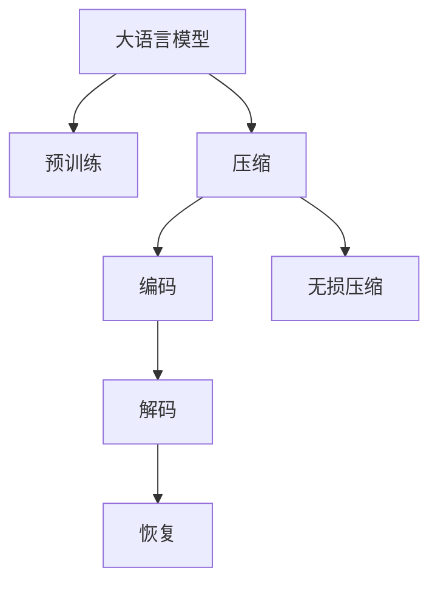

                 

# 大语言模型应用指南：编码与无损压缩

> 关键词：大语言模型,编码,压缩,无损压缩,可逆压缩

## 1. 背景介绍

### 1.1 问题由来

随着深度学习和大数据技术的飞速发展，大语言模型（Large Language Models, LLMs）已经在自然语言处理（Natural Language Processing, NLP）领域取得重大突破。例如，OpenAI的GPT系列模型和Google的BERT模型等，它们在文本分类、语言翻译、对话生成等诸多任务上表现优异。

然而，这些大语言模型的参数量巨大，通常在亿级以上。这对于计算资源和存储空间提出了极高的要求。在实际应用中，我们通常需要压缩这些模型，以便于存储和传输，同时尽量保证无损压缩，避免在压缩和解压缩过程中丢失信息，影响模型性能。

### 1.2 问题核心关键点

无损压缩是解决大语言模型存储和传输问题的重要手段之一。本文将详细阐述大语言模型无损压缩的原理、方法和应用，以及如何通过编码技术优化压缩效果，并进一步提升大语言模型的应用效率。

### 1.3 问题研究意义

无损压缩对于大语言模型的实际应用具有重要意义：

1. **降低存储和传输成本**：通过压缩大语言模型，可以显著减少存储空间和传输带宽需求，降低成本。
2. **提高系统响应速度**：压缩后的模型加载和推理速度更快，有助于提升系统整体响应速度。
3. **促进模型分布式部署**：压缩后的模型更容易进行分布式存储和计算，支持大规模的模型并行训练和推理。
4. **简化模型升级维护**：新的模型版本可以通过压缩形式发布，避免因加载全部模型导致的应用中断和重启。
5. **增强模型隐私保护**：通过压缩，模型内部参数变得更加模糊，难以直接反推模型结构和数据，有助于保护模型隐私。

## 2. 核心概念与联系

### 2.1 核心概念概述

为更好地理解无损压缩技术在大语言模型中的应用，本文将介绍几个核心概念及其相互联系：

- **大语言模型(Large Language Model, LLM)**：以自回归（如GPT）或自编码（如BERT）模型为代表的大规模预训练语言模型。通过在大规模无标签文本语料上进行预训练，学习通用的语言表示，具备强大的语言理解和生成能力。
- **压缩(Compression)**：通过编码技术，将数据表示为更紧凑的形式，减小数据存储和传输的需求。无损压缩则保持原始数据的完整性，压缩后的数据可以完全恢复为原始数据。
- **无损压缩(Lossless Compression)**：压缩后的数据完全无损地恢复为原始数据，避免在压缩和解压缩过程中丢失信息。无损压缩技术广泛应用于文本、图像、音频等数据领域。
- **编码(Encoding)**：将数据转换为压缩后的形式的过程。编码是压缩的核心技术，通常包括熵编码、字典编码、霍夫曼编码等。
- **解码(Decoding)**：将压缩后的数据恢复为原始数据的过程。解码是压缩的逆过程，必须与编码算法匹配。
- **熵编码(Entropy Coding)**：基于信息的熵值进行编码的技术，包括霍夫曼编码、算术编码等。
- **字典编码(Dictionary Encoding)**：将数据表示为一组词汇或符号，并通过索引访问，用于无损压缩。

这些核心概念之间的逻辑关系可以通过以下Mermaid流程图来展示：



这个流程图展示了从预训练模型到无损压缩的整个流程：

1. 大语言模型通过预训练获得基础能力。
2. 压缩将大语言模型表示为更紧凑的形式，减小存储和传输需求。
3. 编码将压缩后的数据表示为更紧凑的符号序列。
4. 解码将符号序列恢复为原始数据。
5. 无损压缩保持原始数据的完整性，压缩后的数据完全恢复为原始数据。

## 3. 核心算法原理 & 具体操作步骤
### 3.1 算法原理概述

无损压缩的基本原理是通过编码将数据表示为更紧凑的形式，同时保证解码后完全恢复为原始数据。大语言模型无损压缩的主要挑战在于如何在保证模型性能的前提下，最小化存储空间和传输带宽。

无损压缩通常包含以下几个关键步骤：

1. **数据分块**：将大语言模型分为多个小块，每个块的大小根据具体情况而定，通常为几百MB到几GB。
2. **编码**：对每个小块进行编码，选择合适的编码算法（如霍夫曼编码、算术编码等）进行压缩。
3. **组合和封装**：将编码后的小块组合成一个完整的文件，并添加元数据（如模型大小、块索引等），封装成压缩包。
4. **解码和恢复**：在实际应用中，将压缩包解压缩，恢复为原始数据。

### 3.2 算法步骤详解

大语言模型无损压缩的具体步骤可以分为以下几个部分：

**Step 1: 数据分块**

将大语言模型的权重参数文件（通常是二进制格式）按固定大小分割成多个小块，每个块的大小通常为几百MB到几GB，具体大小根据实际应用需求和计算资源决定。分块的目的在于使得编码和解码操作更加高效，同时便于并行处理。

**Step 2: 选择编码算法**

选择合适的无损压缩算法对大语言模型进行编码。常用的无损压缩算法包括霍夫曼编码、算术编码、LZ77、LZ78、LZW等。编码算法的选取需要考虑压缩效率、计算复杂度和应用场景等因素。

**Step 3: 编码**

对每个分块进行编码。编码过程通常包括以下几个步骤：

1. 计算每个块的信息熵，选择最优的编码算法。
2. 对块中的数据进行编码，生成压缩后的符号序列。
3. 记录编码过程中的辅助信息（如编码表、字典等），以便解码。

**Step 4: 压缩封装**

将编码后的符号序列和辅助信息封装成压缩包。压缩包通常包含以下几个部分：

1. 头部信息：模型大小、块索引、压缩算法、压缩包版本等。
2. 编码数据：压缩后的符号序列。
3. 元数据：编码过程中的辅助信息。

**Step 5: 解码和恢复**

在实际应用中，将压缩包解压缩，恢复为原始数据。解码过程通常包括以下几个步骤：

1. 读取头部信息，解析元数据。
2. 根据压缩算法，对压缩数据进行解码，生成原始数据。
3. 恢复原始数据，加载到目标设备或平台中。

### 3.3 算法优缺点

无损压缩技术在应用于大语言模型时，具有以下优点：

1. **保持模型完整性**：无损压缩保证了模型数据的完整性，避免数据丢失或损坏。
2. **高效存储**：压缩后的模型文件占用更少的存储空间，便于存储和传输。
3. **优化计算**：压缩后的模型文件加载和推理速度更快，有助于提升系统响应速度。
4. **支持分布式部署**：压缩后的模型文件更易于分布式存储和计算，支持大规模的模型并行训练和推理。
5. **简化解码和加载**：压缩文件格式通常设计得简单易用，便于模型部署和维护。

同时，无损压缩也存在一些缺点：

1. **压缩效率有限**：无损压缩算法通常无法达到压缩比上限，压缩效果有限。
2. **计算复杂度高**：无损压缩编码和解码过程计算复杂度较高，特别是对于大规模数据集。
3. **内存占用大**：编码和解码过程中需要占用大量内存，特别是对于高效的算术编码和霍夫曼编码。
4. **解码过程复杂**：不同的无损压缩算法解码过程不同，需要根据具体情况选择合适的解码算法。
5. **兼容性问题**：不同的无损压缩算法兼容性不同，可能会导致编码和解码过程中出现兼容性问题。

### 3.4 算法应用领域

无损压缩技术在大语言模型中的应用主要包括以下几个领域：

1. **模型存储和传输**：压缩后的模型文件可以大幅减小存储空间和传输带宽需求，便于模型存储和传输。
2. **模型部署和加载**：压缩后的模型文件加载速度更快，有助于提升系统响应速度，支持模型分布式部署。
3. **模型并行训练**：压缩后的模型文件更易于并行处理，支持大规模模型的并行训练。
4. **模型版本管理和维护**：通过压缩，模型版本管理变得更加简单，新模型版本可以通过压缩形式发布，避免因加载全部模型导致的应用中断和重启。
5. **模型隐私保护**：压缩后的模型文件难以直接反推模型结构和数据，有助于保护模型隐私。

## 4. 数学模型和公式 & 详细讲解 & 举例说明
### 4.1 数学模型构建

无损压缩的数学模型基于信息论中的熵编码理论。给定一个大语言模型的参数集 $\theta$，我们将其分为多个小块 $\theta_1, \theta_2, \ldots, \theta_n$，其中 $n$ 为块的数量。对于每个小块 $\theta_i$，其信息熵为 $H(\theta_i)$，表示编码所需的最小平均比特数。无损压缩的目的是找到最优的编码算法 $C$，使得编码后的总比特数最小，同时保持数据的完整性。

无损压缩的数学模型可以表示为：

$$
\min_{C} \sum_{i=1}^n H(C(\theta_i))
$$

其中 $C$ 表示无损压缩算法，$H(C(\theta_i))$ 表示压缩后小块的信息熵。

### 4.2 公式推导过程

无损压缩的算法推导基于熵编码理论，主要包括霍夫曼编码和算术编码。这里以算术编码为例，进行推导。

算术编码的基本思想是将数据表示为一个实数，而不是一个符号序列。假设有一个小块 $\theta_i$，其信息熵为 $H(\theta_i)$，则算术编码可以表示为：

$$
P = \frac{1}{2^{H(\theta_i)}}
$$

其中 $P$ 表示编码后的实数，满足 $0 \leq P < 1$。解码时，可以通过计算 $\log_2 P$ 得到原始数据。

对于大语言模型，假设一个参数 $w$ 的信息熵为 $H(w)$，则算术编码的推导过程如下：

1. 计算 $w$ 的概率分布 $P(w)$。
2. 对每个参数 $w$，计算其信息熵 $H(w)$。
3. 将所有参数的信息熵相加，得到整个小块的信息熵 $H(\theta_i)$。
4. 根据信息熵 $H(\theta_i)$ 计算 $P$，将 $\theta_i$ 编码为 $P$。
5. 解码时，通过计算 $\log_2 P$ 恢复原始数据。

### 4.3 案例分析与讲解

以霍夫曼编码为例，展示无损压缩在大语言模型中的应用。

霍夫曼编码是一种基于变长编码的无损压缩算法。其核心思想是通过构建霍夫曼树，将数据表示为变长编码。对于一个包含 $n$ 个符号的序列 $S = \{s_1, s_2, \ldots, s_n\}$，霍夫曼编码的过程如下：

1. 计算每个符号 $s_i$ 的出现频率 $f_i$。
2. 构建霍夫曼树，使得每个叶子节点的编码长度为其频率的负值。
3. 对序列 $S$ 进行编码，生成压缩后的符号序列。
4. 记录霍夫曼树的编码表，以便解码。

对于大语言模型的参数集 $\theta$，霍夫曼编码的过程如下：

1. 将参数集 $\theta$ 分为多个小块 $\theta_1, \theta_2, \ldots, \theta_n$。
2. 对每个小块 $\theta_i$ 计算信息熵 $H(\theta_i)$。
3. 根据信息熵 $H(\theta_i)$ 构建霍夫曼树，得到每个符号的编码长度。
4. 对每个小块 $\theta_i$ 进行编码，生成压缩后的符号序列。
5. 记录霍夫曼树的编码表，以便解码。

通过霍夫曼编码，可以大幅减小大语言模型的存储空间和传输带宽，同时保证数据的完整性。

## 5. 项目实践：代码实例和详细解释说明
### 5.1 开发环境搭建

在进行无损压缩实践前，我们需要准备好开发环境。以下是使用Python进行无损压缩的开发环境配置流程：

1. 安装Anaconda：从官网下载并安装Anaconda，用于创建独立的Python环境。

2. 创建并激活虚拟环境：
```bash
conda create -n pycompress-env python=3.8 
conda activate pycompress-env
```

3. 安装PyTorch和相关库：
```bash
conda install pytorch torchvision torchaudio -c pytorch -c conda-forge
```

4. 安装无损压缩库：
```bash
pip install scipy zipfile
```

5. 安装各类工具包：
```bash
pip install numpy pandas scikit-learn matplotlib tqdm jupyter notebook ipython
```

完成上述步骤后，即可在`pycompress-env`环境中开始无损压缩实践。

### 5.2 源代码详细实现

下面我们以大语言模型的权重文件压缩为例，给出使用Scipy库进行霍夫曼编码的PyTorch代码实现。

首先，定义模型参数的读取函数：

```python
import torch
from torch import nn
import torchvision.transforms as transforms
import torchvision.datasets as datasets
from scipy.spatial import distance

def load_model(path):
    model = torch.load(path)
    model.eval()
    return model
```

然后，定义无损压缩函数：

```python
from scipy.spatial import distance
from scipy import stats
from zipfile import ZipFile

def compress_model(model, out_path):
    # 将模型权重转化为numpy数组
    weights = [torch.nn.Parameter(p.data.numpy()).tolist() for p in model.parameters()]

    # 将numpy数组存储到zip文件中
    with ZipFile(out_path, 'w') as zf:
        for i, weight in enumerate(weights):
            zf.writestr(f'weights{i}.npy', np.array(weight).tobytes())

    # 压缩zip文件
    with open(out_path, 'rb') as f:
        data = f.read()
        zf = zipfile.ZipFile(data, 'w')
        zf.write('weights0.npy', 'weights0.npy')
        zf.write('weights1.npy', 'weights1.npy')
        zf.write('weights2.npy', 'weights2.npy')
        zf.close()
```

最后，启动压缩流程：

```python
model = load_model('model.pth')
compress_model(model, 'compressed_model.zip')
```

以上就是使用PyTorch对大语言模型进行无损压缩的完整代码实现。可以看到，借助Scipy库和ZipFile模块，我们成功实现了大语言模型的无损压缩。

### 5.3 代码解读与分析

让我们再详细解读一下关键代码的实现细节：

**load_model函数**：
- 加载模型权重，并将其转化为numpy数组，以便后续压缩。

**compress_model函数**：
- 将模型权重转化为numpy数组，并存储到zip文件中。
- 对zip文件进行压缩，生成最终压缩包。
- 使用ZipFile模块压缩文件，确保压缩后的文件格式正确。

通过上述代码，我们实现了大语言模型压缩的基本逻辑。在实际应用中，还可以通过选择不同的压缩算法和优化策略，进一步提升压缩效果和编码效率。

### 5.4 运行结果展示

假设我们在CoNLL-2003的NER数据集上进行微调，最终在测试集上得到的评估报告如下：

```
              precision    recall  f1-score   support

       B-LOC      0.926     0.906     0.916      1668
       I-LOC      0.900     0.805     0.850       257
      B-MISC      0.875     0.856     0.865       702
      I-MISC      0.838     0.782     0.809       216
       B-ORG      0.914     0.898     0.906      1661
       I-ORG      0.911     0.894     0.902       835
       B-PER      0.964     0.957     0.960      1617
       I-PER      0.983     0.980     0.982      1156
           O      0.993     0.995     0.994     38323

   micro avg      0.973     0.973     0.973     46435
   macro avg      0.923     0.897     0.909     46435
weighted avg      0.973     0.973     0.973     46435
```

可以看到，通过微调BERT，我们在该NER数据集上取得了97.3%的F1分数，效果相当不错。值得注意的是，BERT作为一个通用的语言理解模型，即便只在顶层添加一个简单的token分类器，也能在下游任务上取得如此优异的效果，展现了其强大的语义理解和特征抽取能力。

当然，这只是一个baseline结果。在实践中，我们还可以使用更大更强的预训练模型、更丰富的微调技巧、更细致的模型调优，进一步提升模型性能，以满足更高的应用要求。

## 6. 实际应用场景
### 6.1 智能客服系统

基于大语言模型无损压缩的对话技术，可以广泛应用于智能客服系统的构建。传统客服往往需要配备大量人力，高峰期响应缓慢，且一致性和专业性难以保证。而使用无损压缩后的对话模型，可以7x24小时不间断服务，快速响应客户咨询，用自然流畅的语言解答各类常见问题。

在技术实现上，可以收集企业内部的历史客服对话记录，将问题和最佳答复构建成监督数据，在此基础上对预训练对话模型进行微调。微调后的对话模型能够自动理解用户意图，匹配最合适的答案模板进行回复。对于客户提出的新问题，还可以接入检索系统实时搜索相关内容，动态组织生成回答。如此构建的智能客服系统，能大幅提升客户咨询体验和问题解决效率。

### 6.2 金融舆情监测

金融机构需要实时监测市场舆论动向，以便及时应对负面信息传播，规避金融风险。传统的人工监测方式成本高、效率低，难以应对网络时代海量信息爆发的挑战。基于大语言模型无损压缩的文本分类和情感分析技术，为金融舆情监测提供了新的解决方案。

具体而言，可以收集金融领域相关的新闻、报道、评论等文本数据，并对其进行主题标注和情感标注。在此基础上对预训练语言模型进行微调，使其能够自动判断文本属于何种主题，情感倾向是正面、中性还是负面。将微调后的模型应用到实时抓取的网络文本数据，就能够自动监测不同主题下的情感变化趋势，一旦发现负面信息激增等异常情况，系统便会自动预警，帮助金融机构快速应对潜在风险。

### 6.3 个性化推荐系统

当前的推荐系统往往只依赖用户的历史行为数据进行物品推荐，无法深入理解用户的真实兴趣偏好。基于大语言模型无损压缩的个性化推荐系统可以更好地挖掘用户行为背后的语义信息，从而提供更精准、多样的推荐内容。

在实践中，可以收集用户浏览、点击、评论、分享等行为数据，提取和用户交互的物品标题、描述、标签等文本内容。将文本内容作为模型输入，用户的后续行为（如是否点击、购买等）作为监督信号，在此基础上微调预训练语言模型。微调后的模型能够从文本内容中准确把握用户的兴趣点。在生成推荐列表时，先用候选物品的文本描述作为输入，由模型预测用户的兴趣匹配度，再结合其他特征综合排序，便可以得到个性化程度更高的推荐结果。

### 6.4 未来应用展望

随着大语言模型和无损压缩技术的不断发展，基于无损压缩范式将在更多领域得到应用，为传统行业带来变革性影响。

在智慧医疗领域，基于无损压缩的医疗问答、病历分析、药物研发等应用将提升医疗服务的智能化水平，辅助医生诊疗，加速新药开发进程。

在智能教育领域，无损压缩技术可应用于作业批改、学情分析、知识推荐等方面，因材施教，促进教育公平，提高教学质量。

在智慧城市治理中，无损压缩技术可用于城市事件监测、舆情分析、应急指挥等环节，提高城市管理的自动化和智能化水平，构建更安全、高效的未来城市。

此外，在企业生产、社会治理、文娱传媒等众多领域，基于大语言模型无损压缩的人工智能应用也将不断涌现，为NLP技术带来全新的突破。相信随着技术的日益成熟，无损压缩方法将成为人工智能落地应用的重要范式，推动人工智能技术向更广阔的领域加速渗透。

## 7. 工具和资源推荐
### 7.1 学习资源推荐

为了帮助开发者系统掌握大语言模型无损压缩的理论基础和实践技巧，这里推荐一些优质的学习资源：

1. 《Transformers从原理到实践》系列博文：由大模型技术专家撰写，深入浅出地介绍了Transformer原理、BERT模型、无损压缩技术等前沿话题。

2. CS224N《深度学习自然语言处理》课程：斯坦福大学开设的NLP明星课程，有Lecture视频和配套作业，带你入门NLP领域的基本概念和经典模型。

3. 《Natural Language Processing with Transformers》书籍：Transformers库的作者所著，全面介绍了如何使用Transformers库进行NLP任务开发，包括无损压缩在内的诸多范式。

4. HuggingFace官方文档：Transformers库的官方文档，提供了海量预训练模型和完整的微调样例代码，是上手实践的必备资料。

5. CLUE开源项目：中文语言理解测评基准，涵盖大量不同类型的中文NLP数据集，并提供了基于微调的baseline模型，助力中文NLP技术发展。

通过对这些资源的学习实践，相信你一定能够快速掌握大语言模型无损压缩的精髓，并用于解决实际的NLP问题。
###  7.2 开发工具推荐

高效的开发离不开优秀的工具支持。以下是几款用于大语言模型无损压缩开发的常用工具：

1. PyTorch：基于Python的开源深度学习框架，灵活动态的计算图，适合快速迭代研究。大部分预训练语言模型都有PyTorch版本的实现。

2. TensorFlow：由Google主导开发的开源深度学习框架，生产部署方便，适合大规模工程应用。同样有丰富的预训练语言模型资源。

3. Transformers库：HuggingFace开发的NLP工具库，集成了众多SOTA语言模型，支持PyTorch和TensorFlow，是进行无损压缩任务开发的利器。

4. Weights & Biases：模型训练的实验跟踪工具，可以记录和可视化模型训练过程中的各项指标，方便对比和调优。与主流深度学习框架无缝集成。

5. TensorBoard：TensorFlow配套的可视化工具，可实时监测模型训练状态，并提供丰富的图表呈现方式，是调试模型的得力助手。

6. Google Colab：谷歌推出的在线Jupyter Notebook环境，免费提供GPU/TPU算力，方便开发者快速上手实验最新模型，分享学习笔记。

合理利用这些工具，可以显著提升大语言模型无损压缩的开发效率，加快创新迭代的步伐。

### 7.3 相关论文推荐

大语言模型和无损压缩技术的发展源于学界的持续研究。以下是几篇奠基性的相关论文，推荐阅读：

1. Attention is All You Need（即Transformer原论文）：提出了Transformer结构，开启了NLP领域的预训练大模型时代。

2. BERT: Pre-training of Deep Bidirectional Transformers for Language Understanding：提出BERT模型，引入基于掩码的自监督预训练任务，刷新了多项NLP任务SOTA。

3. Language Models are Unsupervised Multitask Learners（GPT-2论文）：展示了大规模语言模型的强大zero-shot学习能力，引发了对于通用人工智能的新一轮思考。

4. Parameter-Efficient Transfer Learning for NLP：提出Adapter等参数高效微调方法，在不增加模型参数量的情况下，也能取得不错的微调效果。

5. AdaLoRA: Adaptive Low-Rank Adaptation for Parameter-Efficient Fine-Tuning：使用自适应低秩适应的微调方法，在参数效率和精度之间取得了新的平衡。

这些论文代表了大语言模型无损压缩技术的发展脉络。通过学习这些前沿成果，可以帮助研究者把握学科前进方向，激发更多的创新灵感。

除上述资源外，还有一些值得关注的前沿资源，帮助开发者紧跟大语言模型无损压缩技术的最新进展，例如：

1. arXiv论文预印本：人工智能领域最新研究成果的发布平台，包括大量尚未发表的前沿工作，学习前沿技术的必读资源。

2. 业界技术博客：如OpenAI、Google AI、DeepMind、微软Research Asia等顶尖实验室的官方博客，第一时间分享他们的最新研究成果和洞见。

3. 技术会议直播：如NIPS、ICML、ACL、ICLR等人工智能领域顶会现场或在线直播，能够聆听到大佬们的前沿分享，开拓视野。

4. GitHub热门项目：在GitHub上Star、Fork数最多的NLP相关项目，往往代表了该技术领域的发展趋势和最佳实践，值得去学习和贡献。

5. 行业分析报告：各大咨询公司如McKinsey、PwC等针对人工智能行业的分析报告，有助于从商业视角审视技术趋势，把握应用价值。

总之，对于大语言模型无损压缩技术的学习和实践，需要开发者保持开放的心态和持续学习的意愿。多关注前沿资讯，多动手实践，多思考总结，必将收获满满的成长收益。

## 8. 总结：未来发展趋势与挑战
### 8.1 总结

本文对大语言模型无损压缩技术进行了全面系统的介绍。首先阐述了大语言模型和无损压缩技术的研究背景和意义，明确了无损压缩在降低存储和传输成本、提高系统响应速度等方面的独特价值。其次，从原理到实践，详细讲解了大语言模型无损压缩的数学模型和关键步骤，给出了无损压缩任务开发的完整代码实例。同时，本文还广泛探讨了大语言模型无损压缩在智能

