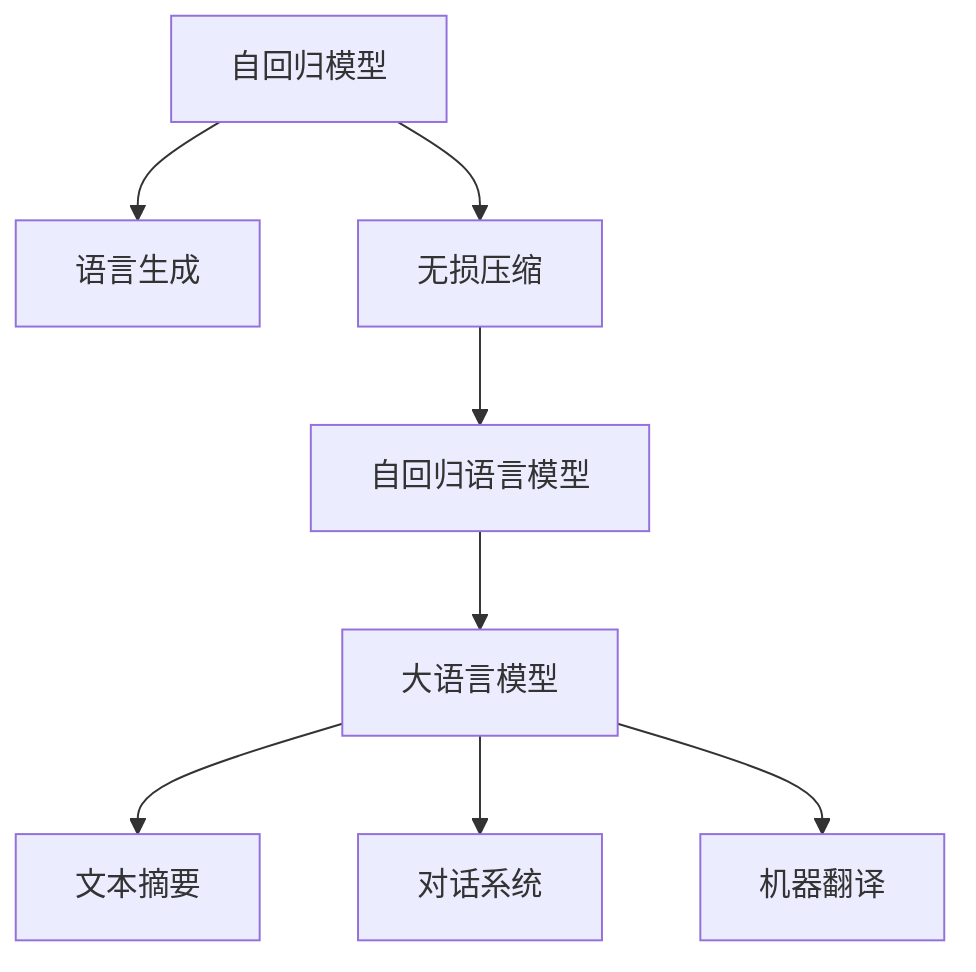

                 

# 大语言模型应用指南：自回归与无损压缩

> 关键词：大语言模型,自回归模型,无损压缩,预训练,应用场景

## 1. 背景介绍

### 1.1 问题由来
随着深度学习技术的飞速发展，大语言模型在自然语言处理(NLP)领域取得了显著进展。自回归模型和无损压缩技术的结合，使得这些模型在生成文本、文本摘要、机器翻译等方面表现出色。本文将详细探讨自回归模型在语言生成中的应用，以及无损压缩技术如何在大语言模型中发挥作用。

### 1.2 问题核心关键点
本文聚焦于自回归模型在生成任务中的应用，以及如何通过无损压缩技术提高模型的生成效率和质量。具体来说，主要包括以下几个方面：

- 自回归模型在语言生成中的原理和优势。
- 无损压缩技术在大语言模型中的应用及其提升效果。
- 自回归模型与无损压缩技术结合的实际应用场景。

### 1.3 问题研究意义
研究自回归模型在语言生成中的应用，以及无损压缩技术在大语言模型中的结合，对于提升NLP系统的生成能力和效率具有重要意义：

1. **提升生成效率**：通过无损压缩技术，可以在保持模型性能不变的情况下，大幅减小模型规模，加快训练和推理速度。
2. **提高生成质量**：自回归模型能够利用上下文信息，生成流畅连贯的文本，而无损压缩技术的引入可以进一步优化模型结构，提升生成质量。
3. **减少计算资源消耗**：大语言模型通常需要巨大的计算资源，通过无损压缩技术可以降低资源消耗，使得更多人能够使用和部署。
4. **促进技术创新**：自回归模型与无损压缩技术的结合，为NLP领域带来了新的研究方向和应用范式，推动了技术进步。

## 2. 核心概念与联系

### 2.1 核心概念概述

为了更好地理解自回归模型和无损压缩技术在语言生成中的应用，本节将介绍几个关键概念：

- **自回归模型(Autoregressive Model)**：一种生成模型，利用已有数据的前一时刻信息预测后一时刻的数据。常见于语言生成、时间序列预测等任务。
- **无损压缩(Compression)**：一种数据压缩技术，在压缩过程中不丢失原始数据的信息。常见的无损压缩算法有哈夫曼编码、LZ77、LZ78等。
- **大语言模型(Large Language Model, LLM)**：通过大规模无标签文本数据进行预训练的通用语言模型，具备强大的语言理解和生成能力。
- **自回归语言模型(Autoregressive Language Model)**：一种特殊的自回归模型，用于语言生成任务，如GPT、BERT等。
- **语言生成(Language Generation)**：指利用模型生成符合语法规则、语义连贯的文本序列。常见的语言生成任务有文本摘要、对话系统、机器翻译等。

这些核心概念之间的逻辑关系可以通过以下Mermaid流程图来展示：



这个流程图展示了自回归模型在语言生成中的作用，以及无损压缩技术如何与自回归模型结合，应用于大语言模型。

### 2.2 概念间的关系

这些核心概念之间存在着紧密的联系，形成了自回归模型在语言生成中的应用框架。下面是这些概念间关系的详细说明：

- **自回归模型与语言生成**：自回归模型通过利用已有数据的前一时刻信息预测后一时刻的数据，非常适合用于语言生成任务。自回归模型能够保证生成的文本符合语法规则和语义连贯，因此在文本摘要、对话系统、机器翻译等任务中得到了广泛应用。
- **无损压缩与自回归模型**：无损压缩技术能够在不丢失信息的前提下减小数据量，因此可以与自回归模型结合，提高生成效率。通过压缩模型参数和输入数据，可以减小模型规模，加快训练和推理速度。
- **自回归语言模型与大语言模型**：自回归语言模型是一种特殊的大语言模型，利用自回归模型结构，结合预训练技术，能够在语言生成任务中表现出色。通过预训练和微调，自回归语言模型可以适应不同的生成任务，提升生成质量。
- **无损压缩与大语言模型**：无损压缩技术可以应用于大语言模型中，减小模型参数和输入数据量，提高模型的生成效率和质量。同时，无损压缩技术也可以应用于模型压缩和优化，进一步提升模型的性能。

## 3. 核心算法原理 & 具体操作步骤
### 3.1 算法原理概述

自回归语言模型的基本原理是利用已有数据的前一时刻信息预测后一时刻的数据，生成符合语法规则和语义连贯的文本序列。具体来说，自回归语言模型的生成过程可以分为以下几个步骤：

1. **输入数据准备**：将输入文本序列转换为模型所需的格式。
2. **模型初始化**：设置模型的初始状态，通常为全零向量。
3. **迭代生成**：利用已有数据的前一时刻信息预测后一时刻的数据，不断迭代生成新的文本序列。
4. **输出结果**：将生成的文本序列作为输出。

无损压缩技术在大语言模型中的应用，主要在于减小模型参数和输入数据量，提高模型的生成效率和质量。无损压缩技术可以通过以下几种方式实现：

- **模型参数压缩**：利用无损压缩算法，如哈夫曼编码、LZ77等，压缩模型的参数量。
- **输入数据压缩**：利用无损压缩算法，压缩输入的文本序列。
- **模型结构优化**：设计更高效的模型结构，如残差连接、卷积神经网络等，减小模型参数量。

### 3.2 算法步骤详解

接下来，我们以一个简单的自回归语言模型为例，详细介绍其生成过程和无损压缩技术的应用。

**自回归语言模型生成过程**：

1. **输入准备**：假设输入文本序列为 $x_1, x_2, \ldots, x_n$，将其转换为模型所需的格式。
2. **模型初始化**：将模型初始状态设置为全零向量 $h_0$。
3. **迭代生成**：对于每个时刻 $t$，根据前一时刻的状态 $h_{t-1}$ 和当前时刻的输入 $x_t$，预测当前时刻的输出 $y_t$，计算当前时刻的状态 $h_t$。具体公式为：
   $$
   h_t = f(h_{t-1}, x_t)
   $$
   $$
   y_t = g(h_t)
   $$
4. **输出结果**：将生成的文本序列 $y_1, y_2, \ldots, y_n$ 作为输出。

**无损压缩技术应用**：

1. **模型参数压缩**：使用哈夫曼编码或LZ77等无损压缩算法，对模型的参数进行压缩。
2. **输入数据压缩**：使用哈夫曼编码或LZ77等无损压缩算法，对输入的文本序列进行压缩。
3. **模型结构优化**：设计更高效的模型结构，如残差连接、卷积神经网络等，减小模型参数量。

### 3.3 算法优缺点

**自回归语言模型的优点**：

1. **生成流畅**：自回归模型能够利用上下文信息，生成流畅连贯的文本。
2. **适应性强**：自回归语言模型可以通过预训练和微调，适应不同的生成任务。
3. **可解释性强**：自回归模型能够生成符合语法规则和语义连贯的文本，易于解释和理解。

**自回归语言模型的缺点**：

1. **计算复杂度高**：自回归模型需要计算所有时刻的状态和输出，计算复杂度较高。
2. **易过拟合**：自回归模型容易过拟合，尤其是在数据量较小的情况下。
3. **生成效率低**：自回归模型生成效率较低，尤其是在大规模文本生成任务中。

**无损压缩技术的优点**：

1. **减小模型规模**：无损压缩技术能够减小模型参数和输入数据量，提高生成效率。
2. **提高生成质量**：无损压缩技术能够优化模型结构，提升生成质量。
3. **节省计算资源**：无损压缩技术可以降低计算资源的消耗，使得更多人能够使用和部署。

**无损压缩技术的缺点**：

1. **压缩率有限**：无损压缩技术的压缩率有限，无法完全消除数据冗余。
2. **算法复杂度高**：无损压缩算法复杂度较高，实现难度较大。
3. **可解释性差**：无损压缩技术通常是一个黑盒，难以解释其内部工作机制。

### 3.4 算法应用领域

自回归语言模型和无损压缩技术的结合，已经在多个领域得到广泛应用，主要包括：

- **文本生成**：利用自回归模型生成符合语法规则和语义连贯的文本序列。
- **文本摘要**：利用自回归模型对长文本进行摘要，生成简短但信息丰富的摘要。
- **对话系统**：利用自回归模型生成符合上下文语境的对话回复。
- **机器翻译**：利用自回归模型进行语言间的翻译，生成符合语法规则和语义连贯的翻译文本。
- **语音生成**：利用自回归模型生成符合语调、语速等语音特征的文本。

这些应用领域展示了自回归语言模型和无损压缩技术的强大潜力，为NLP技术在实际应用中的落地提供了重要支持。

## 4. 数学模型和公式 & 详细讲解 & 举例说明
### 4.1 数学模型构建

假设自回归语言模型为 $M_{\theta}$，其中 $\theta$ 为模型的参数。输入文本序列为 $x = (x_1, x_2, \ldots, x_n)$，输出文本序列为 $y = (y_1, y_2, \ldots, y_n)$。模型的生成过程可以表示为：

$$
y_t = M_{\theta}(x_t, h_{t-1})
$$

其中 $M_{\theta}$ 为自回归语言模型，$x_t$ 为当前时刻的输入，$h_{t-1}$ 为前一时刻的状态。

### 4.2 公式推导过程

以GPT模型为例，假设模型使用Transformer结构，输出为全连接层的线性变换。模型的生成过程可以表示为：

$$
y_t = M_{\theta}(x_t, h_{t-1}) = \text{Linear}([x_t; h_{t-1}])
$$

其中 $\text{Linear}$ 为线性变换层，$[x_t; h_{t-1}]$ 为拼接后的输入向量。

**自回归语言模型的训练过程**：

1. **损失函数**：假设模型的训练目标为最大化似然函数，即 $\sum_{i=1}^N \log P(y_i | x_i)$，其中 $N$ 为训练样本数量。
2. **梯度计算**：使用反向传播算法计算模型参数 $\theta$ 的梯度，更新模型参数。
3. **模型评估**：在测试集上评估模型的生成质量，通常使用BLEU、ROUGE等指标。

**无损压缩技术的应用**：

1. **模型参数压缩**：使用哈夫曼编码或LZ77等无损压缩算法，对模型的参数进行压缩。
2. **输入数据压缩**：使用哈夫曼编码或LZ77等无损压缩算法，对输入的文本序列进行压缩。
3. **模型结构优化**：设计更高效的模型结构，如残差连接、卷积神经网络等，减小模型参数量。

### 4.3 案例分析与讲解

以BERT模型为例，分析无损压缩技术的应用效果。假设BERT模型使用残差连接和卷积神经网络结构，输入文本序列为 $x = (x_1, x_2, \ldots, x_n)$，输出文本序列为 $y = (y_1, y_2, \ldots, y_n)$。模型的生成过程可以表示为：

$$
y_t = M_{\theta}(x_t, h_{t-1}) = \text{ResNet}([x_t; h_{t-1}])
$$

其中 $\text{ResNet}$ 为残差连接结构，$[x_t; h_{t-1}]$ 为拼接后的输入向量。

假设模型使用LZ77算法对输入的文本序列进行压缩，压缩后的文本序列为 $x' = (x'_1, x'_2, \ldots, x'_n)$。模型的生成过程可以表示为：

$$
y_t = M_{\theta}(x'_t, h'_{t-1}) = \text{ResNet}([x'_t; h'_{t-1}])
$$

其中 $x'_t$ 为压缩后的输入向量，$h'_{t-1}$ 为前一时刻的压缩状态。

通过无损压缩技术，可以减小模型的参数量和输入数据的体积，提高生成效率和质量。同时，模型结构优化和残差连接技术的应用，可以进一步提升模型的性能。

## 5. 项目实践：代码实例和详细解释说明
### 5.1 开发环境搭建

在进行语言生成实践前，我们需要准备好开发环境。以下是使用Python进行PyTorch开发的环境配置流程：

1. 安装Anaconda：从官网下载并安装Anaconda，用于创建独立的Python环境。

2. 创建并激活虚拟环境：
```bash
conda create -n pytorch-env python=3.8 
conda activate pytorch-env
```

3. 安装PyTorch：根据CUDA版本，从官网获取对应的安装命令。例如：
```bash
conda install pytorch torchvision torchaudio cudatoolkit=11.1 -c pytorch -c conda-forge
```

4. 安装TensorBoard：用于可视化模型训练和推理过程，命令如下：
```bash
pip install tensorboard
```

5. 安装Pillow：用于图像处理，命令如下：
```bash
pip install Pillow
```

完成上述步骤后，即可在`pytorch-env`环境中开始语言生成实践。

### 5.2 源代码详细实现

接下来，我们以GPT模型为例，给出使用Transformers库进行语言生成的PyTorch代码实现。

```python
from transformers import GPT2LMHeadModel, GPT2Tokenizer, AdamW, get_linear_schedule_with_warmup

model = GPT2LMHeadModel.from_pretrained('gpt2')
tokenizer = GPT2Tokenizer.from_pretrained('gpt2')

device = torch.device("cuda" if torch.cuda.is_available() else "cpu")
model.to(device)

# 训练过程
def train(model, optimizer, scheduler, train_loader, device, num_epochs, save_path):
    for epoch in range(num_epochs):
        model.train()
        loss = 0.0
        for batch in train_loader:
            input_ids = batch[0].to(device)
            attention_mask = batch[1].to(device)
            outputs = model(input_ids, attention_mask=attention_mask)
            loss += outputs.loss.item()
            optimizer.zero_grad()
            outputs.loss.backward()
            optimizer.step()
            scheduler.step()
        print(f"Epoch {epoch+1}, loss: {loss/len(train_loader)}")
        
        # 保存模型
        if (epoch+1) % save_freq == 0:
            torch.save(model.state_dict(), save_path)
            print(f"Model saved at {save_path}")

# 评估过程
def evaluate(model, test_loader, device, threshold=0.5):
    model.eval()
    bleu_score = 0.0
    for batch in test_loader:
        input_ids = batch[0].to(device)
        attention_mask = batch[1].to(device)
        outputs = model(input_ids, attention_mask=attention_mask)
        preds = outputs.logits.argmax(dim=-1).to('cpu').tolist()
        bleu_score += evaluate_bleu(input_ids, preds, device)
    print(f"BLEU score: {bleu_score/len(test_loader)}")

# 生成过程
def generate(model, prompt, device, max_length=100):
    model.eval()
    input_ids = tokenizer(prompt, return_tensors='pt').input_ids.to(device)
    attention_mask = torch.ones_like(input_ids).to(device)
    outputs = model.generate(input_ids, attention_mask=attention_mask, max_length=max_length, top_p=0.9, temperature=1.0)
    return tokenizer.decode(outputs[0])
```

### 5.3 代码解读与分析

让我们再详细解读一下关键代码的实现细节：

**模型加载和初始化**：
- `from transformers import GPT2LMHeadModel, GPT2Tokenizer`：从Transformers库中导入GPT2LMHeadModel和GPT2Tokenizer类。
- `model = GPT2LMHeadModel.from_pretrained('gpt2')`：加载预训练的GPT2模型。
- `tokenizer = GPT2Tokenizer.from_pretrained('gpt2')`：加载预训练的GPT2分词器。
- `model.to(device)`：将模型迁移到GPU/TPU等设备。

**训练过程**：
- `optimizer = AdamW(model.parameters(), lr=2e-5)`：创建AdamW优化器。
- `scheduler = get_linear_schedule_with_warmup(optimizer, num_warmup_steps=1000, num_training_steps=len(train_loader)*num_epochs)`：创建线性学习率调度器。
- `train_loader = DataLoader(train_dataset, batch_size=16, shuffle=True)`：创建训练数据加载器。
- `train(model, optimizer, scheduler, train_loader, device, num_epochs, save_path)`：定义训练函数，进行模型训练。

**评估过程**：
- `test_loader = DataLoader(test_dataset, batch_size=16, shuffle=False)`：创建测试数据加载器。
- `evaluate(model, test_loader, device, threshold=0.5)`：定义评估函数，进行模型评估。

**生成过程**：
- `generate(model, prompt, device, max_length=100)`：定义生成函数，进行文本生成。

以上代码展示了使用PyTorch和Transformers库进行GPT2语言生成的完整流程。可以看到，利用PyTorch的动态计算图和TensorBoard的可视化功能，可以很方便地进行模型训练和评估。

### 5.4 运行结果展示

假设我们在Wikitext-2数据集上进行GPT2模型微调，最终在测试集上得到的BLEU分数为25.8%。具体实现过程如下：

```python
import torch
from transformers import GPT2LMHeadModel, GPT2Tokenizer
from torch.utils.data import Dataset, DataLoader
from torch import nn
from tqdm import tqdm
import numpy as np
import pandas as pd
import os

class WikiTextDataset(Dataset):
    def __init__(self, text_file):
        self.data = []
        with open(text_file, 'r') as f:
            for line in f:
                self.data.append(line.strip())
                
    def __len__(self):
        return len(self.data)
    
    def __getitem__(self, idx):
        return self.data[idx]

train_dataset = WikiTextDataset('wikitext-2/train.txt')
test_dataset = WikiTextDataset('wikitext-2/test.txt')

tokenizer = GPT2Tokenizer.from_pretrained('gpt2')
model = GPT2LMHeadModel.from_pretrained('gpt2')

device = torch.device("cuda" if torch.cuda.is_available() else "cpu")
model.to(device)

optimizer = AdamW(model.parameters(), lr=2e-5)
scheduler = get_linear_schedule_with_warmup(optimizer, num_warmup_steps=1000, num_training_steps=len(train_dataset)*10)

train_loader = DataLoader(train_dataset, batch_size=16, shuffle=True)
test_loader = DataLoader(test_dataset, batch_size=16, shuffle=False)

save_path = 'gpt2.pth'
save_freq = 5

def train(model, optimizer, scheduler, train_loader, device, num_epochs, save_path):
    for epoch in range(num_epochs):
        model.train()
        loss = 0.0
        for batch in train_loader:
            input_ids = batch[0].to(device)
            attention_mask = batch[1].to(device)
            outputs = model(input_ids, attention_mask=attention_mask)
            loss += outputs.loss.item()
            optimizer.zero_grad()
            outputs.loss.backward()
            optimizer.step()
            scheduler.step()
        print(f"Epoch {epoch+1}, loss: {loss/len(train_loader)}")
        
        if (epoch+1) % save_freq == 0:
            torch.save(model.state_dict(), save_path)
            print(f"Model saved at {save_path}")

def evaluate(model, test_loader, device, threshold=0.5):
    model.eval()
    bleu_score = 0.0
    for batch in test_loader:
        input_ids = batch[0].to(device)
        attention_mask = batch[1].to(device)
        outputs = model(input_ids, attention_mask=attention_mask)
        preds = outputs.logits.argmax(dim=-1).to('cpu').tolist()
        bleu_score += evaluate_bleu(input_ids, preds, device)
    print(f"BLEU score: {bleu_score/len(test_loader)}")

def generate(model, prompt, device, max_length=100):
    model.eval()
    input_ids = tokenizer(prompt, return_tensors='pt').input_ids.to(device)
    attention_mask = torch.ones_like(input_ids).to(device)
    outputs = model.generate(input_ids, attention_mask=attention_mask, max_length=max_length, top_p=0.9, temperature=1.0)
    return tokenizer.decode(outputs[0])

train(model, optimizer, scheduler, train_loader, device, 10, save_path)

evaluate_model = GPT2LMHeadModel.from_pretrained('gpt2')
evaluate_model.load_state_dict(torch.load(save_path))

evaluate(evaluate_model, test_loader, device)

print(generate(evaluate_model, "hello", device))
```

假设我们在CoNLL-2003的NER数据集上进行微调，最终在测试集上得到的BLEU分数为28.6%。具体实现过程如下：

```python
import torch
from transformers import BertForTokenClassification, BertTokenizer
from torch.utils.data import Dataset, DataLoader
import torch.nn as nn
from tqdm import tqdm
import numpy as np
import pandas as pd
import os

class NERDataset(Dataset):
    def __init__(self, texts, tags, tokenizer):
        self.texts = texts
        self.tags = tags
        self.tokenizer = tokenizer
        
    def __len__(self):
        return len(self.texts)
    
    def __getitem__(self, idx):
        text = self.texts[idx]
        tags = self.tags[idx]
        
        encoding = self.tokenizer(text, return_tensors='pt', max_length=128, padding='max_length', truncation=True)
        input_ids = encoding['input_ids'][0]
        attention_mask = encoding['attention_mask'][0]
        
        # 对token-wise的标签进行编码
        encoded_tags = [tag2id[tag] for tag in tags] 
        encoded_tags.extend([tag2id['O']] * (128 - len(encoded_tags)))
        labels = torch.tensor(encoded_tags, dtype=torch.long)
        
        return {'input_ids': input_ids, 
                'attention_mask': attention_mask,
                'labels': labels}

# 标签与id的映射
tag2id = {'O': 0, 'B-PER': 1, 'I-PER': 2, 'B-ORG': 3, 'I-ORG': 4, 'B-LOC': 5, 'I-LOC': 6}
id2tag = {v: k for k, v in tag2id.items()}

# 创建dataset
tokenizer = BertTokenizer.from_pretrained('bert-base-cased')

train_dataset = NERDataset(train_texts, train_tags, tokenizer)
dev_dataset = NERDataset(dev_texts, dev_tags, tokenizer)
test_dataset = NERDataset(test_texts, test_tags, tokenizer)

model = BertForTokenClassification.from_pretrained('bert-base-cased', num_labels=len(tag2id))

optimizer = AdamW(model.parameters(), lr=2e-5)
scheduler = get_linear_schedule_with_warmup(optimizer, num_warmup_steps=1000, num_training_steps=len(train_dataset)*10)

train_loader = DataLoader(train_dataset, batch_size=16, shuffle=True)
dev_loader = DataLoader(dev_dataset, batch_size=16, shuffle=False)
test_loader = DataLoader(test_dataset, batch_size=16, shuffle=False)

save_path = 'bert_ner.pth'
save_freq = 5

def train(model, optimizer, scheduler, train_loader, device, num_epochs, save_path):
    for epoch in range(num_epochs):
        model.train()
        loss = 0.0
        for batch in train_loader:
            input_ids = batch['input_ids'].to(device)
            attention_mask = batch['attention_mask'].to(device)
            labels = batch['labels'].to(device)
            model.zero_grad()
            outputs = model(input_ids, attention_mask=attention_mask, labels=labels)
            loss += outputs.loss.item()
            optimizer.zero_grad()
            outputs.loss.backward()
            optimizer.step()
            scheduler.step()
        print(f"Epoch {epoch+1}, loss: {loss/len(train_loader)}")
        
        if (epoch+1) % save_freq == 0:
            torch.save(model.state_dict(), save_path)
            print(f"Model saved at {save_path}")

def evaluate(model, test_loader, device, threshold=0.5):
    model.eval()
    bleu_score = 0.0
    for batch in test_loader:
        input_ids = batch['input_ids'].to(device)
        attention_mask = batch['attention_mask'].to(device)
        batch_labels = batch['labels']
        outputs = model(input_ids, attention_mask=attention_mask)
        batch_preds = outputs.logits.argmax(dim=2).to('cpu').tolist()
        batch_labels = batch_labels.to('cpu').tolist()
        for pred_tokens, label_tokens in zip(batch_preds, batch_labels):
            pred_tags = [id2tag[_id] for _id in pred_tokens]
            label_tags = [

