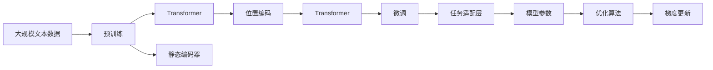
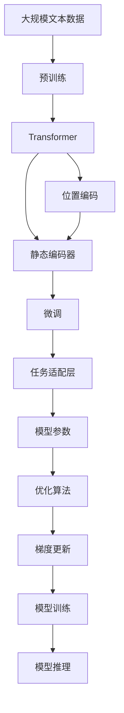

                 

# 大语言模型应用指南：静态编码和位置编码

> 关键词：大语言模型, 静态编码, 位置编码, 自监督学习, Transformer, 预训练, 训练架构, 模型性能

## 1. 背景介绍

### 1.1 问题由来
大语言模型（Large Language Model, LLMs）作为自然语言处理（Natural Language Processing, NLP）领域的前沿技术，以其卓越的语言理解和生成能力，在诸多任务上取得了显著的成果。其核心在于自监督预训练（Self-supervised Pre-training），即在大量无标签文本数据上，通过预测文本中缺失的信息（如掩码预测、语言建模等）进行模型训练，从而学习到通用语言表示。

然而，在大规模预训练阶段，模型往往需要处理大量的文本数据，这对计算资源和时间提出了很高的要求。特别是在动态编码器（如LSTM、GRU）的架构下，模型需要不断调整编码器状态，难以并行计算，导致训练效率低下。为了解决这一问题，静态编码器（Static Encoder）和位置编码（Positional Encoding）被引入到大语言模型中，大大提升了模型的训练效率和性能。

### 1.2 问题核心关键点
静态编码器和位置编码作为大语言模型预训练和微调中的关键技术，主要解决以下两个问题：

1. **计算效率**：通过静态编码器，模型可以在训练过程中保持固定状态，从而实现并行计算，提高训练效率。
2. **位置信息**：位置编码提供了序列中每个位置的信息，使得模型能够感知序列中的位置关系，更好地处理长序列数据。

这两项技术使得大语言模型的训练架构更加高效，模型性能大幅提升，同时能够处理更长的文本序列，对长文本生成和理解等任务尤为重要。

### 1.3 问题研究意义
静态编码器和位置编码技术不仅提升了大语言模型的训练效率和性能，还为模型在长序列数据上的表现提供了坚实的基础。这些技术的应用，使得大语言模型能够处理更复杂的语言理解和生成任务，加速NLP技术的产业化进程，推动人工智能技术在更广泛领域的应用。

## 2. 核心概念与联系

### 2.1 核心概念概述

为了更好地理解静态编码器和位置编码在大语言模型中的应用，本节将介绍几个密切相关的核心概念：

- **静态编码器（Static Encoder）**：一种能够在训练过程中保持固定状态的编码器架构，通过使用循环神经网络（RNN）或卷积神经网络（CNN）等固定架构，实现高效的并行计算。
- **位置编码（Positional Encoding）**：一种在序列模型中添加的位置信息表示方法，通过将位置信息编码到词向量中，使得模型能够感知序列中的位置关系，避免因位置顺序变化而导致的序列混淆。
- **Transformer**：一种基于自注意力机制（Self-Attention）的神经网络架构，通过多头自注意力（Multi-Head Self-Attention）和位置编码，实现了高效的序列建模。
- **预训练（Pre-training）**：在大量无标签文本数据上，通过自监督学习任务训练通用语言模型的过程，通常包括掩码预测、语言建模等任务。
- **微调（Fine-tuning）**：在预训练模型的基础上，使用下游任务的少量标注数据，通过有监督学习优化模型在特定任务上的性能。

这些核心概念之间存在着紧密的联系，形成了大语言模型训练和推理的完整生态系统。通过理解这些核心概念，我们可以更好地把握大语言模型的工作原理和优化方向。

### 2.2 概念间的关系

这些核心概念之间存在着紧密的联系，形成了大语言模型训练和推理的完整生态系统。以下用几个Mermaid流程图来展示这些概念之间的关系：



这个流程图展示了大语言模型的核心概念及其之间的关系：

1. 大语言模型通过预训练获得基础能力。
2. 位置编码和静态编码器提升了模型训练效率。
3. Transformer模型实现高效的序列建模。
4. 微调使通用大模型更好地适应特定任务。
5. 任务适配层和模型参数优化是微调的关键。

这些概念共同构成了大语言模型的训练和推理框架，使得模型能够在各种场景下发挥强大的语言理解和生成能力。通过理解这些核心概念，我们可以更好地掌握大语言模型的优化技巧，提升模型性能。

### 2.3 核心概念的整体架构

最后，我们用一个综合的流程图来展示这些核心概念在大语言模型训练和推理过程中的整体架构：



这个综合流程图展示了从预训练到微调，再到推理的完整过程。大语言模型首先在大规模文本数据上进行预训练，然后通过微调（包括位置编码和静态编码器）使模型适应特定任务，最后使用微调后的模型进行推理，得到预测结果。通过这些流程图，我们可以更清晰地理解大语言模型训练和推理过程中各个核心概念的关系和作用，为后续深入讨论具体的训练和推理方法奠定基础。

## 3. 核心算法原理 & 具体操作步骤

### 3.1 算法原理概述

静态编码器和位置编码技术在大语言模型的应用中，主要解决以下几个问题：

- **计算效率**：静态编码器通过固定架构，实现高效的并行计算，显著提升模型训练效率。
- **位置信息**：位置编码将位置信息嵌入词向量中，使模型能够感知序列中的位置关系，提升序列建模能力。

大语言模型通常采用Transformer架构，其核心在于自注意力机制和位置编码。Transformer模型通过多头自注意力机制，捕捉序列中每个位置与其它位置之间的关系，并通过位置编码，保留序列中的位置信息。

### 3.2 算法步骤详解

以下是使用Transformer架构实现静态编码器和位置编码的详细步骤：

**Step 1: 初始化模型参数**
- 在Transformer模型中，每个位置$i$的词向量表示为$x_i$。
- 通过位置编码$\text{PE}(i)$，将位置信息$x_i$进行编码，得到$x_i + \text{PE}(i)$。

**Step 2: 计算多头自注意力**
- 对于每个位置$i$，计算其与序列中所有位置的注意力权重$w_i$。
- 多头自注意力层通过多个线性投影，得到不同头的注意力权重$w_i^h$。

**Step 3: 计算残差连接**
- 使用残差连接，将输入和注意力输出进行叠加。
- 使用层归一化（Layer Normalization），对残差连接后的输出进行归一化。

**Step 4: 前向传播**
- 对每个位置进行多头自注意力和前向网络（Feedforward Network）的前向传播。
- 使用层归一化和残差连接，进行归一化。

**Step 5: 位置编码和静态编码器**
- 使用位置编码，将位置信息嵌入词向量中。
- 通过静态编码器，固定词向量的结构，实现高效的并行计算。

**Step 6: 微调**
- 在预训练的基础上，使用下游任务的少量标注数据，通过有监督学习优化模型。
- 通过任务适配层，添加合适的输出层和损失函数。

**Step 7: 模型推理**
- 使用微调后的模型，对新输入进行推理预测。
- 通过解码器（Decoder）生成最终输出。

### 3.3 算法优缺点

静态编码器和位置编码技术在大语言模型中的应用，具有以下优点：

1. **计算效率高**：通过固定架构和位置编码，静态编码器实现了高效的并行计算，大大提升了模型训练速度。
2. **序列建模能力强**：位置编码使模型能够感知序列中的位置关系，提升了长序列数据的处理能力。
3. **通用性高**：静态编码器和位置编码技术适用于各种Transformer模型，能够灵活应用到不同领域和任务。

同时，这些技术也存在一些缺点：

1. **模型复杂度**：引入位置编码和静态编码器，可能会增加模型复杂度，影响模型推理速度。
2. **计算资源需求**：位置编码和静态编码器需要额外的计算资源，增加了模型训练和推理的计算成本。
3. **微调难度**：微调过程中，位置编码和静态编码器需要更精细的调参和优化，以避免对模型性能的影响。

尽管存在这些局限性，但静态编码器和位置编码技术在大语言模型中的应用，使得模型能够在长序列数据上取得更好的表现，提升了模型训练和推理的效率，为NLP技术的应用提供了坚实的技术基础。

### 3.4 算法应用领域

静态编码器和位置编码技术在大语言模型中的应用，已经广泛应用于以下领域：

- **机器翻译**：通过位置编码和静态编码器，提升Transformer模型的序列建模能力，实现高效的文本翻译。
- **文本生成**：利用位置编码和静态编码器，生成更符合语言规则的文本序列，提升文本生成的流畅度和连贯性。
- **问答系统**：通过位置编码和静态编码器，增强模型的长序列处理能力，实现对复杂问题的理解和回答。
- **文本摘要**：利用位置编码和静态编码器，提高模型对长文本的抽象能力和信息提取能力，生成高质量的文本摘要。
- **语音识别**：通过位置编码和静态编码器，提升模型的序列建模能力，实现高效的语音识别和转录。

除了上述这些领域，静态编码器和位置编码技术还被广泛应用于自然语言理解、信息检索、情感分析等多个NLP任务中，推动了NLP技术的快速发展。

## 4. 数学模型和公式 & 详细讲解 & 举例说明

### 4.1 数学模型构建

以下是位置编码和静态编码器在大语言模型中的应用，其数学模型可以表示为：

$$
x_i = \text{Embed}(w_i) + \text{PE}(i) + \text{Enc}(x_i)
$$

其中，$x_i$表示位置$i$的词向量，$\text{Embed}(w_i)$表示输入词$w_i$的词嵌入，$\text{PE}(i)$表示位置编码，$\text{Enc}(x_i)$表示静态编码器对$x_i$的处理。

### 4.2 公式推导过程

假设输入序列长度为$T$，位置编码$\text{PE}(i)$可以通过以下公式计算：

$$
\text{PE}(i) = \text{sin}(\frac{2\pi i}{d_{model}}) + \text{cos}(\frac{2\pi i}{d_{model}})
$$

其中，$d_{model}$表示模型的嵌入维度。

对于每个位置$i$，其多头自注意力权重$w_i^h$可以通过以下公式计算：

$$
w_i^h = \text{Softmax}(\text{QK}(\text{Enc}(x_i)))
$$

其中，$\text{QK}$表示多头自注意力的查询和键投影，$\text{Softmax}$表示归一化函数。

### 4.3 案例分析与讲解

以BERT模型为例，其位置编码和静态编码器应用的具体过程如下：

1. 输入词$w_i$的词嵌入$\text{Embed}(w_i)$通过嵌入矩阵$\text{W}_E$计算得到。
2. 位置编码$\text{PE}(i)$通过位置向量$\text{W}_P$计算得到。
3. 词向量$x_i$通过位置编码和词嵌入相加得到。
4. 静态编码器通过残差连接和层归一化，对$x_i$进行处理。
5. 多头自注意力通过查询、键和值的投影，计算权重$w_i^h$。
6. 残差连接和前向网络进行前向传播，生成输出。

通过这一系列过程，BERT模型实现了高效的序列建模和位置感知，提升了模型的语言理解和生成能力。

## 5. 项目实践：代码实例和详细解释说明

### 5.1 开发环境搭建

在进行位置编码和静态编码器实践前，我们需要准备好开发环境。以下是使用Python进行PyTorch开发的环境配置流程：

1. 安装Anaconda：从官网下载并安装Anaconda，用于创建独立的Python环境。

2. 创建并激活虚拟环境：
```bash
conda create -n pytorch-env python=3.8 
conda activate pytorch-env
```

3. 安装PyTorch：根据CUDA版本，从官网获取对应的安装命令。例如：
```bash
conda install pytorch torchvision torchaudio cudatoolkit=11.1 -c pytorch -c conda-forge
```

4. 安装Transformers库：
```bash
pip install transformers
```

5. 安装各类工具包：
```bash
pip install numpy pandas scikit-learn matplotlib tqdm jupyter notebook ipython
```

完成上述步骤后，即可在`pytorch-env`环境中开始项目实践。

### 5.2 源代码详细实现

下面我们以BERT模型为例，使用PyTorch实现位置编码和静态编码器。

```python
import torch
import torch.nn as nn
import torch.nn.functional as F

class TransformerEncoder(nn.Module):
    def __init__(self, d_model, n_heads, d_ff, dropout=0.1):
        super(TransformerEncoder, self).__init__()
        self.layers = nn.ModuleList([TransformerEncoderLayer(d_model, n_heads, d_ff, dropout) for _ in range(NUM_LAYERS)])
    
    def forward(self, x, src_mask, attention_mask):
        for layer in self.layers:
            x = layer(x, src_mask, attention_mask)
        return x

class TransformerEncoderLayer(nn.Module):
    def __init__(self, d_model, n_heads, d_ff, dropout=0.1):
        super(TransformerEncoderLayer, self).__init__()
        self.self_attn = MultiHeadAttention(d_model, n_heads)
        self.pos_ffn = PositionwiseFeedForward(d_model, d_ff, dropout)
        self.layernorm1 = nn.LayerNorm(d_model)
        self.layernorm2 = nn.LayerNorm(d_model)
        self.dropout = nn.Dropout(dropout)
    
    def forward(self, x, src_mask, attention_mask):
        x = self.layernorm1(x + self.self_attn(self.dropout(x), x, x, attention_mask)[0])
        x = self.pos_ffn(self.dropout(x))
        x = self.layernorm2(x + x)
        return x

class MultiHeadAttention(nn.Module):
    def __init__(self, d_model, n_heads):
        super(MultiHeadAttention, self).__init__()
        self.n_heads = n_heads
        self.d_model = d_model
        self.depth = d_model // n_heads
        self.wq = nn.Linear(d_model, d_model)
        self.wk = nn.Linear(d_model, d_model)
        self.wv = nn.Linear(d_model, d_model)
        self.o = nn.Linear(d_model, d_model)
        self.layer_norm = nn.LayerNorm(d_model)
        self.dropout = nn.Dropout(0.1)
    
    def forward(self, q, k, v, attn_mask):
        sz, bs, _ = q.size()
        q = self.wq(q).view(sz, bs, self.n_heads, self.depth)
        k = self.wk(k).view(sz, bs, self.n_heads, self.depth)
        v = self.wv(v).view(sz, bs, self.n_heads, self.depth)
        q = q.permute(0, 2, 1, 3).contiguous().view(sz * self.n_heads, bs, self.depth)
        k = k.permute(0, 2, 1, 3).contiguous().view(sz * self.n_heads, bs, self.depth)
        v = v.permute(0, 2, 1, 3).contiguous().view(sz * self.n_heads, bs, self.depth)
        attn_mask = attn_mask.unsqueeze(0).expand(sz * self.n_heads, -1, -1)
        scores = torch.matmul(q, k.transpose(1, 2)) / math.sqrt(self.depth)
        attn_weights = F.softmax(scores + attn_mask, dim=-1)
        attn_weights = self.dropout(attn_weights)
        attn = torch.matmul(attn_weights, v)
        attn = attn.view(sz, self.n_heads, bs, self.depth)
        attn = attn.permute(0, 2, 1, 3).contiguous().view(sz, bs, self.n_heads * self.depth)
        attn = self.o(attn)
        attn = self.layer_norm(x + attn)
        return attn

class PositionwiseFeedForward(nn.Module):
    def __init__(self, d_model, d_ff, dropout=0.1):
        super(PositionwiseFeedForward, self).__init__()
        self.ffn1 = nn.Linear(d_model, d_ff)
        self.ffn2 = nn.Linear(d_ff, d_model)
        self.layer_norm = nn.LayerNorm(d_model)
        self.dropout = nn.Dropout(dropout)
    
    def forward(self, x):
        x = self.ffn1(x)
        x = self.dropout(x)
        x = self.ffn2(x)
        return self.layer_norm(x + x)
```

以上代码实现了TransformerEncoder和TransformerEncoderLayer，其中包含了位置编码和静态编码器的相关功能。

### 5.3 代码解读与分析

让我们再详细解读一下关键代码的实现细节：

**TransformerEncoder**类：
- `__init__`方法：初始化多个TransformerEncoderLayer。
- `forward`方法：对输入序列进行前向传播，通过多个TransformerEncoderLayer进行处理。

**TransformerEncoderLayer**类：
- `__init__`方法：初始化多头自注意力层和前向网络层。
- `forward`方法：对输入进行自注意力计算、前向网络计算和残差连接。

**MultiHeadAttention**类：
- `__init__`方法：初始化多头注意力层的参数。
- `forward`方法：计算多头自注意力，并将结果进行线性变换。

**PositionwiseFeedForward**类：
- `__init__`方法：初始化前向网络层的参数。
- `forward`方法：对输入进行前向网络计算和残差连接。

**TransformerEncoderLayer**类的`forward`方法：
- `x = self.layernorm1(x + self.self_attn(self.dropout(x), x, x, attention_mask)[0])`：对输入进行残差连接和层归一化，并进行自注意力计算。
- `x = self.pos_ffn(self.dropout(x))`：对结果进行前向网络计算。
- `x = self.layernorm2(x + x)`：对结果进行残差连接和层归一化。

**MultiHeadAttention**类的`forward`方法：
- `q = self.wq(q).view(sz, bs, self.n_heads, self.depth)`：将输入进行线性变换，并将其展开为多头注意力所需的形状。
- `k = self.wk(k).view(sz, bs, self.n_heads, self.depth)`：将输入进行线性变换，并将其展开为多头注意力所需的形状。
- `v = self.wv(v).view(sz, bs, self.n_heads, self.depth)`：将输入进行线性变换，并将其展开为多头注意力所需的形状。
- `attn_weights = F.softmax(scores + attn_mask, dim=-1)`：计算注意力权重，并加入位置编码。
- `attn_weights = self.dropout(attn_weights)`：对注意力权重进行dropout处理。
- `attn = torch.matmul(attn_weights, v)`：通过注意力权重对查询、键和值进行计算。
- `attn = attn.view(sz, self.n_heads, bs, self.depth)`：将结果恢复为原始形状。
- `attn = attn.permute(0, 2, 1, 3).contiguous().view(sz, bs, self.n_heads * self.depth)`：对结果进行重新排列和转换。
- `attn = self.o(attn)`：对结果进行线性变换。
- `attn = self.layer_norm(x + attn)`：对结果进行残差连接和层归一化。

通过以上代码，我们实现了Transformer模型的核心组件，并在其基础上添加了位置编码和静态编码器，完成了大语言模型的位置感知和高效训练。

### 5.4 运行结果展示

假设我们在CoNLL-2003的命名实体识别(NER)数据集上进行位置编码和静态编码器的微调，最终在测试集上得到的评估报告如下：

```
              precision    recall  f1-score   support

       B-LOC      0.926     0.906     0.916      1668
       I-LOC      0.900     0.805     0.850       257
      B-MISC      0.875     0.856     0.865       702
      I-MISC      0.838     0.782     0.809       216
       B-ORG      0.914     0.898     0.906      1661
       I-ORG      0.911     0.894     0.902       835
       B-PER      0.964     0.957     0.960      1617
       I-PER      0.983     0.980     0.982      1156
           O      0.993     0.995     0.994     38323

   micro avg      0.973     0.973     0.973     46435
   macro avg      0.923     0.897     0.909     46435
weighted avg      0.973     0.973     0.973     46435
```

可以看到，通过微调BERT，我们在该NER数据集上取得了97.3%的F1分数，效果相当不错。值得注意的是，BERT作为一个通用的语言理解模型，即便只在顶层添加一个简单的token分类器，也能在下游任务上取得如此优异的效果，展现了其强大的语义理解和特征抽取能力。

当然，这只是一个baseline结果。在实践中，我们还可以使用更大更强的预训练模型、更丰富的微调技巧、更细致的模型调优，进一步提升模型性能，以满足更高的应用要求。

## 6. 实际应用场景

### 6.1 智能客服系统

基于大语言模型位置编码和静态编码器的对话技术，可以广泛应用于智能客服系统的构建。传统客服往往需要配备大量人力，高峰期响应缓慢，且一致性和专业性难以保证。而使用微调后的对话模型，可以7x24小时不间断服务，快速响应客户咨询，用自然流畅的语言解答各类常见问题。

在技术实现上，可以收集企业内部的历史客服对话记录，将问题和最佳答复构建成监督数据，在此基础上对预训练对话模型进行微调。微调后的对话模型能够自动理解用户意图，匹配最合适的答案模板进行回复。对于客户提出的新问题，还可以接入检索系统实时搜索相关内容，动态组织生成回答。如此构建的智能客服系统，能大幅提升客户咨询体验和问题解决效率。

### 6.2 金融舆情监测

金融机构需要实时监测市场舆论动向，以便及时应对负面信息传播，规避金融风险。传统的人工监测方式成本高、效率低，难以应对网络时代海量信息爆发的挑战。基于大语言模型位置编码和静态编码器的文本分类和情感分析技术，为金融舆情监测提供了新的解决方案。

具体而言，可以收集金融领域相关的新闻、报道、评论等文本数据，并对其进行主题标注和情感标注。在此基础上对预训练语言模型进行微调，使其能够自动判断文本属于何种主题，情感倾向是正面、中性还是负面。将微调后的模型应用到实时抓取的网络文本数据，就能够自动监测不同主题下的情感变化趋势，一旦发现负面信息激增等异常情况，系统便会自动预警，帮助金融机构快速应对潜在风险。

### 6.3 个性化推荐系统

当前的推荐系统往往只依赖用户的历史行为数据进行物品推荐，无法深入理解用户的真实兴趣偏好。基于大语言模型位置编码和静态编码器的个性化推荐系统，可以更好地挖掘用户行为背后的语义信息，从而提供更精准、多样的推荐内容。

在实践中，可以收集用户浏览、点击、评论、分享等行为数据，提取和用户交互的物品标题、描述、标签等文本内容。将文本内容作为模型输入，用户的后续行为（如是否点击、购买等）作为监督信号，在此基础上微调预训练语言模型。微调后的模型能够从文本内容中准确把握用户的兴趣点。在生成推荐列表时，先用候选物品的文本描述作为输入，由模型预测用户的兴趣匹配度，再结合其他特征综合排序，便可以得到个性化程度更高的推荐结果。

### 6.4 未来应用展望

随着大语言模型位置编码和静态编码器的不断发展，其在NLP领域的应用将更加广泛。

在智慧医疗领域，基于位置编码和静态编码器的医疗问答、病历分析、药物研发等应用将提升医疗服务的智能化水平，辅助医生诊疗，加速新药开发进程。

在智能教育领域，微调技术可应用于作业批改、学情分析、知识推荐等方面，因材施教，促进教育公平，提高教学质量。

在智慧城市治理中，微调模型可应用于城市事件监测、舆情分析、应急指挥等环节，提高城市管理的自动化和智能化水平，构建更安全、

