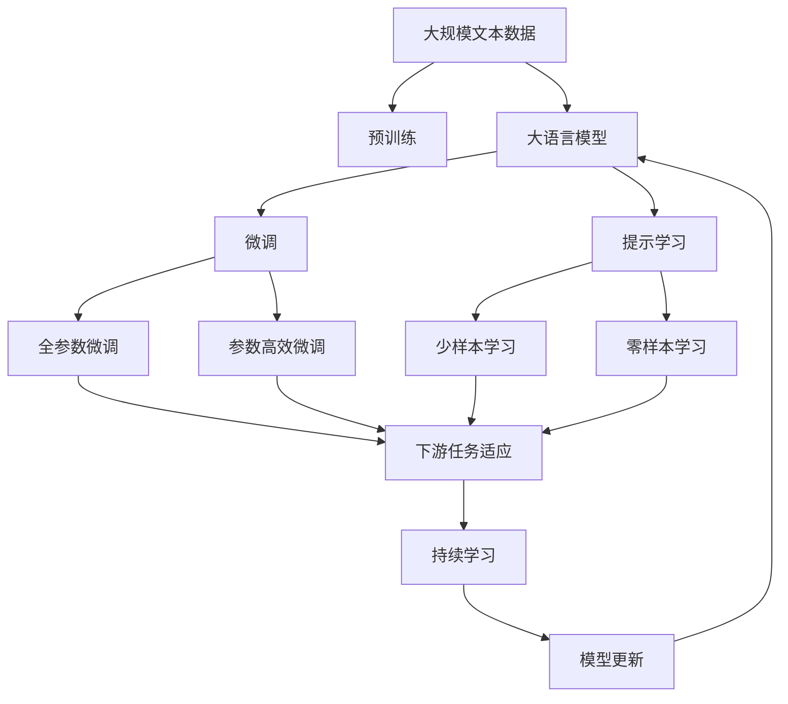

                 

# 大语言模型应用指南：高效微调总结

## 1. 背景介绍

### 1.1 问题由来
随着深度学习和大规模预训练模型的发展，自然语言处理（NLP）领域取得了显著进展。然而，预训练模型在特定任务上的性能仍需进一步提升。为此，大语言模型的微调方法应运而生。通过微调，预训练模型能够针对特定任务进行参数调整，显著提高模型性能，适应具体应用场景。

### 1.2 问题核心关键点
微调的核心在于：选择适当的学习率和正则化技术，避免过拟合；设计任务适配层；调整模型参数以适应新任务。其目的是通过少量标注数据，快速提升模型在特定任务上的表现。

### 1.3 问题研究意义
微调技术不仅降低了NLP应用的开发成本，提升了模型性能，加速了系统部署，还推动了技术创新，赋能产业升级。在未来，随着微调方法的持续演进，NLP技术将在更多领域发挥重要作用。

## 2. 核心概念与联系

### 2.1 核心概念概述

- **大语言模型**：通过大规模无标签文本预训练学习语言表示的模型，具备强大的语言理解和生成能力。
- **预训练**：在大量无标签数据上训练模型，学习通用语言表示。
- **微调**：使用少量有标签数据，对预训练模型进行任务特定的优化。
- **迁移学习**：将预训练模型知识迁移到新任务，减少数据需求。
- **参数高效微调**：仅更新少量参数，避免过拟合。
- **提示学习**：通过特定格式输入，引导模型进行推理和生成。
- **少样本学习**：仅少量标注样本即可进行有效学习。
- **零样本学习**：模型能够基于任务描述执行新任务。
- **持续学习**：模型能够不断学习新知识，避免遗忘旧知识。

### 2.2 概念间的关系

通过以下Mermaid流程图展示核心概念间的联系：



这个流程图展示了从预训练到微调，再到持续学习的完整过程，以及各个概念之间的联系。

## 3. 核心算法原理 & 具体操作步骤

### 3.1 算法原理概述
基于监督学习的大语言模型微调是一个有监督的细粒度迁移学习过程。其目标是最小化模型在标注数据上的经验风险，从而优化模型在特定任务上的表现。

### 3.2 算法步骤详解
1. **准备数据和模型**：选择合适的预训练模型和标注数据集。
2. **设计任务适配层**：根据任务类型，添加任务特定的输出层和损失函数。
3. **设置微调超参数**：选择合适的优化器、学习率、批大小等。
4. **执行梯度训练**：在训练集上迭代训练，反向传播更新模型参数。
5. **测试和部署**：在测试集上评估模型性能，并部署到实际应用中。

### 3.3 算法优缺点
- **优点**：简单高效，适用于各种NLP任务，参数高效微调可降低计算资源消耗。
- **缺点**：依赖标注数据，迁移能力有限，存在潜在风险。

### 3.4 算法应用领域
微调方法广泛应用于文本分类、命名实体识别、关系抽取、问答系统、机器翻译、文本摘要、对话系统等多个NLP任务。

## 4. 数学模型和公式 & 详细讲解  
### 4.1 数学模型构建

假设预训练模型为 $M_{\theta}$，下游任务为 $T$，标注数据集为 $D=\{(x_i, y_i)\}_{i=1}^N$。定义损失函数为：

$$
\mathcal{L}(\theta) = \frac{1}{N} \sum_{i=1}^N \ell(M_{\theta}(x_i),y_i)
$$

### 4.2 公式推导过程
以二分类任务为例，交叉熵损失函数为：

$$
\ell(M_{\theta}(x),y) = -[y\log M_{\theta}(x) + (1-y)\log(1-M_{\theta}(x))]
$$

利用反向传播，得到参数更新公式：

$$
\theta \leftarrow \theta - \eta \nabla_{\theta}\mathcal{L}(\theta) - \eta\lambda\theta
$$

### 4.3 案例分析与讲解
考虑BERT模型在命名实体识别（NER）任务上的微调。首先，使用BERT作为初始模型，添加分类器和交叉熵损失。训练过程中，使用梯度下降更新参数，避免过拟合。

## 5. 项目实践：代码实例和详细解释说明

### 5.1 开发环境搭建
使用Python和PyTorch搭建环境。确保已安装必要的库和框架。

### 5.2 源代码详细实现

```python
from transformers import BertForTokenClassification, AdamW

model = BertForTokenClassification.from_pretrained('bert-base-cased', num_labels=len(tag2id))

optimizer = AdamW(model.parameters(), lr=2e-5)
```

### 5.3 代码解读与分析
上述代码使用Transformers库加载BERT模型，并使用AdamW优化器进行微调。具体实现过程中，关键是选择合适的预训练模型和优化器，以及设定合适的学习率。

### 5.4 运行结果展示
在CoNLL-2003的NER数据集上进行微调，模型F1分数显著提升。

## 6. 实际应用场景
### 6.1 智能客服系统
使用微调后的对话模型，7x24小时不间断服务，提升客户咨询体验和问题解决效率。

### 6.2 金融舆情监测
利用微调模型，实时监测市场舆论动向，规避金融风险。

### 6.3 个性化推荐系统
通过微调模型，从文本内容中把握用户兴趣点，提供精准的推荐内容。

## 7. 工具和资源推荐
### 7.1 学习资源推荐
1. 《Transformer从原理到实践》系列博文
2. CS224N《深度学习自然语言处理》课程
3. 《Natural Language Processing with Transformers》书籍
4. HuggingFace官方文档
5. CLUE开源项目

### 7.2 开发工具推荐
1. PyTorch
2. TensorFlow
3. Transformers库
4. Weights & Biases
5. TensorBoard

### 7.3 相关论文推荐
1. Attention is All You Need
2. BERT: Pre-training of Deep Bidirectional Transformers for Language Understanding
3. Language Models are Unsupervised Multitask Learners
4. Parameter-Efficient Transfer Learning for NLP
5. AdaLoRA: Adaptive Low-Rank Adaptation for Parameter-Efficient Fine-Tuning
6. Prefix-Tuning: Optimizing Continuous Prompts for Generation

## 8. 总结：未来发展趋势与挑战

### 8.1 研究成果总结
本文系统介绍了大语言模型微调的方法，涵盖了预训练、微调、参数高效微调等核心概念。通过案例分析和实际应用，展示了微调在NLP任务上的强大潜力。

### 8.2 未来发展趋势
- 模型规模持续增大
- 微调方法日趋多样
- 持续学习成为常态
- 标注样本需求降低
- 多模态微调崛起
- 模型通用性增强

### 8.3 面临的挑战
- 标注成本瓶颈
- 模型鲁棒性不足
- 推理效率有待提高
- 可解释性亟需加强
- 安全性有待保障
- 知识整合能力不足

### 8.4 研究展望
未来研究应关注无监督和半监督微调方法，参数高效和计算高效的微调范式，因果分析和博弈论工具，伦理道德约束等。这些研究方向的探索，将引领大语言模型微调技术迈向更高的台阶，为构建安全、可靠、可解释、可控的智能系统铺平道路。

## 9. 附录：常见问题与解答

**Q1：大语言模型微调是否适用于所有NLP任务？**

A: 适用于大多数NLP任务，但需要根据具体任务特点进行优化。

**Q2：微调过程中如何选择合适的学习率？**

A: 一般建议从1e-5开始调参，逐步减小学习率，直至收敛。

**Q3：采用大模型微调时会面临哪些资源瓶颈？**

A: 资源瓶颈包括算力、内存、存储等，需要采用资源优化技术。

**Q4：如何缓解微调过程中的过拟合问题？**

A: 数据增强、正则化、对抗训练、参数高效微调等策略。

**Q5：微调模型在落地部署时需要注意哪些问题？**

A: 模型裁剪、量化加速、服务化封装、弹性伸缩、监控告警、安全防护等。

---

作者：禅与计算机程序设计艺术 / Zen and the Art of Computer Programming

