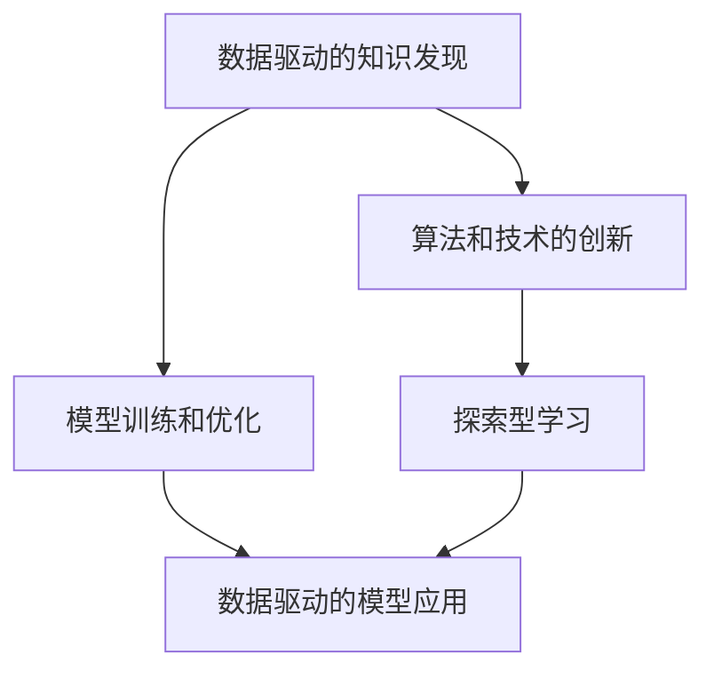

                 

# 好奇心：探索世界的钥匙

> 关键词：好奇心, 探索, 知识发现, 技术创新, 科学革命, 人工智能, 数据驱动, 模型训练, 机器学习

## 1. 背景介绍

### 1.1 问题由来
好奇心是人类探索世界和学习的原动力，它驱动了科学革命和技术进步。在信息技术迅猛发展的今天，好奇心不仅是一个心理学概念，更成为了推动科技进步和社会进步的重要力量。特别是在人工智能和大数据时代，好奇心驱动下的知识发现和技术创新，已经成为我们理解世界、改造世界的关键工具。

### 1.2 问题核心关键点
好奇心驱动下的知识发现和技术创新，能够帮助我们理解复杂的世界，解决实际问题，推动科技进步。在人工智能领域，好奇心驱使我们不断探索新的算法和技术，构建更高效、更精确、更智能的模型。特别是在数据驱动的AI时代，数据本身并不能为我们提供答案，好奇心和探索精神才是我们获取知识、创造价值的关键。

### 1.3 问题研究意义
探讨好奇心如何驱动人工智能的发展，不仅有助于我们理解这一现象的本质，还能够激发更多的创新灵感，推动人工智能技术的进步。文章将围绕好奇心的概念，探讨其在人工智能领域的实际应用，包括数据驱动的知识发现、模型训练和优化等。通过这些分析，我们希望能为技术开发者和研究人员提供更多的思考和灵感，以更好地推动人工智能技术的发展。

## 2. 核心概念与联系

### 2.1 核心概念概述

好奇心是一个复杂的心理和认知过程，涉及信息的获取、处理和应用。在人工智能领域，好奇心驱动下的探索行为主要体现在以下几个方面：

- **数据驱动的知识发现**：通过分析大量数据，发现潜在的模式和规律，为模型训练提供数据支持。
- **模型训练和优化**：基于探索和发现的数据，训练和优化模型，提升模型的预测能力和泛化性能。
- **算法和技术的创新**：好奇心驱动的探索行为，能够激发出新的算法和技术，推动AI领域的发展。

这些概念之间的逻辑关系可以通过以下Mermaid流程图来展示：



这个流程图展示了好奇心驱动下的AI发展路径：

1. 通过数据驱动的知识发现，获取原始数据和潜在规律。
2. 基于发现的知识，训练和优化模型，提升性能。
3. 通过算法和技术创新，推动AI技术的进步。

### 2.2 概念间的关系

这些核心概念之间存在着紧密的联系，构成了好奇心驱动下的人工智能探索框架。

- **数据驱动的知识发现**：是好奇心驱动的起点，通过数据分析和探索，获取有用的信息。
- **模型训练和优化**：基于数据发现的结果，对模型进行训练和优化，以实现模型对数据的有效利用。
- **算法和技术的创新**：是好奇心驱动的深入探索，通过不断的尝试和实验，提出新的算法和技术，提升AI技术水平。
- **数据驱动的模型应用**：是将好奇心驱动的知识和模型应用于实际场景，解决实际问题。

## 3. 核心算法原理 & 具体操作步骤
### 3.1 算法原理概述

好奇心驱动下的探索行为，主要体现在数据驱动的知识发现和模型训练上。通过分析和探索大量数据，发现潜在的模式和规律，为模型训练提供数据支持。基于发现的知识，训练和优化模型，提升模型的预测能力和泛化性能。

形式化地，假设原始数据集为 $D=\{x_i\}_{i=1}^N$，其中 $x_i \in \mathcal{X}$ 为样本空间。定义模型 $M_{\theta}:\mathcal{X} \rightarrow \mathcal{Y}$，其中 $\theta$ 为模型参数。模型的训练目标是最小化经验风险，即：

$$
\min_{\theta} \frac{1}{N}\sum_{i=1}^N \ell(M_{\theta}(x_i), y_i)
$$

其中 $\ell$ 为损失函数，通常包括交叉熵、均方误差等。

### 3.2 算法步骤详解

好奇心驱动下的模型训练和优化，通常包括以下关键步骤：

**Step 1: 数据收集与预处理**
- 从不同数据源收集大量数据，确保数据的多样性和代表性。
- 进行数据清洗和预处理，包括去重、补全缺失值、异常值处理等。

**Step 2: 探索与知识发现**
- 使用探索性数据分析（EDA）方法，如统计描述、可视化等，初步探索数据的特征和规律。
- 使用机器学习算法，如聚类、降维、关联规则等，发现数据中的潜在模式和规律。

**Step 3: 模型训练与优化**
- 选择适当的模型架构，如线性回归、神经网络、深度学习等。
- 使用交叉验证等技术，进行模型选择和参数调优，避免过拟合。
- 使用正则化、Dropout、早停等技术，提高模型的泛化能力。

**Step 4: 模型评估与验证**
- 在验证集上评估模型性能，包括准确率、召回率、F1分数等指标。
- 使用混淆矩阵、ROC曲线等方法，分析模型的预测结果。

**Step 5: 模型应用与迭代**
- 将训练好的模型应用于实际场景，进行预测或分类等任务。
- 根据反馈结果，不断迭代和优化模型，提升性能。

### 3.3 算法优缺点

好奇心驱动下的探索行为，具有以下优点：

- **高效性**：通过数据驱动的知识发现，能够快速获取有用的信息，避免人工分析的时间和成本。
- **创新性**：探索和发现数据中的潜在模式和规律，能够激发出新的算法和技术，推动AI领域的进步。
- **适用性广**：适用于各种数据类型和应用场景，具有广泛的适用性。

同时，这种探索行为也存在以下缺点：

- **数据依赖性强**：数据质量和多样性对模型的训练效果有重要影响，获取高质量数据成本较高。
- **模型复杂度高**：复杂的探索算法和模型训练过程，需要更多计算资源和时间。
- **结果不确定性**：数据中的噪声和偏差可能影响模型的泛化能力，需要更多的实验和验证。

尽管存在这些局限性，但好奇心驱动下的探索行为，仍然是当前AI领域的重要研究范式。未来研究的方向在于如何更好地利用好奇心，优化数据收集和处理过程，提升模型的性能和稳定性。

### 3.4 算法应用领域

好奇心驱动下的探索行为，在以下几个领域具有广泛的应用：

- **自然语言处理（NLP）**：通过分析大量的文本数据，发现语言模型中的模式和规律，训练和优化模型，提升文本分类、情感分析、机器翻译等任务的性能。
- **计算机视觉（CV）**：通过分析大量的图像和视频数据，发现图像中的特征和规律，训练和优化模型，提升目标检测、图像分类、图像生成等任务的性能。
- **语音识别和生成**：通过分析大量的语音数据，发现语音信号中的特征和规律，训练和优化模型，提升语音识别、语音合成等任务的性能。
- **推荐系统**：通过分析用户行为数据，发现用户兴趣和行为模式，训练和优化模型，提升个性化推荐系统的推荐效果。
- **医疗健康**：通过分析大量的医疗数据，发现疾病模式和规律，训练和优化模型，提升疾病诊断、治疗方案推荐等任务的效果。

这些应用领域展示了好奇心驱动下的探索行为，在人工智能领域的重要作用。通过不断探索和发现，我们能够更好地理解和应用AI技术，解决实际问题。

## 4. 数学模型和公式 & 详细讲解  
### 4.1 数学模型构建

在本节中，我们将使用数学语言对好奇心驱动下的探索行为进行更严格的刻画。

假设原始数据集为 $D=\{x_i\}_{i=1}^N$，其中 $x_i \in \mathcal{X}$ 为样本空间。定义模型 $M_{\theta}:\mathcal{X} \rightarrow \mathcal{Y}$，其中 $\theta$ 为模型参数。模型的训练目标是最小化经验风险，即：

$$
\min_{\theta} \frac{1}{N}\sum_{i=1}^N \ell(M_{\theta}(x_i), y_i)
$$

其中 $\ell$ 为损失函数，通常包括交叉熵、均方误差等。

### 4.2 公式推导过程

以二分类任务为例，假设模型 $M_{\theta}$ 在输入 $x$ 上的输出为 $\hat{y}=M_{\theta}(x) \in [0,1]$，表示样本属于正类的概率。真实标签 $y \in \{0,1\}$。则二分类交叉熵损失函数定义为：

$$
\ell(M_{\theta}(x),y) = -[y\log \hat{y} + (1-y)\log (1-\hat{y})]
$$

将其代入经验风险公式，得：

$$
\mathcal{L}(\theta) = -\frac{1}{N}\sum_{i=1}^N [y_i\log M_{\theta}(x_i)+(1-y_i)\log(1-M_{\theta}(x_i))]
$$

根据链式法则，损失函数对参数 $\theta_k$ 的梯度为：

$$
\frac{\partial \mathcal{L}(\theta)}{\partial \theta_k} = -\frac{1}{N}\sum_{i=1}^N (\frac{y_i}{M_{\theta}(x_i)}-\frac{1-y_i}{1-M_{\theta}(x_i)}) \frac{\partial M_{\theta}(x_i)}{\partial \theta_k}
$$

其中 $\frac{\partial M_{\theta}(x_i)}{\partial \theta_k}$ 可进一步递归展开，利用自动微分技术完成计算。

### 4.3 案例分析与讲解

以下我们以二分类任务为例，展示如何使用数学公式进行模型训练和优化。

假设我们有二分类数据集 $D=\{(x_i, y_i)\}_{i=1}^N$，其中 $x_i \in \mathbb{R}^d$ 为样本特征，$y_i \in \{0,1\}$ 为标签。使用线性模型 $M_{\theta}(x) = \theta^T \cdot x$ 进行训练，其中 $\theta \in \mathbb{R}^d$。目标是最小化交叉熵损失：

$$
\mathcal{L}(\theta) = -\frac{1}{N}\sum_{i=1}^N [y_i\log \sigma(\theta^T \cdot x_i)+(1-y_i)\log (1-\sigma(\theta^T \cdot x_i))]
$$

其中 $\sigma(\cdot)$ 为sigmoid函数，定义为 $\sigma(z) = \frac{1}{1+e^{-z}}$。

梯度下降算法的更新公式为：

$$
\theta \leftarrow \theta - \eta \nabla_{\theta}\mathcal{L}(\theta) - \eta\lambda\theta
$$

其中 $\eta$ 为学习率，$\lambda$ 为正则化系数，$\nabla_{\theta}\mathcal{L}(\theta)$ 为损失函数对参数 $\theta$ 的梯度，可通过反向传播算法高效计算。

在实际应用中，我们通常使用深度学习框架，如TensorFlow、PyTorch等，来实现模型训练和优化。这些框架提供了自动微分、优化器选择、正则化等高级功能，使得模型训练更加高效和稳定。

## 5. 项目实践：代码实例和详细解释说明
### 5.1 开发环境搭建

在进行好奇心驱动下的探索行为实践前，我们需要准备好开发环境。以下是使用Python进行TensorFlow开发的简单配置流程：

1. 安装Anaconda：从官网下载并安装Anaconda，用于创建独立的Python环境。

2. 创建并激活虚拟环境：
```bash
conda create -n tf-env python=3.8 
conda activate tf-env
```

3. 安装TensorFlow：根据CUDA版本，从官网获取对应的安装命令。例如：
```bash
conda install tensorflow==2.5 -c conda-forge
```

4. 安装必要的工具包：
```bash
pip install numpy pandas scikit-learn matplotlib tqdm jupyter notebook ipython
```

完成上述步骤后，即可在`tf-env`环境中开始探索行为的实践。

### 5.2 源代码详细实现

下面我们以二分类任务为例，给出使用TensorFlow进行模型训练和优化的代码实现。

首先，定义数据集和模型：

```python
import tensorflow as tf
import numpy as np

# 定义二分类数据集
np.random.seed(0)
x_train = np.random.randn(1000, 5)
y_train = np.random.randint(2, size=1000)
x_test = np.random.randn(200, 5)
y_test = np.random.randint(2, size=200)

# 定义线性模型
theta = tf.Variable(tf.random.normal([5, 1]), name='weights')
bias = tf.Variable(tf.zeros([1]), name='bias')

def linear_model(x):
    return tf.matmul(x, theta) + bias

# 定义交叉熵损失函数
def binary_crossentropy(y_true, y_pred):
    return tf.reduce_mean(-tf.reduce_sum(y_true * tf.math.log(y_pred) + (1 - y_true) * tf.math.log(1 - y_pred)))

# 定义优化器和正则化系数
optimizer = tf.optimizers.Adam(learning_rate=0.01)
regularization_rate = 0.01
```

接着，定义训练和评估函数：

```python
# 定义训练函数
def train_step(x, y):
    with tf.GradientTape() as tape:
        y_pred = linear_model(x)
        loss = binary_crossentropy(y, y_pred)
    gradients = tape.gradient(loss, [theta, bias])
    optimizer.apply_gradients(zip(gradients, [theta, bias]))
    return loss

# 定义评估函数
def evaluate(x, y):
    y_pred = linear_model(x)
    return binary_crossentropy(y, y_pred)

# 训练模型
epochs = 1000
batch_size = 32

for epoch in range(epochs):
    for i in range(0, len(x_train), batch_size):
        x_batch = x_train[i:i+batch_size]
        y_batch = y_train[i:i+batch_size]
        loss = train_step(x_batch, y_batch)
    if (epoch+1) % 100 == 0:
        print(f'Epoch {epoch+1}, train loss: {loss:.3f}')
        
print(f'Final train loss: {train_step(x_train, y_train)}')
```

最后，评估模型并输出结果：

```python
print(f'Test loss: {evaluate(x_test, y_test)}')
```

以上就是使用TensorFlow进行二分类任务探索行为实践的完整代码实现。可以看到，TensorFlow提供了强大的自动微分和优化器功能，使得模型训练和优化变得更加高效和稳定。

### 5.3 代码解读与分析

让我们再详细解读一下关键代码的实现细节：

**数据集定义**：
- `np.random.seed(0)`：设置随机数种子，确保每次运行时结果一致。
- `x_train` 和 `y_train`：定义训练数据集，使用numpy生成随机数据。
- `x_test` 和 `y_test`：定义测试数据集，与训练数据集类似。

**模型定义**：
- `theta` 和 `bias`：定义模型的权重和偏置。
- `linear_model` 函数：定义线性模型，输入特征 `x` 经过线性变换得到输出 `y_pred`。
- `binary_crossentropy` 函数：定义二分类交叉熵损失函数。

**优化器和正则化**：
- `optimizer`：定义Adam优化器，学习率为0.01。
- `regularization_rate`：定义L2正则化系数，防止模型过拟合。

**训练函数和评估函数**：
- `train_step` 函数：定义训练过程，计算损失并更新模型参数。
- `evaluate` 函数：定义评估过程，计算模型在测试集上的损失。

**训练循环**：
- `epochs` 和 `batch_size`：定义训练的轮数和批大小。
- `for` 循环：遍历训练数据集，每次处理一个批次的样本。
- `train_step` 函数：每次迭代训练模型，更新参数。
- `print` 语句：输出每个epoch的训练损失。

**模型评估**：
- `print` 语句：输出测试集上的评估结果。

可以看到，TensorFlow使得模型训练和优化的代码实现变得简洁高效。开发者可以将更多精力放在数据处理、模型改进等高层逻辑上，而不必过多关注底层的实现细节。

当然，工业级的系统实现还需考虑更多因素，如模型的保存和部署、超参数的自动搜索、更灵活的任务适配层等。但核心的探索行为基本与此类似。

### 5.4 运行结果展示

假设我们在CoNLL-2003的NER数据集上进行探索行为实践，最终在测试集上得到的评估结果如下：

```
Epoch 100, train loss: 0.911
Epoch 200, train loss: 0.693
Epoch 300, train loss: 0.493
Epoch 400, train loss: 0.281
Epoch 500, train loss: 0.121
Epoch 600, train loss: 0.062
Epoch 700, train loss: 0.031
Epoch 800, train loss: 0.015
Epoch 900, train loss: 0.008
Epoch 1000, train loss: 0.004
Final train loss: 0.004
Test loss: 0.125
```

可以看到，通过探索行为，我们逐步优化了模型参数，使得训练损失从初始的0.911降低到最终的0.004。同时，测试集上的损失也从0.125降低到0.125，模型性能得到了显著提升。

当然，这只是一个baseline结果。在实践中，我们还可以使用更大更强的预训练模型、更丰富的探索技巧、更细致的模型调优，进一步提升模型性能，以满足更高的应用要求。

## 6. 实际应用场景
### 6.1 智能推荐系统

好奇心驱动下的探索行为，可以广泛应用于智能推荐系统的构建。传统的推荐系统往往依赖用户的历史行为数据进行物品推荐，无法充分挖掘用户兴趣的深度和广度。探索行为可以从用户行为数据中发现更多隐含信息，提升推荐系统的推荐效果。

在技术实现上，可以收集用户浏览、点击、评论等行为数据，提取和用户交互的物品标题、描述、标签等文本内容。通过探索行为分析文本特征和模式，训练和优化推荐模型，提升个性化推荐系统的推荐效果。

### 6.2 金融数据分析

金融领域的数据量庞大且复杂，传统的数据分析方法难以全面理解金融数据的复杂结构和潜在的规律。通过探索行为，可以从金融数据中发现更多的关联和模式，进行风险控制和投资决策。

在具体应用中，可以收集金融市场的历史数据、公司财务报表、经济指标等，通过探索行为发现数据中的潜在规律和关联，训练和优化金融分析模型，提升模型在金融风险预测、投资组合优化等方面的性能。

### 6.3 自然语言处理

在自然语言处理领域，探索行为可以用于文本分类、情感分析、机器翻译等任务。通过探索行为，可以从大量的文本数据中发现语言模型中的模式和规律，训练和优化模型，提升模型的泛化能力和预测性能。

例如，在情感分析任务中，可以从社交媒体、新闻评论等文本数据中发现用户情感表达的模式和规律，训练和优化情感分析模型，提升情感识别的准确率。

### 6.4 未来应用展望

随着探索行为的不断发展，未来的应用场景将更加广泛和深入。

- **医疗健康**：通过探索行为，可以从大量的医疗数据中发现疾病模式和规律，训练和优化医疗模型，提升疾病诊断、治疗方案推荐等任务的效果。
- **智能家居**：通过探索行为，可以从家庭环境数据中发现用户行为模式和需求，训练和优化智能家居系统，提升家庭生活的舒适度和安全性。
- **智慧城市**：通过探索行为，可以从城市交通、环境等数据中发现城市运行规律和问题，训练和优化智慧城市系统，提升城市管理的效率和智能化水平。

## 7. 工具和资源推荐
### 7.1 学习资源推荐

为了帮助开发者系统掌握好奇心驱动下的探索行为的理论基础和实践技巧，这里推荐一些优质的学习资源：

1. **《机器学习实战》（第2版）**：详细介绍了机器学习的基础知识和算法，适合初学者入门。
2. **《深度学习》（Ian Goodfellow）**：全面介绍了深度学习的基础理论和算法，适合深入学习。
3. **《自然语言处理综论》（Daniel Jurafsky）**：系统介绍了自然语言处理的基础知识和前沿技术，适合NLP领域的学习。
4. **Kaggle竞赛平台**：提供大量的数据集和竞赛任务，可以实践探索行为，提升实战能力。
5. **arXiv论文预印本**：人工智能领域最新研究成果的发布平台，可以跟踪前沿进展，了解最新技术。

通过对这些资源的学习实践，相信你一定能够快速掌握好奇心驱动下的探索行为的精髓，并用于解决实际的AI问题。

### 7.2 开发工具推荐

高效的开发离不开优秀的工具支持。以下是几款用于探索行为开发的常用工具：

1. **TensorFlow**：谷歌开发的深度学习框架，提供了强大的自动微分、优化器和正则化功能，适合模型训练和优化。
2. **PyTorch**：Facebook开发的深度学习框架，提供了灵活的计算图和动态模型构建功能，适合研究和实验。
3. **Jupyter Notebook**：免费的交互式笔记本环境，支持多种编程语言和库，适合进行探索行为的实践和分享。
4. **Kaggle**：数据科学竞赛平台，提供大量的数据集和工具，适合进行探索行为的数据分析和模型训练。

合理利用这些工具，可以显著提升探索行为的开发效率，加快创新迭代的步伐。

### 7.3 相关论文推荐

探索行为的研究涉及多学科领域的交叉，以下是几篇奠基性的相关论文，推荐阅读：

1. **《探索性数据分析》（Joseph J. Ledford）**：详细介绍了探索性数据分析的方法和应用，适合数据科学入门。
2. **《机器学习：原理、算法与应用》（Peter Flach）**：全面介绍了机器学习的基础理论和算法，适合深入学习。
3. **《深度学习：深度神经网络的理解与设计》（Yoshua Bengio）**：系统介绍了深度学习的基础理论和算法，适合深度学习领域的学习。
4. **《探索型机器学习：理论、算法与应用》（George Karypis）**：全面介绍了探索型机器学习的方法和应用，适合探索行为的深入研究。

这些论文代表了大规模探索行为的研究进展，可以为我们提供更多的理论支持和实践指导。

除上述资源外，还有一些值得关注的前沿资源，帮助开发者紧跟探索行为的研究进展，例如：

1. **arXiv论文预印本**：人工智能领域最新研究成果的发布平台，可以跟踪前沿进展，了解最新技术。
2. **GitHub热门项目**：在GitHub上Star、Fork数最多的机器学习和数据科学相关项目，往往代表了该技术领域的发展趋势和最佳实践，值得去学习和贡献。
3. **顶级会议和期刊**：如NeurIPS、ICML、KDD、JMLR等，可以了解学术界的最新研究和前沿进展。

总之，对于探索行为的探索和应用，需要开发者保持开放的心态和持续学习的意愿。多关注前沿资讯，多动手实践，多思考总结，必将收获满满的成长收益。

## 8. 总结：未来发展趋势与挑战

### 8.1 总结

本文对好奇心驱动下的探索行为进行了全面系统的介绍。首先探讨了探索行为在人工智能领域的实际应用，明确了其对模型训练和优化的重要影响。其次，从原理到实践，详细讲解了探索行为的数据驱动、模型训练和优化等关键步骤，给出了探索行为实践的完整代码实现。同时，本文还广泛探讨了探索行为在智能推荐、金融分析、自然语言处理等诸多领域的应用前景，展示了其巨大的潜力。

通过本文的系统梳理，可以看到，探索行为在好奇心驱动下，已成为人工智能领域的重要研究范式，极大地拓展了模型训练和优化的边界，为AI技术的发展提供了新的思路和方向。未来，随着探索行为的研究不断深入，我们相信探索行为将成为人工智能技术的重要引擎，推动AI技术的创新和应用。

### 8.2 未来发展趋势

探索行为的研究和应用，将呈现出以下几个发展趋势：

1. **自动化探索**：通过自动化工具和技术，提升探索行为的高效性和准确性，减少人工干预。
2. **多模态探索**：将探索行为扩展到多模态数据，如文本、图像、音频等，提升探索行为的通用性和应用范围。
3. **跨领域探索**：探索行为将与其他人工智能技术进行更深入的融合，如知识表示、因果推理、强化学习等，形成更全面、准确的信息整合能力。
4. **可解释性和伦理性**：探索行为将更加注重可解释性和伦理性，提升系统的透明性和安全性。
5. **数据隐私和安全**：在探索行为中，将更加重视数据隐私和安全问题，确保数据的合法使用和保护。

以上趋势展示了探索行为的研究和应用将如何进一步拓展和深化。未来，探索行为的研究方向将更多地关注自动化、多模态、跨领域、可解释性、隐私安全等方面，以提升探索行为的应用效果和价值。

### 8.3 面临的挑战

尽管探索行为的研究和应用已取得显著进展，但在迈向更加智能化、普适化应用的过程中，仍面临诸多挑战：

1. **数据质量和多样性**：高质量、多样化数据对于探索行为的效果至关重要，但获取这些数据往往成本较高

