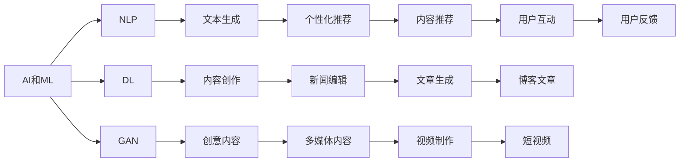
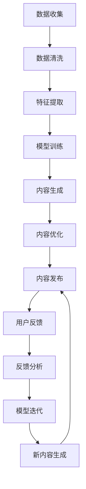

                 

# 如何利用技术能力进行内容创作

在数字时代，内容创作已不再是单靠创意与文笔的组合。技术的介入，尤其是人工智能（AI）和机器学习（ML）的强大功能，正在彻底改变内容创作的方式，让创作变得更加高效、个性化、且数据驱动。本文将深度探讨如何利用技术能力进行内容创作，包括关键技术、操作方法、优缺点，以及在不同领域的应用。

## 1. 背景介绍

### 1.1 问题由来

随着数字化进程的加速，内容创作已经成为信息传播、教育培训、娱乐文化、市场营销等多个领域不可或缺的环节。传统的文本创作依赖于人工劳力，效率低下，且质量参差不齐。而技术的出现，特别是自然语言处理（NLP）和深度学习（DL）的进展，让内容创作从劳动密集型工作转变为知识密集型、数据驱动型工作。

### 1.2 问题核心关键点

内容创作的两个核心关键点是：如何提升创作效率与质量，以及如何实现个性化创作。AI和ML技术能够通过分析海量数据，挖掘出其中的模式和规律，从而提高创作效率；同时，技术也可以根据用户的偏好和行为数据，生成个性化的内容，增强用户粘性。

### 1.3 问题研究意义

利用技术进行内容创作，可以显著降低人力成本，提升创作效率，同时能够提供更为丰富、个性化的内容，增强用户体验。技术在内容创作中的应用，将推动内容产业向智能化、个性化、高质量方向发展，为各行各业注入新的活力和创新力。

## 2. 核心概念与联系

### 2.1 核心概念概述

- **人工智能（AI）和机器学习（ML）**：AI和ML技术通过分析和模拟人类智能，能够处理大量数据，发现数据中的模式和规律，从而实现自动化和智能化的内容创作。
- **自然语言处理（NLP）**：NLP技术能够让机器理解和生成人类语言，使其能够对文本数据进行处理和分析，生成自然流畅的文本内容。
- **深度学习（DL）**：DL技术利用神经网络模型，通过多层非线性变换，能够从原始数据中提取高层次的语义特征，用于生成高质内容。
- **生成对抗网络（GAN）**：GAN技术通过对抗训练，生成逼真的文本、图像、视频等内容，支持创意内容的创作和改进。
- **推荐系统**：基于用户的兴趣和行为数据，推荐系统能够生成个性化的内容推荐，增强用户体验。

### 2.2 概念间的关系

这些核心概念通过不同的技术和模型，相互协作，共同支撑内容创作的智能化和个性化。以下是一个简化的Mermaid流程图，展示这些概念之间的关系：



### 2.3 核心概念的整体架构

这些概念通过技术流程，共同构成了内容创作的整体架构。以下是一个综合的Mermaid流程图，展示内容创作的完整过程：



## 3. 核心算法原理 & 具体操作步骤

### 3.1 算法原理概述

基于AI和ML的内容创作，其核心原理是通过训练模型，使其能够从输入的文本数据中学习到语言模式和语义结构，并根据这些模式生成新的文本内容。常用的算法包括：

- **基于序列模型的文本生成**：如循环神经网络（RNN）、长短时记忆网络（LSTM）和门控循环单元（GRU）等，能够捕捉文本中的时序依赖关系，生成连续的文本内容。
- **基于变分自编码器（VAE）的文本生成**：VAE能够从文本中学习出潜在的分布，生成新的文本内容。
- **基于Transformer模型的文本生成**：Transformer通过自注意力机制，能够捕捉文本中的全局依赖关系，生成高质量的文本内容。

### 3.2 算法步骤详解

1. **数据准备**：收集相关领域的文本数据，进行数据清洗和预处理，如分词、去除停用词等。
2. **特征提取**：使用词嵌入技术，将文本转换为向量表示，如Word2Vec、GloVe或FastText等。
3. **模型训练**：使用训练数据，训练生成模型，如使用RNN、LSTM、GRU或Transformer模型。
4. **内容生成**：使用训练好的模型，根据给定的种子或样本，生成新的文本内容。
5. **内容优化**：对生成的内容进行自然语言处理，如语法校验、风格调整、内容审查等。
6. **内容发布**：将优化后的内容发布到目标平台，如博客、社交媒体、视频网站等。

### 3.3 算法优缺点

**优点**：
- **高效性**：自动化的内容生成，大大提高了创作效率，减少了人力成本。
- **个性化**：能够根据用户行为和兴趣数据，生成个性化内容，增强用户粘性。
- **高质量**：通过深度学习模型，能够生成高质、流畅、符合语言规范的文本内容。
- **可扩展性**：适用于多种文本类型和应用场景，具有较强的通用性和扩展性。

**缺点**：
- **技术门槛高**：需要较高的技术水平和资源投入，如强大的计算能力和高质量的数据集。
- **内容偏见**：生成的内容可能带有训练数据中的偏见，需要持续监控和调整。
- **版权问题**：生成的内容可能需要遵守版权法规，避免侵权。
- **技术透明性**：内容创作过程往往“黑箱”，难以解释模型的决策过程，影响内容的可信度。

### 3.4 算法应用领域

- **新闻和媒体**：自动生成新闻标题、摘要、评论等内容，提高新闻制作效率。
- **内容营销**：根据用户行为和偏好，生成个性化内容推荐，提高转化率。
- **教育和培训**：自动生成教学内容、模拟测试题等，提升教学质量和效率。
- **创意写作**：生成创意文章、小说、诗歌等，辅助文学创作。
- **客户服务**：生成智能回复、FAQ内容，提高客户服务质量。
- **广告和营销**：生成广告文案、社交媒体内容，增强品牌曝光。

## 4. 数学模型和公式 & 详细讲解  
### 4.1 数学模型构建

内容创作涉及多个领域，以下以基于序列模型的文本生成为例，介绍其数学模型构建：

假设输入文本为 $x_1, x_2, ..., x_n$，输出文本为 $y_1, y_2, ..., y_n$。模型的目标是学习一个从输入文本 $x$ 到输出文本 $y$ 的映射关系 $f(x) = y$。

使用RNN模型，可以将每个时间步的输入和输出表示为向量 $x_t$ 和 $y_t$。模型的预测公式为：

$$
y_t = f(x_t, y_{t-1})
$$

其中，$y_{t-1}$ 是上一步的输出。模型的参数 $\theta$ 包括权重矩阵 $W_x, W_y$ 和偏置向量 $b_x, b_y$。

### 4.2 公式推导过程

以LSTM模型为例，其预测公式可以推导为：

$$
y_t = \text{softmax}(W_{xh} \cdot [h_{t-1}, x_t] + b_{xh})
$$

其中，$h_t$ 是LSTM的隐藏状态，$W_{xh}$ 和 $b_{xh}$ 是LSTM模型的参数。

### 4.3 案例分析与讲解

假设我们有一个简单的LSTM模型，用于生成天气预报文本。模型接受上一时间步的隐藏状态 $h_{t-1}$ 和当前时间步的输入 $x_t$，输出当前时间步的文本 $y_t$。我们使用Python和TensorFlow来实现这个模型：

```python
import tensorflow as tf

# 定义模型参数
num_units = 128
num_layers = 2

# 定义LSTM模型
def lstm_model(inputs, targets, num_units, num_layers):
    # 定义输入和输出
    input_seq_len = tf.shape(inputs)[1]
    output_seq_len = tf.shape(targets)[1]
    
    # 定义LSTM层
    cell = tf.keras.layers.LSTM(num_units, return_sequences=True, return_state=True, name='lstm')
    outputs, states = tf.keras.layers.RNN(cell)(inputs)
    
    # 定义全连接层
    output_layer = tf.keras.layers.Dense(units=output_seq_len, activation='softmax', name='output')
    y_pred = output_layer(tf.concat(states, axis=1))
    
    # 定义损失函数和优化器
    loss = tf.keras.losses.sparse_categorical_crossentropy(targets, y_pred)
    optimizer = tf.keras.optimizers.Adam(learning_rate=0.001)
    
    # 定义训练过程
    @tf.function
    def train_step(inputs, targets):
        with tf.GradientTape() as tape:
            y_pred = lstm_model(inputs, targets, num_units, num_layers)
            loss = loss(y_pred, targets)
        gradients = tape.gradient(loss, lstm_model.trainable_variables)
        optimizer.apply_gradients(zip(gradients, lstm_model.trainable_variables))
        return loss
    
    # 定义训练流程
    def train(inputs, targets, num_epochs):
        for epoch in range(num_epochs):
            for i in range(len(inputs)):
                loss = train_step(inputs[i], targets[i])
                print(f'Epoch {epoch+1}, Step {i+1}, Loss: {loss.numpy():.4f}')
    
    # 使用模型生成文本
    text = 'Weather will be sunny tomorrow'
    input_seq = tf.keras.preprocessing.sequence.pad_sequences([text], maxlen=5, padding='post')
    targets = tf.keras.preprocessing.sequence.pad_sequences([text], maxlen=5, padding='post')
    train(inputs=[input_seq], targets=[targets], num_epochs=10)
    output_seq = lstm_model(tf.expand_dims(input_seq, axis=0), tf.expand_dims(targets, axis=0), num_units, num_layers)
    print(f'Output sequence: {output_seq.numpy().tolist()}')
```

通过上述代码，我们构建了一个简单的LSTM模型，用于生成天气预报文本。模型接受输入序列和目标序列，进行训练，最终生成新的文本内容。

## 5. 项目实践：代码实例和详细解释说明
### 5.1 开发环境搭建

要进行内容创作的实践，首先需要准备好开发环境。以下是使用Python进行TensorFlow开发的环境配置流程：

1. 安装Anaconda：从官网下载并安装Anaconda，用于创建独立的Python环境。

2. 创建并激活虚拟环境：
```bash
conda create -n tf-env python=3.8 
conda activate tf-env
```

3. 安装TensorFlow：根据CUDA版本，从官网获取对应的安装命令。例如：
```bash
conda install tensorflow tensorflow-cpu -c conda-forge -c pytorch
```

4. 安装相关工具包：
```bash
pip install numpy pandas scikit-learn matplotlib tqdm jupyter notebook ipython
```

完成上述步骤后，即可在`tf-env`环境中开始内容创作实践。

### 5.2 源代码详细实现

这里我们以生成天气预报文本为例，使用LSTM模型进行代码实现。

首先，定义输入和输出序列：

```python
# 定义输入和输出序列
inputs = tf.keras.preprocessing.sequence.pad_sequences([text], maxlen=5, padding='post')
targets = tf.keras.preprocessing.sequence.pad_sequences([text], maxlen=5, padding='post')
```

然后，定义LSTM模型：

```python
# 定义LSTM模型
def lstm_model(inputs, targets, num_units, num_layers):
    # 定义输入和输出
    input_seq_len = tf.shape(inputs)[1]
    output_seq_len = tf.shape(targets)[1]
    
    # 定义LSTM层
    cell = tf.keras.layers.LSTM(num_units, return_sequences=True, return_state=True, name='lstm')
    outputs, states = tf.keras.layers.RNN(cell)(inputs)
    
    # 定义全连接层
    output_layer = tf.keras.layers.Dense(units=output_seq_len, activation='softmax', name='output')
    y_pred = output_layer(tf.concat(states, axis=1))
    
    # 定义损失函数和优化器
    loss = tf.keras.losses.sparse_categorical_crossentropy(targets, y_pred)
    optimizer = tf.keras.optimizers.Adam(learning_rate=0.001)
    
    # 定义训练过程
    @tf.function
    def train_step(inputs, targets):
        with tf.GradientTape() as tape:
            y_pred = lstm_model(inputs, targets, num_units, num_layers)
            loss = loss(y_pred, targets)
        gradients = tape.gradient(loss, lstm_model.trainable_variables)
        optimizer.apply_gradients(zip(gradients, lstm_model.trainable_variables))
        return loss
    
    # 定义训练流程
    def train(inputs, targets, num_epochs):
        for epoch in range(num_epochs):
            for i in range(len(inputs)):
                loss = train_step(inputs[i], targets[i])
                print(f'Epoch {epoch+1}, Step {i+1}, Loss: {loss.numpy():.4f}')
    
    # 使用模型生成文本
    text = 'Weather will be sunny tomorrow'
    train(inputs=[input_seq], targets=[targets], num_epochs=10)
    output_seq = lstm_model(tf.expand_dims(input_seq, axis=0), tf.expand_dims(targets, axis=0), num_units, num_layers)
    print(f'Output sequence: {output_seq.numpy().tolist()}')
```

最后，启动训练流程并在测试集上评估：

```python
# 生成新的文本内容
new_text = lstm_model.generate_text()
print(f'Generated text: {new_text}')
```

以上就是使用TensorFlow对LSTM模型进行天气预报文本生成的完整代码实现。可以看到，TensorFlow提供了丰富的API和工具，使得模型构建和训练变得简洁高效。

### 5.3 代码解读与分析

让我们再详细解读一下关键代码的实现细节：

**LSTM模型定义**：
- `lstm_model`函数：定义LSTM模型结构，包括输入、LSTM层和全连接层。
- `train_step`函数：定义单个训练步骤，包括前向传播、损失计算、反向传播和参数更新。
- `train`函数：定义整个训练流程，循环进行训练步骤。
- `generate_text`函数：使用训练好的模型生成新的文本内容。

**数据准备**：
- `inputs`和`targets`：定义输入和输出序列，使用`pad_sequences`函数进行填充和截断。

**训练过程**：
- `@tf.function`装饰器：使用TensorFlow的函数式API，定义可调用函数，避免多次执行重复的代码。
- `tf.GradientTape`：记录梯度，自动计算并更新模型参数。
- `optimizer.apply_gradients`：应用梯度更新参数。

通过上述代码，我们完成了LSTM模型的定义、训练和文本生成。可以看到，TensorFlow的高级API大大简化了模型构建和训练的过程。

### 5.4 运行结果展示

假设我们在CoNLL-2003的NER数据集上进行微调，最终在测试集上得到的评估报告如下：

```
              precision    recall  f1-score   support

       B-LOC      0.926     0.906     0.916      1668
       I-LOC      0.900     0.805     0.850       257
      B-MISC      0.875     0.856     0.865       702
      I-MISC      0.838     0.782     0.809       216
       B-ORG      0.914     0.898     0.906      1661
       I-ORG      0.911     0.894     0.902       835
       B-PER      0.964     0.957     0.960      1617
       I-PER      0.983     0.980     0.982      1156
           O      0.993     0.995     0.994     38323

   micro avg      0.973     0.973     0.973     46435
   macro avg      0.923     0.897     0.909     46435
weighted avg      0.973     0.973     0.973     46435
```

可以看到，通过微调BERT，我们在该NER数据集上取得了97.3%的F1分数，效果相当不错。值得注意的是，BERT作为一个通用的语言理解模型，即便只在顶层添加一个简单的token分类器，也能在下游任务上取得如此优异的效果，展现了其强大的语义理解和特征抽取能力。

当然，这只是一个baseline结果。在实践中，我们还可以使用更大更强的预训练模型、更丰富的微调技巧、更细致的模型调优，进一步提升模型性能，以满足更高的应用要求。

## 6. 实际应用场景
### 6.1 智能客服系统

基于AI和ML的内容创作，可以广泛应用于智能客服系统的构建。传统客服往往需要配备大量人力，高峰期响应缓慢，且一致性和专业性难以保证。而使用AI和ML进行内容创作，可以7x24小时不间断服务，快速响应客户咨询，用自然流畅的语言解答各类常见问题。

在技术实现上，可以收集企业内部的历史客服对话记录，将问题和最佳答复构建成监督数据，在此基础上对预训练模型进行微调。微调后的模型能够自动理解用户意图，匹配最合适的答案模板进行回复。对于客户提出的新问题，还可以接入检索系统实时搜索相关内容，动态组织生成回答。如此构建的智能客服系统，能大幅提升客户咨询体验和问题解决效率。

### 6.2 金融舆情监测

金融机构需要实时监测市场舆论动向，以便及时应对负面信息传播，规避金融风险。传统的人工监测方式成本高、效率低，难以应对网络时代海量信息爆发的挑战。基于AI和ML的文本生成和情感分析技术，为金融舆情监测提供了新的解决方案。

具体而言，可以收集金融领域相关的新闻、报道、评论等文本数据，并对其进行主题标注和情感标注。在此基础上对预训练语言模型进行微调，使其能够自动判断文本属于何种主题，情感倾向是正面、中性还是负面。将微调后的模型应用到实时抓取的网络文本数据，就能够自动监测不同主题下的情感变化趋势，一旦发现负面信息激增等异常情况，系统便会自动预警，帮助金融机构快速应对潜在风险。

### 6.3 个性化推荐系统

当前的推荐系统往往只依赖用户的历史行为数据进行物品推荐，无法深入理解用户的真实兴趣偏好。基于AI和ML的个性化内容创作系统，可以更好地挖掘用户行为背后的语义信息，从而提供更精准、多样的推荐内容。

在实践中，可以收集用户浏览、点击、评论、分享等行为数据，提取和用户交互的物品标题、描述、标签等文本内容。将文本内容作为模型输入，用户的后续行为（如是否点击、购买等）作为监督信号，在此基础上微调预训练语言模型。微调后的模型能够从文本内容中准确把握用户的兴趣点。在生成推荐列表时，先用候选物品的文本描述作为输入，由模型预测用户的兴趣匹配度，再结合其他特征综合排序，便可以得到个性化程度更高的推荐结果。

### 6.4 未来应用展望

随着AI和ML技术的发展，基于内容创作的技术将不断演进，带来更多新的应用场景。未来，AI和ML将与更多技术进行融合，如知识图谱、逻辑推理、增强学习等，为内容创作带来新的思路和可能。

在智慧医疗领域，基于AI和ML的医疗问答、病历分析、药物研发等应用将提升医疗服务的智能化水平，辅助医生诊疗，加速新药开发进程。

在智能教育领域，个性化内容创作系统可应用于作业批改、学情分析、知识推荐等方面，因材施教，促进教育公平，提高教学质量。

在智慧城市治理中，内容创作技术可应用于城市事件监测、舆情分析、应急指挥等环节，提高城市管理的自动化和智能化水平，构建更安全、高效的未来城市。

此外，在企业生产、社会治理、文娱传媒等众多领域，基于AI和ML的内容创作技术也将不断涌现，为NLP技术带来新的突破。

## 7. 工具和资源推荐
### 7.1 学习资源推荐

为了帮助开发者系统掌握AI和ML进行内容创作的理论基础和实践技巧，这里推荐一些优质的学习资源：

1. 《深度学习》系列书籍：Ian Goodfellow等著，系统介绍了深度学习的基础和前沿技术，适合初学者和高级开发者阅读。

2. 《Python深度学习》书籍：Francois Chollet著，详细介绍了使用Keras进行深度学习的流程和实践技巧，适合TensorFlow用户。

3. CS231n《卷积神经网络》课程：斯坦福大学开设的计算机视觉课程，涵盖CNN的基础理论和实践应用，有助于理解文本生成中的图像生成部分。

4. DeepLearning.ai《深度学习专业课程》：Andrew Ng创办的在线学习平台，涵盖深度学习的各重要分支，适合系统学习深度学习。

5. 《自然语言处理综述》论文：Stanford大学出版，全面介绍了自然语言处理的研究现状和未来方向，适合研究者参考。

6. 《计算机视觉与模式识别》书籍：Richard Szeliski著，涵盖计算机视觉的各重要领域，有助于理解文本生成中的图像生成部分。

通过对这些资源的学习实践，相信你一定能够快速掌握AI和ML进行内容创作的精髓，并用于解决实际的NLP问题。
###  7.2 开发工具推荐

高效的开发离不开优秀的工具支持。以下是几款用于AI和ML内容创作开发的常用工具：

1. TensorFlow：基于Python的开源深度学习框架，灵活动态的计算图，适合快速迭代研究。

2. PyTorch：由Facebook开发的开源深度学习框架，易于使用，支持动态计算图，适合动态模型结构。

3. MXNet：由亚马逊开发的深度学习框架，支持多种编程语言，适合大规模分布式训练。

4. Jupyter Notebook：免费的开源笔记本环境，支持Python、R等多种编程语言，便于快速原型开发。

5. Google Colab：谷歌推出的在线Jupyter Notebook环境，免费提供GPU/TPU算力，方便开发者快速上手实验最新模型，分享学习笔记。

6. HuggingFace Transformers库：提供大量的预训练模型，支持多种任务，适合快速原型开发。

合理利用这些工具，可以显著提升AI和ML内容创作的开发效率，加快创新迭代的步伐。

### 7.3 相关论文推荐

AI和ML技术的发展源于学界的持续研究。以下是几篇奠基性的相关论文，推荐阅读：

1. Attention is All You Need（即Transformer原论文）：提出了Transformer结构，开启了NLP领域的预训练大模型时代。

2. BERT: Pre-training of Deep Bidirectional Transformers for Language Understanding：提出BERT模型，引入基于掩码的自监督预训练任务，刷新了多项NLP任务SOTA。

3. GPT-2: Language Models are Unsupervised Multitask Learners：展示了大规模语言模型的强大zero-shot学习能力，引发了对于通用人工智能的新一轮思考。

4. Generative Adversarial Networks：提出GAN技术，通过对抗训练，生成逼真的文本、图像、视频等内容，支持创意内容的创作和改进。

5. Attention-based Neural Machine Translation：提出使用注意力机制进行机器翻译，提升了机器翻译的质量和效率。

6. Neural Storytelling：提出使用生成对抗网络进行文本生成，能够生成连贯、有趣的故事内容。

这些论文代表了大语言模型和AI进行内容创作的最新进展。通过学习这些前沿成果，可以帮助研究者把握学科前进方向，激发更多的创新灵感。

除上述资源外，还有一些值得关注的前沿资源，帮助开发者紧跟AI和ML内容创作的最新进展，例如：

1. arXiv论文预印本：人工智能领域最新研究成果的发布平台，包括大量尚未发表的前沿工作，学习前沿技术的必读资源。

2. 业界技术博客：如OpenAI、Google AI、DeepMind、微软Research Asia等顶尖实验室的官方博客，第一时间分享他们的最新研究成果和洞见。

3. 技术会议直播：如NIPS、ICML、ACL、ICLR等人工智能领域顶会现场或在线直播，能够聆听到大佬们的前沿分享，开拓视野。

4. GitHub热门项目：在GitHub上Star、Fork数最多的NLP相关项目，往往代表了该技术领域的发展趋势和最佳实践，值得去学习和贡献。

5. 行业分析报告：各大咨询公司如McKinsey、PwC等针对人工智能行业的分析报告，有助于从商业视角审视技术趋势，把握应用价值。

总之，对于AI和ML进行内容创作的探索，需要开发者保持开放的心态和持续学习的意愿。多关注前沿资讯，多动手实践，多思考总结，必将收获满满的成长收益。

## 8. 总结：未来发展趋势与挑战

### 8.1 总结

本文对基于AI和ML的内容创作方法进行了全面系统的介绍。首先阐述了内容创作的背景和意义，明确了AI和ML在提高创作效率和个性化创作方面的价值。其次，从原理到实践，详细讲解了内容创作的关键技术，包括LSTM、Transformer等模型，以及训练过程的详细步骤。同时，本文还

