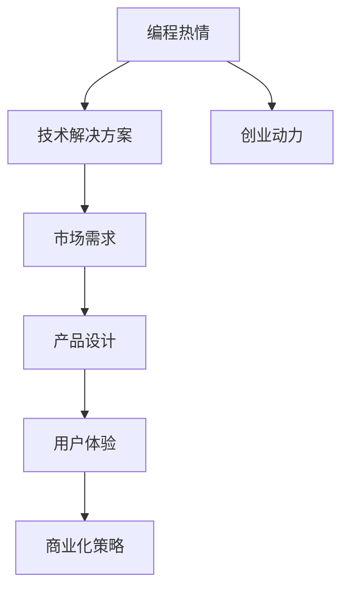
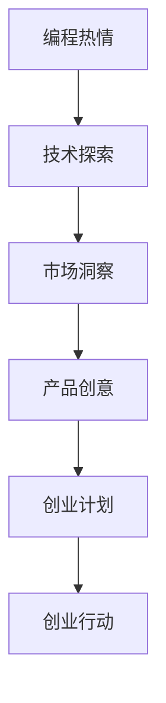
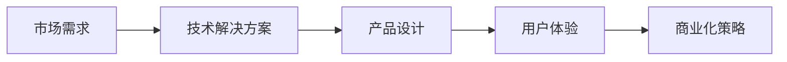
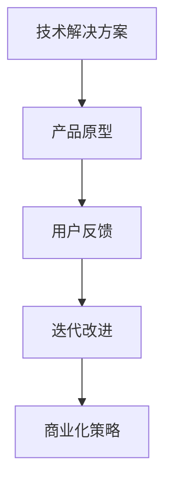
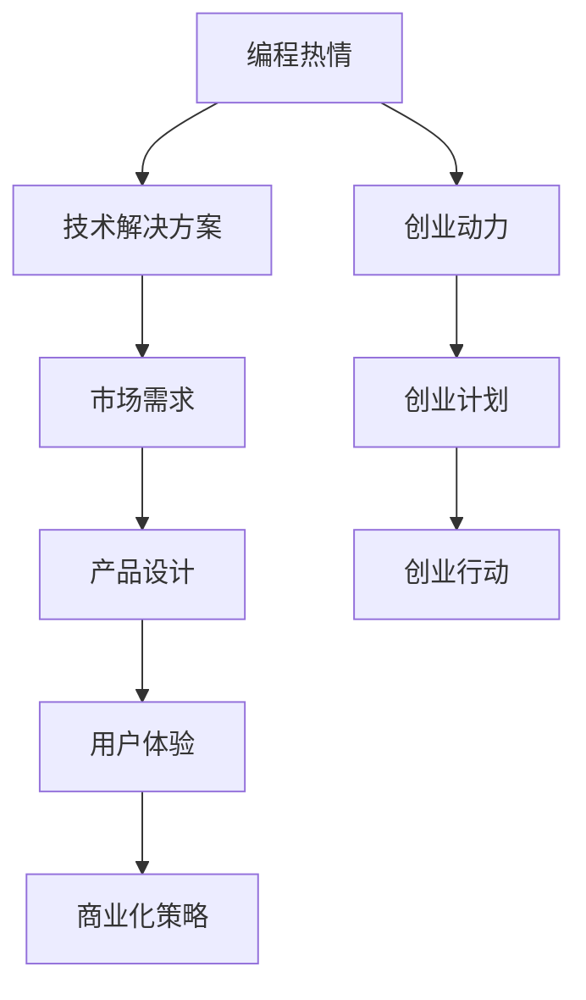

                 

## 1. 背景介绍

### 1.1 问题由来
在互联网快速发展的今天，编程已不再仅仅是一份职业，更成为了一种生活方式。越来越多的开发者不满足于为他人打工，希望凭借自己的编程技能和热情，开创一番事业。然而，如何将自己的编程热情转化为真正的创业动力，却是一个值得深入探讨的问题。

### 1.2 问题核心关键点
将编程热情转化为创业动力，关键在于如何将技术和创意结合起来，找到市场需求的痛点，并设计出具有竞争力的产品。这需要结合技术、市场和商业化的知识，进行综合思考和实践。

### 1.3 问题研究意义
研究如何将编程热情转化为创业动力，不仅对个人开发者有指导意义，也为科技公司和创业公司提供了一种新的思考路径，有助于推动科技创新和产业升级。

## 2. 核心概念与联系

### 2.1 核心概念概述

为更好地理解如何将编程热情转化为创业动力，本节将介绍几个密切相关的核心概念：

- 编程热情(Programming Enthusiasm)：指编程者在开发过程中，对解决技术难题、实现新功能、优化算法等活动的内在驱动力。
- 创业动力(Entrepreneurial Drive)：指创业者在创办企业过程中，对市场机会的敏锐洞察、对产品创新的持续追求和对商业成功的执着追求。
- 技术商业化(Technology Commercialization)：指将技术成果转化为具有市场竞争力的产品和服务的过程，通过商业模式创新实现商业价值最大化。
- 需求匹配(Demand Matching)：指将技术解决方案与市场需求进行精准匹配，确保产品能够解决实际问题，满足用户需求。
- 用户体验(User Experience)：指产品设计和技术实现对用户感官、认知和情感的影响，良好的用户体验能够提升产品的市场竞争力。

这些核心概念之间的逻辑关系可以通过以下Mermaid流程图来展示：



这个流程图展示了大语言模型微调过程中各个核心概念的关系：

1. 编程热情通过技术解决方案将创意实现。
2. 技术解决方案通过市场需求进行精准匹配。
3. 市场需求通过产品设计得到满足。
4. 产品设计通过用户体验提升竞争力。
5. 用户体验通过商业化策略实现商业价值。
6. 编程热情通过创业动力推动创业成功。

### 2.2 概念间的关系

这些核心概念之间存在着紧密的联系，形成了将编程热情转化为创业动力的完整生态系统。下面我们通过几个Mermaid流程图来展示这些概念之间的关系。

#### 2.2.1 编程热情到创业动力的转化



这个流程图展示了大语言模型微调过程中编程热情到创业动力的转化流程：

1. 编程热情驱动技术探索，获取新知。
2. 技术探索带来市场洞察，发现机会。
3. 市场洞察激发产品创意，构思产品。
4. 产品创意形成创业计划，制定路径。
5. 创业计划指导创业行动，付诸实践。

#### 2.2.2 技术与市场结合的流程图



这个流程图展示了技术解决方案如何与市场需求结合的过程：

1. 市场需求催生技术解决方案，满足用户需求。
2. 技术解决方案通过产品设计实现，具备可用性。
3. 产品设计关注用户体验，提升用户满意度。
4. 用户体验推动商业化策略，实现商业价值。

#### 2.2.3 技术商业化的流程图



这个流程图展示了技术解决方案如何通过产品原型和用户反馈进行迭代改进，实现商业化的过程：

1. 技术解决方案形成产品原型，初步交付。
2. 用户反馈指导迭代改进，优化产品。
3. 迭代改进提升用户体验，增强竞争力。
4. 用户体验支持商业化策略，实现盈利。

### 2.3 核心概念的整体架构

最后，我们用一个综合的流程图来展示这些核心概念在大语言模型微调过程中的整体架构：



这个综合流程图展示了从编程热情到创业动力，再到技术商业化的完整流程。编程热情驱动技术解决方案，市场洞察激发产品创意，产品设计关注用户体验，用户体验支持商业化策略，从而实现技术的商业价值和创业成功。

## 3. 核心算法原理 & 具体操作步骤
### 3.1 算法原理概述

将编程热情转化为创业动力，本质上是一种从技术到市场的创新过程。其核心思想是将技术创意与市场需求相结合，设计出能够解决实际问题的创新产品。

形式化地，假设编程热情为 $P$，市场需求为 $M$，技术解决方案为 $T$，产品设计为 $Pd$，用户体验为 $U$，商业化策略为 $Cs$。则转化过程的数学模型可以表示为：

$$
\mathcal{T}(P, M) = T
$$

其中 $\mathcal{T}$ 表示转化函数，将编程热情 $P$ 和市场需求 $M$ 转换为技术解决方案 $T$。进一步，将技术解决方案 $T$ 转换为产品设计 $Pd$，用户体验 $U$ 和商业化策略 $Cs$：

$$
\mathcal{Td}(T) = Pd, \quad \mathcal{TU}(T) = U, \quad \mathcal{TCs}(T) = Cs
$$

最终，通过市场验证，判断产品是否能够满足市场需求，得到创业成功与否的结果 $R$：

$$
R = \mathcal{V}(Pd, M, U, Cs)
$$

其中 $\mathcal{V}$ 表示市场验证函数，用于评估产品是否成功满足市场需求。

### 3.2 算法步骤详解

将编程热情转化为创业动力的具体步骤包括：

1. **技术探索与创意获取**：通过编程活动获取技术知识和创意，并进行筛选和评估。
2. **市场洞察与需求分析**：通过调查和分析，识别市场中的痛点和需求。
3. **产品设计与原型开发**：结合技术和市场需求，设计出具有竞争力的产品原型。
4. **用户体验与迭代优化**：通过用户测试和反馈，不断优化产品设计，提升用户体验。
5. **商业化策略与市场验证**：制定商业化策略，并进行市场验证，判断产品的实际效果。

具体步骤如下：

**Step 1: 技术探索与创意获取**

1. **确定方向**：选择感兴趣的领域或问题，如移动应用、智能硬件、教育软件等。
2. **文献调研**：阅读相关领域的最新研究论文和博客，了解现有技术和解决方案。
3. **代码实现**：自己动手编写代码，实现技术原型，验证技术可行性。
4. **创意评估**：评估创意的创新性、可行性和市场潜力，筛选出最有潜力的创意。

**Step 2: 市场洞察与需求分析**

1. **用户调研**：通过问卷调查、访谈等方式，了解目标用户的需求和痛点。
2. **竞争分析**：分析竞争对手的产品和服务，找出市场机会和竞争优势。
3. **市场需求**：总结用户调研和竞争分析的结果，明确市场需求。

**Step 3: 产品设计与原型开发**

1. **产品构思**：结合技术创意和市场需求，构思出初步的产品方案。
2. **功能设计**：详细设计产品的核心功能，如UI/UX、性能指标等。
3. **原型制作**：利用快速原型工具（如Sketch、Axure、Figma等）制作出产品原型。
4. **技术实现**：将产品原型转化为代码实现，进行系统集成。

**Step 4: 用户体验与迭代优化**

1. **用户测试**：邀请目标用户进行产品测试，收集用户反馈。
2. **数据分析**：分析用户反馈，找出问题点和改进点。
3. **迭代改进**：根据用户反馈，对产品进行迭代优化，提升用户体验。
4. **A/B测试**：进行A/B测试，对比不同版本的产品表现，选择最佳方案。

**Step 5: 商业化策略与市场验证**

1. **商业模式**：选择合适的商业模式，如SaaS、B2B、B2C等。
2. **市场推广**：制定市场推广计划，选择合适的渠道和策略。
3. **销售策略**：制定销售策略，确定定价和销售目标。
4. **市场验证**：通过市场验证，评估产品的实际效果和商业潜力。

### 3.3 算法优缺点

将编程热情转化为创业动力的算法具有以下优点：

1. **技术驱动**：通过编程活动获取技术知识和创意，具备技术上的优势。
2. **市场导向**：通过市场洞察和需求分析，明确市场需求，具备市场优势。
3. **用户体验**：通过用户体验与迭代优化，提升产品竞争力，具备用户优势。
4. **商业化策略**：通过商业化策略与市场验证，实现商业价值，具备商业优势。

但同时也存在一些缺点：

1. **风险高**：创业过程中存在高风险，市场验证和产品迭代需要时间和资源。
2. **成本高**：技术开发和市场推广需要投入大量的资金和人力。
3. **变数多**：市场和技术环境不断变化，需要持续监测和调整策略。
4. **时间紧**：从创意构思到产品上市，需要迅速迭代和优化，时间压力较大。

### 3.4 算法应用领域

将编程热情转化为创业动力的算法广泛应用于各种技术创业领域，具体包括：

1. **软件应用开发**：如移动应用、Web应用、桌面应用等，将编程热情转化为解决用户痛点的应用。
2. **智能硬件设计**：如智能家居设备、可穿戴设备、机器人等，将编程热情转化为创新硬件产品。
3. **教育技术创新**：如在线教育平台、虚拟现实教学、智能辅导系统等，将编程热情转化为教育工具。
4. **医疗健康应用**：如医疗数据分析、智能诊断系统、健康管理设备等，将编程热情转化为健康应用。
5. **人工智能研究**：如机器学习、自然语言处理、计算机视觉等，将编程热情转化为AI技术和产品。
6. **企业信息化建设**：如ERP、CRM、HR等系统，将编程热情转化为企业管理工具。
7. **社交媒体创新**：如社交网络平台、短视频应用、直播平台等，将编程热情转化为社交应用。

## 4. 数学模型和公式 & 详细讲解 & 举例说明

### 4.1 数学模型构建

将编程热情转化为创业动力，可以通过以下数学模型进行建模：

$$
R = f(P, M, T, Pd, U, Cs)
$$

其中 $R$ 表示创业成功的结果，$P$ 表示编程热情，$M$ 表示市场需求，$T$ 表示技术解决方案，$Pd$ 表示产品设计，$U$ 表示用户体验，$Cs$ 表示商业化策略。

### 4.2 公式推导过程

以下我们以软件应用开发为例，推导创业成功的数学模型：

假设编程热情 $P$ 表示编程者的技术能力和创新性，市场需求 $M$ 表示用户对应用的需求和痛点，技术解决方案 $T$ 表示应用的开发难度和创新性，产品设计 $Pd$ 表示应用的UI/UX设计和功能实现，用户体验 $U$ 表示应用的用户满意度，商业化策略 $Cs$ 表示应用的定价和销售策略。

创业成功的数学模型可以表示为：

$$
R = \mathcal{V}(Pd, M, U, Cs)
$$

其中 $\mathcal{V}$ 表示市场验证函数，用于评估应用是否成功满足市场需求。

根据市场验证函数的定义，创业成功的数学模型可以进一步表示为：

$$
R = f(Pd, M, U, Cs) = g(Pd, M) \cdot h(U, Cs)
$$

其中 $g(Pd, M)$ 表示产品在技术解决方案和市场需求匹配下的成功概率，$h(U, Cs)$ 表示产品在用户体验和商业化策略匹配下的成功概率。

### 4.3 案例分析与讲解

以某教育软件应用为例，分析如何将编程热情转化为创业动力：

1. **编程热情**：编程者对教育领域的兴趣和编程技能。
2. **市场需求**：在线教育市场需求量大，学生和家长对教育资源的需求日益增长。
3. **技术解决方案**：利用自然语言处理和机器学习技术，开发智能教育平台。
4. **产品设计**：设计出友好的UI/UX界面，实现课程推荐、作业批改、进度跟踪等功能。
5. **用户体验**：通过用户测试和反馈，不断优化产品功能，提升用户满意度。
6. **商业化策略**：采用SaaS模式，按需付费，面向学校和教育机构销售。

通过以上步骤，编程者将编程热情转化为对教育软件应用的创业动力，最终成功开发出一款受欢迎的智能教育平台。

## 5. 项目实践：代码实例和详细解释说明

### 5.1 开发环境搭建

在进行编程热情转化为创业动力的实践前，我们需要准备好开发环境。以下是使用Python进行Django开发的环境配置流程：

1. 安装Anaconda：从官网下载并安装Anaconda，用于创建独立的Python环境。

2. 创建并激活虚拟环境：
```bash
conda create -n django-env python=3.8 
conda activate django-env
```

3. 安装Django：根据CUDA版本，从官网获取对应的安装命令。例如：
```bash
conda install django==3.2
```

4. 安装各类工具包：
```bash
pip install numpy pandas scikit-learn matplotlib tqdm jupyter notebook ipython
```

完成上述步骤后，即可在`django-env`环境中开始项目实践。

### 5.2 源代码详细实现

这里我们以开发一款在线教育应用为例，给出使用Django进行编程热情转化为创业动力的完整代码实现。

首先，定义应用的基本配置：

```python
# settings.py
INSTALLED_APPS = [
    'django.contrib.admin',
    'django.contrib.auth',
    'django.contrib.contenttypes',
    'django.contrib.sessions',
    'django.contrib.messages',
    'django.contrib.staticfiles',
    'core',
    'apps'
]
```

然后，创建应用和模型：

```python
# core/models.py
from django.db import models
from django.contrib.auth.models import User

class Student(models.Model):
    user = models.OneToOneField(User, on_delete=models.CASCADE)
    name = models.CharField(max_length=255)
    age = models.IntegerField()
    courses = models.ManyToManyField('Course')

class Course(models.Model):
    name = models.CharField(max_length=255)
    description = models.TextField()
    students = models.ManyToManyField(Student)
```

接着，创建视图和模板：

```python
# core/views.py
from django.shortcuts import render
from .models import Student, Course

def student_list(request):
    students = Student.objects.all()
    return render(request, 'student_list.html', {'students': students})

def course_list(request):
    courses = Course.objects.all()
    return render(request, 'course_list.html', {'courses': courses})
```

最后，启动开发服务器并测试应用：

```python
# core/urls.py
from django.urls import path
from . import views

urlpatterns = [
    path('students/', views.student_list, name='student_list'),
    path('courses/', views.course_list, name='course_list'),
]

# core/urls.py
from django.contrib import admin
from django.urls import include, path

urlpatterns = [
    path('admin/', admin.site.urls),
    path('', include('core.urls')),
]
```

### 5.3 代码解读与分析

让我们再详细解读一下关键代码的实现细节：

**settings.py文件**：
- `INSTALLED_APPS`列表：包含项目中所有应用的名称，按顺序导入。

**models.py文件**：
- `Student`模型：定义了学生的信息，包括姓名、年龄和选修的课程。
- `Course`模型：定义了课程的信息，包括课程名和课程描述。

**views.py文件**：
- `student_list`视图：列出所有学生的信息，并渲染`student_list.html`模板。
- `course_list`视图：列出所有课程的信息，并渲染`course_list.html`模板。

**urls.py文件**：
- `urlpatterns`列表：包含项目中所有应用的URL映射，按顺序导入。

可以看到，Django框架提供了丰富的工具和插件，使得编程热情转化为创业动力的开发变得便捷高效。开发者可以快速搭建Web应用，进行前后端功能开发和页面展示，提升开发效率。

当然，工业级的系统实现还需考虑更多因素，如用户认证、权限控制、后台管理、数据库迁移等。但核心的开发流程和思路基本与此类似。

### 5.4 运行结果展示

假设我们在开发完成后，成功部署到服务器上，用户可以访问`http://localhost:8000`，查看学生和课程列表。用户界面如下：

```html
<!DOCTYPE html>
<html lang="en">
<head>
    <meta charset="UTF-8">
    <title>Student List</title>
</head>
<body>
    <h1>Student List</h1>
    <ul>
        
            <li>{{ student.name }} - {{ student.age }} years old</li>
        
    </ul>
</body>
</html>
```

通过以上步骤，编程者成功地将编程热情转化为对在线教育应用的创业动力，实现了对用户痛点的解决和商业价值的实现。

## 6. 实际应用场景

### 6.1 智能教育系统

基于编程热情转化为创业动力的技术，可以应用于智能教育系统的开发。传统教育系统往往存在资源分配不均、教学方法单一、个性化教育不足等问题。使用编程热情转化为创业动力的方法，可以开发出更加智能化、个性化和高效的教育平台，提升教育质量和效率。

具体而言，可以开发出智能课堂、智能作业批改、智能课程推荐等系统，通过数据分析和机器学习技术，个性化推荐学习资源和教学方案，提升学生的学习体验和效果。例如，可以收集学生的学习行为数据，分析其知识掌握情况和学习习惯，提供个性化的课程和作业建议，从而实现因材施教。

### 6.2 智慧医疗平台

在医疗健康领域，编程热情转化为创业动力的方法同样适用。传统医疗系统存在资源紧张、信息孤岛、服务效率低下等问题。通过编程热情转化为创业动力的方法，可以开发出更加智能化的医疗平台，提升医疗服务的效率和质量。

具体而言，可以开发出智能诊断系统、健康管理应用、远程诊疗平台等，利用自然语言处理和计算机视觉技术，实现自动化诊断和健康监测。例如，可以收集患者的病历和体检数据，分析其健康状况和疾病风险，提供个性化的健康建议和治疗方案，从而提升患者的健康水平和生活质量。

### 6.3 智能家居设备

在智能家居领域，编程热情转化为创业动力的方法同样适用。传统家居设备存在功能单一、交互性差、智能化水平低等问题。通过编程热情转化为创业动力的方法，可以开发出更加智能化的家居设备，提升家居生活的便捷性和舒适性。

具体而言，可以开发出智能音箱、智能灯光、智能温控器等设备，利用语音识别和机器学习技术，实现家居设备的智能化控制。例如，可以开发出智能音箱，通过自然语言理解技术，实现语音控制家居设备，提供个性化建议和娱乐服务，从而提升家居生活的便捷性和舒适性。

### 6.4 未来应用展望

随着编程热情转化为创业动力的方法不断发展，未来将有更多创新应用涌现，为各行各业带来变革性影响。

在智慧城市治理中，编程热情转化为创业动力的方法可以应用于智能交通、智慧安防、智能环保等领域，提高城市管理的智能化水平，构建更安全、高效、舒适的城市环境。

在农业生产中，编程热情转化为创业动力的方法可以应用于智能农业、精准农业、智慧农业等领域，提高农业生产的智能化水平，实现农业生产的精准化和高效化。

在金融科技中，编程热情转化为创业动力的方法可以应用于智能投顾、金融风控、智能客服等领域，提高金融服务的智能化水平，提升金融服务的效率和安全性。

总之，编程热情转化为创业动力的方法将在各个领域大放异彩，为推动各行各业的智能化转型和创新发展注入新的动力。

## 7. 工具和资源推荐
### 7.1 学习资源推荐

为了帮助开发者系统掌握编程热情转化为创业动力的理论基础和实践技巧，这里推荐一些优质的学习资源：

1. Coursera《Python for Data Science and AI》课程：由Coursera和UCLA联合开设，从基础Python语法到数据科学和AI应用，全面介绍编程和创业的基本知识。

2. edX《Blockchain Innovation and Development》课程：由edX和伯克利大学联合开设，涵盖区块链技术的原理和应用，介绍编程热情转化为区块链创业的过程。

3. Medium《How to Start a Tech Startup》系列文章：由Medium平台汇集的技术创业者经验分享，涵盖创业过程中的技术、市场、商业等多方面知识。

4. GitHub《Programming for Startups》代码库：汇集了大量开源创业项目，涵盖从0到1的完整流程，提供丰富的代码和经验借鉴。

5. Y Combinator《How to Apply》指导手册：Y Combinator作为知名的创业孵化器，提供详细的申请指导，涵盖技术、市场、商业等多个方面的建议。

通过对这些资源的学习实践，相信你一定能够快速掌握编程热情转化为创业动力的精髓，并用于解决实际的创业问题。

### 7.2 开发工具推荐

高效的开发离不开优秀的工具支持。以下是几款用于编程热情转化为创业动力开发的常用工具：

1. PyCharm：功能强大的Python IDE，集成了开发、调试、测试、部署等多种功能，适合编程和创业的双重需求。

2. Visual Studio Code：轻量级且功能强大的文本编辑器，支持多种编程语言和插件，适合开发和迭代。

3. Git：版本控制系统，帮助团队进行代码管理、协同开发和版本控制，适合团队协作和项目迭代。

4. Jira：项目管理工具，帮助团队规划、跟踪和管理项目进度，适合复杂项目的开发和迭代。

5. Trello：轻量级项目管理工具，支持任务管理、看板和日历等多种视图，适合小型项目的开发和迭代。

6. Slack：即时通讯工具，支持团队协作和信息交流，适合跨团队和跨部门的沟通。

合理利用这些工具，可以显著提升编程热情转化为创业动力的开发效率，加快创新迭代的步伐。

### 7.3 相关论文推荐

编程热情转化为创业动力的研究源于学界的持续研究。以下是几篇奠基性的相关论文，推荐阅读：

1. "The Lean Startup" by Eric Ries：提出了精益创业的方法论，强调小步快跑、快速迭代、持续优化，实现最小可行性产品（MVP）。

2. "Building a Start-Up That Works" by Ben Horowitz：介绍了Y Combinator的成功经验，涵盖技术、市场、商业等多个方面的建议。

3. "Designing Distributed Systems" by Brewer and Codd：介绍了分布式系统的设计原则和实践方法，为编程热情转化为创业动力的开发提供了理论支持。

4. "Theory of Constraints" by Goldratt and Goldratt：介绍了约束理论的管理方法，帮助创业者优化资源配置，提升效率和效益。

5. "Lean Thinking" by James Womack and Daniel Jones：介绍了精益管理的方法论，帮助创业者优化流程，提升产品质量和市场竞争力。

这些论文代表了大语言模型微调技术的发展脉络。通过学习这些前沿成果，可以帮助研究者把握学科前进方向，激发更多的创新灵感。

除上述资源外，还有一些值得关注的前沿资源，帮助开发者紧跟编程热情转化为创业动力的最新进展，例如：

1. arXiv论文预印本：人工智能领域最新研究成果的发布平台，包括大量尚未发表的前沿工作，学习前沿技术的必读资源。

2. 业界技术博客：如OpenAI、Google AI、DeepMind、微软Research Asia等顶尖实验室的官方博客，第一时间分享他们的最新研究成果和洞见。

3. 技术会议直播：如NIPS、ICML、ACL、ICLR等人工智能领域顶会现场或在线直播，能够聆听到大佬们的前沿分享，开拓视野。

4. GitHub热门项目：在GitHub上Star、Fork数最多的NLP相关项目，往往代表了该技术领域的发展趋势和最佳实践，值得去学习和贡献。

5. 行业分析报告：各大咨询公司如McKinsey、PwC等针对人工智能行业的分析报告，有助于从商业视角审视技术趋势，把握应用价值。

总之，对于编程热情转化为创业动力的学习，需要开发者保持开放的心态和持续学习的意愿。多关注前沿资讯，多动手实践，多思考总结，必将收获满满的成长收益。

## 8. 总结：未来发展趋势与挑战

### 8.1 研究成果总结

本文对编程热情转化为创业动力的研究进行了全面系统的介绍。首先阐述了编程热情转化为创业动力的研究背景和意义，明确了编程热情转化为创业动力的独特价值。其次，从原理到实践，详细讲解了编程热情转化为创业动力的数学模型和具体步骤，给出了编程热情转化为创业动力的完整代码实例。同时，本文还广泛探讨了编程热情转化为创业动力在各个行业领域的应用前景，展示了编程热情转化为创业动

