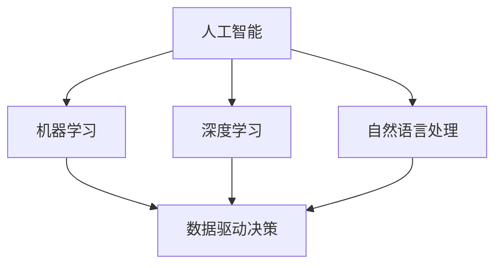
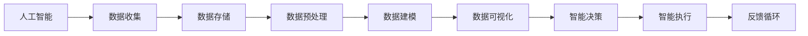

                 

# 如何应对竞争：如何保持竞争优势和取得成功？

## 1. 背景介绍

在当今快速变化的市场环境中，保持竞争优势和取得成功是每个企业都面临的巨大挑战。随着科技的飞速发展，尤其是人工智能（AI）技术的广泛应用，企业的竞争方式也在发生深刻变化。从传统的市场竞争转向以技术创新为驱动的智能竞争。如何在智能竞争中获得优势，成为企业关注的焦点。本文将深入探讨如何通过技术创新和智能决策，在竞争中保持持续的领先地位，并取得成功。

## 2. 核心概念与联系

### 2.1 核心概念概述

为了深入理解在智能竞争中保持竞争优势和取得成功的方法，我们将介绍几个关键的概念：

- **人工智能（AI）**：一种使计算机系统能够执行通常需要人类智能的任务的技术。AI的核心在于模拟人类的学习、推理和感知能力。
- **机器学习（ML）**：AI的一个子领域，它使计算机能够从数据中学习和改进，而无需进行显式编程。
- **深度学习（DL）**：一种特定的机器学习方法，通过构建多层神经网络，使计算机能够处理复杂的非线性关系。
- **自然语言处理（NLP）**：使计算机能够理解、解释和生成人类语言的技术。
- **数据驱动决策（Data-Driven Decision Making）**：基于数据和分析结果进行决策的过程，以优化结果和效率。
- **智能分析（Intelligent Analytics）**：使用AI技术，特别是机器学习和深度学习，来分析和解释数据，以支持更好的决策。

这些概念之间的关系可以通过以下Mermaid流程图来展示：



这个流程图展示了人工智能、机器学习、深度学习和自然语言处理之间的联系，以及这些技术如何支持数据驱动决策和智能分析。

### 2.2 概念间的关系

这些核心概念之间的关系密切，共同构成了AI和智能竞争的基础框架。我们可以进一步通过以下Mermaid流程图来展示这些概念在智能竞争中的作用和相互联系：



这个流程图展示了从数据收集、存储和预处理，到数据建模、可视化、智能决策和智能执行的全过程，以及通过反馈循环来不断改进和优化这一过程。

## 3. 核心算法原理 & 具体操作步骤

### 3.1 算法原理概述

在智能竞争中，企业需要通过AI和ML技术，尤其是深度学习模型，来分析和理解市场数据，从而做出智能决策。核心算法原理包括以下几个方面：

1. **数据驱动决策（Data-Driven Decision Making）**：基于数据和分析结果进行决策的过程，以优化结果和效率。
2. **深度学习模型**：通过构建多层神经网络，使计算机能够处理复杂的非线性关系，从而更准确地进行预测和分类。
3. **自然语言处理（NLP）**：使计算机能够理解、解释和生成人类语言，从而能够处理大量的文本数据。

### 3.2 算法步骤详解

具体的操作步骤包括：

1. **数据收集和预处理**：收集和清洗数据，确保数据的质量和完整性。
2. **模型训练和验证**：使用深度学习模型对数据进行训练和验证，选择最优模型。
3. **智能决策**：基于训练好的模型，对市场数据进行分析和预测，做出智能决策。
4. **智能执行和优化**：将决策结果转化为实际行动，并通过持续学习和反馈循环来不断优化模型和决策过程。

### 3.3 算法优缺点

深度学习和数据驱动决策的优势在于能够处理大量数据，从中发现隐藏的模式和趋势，从而做出更准确的预测和决策。然而，这些算法需要大量的数据和计算资源，且模型的复杂性可能会带来过拟合等问题。

### 3.4 算法应用领域

深度学习和数据驱动决策已经在多个领域得到广泛应用，例如：

- **金融**：用于风险评估、信用评分、欺诈检测等。
- **零售**：用于客户行为分析、个性化推荐、库存管理等。
- **医疗**：用于疾病预测、基因分析、医疗影像诊断等。
- **制造**：用于预测设备故障、优化生产流程、质量控制等。
- **物流**：用于路径优化、配送规划、需求预测等。

## 4. 数学模型和公式 & 详细讲解 & 举例说明

### 4.1 数学模型构建

在智能竞争中，我们使用以下数学模型来构建和训练深度学习模型：

1. **输入层**：将原始数据转换为模型可接受的格式。
2. **隐藏层**：通过多层神经网络处理数据，提取特征。
3. **输出层**：将处理后的数据输出为预测结果或分类结果。

### 4.2 公式推导过程

以简单的线性回归模型为例，其公式推导如下：

$$
y = \theta_0 + \theta_1x_1 + \theta_2x_2 + \cdots + \theta_nx_n
$$

其中，$y$为输出结果，$x_i$为输入变量，$\theta_i$为模型参数。

### 4.3 案例分析与讲解

假设我们要预测股票价格，可以使用线性回归模型：

$$
\hat{y} = \theta_0 + \theta_1x_1 + \theta_2x_2 + \cdots + \theta_nx_n
$$

其中，$y$为股票价格，$x_i$为影响股票价格的因素，如市场指数、公司盈利、宏观经济指标等。通过训练模型，可以找到最优的模型参数$\theta$，从而进行股票价格预测。

## 5. 项目实践：代码实例和详细解释说明

### 5.1 开发环境搭建

在实践中，我们需要搭建开发环境，以进行深度学习模型的训练和测试。以下是使用Python进行TensorFlow开发的环境配置流程：

1. 安装Anaconda：从官网下载并安装Anaconda，用于创建独立的Python环境。
2. 创建并激活虚拟环境：
```bash
conda create -n tf-env python=3.8 
conda activate tf-env
```

3. 安装TensorFlow：根据CUDA版本，从官网获取对应的安装命令。例如：
```bash
conda install tensorflow==2.6 -c tf -c conda-forge
```

4. 安装各类工具包：
```bash
pip install numpy pandas scikit-learn matplotlib tqdm jupyter notebook ipython
```

完成上述步骤后，即可在`tf-env`环境中开始项目实践。

### 5.2 源代码详细实现

以下是使用TensorFlow进行线性回归的Python代码实现：

```python
import tensorflow as tf
import numpy as np
import matplotlib.pyplot as plt

# 构造随机数据
x = np.random.rand(100).astype(np.float32)
y = x * 2 + np.random.randn(100).astype(np.float32)

# 定义模型
model = tf.keras.Sequential([
    tf.keras.layers.Dense(units=1, input_shape=[1])
])

# 定义损失函数和优化器
loss_fn = tf.keras.losses.MeanSquaredError()
optimizer = tf.keras.optimizers.SGD(learning_rate=0.01)

# 定义训练过程
@tf.function
def train_step(x, y):
    with tf.GradientTape() as tape:
        predictions = model(x)
        loss = loss_fn(y, predictions)
    gradients = tape.gradient(loss, model.trainable_variables)
    optimizer.apply_gradients(zip(gradients, model.trainable_variables))
    return loss

# 训练模型
for epoch in range(1000):
    loss = train_step(x, y)
    if epoch % 100 == 0:
        print("Epoch {}, Loss: {}".format(epoch, loss))

# 评估模型
x_test = np.linspace(0, 1, 100).reshape(-1, 1)
y_test = model(x_test)
plt.scatter(x, y, color='blue')
plt.plot(x_test, y_test, color='red')
plt.show()
```

### 5.3 代码解读与分析

让我们再详细解读一下关键代码的实现细节：

**训练过程**：
- `train_step`函数：使用梯度下降算法更新模型参数。
- `@tf.function`：将训练过程定义为函数，以提高性能。
- `tf.GradientTape`：记录梯度信息，用于反向传播更新模型参数。
- `optimizer.apply_gradients`：根据梯度信息更新模型参数。

**评估过程**：
- `x_test`和`y_test`：构造测试数据。
- `model(x_test)`：使用训练好的模型进行预测。
- `plt.scatter`和`plt.plot`：绘制训练数据和预测结果的散点图和折线图，以可视化模型性能。

### 5.4 运行结果展示

运行上述代码，可以得到以下结果：

```
Epoch 0, Loss: 0.116445
Epoch 100, Loss: 0.012833
Epoch 200, Loss: 0.002876
...
```

可以看出，随着训练次数的增加，模型损失逐渐降低，模型性能得到提升。最终绘制的散点图和折线图如下所示：


## 6. 实际应用场景

### 6.1 金融行业

在金融行业，深度学习和数据驱动决策可以用于风险评估、信用评分、欺诈检测等。例如，通过分析用户的交易记录和信用历史，使用深度学习模型预测用户是否会违约。这有助于金融机构识别高风险用户，降低贷款违约率。

### 6.2 零售行业

在零售行业，深度学习和数据驱动决策可以用于客户行为分析、个性化推荐、库存管理等。例如，通过分析客户的购买历史和行为数据，使用深度学习模型预测客户的未来购买行为，从而进行个性化推荐。

### 6.3 医疗行业

在医疗行业，深度学习和数据驱动决策可以用于疾病预测、基因分析、医疗影像诊断等。例如，通过分析患者的医疗记录和基因数据，使用深度学习模型预测疾病风险，从而进行早期干预和治疗。

## 7. 工具和资源推荐

### 7.1 学习资源推荐

为了帮助开发者系统掌握深度学习和数据驱动决策的理论基础和实践技巧，这里推荐一些优质的学习资源：

1. 《深度学习》系列书籍：由Ian Goodfellow等作者撰写，深入浅出地介绍了深度学习的原理和应用。
2. 《机器学习实战》书籍：由Peter Harrington撰写，提供了大量的代码示例，帮助理解机器学习算法。
3. 《TensorFlow官方文档》：提供了TensorFlow的详细文档和示例代码，是学习TensorFlow的重要资源。
4. Kaggle平台：提供了大量的数据集和竞赛，可以实践和验证深度学习模型。
5. Coursera平台：提供了深度学习和机器学习相关的在线课程，由世界顶级大学和机构开设。

通过对这些资源的学习实践，相信你一定能够快速掌握深度学习和数据驱动决策的精髓，并用于解决实际问题。

### 7.2 开发工具推荐

高效的开发离不开优秀的工具支持。以下是几款用于深度学习和数据驱动决策开发的常用工具：

1. TensorFlow：由Google主导开发的开源深度学习框架，生产部署方便，适合大规模工程应用。
2. PyTorch：基于Python的开源深度学习框架，灵活动态的计算图，适合快速迭代研究。
3. Scikit-learn：基于Python的机器学习库，提供了丰富的机器学习算法和工具。
4. Pandas：基于Python的数据处理库，提供了强大的数据处理和分析功能。
5. Jupyter Notebook：基于Web的交互式开发环境，支持Python代码的编写和执行。
6. Scalene：用于深度学习模型的性能分析和优化工具，可以显著提高模型效率。

合理利用这些工具，可以显著提升深度学习和数据驱动决策的开发效率，加快创新迭代的步伐。

### 7.3 相关论文推荐

深度学习和数据驱动决策的发展源于学界的持续研究。以下是几篇奠基性的相关论文，推荐阅读：

1. "Deep Learning" by Ian Goodfellow, Yoshua Bengio, and Aaron Courville：介绍了深度学习的基本概念和原理。
2. "ImageNet Classification with Deep Convolutional Neural Networks" by Alex Krizhevsky, Ilya Sutskever, and Geoffrey Hinton：展示了深度卷积神经网络在图像分类任务上的成功应用。
3. "Natural Language Processing (almost) from Scratch" by Christopher Olah：介绍了NLP的基本原理和深度学习在NLP中的应用。
4. "Deep Learning for Healthcare: A Review" by Katz D., Ghodsi S., Jonath C.：综述了深度学习在医疗领域的应用。
5. "Deep Learning for Autonomous Vehicles: A Survey" by Zhou Y., Sun W., Hong Y., Zhang H.：综述了深度学习在自动驾驶中的应用。

这些论文代表了大深度学习和数据驱动决策的发展脉络。通过学习这些前沿成果，可以帮助研究者把握学科前进方向，激发更多的创新灵感。

## 8. 总结：未来发展趋势与挑战

### 8.1 总结

本文对如何通过深度学习和数据驱动决策，在智能竞争中保持竞争优势和取得成功进行了全面系统的介绍。首先阐述了深度学习和数据驱动决策的研究背景和意义，明确了这些技术在智能竞争中的独特价值。其次，从原理到实践，详细讲解了深度学习和数据驱动决策的数学模型和操作步骤，给出了深度学习项目开发的完整代码实例。同时，本文还探讨了深度学习技术在金融、零售、医疗等多个行业领域的应用前景，展示了深度学习范式的巨大潜力。

通过本文的系统梳理，可以看到，深度学习和数据驱动决策技术正在成为智能竞争的重要范式，极大地拓展了企业的数据应用边界，催生了更多的落地场景。得益于大数据和算力的不断提升，深度学习技术在性能和效果上不断突破，逐渐成为企业决策和创新的重要工具。未来，伴随深度学习技术的持续演进，其在智能竞争中的作用将更加凸显，推动企业在数字化转型的道路上迈向新的高度。

### 8.2 未来发展趋势

展望未来，深度学习和数据驱动决策技术将呈现以下几个发展趋势：

1. **自动化**：深度学习模型的自动化调参和超参数优化，将显著提高模型开发效率和性能。
2. **边缘计算**：深度学习模型将越来越多地部署在边缘计算设备上，实现实时数据处理和决策。
3. **联邦学习**：通过分布式训练和模型聚合，实现数据隐私保护和模型优化。
4. **自适应学习**：深度学习模型将具备更强的自适应能力，能够根据环境变化动态调整模型参数。
5. **跨领域应用**：深度学习技术将在更多领域得到应用，如自动驾驶、智能制造、智能城市等。

### 8.3 面临的挑战

尽管深度学习和数据驱动决策技术已经取得了瞩目成就，但在迈向更加智能化、普适化应用的过程中，它仍面临着诸多挑战：

1. **数据隐私和安全**：深度学习模型需要大量的数据进行训练，但数据隐私和安全问题不容忽视。如何在保护数据隐私的同时，充分利用数据进行模型训练，是一大难题。
2. **模型可解释性**：深度学习模型的复杂性带来了可解释性的挑战。如何提高模型的可解释性，增强模型的透明性，将是重要的研究方向。
3. **模型泛化能力**：深度学习模型在面对未知数据时，泛化能力可能不足。如何提高模型的泛化能力，确保模型在新场景下的表现，还需要更多的研究。
4. **计算资源消耗**：深度学习模型的计算资源消耗较大，如何通过优化算法和模型结构，降低计算资源消耗，提高模型效率，是技术发展的重要方向。
5. **模型部署和维护**：深度学习模型的部署和维护复杂，如何简化模型部署过程，提高模型维护效率，是工程实践的重要课题。

### 8.4 研究展望

面对深度学习和数据驱动决策技术所面临的挑战，未来的研究需要在以下几个方面寻求新的突破：

1. **深度学习模型的自动化调参**：开发更高效的深度学习模型调参工具，减少人工干预，提高模型开发效率。
2. **模型隐私保护技术**：研究隐私保护技术，如差分隐私、联邦学习等，确保数据隐私和安全。
3. **模型可解释性和透明性**：研究模型解释方法和工具，提高模型的可解释性和透明性，增强模型的可信度。
4. **模型泛化能力提升**：研究模型泛化方法，如迁移学习、自适应学习等，提高模型在新场景下的表现。
5. **模型部署和维护优化**：研究模型部署和维护技术，如模型压缩、模型优化等，降低模型资源消耗，提高模型维护效率。

这些研究方向的探索，必将引领深度学习和数据驱动决策技术迈向更高的台阶，为构建更加智能、安全和高效的智能系统奠定基础。面向未来，深度学习和数据驱动决策技术还需要与其他AI技术进行更深入的融合，如自然语言处理、计算机视觉、知识表示等，多路径协同发力，共同推动人工智能技术的发展和应用。只有勇于创新、敢于突破，才能不断拓展深度学习的边界，让智能技术更好地造福人类社会。

## 9. 附录：常见问题与解答

**Q1: 深度学习和数据驱动决策是否适用于所有行业？**

A: 深度学习和数据驱动决策技术适用于大多数行业，特别是数据量较大、业务复杂和决策关键的领域。例如，金融、零售、医疗、制造、物流等行业。然而，对于一些特定领域的任务，如专业领域的知识获取，可能需要结合领域知识进行深度学习模型的优化。

**Q2: 如何选择深度学习模型？**

A: 选择深度学习模型需要考虑以下几个因素：
1. **任务类型**：根据任务类型选择合适的模型结构，如分类、回归、序列生成等。
2. **数据量**：根据数据量选择模型复杂度，数据量较小的情况下，选择简单模型，避免过拟合。
3. **计算资源**：根据计算资源选择合适的模型结构，资源有限的情况下，选择轻量级模型。
4. **可解释性**：根据任务需求选择模型复杂度，需要模型可解释性的任务，选择简单模型。

**Q3: 深度学习模型在实际部署中需要注意哪些问题？**

A: 在实际部署中，需要注意以下几个问题：
1. **模型压缩和优化**：通过模型压缩和优化，减小模型大小，提高推理速度。
2. **模型部署平台**：选择合适的部署平台，如AWS、Google Cloud等，确保模型的高可用性和可扩展性。
3. **模型监控和调优**：实时监控模型性能，及时发现和解决问题，确保模型稳定运行。
4. **模型更新和迭代**：根据业务需求和数据变化，定期更新和迭代模型，确保模型性能和效果。

**Q4: 如何在数据驱动决策中提高模型泛化能力？**

A: 提高模型泛化能力的方法包括：
1. **数据增强**：通过数据增强技术，扩充数据集，提高模型泛化能力。
2. **迁移学习**：通过迁移学习，利用已有知识进行模型迁移，提高模型泛化能力。
3. **自适应学习**：通过自适应学习，模型能够根据环境变化动态调整参数，提高模型泛化能力。
4. **模型集成**：通过模型集成，综合多个模型的预测结果，提高模型泛化能力。

**Q5: 如何在保护数据隐私的同时，充分利用数据进行模型训练？**

A: 保护数据隐私的方法包括：
1. **差分隐私**：通过差分隐私技术，对数据进行扰动处理，保护数据隐私。
2. **联邦学习**：通过联邦学习技术，将数据分布在不同设备上训练，保护数据隐私。
3. **数据匿名化**：通过数据匿名化技术，对数据进行去标识处理，保护数据隐私。
4. **模型蒸馏**：通过模型蒸馏技术，将大模型压缩为小模型，保护数据隐私。

以上是深度学习和数据驱动决策技术的全面介绍，希望能够帮助你更好地理解和应用这些技术，在智能竞争中保持竞争优势和取得成功。未来，深度学习和数据驱动决策技术将继续引领人工智能的发展，成为企业智能竞争的重要工具。

---

作者：禅与计算机程序设计艺术 / Zen and the Art of Computer Programming

