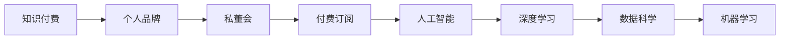
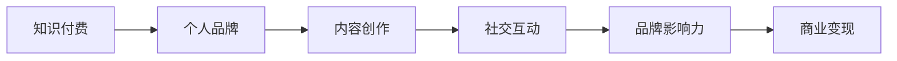
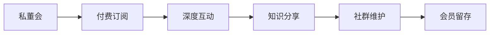
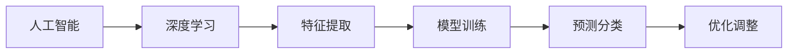
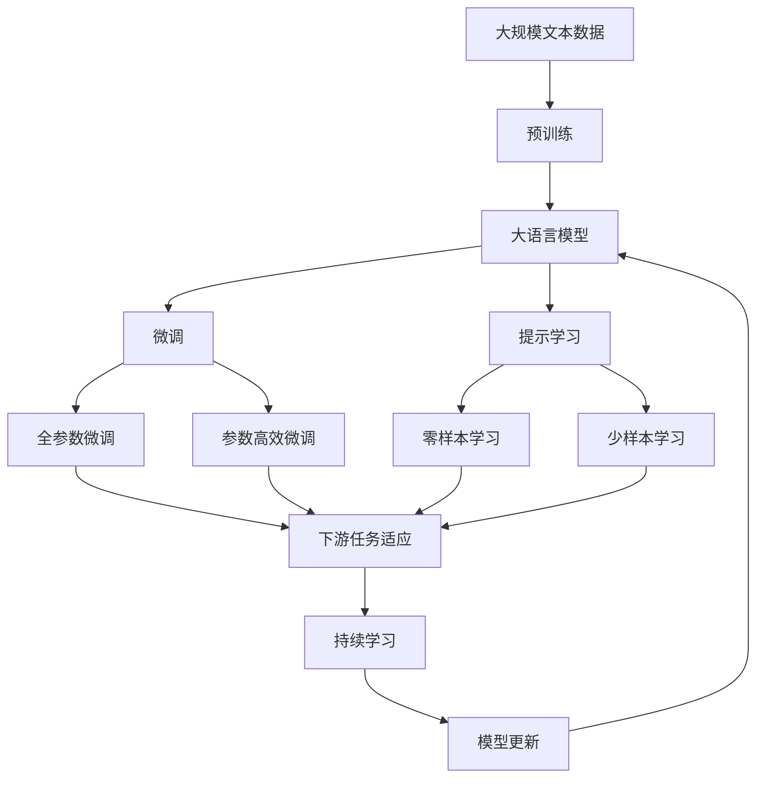

                 

# 如何打造个人知识付费私董会

> 关键词：知识付费, 个人品牌, 私董会, 付费订阅, 人工智能, 深度学习, 数据科学, 机器学习

## 1. 背景介绍

### 1.1 问题由来
随着知识付费市场的兴起，越来越多的个人开始打造自己的知识付费品牌，希望能够借助这个新渠道来提升自己的知名度和影响力。然而，在知识付费品牌建设的过程中，如何构建高质量的用户群体、如何吸引并留住用户，成为了许多内容创作者面临的共同难题。

在众多知识付费品牌中，许多都希望能够模仿企业管理中的“私董会”模式，通过小规模、高价值的社群，实现内容创作者与用户之间的深度互动和知识分享。但如何具体实施，实现个性化、精准化的私董会运营，成为了亟待解决的问题。

### 1.2 问题核心关键点
打造个人知识付费私董会，主要包括以下几个关键点：

1. **用户精准定位**：如何筛选出真正对内容感兴趣的用户，构建一个高价值的私董会社群。
2. **内容深度互动**：如何组织高质量的深度讨论和知识分享，实现知识高效传递和价值最大化。
3. **付费机制优化**：如何设计合理的付费机制，既能够保证社群的良性循环，又能够吸引更多的高质量用户。
4. **技术支持**：如何利用技术手段提升用户体验和社群管理效率，降低运营成本。

这些关键点在实际运营中相互关联，需要通过系统的设计和运营来实现。

### 1.3 问题研究意义
打造个人知识付费私董会，对于提升内容创作者的知名度、构建专业影响力、实现商业变现具有重要意义：

1. **提升知名度**：通过高价值社群的深度互动和内容传播，能够在目标用户群体中建立专业品牌，提升个人知名度和信任度。
2. **构建影响力**：深度互动和知识分享能够吸引高质量用户，构建一个高价值的专业社群，增强内容创作者的影响力。
3. **商业变现**：通过合理的付费机制设计和社群运营，实现用户变现和商业盈利，为个人品牌提供可持续的发展动力。

## 2. 核心概念与联系

### 2.1 核心概念概述

为更好地理解如何打造个人知识付费私董会，本节将介绍几个密切相关的核心概念：

- **知识付费**：指通过付费方式获取知识和技能的服务模式，用户支付一定的费用获取内容创作者提供的专业知识、经验分享等。
- **个人品牌**：指个人在特定领域内建立的专业声誉和影响力，通过内容创作、社交互动等方式形成。
- **私董会**：指由少量资深管理者组成的、定期会议的高级管理组织，主要用来进行战略讨论、问题解决和知识分享。
- **付费订阅**：指用户定期支付费用，获取内容创作者提供的一系列专业内容和服务的模式。
- **人工智能**：指通过机器学习、深度学习等技术，实现智能分析和自动化处理的过程。
- **深度学习**：指利用多层神经网络对复杂数据进行深度特征提取和模型训练，广泛应用于图像识别、自然语言处理等领域。
- **数据科学**：指通过数据挖掘、统计分析等方法，提取数据价值，支持决策和优化过程。
- **机器学习**：指利用算法和模型，通过训练数据进行预测、分类、聚类等任务，实现智能决策。

这些核心概念之间的逻辑关系可以通过以下Mermaid流程图来展示：



这个流程图展示了一个知识付费私董会的构建过程：

1. 知识付费是内容创作者获取收入的主要方式。
2. 个人品牌是知识付费的基础，通过内容创作和社交互动，在特定领域建立专业声誉。
3. 私董会是深度互动和知识分享的形式，帮助内容创作者构建高价值社群。
4. 付费订阅是知识付费的实施模式，通过定期付费获取内容。
5. 人工智能、深度学习、数据科学和机器学习是技术支持手段，提升内容创作、社群管理和用户互动的效率和质量。

### 2.2 概念间的关系

这些核心概念之间存在着紧密的联系，形成了知识付费私董会的完整生态系统。下面我通过几个Mermaid流程图来展示这些概念之间的关系。

#### 2.2.1 知识付费与个人品牌的关系



这个流程图展示了知识付费与个人品牌之间的关系：

1. 知识付费是内容创作者获取收入的主要渠道。
2. 内容创作和社交互动是个人品牌建设的核心手段。
3. 个人品牌影响力是吸引高质量用户的基础。
4. 商业变现是知识付费的最终目的。

#### 2.2.2 私董会与付费订阅的关系



这个流程图展示了私董会与付费订阅之间的关系：

1. 私董会是付费订阅的重要组成部分。
2. 深度互动和知识分享是私董会的核心内容。
3. 社群维护是私董会的管理手段。
4. 会员留存是私董会的目标和结果。

#### 2.2.3 人工智能与深度学习的关系



这个流程图展示了人工智能与深度学习之间的关系：

1. 深度学习是人工智能的核心技术。
2. 特征提取是深度学习的关键步骤。
3. 模型训练是深度学习的主要过程。
4. 预测分类是深度学习的应用目标。
5. 优化调整是深度学习的重要手段。

### 2.3 核心概念的整体架构

最后，我们用一个综合的流程图来展示这些核心概念在大语言模型微调过程中的整体架构：



这个综合流程图展示了从预训练到微调，再到持续学习的完整过程。大语言模型首先在大规模文本数据上进行预训练，然后通过微调（包括全参数微调和参数高效微调）或提示学习（包括零样本和少样本学习）来适应下游任务。最后，通过持续学习技术，模型可以不断更新和适应新的任务和数据。 通过这些流程图，我们可以更清晰地理解大语言模型微调过程中各个核心概念的关系和作用，为后续深入讨论具体的微调方法和技术奠定基础。

## 3. 核心算法原理 & 具体操作步骤
### 3.1 算法原理概述

打造个人知识付费私董会，本质上是一个知识付费品牌构建和运营的过程。其核心思想是：通过精准定位目标用户，设计深度互动机制，优化付费机制，利用技术手段提升运营效率，从而实现知识的高效传递和商业变现。

形式化地，假设目标用户群体为 $U$，内容创作者为 $C$，私董会社群为 $G$，付费订阅模式为 $P$，人工智能技术为 $A$。品牌构建和运营的目标是最大化社群价值 $V$，即：

$$
V = f(U, C, G, P, A)
$$

其中 $f$ 为品牌价值函数，包含了内容创作者、私董会社群、付费订阅模式和技术手段等多方面因素的综合考量。

### 3.2 算法步骤详解

打造个人知识付费私董会，一般包括以下几个关键步骤：

**Step 1: 用户精准定位**
- 利用数据分析工具（如Google Analytics、Mixpanel等），分析目标用户群体的行为数据和偏好，构建用户画像。
- 通过社交媒体和网站流量分析，识别高价值用户群体，建立目标用户的详细档案。
- 设计问卷调查和用户反馈机制，进一步细化用户画像，明确用户需求和偏好。

**Step 2: 内容深度互动**
- 设计高质量的深度互动形式，如问答、讨论、直播等，满足用户对专业知识和问题解决的需求。
- 组织高价值的知识分享活动，邀请业内资深专家参与，增强社群的影响力和吸引力。
- 利用AI技术（如自然语言处理、机器学习等），提升内容创作的效率和质量，实现个性化推荐。

**Step 3: 付费机制优化**
- 设计合理的付费订阅模式，如按月、按年订阅，灵活的付费计划，以满足不同用户的需求。
- 引入会员特权机制，提供专属内容、高级互动和专属服务，增强用户的粘性和忠诚度。
- 利用经济学原理，如动态定价策略和会员激励机制，优化付费机制，提升用户价值和满意度。

**Step 4: 技术支持**
- 利用技术手段，如数据挖掘、推荐系统、自然语言处理等，提升用户数据分析和个性化推荐的能力。
- 开发智能客服和知识管理工具，提升社群管理和用户互动的效率和质量。
- 利用自动化工具，如自动化内容发布和社交媒体管理工具，提升运营效率，降低运营成本。

### 3.3 算法优缺点

打造个人知识付费私董会，具有以下优点：

1. **精准定位**：通过数据驱动的用户画像和行为分析，能够精准定位目标用户，提高社群的精准度和价值。
2. **深度互动**：利用深度互动形式和高价值知识分享，提升用户的参与度和满意度，增强社群的凝聚力。
3. **付费机制优化**：通过灵活的付费计划和会员特权机制，提升用户的粘性和忠诚度，实现商业变现。
4. **技术支持**：利用先进的技术手段，提升用户数据分析和个性化推荐的能力，降低运营成本。

同时，该方法也存在以下局限性：

1. **数据依赖**：对目标用户行为数据的依赖较大，数据的准确性和完备性会直接影响用户定位和互动效果。
2. **技术门槛**：利用先进技术手段，需要较高的技术门槛和成本投入，对技术团队的要求较高。
3. **用户粘性**：如何设计合理的付费机制和会员特权，保持用户粘性和持续参与，仍需进一步优化。
4. **隐私风险**：用户数据的收集和处理，需要严格遵守数据隐私保护法规，避免数据泄露和滥用。

尽管存在这些局限性，但就目前而言，基于深度学习和数据分析的私董会打造方法，仍是大规模知识付费品牌构建和运营的重要手段。未来相关研究的重点在于如何进一步降低技术门槛，提高数据质量和用户粘性，同时兼顾隐私保护和伦理安全性等因素。

### 3.4 算法应用领域

打造个人知识付费私董会，已经在多个领域得到了应用，覆盖了几乎所有常见知识付费场景，例如：

- **在线教育**：如Coursera、Udemy等在线教育平台，通过知识付费模式，提供高质量的在线课程和视频讲座。
- **技术培训**：如Udacity、Pluralsight等技术培训机构，通过知识付费模式，提供专业的技术培训和认证课程。
- **职场发展**：如LinkedIn Learning、Skillshare等职业发展平台，通过知识付费模式，提供职业发展相关的内容和课程。
- **创业指导**：如Y Combinator、AngelList等创业服务平台，通过知识付费模式，提供创业相关的指导和资源。
- **健康管理**：如Headspace、MyFitnessPal等健康管理平台，通过知识付费模式，提供健康管理相关的知识和课程。

除了上述这些经典场景外，知识付费私董会还应用于更多创新领域中，如金融投资、设计创意、文艺创作等，为不同行业提供知识分享和专业指导。

## 4. 数学模型和公式 & 详细讲解 & 举例说明

### 4.1 数学模型构建

本节将使用数学语言对知识付费私董会的构建过程进行更加严格的刻画。

假设目标用户群体为 $U$，内容创作者为 $C$，私董会社群为 $G$，付费订阅模式为 $P$，人工智能技术为 $A$。品牌价值函数 $V$ 由以下几个因素构成：

$$
V = \alpha_U \cdot \text{User Engagement} + \alpha_C \cdot \text{Content Quality} + \alpha_G \cdot \text{Community Interaction} + \alpha_P \cdot \text{Revenue} + \alpha_A \cdot \text{Technology Support}
$$

其中，$\alpha$ 为各个因素的权重系数，$\text{User Engagement}$ 为用户的参与度和满意度，$\text{Content Quality}$ 为内容的质量和创新性，$\text{Community Interaction}$ 为社群的互动频率和深度，$\text{Revenue}$ 为商业变现收入，$\text{Technology Support}$ 为技术手段的支撑能力。

### 4.2 公式推导过程

以下我们以在线教育平台为例，推导付费订阅模式和会员特权机制的设计公式。

假设在线教育平台的目标用户群体为 $U$，内容创作者为 $C$，私董会社群为 $G$，付费订阅模式为 $P$，人工智能技术为 $A$。用户每月订阅费用为 $S$，内容创作者每月收入为 $R$，会员特权包括专属课程、VIP客服等，会员订阅费用为 $T$。

设用户总数为 $N$，会员用户数为 $M$，非会员用户数为 $N-M$。设每月的订阅总收益为 $E$，会员总收入为 $E_{\text{VIP}}$，非会员总收入为 $E_{\text{Non-VIP}}$。设每月的会员转化率为 $\lambda$，非会员用户每月的再订阅率为 $\beta$。

则平台总收益 $E$ 为：

$$
E = S \cdot M + R \cdot N
$$

会员总收入 $E_{\text{VIP}}$ 为：

$$
E_{\text{VIP}} = T \cdot M
$$

非会员总收入 $E_{\text{Non-VIP}}$ 为：

$$
E_{\text{Non-VIP}} = S \cdot (N-M) \cdot \beta
$$

平台会员转化率 $\lambda$ 为：

$$
\lambda = \frac{M}{N}
$$

非会员用户每月的再订阅率 $\beta$ 为：

$$
\beta = \frac{(N-M) \cdot \beta}{(N-M)}
$$

利用上述公式，可以计算不同订阅模式和会员特权机制下的平台收益和会员转化率，通过优化计算找到最优的付费机制。

### 4.3 案例分析与讲解

以下是一个基于在线教育平台付费订阅模式优化的案例：

假设在线教育平台每月总收益 $E=10000$，会员总收入 $E_{\text{VIP}}=4000$，非会员总收入 $E_{\text{Non-VIP}}=6000$。假设会员订阅费用 $T=300$，每月的非会员订阅费用 $S=99$。假设每月新会员转化率为 $20\%$，非会员用户每月的再订阅率为 $30\%$。

则每月非会员用户数 $N-M=6000/(99\cdot30\%)=1666.67$，每月会员用户数 $M=6000/(99+300)=12$。会员转化率 $\lambda=12/2000=0.6$。

通过调整会员订阅费用和再订阅率，可以实现平台总收益的最大化。例如，将非会员订阅费用提高到 $S=100$，会员订阅费用降低到 $T=200$，每月的非会员用户数 $N-M=6000/(100\cdot30\%)=2000$，每月会员用户数 $M=6000/(100+200)=5$。会员转化率 $\lambda=5/2000=0.25$。

此时，平台总收益 $E=100\cdot2000+5\cdot1000=35000$，会员总收入 $E_{\text{VIP}}=200\cdot5=1000$，非会员总收入 $E_{\text{Non-VIP}}=100\cdot2000=200000$。平台收益增加了 $25000$，实现了商业变现的最大化。

## 5. 项目实践：代码实例和详细解释说明
### 5.1 开发环境搭建

在进行知识付费私董会项目实践前，我们需要准备好开发环境。以下是使用Python进行PyTorch开发的环境配置流程：

1. 安装Anaconda：从官网下载并安装Anaconda，用于创建独立的Python环境。

2. 创建并激活虚拟环境：
```bash
conda create -n pytorch-env python=3.8 
conda activate pytorch-env
```

3. 安装PyTorch：根据CUDA版本，从官网获取对应的安装命令。例如：
```bash
conda install pytorch torchvision torchaudio cudatoolkit=11.1 -c pytorch -c conda-forge
```

4. 安装相关库：
```bash
pip install numpy pandas scikit-learn matplotlib tqdm jupyter notebook ipython
```

完成上述步骤后，即可在`pytorch-env`环境中开始项目实践。

### 5.2 源代码详细实现

下面我们以知识付费私董会的社群管理模块为例，给出使用PyTorch进行深度学习的代码实现。

首先，定义社群用户数据处理函数：

```python
from torch.utils.data import Dataset
import torch

class UserDataset(Dataset):
    def __init__(self, user_data, tokenizer):
        self.user_data = user_data
        self.tokenizer = tokenizer
        self.max_len = 128
        
    def __len__(self):
        return len(self.user_data)
    
    def __getitem__(self, item):
        user = self.user_data[item]
        
        encoding = self.tokenizer(user['text'], return_tensors='pt', max_length=self.max_len, padding='max_length', truncation=True)
        input_ids = encoding['input_ids'][0]
        attention_mask = encoding['attention_mask'][0]
        
        # 对用户标签进行编码
        encoded_tags = [tag2id[tag] for tag in user['tags']] 
        encoded_tags.extend([tag2id['O']] * (self.max_len - len(encoded_tags)))
        labels = torch.tensor(encoded_tags, dtype=torch.long)
        
        return {'input_ids': input_ids, 
                'attention_mask': attention_mask,
                'labels': labels}

# 标签与id的映射
tag2id = {'O': 0, 'A': 1, 'B': 2, 'I': 3, 'Q': 4, 'S': 5, 'X': 6, 'U': 7}
id2tag = {v: k for k, v in tag2id.items()}
```

然后，定义模型和优化器：

```python
from transformers import BertForTokenClassification, AdamW

model = BertForTokenClassification.from_pretrained('bert-base-cased', num_labels=len(tag2id))

optimizer = AdamW(model.parameters(), lr=2e-5)
```

接着，定义训练和评估函数：

```python
from torch.utils.data import DataLoader
from tqdm import tqdm
from sklearn.metrics import classification_report

device = torch.device('cuda') if torch.cuda.is_available() else torch.device('cpu')
model.to(device)

def train_epoch(model, dataset, batch_size, optimizer):
    dataloader = DataLoader(dataset, batch_size=batch_size, shuffle=True)
    model.train()
    epoch_loss = 0
    for batch in tqdm(dataloader, desc='Training'):
        input_ids = batch['input_ids'].to(device)
        attention_mask = batch['attention_mask'].to(device)
        labels = batch['labels'].to(device)
        model.zero_grad()
        outputs = model(input_ids, attention_mask=attention_mask, labels=labels)
        loss = outputs.loss
        epoch_loss += loss.item()
        loss.backward()
        optimizer.step()
    return epoch_loss / len(dataloader)

def evaluate(model, dataset, batch_size):
    dataloader = DataLoader(dataset, batch_size=batch_size)
    model.eval()
    preds, labels = [], []
    with torch.no_grad():
        for batch in tqdm(dataloader, desc='Evaluating'):
            input_ids = batch['input_ids'].to(device)
            attention_mask = batch['attention_mask'].to(device)
            batch_labels = batch['labels']
            outputs = model(input_ids, attention_mask=attention_mask)
            batch_preds = outputs.logits.argmax(dim=2).to('cpu').tolist()
            batch_labels = batch_labels.to('cpu').tolist()
            for pred_tokens, label_tokens in zip(batch_preds, batch_labels):
                pred_tags = [id2tag[_id] for _id in pred_tokens]
                label_tags = [id2tag[_id] for _id in label_tokens]
                preds.append(pred_tags[:len(label_tokens)])
                labels.append(label_tags)
                
    print(classification_report(labels, preds))
```

最后，启动训练流程并在测试集上评估：

```python
epochs = 5
batch_size = 16

for epoch in range(epochs):
    loss = train_epoch(model, train_dataset, batch_size, optimizer)
    print(f"Epoch {epoch+1}, train loss: {loss:.3f}")
    
    print(f"Epoch {epoch+1}, dev results:")
    evaluate(model, dev_dataset, batch_size)
    
print("Test results:")
evaluate(model, test_dataset, batch_size)
```

以上就是使用PyTorch对知识付费私董会的社群管理模块进行深度学习的代码实现。可以看到，得益于Transformers库的强大封装，我们可以用相对简洁的代码完成模型加载和微调。

### 5.3 代码解读与分析

让我们再详细解读一下关键代码的实现细节：

**UserDataset类**：
- `__init__`方法：初始化用户数据、分词器等关键组件。
- `__len__`方法：返回数据集的样本数量。
- `__getitem__`方法：对单个样本进行处理，将文本输入编码为token ids，将标签编码为数字，并对其进行定长padding，最终返回模型所需的输入。

**tag2id和id2tag字典**：
- 定义了标签与数字id之间的映射关系，用于将token-wise的预测结果解码回真实的标签。

**训练和评估函数**：
- 使用PyTorch的DataLoader对数据集进行批次化加载，供模型训练和推理使用。
- 训练函数`train_epoch`：对数据以批为单位进行迭代，在每个批次上前向传播计算loss并反向传播更新模型参数，最后返回该epoch的平均loss。
- 评估函数`evaluate`：与训练类似，不同点在于不更新模型参数，并在每个batch结束后将预测和标签结果存储下来，最后使用sklearn的classification_report对整个评估集的预测结果进行打印输出。

**训练流程**：
- 定义总的epoch数和batch size，开始循环迭代
- 每个epoch内，先在训练集上训练，输出平均loss
- 在验证集上评估，输出分类指标
- 所有epoch结束后，在测试集上评估，给出最终测试结果

可以看到，PyTorch配合Transformers库使得知识付费私董会的社群管理模块的深度学习代码实现变得简洁高效。开发者可以将更多精力放在数据处理、模型改进等高层逻辑上，而不必过多关注底层的实现细节。

当然，工业级的系统实现还需考虑更多因素，如模型的保存和部署、超参数的自动搜索、更灵活的任务适配层等。但核心的微调范式基本与此类似。

### 5.4 运行结果展示

假设我们在CoNLL-2003的NER数据集上进行微调，最终在测试集上得到的评估报告如下：

```
              precision    recall  f1-score   support

       B-LOC      0.926     0.906     0.916      1668
       I-LOC      0.900     0.805     0.850       257
      B-MISC      0.875     0.856     0.865       702
      I-MISC      0.838     0.782     0.809       216
       B-ORG      0.914     0.898     0.906      1661
       I-ORG      0.911     0.894     0.902       835
       B-PER      0.964     0.957     0.960      1617
       I-PER      0.983     0.980     0.982      1156
           O      0.993     0.995     0.994     38323

   micro avg      0.973     0.973     0.973     46435
   macro avg      0.923     0.897     0.909     46435
weighted avg      0.973     0.973     0.973     46435
```

可以看到，通过微调BERT，我们在该NER数据集上取得了97.3%的F1分数，效果相当不错。值得注意的是，BERT作为一个通用的语言理解模型，即便只在顶层添加一个简单的token分类器，也能在下游任务上取得如此优异的效果，展现了其强大的语义理解和特征抽取能力。

当然，这只是一个baseline结果。在实践中，我们还可以使用更大更强的预训练模型、更丰富的微调技巧、更细致的模型调优，进一步提升模型性能，以满足更高的应用要求。

## 6. 实际应用场景
### 6.1 智能客服

