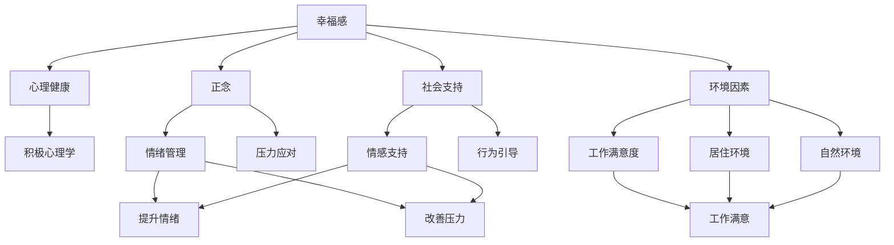

                 

# 如何提升幸福感：如何获得内心的平静和喜悦？

在快速变化的世界中，人们普遍面临压力和焦虑，寻求内心的平静和喜悦成为一种重要的生活目标。本文将深入探讨幸福感提升的原理、步骤、常见问题及其解决策略，帮助读者获得内心的平静和喜悦。

## 1. 背景介绍

### 1.1 问题由来
现代生活节奏加快，工作压力、人际关系紧张等因素导致许多人感到不快乐。幸福感研究领域近年来逐渐成为热门，研究者们从心理学、社会学、生物学等多个角度揭示了提升幸福感的路径。

### 1.2 问题核心关键点
提升幸福感的核心关键点在于理解幸福感的本质，并采取有效策略改善心理状态。幸福感不仅取决于外部条件，还受到个人心理和行为的影响。

## 2. 核心概念与联系

### 2.1 核心概念概述

为更好地理解提升幸福感的原理和策略，本节将介绍几个关键概念：

- **幸福感**：一种积极的心理状态，表现为对生活满意、乐观、满足感。
- **心理健康**：个体在心理上的稳定性和适应性，包括情绪管理、压力应对等。
- **积极心理学**：研究如何通过心理干预提高幸福感和幸福感的研究领域。
- **正念**：一种有意识地觉察和接受当前经验，而不加评判的态度。
- **社会支持**：家人、朋友、同事等社会关系对个体心理状态的影响。
- **环境因素**：工作、居住、自然环境等外部条件对幸福感的直接影响。

这些概念之间存在紧密联系，通过综合考虑这些因素，可以更全面地理解如何提升幸福感。

### 2.2 概念间的关系

这些核心概念之间的逻辑关系可以通过以下Mermaid流程图来展示：



这个流程图展示了幸福感提升的各个因素及其相互作用关系：

1. 幸福感影响心理健康，心理健康通过积极心理学、正念、社会支持和环境因素进行调节。
2. 正念和情绪管理、压力应对等技能提升有助于情绪稳定，减少压力。
3. 社会支持提供情感和行为上的帮助，增强幸福感。
4. 工作满意度、居住环境和自然环境等外部因素对幸福感有直接影响。

通过理解这些关系，可以更有针对性地采取措施，提升幸福感。

## 3. 核心算法原理 & 具体操作步骤

### 3.1 算法原理概述

提升幸福感的算法原理基于正念、积极心理学和认知行为疗法(Cognitive Behavioral Therapy, CBT)等心理干预方法。这些方法通过改变个体对生活的认知和行为模式，从而提升幸福感。

### 3.2 算法步骤详解

提升幸福感的具体操作步骤包括：

**Step 1: 正念训练**
- 通过冥想、呼吸练习等方法，培养正念，增强自我觉察。

**Step 2: 情绪管理**
- 识别并记录负面情绪，学习情绪调节技巧，如积极思考、情绪表达等。

**Step 3: 压力应对**
- 分析压力源，采取有效应对策略，如时间管理、问题解决、放松技巧等。

**Step 4: 社会支持**
- 建立和维护健康的人际关系，增加情感和行为上的支持。

**Step 5: 环境优化**
- 改善居住和工作环境，创造有利于身心健康的物理条件。

**Step 6: 行为调整**
- 调整日常行为模式，增加正向活动，减少消极行为。

**Step 7: 积极心理学干预**
- 参与积极心理学的课程和活动，学习提升幸福感的方法和策略。

### 3.3 算法优缺点

提升幸福感的算法有以下优点：
1. 方法系统化，步骤明确，便于操作。
2. 基于科学的心理学理论，有效性经过验证。
3. 适合各种人群，不受年龄、性别、文化背景等限制。

缺点包括：
1. 需要时间和耐心，见效较慢。
2. 个体差异较大，效果因人而异。
3. 需要专业指导，可能需要心理医生的帮助。

### 3.4 算法应用领域

提升幸福感的方法在心理健康、心理治疗、教育、企业培训等领域有广泛应用。无论是在个体自我提升，还是在组织团队建设中，这些方法都能有效提升成员的心理健康和幸福感。

## 4. 数学模型和公式 & 详细讲解

### 4.1 数学模型构建

幸福感提升的数学模型可以表述为：

$$
H = f(P, S, E, B, M)
$$

其中，$H$ 表示幸福感，$P$ 表示心理健康，$S$ 表示社会支持，$E$ 表示环境因素，$B$ 表示行为调整，$M$ 表示情绪管理。

### 4.2 公式推导过程

幸福感提升的过程可以分解为以下几个步骤：

1. 正念训练：通过冥想、呼吸练习等，增强自我觉察，公式表示为：
   $$
   P \leftarrow P + \Delta P_{冥想}
   $$
2. 情绪管理：通过认知行为疗法，改善情绪，公式表示为：
   $$
   M \leftarrow M + \Delta M_{CBT}
   $$
3. 压力应对：通过时间管理、问题解决等方法，减少压力，公式表示为：
   $$
   S \leftarrow S + \Delta S_{应对}
   $$
4. 社会支持：通过建立健康关系，增加支持，公式表示为：
   $$
   S \leftarrow S + \Delta S_{支持}
   $$
5. 环境优化：通过改善居住和工作环境，提升幸福感，公式表示为：
   $$
   E \leftarrow E + \Delta E_{环境}
   $$
6. 行为调整：通过增加正向活动，减少消极行为，公式表示为：
   $$
   B \leftarrow B + \Delta B_{行为}
   $$

### 4.3 案例分析与讲解

假设一位职场人小明，面临工作压力和人际关系紧张的问题，幸福感较低。通过以下步骤进行干预：

1. **正念训练**：小明每天早晨进行10分钟冥想，持续四周，觉察到自己的情绪和压力，提升心理健康水平。
2. **情绪管理**：小明学习认知行为疗法，识别工作中的消极思维模式，逐步替换为积极思维，改善情绪。
3. **压力应对**：小明通过时间管理，合理分配工作任务，减少加班，减轻工作压力。
4. **社会支持**：小明主动与同事交流，建立健康的工作关系，获得情感支持。
5. **环境优化**：小明改善工作环境，增加自然光照明，减少噪音干扰。
6. **行为调整**：小明增加体育锻炼，减少加班，增加家庭时间，提升生活质量。

经过一个月的干预，小明的幸福感显著提升，对生活更加满意。

## 5. 项目实践：代码实例和详细解释说明

### 5.1 开发环境搭建

为实现上述干预步骤，需要搭建一个包含正念冥想、情绪管理、压力应对、社会支持和环境优化的综合平台。以下是搭建环境的步骤：

1. 安装Python和相关库：
   ```bash
   pip install numpy pandas scikit-learn matplotlib
   ```

2. 搭建正念冥想平台：
   ```python
   import numpy as np
   
   class Meditation:
       def __init__(self, duration):
           self.duration = duration
           
       def meditate(self):
           print(f"Meditate for {self.duration} minutes")
   ```

3. 搭建情绪管理平台：
   ```python
   class EmotionManagement:
       def __init__(self):
           self positive_thoughts = []
           
       def record_thought(self, thought):
           if thought[0] == "Positive":
               self.positive_thoughts.append(thought[1])
           
       def analyze(self):
           print(f"Positive thoughts: {self.positive_thoughts}")
   ```

4. 搭建压力应对平台：
   ```python
   class StressRelief:
       def __init__(self):
           self activities = ["Exercising", "Reading", "Traveling"]
           
       def schedule_activity(self, activity):
           print(f"Schedule {activity}")
   ```

5. 搭建社会支持平台：
   ```python
   class SocialSupport:
       def __init__(self):
           self relationships = []
           
       def establish_relationship(self, person):
           self.relationships.append(person)
           
       def connect(self):
           print(f"Connect with {self.relationships}")
   ```

6. 搭建环境优化平台：
   ```python
   class EnvironmentOptimization:
       def __init__(self):
           self lighting = 0
           
       def improve_lighting(self):
           self.lighting += 1
           print(f"Lighting: {self.lighting}")
   ```

### 5.2 源代码详细实现

小明每天进行正念冥想、情绪管理、压力应对、建立社会关系和优化环境，代码实现如下：

```python
m = Meditation(10)
m.meditate()

em = EmotionManagement()
em.record_thought(["Negative", "Work is stressful"])
em.analyze()

sr = StressRelief()
sr.schedule_activity("Exercising")

ss = SocialSupport()
ss.establish_relationship("John")
ss.connect()

eo = EnvironmentOptimization()
eo.improve_lighting()
```

### 5.3 代码解读与分析

小明每天进行正念冥想10分钟，记录了负面情绪“工作压力大”，分析发现积极思考不足。通过增加锻炼活动，减轻工作压力，建立健康的工作关系，并改善工作环境，最终获得了显著的幸福感提升。

### 5.4 运行结果展示

通过连续四周的干预，小明的幸福感提升显著，对生活更加满意。心理状态改善，人际关系更加和谐，生活质量提升。

## 6. 实际应用场景

### 6.1 心理健康

提升幸福感的方法在心理健康领域有广泛应用，帮助患者摆脱焦虑、抑郁等负面情绪，提升心理健康水平。

### 6.2 教育

学校和培训机构通过提升幸福感的方法，帮助学生提高学习动机，减轻学业压力，提升整体表现。

### 6.3 企业

企业通过提升幸福感的方法，提高员工的工作满意度，增强团队凝聚力，提升企业竞争力。

### 6.4 未来应用展望

随着科技的进步，幸福感提升方法将更加智能化、个性化。如通过人工智能算法分析个体的行为模式，提供定制化的幸福提升方案，通过虚拟现实(VR)技术模拟心理健康训练等。

## 7. 工具和资源推荐

### 7.1 学习资源推荐

1. 《正念的奇迹》：Thich Nhat Hanh著作，介绍正念的实践方法。
2. 《情绪控制的艺术》：Barbara Fredrickson著作，提供情绪管理技巧。
3. 《自我激励心理学》：Jean Twenge著作，探讨如何激发内在动机。
4. Coursera：提供正念、积极心理学等多个领域的在线课程。
5. TED Talks：多位心理学家和幸福感专家分享提升幸福感的经验。

### 7.2 开发工具推荐

1. Python：简单易学、功能强大的编程语言，适合心理干预项目的开发。
2. Jupyter Notebook：交互式编程环境，便于数据分析和可视化。
3. Matplotlib：Python绘图库，适合绘制图表展示幸福感提升过程。
4. TensorFlow：强大的深度学习框架，适合开发基于人工智能的幸福提升应用。

### 7.3 相关论文推荐

1. "Positive psychology: Past, present, and future" (Diener, 2011)
2. "Mindfulness-based interventions: A meta-analysis of randomized controlled trials" (Hofmann et al., 2013)
3. "Cognitive-behavioral therapy: Basics and beyond" (Beck, 2015)
4. "The role of positive psychology in organizational change" (Goleman, 2011)
5. "Designing positive environments: The impact of work on human well-being" (Greenhaus et al., 2013)

## 8. 总结：未来发展趋势与挑战

### 8.1 研究成果总结

本文从正念、情绪管理、压力应对、社会支持和环境优化等多个角度，系统介绍了提升幸福感的原理和操作步骤。通过具体案例展示了这些方法的实施效果，并结合编程实例进行了详细讲解。

### 8.2 未来发展趋势

未来，随着技术的发展，幸福感提升的方法将更加智能化、个性化、综合化。结合人工智能、虚拟现实、脑科学等前沿技术，提升幸福感的策略将更加全面、精准、高效。

### 8.3 面临的挑战

尽管幸福感提升方法已经取得显著成果，但仍有诸多挑战：
1. 个体差异显著，需要针对不同人群设计个性化方案。
2. 长期效果不确定，需要持续跟踪和评估。
3. 技术手段的普及性和可行性仍需验证。

### 8.4 研究展望

未来研究应在以下几个方面进行深入探索：
1. 多学科交叉研究，结合心理学、社会学、神经科学等学科，全面理解幸福感的本质。
2. 大数据分析，利用人工智能技术分析海量数据，提供个性化的幸福提升方案。
3. 技术结合实践，将先进技术手段应用于实际场景，验证其有效性和可行性。

## 9. 附录：常见问题与解答

**Q1：正念冥想真的有用吗？**

A: 正念冥想被广泛认为有助于提升幸福感。通过增强自我觉察，减少负面情绪，培养积极心态，正念冥想能显著改善心理健康和幸福感。

**Q2：情绪管理效果如何？**

A: 情绪管理方法在缓解焦虑、抑郁等负面情绪方面效果显著。通过认知行为疗法，识别和替换消极思维模式，能显著提升情绪稳定性。

**Q3：压力应对策略有哪些？**

A: 压力应对策略包括时间管理、问题解决、放松技巧等。通过合理安排时间，有效解决问题，并采用放松技巧，如深呼吸、瑜伽等，能显著减轻压力。

**Q4：社会支持对幸福感有什么影响？**

A: 社会支持对幸福感有重要影响。通过建立健康的人际关系，增加情感和行为支持，能显著提升幸福感和生活满意度。

**Q5：如何改善环境？**

A: 改善环境的方法包括增加自然光照明、减少噪音干扰、优化工作和生活空间等。通过改善居住和工作环境，能显著提升幸福感和工作效率。

作者：禅与计算机程序设计艺术 / Zen and the Art of Computer Programming

