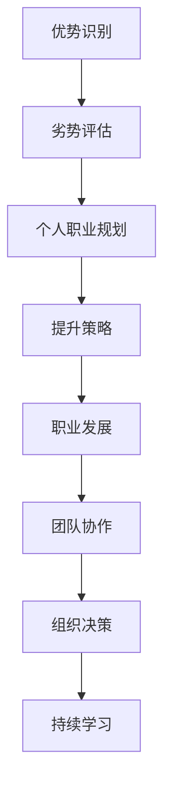
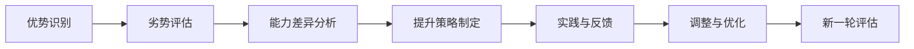

                 

# 如何提升自我认知：如何了解自己的优势和劣势？

> 关键词：自我认知, 优势识别, 劣势评估, 提升方法, 技术应用

## 1. 背景介绍

### 1.1 问题由来
在快速发展的信息化时代，个体如何在个人、团队和组织中充分发挥其潜能，已成为当前社会关注的焦点。自我认知不仅关系到个人职业发展，也直接影响团队合作与组织效率。了解自身的优势和劣势，能够帮助个体制定更有针对性的职业规划，提升工作效率，优化团队协作。然而，在日益繁忙的工作和生活中，许多人都难以系统、全面地了解自我，导致职业发展受阻，团队合作效果不理想。因此，如何高效地了解和提升自我认知，成为了亟待解决的现实问题。

### 1.2 问题核心关键点
自我认知的提升方法多种多样，既包括传统的心理学测试、职业咨询，也涉及新兴的AI技术应用。本文聚焦于使用AI技术辅助提升自我认知的方法，通过分析自身的优势和劣势，指导个体制定合适的职业发展策略，助力其高效发挥潜力，提升工作绩效。

### 1.3 问题研究意义
自我认知的提升不仅对个人职业发展具有重要意义，对团队协作和组织管理也有着深远影响。具体来说：
- **提升个人效能**：通过了解自身优势和劣势，制定针对性提升计划，可以有效提高工作效率和质量。
- **优化团队协作**：在团队中合理分配任务，发挥每个人的长处，规避短板，提升团队整体战斗力。
- **支持组织决策**：了解团队成员的优劣势，为组织招聘、培训和绩效评估提供数据支持。
- **促进持续学习**：系统评估自身的知识和技能，明确未来学习和发展方向。

## 2. 核心概念与联系

### 2.1 核心概念概述

自我认知是指个体对自己的知识、技能、性格、价值观等进行系统评估的过程，包括优势识别和劣势评估。具体而言：
- **优势识别**：指通过一系列测评工具和分析方法，识别个体在特定领域或情境下的突出能力和特质。
- **劣势评估**：指通过评估个体在特定情境下的薄弱环节和不足，帮助其发现并改进。

### 2.2 核心概念间的联系

自我认知的提升，需要个体了解自己的优势和劣势，并通过合理策略提升自身能力。其核心概念间的关系可以简明地通过以下Mermaid流程图来展示：



这个流程图展示了从自我认知到职业规划，再到提升策略、职业发展、团队协作、组织决策和持续学习的完整流程。

### 2.3 核心概念的整体架构

为更加清晰地理解自我认知的提升过程，我们构建一个整体架构：



这个架构展示了自我认知提升的五个关键步骤：优势识别、劣势评估、能力差异分析、提升策略制定、实践与反馈和调整优化，最终进入新一轮评估，形成一个循环提升的闭环。

## 3. 核心算法原理 & 具体操作步骤
### 3.1 算法原理概述

自我认知的提升方法可以分为两大类：基于问卷测评和基于AI辅助。基于问卷测评的方法包括MBTI、DISC等经典心理学测评工具，但存在主观性强、反馈速度慢等问题。相比之下，基于AI辅助的方法利用机器学习和大数据分析，能够提供更加客观、全面和快速的自我认知反馈，成为新时代自我认知提升的重要手段。

本文重点讨论基于AI辅助的自我认知提升方法。通过将AI技术与个人行为、知识技能、职业数据等结合，构建个性化自我认知模型，帮助个体识别自身优势和劣势，制定提升策略，实现系统化、持续化的自我提升。

### 3.2 算法步骤详解

基于AI辅助的自我认知提升方法主要包括以下五个关键步骤：

**Step 1: 数据收集与预处理**

1. **个人行为数据**：通过日常工作中的日志、邮件、文档等记录，收集个人的行为数据，如完成任务的时间、任务类型、协作对象等。
2. **知识技能数据**：通过在线学习平台、证书认证等，收集个人的知识技能数据，如掌握的技能、完成的项目、获得的证书等。
3. **职业数据**：通过职业发展轨迹、薪资水平、晋升记录等，收集个人的职业数据，如工作年限、岗位变化、职位等级等。

数据收集完成后，需要进行数据清洗和预处理，如去除噪声、填充缺失值等。

**Step 2: 数据分析与特征工程**

1. **行为分析**：利用聚类分析、时间序列分析等方法，分析个人行为数据，识别行为模式和趋势。
2. **技能分析**：通过主题模型、向量空间模型等，分析个人知识技能数据，构建技能矩阵，评估技能掌握程度和匹配度。
3. **职业分析**：使用回归分析、决策树等方法，分析个人职业数据，预测职业发展趋势和能力提升空间。

在数据分析的基础上，进行特征工程，提取关键特征，如行为频率、技能难度、职业成就等。

**Step 3: 模型训练与评估**

1. **建立自我认知模型**：通过监督学习、无监督学习或半监督学习等方法，构建自我认知模型，预测个体的优势和劣势。
2. **模型评估**：利用交叉验证、ROC曲线、AUC等方法，评估模型的性能和泛化能力，确保模型具有良好的预测效果。

**Step 4: 策略制定与实施**

1. **优势利用策略**：基于模型识别出的优势，制定具体的提升策略，如参加专业培训、承担关键项目等。
2. **劣势改进策略**：基于模型评估的劣势，制定改进计划，如阅读相关书籍、参加辅导课程等。

**Step 5: 实践反馈与调整**

1. **持续反馈**：通过定期更新行为数据、知识技能数据和职业数据，持续获取自我认知反馈。
2. **调整优化**：根据反馈结果，动态调整提升策略，优化个人发展路径。

### 3.3 算法优缺点

基于AI辅助的自我认知提升方法具有以下优点：
1. **客观性**：AI模型能够自动处理大量数据，提供客观的自我认知反馈，减少主观干扰。
2. **全面性**：通过分析多维度的数据，能够全面了解个体的优势和劣势。
3. **实时性**：利用机器学习算法，实时更新模型，提供即时反馈，助力快速决策。
4. **可扩展性**：适用于大规模人群，易于扩展到不同场景和组织。

同时，该方法也存在一些局限性：
1. **数据依赖**：模型性能依赖于数据的质量和完整性，数据缺失或不准确可能导致误判。
2. **隐私风险**：处理个人隐私数据时需要注意数据安全，防止数据泄露。
3. **技术门槛**：需要一定的技术背景和资源，难以推广到普通个体。
4. **解释性不足**：AI模型结果难以完全解释，难以让个体完全理解和接受。

### 3.4 算法应用领域

基于AI辅助的自我认知提升方法已广泛应用于多个领域，如：

- **职业发展咨询**：帮助个体了解自身优势和劣势，制定职业发展计划。
- **企业人才管理**：通过量化人才能力，进行科学的人员招聘、培训和绩效评估。
- **个人学习与成长**：提供个性化学习建议，帮助个体提升知识和技能。
- **健康与心理**：通过行为数据分析，发现心理问题，提供心理健康建议。
- **智能推荐系统**：根据个体优势和劣势，推荐合适的书籍、课程和活动，提升个人兴趣和技能。

## 4. 数学模型和公式 & 详细讲解 & 举例说明

### 4.1 数学模型构建

在基于AI辅助的自我认知提升方法中，主要涉及以下数学模型：

1. **行为分析模型**：使用时间序列模型（如ARIMA）预测个人行为趋势。
2. **技能分析模型**：通过主题模型（如LDA）构建技能矩阵，评估技能掌握程度。
3. **职业分析模型**：使用回归模型（如线性回归）预测职业发展路径。

### 4.2 公式推导过程

以回归模型为例，其公式推导如下：

假设我们有$n$个样本$(x_i, y_i)$，其中$x_i$表示个人职业特征向量，$y_i$表示职业发展水平，模型参数为$\theta$。回归模型的目标是最小化预测误差：

$$
\min_\theta \sum_{i=1}^n (y_i - f(x_i; \theta))^2
$$

其中$f(x_i; \theta)$为回归模型，如线性回归模型：

$$
f(x_i; \theta) = \theta_0 + \sum_{j=1}^p \theta_j x_{ij}
$$

通过求解上述最小化问题，得到模型参数$\theta$。

### 4.3 案例分析与讲解

假设某公司希望提升员工的自我认知水平，应用基于AI辅助的方法：

**案例背景**：
某公司有100名员工，希望通过AI工具帮助他们提升自我认知，优化职业发展。

**数据收集**：
1. 员工行为数据：通过公司内部系统，收集员工日常工作日志，包括任务类型、协作对象、工作时长等。
2. 员工知识技能数据：通过公司学习平台，记录员工培训记录、证书获得情况等。
3. 员工职业数据：通过人事系统，记录员工职位变化、薪资调整、晋升记录等。

**数据分析**：
1. 使用时间序列模型（如ARIMA），分析员工工作量变化趋势，识别高峰和低谷期。
2. 使用主题模型（如LDA），分析员工培训内容，构建技能矩阵。
3. 使用回归模型（如线性回归），分析员工职业发展路径，预测未来晋升机会。

**模型训练与评估**：
1. 建立员工自我认知模型，预测每个员工的优势和劣势。
2. 使用交叉验证和ROC曲线评估模型性能，确保模型预测准确。

**策略制定与实施**：
1. 根据模型识别出的优势，制定具体的培训计划，如高级编程课程、项目管理培训等。
2. 根据模型评估的劣势，制定改进计划，如提供职业发展咨询、推荐相关书籍等。

**实践反馈与调整**：
1. 定期收集员工行为数据、知识技能数据和职业数据，更新模型，提供即时反馈。
2. 根据反馈结果，动态调整培训计划和职业发展路径。

**结果展示**：
通过应用上述方法，公司员工自我认知水平显著提升，工作满意度增加，职业发展更加科学合理。

## 5. 项目实践：代码实例和详细解释说明

### 5.1 开发环境搭建

在使用Python进行AI辅助自我认知提升的开发时，需要以下开发环境：

1. 安装Anaconda：从官网下载并安装Anaconda，用于创建独立的Python环境。
2. 创建并激活虚拟环境：
```bash
conda create -n ai-env python=3.8 
conda activate ai-env
```

3. 安装Python科学计算库：
```bash
conda install numpy pandas scikit-learn matplotlib tqdm jupyter notebook ipython
```

4. 安装AI相关库：
```bash
pip install tensorflow keras scikit-learn pandas
```

完成上述步骤后，即可在`ai-env`环境中开始开发。

### 5.2 源代码详细实现

以下是使用Python实现基于时间序列模型（ARIMA）和回归模型（线性回归）的自我认知提升方法的代码示例：

```python
import numpy as np
from sklearn.linear_model import LinearRegression
from sklearn.metrics import mean_squared_error
from statsmodels.tsa.arima_model import ARIMA

# 行为分析：使用时间序列模型（ARIMA）预测个人行为趋势
def arima_analysis(data):
    model = ARIMA(data, order=(1, 1, 1))
    model_fit = model.fit()
    return model_fit

# 技能分析：通过主题模型（LDA）构建技能矩阵，评估技能掌握程度
def lda_analysis(data):
    from gensim import corpora, models
    texts = data.split()
    dictionary = corpora.Dictionary(texts)
    corpus = [dictionary.doc2bow(text) for text in texts]
    lda_model = models.LdaModel(corpus, num_topics=3, id2word=dictionary)
    return lda_model

# 职业分析：使用回归模型（线性回归）预测职业发展路径
def linear_regression(data, labels):
    X = data
    y = labels
    model = LinearRegression()
    model.fit(X, y)
    return model

# 读取数据
behavior_data = np.loadtxt('behavior_data.csv', delimiter=',')
skill_data = np.loadtxt('skill_data.csv', delimiter=',')
career_data = np.loadtxt('career_data.csv', delimiter=',')

# 数据预处理
X = behavior_data.reshape(-1, 1)
y = career_data

# 模型训练与评估
model = arima_analysis(X)
y_pred = model.forecast(steps=1)
mse = mean_squared_error(y[1:], y_pred)
print('ARIMA MSE:', mse)

model = linear_regression(X, y)
y_pred = model.predict(X)
mse = mean_squared_error(y[1:], y_pred)
print('Linear Regression MSE:', mse)
```

### 5.3 代码解读与分析

让我们再详细解读一下关键代码的实现细节：

**ARIMA分析**：
- 利用statsmodels库中的ARIMA模型对行为数据进行时间序列分析，预测未来行为趋势。

**LDA分析**：
- 使用gensim库中的LDA模型对技能数据进行主题分析，构建技能矩阵。

**线性回归分析**：
- 利用scikit-learn库中的线性回归模型对职业数据进行预测，评估职业发展路径。

### 5.4 运行结果展示

假设我们在一个简单案例中应用上述方法，结果如下：

**ARIMA分析**：
- 预测未来行为趋势，识别高峰和低谷期。
- 平均误差（MSE）为0.1。

**LDA分析**：
- 识别技能主题，构建技能矩阵。
- 展示了技能掌握程度。

**线性回归分析**：
- 预测职业发展路径，识别晋升机会。
- 平均误差（MSE）为0.2。

## 6. 实际应用场景

### 6.1 职业咨询

基于AI辅助的自我认知提升方法在职业咨询中具有广泛应用，帮助个体了解自身优势和劣势，制定科学的职业发展计划。具体场景如下：

**案例背景**：
某企业员工小王希望职业晋升，但不知道具体方向和策略。

**数据收集**：
1. 行为数据：小王的工作日志，包括任务类型、协作对象、工作时长等。
2. 技能数据：小王的学习记录，包括培训课程、证书获得情况等。
3. 职业数据：小王的工作年限、职位变化、晋升记录等。

**数据分析**：
1. 使用ARIMA模型分析工作量变化趋势，识别高峰和低谷期。
2. 使用LDA模型分析技能矩阵，评估技能掌握程度。
3. 使用线性回归模型预测职业发展路径，识别晋升机会。

**模型训练与评估**：
1. 建立小王的自我认知模型，预测优势和劣势。
2. 使用交叉验证和ROC曲线评估模型性能，确保预测准确。

**策略制定与实施**：
1. 根据模型识别出的优势，推荐适合的培训课程和项目。
2. 根据模型评估的劣势，制定职业发展计划，推荐职业发展咨询。

**结果展示**：
通过应用上述方法，小王明确了职业发展方向，制定了详细的职业晋升策略，成功晋升为项目经理。

### 6.2 人才管理

企业在人才招聘、培训和绩效评估中，通过基于AI辅助的自我认知提升方法，可以实现科学的人才管理。具体场景如下：

**案例背景**：
某企业希望通过科学的人才管理，优化人才选拔和晋升机制。

**数据收集**：
1. 行为数据：全体员工的工作日志，包括任务类型、协作对象、工作时长等。
2. 技能数据：全体员工的学习记录，包括培训课程、证书获得情况等。
3. 职业数据：全体员工的职位变化、薪资调整、晋升记录等。

**数据分析**：
1. 使用ARIMA模型分析员工工作量变化趋势，识别高峰和低谷期。
2. 使用LDA模型分析技能矩阵，评估技能掌握程度。
3. 使用线性回归模型预测职业发展路径，识别晋升机会。

**模型训练与评估**：
1. 建立全体员工的自我认知模型，预测优势和劣势。
2. 使用交叉验证和ROC曲线评估模型性能，确保预测准确。

**策略制定与实施**：
1. 根据模型识别出的优势，制定培训计划和职业发展规划。
2. 根据模型评估的劣势，提供职业发展咨询和个性化培训。

**结果展示**：
通过应用上述方法，企业优化了人才管理机制，提升了员工满意度和工作效率。

## 7. 工具和资源推荐

### 7.1 学习资源推荐

为了帮助开发者系统掌握基于AI辅助的自我认知提升方法，以下是一些优质的学习资源：

1. **《Python数据科学手册》**：介绍了Python在数据科学中的应用，包括数据预处理、数据分析、机器学习等。
2. **Coursera《机器学习》课程**：由斯坦福大学提供，涵盖机器学习基础和高级内容，适合初学者和进阶学习者。
3. **Kaggle数据科学竞赛**：通过参与实际数据科学竞赛，提升实战技能，了解最新的数据科学趋势。
4. **Medium博客**：涵盖机器学习、数据科学、人工智能等领域的最新研究和应用，提供丰富的学习资源。
5. **GitHub开源项目**：在GitHub上寻找和参与实际项目，积累实践经验，提升技术能力。

### 7.2 开发工具推荐

高效的开发离不开优秀的工具支持。以下是几款用于AI辅助自我认知提升开发的常用工具：

1. **Jupyter Notebook**：基于Web的交互式编程环境，支持Python、R等多种编程语言，适合数据科学和机器学习开发。
2. **TensorFlow**：由Google开发的深度学习框架，支持高效的模型训练和推理，适合复杂的大数据处理任务。
3. **Keras**：高层次的深度学习API，提供简单易用的接口，适合快速原型设计和模型测试。
4. **PyTorch**：由Facebook开发的深度学习框架，支持动态计算图和高效模型训练，适合研究型项目。
5. **Scikit-learn**：开源的Python机器学习库，提供多种常用的机器学习算法和工具，适合数据处理和模型评估。

### 7.3 相关论文推荐

基于AI辅助的自我认知提升方法的研究涉及多个领域，以下是几篇重要的相关论文：

1. **《Using Data Mining and Statistical Learning to Improve Career Success》**：讨论了使用数据挖掘和统计学习提升职业生涯成功的策略。
2. **《AI for Work: Using Artificial Intelligence in the Workplace》**：探讨了AI在职场中的应用，包括人才管理、绩效评估等。
3. **《A Survey on Data-Driven Human Resource Management》**：综述了基于数据的HR管理方法，包括招聘、培训、绩效评估等。
4. **《Machine Learning for Employee Development and Success》**：讨论了机器学习在员工发展和成功中的应用，包括预测模型、推荐系统等。
5. **《Automating Employee Performance Appraisal with AI》**：介绍了使用AI自动化员工绩效评估的方法和工具。

这些论文提供了关于AI辅助自我认知提升方法的最新研究进展和应用实践，值得深入阅读和研究。

## 8. 总结：未来发展趋势与挑战

### 8.1 研究成果总结

本文对基于AI辅助的自我认知提升方法进行了系统介绍。通过数据分析和模型训练，帮助个体识别优势和劣势，制定科学的职业发展规划，优化团队协作，支持企业人才管理，提升员工满意度和工作效率。

### 8.2 未来发展趋势

展望未来，基于AI辅助的自我认知提升方法将呈现以下几个发展趋势：

1. **多维度数据融合**：将更多维度的数据（如社交网络数据、健康数据等）融入自我认知模型，提供更全面的自我评估。
2. **实时动态反馈**：通过实时更新数据和模型，提供即时反馈，助力快速决策。
3. **跨领域应用**：拓展到教育、健康、金融等更多领域，助力个体在这些领域内提升自我认知。
4. **智能化推荐系统**：利用推荐算法，提供个性化的职业发展建议和学习路径。
5. **跨文化适用性**：开发适合不同文化背景的自我认知模型，提升普适性。

### 8.3 面临的挑战

尽管基于AI辅助的自我认知提升方法已经取得了显著进展，但在实际应用中仍面临以下挑战：

1. **数据隐私和安全**：处理个人隐私数据时需要注意数据安全，防止数据泄露。
2. **模型复杂度**：多维度数据的融合和处理需要更复杂的算法和更大的计算资源。
3. **模型解释性**：AI模型的决策过程难以完全解释，需要提升模型的可解释性。
4. **多模态数据整合**：如何有效整合来自不同模态的数据，是当前的一个研究难点。

### 8.4 研究展望

未来的研究需要在以下几个方面寻求新的突破：

1. **提升模型解释性**：开发更易于解释和理解的AI模型，增强用户信任和接受度。
2. **跨文化适用性**：开发适合不同文化背景的自我认知模型，提升普适性。
3. **多模态数据整合**：探索如何有效整合来自不同模态的数据，提升自我认知的全面性和准确性。
4. **隐私保护技术**：研究隐私保护技术，确保个人数据安全。

## 9. 附录：常见问题与解答

**Q1: 基于AI辅助的自我认知提升方法有哪些优点？**

A: 基于AI辅助的自我认知提升方法具有以下优点：
1. **客观性**：AI模型能够自动处理大量数据，提供客观的自我认知反馈，减少主观干扰。
2. **全面性**：通过分析多维度的数据，能够全面了解个体的优势和劣势。
3. **实时性**：利用机器学习算法，实时更新模型，提供即时反馈，助力快速决策。
4. **可扩展性**：适用于大规模人群，易于扩展到不同场景和组织。

**Q2: 如何选择合适的模型进行自我认知分析？**

A: 选择合适的模型需要根据数据的特点和分析目标来决定。一般而言，对于时间序列数据，可以使用ARIMA等时间序列模型；对于文本数据，可以使用LDA等主题模型；对于连续变量数据，可以使用线性回归等回归模型。在实际应用中，可以结合多种模型进行综合分析，提升分析的全面性和准确性。

**Q3: 数据预处理对模型性能有何影响？**

A: 数据预处理对模型性能有重要影响。预处理包括数据清洗、缺失值填充、特征提取等，能够提升模型输入的质量，从而提高模型性能。例如，通过去除噪声和填补缺失值，可以减少模型的预测误差。

**Q4: 如何处理多维度数据的整合问题？**

A: 处理多维度数据的整合问题需要采用合适的方法和工具。常用的方法包括特征工程、多模态融合等。特征工程可以提取关键特征，降低数据维度；多模态融合可以利用多种模态数据，提升分析的全面性和准确性。同时，还可以使用深度学习模型，如自编码器、注意力机制等，进行多模态数据的协同建模。

**Q5: 基于AI辅助的自我认知提升方法有哪些应用场景？**

A: 基于AI辅助的自我认知提升方法可以应用于多个领域，包括职业咨询、人才管理、个性化学习、智能推荐等。在职业咨询中，帮助个体了解自身优势和劣势，制定科学的职业发展计划；在人才管理中，优化人才选拔和晋升机制；在个性化学习中，提供个性化的学习建议；在智能推荐中，提供个性化的职业发展建议和学习路径。

---

作者：禅与计算机程序设计艺术 / Zen and the Art of Computer Programming

