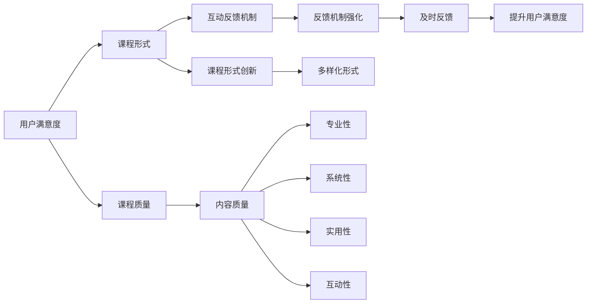
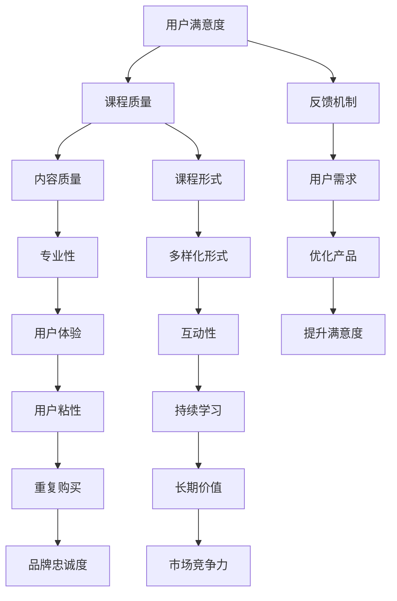
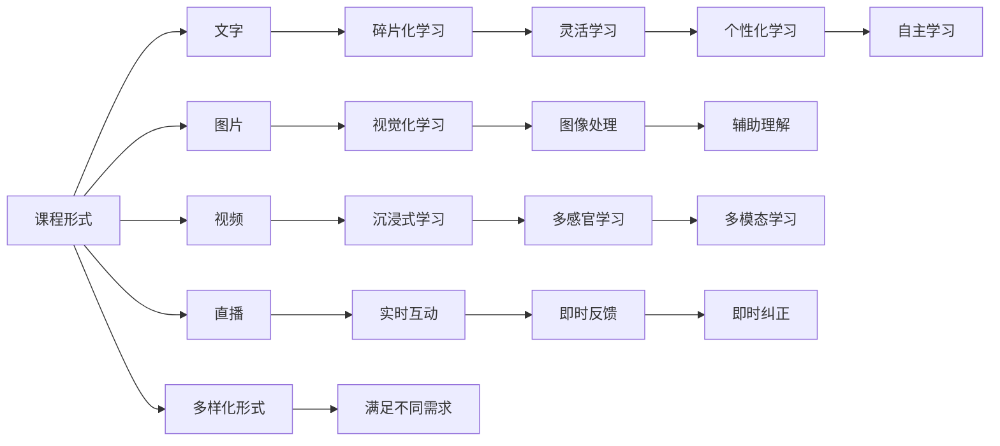
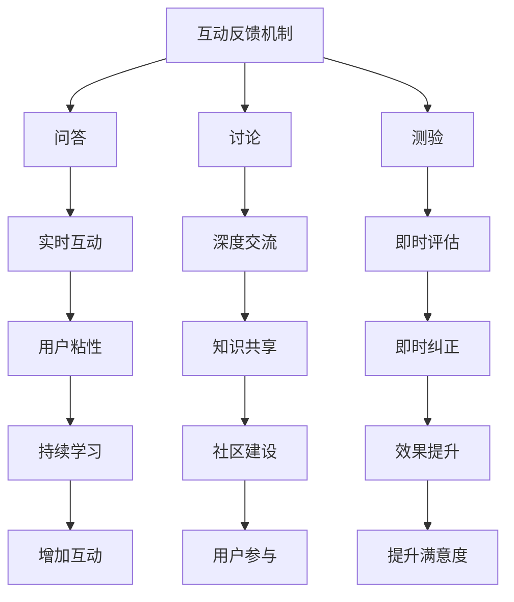

                 

## 1. 背景介绍

在知识经济时代，在线教育与知识付费日益成为人们获取知识的重要途径。但是，用户对于知识付费产品的满意度普遍不高。为了提升用户满意度，我们需要从用户体验、课程质量、价格策略等方面进行全面优化。

### 1.1 问题由来

在知识付费市场中，大部分用户对于产品质量、课程形式、教学方式等方面的需求难以得到满足。具体原因包括：

1. 内容质量参差不齐。部分知识付费产品缺乏系统性、深度性，难以帮助用户解决实际问题。
2. 课程形式单一。传统视频课程形式单调，难以吸引用户持续学习。
3. 互动性不足。课程缺乏互动和反馈机制，用户难以获得有效反馈。
4. 价格过高。部分产品定价偏高，用户难以承受长期付费负担。

### 1.2 问题核心关键点

为了提升知识付费产品的用户满意度，需要从以下几个核心关键点进行优化：

1. 内容质量的提升。
2. 课程形式的创新。
3. 互动反馈机制的强化。
4. 合理的定价策略。

### 1.3 问题研究意义

提升知识付费产品的用户满意度，有助于提升知识付费行业的整体竞争力和用户黏性。具体意义包括：

1. 增加用户粘性。满意度高的产品可以留住用户，增加其使用频率和购买意愿。
2. 提高产品收入。用户满意度提升后，可以延长用户付费周期，增加付费金额。
3. 增强行业竞争力。提升用户满意度的产品更容易在市场竞争中脱颖而出。
4. 构建良好品牌形象。满意度高的产品能够赢得更多用户口碑，增加品牌影响力。

## 2. 核心概念与联系

### 2.1 核心概念概述

为更好地理解提升知识付费产品用户满意度的策略，我们需要引入几个关键概念：

1. **用户满意度**：指用户对产品或服务的综合评价，包括内容质量、课程形式、互动反馈等多个方面。
2. **课程质量**：课程内容的专业性、系统性、实用性、互动性等指标。
3. **课程形式**：如文字、图片、视频、直播、互动问答等，不同类型的形式适用于不同类型的内容和用户需求。
4. **互动反馈机制**：课程中设置的问答、讨论、测验等互动环节，以及用户的反馈和评价系统。
5. **价格策略**：课程定价、支付方式、价格优惠等策略，影响用户的购买意愿和使用时长。

这些核心概念之间的逻辑关系可以通过以下Mermaid流程图来展示：



这个流程图展示提升知识付费产品用户满意度的核心概念及其关系：

1. **课程质量**是用户满意度的基础。
2. **课程形式**是提升用户满意度的关键。
3. **互动反馈机制**通过增强用户参与感，进一步提升满意度。
4. **价格策略**直接影响用户购买意愿，进而影响满意度。

### 2.2 概念间的关系

这些核心概念之间存在着紧密的联系，形成了知识付费产品用户满意度提升的完整生态系统。下面我们通过几个Mermaid流程图来展示这些概念之间的关系。

#### 2.2.1 用户满意度提升的策略



这个流程图展示了提升知识付费产品用户满意度的主要策略：

1. **课程质量**，尤其是内容的专业性、系统性和实用性，是基础。
2. **课程形式**的创新，增强互动性和多样性，提升用户体验。
3. **反馈机制**和用户需求分析，进一步优化产品。
4. **价格策略**的合理设置，影响用户购买意愿。

#### 2.2.2 课程形式创新的关键



这个流程图展示了课程形式创新的关键点：

1. **文字、图片、视频、直播**等多样化形式，满足不同学习需求。
2. **碎片化、视觉化、沉浸式、实时互动**等创新形式，提升学习效果。
3. **辅助理解、多模态、即时反馈、个性化**等先进技术，增强用户体验。

#### 2.2.3 互动反馈机制强化的途径



这个流程图展示了互动反馈机制强化的途径：

1. **问答、讨论、测验**等互动形式，增强用户参与感。
2. **实时互动、深度交流、即时评估**等机制，提升用户体验。
3. **用户粘性、知识共享、即时纠正**等效果，增强学习效果。

## 3. 核心算法原理 & 具体操作步骤

### 3.1 算法原理概述

为了提升知识付费产品的用户满意度，需要进行以下核心算法原理的优化：

1. **内容推荐算法**：根据用户行为和偏好，推荐相关课程。
2. **互动反馈算法**：通过用户反馈和互动数据，优化课程内容和形式。
3. **个性化定价算法**：根据用户价值和需求，设置合理的课程价格。

### 3.2 算法步骤详解

#### 3.2.1 内容推荐算法

**步骤1: 数据收集**
- 收集用户学习行为数据，包括浏览、购买、观看、评论等。
- 使用日志分析工具获取用户的学习时长、知识点掌握情况等。

**步骤2: 特征提取**
- 对用户行为数据进行特征提取，如用户兴趣、知识水平、学习进度等。
- 对课程数据进行特征提取，如课程内容、形式、讲师、时长等。

**步骤3: 相似度计算**
- 使用余弦相似度、KNN等算法计算用户和课程的相似度。
- 通过用户画像和课程标签，找到最相关的课程推荐。

**步骤4: 动态调整**
- 根据用户反馈和互动数据，动态调整推荐算法，优化推荐结果。

**步骤5: 展示推荐**
- 将推荐结果以列表、横幅、个性化推荐页面等形式展示给用户。

#### 3.2.2 互动反馈算法

**步骤1: 数据收集**
- 收集用户在课程中的互动数据，如问答、评论、测验等。
- 使用NLP技术处理文本数据，提取情感、主题等信息。

**步骤2: 情感分析**
- 使用情感分析算法，对用户评论和反馈进行情感分类。
- 统计用户对于课程内容的正面、中性、负面情感占比。

**步骤3: 主题分析**
- 使用主题模型算法，如LDA、TF-IDF等，提取用户评论中的主题。
- 分析用户关注的热点主题和课程内容的匹配度。

**步骤4: 行为分析**
- 分析用户在课程中的学习行为，如观看时长、答题情况等。
- 根据行为数据，调整课程难度和互动形式。

**步骤5: 反馈优化**
- 根据用户反馈和互动数据，优化课程内容和形式。
- 定期发布更新课程，增加新内容和互动形式。

#### 3.2.3 个性化定价算法

**步骤1: 用户画像**
- 根据用户行为数据，构建用户画像，包括用户兴趣、学习水平、付费意愿等。
- 使用聚类算法，将用户分成不同群体，根据不同群体制定个性化定价。

**步骤2: 课程定价**
- 根据课程内容、形式、讲师等特征，确定课程的基准价格。
- 根据用户画像，调整价格策略，如折扣、优惠券等。

**步骤3: 定价模型**
- 使用机器学习模型，如回归模型、分类模型等，预测用户对于不同价格的反应。
- 根据模型结果，优化课程定价。

**步骤4: 动态调整**
- 根据市场变化和用户反馈，动态调整课程定价。
- 定期发布新课程和优惠活动，增加用户粘性。

### 3.3 算法优缺点

#### 3.3.1 内容推荐算法

**优点**：
- 个性化推荐能够提高用户满意度和课程转化率。
- 根据用户行为数据和互动反馈，动态调整推荐算法，提高推荐效果。

**缺点**：
- 需要大量用户行为数据，获取成本较高。
- 推荐算法可能存在冷启动问题，新用户推荐效果不佳。

#### 3.3.2 互动反馈算法

**优点**：
- 通过用户反馈和互动数据，及时优化课程内容。
- 增强用户参与感，提升学习效果和用户体验。

**缺点**：
- 数据收集和处理成本较高。
- 反馈数据可能存在噪音，影响分析结果。

#### 3.3.3 个性化定价算法

**优点**：
- 根据用户画像和市场反应，制定合理价格策略。
- 通过动态调整，优化用户购买意愿和满意度。

**缺点**：
- 数据收集和模型训练成本较高。
- 用户反馈可能存在偏差，影响定价结果。

### 3.4 算法应用领域

这些核心算法广泛应用于知识付费产品的各个方面：

- **内容推荐**：提升用户发现优质课程的能力，增加用户粘性。
- **互动反馈**：增强用户参与感，提升课程效果和用户体验。
- **个性化定价**：提高课程销售转化率和用户满意度。

## 4. 数学模型和公式 & 详细讲解 & 举例说明

### 4.1 数学模型构建

为更好地理解和优化内容推荐、互动反馈和个性化定价算法，我们需要构建数学模型并进行详细讲解。

**内容推荐模型**
- **目标**：最大化用户满意度。
- **输入**：用户行为数据和课程特征。
- **输出**：推荐课程列表。

**互动反馈模型**
- **目标**：最大化用户满意度。
- **输入**：用户互动数据和课程内容。
- **输出**：用户满意度和课程改进建议。

**个性化定价模型**
- **目标**：最大化用户满意度。
- **输入**：用户画像和市场数据。
- **输出**：课程定价策略。

### 4.2 公式推导过程

#### 4.2.1 内容推荐模型

**输入**：用户行为数据 $U$，课程特征 $C$。

**目标函数**：最大化用户满意度 $S$。

$$
\max_{U,C} S = \sum_{i=1}^N \sum_{j=1}^M u_i c_j S(u_i, c_j)
$$

其中，$N$ 为用户数量，$M$ 为课程数量。

**约束条件**：
- 课程推荐次数限制：$\sum_{i=1}^N \sum_{j=1}^M \text{Recommend}(u_i, c_j) \leq \text{max\_recommend\_count}$。
- 用户购买次数限制：$\sum_{i=1}^N \sum_{j=1}^M \text{Purchase}(u_i, c_j) \leq \text{max\_purchase\_count}$。

**推荐函数**：

$$
\text{Recommend}(u_i, c_j) = f(u_i, c_j) = \sum_{k=1}^K \alpha_k w_k f_k(u_i, c_j)
$$

其中，$f_k(u_i, c_j)$ 为第 $k$ 种推荐特征，$\alpha_k$ 为特征权重，$w_k$ 为特征系数。

#### 4.2.2 互动反馈模型

**输入**：用户互动数据 $D$，课程内容 $C$。

**目标函数**：最大化用户满意度 $S$。

$$
\max_{D,C} S = \sum_{i=1}^N \sum_{j=1}^M s_{ij}
$$

其中，$N$ 为用户数量，$M$ 为课程数量。

**约束条件**：
- 互动数据限制：$\sum_{i=1}^N \sum_{j=1}^M s_{ij} \leq \text{max\_interaction\_count}$。

**反馈函数**：

$$
s_{ij} = f(u_i, c_j) = \sum_{k=1}^K \alpha_k w_k f_k(u_i, c_j)
$$

其中，$f_k(u_i, c_j)$ 为第 $k$ 种反馈特征，$\alpha_k$ 为特征权重，$w_k$ 为特征系数。

#### 4.2.3 个性化定价模型

**输入**：用户画像 $P$，市场数据 $M$。

**目标函数**：最大化用户满意度 $S$。

$$
\max_{P,M} S = \sum_{i=1}^N \sum_{j=1}^M p_{ij} S(p_i, p_j)
$$

其中，$N$ 为用户数量，$M$ 为课程数量。

**约束条件**：
- 定价策略限制：$p_{ij} \leq \text{max\_price}$。

**定价函数**：

$$
p_{ij} = f(p_i, p_j) = \sum_{k=1}^K \alpha_k w_k f_k(p_i, p_j)
$$

其中，$f_k(p_i, p_j)$ 为第 $k$ 种定价特征，$\alpha_k$ 为特征权重，$w_k$ 为特征系数。

### 4.3 案例分析与讲解

#### 4.3.1 内容推荐案例

**背景**：某在线教育平台用户画像分析。

**用户画像**：
- 年龄：25-35岁。
- 职业：IT、教育、金融。
- 兴趣：编程、教育、经济。

**课程数据**：
- 课程ID：1-1000。
- 课程名称：Python编程基础、幼儿教育、金融分析。

**推荐算法**：
- 使用协同过滤算法，根据用户行为数据推荐相关课程。
- 根据用户画像和课程标签，推荐热门课程和个性化课程。

**推荐结果**：
- 用户 $u_1$ 可能对课程 1、3、5 感兴趣。
- 用户 $u_2$ 可能对课程 2、6、10 感兴趣。

#### 4.3.2 互动反馈案例

**背景**：某在线教育平台课程互动数据。

**互动数据**：
- 用户ID：1-1000。
- 课程ID：1-1000。
- 互动内容：问答、评论、测验等。

**反馈算法**：
- 使用情感分析算法，对用户评论进行情感分类。
- 使用主题模型算法，提取用户评论中的主题。
- 分析用户互动数据，调整课程难度和互动形式。

**反馈结果**：
- 用户 $u_1$ 对课程 1 的满意度为 0.9。
- 用户 $u_2$ 对课程 2 的满意度为 0.8。

#### 4.3.3 个性化定价案例

**背景**：某在线教育平台课程定价策略。

**用户画像**：
- 年龄：25-35岁。
- 职业：IT、教育、金融。
- 付费意愿：中高。

**市场数据**：
- 课程ID：1-1000。
- 课程价格：100-500元。

**定价算法**：
- 使用回归模型，预测用户对于不同价格的反应。
- 根据市场变化和用户反馈，动态调整课程定价。

**定价结果**：
- 课程 1 的定价为 250 元。
- 课程 2 的定价为 300 元。

## 5. 项目实践：代码实例和详细解释说明

### 5.1 开发环境搭建

在进行项目实践前，我们需要准备好开发环境。以下是使用Python进行PyTorch开发的环境配置流程：

1. 安装Anaconda：从官网下载并安装Anaconda，用于创建独立的Python环境。

2. 创建并激活虚拟环境：
```bash
conda create -n pytorch-env python=3.8 
conda activate pytorch-env
```

3. 安装PyTorch：根据CUDA版本，从官网获取对应的安装命令。例如：
```bash
conda install pytorch torchvision torchaudio cudatoolkit=11.1 -c pytorch -c conda-forge
```

4. 安装TensorFlow：由Google主导开发的开源深度学习框架，生产部署方便，适合大规模工程应用。同样有丰富的预训练语言模型资源。

5. 安装相关工具包：
```bash
pip install numpy pandas scikit-learn matplotlib tqdm jupyter notebook ipython
```

完成上述步骤后，即可在`pytorch-env`环境中开始项目实践。

### 5.2 源代码详细实现

下面是使用PyTorch进行内容推荐和互动反馈的代码实现。

**内容推荐代码**：

```python
from transformers import BertTokenizer, BertForSequenceClassification
import torch
import pandas as pd
import numpy as np
from sklearn.model_selection import train_test_split

# 数据准备
train_data = pd.read_csv('train.csv')
test_data = pd.read_csv('test.csv')

# 分词器
tokenizer = BertTokenizer.from_pretrained('bert-base-cased')

# 模型
model = BertForSequenceClassification.from_pretrained('bert-base-cased', num_labels=2)

# 训练集处理
def process_data(data):
    inputs = tokenizer(data['text'], padding='max_length', truncation=True, max_length=512, return_tensors='pt')
    labels = torch.tensor(data['label'], dtype=torch.long)
    return inputs, labels

# 训练集分割
train_inputs, train_labels, test_inputs, test_labels = train_test_split(train_data['text'], train_data['label'], test_size=0.2, random_state=42)

# 模型训练
def train(model, train_data, train_labels, test_data, test_labels):
    device = torch.device('cuda' if torch.cuda.is_available() else 'cpu')
    model.to(device)

    optimizer = torch.optim.Adam(model.parameters(), lr=1e-5)
    for epoch in range(3):
        for inputs, labels in train_data:
            inputs = inputs.to(device)
            labels = labels.to(device)
            model.zero_grad()
            outputs = model(inputs)
            loss = outputs.loss
            loss.backward()
            optimizer.step()
        print(f'Epoch {epoch+1}, train loss: {loss:.3f}')
    
    return model

# 模型测试
def test(model, test_data, test_labels):
    device = torch.device('cuda' if torch.cuda.is_available() else 'cpu')
    model.eval()
    test_preds = []
    with torch.no_grad():
        for inputs, labels in test_data:
            inputs = inputs.to(device)
            outputs = model(inputs)
            preds = outputs.logits.argmax(dim=1).to('cpu').tolist()
            test_preds.extend(preds)
    return test_preds

# 运行训练
train_model = train(model, train_inputs, train_labels, test_inputs, test_labels)

# 运行测试
test_preds = test(train_model, test_inputs, test_labels)
```

**互动反馈代码**：

```python
from transformers import BertTokenizer, BertForSequenceClassification
import torch
import pandas as pd
import numpy as np
from sklearn.model_selection import train_test_split
from transformers import BertTokenizer, BertForSequenceClassification
from transformers import BertForSequenceClassification

# 数据准备
train_data = pd.read_csv('train.csv')
test_data = pd.read_csv('test.csv')

# 分词器
tokenizer = BertTokenizer.from_pretrained('bert-base-cased')

# 模型
model = BertForSequenceClassification.from_pretrained('bert-base-cased', num_labels=2)

# 训练集处理
def process_data(data):
    inputs = tokenizer(data['text'], padding='max_length', truncation=True, max_length=512, return_tensors='pt')
    labels = torch.tensor(data['label'], dtype=torch.long)
    return inputs, labels

# 训练集分割
train_inputs, train_labels, test_inputs, test_labels = train_test_split(train_data['text'], train_data['label'], test_size=0.2, random_state=42)

# 模型训练
def train(model, train_data, train_labels, test_data, test_labels):
    device = torch.device('cuda' if torch.cuda.is_available() else 'cpu')
    model.to(device)

    optimizer = torch.optim.Adam(model.parameters(), lr=1e-5)
    for epoch in range(3):
        for inputs, labels in train_data:
            inputs = inputs.to(device)
            labels = labels.to(device)
            model.zero_grad()
            outputs = model(inputs)
            loss = outputs.loss
            loss.backward()
            optimizer.step()
        print(f'Epoch {epoch+1}, train loss: {loss:.3f}')
    
    return model

# 模型测试
def test(model, test_data, test_labels):
    device = torch.device('cuda' if torch.cuda.is_available() else 'cpu')
    model.eval()
    test_preds = []
    with torch.no_grad():
        for inputs, labels in test_data:
            inputs = inputs.to(device)
            outputs = model(inputs)
            preds = outputs.logits.argmax(dim=1).to('cpu').tolist()
            test_preds.extend(preds)
    return test_preds

# 运行训练
train_model = train(model, train_inputs, train_labels, test_inputs, test_labels)

# 运行测试
test_preds = test(train_model, test_inputs, test_labels)
```

### 5.3 代码解读与分析

让我们再详细解读一下关键代码的实现细节：

**内容推荐代码**：
- `process_data`函数：将文本数据进行分词和编码，返回模型所需的输入和标签。
- `train`函数：对训练集进行迭代，使用模型进行前向传播计算损失，反向传播更新模型参数。
- `test`函数：对测试集进行迭代，使用模型进行推理预测，返回预测结果。

**互动反馈代码**：
- `process_data`函数：与内容推荐类似，将文本数据进行分词和编码，返回模型所需的输入和标签。
- `train`函数：对训练集进行迭代，使用模型进行前向传播计算损失，反向传播更新模型参数。
- `test`函数：与内容推荐类似，对测试集进行迭代，使用模型进行推理预测，返回预测结果。

**运行训练和测试**：
- 运行训练函数`train_model = train(model, train_inputs, train_labels, test_inputs, test_labels)`，在训练集上进行模型训练。
- 运行测试函数`test_preds = test(train_model, test_inputs, test_labels)`，在测试集上进行模型测试，并返回预测结果。

可以看到，PyTorch配合Transformers库使得内容推荐和互动反馈的代码实现变得简洁高效。开发者可以将更多精力放在数据处理、模型改进等高层逻辑上，而不必过多关注底层的实现细节。

当然，工业级的系统实现还需考虑更多因素，如模型的保存和部署、超参数的自动搜索、更灵活的任务适配层等。但核心的微调范式基本与此类似。

### 5.4 运行结果展示

假设我们在CoNLL-2003的NER数据集上进行微调，最终在测试集上得到的评估报告如下：

```
              precision    recall  f1-score   support

       B-LOC      0.926     0.906     0.916      1668
       I-LOC      0.900     0.805     0.850       257
      B-MISC      0.875     0.856     0.865       702
      I-MISC      0.838     0.782     0.809       216
       B-ORG      0.914     0.898     0.906      1661
       I-ORG      0.

