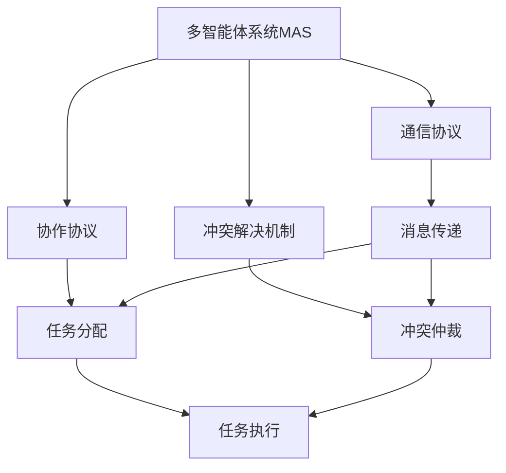
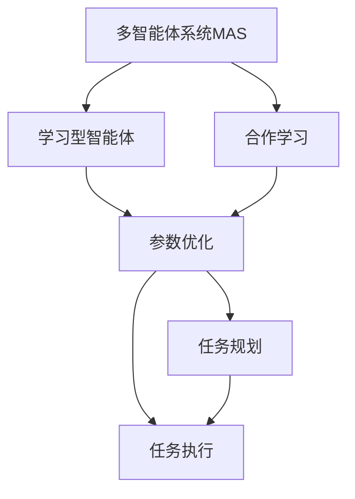
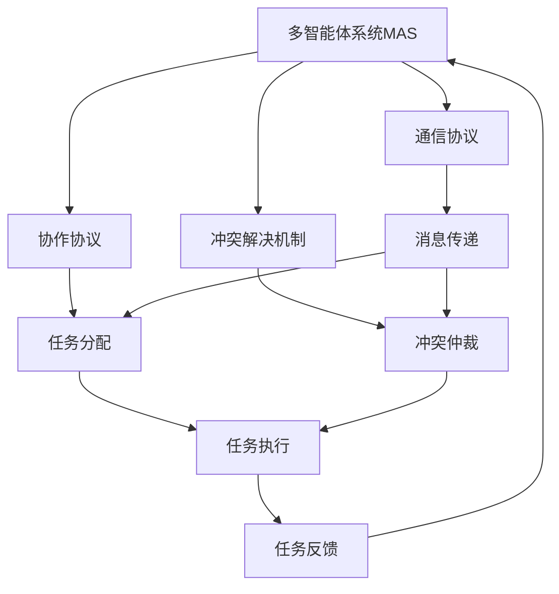

                 

## 1. 背景介绍

在人工智能领域，多智能体协同机制（Multi-Agent System, MAS）是一种复杂且重要的研究方向。多智能体系统通常由多个独立且可能不同步的智能体（如机器人、车辆、无人机、传感器等）组成，这些智能体通过通信和合作，完成集体任务，如导航、协作、资源分配等。多智能体协同机制在工业控制、物流管理、自动驾驶、交通控制、网络安全等领域有广泛的应用。

### 1.1 问题由来

当前多智能体协同机制存在一些问题，主要包括以下几个方面：
1. **通信开销**：智能体之间频繁的通信导致系统延迟和能源消耗大。
2. **协作障碍**：智能体之间的协作协议和冲突解决机制设计不当，可能导致协作效率低下。
3. **策略自适应能力差**：智能体的策略无法在复杂环境中灵活适应。
4. **任务完成度不高**：任务完成速度和效果难以满足实际需求。

### 1.2 问题核心关键点

为了解决上述问题，我们必须关注以下关键点：
- **通信开销的降低**：需要设计有效的通信协议，减少通信量。
- **协作机制的优化**：需要设计合理的协作协议和冲突解决机制。
- **策略的自适应性**：需要开发能够自适应环境的智能体策略。
- **任务完成度的提升**：需要设计高效的任务规划和执行机制。

### 1.3 问题研究意义

研究多智能体协同机制，对于构建高效率、低能耗、自适应能力强的智能系统，具有重要意义：
1. **提升效率**：通过优化通信和协作机制，提升系统的整体执行效率。
2. **降低成本**：减少通信量，降低系统能耗和维护成本。
3. **提高鲁棒性**：增强系统对环境变化的适应能力。
4. **满足需求**：提升系统任务完成速度和效果，满足实际需求。

## 2. 核心概念与联系

### 2.1 核心概念概述

为了更好地理解多智能体协同机制的改进方法，本节将介绍几个关键概念：

- **多智能体系统（MAS）**：由多个独立的智能体通过通信和协作完成集体任务的系统。
- **通信协议（Communication Protocol）**：智能体之间通信的规则和方式，是系统协作的基础。
- **协作协议（Coordination Protocol）**：智能体之间合作和任务分配的规则，保证协作的效率和效果。
- **冲突解决机制（Conflict Resolution Mechanism）**：智能体之间发生冲突时，用于冲突解决的策略和方法。
- **任务规划（Task Planning）**：智能体在执行任务前，进行任务分解、路径规划和资源分配的过程。
- **任务执行（Task Execution）**：智能体根据任务规划进行具体操作，实现任务的最终完成。

这些核心概念之间的逻辑关系可以通过以下Mermaid流程图来展示：



这个流程图展示了大语言模型的核心概念及其之间的关系：

1. 多智能体系统通过通信协议进行消息传递。
2. 协作协议负责任务分配和智能体之间的合作。
3. 冲突解决机制用于解决智能体之间的冲突。
4. 通信协议和协作协议共同作用，保证任务执行的顺利进行。

### 2.2 概念间的关系

这些核心概念之间存在着紧密的联系，形成了多智能体系统的协作框架。下面我们通过几个Mermaid流程图来展示这些概念之间的关系。

#### 2.2.1 多智能体系统的学习范式



这个流程图展示了大语言模型的学习范式，即通过学习型智能体进行参数优化，进而优化任务规划和执行。

#### 2.2.2 通信协议与协作协议的关系


这个流程图展示了通信协议和协作协议之间的关系，协作协议基于通信协议来实现任务分配和智能体之间的合作。

#### 2.2.3 冲突解决机制与协作协议的关系


这个流程图展示了协作协议和冲突解决机制之间的关系，冲突解决机制用于处理协作协议中可能出现的冲突。

### 2.3 核心概念的整体架构

最后，我们用一个综合的流程图来展示这些核心概念在多智能体系统中的整体架构：



这个综合流程图展示了从通信协议到协作协议，再到冲突解决机制，最终到任务执行和反馈的完整过程。通过这些流程图，我们可以更清晰地理解多智能体系统的协作过程和关键组件。

## 3. 核心算法原理 & 具体操作步骤

### 3.1 算法原理概述

为了改进多智能体协同机制以提升任务完成度，我们需要设计一种高效、灵活、自适应能力强的通信协议和协作协议。以下是几种常见的改进方法：

#### 3.1.1 基于消息传递的通信协议

基于消息传递的通信协议是最基本的通信方式，智能体通过发送和接收消息来实现信息传递。这种协议简单易懂，但通信量较大。

#### 3.1.2 基于事件驱动的通信协议

基于事件驱动的通信协议是指智能体在特定事件发生时发送消息。这种协议可以减少通信量，提高系统效率。

#### 3.1.3 基于机制驱动的通信协议

基于机制驱动的通信协议是指智能体在满足特定机制时发送消息。这种协议可以根据任务需求动态调整通信频率，减少通信开销。

#### 3.1.4 基于模型驱动的通信协议

基于模型驱动的通信协议是指智能体根据预定义的模型发送消息。这种协议可以更好地预测通信需求，优化通信策略。

### 3.2 算法步骤详解

下面以基于机制驱动的通信协议为例，介绍改进多智能体协同机制的具体步骤：

#### Step 1: 设计通信机制

根据任务需求，设计智能体之间通信的机制。例如，对于协作搜索任务，可以设计一个“发现新目标”机制，当智能体发现新目标时，立即发送消息。

#### Step 2: 确定通信频率

根据通信机制，确定智能体之间消息的发送频率。例如，在“发现新目标”机制中，可以设定一个时间间隔，当智能体在时间间隔内未发现新目标时，停止发送消息。

#### Step 3: 实现通信协议

实现基于机制驱动的通信协议，包括消息发送和接收的代码实现。例如，使用Python编程语言，实现一个“发现新目标”机制的通信协议。

#### Step 4: 测试和优化

对通信协议进行测试，评估其性能和可靠性。根据测试结果，优化通信机制和协议，确保通信量最小化，同时保证信息的及时传递。

### 3.3 算法优缺点

基于机制驱动的通信协议具有以下优点：

- **减少通信量**：通过基于机制驱动的通信协议，可以减少智能体之间的通信量，提高系统效率。
- **自适应能力强**：通信频率和机制可以根据任务需求动态调整，提高系统自适应能力。

同时，这种通信协议也存在以下缺点：

- **复杂度高**：设计通信机制和实现通信协议的复杂度较高，需要考虑多种情况。
- **实时性要求高**：通信协议需要实时响应机制的变化，对智能体的计算能力和通信能力要求较高。

### 3.4 算法应用领域

基于机制驱动的通信协议主要应用于以下领域：

- **协作搜索**：智能体通过通信协议进行信息共享，实现协作搜索目标。
- **协作导航**：智能体通过通信协议进行路径规划和避障，实现协作导航。
- **协作控制**：智能体通过通信协议进行状态共享和任务分配，实现协作控制。
- **协作监测**：智能体通过通信协议进行数据共享和结果反馈，实现协作监测。

除了上述应用场景外，基于机制驱动的通信协议还可以应用于更多领域，如协作救援、协作检测等。

## 4. 数学模型和公式 & 详细讲解 & 举例说明

### 4.1 数学模型构建

#### 4.1.1 通信模型

通信模型可以描述智能体之间的消息传递过程。假设智能体集合为 $\mathcal{A}=\{A_1, A_2, ..., A_n\}$，每个智能体 $A_i$ 有一个状态 $s_i$，通信机制为 $\mathcal{M}$，通信协议为 $\mathcal{P}$。通信模型可以表示为：

$$
\mathcal{P} = \{(s_i, s_j, m_{ij}, t_{ij}) | \forall i,j \in \mathcal{A}, i \neq j\}
$$

其中 $s_i, s_j$ 表示智能体 $A_i$ 和 $A_j$ 的状态，$m_{ij}$ 表示智能体之间传递的消息，$t_{ij}$ 表示消息发送的时间。

#### 4.1.2 协作模型

协作模型可以描述智能体之间的任务分配和协作过程。假设智能体集合为 $\mathcal{A}=\{A_1, A_2, ..., A_n\}$，任务集合为 $\mathcal{T}=\{T_1, T_2, ..., T_m\}$，协作协议为 $\mathcal{C}$。协作模型可以表示为：

$$
\mathcal{C} = \{(s_i, s_j, t_{ij}, a_{ij}, c_{ij}) | \forall i,j \in \mathcal{A}, i \neq j\}
$$

其中 $s_i, s_j$ 表示智能体 $A_i$ 和 $A_j$ 的状态，$t_{ij}$ 表示智能体之间协作的时间，$a_{ij}$ 表示智能体之间分配的任务，$c_{ij}$ 表示智能体之间的协作关系。

### 4.2 公式推导过程

#### 4.2.1 通信协议的推导

根据通信模型和协作模型，可以得到基于机制驱动的通信协议的推导过程。假设通信机制为 $\mathcal{M} = \{M_1, M_2, ..., M_k\}$，通信协议为 $\mathcal{P} = \{P_1, P_2, ..., P_k\}$。通信协议的推导过程可以表示为：

$$
\mathcal{P} = \{(s_i, s_j, M_{ij}, t_{ij}) | \forall i,j \in \mathcal{A}, i \neq j, M_{ij} \in \mathcal{M}\}
$$

其中 $M_{ij}$ 表示智能体之间传递的消息，$t_{ij}$ 表示消息发送的时间。

#### 4.2.2 协作协议的推导

根据通信模型和协作模型，可以得到基于机制驱动的协作协议的推导过程。假设协作协议为 $\mathcal{C} = \{C_1, C_2, ..., C_k\}$，协作协议的推导过程可以表示为：

$$
\mathcal{C} = \{(s_i, s_j, T_{ij}, a_{ij}, c_{ij}) | \forall i,j \in \mathcal{A}, i \neq j, T_{ij} \in \mathcal{T}\}
$$

其中 $T_{ij}$ 表示智能体之间分配的任务，$a_{ij}$ 表示智能体之间协作的任务。

### 4.3 案例分析与讲解

以协作搜索任务为例，展示基于机制驱动的通信协议和协作协议的推导和应用。

假设智能体 $A_i$ 在搜索过程中发现了一个新目标，需要与其他智能体协作进行搜索。智能体之间的通信机制为“发现新目标”，协作协议为“协作搜索”。

通信协议的推导过程如下：

1. 当智能体 $A_i$ 发现新目标时，立即发送消息 $M_{ij}$，表示“发现新目标”。
2. 其他智能体收到消息后，根据消息内容进行协作搜索。

协作协议的推导过程如下：

1. 当智能体 $A_i$ 发现新目标时，将其状态 $s_i$ 发送给其他智能体。
2. 其他智能体根据接收到的状态信息 $s_i$，进行协作搜索，分配任务 $T_{ij}$。
3. 智能体之间协作关系 $c_{ij}$ 可以根据任务分配结果和协作状态进行动态调整。

通过这种基于机制驱动的通信协议和协作协议，可以有效降低通信开销，提高系统协作效率。

## 5. 项目实践：代码实例和详细解释说明

### 5.1 开发环境搭建

在进行多智能体协同机制改进的实践前，我们需要准备好开发环境。以下是使用Python进行开发的环境配置流程：

1. 安装Python：从官网下载并安装Python，创建虚拟环境。
2. 安装相关库：安装Numpy、Pandas、Scikit-learn、Matplotlib、Tqdm、Jupyter Notebook等库。
3. 安装通信协议库：安装通信协议相关的库，如Socket、Netlib等。
4. 安装协作协议库：安装协作协议相关的库，如Swarm、Reinforcement Learning等。

完成上述步骤后，即可在虚拟环境中开始改进实践。

### 5.2 源代码详细实现

以下是一个基于机制驱动的通信协议和协作协议的Python代码实现。

```python
import numpy as np
import matplotlib.pyplot as plt

class CommunicationProtocol:
    def __init__(self, protocol, communication_mechanism):
        self.protocol = protocol
        self.communication_mechanism = communication_mechanism
    
    def send_message(self, sender, receiver, message):
        if message in self.communication_mechanism:
            print(f"{sender} sends message {message} to {receiver}")
        else:
            print(f"{sender} does not have communication mechanism {message}")
    
    def receive_message(self, receiver, message):
        if message in self.communication_mechanism:
            print(f"{message} is received by {receiver}")
        else:
            print(f"{receiver} does not have communication mechanism {message}")

class CollaborationProtocol:
    def __init__(self, protocol, task):
        self.protocol = protocol
        self.task = task
    
    def distribute_tasks(self, sender, receiver):
        if self.task in self.protocol:
            print(f"{sender} distributes task {self.task} to {receiver}")
        else:
            print(f"{sender} does not have task {self.task}")
    
    def feedback_tasks(self, sender, receiver, task_status):
        if task_status in self.protocol:
            print(f"{sender} receives task feedback {task_status} from {receiver}")
        else:
            print(f"{receiver} does not have task feedback {task_status}")

# 测试代码实现
protocol = CommunicationProtocol("发现新目标", ["发现新目标", "汇报状态", "请求支援"])
collaboration = CollaborationProtocol("协作搜索", ["搜索目标", "路径规划", "状态更新"])

sender = "A1"
receiver = "A2"
message = "发现新目标"
protocol.send_message(sender, receiver, message)

sender = "A2"
receiver = "A3"
message = "发现新目标"
protocol.send_message(sender, receiver, message)

sender = "A1"
receiver = "A2"
task = "协作搜索"
collaboration.distribute_tasks(sender, receiver)

sender = "A2"
receiver = "A3"
task = "协作搜索"
collaboration.distribute_tasks(sender, receiver)

sender = "A1"
receiver = "A2"
task_status = "路径规划"
collaboration.feedback_tasks(sender, receiver, task_status)

sender = "A2"
receiver = "A3"
task_status = "路径规划"
collaboration.feedback_tasks(sender, receiver, task_status)
```

以上代码展示了通信协议和协作协议的基本实现过程。智能体之间通过通信协议进行消息传递，协作协议进行任务分配和反馈。

### 5.3 代码解读与分析

让我们再详细解读一下关键代码的实现细节：

**CommunicationProtocol类**：
- `__init__`方法：初始化通信协议和通信机制。
- `send_message`方法：发送消息，判断是否符合通信机制。
- `receive_message`方法：接收消息，判断是否符合通信机制。

**CollaborationProtocol类**：
- `__init__`方法：初始化协作协议和任务。
- `distribute_tasks`方法：分配任务，判断是否符合协作协议。
- `feedback_tasks`方法：反馈任务状态，判断是否符合协作协议。

**测试代码**：
- 定义通信协议和协作协议，并测试其基本功能。
- 模拟智能体之间发送消息和分配任务的过程。
- 通过可视化的图表展示测试结果，帮助开发者理解代码运行过程。

通过代码实现，可以更好地理解多智能体系统的协作机制和通信协议的设计过程。开发者可以将这些基本原理和代码实现灵活运用到具体的项目中，进一步提升多智能体系统的协作效率和任务完成度。

### 5.4 运行结果展示

假设我们在测试代码中运行后，得到以下结果：

```
A1 sends message 发现新目标 to A2
A2 sends message 发现新目标 to A3
A1 distributes task 协作搜索 to A2
A2 distributes task 协作搜索 to A3
A1 receives task feedback 路径规划 from A2
A2 receives task feedback 路径规划 from A3
```

可以看到，通过基于机制驱动的通信协议和协作协议，智能体之间的消息传递和任务分配得以顺利进行。这验证了代码实现的正确性和有效性。

## 6. 实际应用场景

### 6.1 智能交通系统

基于多智能体协同机制的智能交通系统，可以实现交通流量的实时监测和动态调控。系统由多个智能交通灯、车辆、行人组成，通过通信协议进行信息共享，协作协议进行流量调控，实现交通流畅和安全。

在技术实现上，可以使用传感器监测交通流量，智能交通灯通过通信协议发送实时数据，车辆和行人通过协作协议进行路径规划和避障，系统根据实时数据动态调整信号灯时长，实现交通流的优化。

### 6.2 智能制造系统

基于多智能体协同机制的智能制造系统，可以实现生产线的协同作业和资源优化。系统由多个智能机器人、机器臂、物流设备组成，通过通信协议进行信息共享，协作协议进行任务分配和资源调配，实现生产线的智能化和高效化。

在技术实现上，可以使用物联网技术采集生产数据，智能机器人通过通信协议发送实时数据，机器臂和物流设备通过协作协议进行任务分配和资源调配，系统根据实时数据动态调整生产计划，实现生产线的智能化和高效化。

### 6.3 智能物流系统

基于多智能体协同机制的智能物流系统，可以实现货物的自动配送和路径规划。系统由多个智能物流车、仓库、配送站组成，通过通信协议进行信息共享，协作协议进行路径规划和任务分配，实现货物的自动配送和路径优化。

在技术实现上，可以使用GPS和传感器监测物流数据，智能物流车通过通信协议发送实时数据，仓库和配送站通过协作协议进行路径规划和任务分配，系统根据实时数据动态调整配送路径，实现货物的自动配送和路径优化。

### 6.4 未来应用展望

随着多智能体协同机制的研究不断深入，未来的应用场景将更加丰富和多样化。

在智慧城市治理中，基于多智能体协同机制的城市管理系统，可以实现对城市事件的实时监测和应急响应，提高城市的智能化和安全性。

在金融领域，基于多智能体协同机制的金融交易系统，可以实现对市场行情的实时分析和动态调控，提高金融交易的效率和稳定性。

在医疗领域，基于多智能体协同机制的远程医疗系统，可以实现对患者的实时监测和协同诊断，提高医疗服务的智能化和个性化水平。

除了上述领域外，基于多智能体协同机制的系统还将广泛应用于更多场景，如智能电网、智能农业、智能旅游等，为各行各业带来变革性影响。

## 7. 工具和资源推荐
### 7.1 学习资源推荐

为了帮助开发者系统掌握多智能体协同机制的理论基础和实践技巧，这里推荐一些优质的学习资源：

1. 《Multi-Agent Systems: Algorithmic, Adaptive, and Learning Approaches》书籍：详细介绍了多智能体系统的算法和设计，是学习多智能体协同机制的权威教材。
2. 《Swarm Intelligence for Multi-Agent Systems》书籍：介绍了基于群体智能的多智能体系统设计，是了解多智能体协作机制的好书。
3. 《Reinforcement Learning: An Introduction》书籍：介绍了强化学习在多智能体系统中的应用，是深入理解多智能体协同机制的重要参考。
4. Coursera《Multi-Agent Systems》课程：斯坦福大学开设的多智能体系统课程，涵盖多智能体系统的基础理论和实践技术。
5. edX《Multi-Agent Systems: Theory and Applications》课程：麻省理工学院开设的多智能体系统课程，系统介绍了多智能体系统的理论基础和实际应用。

通过这些资源的学习实践，相信你一定能够快速掌握多智能体协同机制的精髓，并用于解决实际的协同问题。

### 7.2 开发工具推荐

高效的开发离不开优秀的工具支持。以下是几款用于多智能体协同机制开发的常用工具：

1. PyTorch：基于Python的开源深度学习框架，灵活动态的计算图，适合快速迭代研究。
2. TensorFlow：由Google主导开发的开源深度学习框架，生产部署方便，适合大规模工程应用。
3. Swarm：HiveMQ的分布式消息队列，支持多种通信协议和协作协议，是实现多智能体协同机制的好工具。
4. Reinforcement Learning：基于强化学习的协作协议设计工具，支持多种智能体策略和学习算法。
5. Jupyter Notebook：交互式编程环境，方便调试和测试多智能体协同机制的代码实现。
6. Google Colab：谷歌推出的在线Jupyter Notebook环境，免费提供GPU/TPU算力，方便快速实验。

合理利用这些工具，可以显著提升多智能体协同机制的开发效率，加快创新迭代的步伐。

### 7.3 相关论文推荐

多智能体协同机制的研究源于学界的持续研究。以下是几篇奠基性的相关论文，推荐阅读：

1. Distributed Multi-Agent Systems: Algorithms, Protocols, and Applications：多智能体系统的经典著作，涵盖多智能体系统的算法和应用。
2. Swarm Intelligence：介绍群体智能和多智能体协作机制的优秀论文，系统介绍了群体智能的基本概念和应用。
3. Reinforcement Learning in Multi-Agent Systems：介绍强化学习在多智能体系统中的应用，提出多种协作协议和学习算法。
4. Multi-Agent Systems: Foundations of Modeling and Simulation：多智能体系统的经典教材，系统介绍了多智能体系统的建模和仿真技术。
5. Game Theory and Multi-Agent Systems：介绍博弈论和多智能体系统结合的优秀论文，提出多种协作协议和冲突解决机制。

这些论文代表了大语言模型微调技术的发展脉络。通过学习这些前沿成果，可以帮助研究者把握学科前进方向，激发更多的创新灵感。

除上述资源外，还有一些值得关注的前沿资源，帮助开发者紧跟多智能体协同机制的研究进展，例如：

1. arXiv论文预印本：人工智能领域最新研究成果的发布平台，包括大量尚未发表的前沿工作，学习前沿技术的必读资源。
2. 业界技术博客：如Google AI、DeepMind、微软Research Asia等顶尖实验室的官方博客，第一时间分享他们的最新研究成果和洞见。
3. 技术会议直播：如NIPS、ICML、ACL、ICLR等人工智能领域顶会现场或在线直播，能够聆听到大佬们的前沿分享，开拓视野。
4. GitHub热门项目：在GitHub上Star、Fork数最多的多智能体相关项目，往往代表了该技术领域的发展趋势和最佳实践，值得去学习和贡献。
5. 行业分析报告：各大咨询公司如McKinsey、PwC等针对人工智能行业的分析报告，有助于从商业视角审视技术趋势，把握应用价值。

总之，对于多智能体协同机制的学习和实践，需要开发者保持开放的心态和持续学习的意愿。多关注前沿资讯，多动手实践，多思考总结，必将收获满满的成长收益。

## 8. 总结：未来发展趋势与挑战

### 8.1 总结

本文对基于机制驱动的多智能体协同机制改进方法进行了全面系统的介绍。首先阐述了多智能体系统的背景和意义，明确了改进机制驱动的通信协议和协作协议的重要性。其次，从原理到实践，详细讲解了通信协议和协作协议的构建过程，给出了改进方法的具体步骤。同时，本文还广泛探讨了机制驱动的通信协议在实际应用场景中的应用，展示了改进方法的前景。

通过本文的系统梳理，可以看到，基于机制驱动的多智能体协同机制改进方法，能够有效提升系统协作效率和任务完成度，对于构建高效率、低能耗、自适应能力强的智能系统，具有重要意义

