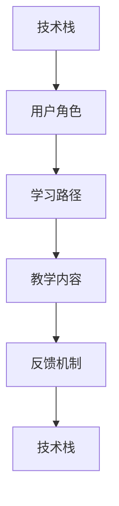

                 

## 1. 背景介绍

在信息化时代，技术的应用变得越来越普及，用户教育的重要性愈发凸显。无论是为了提升用户体验，还是为了培养更多技术人才，用户教育已成为企业与技术社区的重要任务。然而，用户教育不仅仅是简单的信息传递，而是一门系统性的学科，需要精心设计和执行。本文将从背景介绍入手，探讨如何进行有效的用户教育，旨在帮助开发者和企业构建高效的用户教育体系。

## 2. 核心概念与联系

### 2.1 核心概念概述

用户教育，本质上是通过系统化的教学活动，让用户理解并掌握某项技术或产品，从而提升其使用效率和体验。其核心概念包括：

- **技术栈**：指开发一个软件或服务所需要掌握的各项技术和工具。
- **用户角色**：指用户在使用软件或服务时扮演的角色，如开发人员、运维人员、数据科学家等。
- **学习路径**：指用户从入门到精通某项技术或产品的过程和步骤。
- **教学内容**：指为了让用户掌握某项技术或产品所需要教授的知识点和技能。
- **反馈机制**：指用户在学习过程中得到并用于改进教学活动的信息。

### 2.2 核心概念的关系

用户教育涉及多个核心概念，它们之间存在紧密的联系，通过下图的Mermaid流程图可直观展示这些联系：



这个流程图展示了技术栈和用户角色如何通过学习路径和教学内容连接起来，以及反馈机制如何影响整个用户教育过程。

## 3. 核心算法原理 & 具体操作步骤

### 3.1 算法原理概述

用户教育的基本原理是通过逐步引导用户从基础到高级，掌握各项技能。算法的设计需要考虑用户的学习习惯、认知能力、技术背景等因素，设计出合适的学习路径和教学内容。

### 3.2 算法步骤详解

1. **需求分析**：
   - 明确用户教育的总体目标，如提升开发效率、改善用户体验等。
   - 分析用户的学习背景和目标用户角色，定制个性化的学习路径。

2. **课程设计**：
   - 基于需求分析，设计详细的教学大纲，明确每个阶段的学习目标。
   - 将技术栈分解为多个模块，并分配到不同的学习阶段。

3. **内容开发**：
   - 制作教学视频、编写文档、设计练习题等多种教学资源。
   - 确保教学内容符合用户的认知水平，避免过于复杂或过于简单。

4. **教学执行**：
   - 采用线上或线下的方式进行教学，根据用户的学习进度和反馈调整教学计划。
   - 提供实时反馈，如在线答疑、模拟练习等，帮助用户及时解决问题。

5. **评估与改进**：
   - 定期对用户的学习效果进行评估，收集用户反馈，改进教学内容和方法。
   - 根据评估结果和用户反馈，持续优化教学路径和内容，提高教育效果。

### 3.3 算法优缺点

**优点**：
- 结构化教学，帮助用户系统地掌握技术栈。
- 提供多种教学资源，满足不同用户的学习需求。
- 实时反馈机制，帮助用户及时纠正错误，提升学习效率。

**缺点**：
- 需要大量时间和精力进行课程设计和内容开发。
- 难以适应不同用户的学习节奏和进度。
- 对教学者和学生的互动要求较高，需要持续跟踪和改进。

### 3.4 算法应用领域

用户教育不仅适用于技术栈的教学，还广泛应用于各种领域，如教育、医疗、金融等。不同领域对用户教育有着不同的需求，但核心原理和方法基本一致，即通过系统化的教学，提升用户对某项技术或产品的理解和应用能力。

## 4. 数学模型和公式 & 详细讲解 & 举例说明

### 4.1 数学模型构建

用户教育的数学模型可以抽象为学习者的知识水平随时间变化的函数。设 $P(t)$ 为学习者在 $t$ 时刻的知识水平，则有：

$$
P(t) = P_0 + \sum_{i=1}^n k_i(t)A_i
$$

其中：
- $P_0$ 为初始知识水平。
- $k_i(t)$ 为第 $i$ 个学习阶段的知识掌握情况，根据学习者的进度动态调整。
- $A_i$ 为第 $i$ 个学习阶段的教学资源，包括视频、文档、练习题等。
- $n$ 为学习阶段数。

### 4.2 公式推导过程

推导上述公式时，主要考虑了以下因素：
1. 用户的学习进度是动态变化的，需根据学习者的表现调整教学内容。
2. 教学资源对用户知识水平的影响是累加的，不同的教学资源有不同的影响系数 $k_i$。

### 4.3 案例分析与讲解

假设有一个开发团队需要进行某个新框架的学习，可以使用上述模型来规划学习路径和资源。设开发团队有10名成员，目标是在3个月内掌握新框架。将学习过程分为3个阶段，每个阶段持续时间分别为1个月，教学资源分别为基础视频、高级视频、实践项目等。则有：

$$
P(t) = 0 + k_1(1)A_1 + k_1(2)A_2 + k_2(1)A_3 + k_2(2)A_3 + k_3(1)A_4 + k_3(2)A_4
$$

其中 $A_1$、$A_2$、$A_3$、$A_4$ 分别为基础视频、高级视频、实践项目等教学资源，$k_1$、$k_2$、$k_3$ 为每个阶段的知识掌握情况。

## 5. 项目实践：代码实例和详细解释说明

### 5.1 开发环境搭建

进行用户教育项目开发，需要一个完整的开发环境，包括：
- 编程语言：如Python、JavaScript等。
- 开发工具：如Visual Studio Code、Atom等。
- 数据库：如MySQL、MongoDB等。
- 版本控制：如Git等。

### 5.2 源代码详细实现

以一个简单的学习管理系统为例，展示用户教育的代码实现：

```python
class User:
    def __init__(self, name, level):
        self.name = name
        self.level = level

    def study(self, course):
        self.level += course
        print(f"{self.name} 学习完 {course} 后，知识水平提升至 {self.level}")

class Course:
    def __init__(self, name, resources):
        self.name = name
        self.resources = resources

    def learn(self):
        print(f"{self.name} 提供了以下教学资源：")
        for resource in self.resources:
            print(f"  {resource}")

    def train(self, user):
        user.study(1)

user = User("Alice", 1)
course = Course("Python基础", ["视频教程", "练习题"])
course.learn()
user.train(course)
```

### 5.3 代码解读与分析

上述代码定义了 `User` 和 `Course` 两个类，分别表示用户和课程。用户通过学习课程，知识水平提升。课程提供了多种教学资源，通过 `learn` 方法展示。用户学习课程后，知识水平提升。

### 5.4 运行结果展示

运行上述代码，输出如下：

```
Alice 学习完 Python基础 后，知识水平提升至 2
Python基础 提供了以下教学资源：
  视频教程
  练习题
```

## 6. 实际应用场景

### 6.1 企业内部培训

企业内部培训是用户教育的重要应用场景之一。通过设计合理的培训课程，企业可以提升员工的技能水平，提高工作效率。例如，某软件开发公司进行新框架的学习培训，可以将公司内部培训课程模块化，每个模块分别对应一个课程，逐步提升员工的知识水平。

### 6.2 在线教育平台

在线教育平台通过用户教育帮助用户掌握新知识。以Coursera为例，通过提供系统化的课程和练习，帮助用户逐步掌握新技能。用户可以通过视频、练习题等多种方式进行学习，并在完成课程后获得证书，进一步提升自己的竞争力。

### 6.3 开源社区

开源社区通过用户教育培养开源开发者，提升社区的整体技术水平。以GitHub为例，通过提供文档、教程、练习题等多种教学资源，帮助开发者掌握新框架和技术栈。开发者在参与社区项目的过程中，不断学习和实践，提升自己的开发能力。

## 7. 工具和资源推荐

### 7.1 学习资源推荐

1. **在线课程平台**：如Coursera、Udemy、edX等，提供系统化的学习路径和教学资源。
2. **文档和教程**：如MDN Web Docs、Google Developers等，提供详细的技术文档和教程。
3. **练习和实验**：如LeetCode、Kaggle等，提供丰富的练习题和实验项目。

### 7.2 开发工具推荐

1. **IDE**：如Visual Studio Code、PyCharm等，提供良好的开发环境和调试工具。
2. **文档编辑器**：如Markdown、GitHub等，提供丰富的协作和文档编辑功能。
3. **版本控制工具**：如Git、SVN等，提供版本管理和协同工作功能。

### 7.3 相关论文推荐

1. **《用户教育：从理论到实践》**：探讨用户教育的理论基础和实际应用，提供系统化的学习路径和教学资源。
2. **《基于知识图谱的用户教育研究》**：利用知识图谱技术，提升用户教育的个性化和智能化水平。
3. **《交互式学习在用户教育中的应用》**：通过交互式学习技术，提高用户教育的互动性和学习效果。

## 8. 总结：未来发展趋势与挑战

### 8.1 研究成果总结

用户教育是一个涉及多学科的综合性研究领域，其研究成果包括：
1. 系统化的学习路径设计方法。
2. 多样化的教学资源开发技术。
3. 动态化的学习反馈机制。
4. 交互式学习的理论基础和实现方法。

### 8.2 未来发展趋势

未来，用户教育的发展趋势包括：
1. 智能化和个性化：通过人工智能和大数据技术，实现用户教育的个性化和智能化。
2. 动态化和实时化：实时监测用户学习进度，动态调整教学内容和方法。
3. 互动化和社交化：通过社交化学习，提高用户教育的互动性和趣味性。
4. 可视化：通过可视化工具，帮助用户直观了解学习进度和效果。

### 8.3 面临的挑战

用户教育面临的挑战包括：
1. 用户学习差异化：不同用户的学习背景和需求各异，如何实现个性化教学是一个难题。
2. 教学资源质量：高质量的教学资源开发需要大量时间和精力，如何提高资源开发效率是关键。
3. 学习效果评估：用户教育的效果评估复杂且难以量化，如何客观评估学习效果是一个挑战。
4. 教学者参与度：用户教育的执行需要大量教学者的参与，如何激励教学者积极性是一个问题。

### 8.4 研究展望

未来用户教育的研究方向包括：
1. 用户教育的理论框架和模型研究。
2. 教学资源的自动生成和优化技术。
3. 用户学习路径的动态调整和优化方法。
4. 用户教育技术的标准化和规范化研究。

总之，用户教育是一个涉及教育学、心理学、计算机科学等多个领域的综合性研究，其研究意义和应用前景广泛。通过不断创新和优化，用户教育必将为技术的发展和应用带来新的突破。

## 9. 附录：常见问题与解答

**Q1: 如何设计个性化的用户学习路径？**

A: 设计个性化学习路径需要考虑用户的学习背景、目标和需求。以下是一些步骤：
1. 进行用户需求调研，了解用户的学习背景和目标。
2. 根据调研结果，制定初步的学习路径，明确各阶段的学习目标。
3. 采用问卷调查、访谈等方式，收集用户的反馈和建议。
4. 根据反馈不断调整学习路径，直至满足用户需求。

**Q2: 如何提高教学资源的开发效率？**

A: 提高教学资源的开发效率需要采用以下方法：
1. 利用模板和模板引擎，快速生成教学文档和练习题。
2. 采用协作开发模式，利用团队的力量加快资源开发速度。
3. 采用自动化工具，如GFM、Markdown等，提高文档和代码的生成效率。

**Q3: 如何评估用户学习效果？**

A: 评估用户学习效果可以采用以下方法：
1. 定期进行测验和考试，评估用户对知识的掌握情况。
2. 通过观察用户的学习进度和完成情况，了解其学习效果。
3. 利用数据分析技术，评估用户的学习行为和反馈，发现学习问题。

**Q4: 如何激励教学者的积极性？**

A: 激励教学者积极性可以通过以下方法：
1. 提供有竞争力的薪资和福利待遇。
2. 采用灵活的工作时间安排，提高教学者的工作效率。
3. 提供职业发展机会和晋升渠道，增强教学者的职业认同感。

**Q5: 如何应对用户学习差异化？**

A: 应对用户学习差异化需要采用以下方法：
1. 提供多样化的学习资源和教学方法，满足不同用户的需求。
2. 采用自适应学习系统，根据用户的学习进度和效果，动态调整教学内容和方法。
3. 提供个性化学习建议，帮助用户选择适合自己的学习路径。

---

作者：禅与计算机程序设计艺术 / Zen and the Art of Computer Programming

