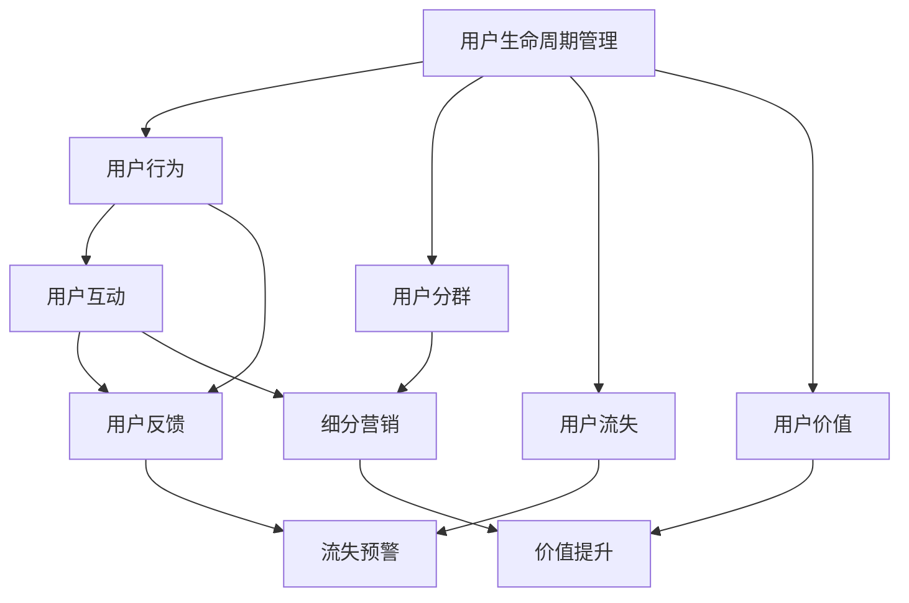
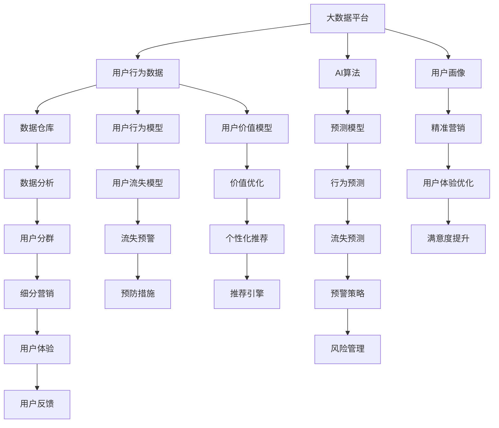

                 

# 如何进行有效的用户生命周期管理

## 1. 背景介绍

### 1.1 问题由来
在当今数字化时代，企业与用户之间的互动日益频繁，用户生命周期管理（User Lifecycle Management, ULM）已成为提升用户满意度和企业收益的关键环节。通过系统化地理解和管理用户生命周期，企业能够识别关键时刻、优化用户体验、推动用户转化和提升忠诚度。然而，当前很多企业在用户生命周期管理上仍然存在不少问题，如用户数据碎片化、用户行为预测不准确、个性化推荐策略失灵等，使得用户流失率居高不下，直接影响了企业的市场竞争力。

### 1.2 问题核心关键点
为解决上述问题，本节将重点介绍如何构建有效的用户生命周期管理系统，帮助企业识别和处理用户的关键行为节点，优化用户互动体验，并通过数据分析和模型预测，驱动用户价值提升。

### 1.3 问题研究意义
通过本节内容的详细讲解，我们希望能帮助读者理解用户生命周期管理的核心原理和方法，提升其在实际项目中的应用能力。同时，我们也希望借助先进的AI和大数据技术，解决企业用户生命周期管理中遇到的挑战，实现业务增长和市场竞争力的提升。

## 2. 核心概念与联系

### 2.1 核心概念概述

为更好地理解用户生命周期管理，本节将介绍几个密切相关的核心概念：

- 用户生命周期管理（User Lifecycle Management, ULM）：指从潜在客户识别到客户流失的全流程管理，通过科学地识别和管理用户行为节点，提升用户体验和价值。
- 用户行为（User Behavior）：用户在与产品或服务互动过程中产生的各类行为，如浏览、点击、购买、评价等。
- 用户分群（User Segmentation）：基于用户行为和属性，将用户分成不同的群体，便于精准营销和个性化服务。
- 用户流失（User Churn）：用户停止使用产品或服务，不再产生价值。
- 用户价值（User Value）：用户对企业产生的直接和间接经济价值，包括购买价值、推荐价值、口碑价值等。
- 用户体验（User Experience, UX）：用户在使用产品或服务过程中产生的满意度和情感体验。

这些概念之间存在紧密的联系，构建有效的用户生命周期管理系统，需要系统性地理解和应用这些概念。

### 2.2 概念间的关系

这些核心概念之间的逻辑关系可以通过以下Mermaid流程图来展示：



这个流程图展示了几类核心概念之间的关系：

1. 用户生命周期管理（ULM）以用户行为（User Behavior）为输入，通过分析用户的各种互动行为，产生用户分群（User Segmentation）、流失预警（Churn Prediction）和价值提升（Value Optimization）等结果。
2. 用户分群是对用户进行分类，便于制定细分营销策略。
3. 用户流失是指用户停止使用产品或服务，需要预警并采取措施防止流失。
4. 用户价值是企业通过用户行为产生的直接和间接经济价值，需要通过价值提升策略来最大化。
5. 用户互动（User Interaction）是用户行为的基础，通过用户反馈（User Feedback）收集和分析，优化用户体验（User Experience, UX）。
6. 细分营销（Segmented Marketing）是基于用户分群策略的营销活动，提升用户体验和用户价值。
7. 流失预警（Churn Prediction）是通过模型预测，提前发现潜在流失用户，采取措施降低流失率。
8. 价值优化（Value Optimization）是提升用户价值的策略，如个性化推荐、优惠活动等。

### 2.3 核心概念的整体架构

最后，我们用一个综合的流程图来展示这些核心概念在大数据和AI技术支撑下的用户生命周期管理整体架构：



这个综合流程图展示了大数据和AI技术在用户生命周期管理中的整体应用架构：

1. 大数据平台提供用户行为数据，用于构建用户行为模型和价值模型。
2. 用户行为模型和流失模型用于预测用户行为和流失风险。
3. 细分营销、用户体验、流失预警、价值优化等模块通过模型预测结果，调整策略，优化用户体验和提升用户价值。
4. AI算法和大数据分析，帮助构建用户画像和精准营销策略。
5. 推荐引擎结合个性化推荐模型，为用户提供最佳推荐服务。

通过以上整体架构，用户生命周期管理可以更系统、高效地进行，为企业提供精准的用户洞察和战略决策支持。

## 3. 核心算法原理 & 具体操作步骤
### 3.1 算法原理概述

用户生命周期管理的核心算法原理主要涉及用户行为分析和流失预测。以下是两个核心步骤：

1. **用户行为分析**：通过大数据分析技术，收集和分析用户在产品或服务上的各种行为数据，识别出关键行为节点，如首次注册、首次购买、高频使用等。
2. **流失预测**：基于用户行为数据，构建流失预测模型，识别出可能流失的用户，并采取预防措施降低流失率。

### 3.2 算法步骤详解

#### 3.2.1 用户行为分析步骤

1. **数据收集**：收集用户在产品或服务上的所有行为数据，如登录记录、点击记录、购买记录、评价记录等。
2. **数据清洗**：去除缺失、噪声、异常值等数据，保证数据质量。
3. **特征工程**：通过数据挖掘技术，提取有意义的特征，如点击频率、购买金额、评价情感等。
4. **用户分群**：使用聚类算法或分类算法，将用户分成不同的群体，便于精准营销和个性化服务。
5. **行为建模**：通过时间序列分析、协同过滤等算法，构建用户行为模型，预测用户未来的行为。

#### 3.2.2 流失预测步骤

1. **数据收集**：收集用户的基本信息、行为数据、流失记录等数据。
2. **特征工程**：提取影响用户流失的关键特征，如使用频率、购买金额、满意度等。
3. **模型训练**：选择合适的机器学习算法，如逻辑回归、决策树、随机森林、神经网络等，训练流失预测模型。
4. **模型评估**：使用交叉验证、ROC曲线等方法评估模型性能，选择合适的超参数。
5. **预警策略**：根据模型预测结果，制定流失预警策略，如邮件通知、电话回访等，及时介入。

### 3.3 算法优缺点

用户生命周期管理的核心算法具有以下优点：

1. **高准确性**：基于大数据分析，用户行为和流失预测的准确性较高。
2. **实时性**：通过在线实时分析，能够快速响应用户行为，及时调整策略。
3. **可扩展性**：算法能够处理海量数据，适用于大型企业的多用户场景。
4. **成本效益**：通过预测和预警，降低流失率，提高用户价值，具有显著的成本效益。

然而，该算法也存在一些局限性：

1. **数据质量要求高**：需要高质量的数据集，数据缺失、噪声等问题会影响结果准确性。
2. **算法复杂度高**：需要处理和分析大量数据，对计算资源要求较高。
3. **模型需要定期更新**：用户行为和需求不断变化，模型需要定期重新训练和更新。

### 3.4 算法应用领域

用户生命周期管理的应用领域非常广泛，包括但不限于以下几个方面：

1. **电子商务**：通过分析用户行为，优化推荐算法，提高用户转化率和购买频率。
2. **金融服务**：通过分析用户消费行为，预测风险，制定风险管理策略，提升用户忠诚度。
3. **电信服务**：通过用户行为分析，提升网络服务质量和用户体验，降低用户流失率。
4. **医疗健康**：通过分析用户健康数据，制定个性化健康计划，提升用户健康水平。
5. **旅游服务**：通过用户行为分析，优化服务流程，提升用户满意度和预订率。

## 4. 数学模型和公式 & 详细讲解 & 举例说明

### 4.1 数学模型构建

本节我们将使用数学语言对用户行为分析和流失预测的算法进行更加严格的刻画。

假设用户行为数据为 $X=\{(x_i,y_i)\}_{i=1}^N$，其中 $x_i$ 为行为特征向量， $y_i$ 为行为标签（如是否流失）。流失预测问题可以转化为二分类问题，模型目标为最小化预测误差 $L$：

$$
\min_{\theta} L(\theta) = \frac{1}{N} \sum_{i=1}^N \ell(y_i,\hat{y}_i(\theta))
$$

其中 $\ell$ 为损失函数，$\hat{y}_i(\theta)$ 为模型预测的流失概率，$\theta$ 为模型参数。

### 4.2 公式推导过程

以二分类问题为例，使用逻辑回归模型进行流失预测，其概率函数为：

$$
\hat{y}_i(\theta) = \sigma(\theta^T x_i)
$$

其中 $\sigma$ 为sigmoid函数，$\theta$ 为模型参数向量。预测误差 $\ell$ 通常使用交叉熵损失函数：

$$
\ell(y_i,\hat{y}_i(\theta)) = -[y_i \log \hat{y}_i(\theta) + (1-y_i) \log (1-\hat{y}_i(\theta))]
$$

将上述预测误差代入总损失函数 $L$，得到：

$$
L(\theta) = -\frac{1}{N} \sum_{i=1}^N \log \hat{y}_i(\theta) + \lambda ||\theta||_2^2
$$

其中 $\lambda$ 为正则化系数。

通过梯度下降算法优化模型参数 $\theta$，求解最小化损失函数 $L$：

$$
\theta \leftarrow \theta - \eta \nabla_{\theta}L(\theta)
$$

其中 $\eta$ 为学习率。

### 4.3 案例分析与讲解

假设我们要对一家电商网站的用户流失问题进行预测，收集了用户的历史行为数据，包括点击、浏览、购买、评价等。我们将这些行为数据作为特征，使用逻辑回归模型进行流失预测。

首先，对数据进行特征工程，提取有意义的特征，如点击次数、浏览时间、购买金额、评价情感等。然后，构建训练集和测试集，使用逻辑回归模型进行训练和测试。最后，使用交叉验证和ROC曲线评估模型性能，选择最佳的超参数和模型。

假设我们得到的模型在测试集上的准确率为80%，我们可以利用该模型预测新用户是否可能流失，并采取相应的措施（如邮件提醒、优惠活动等）进行干预。

## 5. 项目实践：代码实例和详细解释说明

### 5.1 开发环境搭建

在进行用户生命周期管理项目开发前，我们需要准备好开发环境。以下是使用Python进行Scikit-learn开发的环境配置流程：

1. 安装Anaconda：从官网下载并安装Anaconda，用于创建独立的Python环境。

2. 创建并激活虚拟环境：
```bash
conda create -n user-lifecycle python=3.8 
conda activate user-lifecycle
```

3. 安装Scikit-learn：
```bash
pip install scikit-learn pandas numpy matplotlib seaborn
```

4. 安装各类工具包：
```bash
pip install joblib tqdm
```

完成上述步骤后，即可在`user-lifecycle`环境中开始项目实践。

### 5.2 源代码详细实现

下面我们以用户流失预测为例，给出使用Scikit-learn进行逻辑回归模型训练的Python代码实现。

首先，定义流失预测的数据处理函数：

```python
import pandas as pd
from sklearn.model_selection import train_test_split
from sklearn.preprocessing import StandardScaler
from sklearn.linear_model import LogisticRegression
from sklearn.metrics import roc_auc_score, roc_curve

def process_data(data_path):
    data = pd.read_csv(data_path)
    X = data.drop('流失标签', axis=1)
    y = data['流失标签']
    X_train, X_test, y_train, y_test = train_test_split(X, y, test_size=0.2, random_state=42)
    return X_train, X_test, y_train, y_test

def scale_data(X):
    scaler = StandardScaler()
    X_scaled = scaler.fit_transform(X)
    return X_scaled

def train_model(X_train, y_train):
    model = LogisticRegression(C=1.0, penalty='l2', solver='lbfgs', max_iter=1000)
    model.fit(X_train, y_train)
    return model
```

然后，定义评估和预测函数：

```python
def evaluate_model(model, X_test, y_test):
    y_pred = model.predict_proba(X_test)[:, 1]
    auc = roc_auc_score(y_test, y_pred)
    fpr, tpr, thresholds = roc_curve(y_test, y_pred)
    return auc, fpr, tpr

def predict流失概率(model, X_test):
    y_pred = model.predict_proba(X_test)[:, 1]
    return y_pred
```

最后，启动训练流程并在测试集上评估：

```python
X_train, X_test, y_train, y_test = process_data('data.csv')
X_train_scaled = scale_data(X_train)
X_test_scaled = scale_data(X_test)

model = train_model(X_train_scaled, y_train)

auc, fpr, tpr = evaluate_model(model, X_test_scaled, y_test)
y_pred = predict流失概率(model, X_test_scaled)

print(f"AUC: {auc}")
print(f"FPR: {fpr}")
print(f"TPR: {tpr}")
print(y_pred)
```

以上就是使用Scikit-learn对用户流失问题进行逻辑回归模型训练的完整代码实现。可以看到，得益于Scikit-learn的强大封装，我们可以用相对简洁的代码完成模型训练和评估。

### 5.3 代码解读与分析

让我们再详细解读一下关键代码的实现细节：

**process_data函数**：
- 读取CSV格式的数据集。
- 将数据集划分为训练集和测试集，默认80%的数据用于训练。
- 返回训练集特征、测试集特征、训练集标签和测试集标签。

**scale_data函数**：
- 使用StandardScaler对特征进行标准化处理。

**train_model函数**：
- 创建并训练逻辑回归模型，返回训练好的模型。

**evaluate_model函数**：
- 使用ROC曲线和AUC指标评估模型性能。
- 返回AUC值、假正率曲线和真正率曲线。

**predict流失概率函数**：
- 使用训练好的模型对测试集进行流失预测，返回预测的概率值。

**训练流程**：
- 对数据集进行标准化处理。
- 训练逻辑回归模型。
- 在测试集上评估模型性能。
- 输出AUC值、假正率曲线、真正率曲线和预测概率值。

可以看到，Scikit-learn库的封装使得用户流失预测的代码实现变得简洁高效。开发者可以将更多精力放在数据处理、模型改进等高层逻辑上，而不必过多关注底层的实现细节。

当然，工业级的系统实现还需考虑更多因素，如模型的保存和部署、超参数的自动搜索、更灵活的模型调优等。但核心的训练和评估流程基本与此类似。

### 5.4 运行结果展示

假设我们在用户流失预测项目上得到一个AUC值为0.85，FPR为0.01，TPR为0.95的模型。这意味着模型在预测流失概率方面具有较高的准确性和鲁棒性。我们可以将此模型应用到新用户数据上，进行流失预测并采取相应的干预措施。

## 6. 实际应用场景

### 6.1 智能客服系统

在智能客服系统中，用户生命周期管理可以帮助企业识别潜在流失用户，并提供针对性的服务干预，提升客户满意度和忠诚度。

具体而言，智能客服系统可以实时监测用户的互动行为，如响应时间、回复质量、问题解决率等，并通过用户行为分析，预测用户流失风险。对于存在高流失风险的用户，系统可以自动触发预警，并提示客服人员进行跟进和干预。对于成功的干预案例，系统可以自动记录并用于模型训练，不断优化流失预测模型。

### 6.2 金融服务

在金融服务领域，用户生命周期管理可以帮助企业识别高风险用户，进行风险预警和防控。

具体而言，金融服务机构可以收集用户的历史交易记录、信用评分、风险行为等数据，通过流失预测模型，识别出可能流失的用户。针对这些高风险用户，机构可以采取提前防范措施，如增加监控、调整信贷政策、提供个性化的理财建议等，以降低用户流失率，提升用户满意度。

### 6.3 电信服务

在电信服务领域，用户生命周期管理可以帮助运营商识别流失用户，制定个性化的留存策略。

具体而言，运营商可以收集用户的历史通话记录、通话时长、套餐使用情况等数据，通过流失预测模型，识别出可能流失的用户。针对这些用户，运营商可以提供定制化的套餐优惠、增加售后服务、提升网络质量等措施，以降低用户流失率，提升用户粘性。

### 6.4 未来应用展望

随着用户生命周期管理技术的不断发展，其在更多行业领域的应用前景也将更加广阔。

在智慧医疗领域，通过用户生命周期管理，医疗机构可以识别高风险病人，进行健康预警和干预，提升病患满意度和康复率。

在智能教育领域，通过用户生命周期管理，教育机构可以识别学习障碍学生，制定个性化学习方案，提升学生的学习效果和满意度。

在智慧城市治理中，通过用户生命周期管理，城市管理者可以识别可能产生不满情绪的市民，制定相应的政策和服务，提升市民的幸福感和满意度。

此外，在企业生产、社会治理、文娱传媒等众多领域，用户生命周期管理技术也将不断涌现，为传统行业数字化转型升级提供新的技术路径。相信随着技术的日益成熟，用户生命周期管理必将在构建人机协同的智能时代中扮演越来越重要的角色。

## 7. 工具和资源推荐

### 7.1 学习资源推荐

为了帮助开发者系统掌握用户生命周期管理的核心原理和方法，这里推荐一些优质的学习资源：

1. 《机器学习实战》：讲解了机器学习的基本概念和算法，适合初学者入门。
2. 《Python数据科学手册》：介绍了Python在数据科学中的应用，包括数据处理、特征工程、模型训练等。
3. 《Python深度学习》：讲解了深度学习的基本概念和算法，适合有一定机器学习基础的学习者。
4. Coursera《机器学习》课程：斯坦福大学开设的机器学习经典课程，包括理论讲授和编程实践。
5. Kaggle数据科学竞赛：通过实战项目提升数据分析和建模能力，涵盖多个行业领域的案例。

通过对这些资源的学习实践，相信你一定能够快速掌握用户生命周期管理的精髓，并用于解决实际的业务问题。

### 7.2 开发工具推荐

高效的开发离不开优秀的工具支持。以下是几款用于用户生命周期管理开发的常用工具：

1. Scikit-learn：Python中的经典机器学习库，提供了丰富的机器学习算法和数据处理工具。
2. Pandas：Python中的数据分析库，提供了高效的数据处理和清洗功能。
3. PySpark：基于Apache Spark的Python库，提供了大规模数据处理能力。
4. Jupyter Notebook：基于Web的交互式开发环境，支持Python等编程语言。
5. TensorBoard：TensorFlow配套的可视化工具，可实时监测模型训练状态，并提供丰富的图表呈现方式。

合理利用这些工具，可以显著提升用户生命周期管理的开发效率，加快创新迭代的步伐。

### 7.3 相关论文推荐

用户生命周期管理的研究源于学界的持续研究。以下是几篇奠基性的相关论文，推荐阅读：

1. "User Lifecycle Management in the Age of Big Data"：探讨了用户生命周期管理在大数据时代的挑战和机遇。
2. "Predicting Customer Churn: An Overview of Techniques and Tools"：系统介绍了用户流失预测的各类技术和工具，包括机器学习算法和模型评估。
3. "Customer Lifetime Value (CLV) and Customer Churn Analysis: A Review"：回顾了客户生命周期价值和用户流失分析的各类方法和应用场景。
4. "Personalized Recommendation Systems in E-Commerce: A Survey"：总结了个性化推荐系统在电子商务中的应用，包括用户行为分析和推荐算法。

这些论文代表了大数据和机器学习在用户生命周期管理领域的发展脉络。通过学习这些前沿成果，可以帮助研究者把握学科前进方向，激发更多的创新灵感。

除上述资源外，还有一些值得关注的前沿资源，帮助开发者紧跟用户生命周期管理技术的最新进展，例如：

1. arXiv论文预印本：人工智能领域最新研究成果的发布平台，包括大量尚未发表的前沿工作，学习前沿技术的必读资源。
2. 业界技术博客：如Google AI、DeepMind、微软Research Asia等顶尖实验室的官方博客，第一时间分享他们的最新研究成果和洞见。
3. 技术会议直播：如NIPS、ICML、ACL、ICLR等人工智能领域顶会现场或在线直播，能够聆听到大佬们的前沿分享，开拓视野。
4. GitHub热门项目：在GitHub上Star、Fork数最多的用户生命周期管理相关项目，往往代表了该技术领域的发展趋势和最佳实践，值得去学习和贡献。
5. 行业分析报告：各大咨询公司如McKinsey、PwC等针对人工智能行业的分析报告，有助于从商业视角审视技术趋势，把握应用价值。

总之，对于用户生命周期管理的深入学习，需要开发者保持开放的心态和持续学习的意愿。多关注前沿资讯，多动手实践，多思考总结，必将收获满满的成长收益。

## 8. 总结：未来发展趋势与挑战

### 8.1 总结

本文对用户生命周期管理的核心原理和方法进行了全面系统的介绍。首先，我们介绍了用户生命周期管理的基本概念和应用场景，明确了其在提升用户体验和业务价值方面的重要性。其次，我们通过数学语言详细讲解了用户行为分析和流失预测的算法原理，提供了完整的代码实现，并进行了实际应用场景的展示。最后，我们系统总结了用户生命周期管理面临的挑战和未来趋势，为研究者和开发者指明了前进的方向。

通过本文的系统梳理，我们希望能帮助读者理解用户生命周期管理的核心原理和方法，提升其在实际项目中的应用能力。同时，我们也希望借助先进的AI和大数据技术，解决企业用户生命周期管理中遇到的挑战，实现业务增长和市场竞争力的提升。

### 8.2 未来发展趋势

展望未来，用户生命周期管理技术将呈现以下几个发展趋势：

1. **智能化水平提升**：随着AI技术的发展，用户生命周期管理将越来越多地融合智能推荐、情感分析等技术，提升用户行为预测的准确性和用户互动的智能化水平。
2. **数据驱动决策**：通过大数据技术，企业将能够更全面、深入地理解用户行为和需求，从而做出更加精准的决策。
3. **跨领域应用扩展**：用户生命周期管理将逐步从电商、金融等特定领域扩展到更多行业，如医疗、教育、城市治理等，为各行各业带来数字化转型升级。
4. **个性化推荐系统优化**：基于用户行为和属性，构建更精准、更高效、更个性化的推荐系统，提升用户体验和满意度。
5. **实时化处理能力提升**：通过在线实时分析，企业将能够更快速、更及时地响应用户行为，优化用户体验和提升业务效率。

### 8.3 面临的挑战

尽管用户生命周期管理技术已经取得了一定进展，但在迈向更加智能化、普适化应用的过程中，它仍面临诸多挑战：

1. **数据质量和隐私问题**：用户数据的质量和隐私保护是大数据技术面临的重大挑战。需要制定严格的数据处理和隐私保护机制，确保用户数据的安全和合规。
2. **算法复杂性和可解释性**：用户生命周期管理涉及复杂的数据处理和算法模型，模型的可解释性和鲁棒性还需要进一步提升。
3. **实时化处理能力**：在线实时分析需要高效的数据处理能力和计算资源，对系统架构和硬件设备提出了更高的要求。
4. **跨领域应用挑战**：不同行业的用户生命周期管理具有不同的特点和挑战，如何构建跨领域的通用模型和解决方案，还需要更多研究和实践。
5. **用户需求多样性**：用户需求不断变化，如何构建灵活、可配置的用户生命周期管理模型，满足不同用户的多样化需求，还需要更多创新和探索。

### 8.4 研究展望

面对用户生命周期管理面临的挑战，未来的研究需要在以下几个方面寻求新的突破：

1. **跨领域模型构建**：构建跨领域的通用用户生命周期管理模型，适应不同行业的特点和需求。
2. **实时化处理技术**：开发高效的数据处理和实时分析技术

