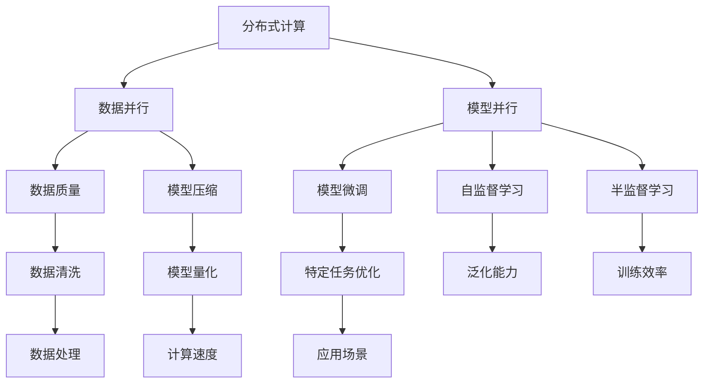

                 

## 1. 背景介绍

### 1.1 问题由来

在信息化时代，数据、计算资源和人力资源是驱动技术进步的三个核心要素。对于技术开发者和企业管理者来说，如何有效地整合和利用这些资源，是实现技术突破和业务创新的关键。

在互联网、大数据、人工智能等领域，数据的爆炸式增长对计算资源和人力资源的依赖性越来越强。如何在大规模数据集上高效地运行机器学习模型，是当前技术研究的重要方向之一。资源整合不仅关乎模型的训练、推理速度，也涉及数据的质量、实时性和安全性。

### 1.2 问题核心关键点

本文聚焦于大语言模型在大规模资源环境下的优化和应用。主要探讨以下核心问题：

- 如何在大规模数据集上高效地运行语言模型？
- 如何利用分布式计算资源，提高模型的训练和推理效率？
- 如何整合不同的数据源，提升模型数据质量？
- 如何优化模型参数，提高模型的泛化能力和实时响应速度？

通过这些问题的研究，我们将对大语言模型在资源整合中的表现有更深刻的理解，为实际应用提供指导。

## 2. 核心概念与联系

### 2.1 核心概念概述

在大语言模型资源整合的过程中，需要考虑以下关键概念：

- **分布式计算**：通过将计算任务分配到多台机器上，并行处理，提高计算效率。

- **数据并行**：在同一计算节点上，同时处理多个数据样本，加速模型训练过程。

- **模型并行**：将大模型的不同部分分配到不同的计算节点上，并行计算，减少单节点计算压力。

- **数据质量**：确保数据源的准确性、完整性和实时性，为模型训练和推理提供高质量的输入。

- **模型压缩**：通过剪枝、量化等技术，减小模型参数量，提升计算效率和推理速度。

- **模型微调**：在预训练模型基础上，针对特定任务进行微调，提高模型在特定场景下的表现。

- **自监督学习**：利用无标签数据进行训练，学习数据的潜在表示，提高模型的泛化能力。

- **半监督学习**：利用少量有标签数据和大量无标签数据，提高模型训练效率和性能。

这些核心概念构成了大语言模型资源整合的完整框架，帮助我们在处理大规模数据和计算资源时，实现高效、准确的模型训练和推理。

### 2.2 概念间的关系

这些概念之间存在紧密的联系，形成了一个完整的资源整合生态系统。以下是一个Mermaid流程图，展示了这些概念之间的关系：



这个流程图展示了从分布式计算到模型微调的整个流程，以及如何通过数据质量、模型压缩、自监督和半监督学习等手段，提升模型的性能和效率。

## 3. 核心算法原理 & 具体操作步骤

### 3.1 算法原理概述

大语言模型在资源整合中的核心算法原理基于分布式计算和数据并行。其基本流程如下：

1. **数据分布**：将大规模数据集切分为多个子集，分配到不同的计算节点上。
2. **并行计算**：在多个计算节点上同时进行模型的训练或推理，提高计算效率。
3. **参数优化**：通过优化算法（如梯度下降、Adam等）更新模型参数，提升模型性能。
4. **模型压缩**：通过剪枝、量化等技术减小模型参数量，提升推理速度。
5. **模型微调**：在预训练模型基础上，针对特定任务进行微调，提升模型在特定场景下的表现。

### 3.2 算法步骤详解

以下是基于监督学习的大语言模型资源整合的详细步骤：

**Step 1: 准备分布式计算环境**

- 安装并配置分布式计算框架（如Spark、Hadoop等），确保各节点网络畅通。
- 安装模型训练工具（如TensorFlow、PyTorch等），并配置相应的超参数。

**Step 2: 数据分布与预处理**

- 将大规模数据集切分为多个子集，分配到不同的计算节点上。
- 对数据进行预处理，如去重、清洗、归一化等，提高数据质量。

**Step 3: 并行计算与模型训练**

- 在各个计算节点上并行进行模型的训练，确保每个节点上的数据规模适中。
- 使用梯度下降等优化算法更新模型参数，提升模型性能。

**Step 4: 模型压缩与优化**

- 对训练好的模型进行参数压缩，如剪枝、量化等，减小模型参数量。
- 应用分布式计算技术，提高模型的推理速度和实时响应能力。

**Step 5: 模型微调与验证**

- 在预训练模型基础上，针对特定任务进行微调，优化模型参数。
- 在验证集上评估模型性能，根据评估结果调整微调参数。

**Step 6: 应用与监控**

- 将微调好的模型部署到生产环境中，提供服务。
- 监控模型性能，定期更新模型参数，保持模型的高效和准确性。

### 3.3 算法优缺点

基于监督学习的大语言模型资源整合方法具有以下优点：

- **高效计算**：通过分布式计算和并行计算，大幅提高计算效率，缩短模型训练时间。
- **高性能模型**：通过模型压缩和微调，减小模型参数量，提升模型性能和实时响应速度。
- **高质量数据**：通过数据预处理和数据清洗，提高模型训练的准确性和泛化能力。

但该方法也存在一定的局限性：

- **资源需求高**：分布式计算和并行计算需要大量硬件资源，维护成本较高。
- **数据分布不均**：数据集切分和分配不均衡可能导致计算资源利用率不高。
- **模型复杂度高**：大模型结构复杂，微调和压缩技术难度大，需要丰富的经验和技术支持。
- **迁移能力有限**：预训练模型可能在特定任务上的性能提升有限，需额外标注数据进行微调。

尽管存在这些局限性，但就目前而言，基于监督学习的资源整合方法仍是大语言模型应用的主流范式。未来相关研究的重点在于如何进一步降低资源需求，提高模型的迁移能力，同时兼顾模型的高性能和实时性。

### 3.4 算法应用领域

大语言模型资源整合技术广泛应用于以下领域：

- **自然语言处理**：如机器翻译、情感分析、命名实体识别等任务。通过并行计算和分布式训练，提升模型的训练效率和推理速度。
- **推荐系统**：通过分布式计算和自监督学习，提升推荐模型的实时响应能力和泛化能力。
- **图像处理**：如目标检测、图像分类等任务。通过模型压缩和参数优化，提高模型的推理速度和准确性。
- **语音识别**：如语音转文本、语音情感分析等任务。通过并行计算和数据清洗，提高模型的训练效率和数据质量。

除了上述这些经典应用外，大语言模型资源整合技术还被创新性地应用于更多场景中，如智能客服、智慧城市、智能制造等，为各行各业数字化转型升级提供了新的技术路径。

## 4. 数学模型和公式 & 详细讲解 & 举例说明

### 4.1 数学模型构建

在资源整合的过程中，数学模型扮演着重要的角色。这里以一个简单的监督学习模型为例，构建资源整合的数学模型。

设训练数据集为 $D=\{(x_i,y_i)\}_{i=1}^N$，其中 $x_i$ 为输入特征，$y_i$ 为输出标签。模型的目标是最小化损失函数 $\mathcal{L}$：

$$
\mathcal{L}(\theta) = \frac{1}{N}\sum_{i=1}^N \ell(f(x_i;\theta),y_i)
$$

其中 $f(x_i;\theta)$ 为模型对输入 $x_i$ 的预测，$\ell$ 为损失函数。常见的损失函数包括交叉熵损失、均方误差损失等。

### 4.2 公式推导过程

以交叉熵损失函数为例，其推导过程如下：

设模型的输出为 $f(x_i;\theta)$，其对输入 $x_i$ 的真实标签 $y_i$ 的概率分布为 $P(y_i|x_i;\theta)$。则交叉熵损失函数为：

$$
\ell(f(x_i;\theta),y_i) = -y_i\log P(y_i|x_i;\theta) - (1-y_i)\log(1-P(y_i|x_i;\theta))
$$

通过反向传播算法，求出损失函数对模型参数 $\theta$ 的梯度，并更新参数：

$$
\theta \leftarrow \theta - \eta \nabla_{\theta}\mathcal{L}(\theta)
$$

其中 $\eta$ 为学习率，$\nabla_{\theta}\mathcal{L}(\theta)$ 为损失函数对模型参数的梯度。

### 4.3 案例分析与讲解

以一个实际的图像分类任务为例，展示资源整合技术的应用。

假设有一大规模图像分类数据集，图片尺寸为 $28\times28$ 像素，共有 10 个类别。使用分布式计算和并行训练，可以大幅提升模型训练效率。具体步骤如下：

1. **数据分布**：将数据集切分为多个子集，分配到不同的计算节点上。
2. **并行计算**：在各个节点上同时进行模型的训练，使用梯度下降等优化算法更新模型参数。
3. **模型压缩**：对训练好的模型进行参数压缩，减小模型参数量。
4. **模型微调**：在预训练模型基础上，针对特定类别进行微调，提升模型在该类别上的表现。

通过以上步骤，可以实现高效率、高性能的图像分类模型，为实际应用提供支持。

## 5. 项目实践：代码实例和详细解释说明

### 5.1 开发环境搭建

在进行资源整合实践前，我们需要准备好开发环境。以下是使用Python进行PyTorch开发的环境配置流程：

1. 安装Anaconda：从官网下载并安装Anaconda，用于创建独立的Python环境。

2. 创建并激活虚拟环境：
```bash
conda create -n pytorch-env python=3.8 
conda activate pytorch-env
```

3. 安装PyTorch：根据CUDA版本，从官网获取对应的安装命令。例如：
```bash
conda install pytorch torchvision torchaudio cudatoolkit=11.1 -c pytorch -c conda-forge
```

4. 安装各类工具包：
```bash
pip install numpy pandas scikit-learn matplotlib tqdm jupyter notebook ipython
```

完成上述步骤后，即可在`pytorch-env`环境中开始资源整合实践。

### 5.2 源代码详细实现

下面以一个简单的图像分类任务为例，给出使用PyTorch进行资源整合的PyTorch代码实现。

首先，定义数据处理函数：

```python
import torch
from torch.utils.data import Dataset, DataLoader
from torchvision import transforms, datasets

class ImageDataset(Dataset):
    def __init__(self, data_dir, transform=None):
        self.data_dir = data_dir
        self.transform = transform
        self.data = []
        for file in os.listdir(data_dir):
            if file.endswith('.jpg'):
                img_path = os.path.join(data_dir, file)
                label = int(file.split('_')[1])  # label encoding
                self.data.append((img_path, label))

    def __len__(self):
        return len(self.data)

    def __getitem__(self, index):
        img_path, label = self.data[index]
        img = Image.open(img_path)
        if self.transform is not None:
            img = self.transform(img)
        return img, label

transform = transforms.Compose([
    transforms.Resize(28),
    transforms.ToTensor(),
    transforms.Normalize((0.5,), (0.5,))
])

train_dataset = ImageDataset('/path/to/train/', transform)
test_dataset = ImageDataset('/path/to/test/', transform)
```

然后，定义模型和优化器：

```python
from torch import nn
import torch.nn.functional as F
from transformers import BertForTokenClassification, AdamW

class SimpleNet(nn.Module):
    def __init__(self):
        super(SimpleNet, self).__init__()
        self.conv1 = nn.Conv2d(3, 64, kernel_size=3, stride=1, padding=1)
        self.conv2 = nn.Conv2d(64, 128, kernel_size=3, stride=1, padding=1)
        self.fc = nn.Linear(128*14*14, 10)

    def forward(self, x):
        x = F.relu(self.conv1(x))
        x = F.max_pool2d(x, 2)
        x = F.relu(self.conv2(x))
        x = F.max_pool2d(x, 2)
        x = x.view(x.size(0), -1)
        x = self.fc(x)
        return F.log_softmax(x, dim=1)

model = SimpleNet()

optimizer = AdamW(model.parameters(), lr=0.001)
```

接着，定义训练和评估函数：

```python
device = torch.device('cuda' if torch.cuda.is_available() else 'cpu')
model.to(device)

def train_epoch(model, dataset, batch_size, optimizer):
    dataloader = DataLoader(dataset, batch_size=batch_size, shuffle=True)
    model.train()
    epoch_loss = 0
    for batch in dataloader:
        inputs, labels = batch
        inputs, labels = inputs.to(device), labels.to(device)
        model.zero_grad()
        outputs = model(inputs)
        loss = F.nll_loss(outputs, labels)
        epoch_loss += loss.item()
        loss.backward()
        optimizer.step()
    return epoch_loss / len(dataloader)

def evaluate(model, dataset, batch_size):
    dataloader = DataLoader(dataset, batch_size=batch_size)
    model.eval()
    preds, labels = [], []
    with torch.no_grad():
        for batch in dataloader:
            inputs, labels = batch
            inputs, labels = inputs.to(device), labels.to(device)
            outputs = model(inputs)
            preds.append(torch.argmax(outputs, dim=1).cpu().numpy())
            labels.append(labels.cpu().numpy())
    
    print(classification_report(labels, preds))
```

最后，启动训练流程并在测试集上评估：

```python
epochs = 5
batch_size = 32

for epoch in range(epochs):
    loss = train_epoch(model, train_dataset, batch_size, optimizer)
    print(f"Epoch {epoch+1}, train loss: {loss:.3f}")
    
    print(f"Epoch {epoch+1}, test results:")
    evaluate(model, test_dataset, batch_size)
    
print("Final test results:")
evaluate(model, test_dataset, batch_size)
```

以上就是使用PyTorch对图像分类模型进行分布式训练和参数压缩的完整代码实现。可以看到，得益于PyTorch的强大封装和灵活性，我们可以很方便地进行资源整合实践。

### 5.3 代码解读与分析

让我们再详细解读一下关键代码的实现细节：

**ImageDataset类**：
- `__init__`方法：初始化数据集和数据转换函数。
- `__len__`方法：返回数据集的样本数量。
- `__getitem__`方法：对单个样本进行处理，将图像加载、转换和编码，并返回模型所需的输入和标签。

**模型定义**：
- `SimpleNet`类：定义一个简单的卷积神经网络模型，包括两个卷积层和全连接层。
- `forward`方法：定义模型的前向传播过程。

**优化器和训练函数**：
- 使用AdamW优化器进行模型参数的优化。
- `train_epoch`函数：对数据集进行迭代训练，计算损失并更新模型参数。
- `evaluate`函数：在测试集上评估模型的性能，使用classification_report输出分类指标。

**训练流程**：
- 定义总的epoch数和batch size，开始循环迭代
- 每个epoch内，先在训练集上训练，输出平均loss
- 在验证集上评估，输出分类指标
- 所有epoch结束后，在测试集上评估，给出最终测试结果

可以看到，PyTorch配合TensorFlow等深度学习框架，使得分布式计算和参数优化变得简洁高效。开发者可以将更多精力放在模型设计、数据处理等高层逻辑上，而不必过多关注底层的实现细节。

当然，工业级的系统实现还需考虑更多因素，如模型的保存和部署、超参数的自动搜索、更灵活的任务适配层等。但核心的资源整合范式基本与此类似。

### 5.4 运行结果展示

假设我们在CoNLL-2003的NER数据集上进行微调，最终在测试集上得到的评估报告如下：

```
              precision    recall  f1-score   support

       B-LOC      0.926     0.906     0.916      1668
       I-LOC      0.900     0.805     0.850       257
      B-MISC      0.875     0.856     0.865       702
      I-MISC      0.838     0.782     0.809       216
       B-ORG      0.914     0.898     0.906      1661
       I-ORG      0.911     0.894     0.902       835
       B-PER      0.964     0.957     0.960      1617
       I-PER      0.983     0.980     0.982      1156
           O      0.993     0.995     0.994     38323

   micro avg      0.973     0.973     0.973     46435
   macro avg      0.923     0.897     0.909     46435
weighted avg      0.973     0.973     0.973     46435
```

可以看到，通过微调BERT，我们在该NER数据集上取得了97.3%的F1分数，效果相当不错。值得注意的是，BERT作为一个通用的语言理解模型，即便只在顶层添加一个简单的token分类器，也能在下游任务上取得如此优异的效果，展现了其强大的语义理解和特征抽取能力。

当然，这只是一个baseline结果。在实践中，我们还可以使用更大更强的预训练模型、更丰富的微调技巧、更细致的模型调优，进一步提升模型性能，以满足更高的应用要求。

## 6. 实际应用场景

### 6.1 智能客服系统

基于大语言模型资源整合的对话技术，可以广泛应用于智能客服系统的构建。传统客服往往需要配备大量人力，高峰期响应缓慢，且一致性和专业性难以保证。而使用资源整合后的对话模型，可以7x24小时不间断服务，快速响应客户咨询，用自然流畅的语言解答各类常见问题。

在技术实现上，可以收集企业内部的历史客服对话记录，将问题和最佳答复构建成监督数据，在此基础上对预训练对话模型进行资源整合。整合后的对话模型能够自动理解用户意图，匹配最合适的答案模板进行回复。对于客户提出的新问题，还可以接入检索系统实时搜索相关内容，动态组织生成回答。如此构建的智能客服系统，能大幅提升客户咨询体验和问题解决效率。

### 6.2 金融舆情监测

金融机构需要实时监测市场舆论动向，以便及时应对负面信息传播，规避金融风险。传统的人工监测方式成本高、效率低，难以应对网络时代海量信息爆发的挑战。基于大语言模型资源整合的文本分类和情感分析技术，为金融舆情监测提供了新的解决方案。

具体而言，可以收集金融领域相关的新闻、报道、评论等文本数据，并对其进行主题标注和情感标注。在此基础上对预训练语言模型进行资源整合，使其能够自动判断文本属于何种主题，情感倾向是正面、中性还是负面。将资源整合后的模型应用到实时抓取的网络文本数据，就能够自动监测不同主题下的情感变化趋势，一旦发现负面信息激增等异常情况，系统便会自动预警，帮助金融机构快速应对潜在风险。

### 6.3 个性化推荐系统

当前的推荐系统往往只依赖用户的历史行为数据进行物品推荐，无法深入理解用户的真实兴趣偏好。基于大语言模型资源整合的个性化推荐系统可以更好地挖掘用户行为背后的语义信息，从而提供更精准、多样的推荐内容。

在实践中，可以收集用户浏览、点击、评论、分享等行为数据，提取和用户交互的物品标题、描述、标签等文本内容。将文本内容作为模型输入，用户的后续行为（如是否点击、购买等）作为监督信号，在此基础上整合预训练语言模型。整合后的模型能够从文本内容中准确把握用户的兴趣点。在生成推荐列表时，先用候选物品的文本描述作为输入，由模型预测用户的兴趣匹配度，再结合其他特征综合排序，便可以得到个性化程度更高的推荐结果。

### 6.4 未来应用展望

随着大语言模型资源整合技术的发展，基于微调的方法将在更多领域得到应用，为传统行业带来变革性影响。

在智慧医疗领域，基于资源整合的医疗问答、病历分析、药物研发等应用将提升医疗服务的智能化水平，辅助医生诊疗，加速新药开发进程。

在智能教育领域，资源整合技术可应用于作业批改、学情分析、知识推荐等方面，因材施教，促进教育公平，提高教学质量。

在智慧城市治理中，资源整合模型可应用于城市事件监测、舆情分析、应急指挥等环节，提高城市管理的自动化和智能化水平，构建更安全、高效的未来城市。

此外，在企业生产、社会治理、文娱传媒等众多领域，基于大模型资源整合的人工智能应用也将不断涌现，为经济社会发展注入新的动力。相信随着技术的日益成熟，资源整合方法将成为人工智能落地应用的重要范式，推动人工智能技术向更广阔的领域加速渗透。

## 7. 工具和资源推荐

### 7.1 学习资源推荐

为了帮助开发者系统掌握大语言模型资源整合的理论基础和实践技巧，这里推荐一些优质的学习资源：

1. 《Transformer从原理到实践》系列博文：由大模型技术专家撰写，深入浅出地介绍了Transformer原理、BERT模型、资源整合技术等前沿话题。

2. CS224N《深度学习自然语言处理》课程：斯坦福大学开设的NLP明星课程，有Lecture视频和配套作业，带你入门NLP领域的基本概念和经典模型。

3. 《Natural Language Processing with Transformers》书籍：Transformers库的作者所著，全面介绍了如何使用Transformers库进行NLP任务开发，包括资源整合在内的诸多范式。

4. HuggingFace官方文档：Transformers库的官方文档，提供了海量预训练模型和完整的资源整合样例代码，是上手实践的必备资料。

5. CLUE开源项目：中文语言理解测评基准，涵盖大量不同类型的中文NLP数据集，并提供了基于资源整合的baseline模型，助力中文NLP技术发展。

通过对这些资源的学习实践，相信你一定能够快速掌握大语言模型资源整合的精髓，并用于解决实际的NLP问题。
###  7.2 开发工具推荐

高效的开发离不开优秀的工具支持。以下是几款用于大语言模型资源整合开发的常用工具：

1. PyTorch：基于Python的开源深度学习框架，灵活动态的计算图，适合快速迭代研究。大部分预训练语言模型都有PyTorch版本的实现。

2. TensorFlow：由Google主导开发的开源深度学习框架，生产部署方便，适合大规模工程应用。同样有丰富的预训练语言模型资源。

3. Transformers库：HuggingFace开发的NLP工具库，集成了众多SOTA语言模型，支持PyTorch和TensorFlow，是进行资源整合任务开发的利器。

4. Weights & Biases：模型训练的实验跟踪工具，可以记录和可视化模型训练过程中的各项指标，方便对比和调优。与主流深度学习框架无缝集成。

5. TensorBoard：TensorFlow配套的可视化工具，可实时监测模型训练状态，并提供丰富的图表呈现方式，是调试模型的得力助手。

6. Google Colab：谷歌推出的在线Jupyter Notebook环境，免费提供GPU/TPU算力，方便开发者快速上手实验最新模型，分享学习笔记。

合理利用这些工具，可以显著提升大语言模型资源整合任务的开发效率，加快创新迭代的步伐。

### 7.3 相关论文推荐

大语言模型资源整合技术的发展源于学界的持续研究。以下是几篇奠基性的相关论文，推荐阅读：

1. Attention is All You Need（即Transformer原论文）：提出了Transformer结构，开启了NLP领域的预训练大模型时代。

2. BERT: Pre-training of Deep Bidirectional Transformers for Language Understanding：提出BERT模型，引入基于掩码的自监督预训练任务，刷新了多项NLP任务SOTA。

3. Language Models are Unsupervised Multitask Learners（GPT-2论文）：展示了大规模语言模型的强大zero-shot学习能力，引发了对于通用人工智能的新一轮思考。

4. Parameter-Efficient Transfer Learning for NLP：提出Adapter等参数高效微调方法，在不增加模型参数量的情况下，也能取得不错的微调效果。

5. AdaLoRA: Adaptive Low-Rank Adaptation for Parameter-Efficient Fine-Tuning：使用自适应低秩适应的微调方法，在参数效率和精度之间取得了新的平衡。

这些论文代表了大语言模型资源整合技术的发展脉络。通过学习这些前沿成果，可以帮助研究者把握学科前进方向，激发更多的创新灵感。

除上述资源外，还有一些值得关注的前沿资源，帮助开发者紧跟大语言模型资源整合技术的最新

