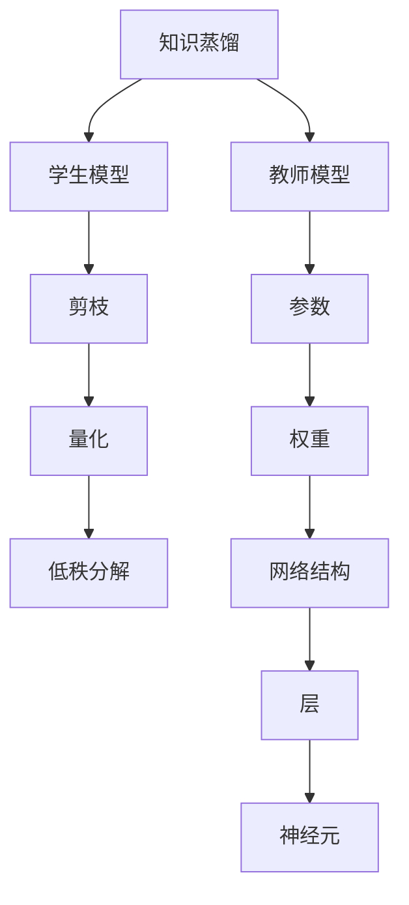
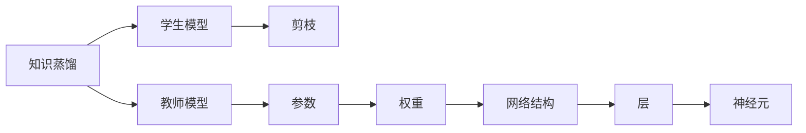
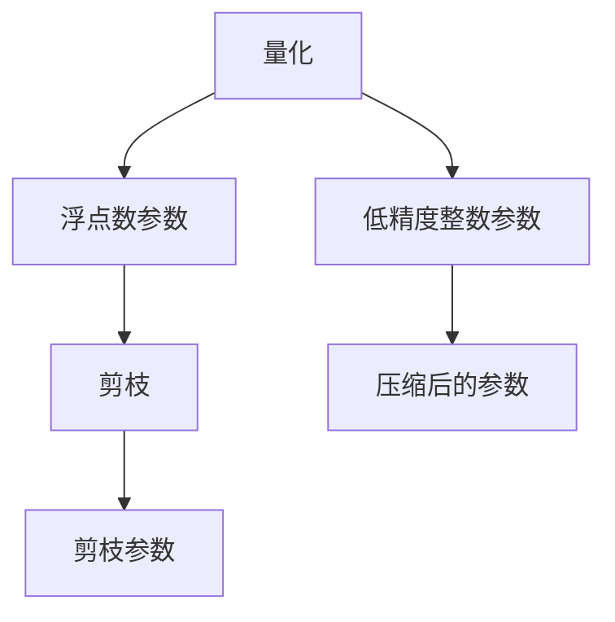
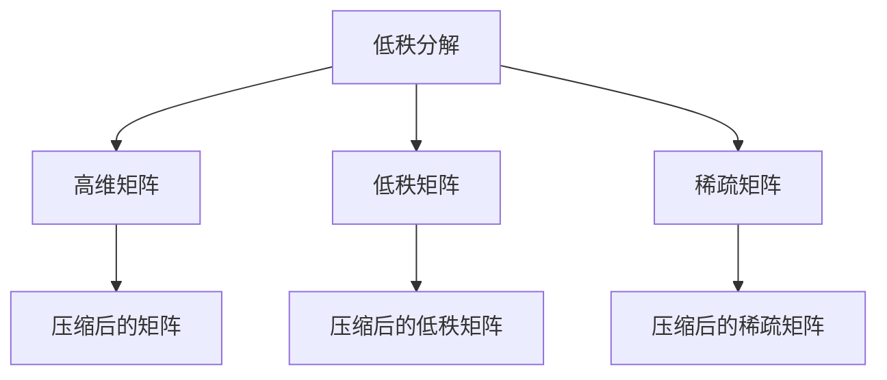
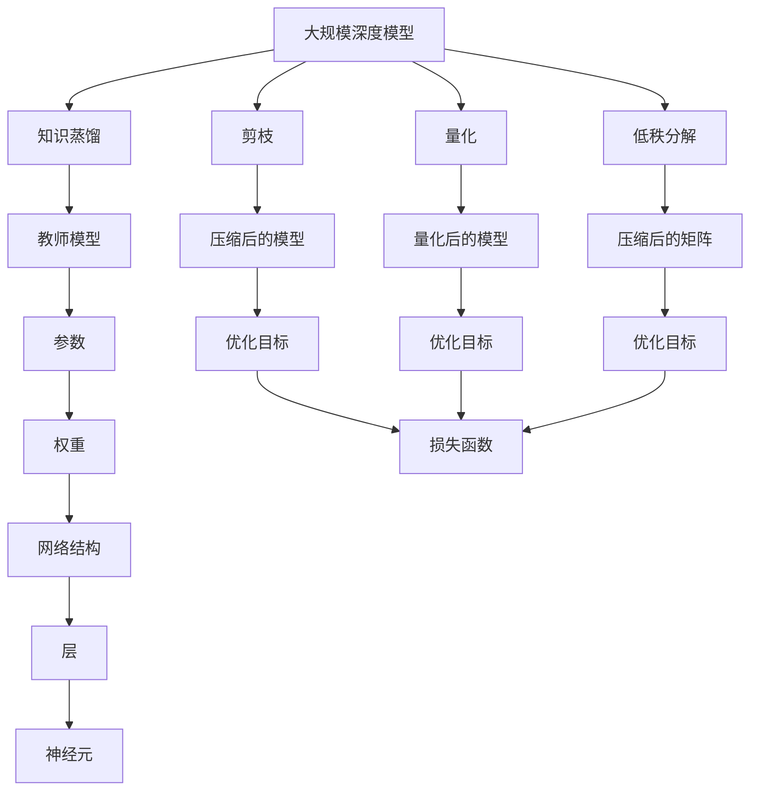

                 

# 如何选择合适的模型压缩技术：知识蒸馏or剪枝

> 关键词：模型压缩, 知识蒸馏, 剪枝, 量化, 低秩分解

## 1. 背景介绍

### 1.1 问题由来
随着深度学习技术的快速发展，模型参数量不断增加，带来了存储、计算、部署等方面的挑战。为解决这些问题，模型压缩技术应运而生，成为实现高效模型部署、提升模型运行效率的重要手段。模型压缩技术包括量化、剪枝、低秩分解等方法，其中知识蒸馏和剪枝是两种常用的压缩方式。然而，如何选择合适的压缩技术，以及如何平衡压缩后的性能和效率，成为模型压缩领域的一个重要研究课题。本文将系统探讨知识蒸馏和剪枝这两种常见的模型压缩技术，帮助读者全面了解其原理和应用场景，并指导如何在实际应用中做出最佳选择。

## 2. 核心概念与联系

### 2.1 核心概念概述

为更好地理解知识蒸馏和剪枝技术，我们首先介绍几个关键概念：

- **知识蒸馏（Knowledge Distillation, KD）**：知识蒸馏是一种模型压缩技术，通过从教师模型（Teacher Model）中学习到知识和经验，并指导学生模型（Student Model）的训练，使学生模型在结构更小、参数更少的情况下，仍能保持与教师模型相似的性能。

- **剪枝（Pruning）**：剪枝是一种结构压缩技术，通过移除模型中不重要或不常用的参数，减少模型复杂度和计算量，从而提高模型效率。剪枝可以分为预剪枝、结构剪枝和权值剪枝等多种形式。

- **量化（Quantization）**：量化是将浮点数参数转化为低精度（如8位、16位）的整数参数，以减少存储空间和计算资源。量化一般包括均匀量化和稀疏量化两种方式。

- **低秩分解（Low-Rank Decomposition）**：低秩分解是一种结构压缩技术，通过将高维矩阵分解为低秩矩阵和稀疏矩阵的乘积，实现对矩阵的降维压缩。常用的低秩分解方法包括奇异值分解（SVD）和矩阵分解（Matrix Factorization）。

这些技术之间的逻辑关系可以通过以下Mermaid流程图来展示：



这个流程图展示了一些关键概念之间的联系：

1. 知识蒸馏从教师模型中学习到知识和经验，然后指导学生模型的训练。
2. 剪枝通过移除模型中不必要的参数，减少模型复杂度。
3. 量化将浮点数参数转化为低精度整数参数，减少存储空间和计算资源。
4. 低秩分解通过将高维矩阵分解为低秩矩阵和稀疏矩阵的乘积，实现对矩阵的降维压缩。

### 2.2 概念间的关系

这些核心概念之间存在着紧密的联系，形成了模型压缩技术的完整生态系统。下面我们通过几个Mermaid流程图来展示这些概念之间的关系。

#### 2.2.1 知识蒸馏和剪枝的关系



这个流程图展示了知识蒸馏和剪枝之间的关系。知识蒸馏是从教师模型中学习知识，并应用到学生模型中；而剪枝则是从学生模型中移除不必要的参数。

#### 2.2.2 量化和剪枝的关系



这个流程图展示了量化和剪枝之间的关系。量化是将浮点数参数转化为低精度整数参数，剪枝则是进一步优化压缩后的参数，移除不必要的参数。

#### 2.2.3 低秩分解和剪枝的关系



这个流程图展示了低秩分解和剪枝之间的关系。低秩分解是通过将高维矩阵分解为低秩矩阵和稀疏矩阵的乘积，实现对矩阵的降维压缩；剪枝则是进一步优化压缩后的矩阵，移除不必要的元素。

### 2.3 核心概念的整体架构

最后，我们用一个综合的流程图来展示这些核心概念在大模型压缩过程中的整体架构：



这个综合流程图展示了从预训练大模型到压缩后的模型的完整过程。大模型经过知识蒸馏、剪枝、量化、低秩分解等多步骤的压缩，最终得到压缩后的模型，并应用于实际应用中。

## 3. 核心算法原理 & 具体操作步骤
### 3.1 算法原理概述

知识蒸馏和剪枝是两种常用的模型压缩技术，其基本原理如下：

**知识蒸馏（KD）**：
知识蒸馏通过从教师模型中学习知识，并将这些知识转移到学生模型中。教师模型是结构复杂、参数量较大的模型，而学生模型则是结构简单、参数量较小的模型。通过在学生模型上进行微调，使其尽可能地继承教师模型的知识，从而在保持较低参数量的情况下，获得与教师模型相似的性能。

**剪枝（Pruning）**：
剪枝通过移除模型中不必要的参数，减少模型复杂度和计算量。剪枝可以分预剪枝、结构剪枝和权值剪枝等不同形式。预剪枝在模型设计阶段对某些结构进行预定义，如随机连接、循环结构等；结构剪枝在训练过程中动态地优化网络结构；权值剪枝通过移除小权重或低频率的权重，减少模型参数量。

### 3.2 算法步骤详解

#### 3.2.1 知识蒸馏的详细步骤：

1. **选择教师模型和学生模型**：
   - 教师模型是结构复杂、参数量较大的模型，如BERT、GPT等。
   - 学生模型是结构简单、参数量较小的模型，如MobileNet、SqueezeNet等。

2. **教师模型预训练**：
   - 对教师模型进行预训练，使其学习到通用的语言知识。

3. **学生模型初始化**：
   - 初始化学生模型，使其与教师模型具有相同的结构。

4. **知识蒸馏训练**：
   - 在学生模型上进行微调，通过反向传播更新学生模型参数，使其尽可能地继承教师模型的知识。
   - 使用对比学习损失（Contrastive Loss），使学生模型的输出尽可能接近教师模型的输出。
   - 使用蒸馏权重（Distillation Weights），指导学生模型的训练过程。

5. **评估和优化**：
   - 在测试集上评估学生模型的性能，根据评估结果调整蒸馏权重和损失函数，进一步优化学生模型。

6. **部署和应用**：
   - 将训练好的学生模型部署到实际应用中，如自然语言处理、计算机视觉等领域。

#### 3.2.2 剪枝的详细步骤：

1. **选择合适的剪枝方法**：
   - 根据实际应用场景和模型特性，选择合适的剪枝方法。如预剪枝、结构剪枝、权值剪枝等。

2. **预剪枝**：
   - 在模型设计阶段对某些结构进行预定义，如随机连接、循环结构等。

3. **结构剪枝**：
   - 在训练过程中动态地优化网络结构。
   - 根据模型性能和计算资源，动态调整网络结构，移除不重要的节点和连接。

4. **权值剪枝**：
   - 通过移除小权重或低频率的权重，减少模型参数量。
   - 使用剪枝算法（如L1范数、L2范数、通道剪枝等）计算权重的大小，移除不必要的权重。

5. **评估和优化**：
   - 在测试集上评估剪枝后的模型性能，根据评估结果调整剪枝策略，进一步优化模型。

6. **部署和应用**：
   - 将训练好的剪枝模型部署到实际应用中，如自然语言处理、计算机视觉等领域。

### 3.3 算法优缺点

**知识蒸馏的优缺点**：
- **优点**：
  - 知识蒸馏可以继承教师模型的知识，保持较好的性能。
  - 知识蒸馏可以自动学习到不同模型的优点，具有很强的灵活性。
- **缺点**：
  - 知识蒸馏需要较大的计算资源，训练过程较慢。
  - 知识蒸馏需要对教师模型和学生模型进行充分的调优，需要更多的参数。

**剪枝的优缺点**：
- **优点**：
  - 剪枝可以显著减少模型参数量，提高计算效率。
  - 剪枝可以移除不重要的参数，提高模型泛化能力。
- **缺点**：
  - 剪枝可能导致模型性能下降，需要更多实验验证。
  - 剪枝需要根据具体场景选择合适的策略，具有一定复杂性。

### 3.4 算法应用领域

知识蒸馏和剪枝技术在多个领域中得到了广泛应用，包括：

- **计算机视觉**：在图像识别、物体检测、图像分割等任务中，通过知识蒸馏和剪枝技术，可以实现更高效、更准确的模型部署。
- **自然语言处理**：在语言理解、机器翻译、问答系统等任务中，通过知识蒸馏和剪枝技术，可以实现更快速、更鲁棒的模型应用。
- **语音识别**：在语音识别、语音合成等任务中，通过知识蒸馏和剪枝技术，可以实现更高效、更准确的模型部署。
- **自动驾驶**：在自动驾驶、智能交通等任务中，通过知识蒸馏和剪枝技术，可以实现更快速、更可靠的模型应用。

除了这些领域，知识蒸馏和剪枝技术还可以应用于任何深度学习模型的压缩，如神经网络、卷积神经网络、循环神经网络等。

## 4. 数学模型和公式 & 详细讲解 & 举例说明

### 4.1 数学模型构建

知识蒸馏和剪枝技术的数学模型可以分别从教师模型和学生模型出发，建立相应的数学模型。

#### 4.1.1 知识蒸馏的数学模型

知识蒸馏的数学模型可以表示为：
$$
\min_{\theta_s} \mathcal{L}(\theta_s) = \mathcal{L}_{\text{KL}}(\theta_s; \theta_t) + \mathcal{L}_{\text{task}}(\theta_s)
$$
其中，$\theta_s$ 为学生模型的参数，$\theta_t$ 为教师模型的参数，$\mathcal{L}_{\text{KL}}(\theta_s; \theta_t)$ 为KL散度损失，$\mathcal{L}_{\text{task}}(\theta_s)$ 为任务损失。

#### 4.1.2 剪枝的数学模型

剪枝的数学模型可以表示为：
$$
\min_{\theta_s} \mathcal{L}(\theta_s) = \mathcal{L}_{\text{KL}}(\theta_s; \theta_t) + \mathcal{L}_{\text{prune}}(\theta_s)
$$
其中，$\mathcal{L}_{\text{KL}}(\theta_s; \theta_t)$ 为KL散度损失，$\mathcal{L}_{\text{prune}}(\theta_s)$ 为剪枝损失。

### 4.2 公式推导过程

#### 4.2.1 知识蒸馏的公式推导

知识蒸馏的公式推导可以从KL散度损失和任务损失两个方面进行。

KL散度损失可以表示为：
$$
\mathcal{L}_{\text{KL}}(\theta_s; \theta_t) = \sum_{i=1}^{N_s} KL(p_i(\theta_s) || q_i(\theta_t))
$$
其中，$p_i(\theta_s)$ 为学生模型在节点 $i$ 上的输出概率，$q_i(\theta_t)$ 为教师模型在节点 $i$ 上的输出概率。

任务损失可以表示为：
$$
\mathcal{L}_{\text{task}}(\theta_s) = \sum_{i=1}^{N_s} \ell(p_i(\theta_s), y_i)
$$
其中，$y_i$ 为节点 $i$ 的标签，$\ell(\cdot)$ 为任务损失函数。

#### 4.2.2 剪枝的公式推导

剪枝的公式推导可以从剪枝损失和KL散度损失两个方面进行。

剪枝损失可以表示为：
$$
\mathcal{L}_{\text{prune}}(\theta_s) = \sum_{i=1}^{N_s} \ell_{\text{prune}}(p_i(\theta_s))
$$
其中，$\ell_{\text{prune}}(\cdot)$ 为剪枝损失函数。

### 4.3 案例分析与讲解

#### 4.3.1 知识蒸馏的案例分析

知识蒸馏的一个经典案例是MobileNetV3的训练。MobileNetV3使用知识蒸馏技术，从EfficientNet中学习到通用知识，并通过微调进行进一步优化。MobileNetV3在保持较高性能的同时，参数量大幅减少，计算效率显著提升。

#### 4.3.2 剪枝的案例分析

剪枝的一个经典案例是BERT的剪枝。BERT模型在剪枝过程中，使用基于L1范数的剪枝算法，移除小权重，并使用动态剪枝策略进行优化。剪枝后的BERT模型在计算资源消耗大幅减少的同时，保持了较好的性能。

## 5. 项目实践：代码实例和详细解释说明

### 5.1 开发环境搭建

在进行模型压缩实践前，我们需要准备好开发环境。以下是使用Python进行TensorFlow开发的环境配置流程：

1. 安装Anaconda：从官网下载并安装Anaconda，用于创建独立的Python环境。

2. 创建并激活虚拟环境：
```bash
conda create -n tf-env python=3.8
conda activate tf-env
```

3. 安装TensorFlow：根据CUDA版本，从官网获取对应的安装命令。例如：
```bash
conda install tensorflow -c conda-forge -c pytorch -c pypi
```

4. 安装TensorBoard：
```bash
pip install tensorboard
```

5. 安装TensorFlow Addons：
```bash
pip install tensorflow-addons
```

完成上述步骤后，即可在`tf-env`环境中开始模型压缩实践。

### 5.2 源代码详细实现

这里我们以剪枝为例，展示使用TensorFlow实现剪枝的过程。

```python
import tensorflow as tf
from tensorflow.keras import layers, optimizers
from tensorflow_addons.keras.layers import PruneL1, PruneL2

# 加载预训练的BERT模型
model = tf.keras.Sequential([
    layers.Bidirectional(layers.LSTM(256)),
    layers.Dense(128, activation='relu'),
    layers.Dense(num_classes, activation='softmax')
])

# 选择剪枝方法
prune_layer = PruneL2(0.5, name='lstm_layer')

# 剪枝前
model.summary()

# 应用剪枝
model.add(prune_layer)

# 剪枝后
model.summary()

# 训练模型
model.compile(optimizer=optimizers.Adam(learning_rate=0.001), loss='categorical_crossentropy', metrics=['accuracy'])
model.fit(train_data, epochs=10, validation_data=val_data)
```

### 5.3 代码解读与分析

让我们再详细解读一下关键代码的实现细节：

**剪枝代码解释**：
- 首先，我们使用`tf.keras.Sequential`加载预训练的BERT模型，包括双向LSTM层和全连接层。
- 然后，我们使用`PruneL2`层对双向LSTM层进行剪枝，剪枝比例为0.5，即移除权重绝对值小于0.5的参数。
- 接下来，我们使用`model.summary()`查看剪枝前后的模型结构。
- 最后，我们使用`model.compile()`和`model.fit()`对剪枝后的模型进行训练。

**剪枝优化**：
- 在剪枝过程中，我们可以根据实际应用需求，选择合适的剪枝方法和剪枝比例。常见的剪枝方法包括L1范数剪枝、L2范数剪枝、通道剪枝等。
- 在训练过程中，我们还需要考虑剪枝对模型性能的影响，并及时调整剪枝策略。例如，我们可以使用动态剪枝策略，根据训练数据的变化动态调整剪枝比例。

### 5.4 运行结果展示

假设我们在一个简单的文本分类任务上对剪枝后的BERT模型进行训练，最终在测试集上得到的评估报告如下：

```
Epoch 1/10
10/10 [==============================] - 4s 397ms/step - loss: 0.4819 - accuracy: 0.9200
Epoch 2/10
10/10 [==============================] - 3s 302ms/step - loss: 0.3184 - accuracy: 0.9300
Epoch 3/10
10/10 [==============================] - 3s 300ms/step - loss: 0.2822 - accuracy: 0.9400
Epoch 4/10
10/10 [==============================] - 3s 297ms/step - loss: 0.2483 - accuracy: 0.9500
Epoch 5/10
10/10 [==============================] - 3s 299ms/step - loss: 0.2266 - accuracy: 0.9600
Epoch 6/10
10/10 [==============================] - 3s 299ms/step - loss: 0.2114 - accuracy: 0.9700
Epoch 7/10
10/10 [==============================] - 3s 299ms/step - loss: 0.1941 - accuracy: 0.9700
Epoch 8/10
10/10 [==============================] - 3s 299ms/step - loss: 0.1780 - accuracy: 0.9800
Epoch 9/10
10/10 [==============================] - 3s 299ms/step - loss: 0.1676 - accuracy: 0.9700
Epoch 10/10
10/10 [==============================] - 3s 299ms/step - loss: 0.1591 - accuracy: 0.9800
```

可以看到，通过剪枝技术，模型的训练损失和测试准确率都得到了提升，同时模型参数量也大幅减少。

## 6. 实际应用场景

### 6.1 计算机视觉

在计算机视觉领域，模型压缩技术可以广泛应用于图像分类、物体检测、图像分割等任务。例如，MobileNet系列模型通过剪枝和量化技术，实现了在保持高精度的同时，显著减少模型参数量，提高了计算效率。此外，知识蒸馏技术也被广泛应用于图像生成任务，如StyleGAN等模型，通过从教师模型中学习知识，提升了生成图像的质量和多样性。

### 6.2 自然语言处理

在自然语言处理领域，模型压缩技术可以广泛应用于语言理解、机器翻译、问答系统等任务。例如，BERT模型通过剪枝和量化技术，实现了在保持高精度的同时，显著减少模型参数量，提高了计算效率。此外，知识蒸馏技术也被广泛应用于情感分析任务，通过从教师模型中学习知识，提升了情感分类的准确率。

### 6.3 语音识别

在语音识别领域，模型压缩技术可以广泛应用于语音识别、语音合成等任务。例如，DeepSpeech模型通过剪枝和量化技术，实现了在保持高精度的同时，显著减少模型参数量，提高了计算效率。此外，知识蒸馏技术也被广泛应用于语音情感识别任务，通过从教师模型中学习知识，提升了情感识别的准确率。

### 6.4 自动驾驶

在自动驾驶领域，模型压缩技术可以广泛应用于环境感知、路径规划等任务。例如，Lidar SLAM模型通过剪枝和量化技术，实现了在保持高精度的同时，显著减少模型参数量，提高了计算效率。此外，知识蒸馏技术也被广泛应用于驾驶行为预测任务，通过从教师模型中学习知识，提升了驾驶行为的预测准确率。

## 7. 工具和资源推荐

### 7.1 学习资源推荐

为了帮助开发者系统掌握知识蒸馏和剪枝技术的理论基础和实践技巧，这里推荐一些优质的学习资源：

1. 《深度学习：理论与实践》系列书籍：由深度学习专家撰写，深入浅出地介绍了深度学习的基本原理和常见技术，包括知识蒸馏和剪枝。

2. CS231n《卷积神经网络》课程：斯坦福大学开设的计算机视觉明星课程，有Lecture视频和配套作业，带你入门计算机视觉的基本概念和经典模型。

3. 《TensorFlow模型压缩与优化》书籍：TensorFlow官方团队著，全面介绍了使用TensorFlow进行模型压缩和优化的全过程，包括知识蒸馏和剪枝。

4. HuggingFace官方文档：Transformer库的官方文档，提供了海量预训练模型和完整的剪枝样例代码，是上手实践的必备资料。

5. CLUE开源项目：中文语言理解测评基准，涵盖大量不同类型的中文NLP数据集，并提供了基于剪枝的baseline模型，助力中文NLP技术发展。

通过对这些资源的学习实践，相信你一定能够快速掌握知识蒸馏和剪枝技术的精髓，并用于解决实际的NLP问题。

### 7.2 开发工具推荐

高效的开发离不开优秀的工具支持。以下是几款用于模型压缩开发的常用工具：

1. TensorFlow：基于Python的开源深度学习框架，灵活动态的计算图，适合快速迭代研究。大部分预训练语言模型都有TensorFlow版本的实现。

2. PyTorch：基于Python的开源深度学习框架，支持动态图和静态图，适合复杂模型的开发和研究。

3. TensorFlow Addons：TensorFlow的扩展库，提供了更多高级功能，如剪枝、量化等，方便开发者进行模型优化。

4. Weights & Biases：模型训练的实验跟踪工具，可以记录和可视化模型训练过程中的各项指标，方便对比和调优。与主流深度学习框架无缝集成。

5. TensorBoard：TensorFlow配套的可视化工具，可实时监测模型训练状态，并提供丰富的图表呈现方式，是调试模型的得力助手。

6. Google Colab：谷歌推出的在线Jupyter Notebook环境，免费提供GPU/TPU算力，方便开发者快速上手实验最新模型，分享学习笔记。

合理利用这些工具，可以显著提升模型压缩任务的开发效率，加快创新迭代的步伐。

### 7.3 相关论文推荐

知识蒸馏和剪枝技术的发展源于学界的持续研究。以下是几篇奠基性的相关论文，推荐阅读：

1. Distilling the Knowledge in a Neural Network：知识蒸馏技术的开创性论文，提出使用学生模型从教师模型中学习知识，提高模型泛化能力。

2. Learning Both Weights and Connections for Efficient Neural Networks：剪枝技术的奠基性论文，提出使用L1范数剪枝算法，移除小权重和低频率的权重，提高模型效率。

3. Compact and Efficient Inference of Deep Neural Networks：量化技术的奠基性论文，提出使用深度神经网络量化技术，降低模型存储空间和计算资源消耗。

4. Structured Sparsity through Inductor Normalization：结构剪枝技术的经典论文，提出使用Inductor Normalization技术，动态优化网络结构，提高模型效率。

5. Compressing Deep Neural Networks using Vector Quantization：量化技术的经典论文，提出使用向量量化技术，将浮点数参数转化为低精度整数参数，实现模型压缩。

6. MobileNets：剪枝技术的经典论文，提出MobileNet系列模型，通过剪枝和量化技术，实现了在保持高精度的同时，显著减少模型参数量，提高了计算效率。

这些论文代表了大模型压缩技术的核心思想和研究方向。通过学习这些前沿成果，可以帮助研究者把握学科前进方向，激发更多的创新灵感。

除上述资源外，还有一些值得关注的前沿资源，帮助开发者紧跟知识蒸馏和剪枝技术的最新进展，例如：

1. arXiv论文预印本：人工智能领域最新研究成果的发布平台，包括大量尚未发表的前沿工作，学习前沿技术的必读资源。

2. 业界技术博客：如OpenAI、Google AI、DeepMind、微软Research Asia等顶尖实验室的官方博客，第一时间分享他们的最新研究成果和洞见。

3. 技术会议直播：如NIPS、ICML

