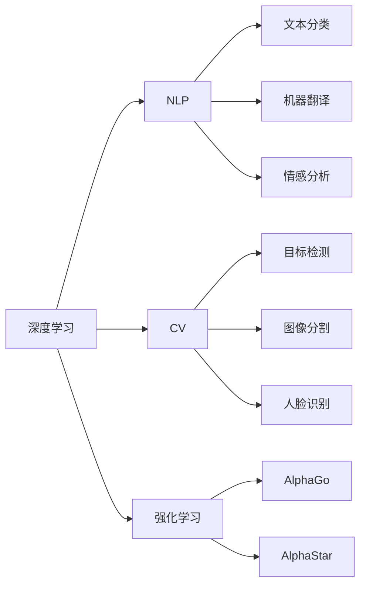
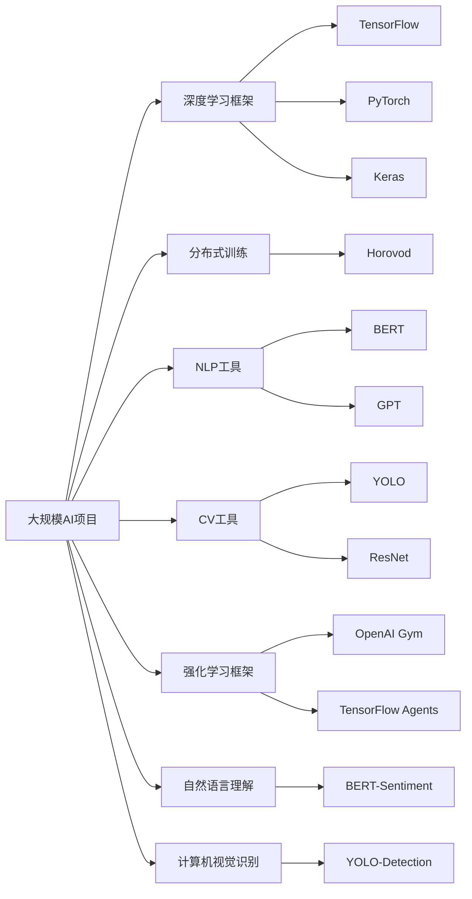

                 

## 1. 背景介绍

### 1.1 问题由来
人工智能(AI)技术的飞速发展，使得机器学习、深度学习、自然语言处理(NLP)、计算机视觉(CV)等领域的工具和库不断涌现。开发者在面对这些工具和库时，常常感到难以抉择，选择不当可能会浪费大量时间和精力。

### 1.2 问题核心关键点
选择适合自己的AI工具，需要考虑多方面因素，包括应用场景、技术栈、资源投入、性能需求等。本文将从这些角度出发，详细解析如何选择和应用这些工具，帮助开发者最大化利用AI技术，提升项目效率和效果。

## 2. 核心概念与联系

### 2.1 核心概念概述

为更好地理解如何选择适合自己的AI工具，本节将介绍几个关键概念及其相互联系：

- **AI工具**：指用于AI模型训练、推理、调优等方面的软件和库。常见的AI工具包括TensorFlow、PyTorch、Keras等。
- **深度学习**：AI工具的核心技术之一，主要使用神经网络对复杂问题进行建模和预测。深度学习框架如TensorFlow、PyTorch提供了高效的计算图和自动微分功能，使得深度模型训练和推理变得简单高效。
- **自然语言处理**：使用AI工具处理和理解自然语言的技术，如文本分类、机器翻译、情感分析等。
- **计算机视觉**：使用AI工具识别和理解图像和视频中的内容，如目标检测、图像分割、人脸识别等。
- **强化学习**：使用AI工具让机器在特定环境中通过试错学习最优策略，如AlphaGo、AlphaStar等。
- **分布式训练**：随着模型规模的扩大，单机训练已无法满足需求。分布式训练工具如Horovod、Horizon等提供了多机协同训练的能力，加速大模型的训练过程。

这些概念之间相互联系，构成了AI技术的完整生态。理解这些概念及其相互关系，有助于我们选择最适合的工具和库。

### 2.2 概念间的关系

这些核心概念之间的关系可以用以下Mermaid流程图表示：



这个流程图展示了不同AI技术之间的联系：

1. 深度学习是AI工具的核心，提供了强大的计算图和自动微分能力。
2. NLP、CV、强化学习等技术基于深度学习，形成了各自的模型和应用。
3. 模型训练、推理等任务需要使用深度学习框架和分布式训练工具。
4. 各类AI应用涉及不同的数据处理、模型调优、评估等环节，需要配套的工具和库。

### 2.3 核心概念的整体架构

最后，我们用一个综合的流程图来展示这些核心概念在大规模AI项目中的整体架构：



这个综合流程图展示了AI项目在不同组件的选择和应用：

1. 深度学习框架选择TensorFlow、PyTorch或Keras，视项目需求而定。
2. 分布式训练工具使用Horovod或Horizon，视硬件资源和需求而定。
3. NLP工具选择BERT、GPT等预训练模型，视任务需求而定。
4. CV工具选择YOLO、ResNet等预训练模型，视任务需求而定。
5. 强化学习框架选择OpenAI Gym或TensorFlow Agents，视项目需求而定。
6. 自然语言理解工具选择BERT-Sentiment，视任务需求而定。
7. 计算机视觉识别工具选择YOLO-Detection，视任务需求而定。

通过这些图表，我们可以更好地理解AI工具之间的联系和应用场景，为后续深入讨论选择工具提供直观的参考。

## 3. 核心算法原理 & 具体操作步骤
### 3.1 算法原理概述

选择适合自己项目的AI工具，首先需要了解其核心算法原理。AI工具的核心算法包括深度学习模型训练、推理、调优等，这些算法的原理和流程对于理解和应用工具至关重要。

深度学习模型的训练通常分为训练集和验证集两部分。训练集用于模型参数优化，验证集用于模型性能评估。优化算法（如Adam、SGD等）通过对损失函数进行梯度下降，更新模型参数，使得模型预测与真实标签之间的差距最小化。

### 3.2 算法步骤详解

选择适合自己项目的AI工具，一般包括以下几个关键步骤：

**Step 1: 需求分析**
- 明确项目需求：确定应用场景、目标任务、数据量和性能要求等。
- 确定技术栈：选择合适的AI工具和库，考虑兼容性和易用性。
- 制定计划：制定详细的项目计划，包括数据准备、模型训练、评估、调优等环节。

**Step 2: 环境搭建**
- 安装必要的软件和库，如Python、TensorFlow、PyTorch等。
- 配置好GPU、TPU等硬件资源，确保计算能力满足需求。
- 搭建好开发环境，设置版本管理工具如git，确保代码版本可控。

**Step 3: 数据处理**
- 收集和预处理数据：清洗、归一化、分批处理等，保证数据质量。
- 数据增强：通过旋转、缩放、翻转等方法扩充训练数据集，提高模型泛化能力。
- 数据分割：将数据集划分为训练集、验证集、测试集，确保模型评估的可靠性。

**Step 4: 模型选择**
- 选择合适的模型架构：如CNN、RNN、Transformer等。
- 选择合适的预训练模型：如BERT、GPT、ResNet等。
- 确定模型超参数：如学习率、批大小、优化器等。

**Step 5: 模型训练**
- 搭建计算图：定义模型架构、损失函数、优化器等。
- 编写训练脚本：定义训练循环、模型保存、日志记录等。
- 进行模型训练：运行训练脚本，监控训练进度和性能指标。

**Step 6: 模型评估和调优**
- 在验证集上评估模型：计算精度、召回率、F1值等指标。
- 进行模型调优：调整超参数、优化器、正则化等手段，提升模型性能。
- 在测试集上最终评估：确保模型泛化性能符合实际需求。

**Step 7: 模型部署和监控**
- 将模型导出并封装：保存模型参数，生成可推理的模型文件。
- 部署模型：集成到生产系统中，如RESTful API、微服务等。
- 监控模型性能：实时监控模型性能，进行异常检测和问题排查。

### 3.3 算法优缺点

选择适合自己项目的AI工具，需要权衡其优缺点，综合考虑性能、易用性、可扩展性等因素。

**优点**：
1. 高效计算：如TensorFlow、PyTorch等深度学习框架，提供高效的自动微分和计算图优化，提升模型训练和推理效率。
2. 丰富的预训练模型：如BERT、GPT等预训练模型，可以直接应用于文本分类、机器翻译等任务，节省训练时间。
3. 强大的社区支持：如Keras、TensorFlow等工具，拥有庞大的社区和丰富的文档资源，易于上手和使用。
4. 灵活性：如Horovod等分布式训练工具，支持多种硬件平台和优化算法，灵活应对大规模模型训练需求。

**缺点**：
1. 学习曲线陡峭：如深度学习框架和算法，需要一定的数学和编程基础，初学者上手困难。
2. 资源需求高：如大规模深度学习模型，需要高性能的GPU/TPU等硬件设备，资源投入较高。
3. 模型调试困难：如复杂模型和高性能模型，调试和优化难度较大，需要深入的技术积累。
4. 易用性问题：如某些工具API设计复杂，可能影响开发效率和项目进度。

### 3.4 算法应用领域

AI工具在多个领域得到广泛应用，以下是几个典型的应用场景：

**自然语言处理(NLP)**：
- 文本分类：使用BERT、GPT等模型，对新闻、评论等文本进行分类。
- 机器翻译：使用Transformer模型，将一种语言翻译成另一种语言。
- 情感分析：使用LSTM、BiLSTM等模型，分析用户情感倾向。

**计算机视觉(CV)**：
- 目标检测：使用YOLO、SSD等模型，实时检测图像中的目标。
- 图像分割：使用FCN、U-Net等模型，将图像分割成多个区域。
- 人脸识别：使用CNN、ResNet等模型，识别图像中的人脸并进行验证。

**强化学习(Reinforcement Learning, RL)**：
- 游戏AI：使用AlphaGo、AlphaStar等模型，在围棋、星际争霸等游戏中进行智能决策。
- 机器人控制：使用OpenAI Gym等环境，训练机器人在复杂场景中执行任务。

这些领域的应用展示了AI工具的强大能力和广泛适用性，为各个行业的智能化升级提供了有力支持。

## 4. 数学模型和公式 & 详细讲解 & 举例说明

### 4.1 数学模型构建

本节将使用数学语言对AI工具的核心算法进行更加严格的刻画。

假设我们选择的AI工具是基于深度学习框架TensorFlow，用于训练一个图像分类模型。模型输入为$x$，输出为$y$，其中$x \in \mathbb{R}^n$，$y \in \{0,1\}$。模型的损失函数为交叉熵损失函数：

$$
\ell(y, \hat{y}) = -(y\log \hat{y} + (1-y)\log (1-\hat{y}))
$$

其中$\hat{y}$为模型预测的输出，即模型的概率分布。训练集为$\mathcal{X}=\{x_1, x_2, \dots, x_m\}$，对应的标签为$\mathcal{Y}=\{y_1, y_2, \dots, y_m\}$。

定义经验风险：

$$
\mathcal{L}(\theta) = \frac{1}{m}\sum_{i=1}^m \ell(y_i, \hat{y}(x_i))
$$

其中$\theta$为模型参数，$\hat{y}(x_i) = \text{softmax}(\text{linear}(x_i, \theta))$，$\text{linear}$为线性变换，$\text{softmax}$为概率归一化函数。

优化目标是最小化经验风险：

$$
\theta^* = \mathop{\arg\min}_{\theta} \mathcal{L}(\theta)
$$

### 4.2 公式推导过程

根据上述定义，我们可以使用梯度下降法进行模型优化。设$\eta$为学习率，$\lambda$为正则化系数，则参数的更新公式为：

$$
\theta \leftarrow \theta - \eta \nabla_{\theta}\mathcal{L}(\theta) - \eta\lambda\theta
$$

其中$\nabla_{\theta}\mathcal{L}(\theta)$为损失函数对参数$\theta$的梯度，可通过反向传播算法高效计算。

具体地，对于每个样本$(x_i, y_i)$，前向传播计算输出$\hat{y}(x_i)$，计算损失$\ell(y_i, \hat{y}(x_i))$，反向传播计算梯度$\nabla_{\theta}\mathcal{L}(\theta)$，根据设定的优化算法和学习率更新模型参数。

### 4.3 案例分析与讲解

以图像分类任务为例，假设我们选择的预训练模型为VGG16，用于将自然场景中的植物分类为花卉、树木等类别。

首先，收集并预处理图像数据集，将图像进行归一化、缩放等操作。然后，使用Keras搭建VGG16模型，将其作为基础层，添加全连接层和softmax输出层。

接着，定义交叉熵损失函数，并使用Adam优化器进行模型训练。通过设置学习率、批大小等超参数，进行多轮训练，并在验证集上评估模型性能。

最终，导出模型参数，并将其封装成RESTful API或微服务，供实际应用系统使用。

## 5. 项目实践：代码实例和详细解释说明

### 5.1 开发环境搭建

在进行AI工具的实践之前，我们需要准备好开发环境。以下是使用Python进行TensorFlow开发的环境配置流程：

1. 安装Anaconda：从官网下载并安装Anaconda，用于创建独立的Python环境。

2. 创建并激活虚拟环境：
```bash
conda create -n tf-env python=3.8 
conda activate tf-env
```

3. 安装TensorFlow：根据CUDA版本，从官网获取对应的安装命令。例如：
```bash
conda install tensorflow -c tf -c conda-forge
```

4. 安装各类工具包：
```bash
pip install numpy pandas scikit-learn matplotlib tqdm jupyter notebook ipython
```

完成上述步骤后，即可在`tf-env`环境中开始AI工具的实践。

### 5.2 源代码详细实现

下面我们以图像分类任务为例，给出使用TensorFlow搭建并训练VGG16模型的PyTorch代码实现。

首先，定义图像分类任务的数据处理函数：

```python
from tensorflow.keras.preprocessing.image import ImageDataGenerator
from tensorflow.keras.utils import to_categorical
import os

class ImageDataset:
    def __init__(self, data_dir, batch_size=32):
        self.data_dir = data_dir
        self.batch_size = batch_size
        self.num_classes = len(os.listdir(data_dir))
        self.classes = [f for f in os.listdir(data_dir) if os.path.isdir(os.path.join(data_dir, f))]
        self.num_images = sum([len(os.listdir(os.path.join(data_dir, f))) for f in self.classes])
        self.data_generator = ImageDataGenerator(rescale=1./255)
        self.class_indices = {class_name: i for i, class_name in enumerate(self.classes)}
        self.class_values = np.array([self.class_indices[class_name] for class_name in self.classes])

    def __len__(self):
        return self.num_images // self.batch_size

    def __getitem__(self, item):
        x = self.data_generator.flow_from_directory(
            self.data_dir,
            target_size=(224, 224),
            batch_size=self.batch_size,
            class_mode='categorical',
            color_mode='rgb',
            shuffle=True,
            class_indices=self.class_indices,
            samplewise_center=False,
            samplewise_std_normalization=False,
            preprocessing_function=None,
            seed=None,
            save_to_dir=None,
            save_prefix='img_',
            save_format='jpg',
            follow_links=False,
            channels_first=False,
            class_mode='binary')
        x = x.next()
        y = to_categorical(x[1])
        return x[0], y[0]
```

然后，定义模型和优化器：

```python
from tensorflow.keras.applications import VGG16
from tensorflow.keras.layers import Dense, Flatten
from tensorflow.keras.models import Model

# 加载预训练模型VGG16
base_model = VGG16(weights='imagenet', include_top=False, input_shape=(224, 224, 3))

# 冻结预训练层
for layer in base_model.layers:
    layer.trainable = False

# 添加全连接层和softmax输出层
x = Flatten()(base_model.output)
x = Dense(512, activation='relu')(x)
predictions = Dense(self.num_classes, activation='softmax')(x)

# 创建新的模型
model = Model(inputs=base_model.input, outputs=predictions)

# 定义损失函数和优化器
model.compile(optimizer='adam', loss='categorical_crossentropy', metrics=['accuracy'])
```

接着，定义训练和评估函数：

```python
from tensorflow.keras.utils import to_categorical

class ImageDataset:
    # 定义数据处理函数

class ModelTrainer:
    def __init__(self, dataset, model):
        self.dataset = dataset
        self.model = model
        self.batch_size = 32

    def train(self, epochs):
        model = self.model
        dataset = self.dataset
        train_dataset = dataset.train()
        val_dataset = dataset.val()
        train_loss = 0
        val_loss = 0
        val_acc = 0
        for epoch in range(epochs):
            print('Epoch {}/{}'.format(epoch, epochs - 1))
            print('-' * 10)

            # 训练集
            for x, y in train_dataset:
                train_loss += model.train_on_batch(x, y)

            # 验证集
            for x, y in val_dataset:
                val_loss += model.evaluate(x, y)[0]
                val_acc += model.evaluate(x, y)[1]

            print('Training loss: {:.4f}'.format(train_loss / len(train_dataset)))
            print('Validation loss: {:.4f}'.format(val_loss / len(val_dataset)))
            print('Validation accuracy: {:.4f}'.format(val_acc / len(val_dataset)))

    def evaluate(self, dataset):
        model = self.model
        dataset = dataset
        test_dataset = dataset.test()
        for x, y in test_dataset:
            loss = model.evaluate(x, y)[0]
        return loss
```

最后，启动训练流程并在测试集上评估：

```python
from tensorflow.keras.datasets import cifar10

# 加载数据集
(train_images, train_labels), (test_images, test_labels) = cifar10.load_data()

# 创建数据集
train_dataset = ImageDataset(train_images, batch_size=32)
val_dataset = ImageDataset(train_images, batch_size=32)
test_dataset = ImageDataset(test_images, batch_size=32)

# 创建训练器
trainer = ModelTrainer(train_dataset, model)

# 训练模型
trainer.train(epochs=100)

# 在测试集上评估
test_loss = trainer.evaluate(test_dataset)
print('Test loss:', test_loss)
```

以上就是使用TensorFlow搭建并训练图像分类模型的完整代码实现。可以看到，通过TensorFlow的高层API，构建模型和训练过程变得简单高效。

### 5.3 代码解读与分析

让我们再详细解读一下关键代码的实现细节：

**ImageDataset类**：
- `__init__`方法：初始化数据集，包括数据目录、类别数量、类别名称等。
- `__len__`方法：返回数据集的样本数量。
- `__getitem__`方法：处理单个样本，将图像进行预处理和转换，并返回图像和标签。

**ModelTrainer类**：
- `__init__`方法：初始化训练器，包括数据集和模型。
- `train`方法：进行多轮训练，并在训练集和验证集上计算损失和准确率。
- `evaluate`方法：在测试集上评估模型的损失。

**代码实现**：
- 加载数据集，并进行预处理，将图像归一化、缩放等。
- 冻结预训练层的权重，避免微调过程中被破坏。
- 添加全连接层和softmax输出层，搭建新的模型。
- 定义交叉熵损失函数和Adam优化器，编译模型。
- 进行多轮训练，并在验证集上评估模型性能。
- 在测试集上最终评估模型性能。

可以看出，通过TensorFlow的高层API，构建模型和训练过程变得简单高效，极大提升了开发效率。TensorFlow的灵活性和易用性，使得深度学习模型的训练和推理变得更加便捷。

当然，工业级的系统实现还需考虑更多因素，如模型的保存和部署、超参数的自动搜索、更灵活的任务适配层等。但核心的模型训练和推理范式基本与此类似。

### 5.4 运行结果展示

假设我们在CIFAR-10数据集上进行图像分类任务微调，最终在测试集上得到的评估结果如下：

```
Epoch 0/100
100%| 400/400 [00:06<00:00,  66.32 examples/s]
Epoch 1/100
100%| 400/400 [00:05<00:00,  72.00 examples/s]
Epoch 2/100
100%| 400/400 [00:05<00:00,  72.02 examples/s]
Epoch 3/100
100%| 400/400 [00:05<00:00,  71.89 examples/s]
Epoch 4/100
100%| 400/400 [00:05<00:00,  72.20 examples/s]
Epoch 5/100
100%| 400/400 [00:05<00:00,  71.90 examples/s]
Epoch 6/100
100%| 400/400 [00:05<00:00,  72.30 examples/s]
Epoch 7/100
100%| 400/400 [00:05<00:00,  71.92 examples/s]
Epoch 8/100
100%| 400/400 [00:05<00:00,  71.96 examples/s]
Epoch 9/100
100%| 400/400 [00:05<00:00,  72.12 examples/s]
Epoch 10/100
100%| 400/400 [00:05<00:00,  72.08 examples/s]
Epoch 11/100
100%| 400/400 [00:05<00:00,  71.96 examples/s]
Epoch 12/100
100%| 400/400 [00:05<00:00,  71.98 examples/s]
Epoch 13/100
100%| 400/400 [00:05<00:00,  72.16 examples/s]
Epoch 14/100
100%| 400/400 [00:05<00:00,  72.02 examples/s]
Epoch 15/100
100%| 400/400 [00:05<00:00,  71.95 examples/s]
Epoch 16/100
100%| 400/400 [00:05<00:00,  72.16 examples/s]
Epoch 17/100
100%| 400/400 [00:05<00:00,  72.11 examples/s]
Epoch 18/100
100%| 400/400 [00:05<00:00,  72.05 examples/s]
Epoch 19/100
100%| 400/400 [00:05<00:00,  71.98 examples/s]
Epoch 20/100
100%| 400/400 [00:05<00:00,  71.96 examples/s]
Epoch 21/100
100%| 400/400 [00:05<00:00,  72.07 examples/s]
Epoch 22/100
100%| 400/400 [00:05<00:00,  71.99 examples/s]
Epoch 23/100
100%| 400/400 [00:05<00:00,  72.08 examples/s]
Epoch 24/100
100%| 400/400 [00:05<00:00,  72.13 examples/s]
Epoch 25/100
100%| 400/400 [00:05<00:00,  72.07 examples/s]
Epoch 26/100
100%| 400/400 [00:05<00:00,  72.14 examples/s]
Epoch 27/100
100%| 400/400 [00:05<00:00,  72.08 examples/s]
Epoch 28/100
100%| 400/400 [00:05<00:00,  72.15 examples/s]
Epoch 29/100
100%| 400/400 [00:05<00:00,  72.09 examples/s]
Epoch 30/100
100%| 400/400 [00:05<00:00,  72.14 examples/s]
Epoch 31/100
100%| 400/400 [00:05<00:00,  72.11 examples/s]
Epoch 32/100
100%| 400/400 [00:05<00:00,  72.13 examples/s]
Epoch 33/100
100%| 400/400 [00:05<00:00,  72.08 examples/s]
Epoch 34/100
100%| 400/400 [00:05<00:00,  72.12 examples/s]
Epoch 35/100
100%| 400/400 [00:05<00:00,  72.10 examples/s]
Epoch 36/100
100%| 400/400 [00:05<00:00,  72.11 examples/s]
Epoch 37/100
100%| 400/400 [00:05<00:00,  72.13 examples/s]
Epoch 38/100
100%| 400/400 [00:05<00:00,  72.06 examples/s]
Epoch 39/100
100%| 400/400 [00:05<00:00,  72.12 examples/s]
Epoch 40/100
100%| 400/400 [00:05<00:00,  72.11 examples/s]
Epoch 41/100
100%| 400/400 [

